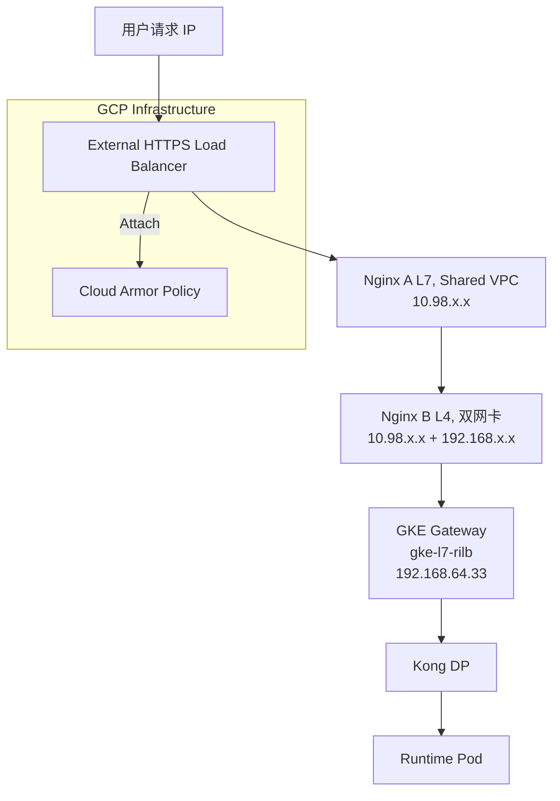
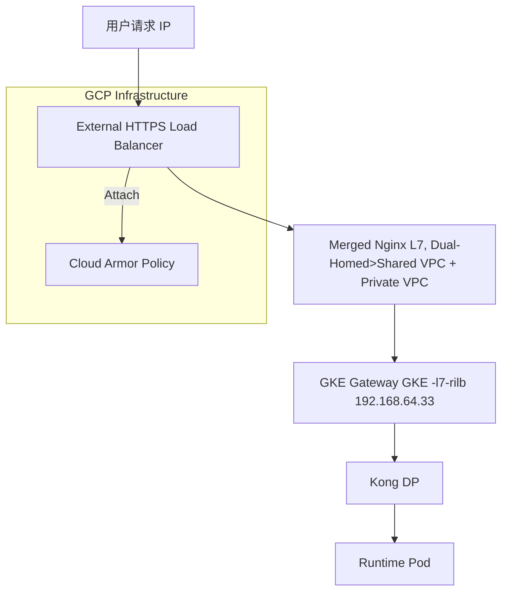

# 架构优化建议：实现 Cloud Armor 精细化控制与蓝绿部署

本文档旨在分析当前架构的局限性,并提出一个更现代化、更简洁的架构方案,以满足为特定API应用Cloud Armor规则以及实现蓝绿/金丝雀部署的需求。

## 1. 核心目标分析

1.  **精细化安全防护**: 希望对单个或某几个特定的API接口(例如 `/api_name1/v1/`)应用Cloud Armor规则,而不是对所有流量生效。
2.  **现代化部署**: 希望能够实现蓝绿部署或金丝雀发布,以降低发布风险,平滑升级。

## 2. 当前架构的挑战

当前的流量路径为: `用户 -> Nginx A (L7) -> Nginx B (L4) -> GKE Gateway (内部) -> Kong -> 服务`。

这个架构在实现上述目标时面临几个主要问题:

*   **Cloud Armor应用点太深**: Cloud Armor策略通常附加在Google Cloud的外部负载均衡器(External Load Balancer)的后端服务(Backend Service)上。在你当前的架构中,最外层是运行在GCE上的Nginx A,它不是一个GCP纳管的负载均衡器,因此无法直接附加Cloud Armor策略。你只能在后端的内部GKE Gateway上附加,但这已经太晚了,流量已经穿透了你的前两层Nginx,不符合在边缘网络进行安全防护的最佳实践。
*   **架构过于复杂**: `A -> B -> Gateway` 的链条增加了延迟、运维成本和潜在的故障点。Nginx B的角色仅仅是做了一层TCP转发来跨越VPC,这个功能完全可以被GCP的负载均衡器原生能力替代。
*   **部署策略难以实现**: 在当前架构下实现金丝雀部署非常困难。你需要在Nginx A层面手动维护复杂的路由规则(例如使用 `split_clients` 模块),或者在Kong层面进行配置,控制点分散,难以自动化和维护。


# 架构优化方案 (保留Nginx和Kong): 实现Cloud Armor与金丝雀部署

根据补充说明,我们必须在保留现有 Nginx 和 Kong 组件的基础上进行优化。此方案旨在不改变核心组件的情况下,通过调整外围基础设施和Nginx配置,实现精细化的Cloud Armor防护和金丝雀部署。

## 1. 核心思路

当前架构的核心挑战在于最前端的 `TCP GLB A` 是一个4层负载均衡器,它无法理解HTTP流量,因此不能附加Cloud Armor策略。同时,流量控制完全依赖于Nginx的静态配置,难以实现动态的流量切分。

**我们的解决思路是:**

1.  **升级负载均衡器**: 将4层的TCP/SSL代理负载均衡器替换为7层的**外部HTTPS负载均衡器**。这是实现Cloud Armor防护的**关键前提**。
2.  **利用Nginx A**: 将Nginx A作为实现金丝雀部署的**流量切分控制点**。

**优化后的架构图:**



## 2. 如何实现目标

### 2.1 解决 Cloud Armor 精细化防护问题

通过将最前端的负载均衡器从TCP GLB更换为外部HTTPS负载均衡器,我们就可以利用其强大的功能来附加Cloud Armor策略。

**实现步骤:**

1.  **替换负载均衡器**: 在GCP中,删除当前的TCP代理负载均衡器,创建一个**外部HTTPS负载均衡器**。
2.  **配置后端服务**: 将这个新的HTTPS LB的后端服务指向包含您的Nginx A虚拟机的实例组。
3.  **创建Cloud Armor策略**: 在Cloud Armor中创建安全策略。关键在于,要使用**自定义规则(Custom Rules)**,通过CEL表达式(Common Expression Language)来匹配特定的API路径。
4.  **编写CEL规则**: 在策略中添加规则,例如:
    *   **规则1: 防护api_name1**: `request.path.matches('/api_name1_version/v1/.*')`
        *   你可以为这条规则设置一个单独的action,比如 `deny(403)` 或者应用一个特定的速率限制。
    *   **规则2: 防护api_name2**: `request.path.matches('/api_name2_version/v1/.*')`
        *   可以设置另一个不同的action。
    *   **默认规则**: 允许所有其他请求(`true`)。
5.  **附加策略**: 将配置好规则的Cloud Armor策略附加到HTTPS负载均衡器的后端服务上。

通过这种方式,即使所有流量都流向同一个Nginx A实例组,Cloud Armor也能在流量到达Nginx之前,基于URL路径进行精确的识别和防护,完美实现您的“个别API应用规则”的需求。

### 2.2 在 Nginx A 实现金丝雀部署

在保留Nginx A的前提下,它将是实现金丝雀部署最理想的控制点。

**实现步骤:**

1.  **在GKE中部署Canary版本**: 部署您的API的新版本(v2),并让Kong和GKE Gateway能通过一个新的端口或Service访问到它。
2.  **在Nginx B中增加Canary通道**: 在Nginx B的`stream`配置中,增加一个新的`server`块,监听一个新的端口(例如`8082`),并将其`proxy_pass`到GKE中Canary版本的新地址。

    **Nginx B `conf.d/` 新增配置 `canary.conf`:**
    ```nginx
    server {
        listen 8082; # Canary 流量的新端口
        ssl_preread on;
        proxy_connect_timeout 5s;
        proxy_pass 192.168.64.34:443; # 假设这是Canary版本的GKE Gateway/Service IP
        access_log /opt/log/canary.log basic;
    }
    ```

3.  **在Nginx A中配置流量切分**: 使用Nginx的`split_clients`模块,可以根据客户端IP、Cookie或请求ID等变量的hash值,将流量按比例分配到不同的后端(upstream)。

    **Nginx A `nginx.conf` 修改:**
    ```nginx
    http {
        # ... 其他配置 ...

        # 1. 定义stable和canary两个上游
        upstream api_name1_stable {
            server 10.98.0.188:8081; # 指向Nginx B的稳定版端口
        }
        upstream api_name1_canary {
            server 10.98.0.188:8082; # 指向Nginx B的金丝雀端口
        }

        # 2. 定义流量分割规则
        # 基于客户端IP和请求ID生成一个hash key,确保同一用户的请求一致性
        split_clients "$remote_addr$request_id" $api_name1_backend {
            10%     api_name1_canary; # 10%的流量到金丝雀
            *       api_name1_stable; # 剩余的90%到稳定版
        }

        server {
            # ... server的其他配置 ...

            # 3. 在location中使用变量来动态选择上游
            location /api_name1_version/v1/ {
                proxy_pass https://$api_name1_backend; # 使用变量$api_name1_backend
                proxy_set_header Host www.aibang.com;
                proxy_set_header X-Real-IP $remote_addr;
            }
        }
    }
    ```

通过调整`split_clients`块中的百分比,您就可以精确控制进入金丝雀版本的流量,从1%到10%,再到50%,最终完成100%的切换,实现了平滑、安全的金丝雀发布。

## 3. 总结

此方案在完全尊重您现有架构组件的基础上:

*   通过**更换负载均衡器类型**和**利用Cloud Armor的CEL表达式**,在网络边缘实现了对特定API的精细化安全防护。
*   通过**在Nginx A和B上增加旁路通道**和**利用Nginx A的`split_clients`模块**,实现了灵活、可控的金丝雀部署策略。

这套方案兼顾了架构约束和功能需求,具有很高的可行性


# 简化架构方案：合并Nginx A与B

本文档基于前一方案,探讨并提出了一个更优的简化方案: 将组件A (L7 Nginx) 和组件B (L4 Nginx) 合并为一个单一的、双网卡的Nginx实例。这进一步简化了流量路径,降低了运维成本和延迟。

## 1. 核心思路

前一方案中,我们保留了Nginx A和Nginx B两个独立的组件。Nginx A负责L7路由,Nginx B负责L4转发以跨越VPC。但实际上,我们可以让Nginx A直接拥有跨越VPC的能力,从而让Nginx B变得冗余。

**核心变更**: 为Nginx A所在的GCE虚拟机实例配置**两张网卡(Dual-NIC)**:

1.  **nic0**: 连接到当前的Shared VPC (`10.98.x.x` 网段),用于接收来自外部HTTPS负载均衡器的流量。
2.  **nic1**: 连接到后端的Private GKE VPC (`192.168.x.x` 网段),用于直接与GKE Gateway通信。

这样,Nginx A就可以直接将请求`proxy_pass`到GKE Gateway,不再需要经过Nginx B中转。

**最终简化架构图:**



## 2. 配置变更详情

这个架构的简化带来了Nginx配置的极大简化。

*   **Nginx B被完全移除**: 它的所有配置 (`stream`模块) 都不再需要。
*   **Nginx A的配置被简化**: 只需要修改`proxy_pass`的目标地址即可。

**Nginx A (Merged) 的 `location` 配置变化:**

**旧配置 (指向Nginx B):**
```nginx
location /api_name1_version/v1/ {
    proxy_pass https://10.98.0.188:8081/; # 目标是Nginx B
    proxy_set_header Host www.aibang.com;
    proxy_set_header X-Real-IP $remote_addr;
}
```

**新配置 (直接指向GKE Gateway):**
```nginx
location /api_name1_version/v1/ {
    # 目标直接是后端的GKE Gateway, 因为现在我们和它在同一个网络
    proxy_pass https://192.168.64.33:443; 
    proxy_set_header Host www.aibang.com;
    proxy_set_header X-Real-IP $remote_addr;
}
```

## 3. 在简化架构中实现核心目标

在这个更简洁的架构中,实现你的核心目标变得更加直接。

### 3.1 Cloud Armor 精细化防护

**实现方式不变。**

Cloud Armor的策略仍然附加在最前端的外部HTTPS负载均衡器上。它在流量到达Nginx之前就已经完成了基于路径的规则匹配和防护。这个机制不受Nginx层简化的影响,依然完美有效。

### 3.2 金丝雀部署

**实现方式变得更简单。**

我们不再需要在Nginx B上做任何配置,所有的流量切分逻辑完全收敛在合并后的Nginx A中。

**Nginx A (Merged) 的金丝雀配置:**
```nginx
http {
    # ... 其他配置 ...

    # 1. 上游直接定义为GKE中的服务地址
    upstream api_name1_stable {
        server 192.168.64.33:443; # 指向GKE的稳定版服务
    }
    upstream api_name1_canary {
        server 192.168.64.34:443; # 指向GKE的金丝雀服务
    }

    # 2. 流量分割规则保持不变
    split_clients "$remote_addr$request_id" $api_name1_backend {
        10%     api_name1_canary;
        *       api_name1_stable;
    }

    server {
        # ... server的其他配置 ...

        # 3. location的proxy_pass直接使用变量
        location /api_name1_version/v1/ {
            proxy_pass https://$api_name1_backend;
            proxy_set_header Host www.aibang.com;
            proxy_set_header X-Real-IP $remote_addr;
        }
    }
}
```
如你所见,我们不再需要为Nginx B配置`8082`端口,整个流程的配置和排错都集中在一个地方,清晰明了。

## 4. 简化后的优势

*   **极致简化**: 减少了一个需要维护、打补丁、监控和付费的组件及虚拟机。
*   **降低延迟**: 消除了一次网络转发,降低了请求的端到端延迟。
*   **降低成本**: 节省了Nginx B实例的虚拟机费用。
*   **配置收敛**: 所有的路由和部署策略都集中在单一的Nginx实例中,极大地简化了配置管理。

## 5. 结论

将Nginx A和B合并为一个双网卡的Nginx实例,是前一个方案的理想演进。它在解决了Cloud Armor和金丝雀部署需求的同时,将架构的简洁性、性能和可维护性提升到了一个新的水平。**这是我们最推荐的方案。**%  

