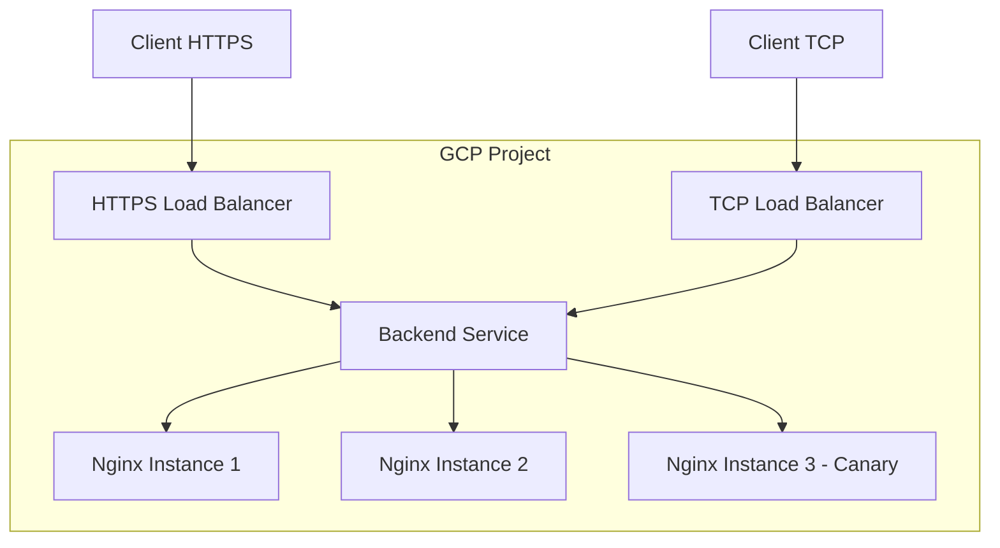
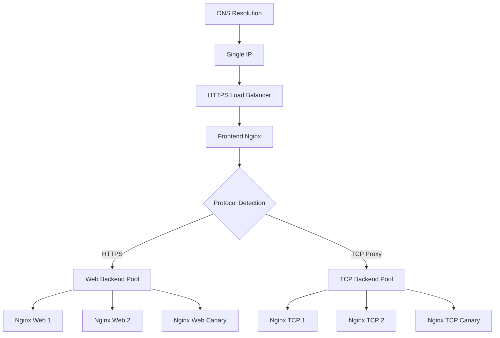
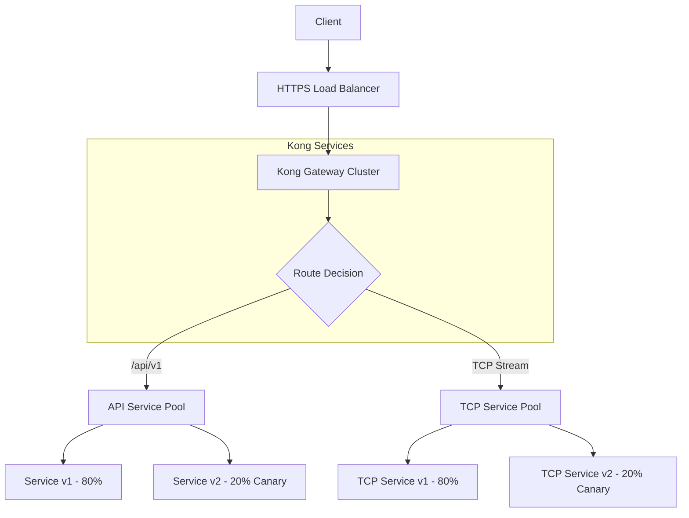
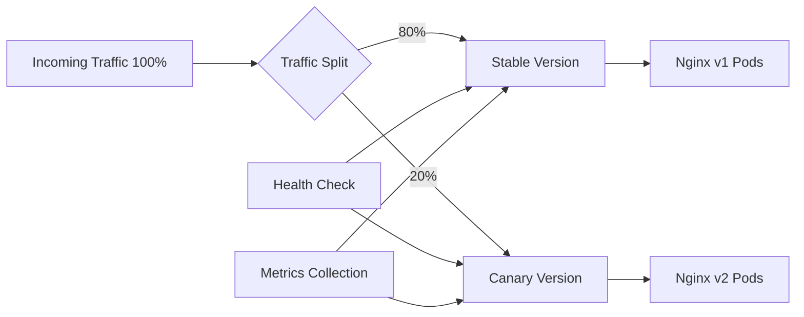
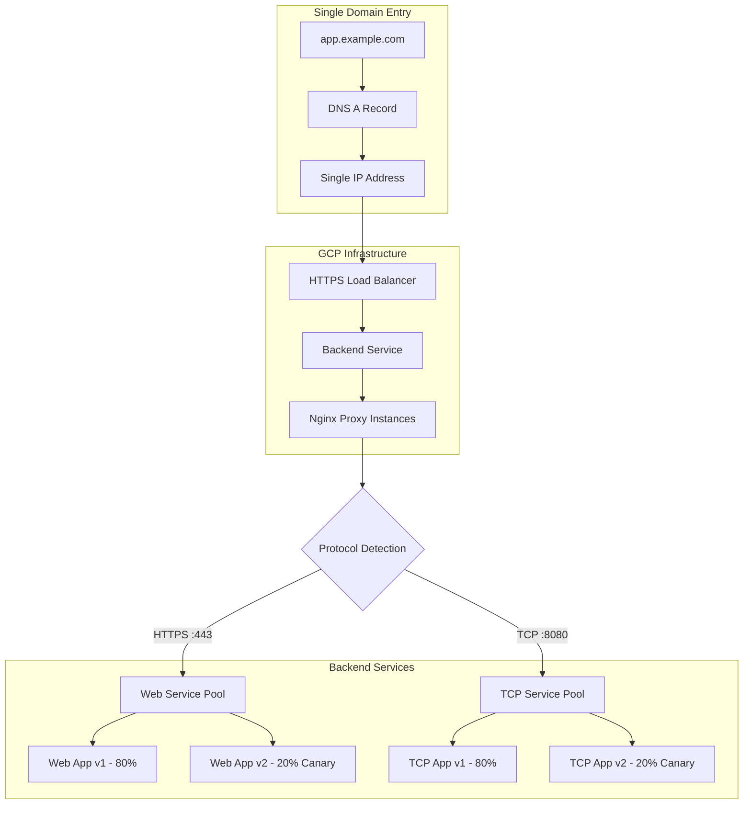
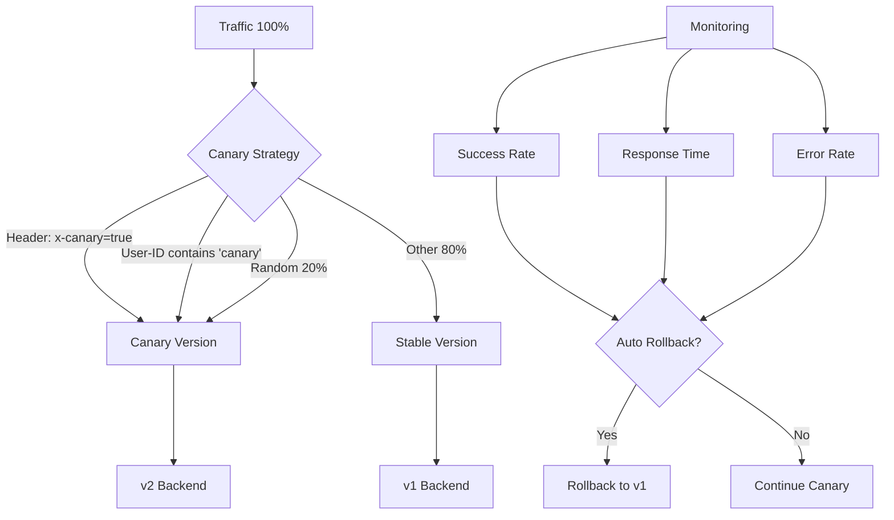

- 需要明确自己的目标是using https + Cloud armor 
	- the cloud armor only for Some independent or single common api 
- The way of verification is already 
	- multiple https load balance + single backend ==> using nginx Listen different service_name then proxy_pass to different backend service 
	- How to compress

我想了解对于GCP 平台来说 其一个load balancing 有没有可能能同时支持TCP和https 这样我是否可以将两个域名都解析在这个load balance 上面 其实我想实现的是一个入口 同时支持tcp https 这样的话，我后面的backend service 可以是一个nginx ? 或者多个nginx 来实现 其实我想实现的是金丝雀的部署

在GCP平台上，传统的单个Load Balancer无法同时处理TCP和HTTPS流量，但可以通过多种架构方案来实现你的需求。

## GCP Load Balancer类型对比

|Load Balancer类型|支持协议|层级|用途|
|---|---|---|---|
|HTTP(S) Load Balancer|HTTP/HTTPS|L7|Web应用|
|TCP Proxy Load Balancer|TCP|L4|TCP流量代理|
|Network Load Balancer|TCP/UDP|L4|高性能网络流量|
|Internal Load Balancer|TCP/UDP|L4|内部流量|

## 实现方案

### 方案1: 多Load Balancer + 共享Backend



**配置示例:**

```bash
# HTTPS Load Balancer
gcloud compute url-maps create web-map \
    --default-service=nginx-backend-service

gcloud compute target-https-proxies create web-proxy \
    --url-map=web-map \
    --ssl-certificates=your-ssl-cert

gcloud compute forwarding-rules create web-forwarding-rule \
    --global \
    --target-https-proxy=web-proxy \
    --ports=443

# TCP Load Balancer  
gcloud compute target-pools create tcp-pool \
    --region=us-central1

gcloud compute forwarding-rules create tcp-forwarding-rule \
    --region=us-central1 \
    --ports=8080 \
    --target-pool=tcp-pool
```

### 方案2: 单一入口点 + Nginx反向代理



**Frontend Nginx配置:**

```nginx
# /etc/nginx/nginx.conf
stream {
    upstream tcp_backend {
        server nginx-tcp-1:8080 weight=8;
        server nginx-tcp-2:8080 weight=8;
        server nginx-tcp-canary:8080 weight=2;  # 20% canary traffic
    }
    
    server {
        listen 8080;
        proxy_pass tcp_backend;
        proxy_timeout 3s;
        proxy_responses 1;
    }
}

http {
    upstream web_backend {
        server nginx-web-1:80 weight=8;
        server nginx-web-2:80 weight=8;
        server nginx-web-canary:80 weight=2;  # 20% canary traffic
    }
    
    server {
        listen 80;
        location / {
            proxy_pass http://web_backend;
            proxy_set_header Host $host;
            proxy_set_header X-Real-IP $remote_addr;
        }
    }
}
```

### 方案3: 使用Kong作为统一网关



**Kong配置:**

```yaml
# kong.yml
services:
- name: web-service-v1
  url: http://nginx-v1-cluster
  tags: [production]
  
- name: web-service-v2
  url: http://nginx-v2-cluster  
  tags: [canary]

routes:
- name: web-route
  service: web-service-v1
  paths: ["/"]
  
- name: web-canary-route
  service: web-service-v2
  paths: ["/"]
  
plugins:
- name: canary
  config:
    upstream_host: nginx-v2-cluster
    percentage: 20
    hash_on: header
    hash_header: user-id
```

## 金丝雀部署实现

### Kubernetes + Istio方案

```yaml
# canary-deployment.yaml
apiVersion: networking.istio.io/v1alpha3
kind: VirtualService
metadata:
  name: nginx-canary
spec:
  http:
  - match:
    - headers:
        canary:
          exact: "true"
    route:
    - destination:
        host: nginx-service
        subset: canary
  - route:
    - destination:
        host: nginx-service
        subset: stable
      weight: 80
    - destination:
        host: nginx-service
        subset: canary
      weight: 20
---
apiVersion: networking.istio.io/v1alpha3
kind: DestinationRule
metadata:
  name: nginx-destination
spec:
  host: nginx-service
  subsets:
  - name: stable
    labels:
      version: v1
  - name: canary
    labels:
      version: v2
```

### 流量分配策略



## 推荐架构

基于你的需求，建议使用**方案2**结合GKE:

```bash
# 部署脚本示例
kubectl apply -f - <<EOF
apiVersion: apps/v1
kind: Deployment
metadata:
  name: frontend-nginx
spec:
  replicas: 3
  selector:
    matchLabels:
      app: frontend-nginx
  template:
    spec:
      containers:
      - name: nginx
        image: nginx:1.21
        ports:
        - containerPort: 80
        - containerPort: 8080
        volumeMounts:
        - name: config
          mountPath: /etc/nginx/nginx.conf
          subPath: nginx.conf
      volumes:
      - name: config
        configMap:
          name: nginx-config
---
apiVersion: v1
kind: Service
metadata:
  name: frontend-nginx-service
spec:
  selector:
    app: frontend-nginx
  ports:
  - name: http
    port: 80
    targetPort: 80
  - name: tcp
    port: 8080
    targetPort: 8080
  type: LoadBalancer
EOF
```

这种方案可以实现:

- 单一入口IP
- 同时支持HTTP/HTTPS和TCP协议
- 灵活的金丝雀部署
- 易于监控和管理

多Load Balancer + 共享Backend 如果是这样的话，我没法对域名做出区分 我想同一个域名访问我的这个lb

你说得对，多Load Balancer方案确实无法实现同一域名的统一访问。让我重新设计一个更符合你需求的方案。

## 推荐方案: 单一HTTPS Load Balancer + Stream代理

### 架构设计



### 实现方案

#### 1. GCP配置

```bash
# 创建健康检查
gcloud compute health-checks create http nginx-health-check \
    --port=80 \
    --request-path=/health

# 创建实例组
gcloud compute instance-groups managed create nginx-proxy-group \
    --base-instance-name=nginx-proxy \
    --template=nginx-proxy-template \
    --size=3 \
    --zone=us-central1-a

# 创建backend service
gcloud compute backend-services create nginx-backend-service \
    --protocol=HTTP \
    --health-checks=nginx-health-check \
    --global

# 添加backend
gcloud compute backend-services add-backend nginx-backend-service \
    --instance-group=nginx-proxy-group \
    --instance-group-zone=us-central1-a \
    --global

# 创建URL map支持多端口
gcloud compute url-maps create unified-map \
    --default-service=nginx-backend-service

# 创建SSL证书
gcloud compute ssl-certificates create app-ssl-cert \
    --domains=app.example.com

# 创建HTTPS proxy
gcloud compute target-https-proxies create unified-https-proxy \
    --url-map=unified-map \
    --ssl-certificates=app-ssl-cert

# 创建转发规则
gcloud compute forwarding-rules create unified-forwarding-rule \
    --global \
    --target-https-proxy=unified-https-proxy \
    --ports=443
```

#### 2. Nginx代理配置

```nginx
# /etc/nginx/nginx.conf
worker_processes auto;
error_log /var/log/nginx/error.log;

events {
    worker_connections 1024;
}

# TCP/UDP 代理配置
stream {
    # TCP服务的负载均衡
    upstream tcp_backend_v1 {
        server tcp-app-v1-1:8080 weight=4;
        server tcp-app-v1-2:8080 weight=4;
    }
    
    upstream tcp_backend_v2 {
        server tcp-app-v2-1:8080 weight=1;
    }
    
    # 根据客户端IP进行canary分流
    map $remote_addr $tcp_backend {
        ~^192\.168\.1\. tcp_backend_v2;  # 特定IP走canary
        default tcp_backend_v1;
    }
    
    # TCP监听端口8080
    server {
        listen 8080;
        proxy_pass $tcp_backend;
        proxy_timeout 3s;
        proxy_responses 1;
        proxy_bind $remote_addr transparent;
    }
    
    # 日志配置
    access_log /var/log/nginx/tcp_access.log;
}

# HTTP代理配置
http {
    include /etc/nginx/mime.types;
    default_type application/octet-stream;
    
    # 日志格式
    log_format main '$remote_addr - $remote_user [$time_local] "$request" '
                   '$status $body_bytes_sent "$http_referer" '
                   '"$http_user_agent" "$http_x_forwarded_for" '
                   'backend="$upstream_addr" response_time="$upstream_response_time"';
    
    access_log /var/log/nginx/access.log main;
    
    # Web服务的负载均衡
    upstream web_backend_v1 {
        server web-app-v1-1:80 weight=4;
        server web-app-v1-2:80 weight=4;
    }
    
    upstream web_backend_v2 {
        server web-app-v2-1:80 weight=1;
    }
    
    # Canary部署策略
    map $http_user_id $web_backend {
        ~*canary web_backend_v2;
        default web_backend_v1;
    }
    
    # 基于header的canary分流
    map $http_x_canary $canary_backend {
        "true" web_backend_v2;
        default web_backend_v1;
    }
    
    # 随机20%流量到canary
    split_clients $remote_addr$http_user_agent $variant {
        20% canary;
        * stable;
    }
    
    map $variant $final_backend {
        canary web_backend_v2;
        default web_backend_v1;
    }
    
    # 健康检查端点
    server {
        listen 80;
        location /health {
            access_log off;
            return 200 "healthy\n";
            add_header Content-Type text/plain;
        }
    }
    
    # 主服务配置
    server {
        listen 80;
        server_name app.example.com;
        
        # Web流量处理
        location / {
            # 使用最终的backend选择
            proxy_pass http://$final_backend;
            
            # 代理头设置
            proxy_set_header Host $host;
            proxy_set_header X-Real-IP $remote_addr;
            proxy_set_header X-Forwarded-For $proxy_add_x_forwarded_for;
            proxy_set_header X-Forwarded-Proto $scheme;
            
            # 超时设置
            proxy_connect_timeout 5s;
            proxy_send_timeout 10s;
            proxy_read_timeout 10s;
            
            # 添加版本标识
            add_header X-Backend-Version $upstream_addr always;
        }
        
        # API路径特殊处理
        location /api/ {
            # API可以有不同的canary策略
            proxy_pass http://$canary_backend;
            proxy_set_header Host $host;
            proxy_set_header X-Real-IP $remote_addr;
        }
        
        # 管理接口
        location /admin/ {
            # 管理接口只走stable版本
            proxy_pass http://web_backend_v1;
            proxy_set_header Host $host;
        }
    }
}
```

#### 3. Docker Compose部署示例

```yaml
# docker-compose.yml
version: '3.8'
services:
  nginx-proxy:
    image: nginx:1.21
    ports:
      - "80:80"
      - "8080:8080"
    volumes:
      - ./nginx.conf:/etc/nginx/nginx.conf:ro
    depends_on:
      - web-app-v1-1
      - web-app-v2-1
      - tcp-app-v1-1
      - tcp-app-v2-1
    networks:
      - app-network

  # Web应用 v1
  web-app-v1-1:
    image: your-web-app:v1
    environment:
      - VERSION=v1
    networks:
      - app-network
      
  web-app-v1-2:
    image: your-web-app:v1
    environment:
      - VERSION=v1
    networks:
      - app-network

  # Web应用 v2 (Canary)
  web-app-v2-1:
    image: your-web-app:v2
    environment:
      - VERSION=v2
    networks:
      - app-network

  # TCP应用 v1
  tcp-app-v1-1:
    image: your-tcp-app:v1
    ports:
      - "8080"
    networks:
      - app-network
      
  tcp-app-v1-2:
    image: your-tcp-app:v1
    ports:
      - "8080"
    networks:
      - app-network

  # TCP应用 v2 (Canary)
  tcp-app-v2-1:
    image: your-tcp-app:v2
    ports:
      - "8080"
    networks:
      - app-network

networks:
  app-network:
    driver: bridge
```

#### 4. Kubernetes部署配置

```yaml
# k8s-deployment.yaml
apiVersion: v1
kind: ConfigMap
metadata:
  name: nginx-config
data:
  nginx.conf: |
    # 上面的nginx配置内容
---
apiVersion: apps/v1
kind: Deployment
metadata:
  name: nginx-proxy
spec:
  replicas: 3
  selector:
    matchLabels:
      app: nginx-proxy
  template:
    metadata:
      labels:
        app: nginx-proxy
    spec:
      containers:
      - name: nginx
        image: nginx:1.21
        ports:
        - containerPort: 80
        - containerPort: 8080
        volumeMounts:
        - name: config
          mountPath: /etc/nginx/nginx.conf
          subPath: nginx.conf
        livenessProbe:
          httpGet:
            path: /health
            port: 80
          initialDelaySeconds: 30
          periodSeconds: 10
        readinessProbe:
          httpGet:
            path: /health
            port: 80
          initialDelaySeconds: 5
          periodSeconds: 5
      volumes:
      - name: config
        configMap:
          name: nginx-config
---
apiVersion: v1
kind: Service
metadata:
  name: nginx-proxy-service
  annotations:
    cloud.google.com/load-balancer-type: "External"
spec:
  selector:
    app: nginx-proxy
  ports:
  - name: http
    port: 80
    targetPort: 80
  - name: tcp
    port: 8080
    targetPort: 8080
  type: LoadBalancer
```

### 访问方式

|服务类型|访问地址|协议|用途|
|---|---|---|---|
|Web服务|https://app.example.com|HTTPS|Web应用访问|
|TCP服务|app.example.com:8080|TCP|TCP服务访问|
|API服务|https://app.example.com/api/|HTTPS|API接口|
|管理接口|https://app.example.com/admin/|HTTPS|管理后台|

### 金丝雀发布策略



这个方案实现了:

- 单一域名 `app.example.com`
- 同时支持HTTPS和TCP协议
- 灵活的金丝雀部署策略
- 统一的入口点管理