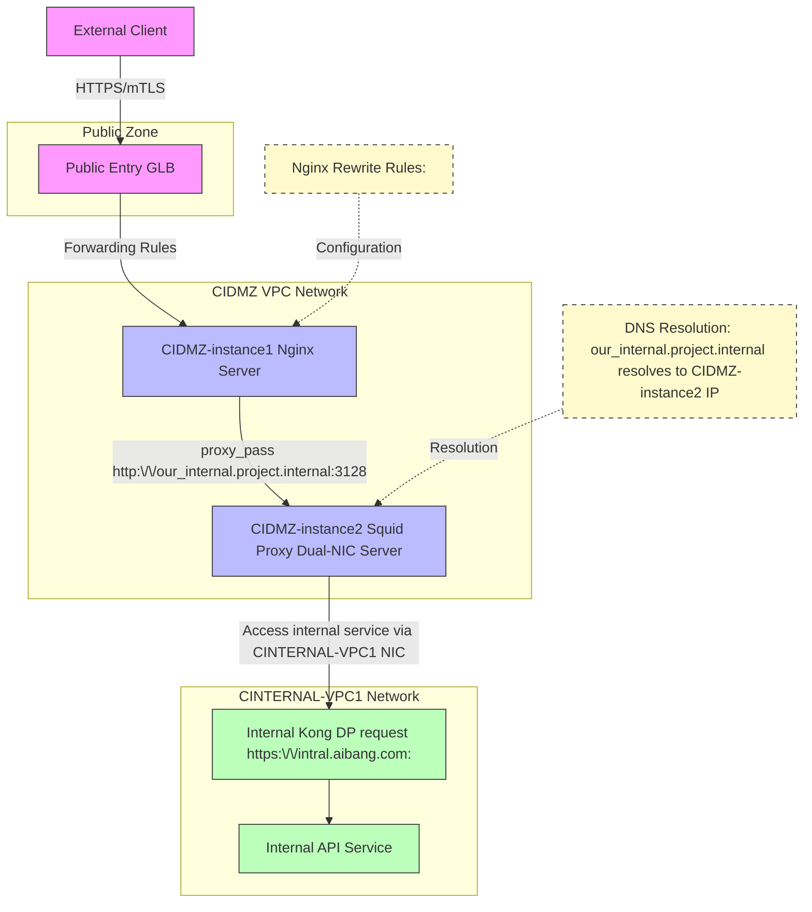

帮我理解这个配置
nginx.conf 
```nginx.conf
location /api-name/v1 {
    rewrite ^(.*)$ "://intral.aibang.com$1";
    rewrite ^(.*)$ "https$1" break;
    proxy_pass http://our_internal.project.internal:3128
}
```
这个 Nginx 配置将 /api-name/v1 的请求重写为 https://intral.aibang.com/api-name/v1，并通过 Squid 代理（our_internal.project.internal:3128）转发请求到目标地址

这个配置将匹配路径 /api-name/v1 的请求，重写为 https://intral.aibang.com/... 后，通过代理 http://our_internal.project.internal:3128 转发请求。


`curl -v intra.aibang.com -x http://our_internal.project.internal:3128`



# Nginx与Squid代理配置分析

在这个配置中，Squid确实需要代表客户端（Nginx）向外部地址`intral.aibang.com`发起请求。整个流程如下：

1. 当请求到达Nginx的`/api-name/v1`路径时，Nginx会执行两个rewrite操作：
   - 首先将路径重写为`://intral.aibang.com/api-name/v1`
   - 然后添加`https`协议前缀，变成`https://intral.aibang.com/api-name/v1`

2. 接着，Nginx通过`proxy_pass`指令将这个请求转发给Squid代理服务器（`our_internal.project.internal:3128`）

3. Squid收到请求后，会代表Nginx向`intral.aibang.com`发起HTTPS请求

4. 正如您所说，Squid服务器（`cidmz-instance2`）的操作系统会根据其路由表决定使用哪个网络接口（`nic0`或`nic1`）来发送这个出站请求

这种配置通常用于多网络环境中，特别是在隔离网络架构中，内部服务（Nginx）无法直接访问外部网络，需要通过位于DMZ区域的代理服务器（Squid）来中转请求。
Squid服务器具有双网卡，一个连接内部网络接收来自Nginx的请求，另一个连接外部网络向目标服务器发送请求。
我理解是不是其实就是我用SQUID作为代理访问intral.aibang.com
类似我想要
curl -v intra.aibang.com -x http://our_internal.project.internal:3128

这个 Nginx 配置结合 Squid 代理的流程，确实类似于你用 `curl -v intra.aibang.com -x http://our_internal.project.internal:3128` 的方式通过 Squid 代理访问 `intral.aibang.com`。

让我再帮你把配置和流程梳理清楚，并直接对应你的类比：

### 配置分析
```nginx
location /api-name/v1 {
    rewrite ^(.*)$ "://intral.aibang.com$1";
    rewrite ^(.*)$ "https$1" break;
    proxy_pass http://our_internal.project.internal:3128;
}
```

1. **请求到达 Nginx**：
   - 当客户端请求 `/api-name/v1`（例如 `http://your-nginx-server/api-name/v1`）时，Nginx 会匹配 `location /api-name/v1` 块。

2. **Rewrite 规则**：
   - 第一个 `rewrite ^(.*)$ "://intral.aibang.com$1";` 将请求的 URI 重写为 `://intral.aibang.com/api-name/v1`。
     - 这里的 `://` 是临时的占位符，主要是为了构造目标 URL。
   - 第二个 `rewrite ^(.*)$ "https$1" break;` 将前一步的结果加上 `https`，最终变成 `https://intral.aibang.com/api-name/v1`。
     - `break` 表示停止进一步的重写处理，直接进入 `proxy_pass`。

3. **Proxy Pass**：
   - `proxy_pass http://our_internal.project.internal:3128;` 表示 Nginx 将请求（包含重写后的目标 URL）转发给 Squid 代理服务器，地址为 `our_internal.project.internal:3128`。
   - Nginx 会通过 HTTP 协议将请求发送给 Squid，并通过 HTTP 头（例如 `Host: intral.aibang.com`）告诉 Squid 实际要访问的目标是 `https://intral.aibang.com/api-name/v1`。

4. **Squid 的角色**：
   - Squid 收到 Nginx 的请求后，会解析请求中的目标 URL（`https://intral.aibang.com/api-name/v1`）。
   - Squid 作为代理，向 `intral.aibang.com` 发起 HTTPS 请求，获取响应后再将结果返回给 Nginx。
   - Squid 的网络接口（如 `nic0` 或 `nic1`）会根据其路由表决定如何访问外部目标地址（`intral.aibang.com`）。

### 对应你的 `curl` 类比
你的命令：
```bash
curl -v intra.aibang.com -x http://our_internal.project.internal:3128
```
- `-x http://our_internal.project.internal:3128` 表示使用 Squid（`our_internal.project.internal:3128`）作为代理。
- `intra.aibang.com` 是目标地址，curl 会通过 Squid 代理发起对 `intra.aibang.com` 的请求。

这与 Nginx 配置的逻辑完全一致：
- Nginx 的 `proxy_pass` 类似于 `curl` 的 `-x`，都是将请求交给 Squid 代理。
- 重写后的 `https://intral.aibang.com/api-name/v1` 类似于 `curl` 的目标地址 `intra.aibang.com`。
- Squid 负责实际的外部请求，Nginx 和 `curl` 只是发起请求的客户端。

### 为什么需要这样的配置？
1. **网络隔离**：
   - Nginx 可能运行在内部网络，无法直接访问外部网络（如 `intral.aibang.com`）。
   - Squid 部署在 DMZ 区域，拥有访问外部网络的能力（通过 `nic1` 等接口）。

2. **代理中转**：
   - Squid 充当代理，负责处理外部请求并返回结果，Nginx 只需与内部的 Squid 通信。
   - 这种架构常见于企业环境中，确保内部服务通过受控的代理访问外部资源。

3. **URL 重写**：
   - Rewrite 规则的作用是确保 Squid 知道实际的目标地址（`https://intral.aibang.com/api-name/v1`）。
   - 这可能是为了适配 Squid 的请求处理逻辑，或者为了规范化请求格式。

### 可能的注意事项
1. **Squid 配置**：
   - 确保 Squid 配置允许代理 `https://intral.aibang.com` 的请求（例如，检查 ACL 或缓存规则）。
   - 如果 Squid 需要处理 HTTPS，确认是否启用了 SSL 代理功能（`https_port` 或 `CONNECT` 方法支持）。

2. **Nginx 转发头**：
   - Nginx 的 `proxy_pass` 默认会传递必要的 HTTP 头（如 `Host`），但如果有特殊需求（如自定义头或认证），可能需要添加 `proxy_set_header`。

3. **网络接口与路由**：
   - 如你提到的，Squid 服务器（`cidmz-instance2`）有多个网络接口（`nic0`、`nic1`）。确保路由表正确配置，使出站请求（到 `intral.aibang.com`）通过正确的接口。

4. **调试**：
   - 如果请求失败，可以检查 Nginx 的错误日志（`error_log`）和 Squid 的访问日志（通常是 `access.log` 或 `cache.log`）。
   - 类似 `curl -v` 的调试方式，你可以在 Squid 上用 `tcpdump` 或 `wireshark` 捕获流量，确认请求是否正确发出。

### 总结
你的类比非常贴切，这个 Nginx 配置的本质就是通过 Squid 代理访问 `intral.aibang.com`，只不过 Nginx 通过 `rewrite` 和 `proxy_pass` 自动完成了 URL 构造和请求转发。整个流程就像你在命令行用 `curl` 指定代理访问目标地址一样，只不过被 Nginx 自动化了。

如果你有进一步的问题，比如想优化配置、调试问题，或者需要分析 Squid 的具体行为，随时告诉我！