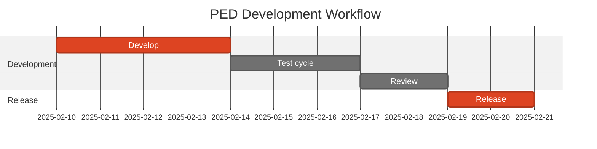
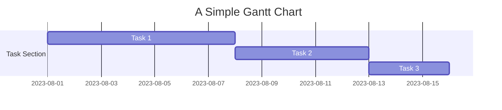
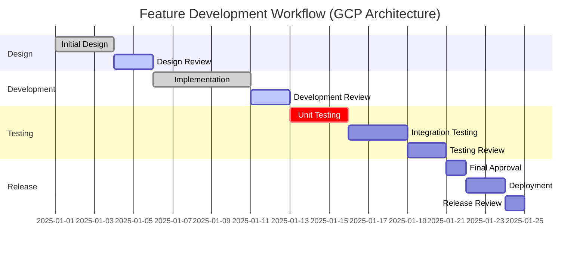
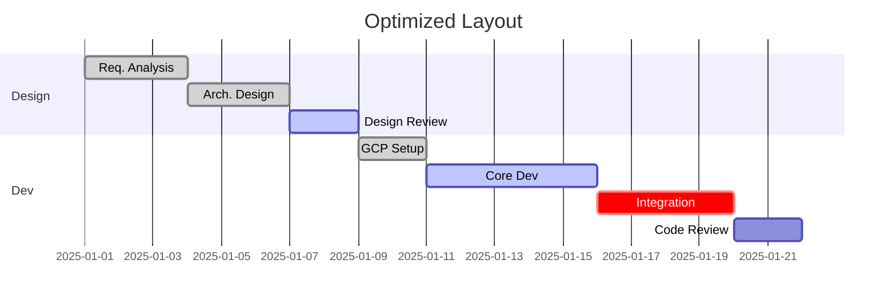
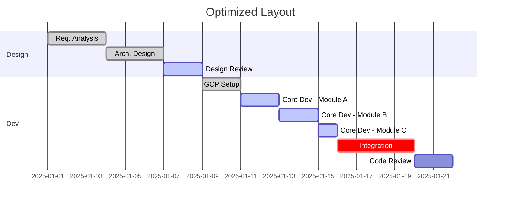
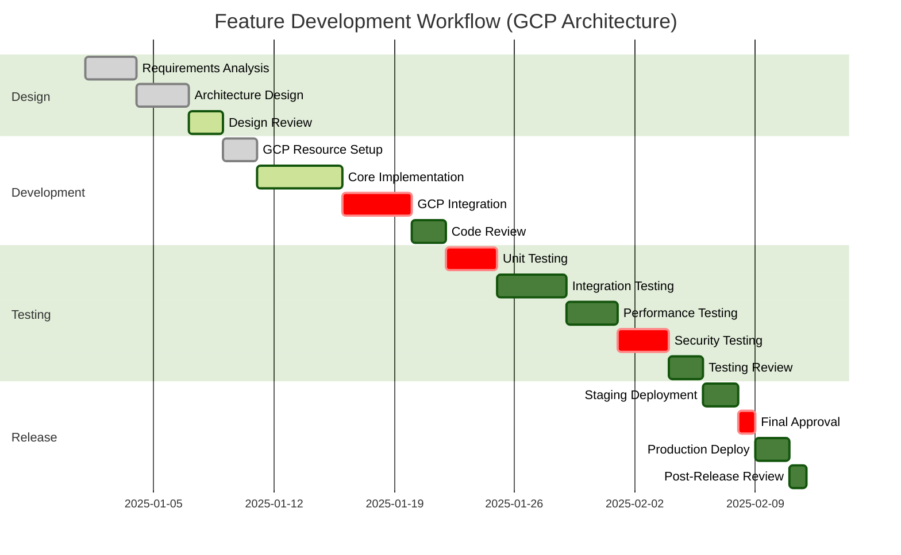
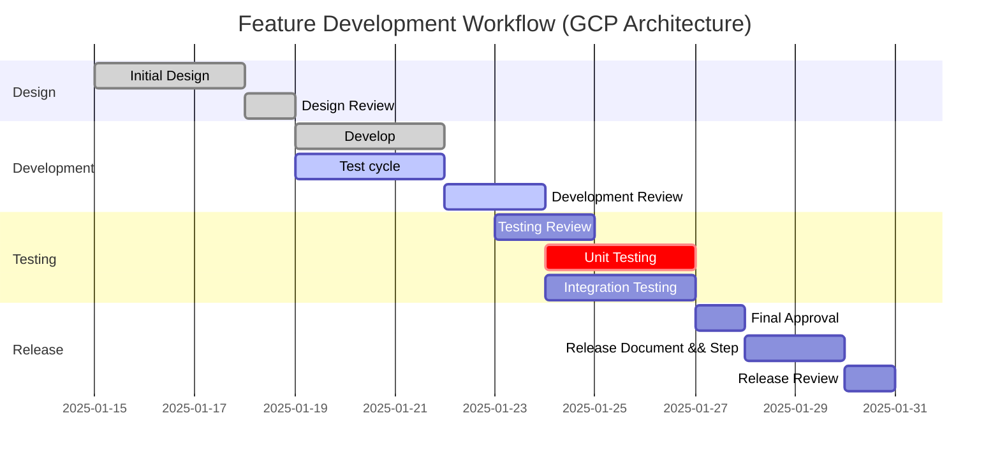

我想搞一个Markdown里面的甘特图的模版, 是一个基于GCP云平台的架构,我们每个功能也就是feture来的时候,基本都是下面这个流程
展示了 GCP 云平台功能开发的典型流程：Design、Develop、Testing 和 Release，并包含每个步骤的 Review 阶段
我关心这些进度的规划,所以帮我生成一个对应的markdown格式可以支持的甘特模版.最好有颜色之类的.可以好看一些

下面是一个基于 Markdown 和 Mermaid 的甘特图模板，展示了 GCP 云平台功能开发的典型流程：Design、Develop、Testing 和 Release，并包含每个步骤的 Review 阶段。这个模板支持颜色和清晰的时间规划。

---

---
- add sub graph

### **解释**
1. **任务类型**
   - `:done`：已完成的任务。
   - `:active`：当前正在进行的任务。
   - `:crit`：关键任务。
 - 任务状态标记：

:done - 已完成任务（通常显示为灰色或带有完成标记）
:active - 当前活动任务（通常显示为蓝色或突出显示）
:crit - 关键任务（通常显示为红色）
无标记 - 普通任务（使用默认颜色）通过这个看出来没行的格式
`    Code Review      :         dev4, after dev3, 2d`
解释上面一行

- `Code Review` 是一个任务名称
- `:         dev4` 是一个状态标记，用于表示任务的状态。后面可以跟,比如done 表示已完成，:active 表示当前进行中，:crit 表示关键任务 
- `after dev3` 表示 `dev4` 任务在 `dev3` 任务完成后开始。 所以这个不用定义单独的日期,而是直接写在前面的任务后面
- `2d` 表示任务持续 2 天。

其实可以总结为如果频繁调整时间,那么使用after 来表示时间,如果固定时间,那么直接写日期就行

1. **任务时间**
   - 使用 `YYYY-MM-DD` 的时间格式。
   - 例如，`Design` 阶段从 `2025-01-01` 开始，持续 3 天。

2. **任务依赖**
   - 使用 `after` 表示任务依赖，比如 `Deployment` 任务在 `Final Approval` 完成后开始：`after rel1`。

3. **分组**
   - `section` 将任务分为模块（如 `Design`、`Development` 等）。

4. **颜色**
   - 不同任务状态使用不同的颜色，自动根据 Mermaid 配置呈现。

---

### **效果预览**
将上述代码保存为 `.md` 文件，在支持 Mermaid 渲染的工具（如 GitHub、Typora 或 VS Code 的 Mermaid 插件）中查看，即可生成一个可视化甘特图。

### **如何扩展**
- **新增步骤**：添加新的任务，使用类似的格式，如 `Documentation`。
- **调整时间**：修改每个任务的时间或持续天数，按需求规划。
- **不同任务状态**：灵活切换任务的状态（`done`、`active`、`crit` 等）。

在这个例子中：

default (默认): 这是 Mermaid 的默认主题，提供了一个简洁清晰的风格。
base: 一个非常基础的主题，几乎没有额外的样式。适合作为自定义样式的起点。你之前尝试的就是这个主题。
forest: 一个颜色更丰富的主题，灵感来源于森林，通常包含绿色和更深的色调。你成功应用了这个主题。
dark: 一个深色主题，背景为深色，文字为浅色。适合在暗色环境下查看或作为网站的夜间模式。
neutral: 一个中性主题，使用柔和的颜色，整体感觉比较平静。
simple: 一个非常简约的主题，线条纤细，颜色低调。

Design section 使用浅蓝色背景 (rgba(102, 187, 255, 0.2))
Development section 使用浅绿色背景 (rgba(102, 255, 153, 0.2))
Testing section 使用浅黄色背景 (rgba(255, 204, 102, 0.2))
Release section 使用浅红色背景 (rgba(255, 153, 170, 0.16))

