- [Claude](#claude)
- [API 平台接入类型详解](#api-平台接入类型详解)
  - [一、核心概念解析](#一核心概念解析)
    - [1. 什么是 API？](#1-什么是-api)
    - [2. 什么是 Container？](#2-什么是-container)
    - [3. API 与 Container 的关系](#3-api-与-container-的关系)
  - [二、你们平台的接入类型分析](#二你们平台的接入类型分析)
    - [各类型详细对比](#各类型详细对比)
  - [三、各类型深度解析](#三各类型深度解析)
    - [Type 1: Kong Gateway 接入](#type-1-kong-gateway-接入)
    - [Type 2: GKE Gateway 接入](#type-2-gke-gateway-接入)
    - [Type 3: No Gateway（无网关直连）](#type-3-no-gateway无网关直连)
    - [Type 4: Container（仅容器部署）](#type-4-container仅容器部署)
  - [四、平台接入基础要求](#四平台接入基础要求)
    - [1. 通用基础要求](#1-通用基础要求)
    - [2. 分类型附加要求](#2-分类型附加要求)
    - [3. 健康检查端点规范](#3-健康检查端点规范)
    - [4. K8S 资源配置要求](#4-k8s-资源配置要求)
  - [五、完整接入决策流程](#五完整接入决策流程)
  - [六、总结](#六总结)
- [Chatgpt](#chatgpt)
- [**1. 概念总览：API / Gateway API / No-Gateway API / Container**](#1-概念总览api--gateway-api--no-gateway-api--container)
  - [**1.1 什么是 API（在平台语境下）**](#11-什么是-api在平台语境下)
  - [**1.2 什么是必须拥有 Gateway 的 API（Gateway API）**](#12-什么是必须拥有-gateway-的-apigateway-api)
    - [**典型需要 Gateway 的场景**](#典型需要-gateway-的场景)
    - [**特征总结**](#特征总结)
  - [**1.3 什么是 No-Gateway API**](#13-什么是-no-gateway-api)
    - [**为什么用户会选择 No-Gateway？**](#为什么用户会选择-no-gateway)
    - [**No-Gateway 模型的影响**](#no-gateway-模型的影响)
  - [**1.4 什么是 Container（在平台语境）**](#14-什么是-container在平台语境)
    - [**Container 与 API 的区别**](#container-与-api-的区别)
    - [**你的平台视角**](#你的平台视角)
- [**2. 统一入口 Nginx（7 层）后的流量路由逻辑（核心）**](#2-统一入口-nginx7-层后的流量路由逻辑核心)
- [**3. 平台对所有用户的最基本要求（非常关键）**](#3-平台对所有用户的最基本要求非常关键)
  - [**3.1 健康检查（Health Check）**](#31-健康检查health-check)
  - [**3.2 超时策略（Timeout）**](#32-超时策略timeout)
  - [**3.3 API 或服务必须有日志**](#33-api-或服务必须有日志)
  - [**3.4 安全要求**](#34-安全要求)
    - [**Gateway API（强制安全）**](#gateway-api强制安全)
    - [**No-Gateway API（由业务自行负责安全）**](#no-gateway-api由业务自行负责安全)
    - [**Container 服务**](#container-服务)
  - [**3.5 GKE 要求**](#35-gke-要求)
- [**4. 你可以建立的“平台服务分类模型”**](#4-你可以建立的平台服务分类模型)
    - [**你的平台可定义四类服务：**](#你的平台可定义四类服务)
- [**5. 建议你们平台发布的 “接入规范文档结构”**](#5-建议你们平台发布的-接入规范文档结构)
  - [**5.1 概述**](#51-概述)
  - [**5.2 流量接入模型**](#52-流量接入模型)
  - [**5.3 接入分类标准**](#53-接入分类标准)
  - [**5.4 平台基础要求（适用于所有用户）**](#54-平台基础要求适用于所有用户)
  - [**5.5 Gateway API 额外要求**](#55-gateway-api-额外要求)
  - [**5.6 No-Gateway API 额外要求**](#56-no-gateway-api-额外要求)
  - [**5.7 Container 服务要求**](#57-container-服务要求)
- [**6. 如果你希望，我可以为你自动生成：**](#6-如果你希望我可以为你自动生成)
- [**平台架构图：统一入口（Nginx 7 层） + Kong Gateway + GKE Gateway + No-Gateway + Container**](#平台架构图统一入口nginx-7-层--kong-gateway--gke-gateway--no-gateway--container)
  - [**问题分析**](#问题分析)
  - [**解决方案概述**](#解决方案概述)
  - [**总体架构图（Mermaid）**](#总体架构图mermaid)
  - [**接入 Checklist（按类型）**](#接入-checklist按类型)
    - [**1) 通用（所有类型必须满足）**](#1-通用所有类型必须满足)
    - [**2) Gateway API（Kong / GKE Gateway）**](#2-gateway-apikong--gke-gateway)
    - [**3) No-Gateway API（业务自行实现）**](#3-no-gateway-api业务自行实现)
    - [**4) Container（非 API 或内部 Worker）**](#4-container非-api-或内部-worker)
  - [**典型配置示例**](#典型配置示例)
    - [**a) Nginx（L7）示例片段（关键点）**](#a-nginxl7示例片段关键点)
    - [**b) Kong Route 简化示例（Declarative）**](#b-kong-route-简化示例declarative)
    - [**c) GKE Gateway（示例）**](#c-gke-gateway示例)
    - [**d) Deployment 基本要求（Kubernetes）**](#d-deployment-基本要求kubernetes)
  - [**故障排查 / 验证步骤（简短）**](#故障排查--验证步骤简短)
  - [**注意事项与最佳实践**](#注意事项与最佳实践)
- [Mini changed](#mini-changed)
- [**《API 平台最小化适配规范（Minimal Platform Adaptation Spec）》**](#api-平台最小化适配规范minimal-platform-adaptation-spec)
  - [**1. 背景说明**](#1-背景说明)
  - [**2. 当前问题总结**](#2-当前问题总结)
    - [**2.1 健康检查路径不一致**](#21-健康检查路径不一致)
  - [**2.2 服务暴露端口不一致**](#22-服务暴露端口不一致)
  - [**2.3 Context Path 不统一**](#23-context-path-不统一)
- [**3. 平台最小化适配策略（核心）**](#3-平台最小化适配策略核心)
  - [**要求 1：服务必须监听统一端口 8443（平台强制注入）**](#要求-1服务必须监听统一端口-8443平台强制注入)
    - [**平台好处**](#平台好处)
    - [**用户好处**](#用户好处)
  - [**要求 2：健康检查统一使用 TCP（无需用户提供 HTTP 健康接口）**](#要求-2健康检查统一使用-tcp无需用户提供-http-健康接口)
    - [**readinessProbe:**](#readinessprobe)
    - [**livenessProbe:**](#livenessprobe)
    - [**startupProbe:**](#startupprobe)
    - [**为什么 TCP 探针是最佳“最小化改动模型”？**](#为什么-tcp-探针是最佳最小化改动模型)
  - [**要求 3：平台统一 API 路径（context-path）结构**](#要求-3平台统一-api-路径context-path结构)
    - [**平台好处：**](#平台好处-1)
    - [**用户好处：**](#用户好处-1)
- [**4. 架构流程图（最终）**](#4-架构流程图最终)
- [**5. 平台最小接入要求（最终版）**](#5-平台最小接入要求最终版)
- [**6. 最小化适配模型总结（一句话）**](#6-最小化适配模型总结一句话)
- [**下一步你想让我继续做什么？**](#下一步你想让我继续做什么)

# Claude

# API 平台接入类型详解

## 一、核心概念解析

### 1. 什么是 API？

**API（Application Programming Interface）** 是一个**抽象概念**，表示软件组件之间的通信契约。

```
API 本质上是一个"约定"，定义了：
- 请求格式（输入）
- 响应格式（输出）
- 通信协议（HTTP/gRPC/WebSocket 等）
- 认证方式
```

**关键理解**：API 不是具体的技术实现，而是一种接口规范。任何能够接收请求并返回响应的服务都可以说"提供了 API"。

### 2. 什么是 Container？

**Container** 是 API 的**运行载体**，是代码实际运行的环境。

```
Container 是：
- 打包好的应用程序 + 运行时环境
- 在 K8S 中以 Pod 形式运行
- API 的物理实现形态
```

**类比理解**：

| 概念      | 类比                                     |
| --------- | ---------------------------------------- |
| API       | 餐厅的菜单（定义了能点什么菜）           |
| Container | 厨房（实际做菜的地方）                   |
| Gateway   | 前台服务员（接单、验证会员卡、分发订单） |

### 3. API 与 Container 的关系

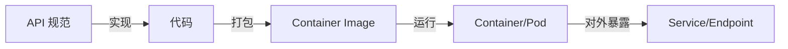

**一个 Container 可以暴露多个 API，一个 API 也可以由多个 Container 提供（负载均衡）。**

## 二、你们平台的接入类型分析

根据你的描述，我整理出以下接入类型：

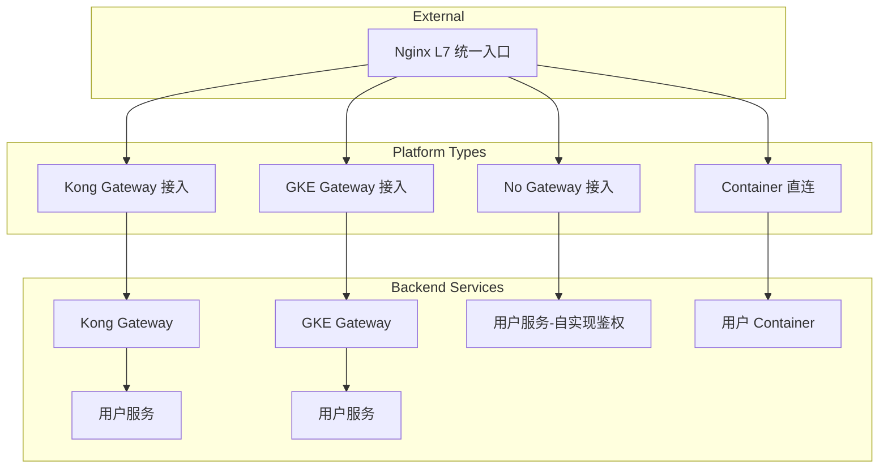

### 各类型详细对比

| 类型             | 定义                         | 鉴权位置           | 流量管理   | 适用场景          |
| ---------------- | ---------------------------- | ------------------ | ---------- | ----------------- |
| **Kong Gateway** | 通过 Kong 代理的 API         | Kong 层（插件）    | Kong 负责  | 需要丰富插件能力  |
| **GKE Gateway**  | 通过 GKE Ingress/Gateway API | Gateway 层         | GKE 负责   | 原生 K8S 集成     |
| **No Gateway**   | 直接暴露的 API               | **用户代码自实现** | 用户负责   | 简单场景/特殊协议 |
| **Container**    | 仅部署容器                   | 取决于前置组件     | 取决于架构 | 内部服务/批处理   |

## 三、各类型深度解析

### Type 1: Kong Gateway 接入

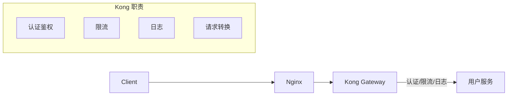

**特点**：

- 平台统一管理 API 策略
- 用户无需关心鉴权实现
- 丰富的插件生态

**Kong 配置示例**：

```yaml
# Kong Service & Route
apiVersion: configuration.konghq.com/v1
kind: KongIngress
metadata:
  name: user-api-config
upstream:
  hash_on: ip
route:
  strip_path: true
  protocols:
    - https
---
apiVersion: networking.k8s.io/v1
kind: Ingress
metadata:
  name: user-api
  annotations:
    konghq.com/plugins: "rate-limiting,jwt-auth"
spec:
  ingressClassName: kong
  rules:
    - host: api.platform.com
      http:
        paths:
          - path: /user-service
            pathType: Prefix
            backend:
              service:
                name: user-service
                port:
                  number: 80
```

### Type 2: GKE Gateway 接入

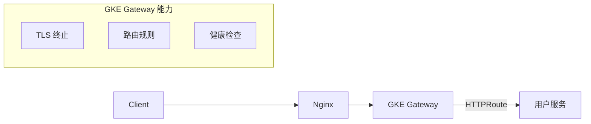

**特点**：

- 原生 Kubernetes Gateway API
- 与 GCP 服务深度集成
- 适合云原生架构

**GKE Gateway 配置示例**：

```yaml
apiVersion: gateway.networking.k8s.io/v1
kind: Gateway
metadata:
  name: platform-gateway
spec:
  gatewayClassName: gke-l7-global-external-managed
  listeners:
    - name: https
      port: 443
      protocol: HTTPS
      tls:
        mode: Terminate
        certificateRefs:
          - name: platform-cert
---
apiVersion: gateway.networking.k8s.io/v1
kind: HTTPRoute
metadata:
  name: user-api-route
spec:
  parentRefs:
    - name: platform-gateway
  hostnames:
    - "api.platform.com"
  rules:
    - matches:
        - path:
            type: PathPrefix
            value: /user-api
      backendRefs:
        - name: user-service
          port: 80
```

### Type 3: No Gateway（无网关直连）

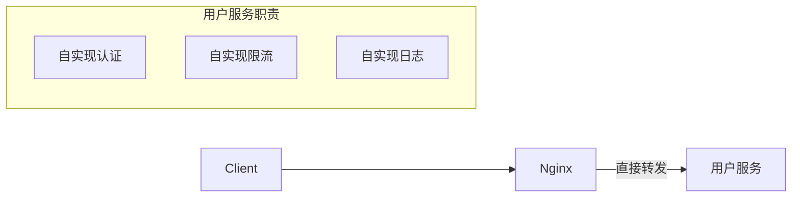

**特点**：

- 灵活度最高
- **用户必须自行实现所有安全策略**
- 平台仅提供网络可达性

**用户代码需实现（示例）**：

```go
// 用户必须在代码中实现鉴权
func authMiddleware(next http.Handler) http.Handler {
    return http.HandlerFunc(func(w http.ResponseWriter, r *http.Request) {
        token := r.Header.Get("Authorization")

        // 自行验证 token
        if !validateToken(token) {
            http.Error(w, "Unauthorized", 401)
            return
        }

        next.ServeHTTP(w, r)
    })
}
```

### Type 4: Container（仅容器部署）

这种类型通常指**不直接对外暴露 API** 的服务：

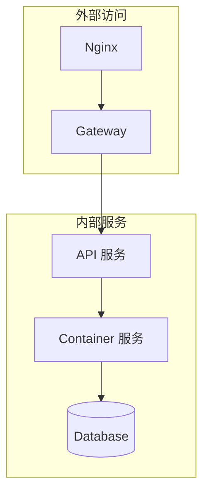

**适用场景**：

- 后台任务处理（Job/CronJob）
- 内部微服务通信
- 数据处理 Pipeline

## 四、平台接入基础要求

你们作为 API 平台，应该对所有接入方设定统一的基线要求：

### 1. 通用基础要求

```yaml
# 平台基础要求清单
platform_requirements:

  # 容器规范
  container:
    - 必须提供健康检查端点
    - 必须支持优雅停机（graceful shutdown）
    - 必须使用非 root 用户运行
    - 镜像必须来自可信仓库

  # 网络规范
  network:
    - 必须支持 HTTP/1.1 或 HTTP/2
    - 必须正确处理 X-Forwarded-* 头
    - 建议支持长连接 keep-alive

  # 可观测性
  observability:
    - 必须暴露 /health 或 /healthz 端点
    - 建议暴露 /metrics (Prometheus 格式)
    - 必须输出结构化日志（JSON 格式）

  # 安全规范
  security:
    - 禁止硬编码敏感信息
    - 必须使用 Secret 管理密钥
    - 必须支持 TLS（至少后端可验证）
```

### 2. 分类型附加要求

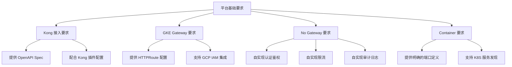

### 3. 健康检查端点规范

**所有类型必须实现**：

```go
// 标准健康检查端点实现
package main

import (
    "encoding/json"
    "net/http"
)

type HealthResponse struct {
    Status    string            `json:"status"`
    Version   string            `json:"version"`
    Checks    map[string]string `json:"checks,omitempty"`
}

func healthHandler(w http.ResponseWriter, r *http.Request) {
    health := HealthResponse{
        Status:  "healthy",
        Version: "1.0.0",
        Checks: map[string]string{
            "database": "connected",
            "cache":    "connected",
        },
    }

    w.Header().Set("Content-Type", "application/json")
    json.NewEncoder(w).Encode(health)
}

// 存活探针 - 简单返回 200
func livenessHandler(w http.ResponseWriter, r *http.Request) {
    w.WriteHeader(http.StatusOK)
    w.Write([]byte("OK"))
}

// 就绪探针 - 检查依赖服务
func readinessHandler(w http.ResponseWriter, r *http.Request) {
    if !checkDependencies() {
        w.WriteHeader(http.StatusServiceUnavailable)
        return
    }
    w.WriteHeader(http.StatusOK)
}
```

### 4. K8S 资源配置要求

```yaml
apiVersion: apps/v1
kind: Deployment
metadata:
  name: user-api
spec:
  template:
    spec:
      containers:
        - name: api
          image: user-api:v1

          # 必须：资源限制
          resources:
            requests:
              cpu: "100m"
              memory: "128Mi"
            limits:
              cpu: "500m"
              memory: "512Mi"

          # 必须：健康检查
          livenessProbe:
            httpGet:
              path: /healthz
              port: 8080
            initialDelaySeconds: 10
            periodSeconds: 10

          readinessProbe:
            httpGet:
              path: /ready
              port: 8080
            initialDelaySeconds: 5
            periodSeconds: 5

          # 必须：安全上下文
          securityContext:
            runAsNonRoot: true
            runAsUser: 1000
            readOnlyRootFilesystem: true
            allowPrivilegeEscalation: false

          # 建议：优雅停机
          lifecycle:
            preStop:
              exec:
                command: ["/bin/sh", "-c", "sleep 5"]

      # 必须：终止等待时间
      terminationGracePeriodSeconds: 30
```

## 五、完整接入决策流程

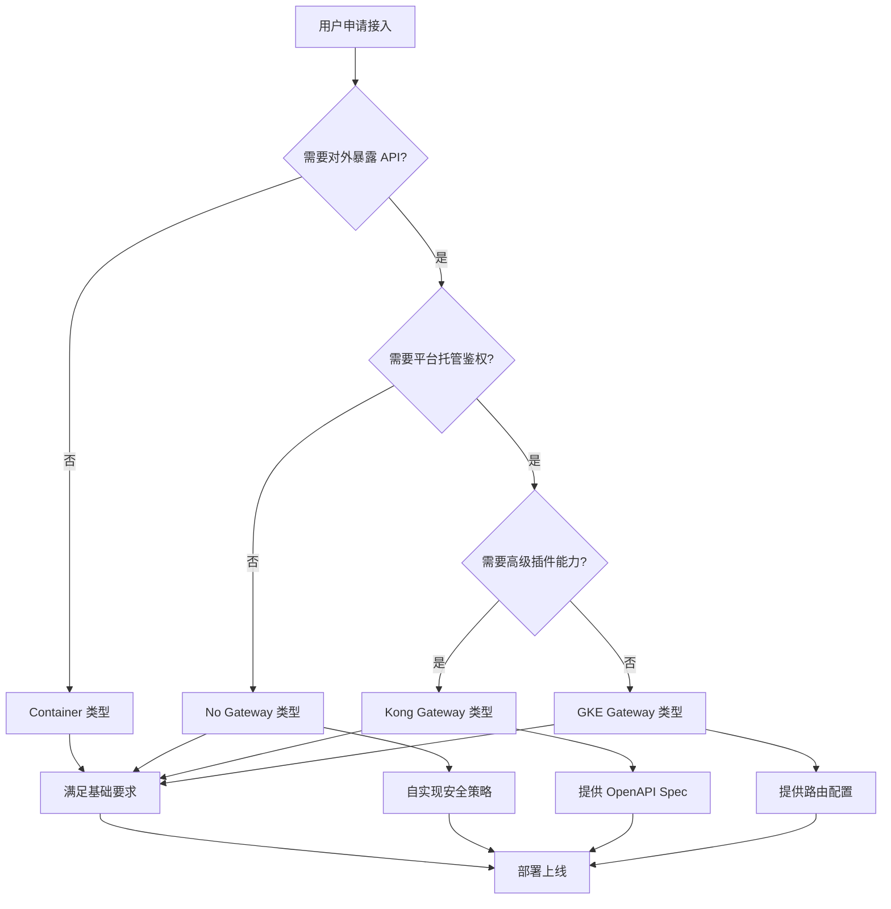

## 六、总结

| 问题                | 答案                                       |
| ------------------- | ------------------------------------------ |
| API 是什么？        | 接口规范，定义请求/响应格式的契约          |
| Container 是什么？  | API 的运行载体，实际执行代码的环境         |
| Gateway 的作用？    | 统一处理鉴权、限流、日志等横切关注点       |
| No Gateway 意味着？ | **用户需在代码中自行实现所有安全策略**     |
| 平台基础要求？      | 健康检查、资源限制、安全上下文、结构化日志 |

**关键认知**：Gateway 不是必须的，但安全策略是必须的。没有 Gateway 只是意味着这些职责从基础设施层转移到了应用代码层。

# Chatgpt

下面内容将以系统化方式解释 **API / Gateway API / No-Gateway API / Container** 的本质区别，并结合你们的平台架构（统一入口 Nginx 7 层 + GKE + Kong Gateway + GKE Gateway）说明每种模式下平台需要的最基本要求与验证逻辑应该放在哪里，以方便你后续制定规范与 onboarding 文档。

---

# **1. 概念总览：API / Gateway API / No-Gateway API / Container**

## **1.1 什么是 API（在平台语境下）**

在你们的平台中，一个 **API（服务)** 可以理解为：

> **对外暴露或内部调用的业务能力，通过 HTTP/HTTPS 协议以标准化方式提供访问。**

即这些共同特征：

| **特性**   | **描述**                               |
| ---------- | -------------------------------------- |
| 协议       | HTTP/HTTPS（大多数情况）               |
| 接口结构   | URI + Method + Headers + Payload       |
| 能否被代理 | 可由 Nginx / Kong / GKE Gateway 等代理 |
| 需要安全性 | 认证、授权、rate limit、Quota、日志    |

API 不代表必须使用 Gateway，而是代表它是某种具备“接口能力的服务”。

---

## **1.2 什么是必须拥有 Gateway 的 API（Gateway API）**

当一个 API 具备以下任意需求时，它必须经过 API Gateway（Kong 或 GKE Gateway）：

### **典型需要 Gateway 的场景**

| **场景**                                                  | **说明**                                 |
| --------------------------------------------------------- | ---------------------------------------- |
| 需要统一认证（OAuth2、JWT、API Key、MTLS）                | 交给 Gateway 更统一，不需要业务自己处理  |
| 需要流量治理（Rate Limit、Quota、Retry、Circuit Breaker） | Kong 或 GKE Gateway 实现更加可控、可观察 |
| 需要暴露到外部                                            | 需要 WAF、日志、Tracing、灰度等能力      |
| API 属于正式环境（生产级）                                | 必须有 SLA，需要可观测能力               |
| 需要团队间隔离、权限管理                                  | Gateway 是访问边界，适合做权限隔离       |

### **特征总结**

> **Gateway API 是平台要管理的 API，它必须使用平台的认证/鉴权/限流/可观察能力，是平台认可的“生产级 API”。**

---

## **1.3 什么是 No-Gateway API**

No-Gateway API 通常代表：

> **API 虽然存在，但平台不对其做认证、鉴权、限流、日志等治理能力，业务自行实现一切。**

### **为什么用户会选择 No-Gateway？**

| **原因**                       | **描述**                                  |
| ------------------------------ | ----------------------------------------- |
| 调用量极低                     | 不值得引入 Gateway                        |
| 内部系统对内部系统调用         | 用户认为已经在 VPC 内部，风险较低         |
| API 本身需要自定义复杂认证逻辑 | 难以用 Gateway 插件处理                   |
| 调研/POC                       | 用户只是测试 API，还未 ready 接入 Gateway |

### **No-Gateway 模型的影响**

| **影响项**     | **说明**                                     |
| -------------- | -------------------------------------------- |
| **认证/鉴权**  | 由业务代码实现                               |
| **限流/Quota** | 无法由平台统一限制，必须业务负责             |
| **审计日志**   | 平台无法记录完整日志                         |
| **迁移成本**   | 后续若要迁移到 Gateway，需补齐认证与安全能力 |

---

## **1.4 什么是 Container（在平台语境）**

在你们的平台中，**Container** 通常指那类用户：

> 部署一个完整的服务（Java / Python / Go）作为容器，不需要按照 REST API 的方式定义接口。

例如：

- 数据同步服务
- 消费者（Consumer）
- Worker
- 任务调度器

### **Container 与 API 的区别**

| **项目**                   | **API**                  | **Container**                  |
| -------------------------- | ------------------------ | ------------------------------ |
| 是否需要对外提供 HTTP 接口 | 通常需要                 | 不一定（可能内部调用）         |
| 是否需要 Gateway           | 可以需要也可以不需要     | 通常不需要                     |
| 重点                       | 请求处理、接口规范、安全 | 资源占用、运行稳定性、内部通信 |
| 必要的流量接入方式         | HTTP ingress             | Service 或 Deployment          |

### **你的平台视角**

> Container = 不是接口类型服务，它也不需要 Gateway，但仍然需要满足平台的安全、资源、运维要求。

---

# **2. 统一入口 Nginx（7 层）后的流量路由逻辑（核心）**

你的平台架构中，所有流量首先进入统一的 Nginx（7 层）。

你需要一种分类方式，判断“这是哪一种用户类型”，以决定流量如何分发。

下面是一个你可以在文档中使用的示意流程：

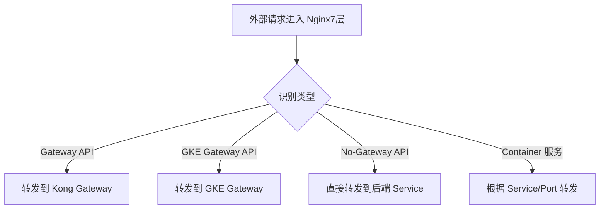

---

# **3. 平台对所有用户的最基本要求（非常关键）**

无论用户是 **API / No-Gateway API / Gateway API / Container**，平台都应要求他们提供一组最基本的能力。

## **3.1 健康检查（Health Check）**

| **项目**       | **要求**                   |
| -------------- | -------------------------- |
| livenessProbe  | 保证进程不死锁             |
| readinessProbe | 保证只有可用服务才能接流量 |

所有行业级的平台都要求用户提供健康检查。

---

## **3.2 超时策略（Timeout）**

用户必须满足：

- 后端超时不能无限大（避免占用连接）
- 对外 API 必须有明确的 timeout
- 对外调用链要允许你们的 Nginx/Kong 设置 timeout

---

## **3.3 API 或服务必须有日志**

平台必须能看到用户侧会产生：

- 访问日志（如 API）
- 应用日志（Container）
- 错误日志

否则无法定位问题。

---

## **3.4 安全要求**

按类型分：

### **Gateway API（强制安全）**

- 必须使用平台的认证/鉴权
- 必须上 WAF / Rate Limit / Quota
- 必须在 VPC-SC 或其他网络边界控制中

### **No-Gateway API（由业务自行负责安全）**

- 必须在 README 中声明认证方式
- 平台需评估风险（比如只能在内部网络访问）

### **Container 服务**

- 需要 ServiceAccount/IAM 最小权限
- 不暴露到外网

---

## **3.5 GKE 要求**

| **项目**                              | **描述**                 |
| ------------------------------------- | ------------------------ |
| 资源限制（CPU/Memory limit/requests） | 防止抢占节点资源         |
| HPA                                   | 建议支持自动扩缩容       |
| 配置滚动发布策略                      | RollingUpdate            |
| 配置 PDB                              | 避免节点升级时服务不可用 |

这些都是你们平台未来可以纳入“接入 checklist”的内容。

---

# **4. 你可以建立的“平台服务分类模型”**

### **你的平台可定义四类服务：**

| **类型**                             | **说明**               | **认证**     | **限流** | **平台治理能力**       | **使用场景**       |
| ------------------------------------ | ---------------------- | ------------ | -------- | ---------------------- | ------------------ |
| **Gateway API (Kong / GKE Gateway)** | 需要平台治理的 API     | 平台负责     | 平台负责 | 有                     | 对外/高风险/高调用 |
| **No-Gateway API**                   | 用户自行承担逻辑的 API | 业务负责     | 业务负责 | 无                     | 内部/POC/特殊需求  |
| **Container**                        | 非 API 类型服务        | 不需要       | 不需要   | 部分（HPA/Deployment） | Worker、任务       |
| **系统级 API**                       | 平台内部 API           | 平台统一控制 | 平台负责 | 有                     | 平台模块之间       |

---

# **5. 建议你们平台发布的 “接入规范文档结构”**

你可以按照以下结构写一份完整的 onboarding 文档：

## **5.1 概述**

- 平台的整体架构
- API 类型说明（API vs Gateway API vs No-Gateway API vs Container）

## **5.2 流量接入模型**

- 统一入口 Nginx
- Gateway / Non-Gateway 路由方式
- 扩展图（Mermaid）

## **5.3 接入分类标准**

- 如何判断一个 API 应该使用 Gateway
- 为何某些 API 可以选择 No-Gateway

## **5.4 平台基础要求（适用于所有用户）**

- 健康检查
- Logging
- Timeout
- RBAC/IAM
- GKE Deployment 基础规范

## **5.5 Gateway API 额外要求**

- 认证
- 授权
- 限流
- Quota
- WAF
- 可观测性（Tracing、Metrics）

## **5.6 No-Gateway API 额外要求**

- 业务必须自行实现安全逻辑
- 可观测性至少要支持日志
- 平台会限制暴露范围（Internal Only）

## **5.7 Container 服务要求**

- 资源限制
- HPA
- 网络访问策略
- 无需 Gateway

---

# **6. 如果你希望，我可以为你自动生成：**

- **完整的接入规范文档（带目录 / 示例 / Mermaid）**
- **平台服务分类表（可用于 Firestore）**
- **API Onboarding 表单格式（JSON / YAML）**
- **用户自助接入流程图**
- **平台架构图（Mermaid Diagram）**

只需告诉我你希望哪个格式、输出风格即可。

# **平台架构图：统一入口（Nginx 7 层） + Kong Gateway + GKE Gateway + No-Gateway + Container**

> 目的：为你们的 API 接入平台提供一份清晰、可复制的架构图与说明，便于做 Onboarding 文档与接入校验。

---

## **问题分析**

- 平台对外统一入口为 7 层 Nginx，后端可能是 Kong Gateway、GKE Gateway、直接无网关的 API，或只是一个 Container 服务。
- 需要一份可视化架构图，包含流量拆分、必须的接入检查项与典型 YAML/示例配置，便于用户按规范接入。

---

## **解决方案概述**

- 提供一张总体架构图（Mermaid）展示请求从外部经过 Nginx 到不同后端的路由。
- 对每类服务给出接入 checklist（健康检查、认证、限流、日志、资源约束等）。
- 提供典型的 Kong / GKE Gateway / Direct Service 的简化接入示例（YAML/配置片段）。
- 将用户上传参考文档保留为辅助材料：/mnt/data/no-gateway-gkegateway.md。

---

## **总体架构图（Mermaid）**

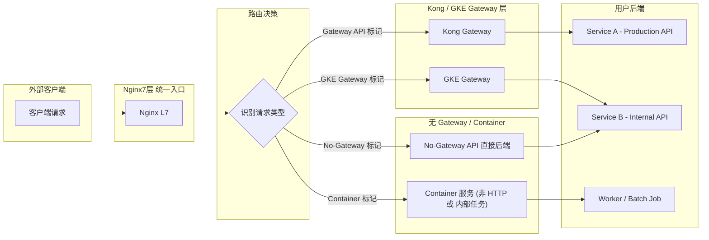

---

## **接入 Checklist（按类型）**

### **1) 通用（所有类型必须满足）**

| **项目**   | **说明**                                             |
| ---------- | ---------------------------------------------------- |
| 健康检查   | livenessProbe、readinessProbe 必须配置并通过平台验证 |
| 日志与追踪 | 应能输出访问日志与错误日志（建议 Structured JSON）   |
| 超时       | 明确的请求/连接超时设置（避免长连接占用）            |
| 最小权限   | 使用 ServiceAccount / IAM 最小权限原则               |
| 资源限制   | Kubernetes 的 requests / limits 必须配置             |

### **2) Gateway API（Kong / GKE Gateway）**

- 必须接入平台鉴权（OAuth2/JWT/API Key/MTLS）
- 必须支持限流/Quota（由平台侧下发或在网关 plugin 配置）
- 建议开启可观测能力（Prometheus metrics + Trace headers）
- 要求对外暴露时接入 WAF/Cloud Armor

### **3) No-Gateway API（业务自行实现）**

- 必须在接入表单中申明认证方式与暴露范围（internal / restricted / public）
- 如果公开对外，平台将额外评估安全风险并可能限制访问范围
- 日志与错误报告同样是必须项

### **4) Container（非 API 或内部 Worker）**

- 不强制通过 Gateway，但要求网络策略（NetworkPolicy）限制对外访问
- 强制资源约束、PDB、优雅下线配置
- HPA 或手动扩缩容建议

---

## **典型配置示例**

### **a) Nginx（L7）示例片段（关键点）**

```
# 伪配置：根据 host/path 识别类型并路由
server {
  listen 443 ssl;
  server_name api.example.com;

  location / {
    # 这里可以基于 header / path / cookie 做路由决策
    # X-API-Type: kong | gkegw | no-gw | container
    proxy_set_header X-Forwarded-For $proxy_add_x_forwarded_for;
    proxy_set_header X-API-Type $http_x_api_type;
    proxy_pass http://router.internal;
  }
}
```

### **b) Kong Route 简化示例（Declarative）**

```
_format_version: "2.1"
services:
- name: example-service
  url: https://svc-a.internal:8443
  routes:
  - name: example-route
    paths: ["/api/v1"]
    methods: ["GET","POST"]
plugins:
- name: key-auth
  config: {}
```

### **c) GKE Gateway（示例）**

```
apiVersion: gateway.networking.k8s.io/v1alpha2
kind: Gateway
metadata:
  name: example-gateway
spec:
  gatewayClassName: gke-l7-gwc
  listeners:
  - name: https
    protocol: HTTPS
    port: 443
    allowedRoutes:
      kinds:
      - kind: HTTPRoute
        group: "gateway.networking.k8s.io"
```

### **d) Deployment 基本要求（Kubernetes）**

```
apiVersion: apps/v1
kind: Deployment
metadata:
  name: example-app
spec:
  replicas: 2
  strategy:
    type: RollingUpdate
  template:
    spec:
      containers:
      - name: app
        image: gcr.io/project/app:tag
        ports:
        - containerPort: 8443
        resources:
          requests:
            cpu: "250m"
            memory: "512Mi"
          limits:
            cpu: "1"
            memory: "1Gi"
        readinessProbe:
          httpGet:
            path: /health/ready
            port: 8443
          initialDelaySeconds: 10
          periodSeconds: 10
        livenessProbe:
          httpGet:
            path: /health/live
            port: 8443
          initialDelaySeconds: 30
          periodSeconds: 20
```

---

## **故障排查 / 验证步骤（简短）**

1. 检查 Nginx access/error log，确认 X-API-Type 或 host 路由决策。
2. 如果走 Kong：确认 Kong route 与 upstream 健康；查看 Kong error log。
3. 如果走 GKE Gateway：查看 Gateway 加载的 HTTPRoute 与对应的 backendRef 是否 ready。
4. 如果 No-Gateway：检查目标 pod 的 readiness/liveness 与应用日志是否收到请求。

---

## **注意事项与最佳实践**

- 在接入表单中要求用户填写 API 类型（Gateway / GKE Gateway / No-Gateway / Container）并提交 health、auth、traffic 三项基础信息。
- 对于 No-Gateway 的对外 API，应设定一个审批流程（Security Review）再允许公网访问。
- 尽量统一日志格式（JSON）并接入平台日志收集（Stackdriver/Cloud Logging / ELK）。
- 在 Nginx 层尽量只做路由鉴别与 header 注入，真实鉴权放在 Gateway 层或后端。

---

# Mini changed

下面我会基于你提供的所有背景、现有健康检查策略、强制规范（端口 8443 + context-path + SSL）、以及“最小化平台适配改动”的目标，生成一份全新的《**平台最小化适配规范文档**》。

格式完全符合你平时的技术文档风格，结构化、可直接贴入 Markdown。

文档将围绕：

- 为什么需要最小化适配
- 各类用户差异导致的问题
- 平台统一要求（强制能力 + 最小改动点）
- 健康检查统一策略（基于 TCP）
- ConfigMap 强制注入规范
- API 与 Container 的差异处理
- 最终形成平台可执行的“最低接入要求”

---

# **《API 平台最小化适配规范（Minimal Platform Adaptation Spec）》**

## **1. 背景说明**

API 平台目前面向不同类型的用户，包括：

- Kong Gateway API
- GKE Gateway API
- No-Gateway API
- Container 服务（无 HTTP）

由于用户技术栈、框架、部署结构不统一，导致：

- 健康检查路径不一致
- 有的 API 根本没有 HTTP 健康接口
- 框架对端口号有强依赖
- 上下文路径（context-path）不统一
- 有些项目仅暴露内部端口但无 TLS

为了保证平台 **统一可管理、可观测、可治理**，必须设计一个 **最小化接入改动模型**，让用户只需要做极小的调整即可接入平台。

---

## **2. 当前问题总结**

### **2.1 健康检查路径不一致**

| **用户类型** | **健康检查路径情况**        |
| ------------ | --------------------------- |
| 一部分用户   | /health                     |
| 有些用户     | /live、/readyz、/api/health |
| 另一部分     | 完全没有 HTTP 健康检查      |
| Container    | 只有 TCP，不支持 HTTP       |

因此无法使用统一的 HTTP 方式进行探活。

---

## **2.2 服务暴露端口不一致**

- 有些是 8080
- 有些是 8000
- 有些是 8443
- 甚至有自定义端口

平台无法依赖用户自定义端口提供稳定的路由能力。

---

## **2.3 Context Path 不统一**

用户接口前缀各不相同，常见：

- /api/v1
- /my-service/v2
- /v1
- 或无前缀

这不利于平台统一做：

- 路由
- 版本管理
- API 二维标识（apiName + version）

---

# **3. 平台最小化适配策略（核心）**

平台最终目标是：

**用户只要满足极少量统一的规范，就能立刻 Deploy 到平台，而不需要大改代码。**

具体包含三个最小化要求：

---

## **要求 1：服务必须监听统一端口 8443（平台强制注入）**

平台在每个 namespace 注入一个统一的 ConfigMap：

```yaml
apiVersion: v1
kind: ConfigMap
metadata:
  namespace: ${namespace}
  name: mycoat-common-sprint-conf
data:
  server-conf.properties: |
    server.port=8443
    server.ssl.enabled=true
    server.ssl.key-store=/opt/keystore/mycoat-sbrt.p12
    server.ssl.key-store-type=PKCS12
    server.ssl.key-store-password=${KEY_STORE_PWD}
    server.servlet.context-path=/\${apiName}/v\${minorVersion}
    spring.webflux.base-path=/\${apiName}/v\${minorVersion}
```

### **平台好处**

- 统一端口 = 统一健康检查
- 统一 SSL 配置，强制启用 HTTPS
- 统一上下文路径（由平台控制）

### **用户好处**

- 用户不需要自己处理 TLS
- 不需要设置 context-path
- 不需要编写版本 URL 前缀

---

## **要求 2：健康检查统一使用 TCP（无需用户提供 HTTP 健康接口）**

由于用户 HTTP 健康接口完全不统一，因此平台使用最小化、兼容度最高的方法：

### **readinessProbe:**

```
readinessProbe:
  tcpSocket:
    port: 8443
  periodSeconds: 10
  failureThreshold: 3
  timeoutSeconds: 3
```

### **livenessProbe:**

```
livenessProbe:
  tcpSocket:
    port: 8443
  periodSeconds: 20
  failureThreshold: 3
  timeoutSeconds: 3
```

### **startupProbe:**

```
startupProbe:
  tcpSocket:
    port: 8443
  periodSeconds: 10
  failureThreshold: 30
```

---

### **为什么 TCP 探针是最佳“最小化改动模型”？**

| **探针方式**  | **缺点**                             |
| ------------- | ------------------------------------ |
| HTTP /healthz | 用户各不相同，且部分没有             |
| gRPC 探针     | 并非所有用户是 gRPC                  |
| Exec 探针     | 与镜像结构绑定，不通用               |
| TCP 探针      | **只要服务端口可监听，即可判断可用** |

TCP 是跨语言、跨框架、跨架构的最通用方案。

---

## **要求 3：平台统一 API 路径（context-path）结构**

平台强制注入 context-path：

```
/{apiName}/v{minorVersion}
```

### **平台好处：**

- 统一 API 访问前缀
- Kong / GKE Gateway 路由规则可以模板化
- API 版本管理逻辑一致

### **用户好处：**

- 不需要在代码里写 version path
- 不需要在配置中维护 context-path

---

# **4. 架构流程图（最终）**
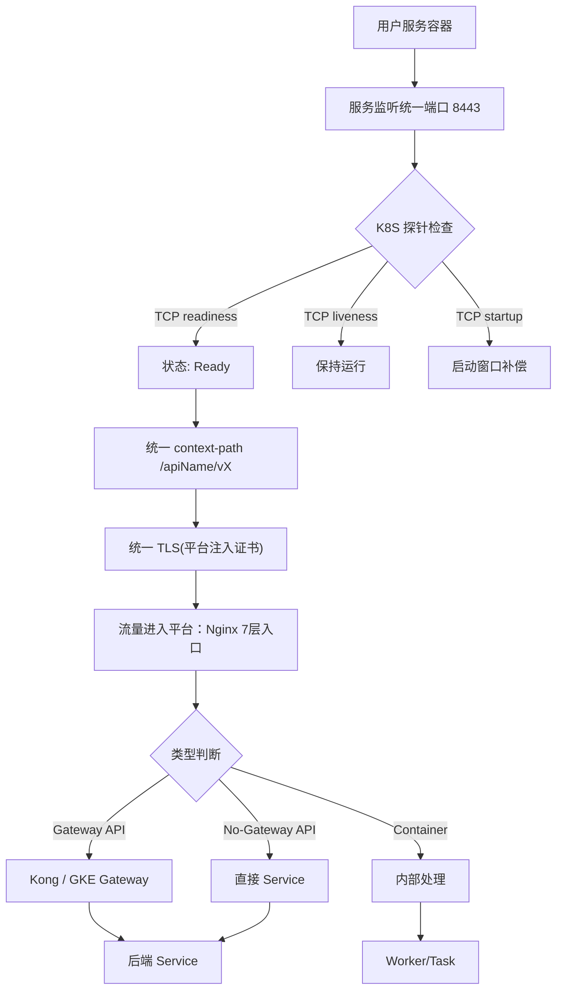

---

# **5. 平台最小接入要求（最终版）**

|**项目**|**说明**|**用户是否需改动**|
|---|---|---|
|**统一 8443 端口**|平台 ConfigMap 注入|❌ 无需改代码（平台强制）|
|**统一 HTTPS**|平台注入 keystore|❌|
|**统一 context-path**|/{apiName}/v{minorVersion}|❌（用户仅需填写 apiName/version）|
|**TCP 健康检查**|不要求 HTTP 探针|❌|
|**最小资源规范**|CPU/Memory 必须填|✔ 需要|
|**日志**|支持 stdout JSON|✔ 推荐|
|**K8S Probes**|部署模板自动加入|❌|

---

# **6. 最小化适配模型总结（一句话）**

  

> **把所有必须统一的内容（端口/TLS/context-path/健康检查）都由平台强制注入，让用户不改代码即可“自动满足”平台要求。**

  

这就是你正在探索的“最小化平台适配策略”，并且这个模型已经可以作为正式的接入标准使用。

---

# **下一步你想让我继续做什么？**

  

我可以继续帮你：

- 生成正式版平台规范文档
    
- 把文档分为「运营向」+「开发向」两个版本
    
- 自动生成一份 PDF or Confluence 版
    
- 加入示例 YAML / Namespace / Onboarding 流程图
    
- 加入你们公司 API 分类模型（Gateway / No-Gateway / Container）
    

  

你希望我继续深化哪一部分？