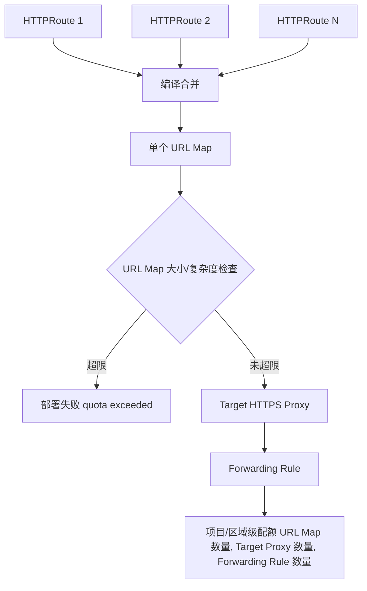

## 问题分析

描述的核心问题可以拆成三层：

1. **表象**：GKE Gateway API 迁移 NGINX Ingress，300 个 API 就把某个 URL Map 撑到了 ~128KB 上限，剩余 700+ API 迁不进去。
2. **临时方案的局限**：GCP 一线支持给的建议是"多建几个 Gateway"，但集群级别似乎又受限于 **50 个 Gateway 的上限**，治标不治本。
3. **认知落差**：GKE 宣传能扛 10,000 pod 规模，但配置层（URL Map）却卡在 KB 级别 —— 这是这次升级请求 TAM/SME 的根本诉求。

关键点：这不是"quota 设小了"这么简单，而是 **两套完全独立的扩展性体系**被混在一起看待了。

---

## 深度解析：为什么会卡在 128KB

### 1. 根本原因 —— HTTPRoute 会被"编译"成一个 URL Map

GKE 官方文档明确说明：

> 挂在同一个 Gateway 上的所有 HTTPRoute，会被编译进**同一个** Google Cloud URL Map；因此它们共享同一份 URL Map 的配额与限制。

也就是说，**限制单位不是"API 数量"，而是"每个 Gateway 对应的单个 URL Map 的字节数/复杂度"**。300 个 API 撑爆 128KB，本质上是把 300 个 API 的 host rule / path rule 全塞进了一个 Gateway。



### 2. 两套独立体系（这是回应"和 10,000 pod 矛盾"的关键）

| 体系 | 管的是什么 | 典型指标 | 与 Gateway 配额的关系 |
|---|---|---|---|
| GKE 数据面（计算/调度） | Pod、Node、Service 的运行时规模 | 单集群 10,000+ 节点/数万 Pod | **无关** |
| Cloud Load Balancing 控制面（URL Map / 转发规则） | L7 负载均衡器**配置本身**的复杂度 | URL Map 大小、host rule 数、path matcher 数 | 这就是 Michael 撞到的墙 |

GKE 能扛 10,000 pod，讲的是**数据面转发能力**；而 URL Map 的 KB 级限制，管的是**控制面（Google 全球 Anycast 负载均衡器的配置分发系统）**能装下多复杂的路由规则树，这是给全球所有客户共用的基础设施保护性配额，和单个集群能跑多少 Pod 是两回事。这是可以直接拿去和 TAM 对齐的解释角度。

### 3. 实际的硬限制数值（Google 官方文档，截至目前）

| 限制项 | External ALB | Internal ALB | 能否申请提升 |
|---|---|---|---|
| **单个 URL Map 数据大小（旧）** | 128KB（非 classic）/ 64KB（classic） | 128KB | ❌ 不可调（除非进入下方新配额预览） |
| **单个 URL Map 数据大小（新，Preview）** | **1MB**（global/regional 外部 ALB） | **1MB** | 需联系 Support 加入 Preview |
| Host rule + Path matcher 数/URL Map | 1000 | 2000 | ❌ 硬限制 |
| Path rule / Route rule 数/Path matcher | 1000 | 1000 | ❌ 硬限制 |
| URL Map 可引用的 backend service 数 | 2500 | 2500 | ❌ 硬限制 |
| URL Map / Target Proxy / Forwarding Rule 数量（项目级） | 有默认配额 | 有默认配额 | ✅ **可调**（这是普通配额，不是硬限制） |

关键信息：**Google 最近（2026年4月前后）刚上线了一个 Preview 阶段的新配额体系**——"Configuration size for Application Load Balancers"，把非 classic ALB 的单 URL Map 上限从 **64KB/128KB 直接提到 1MB**，并改成"按复杂度计费的配额单位"而非固定字节数。这几乎是精准命中 Michael 的场景，值得作为向 TAM 提的**第一诉求**：申请把项目加入这个 Preview。

---

## 数量级测算（回答你问的"这个量级应该是什么样"）

给的数据反推：

```
300 个 API ≈ 128KB（旧限制触顶）
→ 平均每个 API 路由规则 ≈ 128KB / 300 ≈ 437 字节
```

按这个平均值线性外推（注意：URL Map 大小和复杂度不是纯线性，host/header/query 匹配越多增长越快，这里只是数量级估算）：

| 场景 | 预估所需大小 | 128KB 限制下 | 1MB（Preview）限制下 |
|---|---|---|---|
| 300 API（已验证） | 128KB | 刚好顶满 | 剩余大量空间 |
| 1000 API（BBUK 全量） | ≈ 437KB | ❌ 超限 3.4 倍 | ✅ 仍在 1MB 内，有余量 |
| 每 Gateway 拆 3~4 组（每组 250~300 API） | 每组 ≈ 110~130KB | 单组勉强够用，无缓冲 | 单组绰绰有余 |

**结论**：
- 如果继续用旧的 128KB 限制，1000 个 API **无论怎么拆都要拆成至少 4 个 Gateway**（每组控制在 250 API 以内留缓冲），且还要盯着 host rule/path matcher 的 1000 条上限（这个通常不会先触顶）。
- 如果能拿到 1MB Preview 配额，理论上 1000 个 API 可以**塞进 1 个甚至 2 个 Gateway**，Gateway 数量压力会大幅缓解，也就不会顶到"50 个 Gateway"的上限。

---

## 建议的应对路径

1. **优先诉求（最直接解决问题）**：通过 TAM 申请把项目加入 "Configuration size for Application Load Balancers" 的 Preview（64KB/128KB → 1MB）。这是目前唯一能从根本上抬高单 Gateway 容量的官方渠道。
2. **配额侧同步申请**：`url_maps`、`target_https_proxies`、region 级 forwarding rule 这几个都是**可调配额**，不是硬限制，50 个 Gateway 的上限大概率来自这几个配额的默认值，可以和 128KB→1MB 的申请一起提。
3. **架构侧兜底（不依赖 Preview 审批结果）**：继续推进 Platform/DevOps 正在做的 "Gateway per namespace/team" 方案，但建议按上面测算的 ~250 API/Gateway 做容量规划，而不是等撞墙了再拆分。
4. **配置层面省空间**：如果 HTTPRoute 里有大量重复的 header/query 匹配（route rule 的 predicate 会算复杂度），优先用 path prefix 而非 regex/精细 header 匹配——regex 匹配数量本身还有额外的单独限制（每 path matcher 最多 5 个 regex）。

---

## 注意事项

- 这次涨到 1MB 的配额目前是 **Preview（预发布）状态**，官方条款里明确"as is"、支持有限，生产环境依赖前建议和 TAM 确认 SLA。
- 拆分成多个 Gateway 后，如果用的是 **regional external ALB**，其 URL Map 总大小配额是"按区域 + VPC network"算的，也就是说跨区域部署本身就能天然扩容；如果是 **global external ALB**，则是项目级共享一个池子，扩容只能靠拆 Gateway 数量或走 Preview。
- 50 个 Gateway 的上限如果没有专门验证过是硬限制还是可调配额，建议直接在 GCP 控制台 Quotas 页面搜 `url_maps`、`target_https_proxies` 确认当前项目的实际数值和是否显示"可申请增加"，这个信息比论坛/文档描述更准确。