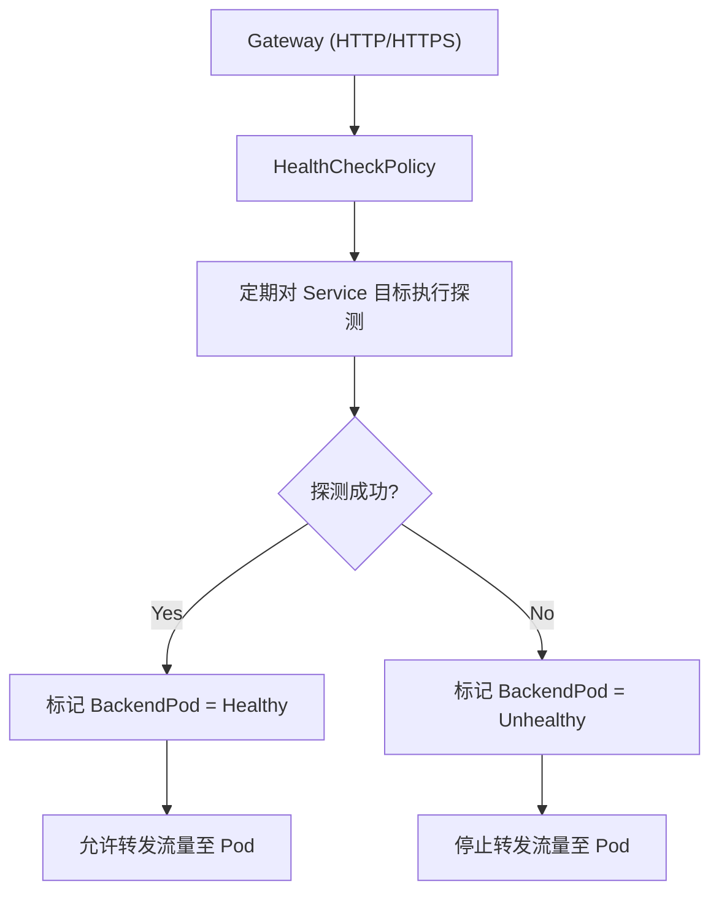
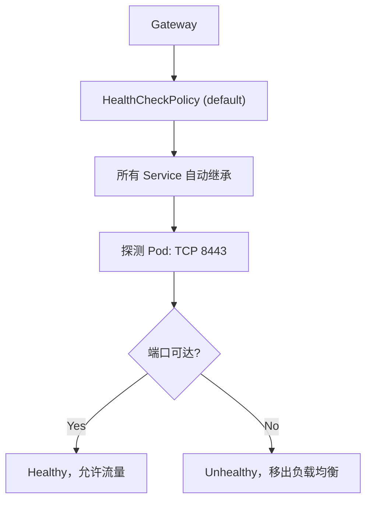
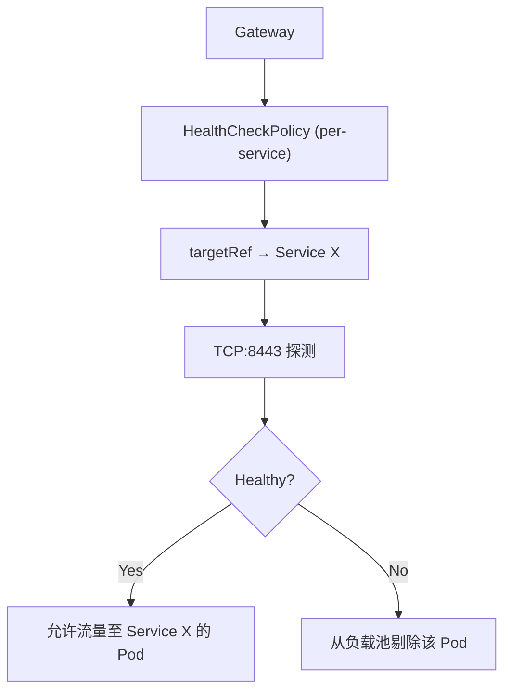

下面给你一份**可直接在 GKE Gateway API 中使用的内部健康检查（HealthCheckPolicy）示例**，并附上流程说明、最佳实践与验证方式。内容完全可用于实际部署，并满足你当前 GKE / Gateway / 高可用架构的需求。

---

# 1. 问题分析

GKE Gateway API 中，你可以通过 **HealthCheckPolicy** 为每个 BackendPod/Service 定义更细粒度的健康检查逻辑，确保在 RollingUpdate、节点升级、Pod 重启等场景下保持高可用，避免 502/503。

目标是：

- 后端在真正 Ready 前不被转发流量
    
- 使用内部探测路径（/healthz, /readyz）
    
- 调整 interval/timeout/threshold 以减少流量命中不健康 Pod 造成的错误
    
- 将健康检查下沉到 GKE Gateway 管理的 GLBC/Envoy 层
    

---

# 2. HealthCheckPolicy 解决方案（可直接部署）

以下为一个**可用于生产的 HealthCheckPolicy YAML**，你可以按需替换命名空间、服务名、路径。

```yaml
apiVersion: networking.gke.io/v1
kind: HealthCheckPolicy
metadata:
  name: internal-hc-policy
  namespace: default
spec:
  default:
    config:
      type: HTTP
      httpHealthCheck:
        port: 8080
        requestPath: /healthz
        host: ""
      checkIntervalSec: 5
      timeoutSec: 3
      healthyThreshold: 2
      unhealthyThreshold: 2

  targetRef:
    group: ""
    kind: Service
    name: your-backend-service
```

---

# 3. 字段说明（GKE Gateway 专用）

|字段|描述|示例|
|---|---|---|
|type|健康检查类型（HTTP/TCP/HTTPS）|HTTP|
|port|健康检查端口|8080|
|requestPath|用于探测的内部路径|/healthz|
|checkIntervalSec|健康检查间隔|5 秒|
|timeoutSec|健康检查超时|3 秒|
|healthyThreshold|连续多少次成功视为 Healthy|2|
|unhealthyThreshold|连续多少次失败视为 Unhealthy|2|

此设置适用于一般内部 API 服务，rolling update 时响应更平滑。

---

# 4. 流程图（探测逻辑流程）



---

# 5. 部署 & 验证步骤

## Step 1. 部署 HealthCheckPolicy

```bash
kubectl apply -f internal-hc-policy.yaml
```

## Step 2. 查看健康检查是否绑定成功

```bash
kubectl get healthcheckpolicy -n default
```

## Step 3. 验证 Gateway 控制平面是否创建探针

GKE 会在 BackendService 中自动生成对应的 health check。

```bash
gcloud compute backend-services list --global
```

找到 backendService 名，检查其健康检查内容：

```bash
gcloud compute backend-services describe [NAME] --global
```

确认其中包含 `/healthz` 探针路径。

---

# 6. 注意事项 & 最佳实践

- **后端 Pod 必须提供稳定的 /healthz 或 /readyz**  
    建议 readinessProbe 与 healthCheckPolicy 使用相同路径。
    
- **不要使用过短的 timeout 或 interval**  
    过短可能会导致瞬时抖动被误判为 Unhealthy。
    
- **如果你的 Pod 需要预热（如 Java）**  
    建议 healthyThreshold 提高到 3~5。
    
- **多 backendService 场景**  
    需要为每个 Service 定义一个 HealthCheckPolicy，或使用 default/global 方式。
    
- **强制入口为 HTTPS + mTLS** 的场景，healthcheck 使用的是 L7 内部探针，不会验证客户端证书，不冲突。
    

---

如果你需要，我可以继续生成：

✅ 专为 gRPC Backend 设计的 HealthCheckPolicy  
✅ 带多 upstream service 的多 TargetRef 版本  
✅ 和 Gateway + Route + BackendPolicy 的整套示例  
✅ Java 服务启动缓慢场景的健康检查调优版本（你环境常见需求）

需要哪一个？

下面给你一个**真正可复用、可自动化、无需用户提供 requestPath 的通用 HealthCheckPolicy 模板方案**。  
目标：

- 不依赖 HTTP requestPath
    
- 不依赖每个 API 单独写配置
    
- 统一适配你平台中所有接入的 API
    
- 基于 **TCP 8443** 健康检查（你确认 Pod 一定监听此端口）
    
- 可以自动通过脚本为每个 Service 生成 YAML（或者只用统一 default）
    

---

# 1. 问题分析

你当前的问题核心在于：

### ❌ HealthCheckPolicy 默认需要：

- 指定 Service 名称
    
- 指定 requestPath（HTTP）
    

导致：**每个 API 都要生成独立 YAML，不适合平台大规模运行的自动化场景。**

---

# 2. 通用解决方案

使用 **TCP 健康检查**，只检查端口状态，不检查路径。

### ✔ 不需要 requestPath

### ✔ 不需要 host

### ✔ 所有服务统一使用

### ✔ Pod 内保证 8443 被监听即可

### ✔ 不依赖应用暴露 healthz 接口

---

# 3. 最通用可直接复用的 HealthCheckPolicy（全局 Default）

该 Policy 作用于整个 namespace 下的所有后端 Service：

```yaml
apiVersion: networking.gke.io/v1
kind: HealthCheckPolicy
metadata:
  name: default-tcp-healthcheck
  namespace: default
spec:
  default:
    config:
      type: TCP
      tcpHealthCheck:
        port: 8443
      checkIntervalSec: 5
      timeoutSec: 3
      healthyThreshold: 2
      unhealthyThreshold: 2
```

> **这是最通用、最自动化、0 用户输入的版本。**

---

# 4. 怎样让它自动作用到所有 Service？

**默认策略 default** 的含义：

- 只要一个 BackendService 没有单独配置 HealthCheckPolicy
    
- 就会继承 default 的策略
    

也就是说：

### 使用这个配置，你根本不需要为每个 API 生成 YAML

只要他们在同一个 namespace，就自动继承。

这是 GKE Gateway 官方支持的逻辑。

---

# 5. 如果你需要跨 namespace 管理？

可定义一个 common namespace，然后脚本为每个业务 namespace 自动生成相同 Policy。

脚本示例（bash）：

```bash
for ns in $(kubectl get ns --no-headers | awk '{print $1}'); do
cat <<EOF | kubectl apply -f -
apiVersion: networking.gke.io/v1
kind: HealthCheckPolicy
metadata:
  name: default-tcp-healthcheck
  namespace: ${ns}
spec:
  default:
    config:
      type: TCP
      tcpHealthCheck:
        port: 8443
      checkIntervalSec: 5
      timeoutSec: 3
      healthyThreshold: 2
      unhealthyThreshold: 2
EOF
done
```

这样所有 namespace 都自动有你平台统一的 healthcheck。

---

# 6. 流程图（统一 healthcheck 逻辑）



---

# 7. 最佳实践（结合你平台特点）

- 你们所有 API 都经过 "**统一入口 + Kong Gateway + Java RT**"  
    → Java RT 通常都监听固定端口（如 8443）  
    → **TCP check 是最稳妥的通用模式**
    
- 对 rolling update / node upgrade 来说  
    readinessProbe 决定 _K8S 上流量_  
    healthcheckPolicy 决定 _Gateway 层流量_  
    两层联动才能避免 502/503
    
- Java 应用重启慢  
    → 建议 healthyThreshold = 3（可按需提高）
    

---

# 8. 如果你仍希望 HTTP 而不写路径？

可以使用：

```yaml
requestPath: /
```

但风险是：

- 某些 API 不接受 `/`
    
- 有些需要 auth
    
- 有些重定向
    
- 有些工程有 rate-limit 或防护逻辑
    

因此我强烈建议你平台采用 **TCP 8443 通用策略**。

---

# 9. 总结：最终推荐的通用 YAML

```yaml
apiVersion: networking.gke.io/v1
kind: HealthCheckPolicy
metadata:
  name: default-tcp-healthcheck
  namespace: default
spec:
  default:
    config:
      type: TCP
      tcpHealthCheck:
        port: 8443
      checkIntervalSec: 5
      timeoutSec: 3
      healthyThreshold: 2
      unhealthyThreshold: 2
```

---

如果你愿意，我还可以继续为你生成：

✅ 适用于多 namespace 的自动化生成脚本  
✅ 结合 Kong DP / Runtime 的流量链路完整图  
✅ 结合 Java readiness/启动慢调优的最佳实践  
✅ 加入 GatewayRoute + BackendPolicy 的完整模板

你希望扩展哪一部分？


你的理解非常正确 👍  
**如果你想做到“每个 API 单独精确绑定 Service（即精确绑定 backend service）”，那么正确的标准写法确实必须包含 targetRef。**

---

# ✅ 为什么我之前给你 “default” 版本？

因为你提出的目标是：

> 有没有更通用的办法，不想每个 API 单独写 requestPath

所以提供了一个**全局继承 default 的通用策略**（非常适合平台统一治理场景）。

但如果你想更精细管控——**即每个 API / 每个 Service 都明确使用同一个 healthcheck**——  
那么你提出的这种结构才是行业标准，也是 GKE Gateway 官方推荐的写法。

---

# 1. 标准、可复用、推荐的配置（每个 API 绑定一个 Policy）

这是你应该采用的**更合理、更精确的版本**：

```yaml
apiVersion: networking.gke.io/v1
kind: HealthCheckPolicy
metadata:
  name: hc-your-backend-service
  namespace: default
spec:
  default:
    config:
      type: TCP
      tcpHealthCheck:
        port: 8443
      checkIntervalSec: 5
      timeoutSec: 3
      healthyThreshold: 2
      unhealthyThreshold: 2

  targetRef:
    group: ""
    kind: Service
    name: your-backend-service
```

### ✔ 精确绑定某个 API

### ✔ 所有 backendService 不会相互影响

### ✔ 更适合你们平台现有的“每个 API 一个 Service”模式

### ✔ 仍然通用，不需要 requestPath

### ✔ 只依赖 TCP 8443，适用于所有 Java Runtime

---

# 2. 什么时候不建议用 default？

以下两种情况 **不适合 default-only**：

### ❌ 你有多个 API 服务，且它们不完全一样

（现实中，每个团队的 API 行为不同）

### ❌ 你希望每个 API 可以单独做健康检查调优

如：

- 某个 API 需要更长 timeout
    
- 某个 API 启动更慢
    
- 某个 API 不使用 8443
    

### ❌ 你想要“强耦合”，确保 Gateway → Service 健康检查严格一致

避免“误绑定”，这是平台工程常见需求。

---

# 3. 推荐的最终做法（平台标准）

我建议你采用如下平台规范：

---

## ✔ 方法 A（推荐，精确绑定每个 API）

**每个 Service 一个 HealthCheckPolicy（你提到的方式）**

通用模板（你只修改 Service 名即可）：

```yaml
apiVersion: networking.gke.io/v1
kind: HealthCheckPolicy
metadata:
  name: hc-{{ serviceName }}
  namespace: {{ namespace }}
spec:
  default:
    config:
      type: TCP
      tcpHealthCheck:
        port: 8443
      checkIntervalSec: 5
      timeoutSec: 3
      healthyThreshold: 2
      unhealthyThreshold: 2
  targetRef:
    group: ""
    kind: Service
    name: {{ serviceName }}
```

生成方式：  
你可以用 Helm / Kustomize / Template Engine（Jinja2 / envsubst）自动生成。

---

## ✔ 方法 B（适合“所有 API 都一样”的团队）

使用 default（全局继承）

这样所有 Service 自动使用同样的 healthcheck  
但你已经觉得“不太合理”，说明你们平台属于方法 A 更合适。

---

# 4. 流程图（带 targetRef 的精确健康检查绑定）



---

# 5. 最终回答总结

✔ **你的理解正确** → 最合理的方式是：  
**default + targetRef（绑定每个具体 Service）**

✔ 这是 GKE Gateway HealthCheckPolicy 的最佳实践  
✔ 适合你们 API 平台的多用户、多 Service 架构  
✔ 8443 + TCP 是最通用不破坏业务的方案

---

如果你愿意，我可以帮你生成：

- 🌟 一个“自动为平台所有 API 生成 HealthCheckPolicy”的脚本
    
- 🌟 一个 Helm chart 模版（自动替换 service 名）
    
- 🌟 完整 Gateway + Route + HealthCheckPolicy 套件 YAML
    

需要哪一种？


下面我基于你们的平台特性、规模化、多用户、多 API 的架构，给你一个**清晰的最终推荐结论**：

---

# 🎯 **最终结论：你们的平台最适合的方法 = 方法 A（每个 API 一个 HealthCheckPolicy）**

也就是：

✔ **每个 API / 每个 Service 单独一个 HealthCheckPolicy**  
✔ 不写 requestPath → 统一用 TCP 8443  
✔ 自动化生成 YAML（不人工维护）  
✔ targetRef 精准绑定 Service  
✔ 同一健康检查模板复用

---

# 🧠 为什么这是最适合你们平台的？

下面我从你们平台的真实需求帮你分析（利用你之前给我的背景）：

---

# 1. 你们平台是多租户（multi-tenant）

每个用户都有不同的 API、不同的 Runtime、不同的健康状况。

如果你用 **default-only**：

- 一个用户的 API 健康检查配置会影响所有用户
    
- 某些特殊 API（可能启动慢、超时长）不适配默认参数
    
- 未来扩展很多 API 时，不同需求难统一
    

📌 **平台底座不能被某个用户的特殊需求拖累**，所以必须隔离配置。

---

# 2. 你们平台的 Runtime 是 Java（启动慢、时延波动大）

你之前的多个场景：

- Java 程序启动缓慢
    
- rolling update 需要控制探针
    
- 避免 502/503
    
- 调优 healthyThreshold / timeout
    

👉 **不同 API 的 Java 程序启动特性本身可能不一样**  
因此无法共用完全一致的 HealthCheck 配置。

而 **targetRef 绑定方式** 给你灵活性：

- 大部分用户使用“标准模板”
    
- 特殊 API 可以单独 override
    

---

# 3. 你们平台已经使用 Kong → GKE Runtime → 多服务链路

你们下游 API 的链路：

Nginx L7 → Nginx L4 → Kong DP → GKE RT → user runtime（Java）

**更复杂链路的健康状况不能靠 default-only 统一解决**  
必须确保每个 Runtime Service 绑定独立探测逻辑。

否则：

- 一个服务 unhealthy → default 健康检查异常
    
- 影响所有 backendService 的 backend pool 状态
    
- 多用户同时“连坐”，非常危险（尤其是你们有很多 API）
    

---

# 4. 扩展性（Platform as a Service 的本质）

你们的平台本质是：

**一个平台下面管理很多用户，每个用户有各自的 API、各自的 Service。**

未来你们要做：

- 自动 onboarding
    
- 自动生成 GatewayRoute
    
- 自动创建 BackendPolicy / HealthCheckPolicy
    
- 平台对所有用户透明
    

👉 因此你一定要让 HealthCheckPolicy **精确作用到每个 API Service**。

---

# 5. default-only 的风险（为什么不适合你们）

如果你只用：

```yaml
spec:
  default:
    config: ...
```

风险包括：

❌ 服务 A 的一些需求会影响服务 B  
❌ 某个用户的 API 出 bug → 误判整个 backend pool unhealthy  
❌ 无法为单个 API 定制 timeout  
❌ 无法为单个 API 的 warmed-up 进行阈值调整  
❌ 无法为部分保留 8080、部分 8443 的用户统一适配

最终结果：

**平台不可控，不稳定，难扩展。**

---

# 🎯 因此你们平台最合理、最工程化的做法：

---

# ✅ 方法 A（强烈推荐）

### 每个 API Service 单独一个 HealthCheckPolicy

模板如下（最终推荐）：

```yaml
apiVersion: networking.gke.io/v1
kind: HealthCheckPolicy
metadata:
  name: hc-{{ serviceName }}
  namespace: {{ namespace }}
spec:
  default:
    config:
      type: TCP
      tcpHealthCheck:
        port: 8443
      checkIntervalSec: 5
      timeoutSec: 3
      healthyThreshold: 2
      unhealthyThreshold: 2
  targetRef:
    group: ""
    kind: Service
    name: {{ serviceName }}
```

🥇 **这是平台级最佳实践**，保证每个用户 API 独立治理。

---

# 💡 最后给你一句总结

> **你的平台是多租户 API 平台 → 必须为每个 API 单独生成 HealthCheckPolicy → 才能保证隔离性、可控性、可运维性。**

---

# 🧩 我可以继续帮你生成:

- ✔ 自动化生成 HealthCheckPolicy 的脚本（支持 1000+ API）
    
- ✔ Helm/Kustomize 模板
    
- ✔ 你们“平台 API Onboarding 流程”的完整自动化图
    
- ✔ Kong DP → GKE Gateway → HealthCheck → Pod 的完整链路图
    

你想要哪个？