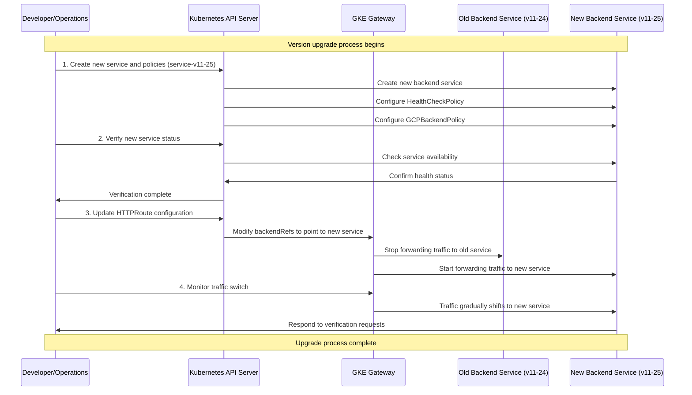

In the GKE Gateway architecture, HTTPRoute is only responsible for traffic routing and does not carry any backend behavior configuration.
Each version of the backend Service must have independent HealthCheckPolicy and BackendPolicy.
In the release process, it is necessary to ensure that the Service and its bound Policy are fully available before switching traffic through HTTPRoute.
The metadata.name of the Policy does not participate in routing and binding logic; the only effective condition is that targetRef points to the Service.

Version upgrade process:
1. Pre-create the new version backend Service and its corresponding GCPBackendPolicy and HealthCheckPolicy
   - New service example (service-v11-25):
   ```yaml
   apiVersion: v1
   kind: Service
   metadata:
     name: service-v11-25
     namespace: abjx-int-common
   spec:
     selector:
       app: api-name-sprint-samples-v11-25
     ports:
     - port: 8443
       targetPort: 8443
   ```

   - Corresponding HealthCheckPolicy example:
   ```yaml
   apiVersion: cloud.google.com/v1
   kind: HealthCheckPolicy
   metadata:
     name: hcp-service-v11-25
     namespace: abjx-int-common
   spec:
     healthCheck:
       type: HTTP
       httpHealthCheck:
         port: 8443
         requestPath: /.well-known/healthcheck
     targetRef:
       group: ""
       kind: Service
       name: service-v11-25
   ```

   - Corresponding GCPBackendPolicy example:
   ```yaml
   apiVersion: cloud.google.com/v1
   kind: GCPBackendPolicy
   metadata:
     name: gbp-service-v11-25
     namespace: abjx-int-common
   spec:
     backendConfig:
       # Backend configuration parameters
     targetRef:
       group: ""
       kind: Service
       name: service-v11-25
   ```

2. Verify that the new version service and policy configurations are correct and running normally
   - Use kubectl to check resource status:
   ```bash
   kubectl get svc service-v11-25 -n abjx-int-common
   kubectl get healthcheckpolicy hcp-service-v11-25 -n abjx-int-common
   kubectl get gcpbackendpolicy gbp-service-v11-25 -n abjx-int-common
   ```

3. Update the backendRefs in HTTPRoute, switching from the old service reference to the new service reference
   - Before update HTTPRoute (referencing service-v11-24):
   ```yaml
   apiVersion: gateway.networking.k8s.io/v1
   kind: HTTPRoute
   metadata:
     name: api-name-sprint-samples-route-v2025
     namespace: abjx-int-common
   spec:
     hostnames:
     - env-region.aliyun.cloud.uk.aibang
     parentRefs:
     - group: gateway.networking.k8s.io
       kind: Gateway
       name: abjx-int-gkegateway-ns
       namespace: abjx-int-gkegateway-ns
     rules:
     - matches:
       - path:
           type: PathPrefix
           value: /api-name-sprint-samples/v2025
       filters:
       - type: URLRewrite
         urlRewrite:
           path:
             type: ReplacePrefixMatch
             replacePrefixMatch: /api-name-sprint-samples/v2025.11.24/
       backendRefs:
       - name: service-v11-24  # Old service
         port: 8443
         weight: 1
   ```

   - After update HTTPRoute (referencing service-v11-25):
   ```yaml
   apiVersion: gateway.networking.k8s.io/v1
   kind: HTTPRoute
   metadata:
     name: api-name-sprint-samples-route-v2025
     namespace: abjx-int-common
   spec:
     hostnames:
     - env-region.aliyun.cloud.uk.aibang
     parentRefs:
     - group: gateway.networking.k8s.io
       kind: Gateway
       name: abjx-int-gkegateway-ns
       namespace: abjx-int-gkegateway-ns
     rules:
     - matches:
       - path:
           type: PathPrefix
           value: /api-name-sprint-samples/v2025
       filters:
       - type: URLRewrite
         urlRewrite:
           path:
             type: ReplacePrefixMatch
             replacePrefixMatch: /api-name-sprint-samples/v2025.11.25/
       backendRefs:
       - name: service-v11-25  # New service
         port: 8443
         weight: 1
   ```

4. Monitor the traffic switching process to ensure the service runs normally
   - Check HTTPRoute status:
   ```bash
   kubectl get httproute api-name-sprint-samples-route-v2025 -n abjx-int-common -o yaml
   ```
   - Verify if traffic is correctly routed to the new service:
   ```bash
   curl -vk https://env-region.aliyun.cloud.uk.aibang/api-name-sprint-samples/v2025/health
   ```

## Upgrade Process Sequence Diagram

