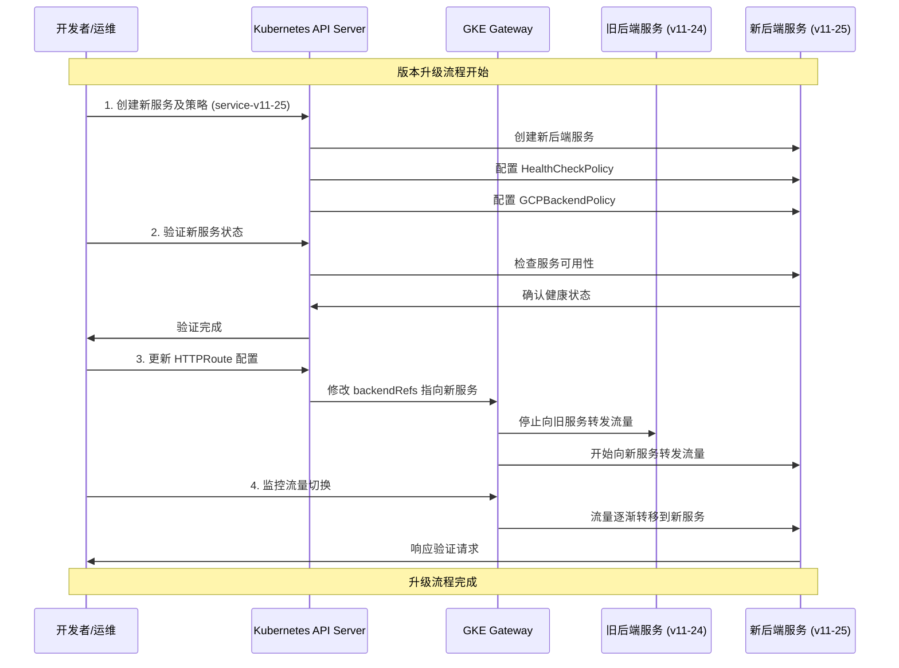

在 GKE Gateway 架构中，HTTPRoute 仅负责流量路由，不承载任何后端行为配置。
每一个版本的后端 Service 必须拥有独立的 HealthCheckPolicy 与 BackendPolicy。
发布流程中，必须确保 Service 及其绑定的 Policy 完整可用后，方可通过 HTTPRoute 切换流量。
Policy 的 metadata.name 不参与路由与绑定逻辑，唯一生效条件为 targetRef 指向的 Service。

版本升级流程：
1. 预先创建新版本的后端 Service 及其对应的 GCPBackendPolicy 和 HealthCheckPolicy
   - 新服务示例 (service-v11-25):
   ```yaml
   apiVersion: v1
   kind: Service
   metadata:
     name: service-v11-25
     namespace: abjx-int-common
   spec:
     selector:
       app: api-name-sprint-samples-v11-25
     ports:
     - port: 8443
       targetPort: 8443
   ```

   - 对应的 HealthCheckPolicy 示例:
   ```yaml
   apiVersion: cloud.google.com/v1
   kind: HealthCheckPolicy
   metadata:
     name: hcp-service-v11-25
     namespace: abjx-int-common
   spec:
     healthCheck:
       type: HTTP
       httpHealthCheck:
         port: 8443
         requestPath: /.well-known/healthcheck
     targetRef:
       group: ""
       kind: Service
       name: service-v11-25
   ```

   - 对应的 GCPBackendPolicy 示例:
   ```yaml
   apiVersion: cloud.google.com/v1
   kind: GCPBackendPolicy
   metadata:
     name: gbp-service-v11-25
     namespace: abjx-int-common
   spec:
     backendConfig:
       # 后端配置参数
     targetRef:
       group: ""
       kind: Service
       name: service-v11-25
   ```

2. 验证新版本服务和策略配置正确且运行正常
   - 使用 kubectl 检查资源状态:
   ```bash
   kubectl get svc service-v11-25 -n abjx-int-common
   kubectl get healthcheckpolicy hcp-service-v11-25 -n abjx-int-common
   kubectl get gcpbackendpolicy gbp-service-v11-25 -n abjx-int-common
   ```

3. 更新 HTTPRoute 中的 backendRefs，从旧服务引用切换到新服务引用
   - 更新前的 HTTPRoute (引用 service-v11-24):
   ```yaml
   apiVersion: gateway.networking.k8s.io/v1
   kind: HTTPRoute
   metadata:
     name: api-name-sprint-samples-route-v2025
     namespace: abjx-int-common
   spec:
     hostnames:
     - env-region.aliyun.cloud.uk.aibang
     parentRefs:
     - group: gateway.networking.k8s.io
       kind: Gateway
       name: abjx-int-gkegateway-ns
       namespace: abjx-int-gkegateway-ns
     rules:
     - matches:
       - path:
           type: PathPrefix
           value: /api-name-sprint-samples/v2025
       filters:
       - type: URLRewrite
         urlRewrite:
           path:
             type: ReplacePrefixMatch
             replacePrefixMatch: /api-name-sprint-samples/v2025.11.24/
       backendRefs:
       - name: service-v11-24  # 旧服务
         port: 8443
         weight: 1
   ```

   - 更新后的 HTTPRoute (引用 service-v11-25):
   ```yaml
   apiVersion: gateway.networking.k8s.io/v1
   kind: HTTPRoute
   metadata:
     name: api-name-sprint-samples-route-v2025
     namespace: abjx-int-common
   spec:
     hostnames:
     - env-region.aliyun.cloud.uk.aibang
     parentRefs:
     - group: gateway.networking.k8s.io
       kind: Gateway
       name: abjx-int-gkegateway-ns
       namespace: abjx-int-gkegateway-ns
     rules:
     - matches:
       - path:
           type: PathPrefix
           value: /api-name-sprint-samples/v2025
       filters:
       - type: URLRewrite
         urlRewrite:
           path:
             type: ReplacePrefixMatch
             replacePrefixMatch: /api-name-sprint-samples/v2025.11.25/
       backendRefs:
       - name: service-v11-25  # 新服务
         port: 8443
         weight: 1
   ```

4. 监控流量切换过程，确保服务正常运行
   - 检查 HTTPRoute 状态:
   ```bash
   kubectl get httproute api-name-sprint-samples-route-v2025 -n abjx-int-common -o yaml
   ```
   - 验证流量是否正确路由到新服务:
   ```bash
   curl -vk https://env-region.aliyun.cloud.uk.aibang/api-name-sprint-samples/v2025/health
   ```

## 升级流程序列图

