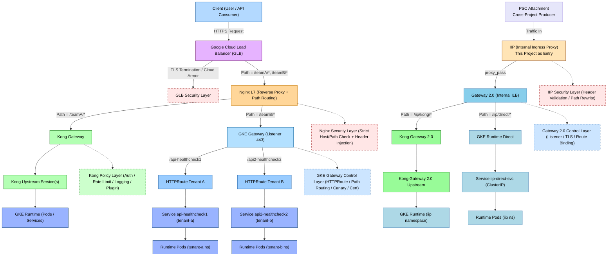
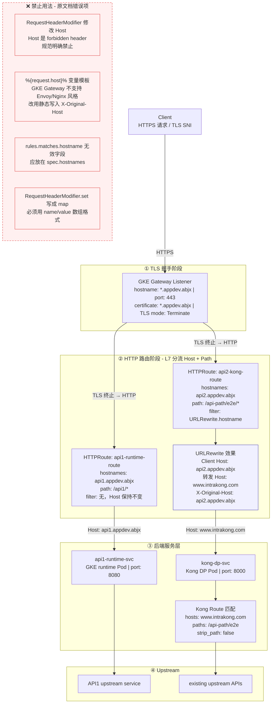

# Gateway 2.0 Architecture Flow

## 修正后的架构：双入口设计



## Flow Summary

```
┌─────────────────────────────────────────────────────────────────────────────┐
│                          DUAL ENTRY POINTS                                  │
├─────────────────────────────────────────────────────────────────────────────┤
│                                                                             │
│  Entry Point A: GLB Ingress (Original)          Entry Point B: PSC (NEW)   │
│  ═══════════════════════════════════            ════════════════════════   │
│                                                                             │
│  Client ──HTTPS──> GLB ──/teamA/*, /teamB/* ──> Nginx L7                   │
│                          │                               │                   │
│                          │                    PSC (Cross-Project)          │
│                          │                         │                        │
│                          │                    PSC Attachment               │
│                          │                         │                        │
│                          │                    IIP (This Project Entry)     │
│                          │                         │                        │
│                    ┌─────┴─────┐                    │                       │
│                    │           │                    ▼                       │
│               /teamA/*    /teamB/*           Gateway 2.0                   │
│                    │           │           ┌──────┴──────┐                  │
│                    ▼           ▼           │             │                  │
│             Kong Gateway  GKE Gateway    /iip/kong/*  /iip/direct/*         │
│                    │           │           │             │                  │
│                    ▼           ▼           ▼             ▼                  │
│             GKE Runtime  HTTPRoutes   Kong GW 2.0  GKE Runtime Direct      │
│                                    │             │                         │
│                                    ▼             ▼                         │
│                               GKE Runtime    Pods (iip ns)                  │
│                                                                             │
└─────────────────────────────────────────────────────────────────────────────┘
```

| Entry Point | Source | Path | Destination |
|-------------|--------|------|-------------|
| **A (Original)** | GLB → Nginx L7 | /teamA/* | Kong Gateway → GKE Runtime |
| **A (Original)** | GLB → Nginx L7 | /teamB/* | GKE Gateway → HTTPRoutes |
| **B (NEW)** | PSC Attachment (Cross-Project) | /iip/* | IIP → Gateway 2.0 → Kong GW 2.0 / Direct |


