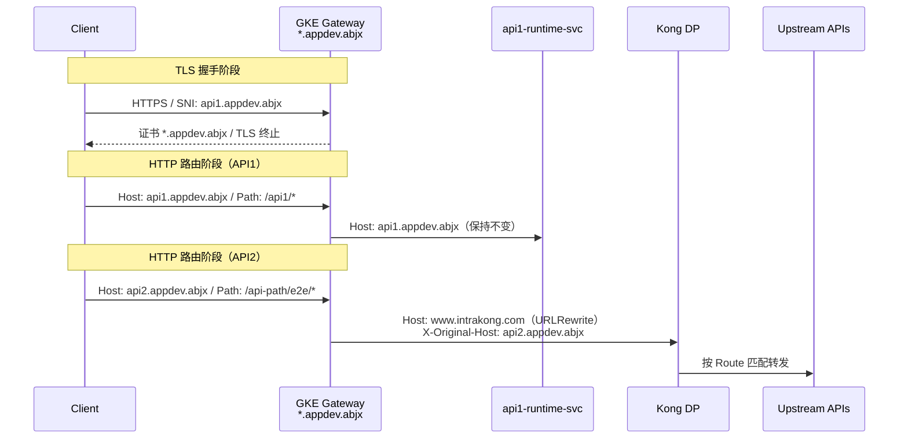
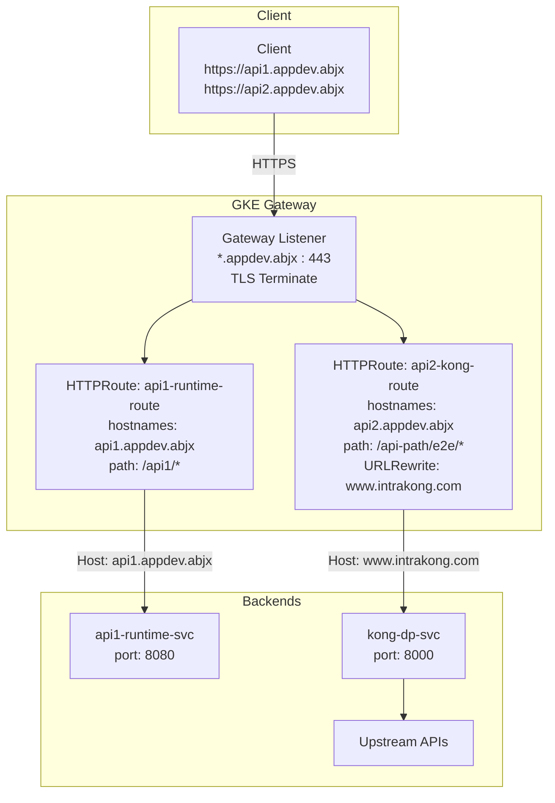

# GKE Gateway 2.0 TLS 终止与 Host Header 转写方案（最终版）

> **文档版本**: v2.0 Final  
> **适用版本**: GKE 1.27+，Gateway API v1（`gateway.networking.k8s.io/v1`）  
> **最后更新**: 2025-05

---

## 1. 结论先行

| 判断项 | 结论 |
|---|---|
| Gateway 2.0 在 `*.appdev.abjx` 上终止 HTTPS | ✅ 可行 |
| 根据 `api1.appdev.abjx` / `api2.appdev.abjx` 分流到不同后端 | ✅ 可行，拆成独立 HTTPRoute |
| 把转发给 Kong DP 的 `Host` 改成 `www.intrakong.com` | ✅ 可行，使用 `URLRewrite.hostname` |
| 用 `RequestHeaderModifier.set` 改写 `Host` | ❌ **规范明确禁止**，`Host` 是 forbidden header，不得通过 header modifier 修改 |
| 用 `%{request.host}%` 这类变量复制原始 Host | ❌ **不可靠**，GKE Gateway 使用 Google Cloud LB 变量格式（如 `{client_region}`），不支持 Envoy/Nginx 风格模板 |
| `rules.matches.hostname` 字段 | ❌ **无效字段**，域名匹配应放在 `spec.hostnames`，或拆成多个 HTTPRoute |
| `api2.appdev.ajbx`（注意拼写） | ⚠️ 若实际是 `ajbx`，不被 `*.appdev.abjx` 证书覆盖，需单独准备证书 |

**推荐路径总结**：

```text
Client
  Host: api2.appdev.abjx / TLS SNI: api2.appdev.abjx
      |
      v
GKE Gateway（使用 *.appdev.abjx 证书终止 HTTPS）
  HTTPRoute 按 hostnames + path 分流
  URLRewrite.hostname: www.intrakong.com
      |
      v
Kong DP Service
  收到 HTTP Host: www.intrakong.com
  按 Kong Route hosts + paths 命中
```

---

## 2. 场景说明

### 2.1 入口域名与证书覆盖范围

Gateway listener 持有 `*.appdev.abjx` 通配符证书，覆盖范围：

| 域名 | 是否覆盖 |
|---|---|
| `api1.appdev.abjx` | ✅ |
| `api2.appdev.abjx` | ✅ |
| `xxx.appdev.abjx` | ✅ |
| `api2.appdev.ajbx` | ❌ 不覆盖，注意拼写 |

本文后续统一以 `api2.appdev.abjx` 说明。

### 2.2 目标流量矩阵

| API | Client 访问域名 | Client 路径 | Gateway 后端 | 后端期望 Host |
|---|---|---|---|---|
| API1 | `api1.appdev.abjx` | `/api1/*` | GKE runtime service | 保持 `api1.appdev.abjx` |
| API2 | `api2.appdev.abjx` | `/api-path/e2e/*` | Kong DP service | 改成 `www.intrakong.com` |

### 2.3 关键 TLS 边界

| 边界 | 说明 |
|---|---|
| Client → Gateway | Gateway 使用 `*.appdev.abjx` 证书终止 HTTPS |
| Gateway → Kong DP | 优先集群内 HTTP；若必须 HTTPS，使用 `appProtocol: HTTPS` |

> GKE Gateway 到 Pod 的 HTTPS 连接**默认不校验**后端证书的 SAN/CN。因此 Kong DP 没有 `*.appdev.abjx` 证书不影响连接建立；真正影响 Kong 路由命中的是 HTTP `Host` header 是否被改成 `www.intrakong.com`。

---

## 3. 两阶段请求处理模型

理解本方案的关键是区分 **TLS 握手阶段** 和 **HTTP 路由阶段**，二者是同一条请求链路里的两个不同动作。

```text
Client 访问: https://api1.appdev.abjx/api1/health

┌─────────────────────────────────────────────────────────────┐
│ 阶段 1: TLS 握手                                             │
│   SNI              = api1.appdev.abjx                       │
│   Listener hostname = *.appdev.abjx                         │
│   证书              = *.appdev.abjx                         │
│   结果: wildcard 覆盖成功，HTTPS 在 Gateway 终止             │
├─────────────────────────────────────────────────────────────┤
│ 阶段 2: HTTP 路由（TLS 解密后）                              │
│   Host     = api1.appdev.abjx                               │
│   Path     = /api1/health                                   │
│   匹配到   = HTTPRoute hostnames: api1.appdev.abjx          │
│   结果: 转发到 api1-runtime-svc                             │
└─────────────────────────────────────────────────────────────┘
```

**核心结论**：

- Gateway listener 的 wildcard hostname/certificate 负责**接入范围**（TLS 终止）
- HTTPRoute 的具体 `hostnames` 负责**业务路由归属**（L7 分流）
- 当具体 HTTPRoute 存在时，`api1.appdev.abjx` 命中自己的 Route，与 wildcard 不竞争
- 更准确的描述：先用 wildcard 证书完成 TLS 终止，再用具体 Host 完成 HTTPRoute 匹配

### 3.1 流程图



---

## 4. 推荐架构



---

## 5. 完整可部署配置

### 5.1 GatewayClass 选择

根据实际入口类型选择：

| 场景 | GatewayClass |
|---|---|
| 公网全局入口 | `gke-l7-global-external-managed` |
| 公网区域入口 | `gke-l7-regional-external-managed` |
| 内网区域入口 | `gke-l7-rilb` |

### 5.2 Gateway

```yaml
apiVersion: gateway.networking.k8s.io/v1
kind: Gateway
metadata:
  name: gateway-2-external
  namespace: gateway-system
spec:
  gatewayClassName: gke-l7-global-external-managed
  listeners:
  - name: https
    protocol: HTTPS
    port: 443
    hostname: "*.appdev.abjx"
    tls:
      mode: Terminate
      certificateRefs:
      - name: gateway-2-external-cert   # Secret 名称，需提前创建
    allowedRoutes:
      namespaces:
        from: All
```

### 5.3 API1 HTTPRoute：直接转发到 GKE runtime

```yaml
apiVersion: gateway.networking.k8s.io/v1
kind: HTTPRoute
metadata:
  name: api1-runtime-route
  namespace: iip
spec:
  parentRefs:
  - name: gateway-2-external
    namespace: gateway-system
    sectionName: https
  hostnames:
  - api1.appdev.abjx        # 域名匹配在此处，不在 rules.matches 里
  rules:
  - matches:
    - path:
        type: PathPrefix
        value: /api1
    backendRefs:
    - name: api1-runtime-svc
      port: 8080
```

### 5.4 API2 HTTPRoute：转发到 Kong DP 并改写 Host

这是本需求的核心配置。

```yaml
apiVersion: gateway.networking.k8s.io/v1
kind: HTTPRoute
metadata:
  name: api2-kong-route
  namespace: kong-system
spec:
  parentRefs:
  - name: gateway-2-external
    namespace: gateway-system
    sectionName: https
  hostnames:
  - api2.appdev.abjx
  rules:
  - matches:
    - path:
        type: PathPrefix
        value: /api-path/e2e
    filters:
    # ✅ Host 改写唯一正确方式：URLRewrite.hostname
    # ❌ 禁止用 RequestHeaderModifier 修改 Host（Gateway API 规范将 Host 列为 forbidden header）
    - type: URLRewrite
      urlRewrite:
        hostname: www.intrakong.com
    # 自定义 header：静态保留原始域名信息，不依赖变量模板
    - type: RequestHeaderModifier
      requestHeaderModifier:
        set:
        - name: X-Original-Host       # 静态值，不使用 %{request.host}% 等变量
          value: api2.appdev.abjx
        - name: X-Entry-Point
          value: api2
        - name: X-Upstream-Gateway
          value: gke-gateway-2
        - name: X-Forwarded-Proto
          value: https
    backendRefs:
    - name: kong-dp-svc
      port: 8000
```

**转发效果**：

```text
Client -> Gateway:
  Host: api2.appdev.abjx
  Path: /api-path/e2e/v1/resource

Gateway -> Kong:
  Host: www.intrakong.com          ← URLRewrite 改写
  Path: /api-path/e2e/v1/resource  ← 路径保持不变
  X-Original-Host: api2.appdev.abjx
  X-Entry-Point: api2
  X-Upstream-Gateway: gke-gateway-2
```

### 5.5 Gateway -> Kong 使用 HTTPS（可选）

若内部通信必须 HTTPS，使用 `appProtocol: HTTPS`（旧 annotation 不适用于 Gateway API）：

```yaml
apiVersion: v1
kind: Service
metadata:
  name: kong-dp-svc
  namespace: kong-system
spec:
  selector:
    app: kong-dp
  ports:
  - name: proxy-https
    port: 8443
    targetPort: 8443
    appProtocol: HTTPS    # ✅ Gateway API 正确方式
    # 旧方式: networking.gke.io/app-protocol: "HTTPS" ❌ 不适用于 Gateway API
```

对应 HTTPRoute backendRef 端口改为 `8443`。

---

## 6. Kong DP 配置

### 6.1 推荐 Route 配置

```yaml
_format_version: "3.0"

services:
- name: api2-e2e-backend
  url: http://api2-backend.iip.svc.cluster.local:8080
  routes:
  - name: api2-e2e-route
    hosts:
    - www.intrakong.com         # 与 Gateway URLRewrite.hostname 保持一致
    paths:
    - /api-path/e2e
    strip_path: false           # 保留路径前缀，除非后端明确要求去掉
```

### 6.2 路径冲突控制

| 检查项 | 建议 |
|---|---|
| Kong Route paths | 使用明确前缀，如 `/api-path/e2e`，避免 `/api` 过宽前缀 |
| hosts | 给 common API 固定 `www.intrakong.com`，与现有 Route 隔离 |
| strip_path | 默认 `false`，后端明确需要时再开启 |
| priority | 若有正则或多路径 Route，检查 Kong 实际匹配优先级 |
| 发布顺序 | **先发布 Kong Route，再发布 Gateway HTTPRoute** |

---

## 7. 原文档错误项说明

### 7.1 `Host` 是 forbidden header，不得用 `RequestHeaderModifier` 修改

**原文问题**：使用 `RequestHeaderModifier.set` 修改 `Host` header。

**正确理解**：Gateway API 规范明确将 `Host` 列为 forbidden header，`RequestHeaderModifier` 不得用于修改它。改写 Host 的唯一标准方式是 `URLRewrite.hostname`：

```yaml
# ❌ 错误 - 规范禁止
filters:
- type: RequestHeaderModifier
  requestHeaderModifier:
    set:
    - name: Host
      value: www.intrakong.com

# ✅ 正确 - 唯一标准方式
filters:
- type: URLRewrite
  urlRewrite:
    hostname: www.intrakong.com
```

### 7.2 `RequestHeaderModifier.set` 写法必须为数组

```yaml
# ❌ 错误 - map 格式
requestHeaderModifier:
  set:
    Host: www.intrakong.com
    X-Upstream-Service: kong-dp

# ✅ 正确 - name/value 数组
requestHeaderModifier:
  set:
  - name: X-Upstream-Service
    value: kong-dp
```

### 7.3 `%{request.host}%` 变量不可靠

GKE Gateway 基于 Google Cloud Load Balancing，支持的自定义 header 变量格式为：

```yaml
# ✅ GKE Gateway 支持的变量格式（Google Cloud LB 格式）
- name: X-Client-Geo-Location
  value: "{client_region},{client_city}"
```

`%{request.host}%` 是 Envoy/Nginx 风格模板，GKE Gateway 不支持。**不要依赖 Gateway 动态复制原始 Host 到自定义 header**，改为静态写入：

```yaml
# ✅ 推荐：每个 HTTPRoute 静态写入原始域名
- name: X-Original-Host
  value: api2.appdev.abjx
```

### 7.4 `rules.matches.hostname` 是无效字段

```yaml
# ❌ 错误 - hostname 不在 rules.matches 里
rules:
- matches:
  - path:
      type: PathPrefix
      value: /api-path/e2e
  hostname:
  - api2.appdev.abjx

# ✅ 正确 - hostname 在 spec.hostnames
spec:
  hostnames:
  - api2.appdev.abjx
  rules:
  - matches:
    - path:
        type: PathPrefix
        value: /api-path/e2e
```

---

## 8. 验证步骤

### 8.1 验证 Gateway 和 HTTPRoute 状态

```bash
# 检查 Gateway 状态
kubectl get gateway -n gateway-system gateway-2-external
kubectl describe gateway -n gateway-system gateway-2-external

# 检查所有 HTTPRoute
kubectl get httproute -A
kubectl describe httproute -n iip api1-runtime-route
kubectl describe httproute -n kong-system api2-kong-route
```

重点确认：

- `Accepted=True`
- `Reconciled=True`
- 无 `UnsupportedValue` / `Invalid` 事件

### 8.2 验证 API1

```bash
GATEWAY_IP=<gateway-external-ip>

curl -vk \
  --resolve api1.appdev.abjx:443:${GATEWAY_IP} \
  https://api1.appdev.abjx/api1/health
```

期望：

- TLS 证书 CN/SAN 包含 `*.appdev.abjx`
- 请求命中 `api1-runtime-svc`
- 后端看到 `Host: api1.appdev.abjx`（保持不变）

### 8.3 验证 API2 到 Kong

```bash
GATEWAY_IP=<gateway-external-ip>

curl -vk \
  --resolve api2.appdev.abjx:443:${GATEWAY_IP} \
  https://api2.appdev.abjx/api-path/e2e/health
```

期望：

- Client 访问域名仍为 `api2.appdev.abjx`
- Kong access log 里看到 `Host: www.intrakong.com`
- Kong access log 或请求 header 里看到 `X-Original-Host: api2.appdev.abjx`
- Kong Route 命中 `api2-e2e-route`
- 上游收到路径 `/api-path/e2e/health`（`strip_path: false`）

### 8.4 验证 Cloud URL Map 是否生成 Host rewrite

```bash
# 全局 Gateway
gcloud compute url-maps list
gcloud compute url-maps describe <url-map-name> --global

# 区域 Gateway
gcloud compute url-maps describe <url-map-name> --region <region>
```

确认 URL map 中出现 `hostRewrite: www.intrakong.com`，说明 `URLRewrite.hostname` 已下发到 Cloud Load Balancing。

---

## 9. 回滚策略

### 9.1 最小影响回滚（只影响 API2）

```bash
kubectl delete httproute -n kong-system api2-kong-route
```

- 影响范围：仅 `api2.appdev.abjx`
- 不影响 `api1.appdev.abjx`、Gateway listener、证书

### 9.2 灰度发布建议

若现有旧入口仍在服务，建议先用临时域名验证：

```bash
# 1. 先创建 canary HTTPRoute，绑定临时域名
#    api2-canary.appdev.abjx -> Gateway -> Kong DP

# 2. 验证 Kong access log、upstream 响应均正常

# 3. 再切换正式 DNS 或正式 HTTPRoute
```

---

## 10. 替代方案对比

| 方案 | 适用场景 | 不足 |
|---|---|---|
| ✅ **推荐**：`URLRewrite.hostname`（本文方案） | 当前需求最匹配，Kong 侧不需改动 | 需确认 GKE 1.27+ 支持 `urlRewrite` |
| 让 Kong Route 同时接受 `api2.appdev.abjx` | 可修改 Kong Route 时更简单，Gateway 不改 Host | Kong 侧暴露了入口域名 |
| Gateway 不改 Host，仅按 Path 转发 | Kong Route 空间非常清晰 | 容易与现有 API 路径冲突 |
| 在 Kong 前加 Nginx/Envoy 做转换 | 复杂兼容场景 | 增加一层运维复杂度，不建议 V1 |

若能修改 Kong Route，最简方案是让 Kong 同时接受两个 hosts：

```yaml
hosts:
- www.intrakong.com
- api2.appdev.abjx
```

这样 Gateway 只做 TLS 终止，无需 URLRewrite。若组织边界要求 Kong 只认 `www.intrakong.com`，采用本文推荐方案。

---

## 11. 官方依据

| 文档 | 关键点 |
|---|---|
| [GKE Deploying Gateways](https://cloud.google.com/kubernetes-engine/docs/how-to/deploying-gateways) | `URLRewrite.hostname` 示例；custom headers、redirect、URL rewrite 需 GKE 1.27+ |
| [GKE GatewayClass capabilities](https://cloud.google.com/kubernetes-engine/docs/how-to/gatewayclass-capabilities) | 支持的 filter 类型：`requestHeaderModifier`、`urlRewrite`（含 `hostname` 和 `path.replacePrefixMatch`） |
| [Gateway API HTTPRoute spec](https://gateway-api.sigs.k8s.io/reference/spec/) | `RequestHeaderModifier` 的 `add/set` 使用 `name/value` 数组；`Host` 为 forbidden header |
| GKE Gateway 后端 HTTPS | 使用 `ports[].appProtocol: HTTPS`；旧 annotation `networking.gke.io/app-protocol` 不适用 Gateway API |
| Google Cloud LB 后端 TLS | 默认不校验后端证书 SAN/CN |

---

## 12. 最终操作清单

```text
发布前检查:
[ ] GKE 版本 >= 1.27
[ ] *.appdev.abjx 证书已创建为 Secret（gateway-2-external-cert）
[ ] Kong Route 已配置 hosts: www.intrakong.com + paths: /api-path/e2e

发布顺序:
[ ] 1. 先发布 Kong Route（api2-e2e-route）
[ ] 2. 发布 Gateway（gateway-2-external）
[ ] 3. 发布 API1 HTTPRoute（api1-runtime-route）
[ ] 4. 发布 API2 HTTPRoute（api2-kong-route）

验证:
[ ] kubectl describe httproute 确认 Accepted=True
[ ] curl --resolve api1 验证 API1 Host 保持不变
[ ] curl --resolve api2 验证 Kong access log Host = www.intrakong.com
[ ] gcloud url-maps describe 确认 hostRewrite 字段存在
[ ] Kong access log 确认 X-Original-Host 正确

回滚准备:
[ ] 保留旧入口配置备份
[ ] 确认 kubectl delete httproute api2-kong-route 只影响 API2
```


Client


整个流程图涵盖了文档的四个核心层次：

**① TLS 握手阶段** — Gateway Listener 用 `*.appdev.abjx` 证书终止 HTTPS，SNI 匹配 wildcard

**② HTTP 路由阶段** — 解密后按 `Host + Path` 分两条 HTTPRoute：
- 左路 API1 → `api1-runtime-svc`，Host 保持不变
- 右路 API2 → `URLRewrite.hostname` 改写为 `www.intrakong.com`，附带静态 `X-Original-Host`

**③ Kong 路由命中** — Kong Route 按 `hosts: www.intrakong.com + paths: /api-path/e2e` 匹配

**④ 禁止用法红区** — 底部汇总了原文档四处错误，方便对照排查