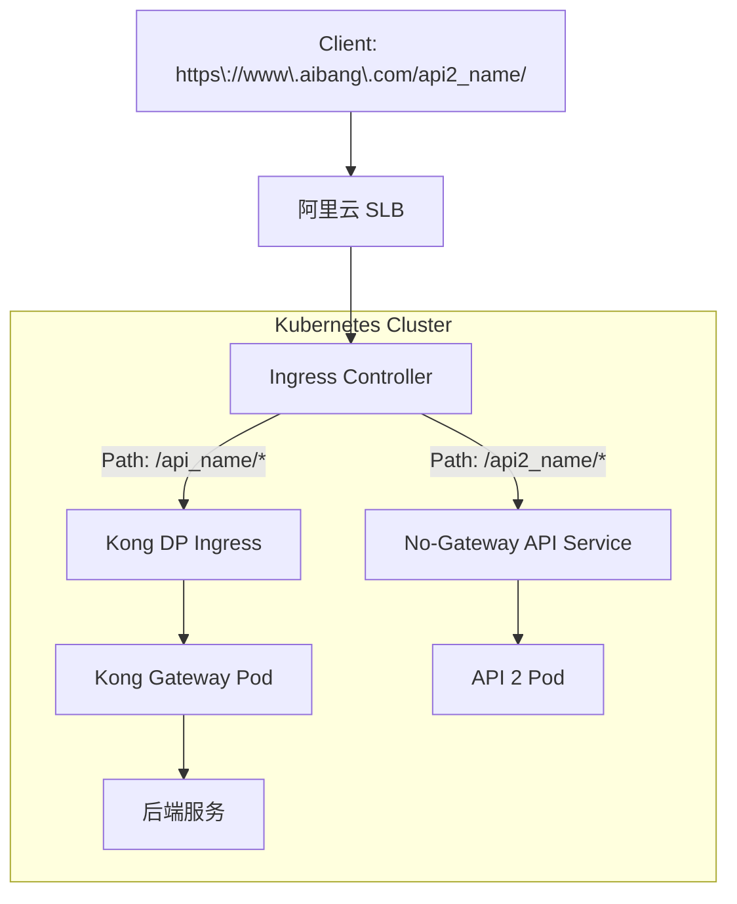
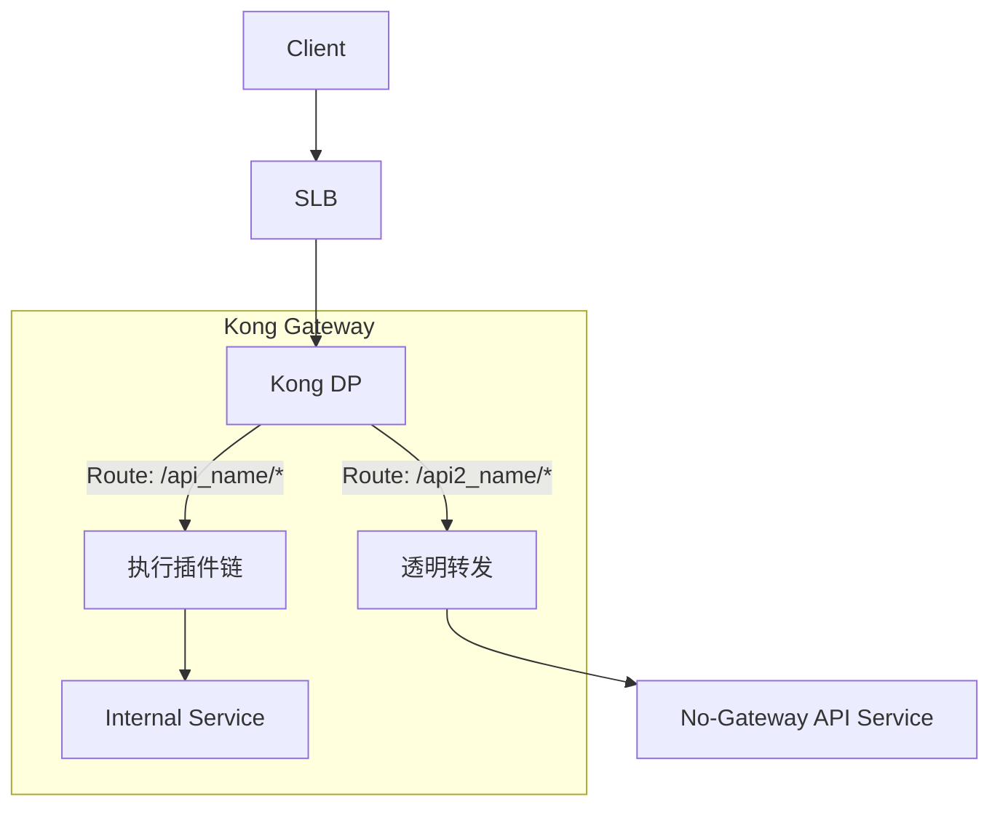

# 阿里云 SLB 统一入口下实现 No-Gateway 访问模式

## 🎯 核心需求

当前架构中存在两类 API 访问方式：
1.  **有 Gateway**：`https://www.aibang.com/api_name/v1/` -> SLB -> Ingress Controller -> Kong DP -> 后端服务
2.  **无 Gateway**：`https://api2_name.aibang.com/` -> SLB -> Ingress Controller -> 独立 Ingress -> 后端服务

目标是将“无 Gateway”的 API 迁移到统一域名下，实现 `https://www.aibang.com/api2_name/` 的访问效果，但流量**不经过 Kong Gateway**，以实现统一入口和简化管理。

---

## 🧩 问题分析

当前两类 API 的流量路径和配置方式有本质区别：

| 类型 | 示例 URL | 流量路径 | 路由依据 |
| :--- | :--- | :--- | :--- |
| **有 Gateway** | `https://www.aibang.com/api_name/v1/` | SLB → Ingress Controller → Kong DP → 后端服务 | Host + Path |
| **无 Gateway** | `https://api2_name.aibang.com/` | SLB → Ingress Controller → 独立 Ingress → API Pod | Host (Server Name) |

要实现统一入口，关键在于如何在 `www.aibang.com` 这个域名下，根据不同的 `path` 将流量精确分发到 **Kong DP** 或 **后端 API Service**。

---

## 🚀 解决方案

我们可以在不同的网络层级实现流量分发。以下是三种主流的解决方案，各有优劣。

### 方案一：在 Ingress Controller 层通过 Path 路由分流 (推荐)

这是最简洁、最符合 Kubernetes 设计理念的方案。我们利用 Ingress Controller (如 Nginx Ingress Controller) 的能力，在同一个 Ingress 资源中定义不同路径的转发规则。

#### ✅ 逻辑结构



#### ✅ 实现思路

创建一个统一的 Ingress 资源，绑定 `www.aibang.com`。
- 访问 `/api_name_version/` 的流量，转发到 `kong-dp-service`。
- 访问 `/api2_name/` 的流量，直接转发到 `api2-service`。

**示例 Ingress (Nginx Controller):**
```yaml
apiVersion: networking.k8s.io/v1
kind: Ingress
metadata:
  name: unified-entry-ingress
  namespace: ingress-system
  annotations:
    kubernetes.io/ingress.class: "nginx"
    # 如果 api2-service 需要重写路径 (e.g., /api2_name/ -> /), 可添加以下 annotation
    # nginx.ingress.kubernetes.io/rewrite-target: /$2
spec:
  rules:
  - host: www.aibang.com
    http:
      paths:
      # 规则一：将特定路径转发到 Kong Gateway
      - path: /api_name_version/
        pathType: Prefix
        backend:
          service:
            name: kong-dp-service  # Kong DP 的 Service 名称
            port:
              number: 8000
      # 规则二：将另一路径直接转发到后端 API Service
      - path: /api2_name/
        pathType: Prefix
        backend:
          service:
            name: api2-service      # 无网关 API 的 Service 名称
            port:
              number: 8080
```

#### ✅ 优缺点

- **优点**:
    - **单一入口**：所有 API 共享一个域名，易于管理和宣传。
    - **结构清晰**：路由规则集中在同一个 Ingress 资源中，一目了然。
    - **性能高**：“无网关”流量直达后端，路径最短。
    - **无需改动 SLB**：所有变更都在 K8S 集群内完成。
- **缺点**:
    - **路径冲突风险**：需要仔细规划 API 路径，避免规则重叠。
    - **Ingress Controller 依赖**：强依赖 Ingress Controller 的路由和重写能力。
    - **集中化配置风险**：单个 Ingress 资源成为“单点故障”，一次错误修改可能影响所有服务。(详见下文分析)

---

## 方案一的风险深化与缓解策略

您提出的“单点故障”问题非常关键。虽然方案一在架构上最简洁，但在运维层面，将所有路由规则集中于一个 `Ingress` 资源确实会带来严峻的挑战。

### ⚠️ 风险：集中化配置的“单点故障”

当数十甚至上百个服务的路由规则全部定义在一个 YAML 文件中时，会产生以下风险：

1.  **影响范围扩大 (Large Blast Radius)**：任何一次对该文件的无效修改——无论是手动误操作还是自动化部署的 Bug——都可能导致整个 `www.aibang.com` 域名下的所有服务中断。
2.  **协作与冲突**：不同团队或开发者在同一时间修改同一个文件，极易产生合并冲突和意料之外的相互影响。
3.  **配置复杂度**：随着服务增多，该文件会变得异常庞大和复杂，难以阅读和维护，成为团队的技术债务。

### ✅ 缓解策略：去中心化与自动化

幸运的是，我们可以通过以下几种方式来有效缓解这些风险，将方案一升级为企业级的稳健实践。

#### 策略一：Ingress 规则拆分 (Decentralized Management)

这是最重要也是最有效的策略。大多数 Ingress Controller (包括 Nginx) 都支持**自动合并**来自不同 `Ingress` 资源但属于同一个 `host` 的规则。

这意味着，我们可以**为每个应用或团队创建独立的 Ingress 文件**。

**实现思路：**

-   **Kong 团队**维护一个 `ingress-kong.yaml`。
-   **API 2 团队**维护一个 `ingress-api2.yaml`。
-   Ingress Controller 会自动将这两个文件的规则聚合起来，生成最终的路由配置。

**示例：**

**`ingress-kong.yaml`**
```yaml
apiVersion: networking.k8s.io/v1
kind: Ingress
metadata:
  name: ingress-for-kong-gateway
  namespace: kong-team
  annotations:
    kubernetes.io/ingress.class: "nginx"
spec:
  rules:
  - host: www.aibang.com
    http:
      paths:
      - path: /api_name_version/
        pathType: Prefix
        backend:
          service:
            name: kong-dp-service
            port:
              number: 8000
```

**`ingress-api2.yaml`**
```yaml
apiVersion: networking.k8s.io/v1
kind: Ingress
metadata:
  name: ingress-for-api2
  namespace: api2-team
  annotations:
    kubernetes.io/ingress.class: "nginx"
spec:
  rules:
  - host: www.aibang.com
    http:
      paths:
      - path: /api2_name/
        pathType: Prefix
        backend:
          service:
            name: api2-service
            port:
              number: 8080
```

**优点：**
-   **故障隔离**：`ingress-api2.yaml` 的错误只会影响 `/api2_name/`，不会影响到 Kong Gateway 的流量。
-   **权责清晰**：每个团队只负责自己的路由规则，互不干扰。
-   **简化管理**：配置文件小而美，易于维护。

#### 策略二：引入 GitOps 工作流

将所有 Ingress 配置纳入 Git 进行版本管理，并通过 ArgoCD、Flux 等 GitOps 工具自动化地同步到集群。

```mermaid
graph TD
    A[Developer] -->|1. 提交 PR ingress-api2.yaml| B Git Repository
    B -->|2. 触发 CI/CD Pipeline| C[自动化检查]
    C -->|Linting / Dry-Run| D{通过?}
    D -- Yes -->|3. 合并到 main 分支| E[Git Repository]
    E -->|4. GitOps 工具检测到变更| F[ArgoCD / Flux]
    F -->|5. 自动应用到 K8S 集群| G[Kubernetes Cluster]
    D -- No -->|反馈错误| A
```

**优点：**
-   **变更可追溯**：所有变更都有记录，可以轻松回滚。
-   **强制代码审查**：通过 Pull Request (PR) 机制，所有变更都必须经过同行评审。
-   **自动化校验**：可以在 CI 流程中加入自动化的语法和逻辑检查。

#### 策略三：部署前置检查 (Pre-flight Checks)

在 CI/CD 流水线中，执行 `kubectl apply` 之前，强制执行校验命令。

```bash
# 1. 客户端校验 (检查 YAML 语法)
kubectl apply -f ingress-api2.yaml --dry-run=client

# 2. 服务端校验 (让 K8S API Server 验证对象合法性，强烈推荐)
kubectl apply -f ingress-api2.yaml --dry-run=server
```

如果任何一个命令失败，则立即中止部署，防止无效配置进入集群。

---

通过结合 **Ingress 规则拆分**、**GitOps** 和 **自动化前置检查**，我们可以将方案一从一个有潜在风险的架构，转变为一个既灵活又高度稳健的企业级解决方案。

---

### 方案二：通过 Kong Gateway 做“透明转发”

此方案让所有流量都经过 Kong Gateway，但对“无网关”的 API，Kong 只做一个简单的代理转发，不执行任何插件（如鉴权、限流）。

#### ✅ 逻辑结构



#### ✅ 实现思路

在 Kong 中为 `/api2_name/` 创建一个 Route 和 Service，但不在其上配置任何插件。Kong 此时扮演一个纯粹的 L7 代理角色。

**示例 (Kong Admin API):**
```bash
# 1. 创建一个指向后端 API Service 的 Kong Service
curl -X POST http://kong-admin:8001/services/ \
  --data name=api2-transparent-service \
  --data url=http://api2-service.namespace.svc.cluster.local:8080

# 2. 为该 Service 创建一个 Route，匹配路径
curl -X POST http://kong-admin:8001/services/api2-transparent-service/routes \
  --data 'paths[]=/api2_name/' \
  --data strip_path=true
```

#### ✅ 优缺点

- **优点**:
    - **管理统一**：所有路由规则都在 Kong 中管理。
    - **平滑迁移**：未来可随时为“无网关”API 启用 Kong 的插件，实现平滑过渡。
    - **可复用全局能力**：即使是透明转发，依然可以应用 Kong 的全局插件（如日志、监控）。
- **缺点**:
    - **性能损耗**：流量多经过了一跳（hop），即使是透明转发也有微小的性能开销。
    - **违背初衷**：物理上流量依然经过了 Gateway，并非真正的“No-Gateway”。

---

### 方案三：在阿里云 SLB 层实现 L7 分流

如果你的 SLB 使用的是 **HTTP/HTTPS 监听**，可以直接在 SLB 上配置基于路径的转发规则。

#### ✅ 实现思路

在阿里云 SLB 控制台：
1.  配置一个 `www.aibang.com` 的域名。
2.  创建两条转发规则：
    - **规则一**：如果 URL 路径匹配 `/api_name_version/*`，则将请求转发到后端的 **Kong Ingress Controller** 所在的服务器组。
    - **规则二**：如果 URL 路径匹配 `/api2_name/*`，则将请求转发到后端的 **独立 Ingress** 或 **API Service** 所在的服务器组。

#### ✅ 优缺点

- **优点**:
    - **彻底隔离**：流量在进入 K8S 集群前就已分流，后端架构完全解耦。
    - **不依赖 K8S Ingress**：路由逻辑与 K8S 内部配置无关。
- **缺点**:
    - **配置分散**：路由规则一部分在 SLB，一部分在 K8S，管理和排障复杂。
    - **灵活性差**：每次新增或修改路径都需要操作 SLB，无法通过 GitOps 等方式自动化。
    - **成本可能更高**：复杂的 SLB 规则或更多的监听器可能产生额外费用。

---

## 🧠 结论与建议

| 场景 | 建议方案 | 理由 |
| :--- | :--- | :--- |
| **希望 K8S 原生、结构清晰、易于维护** | ✅ **方案一 (Ingress Path 分流) + 风险缓解策略** | 这是最主流和推荐的做法，将路由逻辑保留在最靠近应用的地方，符合云原生理念。 |
| **希望未来所有 API 都统一由 Kong 管理** | ✅ **方案二 (Kong 透明转发)** | 提供了一个平滑的过渡方案，今天实现统一入口，明天可无缝启用网关能力。 |
| **后端服务在不同 VPC 或有严格网络隔离要求** | ⚙️ **方案三 (SLB L7 分流)** | 当后端是完全异构或需要从网络层面做强隔离时，此方案更合适。 |

对于您当前的场景，**方案一（Ingress Path 分流）** 是最佳选择。它既能实现统一入口的目标，又能确保“无网关”API 的流量路径最短，同时保持了配置的集中和简洁。配合上文提到的**风险缓解策略**，可以构建一个稳健且易于扩展的路由架构。