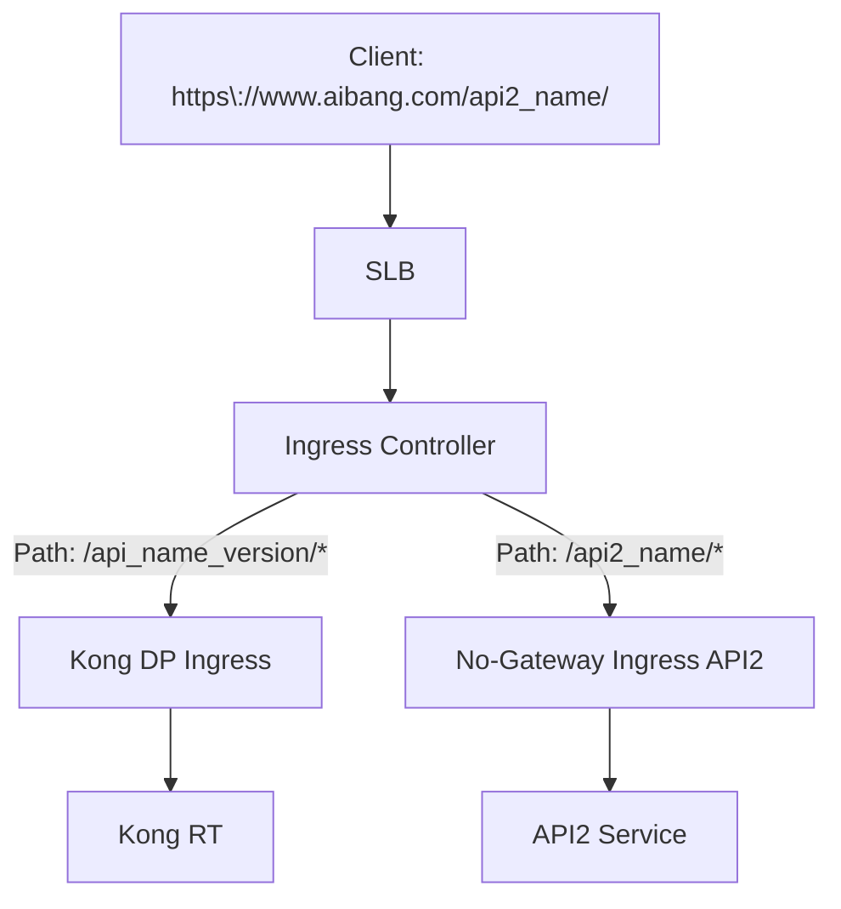
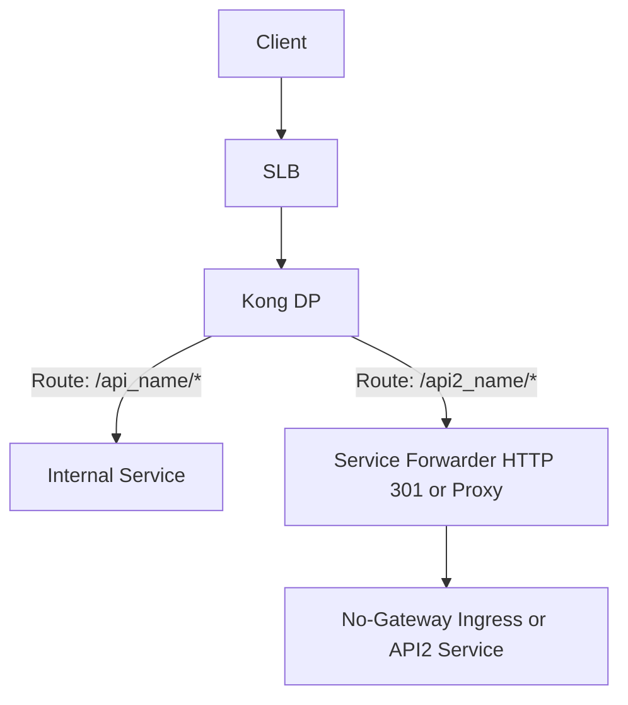

关于阿里云的SLB,我们目前的架构是这样的 ，直接把对应的 SLB的请求转发到后面的 Ingress control了。然后 ingress control了再根据不同的用户请求转发到后面的 ingress上面 

1 ingress是Kong DP 这一部分我们都是基于location/path来区分不同的用户的API的 把这种归类为有Gateway的 比如https://www.aibang.com/api_name_version/v1/

2 部分API目前直接是配置了对应的Server_name跳转到自己对应的Ingress 直接到API的 https://api2_name.aibang.com/ 

基于上面的这部分其实我们的第二个方式就是类似一种No gateway的工作方式

那么我现在想要实现No Gateway的这部分API也迁移到第一种访问的模式 比如https://www.aibang.com/api2_name/ 但是不走Kong Gateway 有什么实现方式么? 我们主要是想实现统一入口


非常好的问题，这正是很多在使用 **多 Ingress + 单域名统一入口** 架构时需要解决的关键设计点。

你的目标是：

> ✅ **所有请求统一通过同一个入口域名（如 https://www.aibang.com）**

> 但部分 API **不走 Kong Gateway（DP）**，而是直接转发到对应的后端 Ingress。

下面我将分为几个部分来讲解：

---

## **🧩 问题分析**

你当前有两类 API：

| **类型**   | **示例 URL**                                | **流量路径**                                      | **说明**                         |
| ---------- | ------------------------------------------- | ------------------------------------------------- | -------------------------------- |
| 有 Gateway | https://www.aibang.com/api_name_version/v1/ | SLB → Ingress Controller → Kong DP → 后端服务     | 使用 path 区分不同用户或 API     |
| 无 Gateway | https://api2_name.aibang.com/               | SLB → Ingress Controller → 对应 Ingress → API Pod | 使用独立 server_name（二级域名） |

目标：

👉 让第二类 API 也统一入口到 https://www.aibang.com/api2_name/，

但 **不经过 Kong Gateway**。

---

## **🚀 解决方案**

有三种主要方式可以实现此目标，取决于你希望在哪一层进行分流控制：

---

### **方案一：在 Ingress Controller 层通过 Path 路由分流**

（推荐，结构最简洁）

#### **✅ 逻辑结构**



#### **✅ 实现思路**

在同一个域名下，通过 Nginx Ingress Controller 的 path 匹配将部分流量直接导向非 Kong 的 Service。

示例 Ingress（Nginx Controller）：

```yaml
apiVersion: networking.k8s.io/v1
kind: Ingress
metadata:
  name: unified-ingress
  namespace: ingress-system
  annotations:
    kubernetes.io/ingress.class: "nginx"
spec:
  rules:
  - host: www.aibang.com
    http:
      paths:
      - path: /api_name_version/
        pathType: Prefix
        backend:
          service:
            name: kong-dp-service
            port:
              number: 8000
      - path: /api2_name/
        pathType: Prefix
        backend:
          service:
            name: api2-service
            port:
              number: 8080
```

#### **✅ 优点**

- 单域名统一入口。
- 不经过 Kong 的路径直接路由到目标后端。
- 配置集中，SLB 层不需改动。

#### **⚠️ 注意**

- Kong DP 的 Ingress 不应再声明 host: www.aibang.com 覆盖 /api2_name/。
- 注意避免 Path 重叠或冲突。
- 若未来 Kong 和非 Kong 服务共用 cookie/session，要确保路径隔离。

---

### **方案二：通过 Kong Gateway 做“透明转发”**

（适合未来要逐步迁移到 Kong，但暂不接入的服务）

#### **✅ 逻辑结构**



#### **✅ 实现思路**

在 Kong 配置中为 /api2_name/ 建立一个 Route，但使用 request-transformer 或 forward-proxy 插件直接将请求转发出去。

示例：

```
curl -X POST http://kong-admin:8001/services/ \
  --data name=api2-service \
  --data url=http://api2-service.namespace.svc.cluster.local:8080

curl -X POST http://kong-admin:8001/services/api2-service/routes \
  --data 'paths[]=/api2_name/'
```

#### **✅ 优点**

- 客户端仍统一走 www.aibang.com。
- 可通过 Kong 实现全局安全策略、日志记录、限流等。
- 未来如需正式接入 Kong，仅需启用插件即可。

#### **⚠️ 注意**

- 虽然叫 “No Gateway”，但物理上流量仍经过 Kong，一定程度上增加 hop。
- 若性能敏感，可结合 upstream keepalive 优化。

---

### **方案三：在 SLB 层实现 L7 分流**

（适合 SLB 支持基于路径的转发）

如果使用的是阿里云 SLB 的 **HTTP/HTTPS 监听器**，可以在 Listener 层定义：

- /api_name/\* → 转发到 Kong 所在 Ingress
- /api2_name/\* → 转发到 API2 所在 Ingress Controller

#### **✅ 优点**

- 后端完全隔离（真正的 No-Gateway 流量）。
- 不影响现有 Kong 路由。

#### **⚠️ 缺点**

- 需要在 SLB 层维护多个转发规则。
- 配置分散，不便集中管理。
- 后续扩展新 API 路由需要改动 SLB。

---

## **🧠 最佳实践建议**

| **目标**              | **建议方案**                       |
| --------------------- | ---------------------------------- |
| 希望统一入口 + 易管理 | ✅ **方案一（Ingress Path 分流）** |
| 希望未来逐步接入 Kong | ✅ **方案二（Kong 透明转发）**     |
| 特殊性能或安全要求    | ⚙️ **方案三（SLB L7 分流）**       |

---

## **✅ 小结**

你可以通过以下方式实现“统一入口 + 分流”：

- **推荐路径级分流（Ingress 层）**：
    - 一个域名（www.aibang.com）
    - 不同 path → 不同 Service（Kong / 非 Kong）
- 若想后续收敛到 Kong，可通过透明路由实现平滑过渡。

---

是否希望我帮你画出当前架构与目标架构的对比图（Mermaid 图）？

可以更直观看出差异和迁移路径。


非常好的思考 👏

你指出的这个隐患非常关键：**在统一 Ingress 层集中 path 管理时，配置变更错误可能会影响全局流量。**

这类问题在大规模多租户或多团队 API 管理架构中非常常见。下面我详细分析风险与应对策略。

---

## **🧩 问题分析**

  

在 **方案一（Ingress Path 分流）** 中，你的统一入口 Ingress（称为 unified-ingress）承担了以下职责：

- 接收所有流量（同一个域名）
    
- 按 path 转发到对应 Service（Kong 或 API 服务）
    

  

当有新用户部署时，需要新增类似以下配置：

```
- path: /api3_name/
  pathType: Prefix
  backend:
    service:
      name: api3-service
      port:
        number: 8080
```

这意味着：

- 每次部署都可能改动同一个 Ingress YAML 文件；
    
- 若 path 冲突或格式错误，Ingress Controller 可能无法正确解析或覆盖现有规则；
    
- 一旦配置出错，**所有 API 的访问可能受影响（全局入口层面）**。
    

---

## **⚠️ 典型风险点**

|**风险类型**|**示例**|**影响**|
|---|---|---|
|Path 冲突|新增 /api/ 时已存在 /api_name/|可能导致流量误匹配或覆盖|
|YAML 格式错误|缩进错误、pathType 写错|Controller 无法解析整个 Ingress|
|批量更新|CI/CD 一次性 apply 所有路径|任何单点错误都可能导致入口异常|
|多人并发部署|多用户同时更新统一文件|后提交的版本覆盖先前配置|

---

## **🧠 推荐解决方案（最佳实践组合）**

  

下面提供几种实战中常用的安全防护与架构优化方案，可以单独使用，也可以组合使用。

---

### **✅ 方案 A：采用** 

### **Ingress 分片（Split Ingress）**

  

让每个用户拥有自己的独立 Ingress，但共享同一域名。

  

**原理：**

Kubernetes 的 Ingress Controller（尤其是 Nginx / GKE Ingress）会自动合并相同 host 的多份 Ingress 规则。

  

例如：

```
# 用户1
apiVersion: networking.k8s.io/v1
kind: Ingress
metadata:
  name: user1-ingress
spec:
  rules:
  - host: www.aibang.com
    http:
      paths:
      - path: /api1/
        pathType: Prefix
        backend:
          service:
            name: api1-service
            port:
              number: 8080
---
# 用户2
apiVersion: networking.k8s.io/v1
kind: Ingress
metadata:
  name: user2-ingress
spec:
  rules:
  - host: www.aibang.com
    http:
      paths:
      - path: /api2/
        pathType: Prefix
        backend:
          service:
            name: api2-service
            port:
              number: 8080
```

**Ingress Controller 会自动合并**，最终效果与单一大文件一致。

  

✅ **优点：**

- 每个用户独立配置，不会互相覆盖；
    
- 新增或删除不会影响其他用户；
    
- 更易集成到各自 CI/CD 流程。
    

  

⚠️ **注意：**

- 不同 Ingress 必须定义唯一的 path；
    
- 若有冲突（两个用户都用 /api/），Controller 会报错或随机取一个。
    

---

### **✅ 方案 B：部署前做** 

### **Lint & 校验**

  

在 CI/CD 阶段增加自动检查逻辑：

```
# 校验 Ingress YAML 格式
kubectl apply --dry-run=client -f new-ingress.yaml

# 检查路径是否冲突
kubectl get ingress -A -o yaml | grep "path:"
```

也可通过 GitOps（如 ArgoCD 或 FluxCD）自动化检测冲突并拒绝合并。

---

### **✅ 方案 C：在统一层做** 

### **灰度发布或审查**

- 所有新 Ingress 提交进入一个 staging namespace；
    
- 通过 CI 检查后再 merge 到 production；
    
- 或通过 kubectl diff 对比变更。
    

---

### **✅ 方案 D：使用 CRD 封装 “Ingress 注册接口”**

  

为避免让每个用户直接写 Ingress，可以定义一个自研 CRD，例如 ApiIngressRegistration：

```
apiVersion: platform.aibang.com/v1
kind: ApiIngressRegistration
metadata:
  name: user-api2
spec:
  path: /api2/
  serviceName: api2-service
  servicePort: 8080
```

然后由一个 Operator 或 Controller 自动生成对应的 Ingress YAML。

这种方式可实现“注册式接入”，避免人工误操作。

---

## **✅ 流程建议（推荐组合：A + B + C）**

```
graph TD
    A[用户提交 API 部署] --> B[生成独立 Ingress YAML]
    B --> C[CI Lint 检查: 格式 & Path 冲突]
    C -->|通过| D[部署到 unified 域名下]
    C -->|失败| E[拒绝部署并告警]
```

---

## **🔒 总结与建议**

|**问题**|**风险**|**建议解决方案**|
|---|---|---|
|Path 冲突或配置覆盖|流量错配、访问中断|✅ 采用 **分片 Ingress (Split Ingress)**|
|YAML 格式错误|全局入口无效|✅ 部署前执行 kubectl apply --dry-run=client|
|CI/CD 批量覆盖|其他用户流量异常|✅ 采用 GitOps + 审查机制|
|用户接入错误|新 API 无法路由|✅ 封装成自定义 CRD 或 Operator 自动化生成|

---

是否希望我帮你基于此绘制一份完整的架构与流程图（包括统一入口、Ingress 分片、CI 校验流程）？

可以更清晰地展示未来的安全发布管控模式。