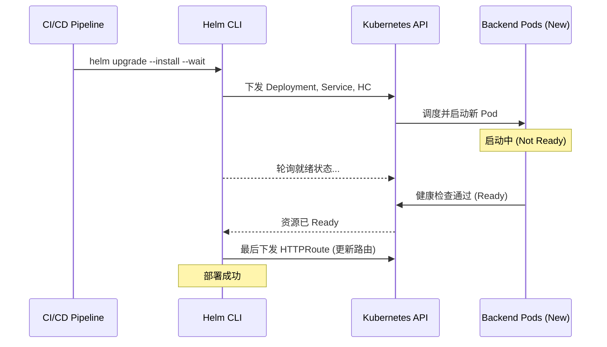

# Helm & K8S 资源部署顺序深度探索 (Explorer)

本指南针对“先部署后端资源，后更新路由规则”的需求，探索在 Helm 和原生 Kubernetes 情况下的资源下发顺序控制策略，确保 GKE Gateway API 的切换真正实现零停机。

---

## 1. Helm 默认的资源应用顺序

当你执行 `helm upgrade --install` 时，Helm 内部其实维护了一套默认的资源权重顺序（Install Order）。

### 🧊 Helm 默认优先级 (部分)
1.  `Namespace`
2.  `NetworkPolicy`
3.  `ResourceQuota`
4.  `ConfigMap` / `Secret`
5.  **`Service`** (权重较早)
6.  **`Deployment`** / `StatefulSet`
7.  **`HTTPRoute`** / `Ingress` / `Gateway` (权重较晚)

### ⚠️ 潜在问题：资源下发 vs. 物理就绪
虽然 Helm 默认会先创建 `Service/Deployment` 再创建 `HTTPRoute`，但这仅仅是 **API 层面** 的下发顺序。
- **问题**：`Deployment` 下发后，Pod 可能需要 30 秒才 Ready。
- **冲突**：`HTTPRoute` 几乎在同时下发。此时 GKE Gateway 开始将流量切往尚未就绪（或正在启动）的后端，导致短时间的 5xx 错误。

---

## 2. 方案一：利用 Helm `--wait` 与 Readiness Probe

这是最简单、最推荐的原生方案。

### 核心机制
- **Readiness Probe**: 确保 Pod 只有在业务真正可用时才标记为 `Ready`。
- **`helm upgrade --wait`**: 强制 Helm 阻塞，直到所有资源（尤其是 Deployment）达到 Ready 状态后，才认为该 Release 部署成功。

### 💡 流程演示


---

## 3. 方案二：Helm Hooks (钩子) 精确控制

如果你需要更复杂的逻辑（例如：先部署新版 -> 运行自动化测试 -> 测试通过再更新路由），可以使用 Helm Hooks。

### 策略：将路由定义为 `post-upgrade`
```yaml
# templates/httproute.yaml
apiVersion: gateway.networking.k8s.io/v1
kind: HTTPRoute
metadata:
  name: api-route
  annotations:
    "helm.sh/hook": post-upgrade
    "helm.sh/hook-weight": "5"
    "helm.sh/hook-delete-policy": before-hook-creation
```
- **逻辑**: Deployment 会在普通阶段部署。
- **动作**: 只有当普通阶段所有资源都 Ready 后，Helm 才会执行 `post-upgrade` 钩子，下发 `HTTPRoute`。

---

## 4. 方案三：解耦 Chart (Chart Partitioning)

对于大型生产环境，最佳实践是将“应用负载”和“路由层”拆分。

### 目录结构示例
```bash
charts/
  ├── api-workload/  # 包含 Deployment, Service, BackendPolicy
  └── api-routing/   # 仅包含 HTTPRoute
```

### CI/CD 编排逻辑 (最佳高可用实践)
1.  **Step 1**: 部署 `api-workload` (使用 `--wait`)。
2.  **Step 2**: 运行集成测试，验证新版本的端点（通过内部 Service IP 或临时测试域名）。
3.  **Step 3**: 测试通过后，部署 `api-routing`，平滑平移流量。

---

## 5. 方案四：ArgoCD Sync Waves (如果使用 GitOps)

如果你使用 ArgoCD，可以通过 `sync-wave` 完美解决顺序问题。

```yaml
# Deployment.yaml
metadata:
  annotations:
    argocd.argoproj.io/sync-wave: "1"

# Service.yaml
metadata:
  annotations:
    argocd.argoproj.io/sync-wave: "2"

# HTTPRoute.yaml
metadata:
  annotations:
    argocd.argoproj.io/sync-wave: "5"  # 确保在 Wave 1, 2 完成后才执行
```

---

## 6. 总结建议

| 需求场景 | 推荐方案 | 复杂度 |
| :--- | :--- | :--- |
| **标准 CI 部署** | `helm upgrade --wait` + 严格的 Readiness Probe | 低 (⭐ 推荐) |
| **需要自动化测试** | Helm Hooks 或 CI 门禁 | 中 |
| **复杂微服务架构** | Chart 解耦部署 | 高 |
| **GitOps/ArgoCD** | Sync Waves | 低 |

---

## 5. 方案五：Java 程序编排 (Programmatic Control)

既然您的模板映射和下发是通过 Java 程序控制的，那么在 Java 层实现“感知状态的顺序部署”是最灵活、最强大的方案。

### 核心思路：Readiness Watcher 模式
不要让 Java 仅仅是“下发 YAML”，而是让它充当一个小型控制器。

1.  **Phase A**: 调用 Java K8S SDK 下发 Deployment、Service 和 Policy。
2.  **Phase B**: Java 程序进入阻塞等待，利用 Watch API 监控 Pod 状态。
3.  **Phase C**: 只有当观测到所有新 Pod 达到 `Ready` 状态后，Java 程序才触发 `HTTPRoute` 的应用。

### 💡 Java 代码示例 (推荐方案)

推荐使用 **Fabric8 Kubernetes Client**，它具有非常优雅的 DSL 语法。

```java
// 伪代码示例：Java 控制部署序列
public void deployWithSequence(String releaseVersion) {
    KubernetesClient client = new DefaultKubernetesClient();

    // 1. 部署后端资源 (Deployment/Service)
    System.out.println("Deploying Workload version: " + releaseVersion);
    client.load(new FileInputStream("templates/backend-ready.yaml")).createOrReplace();

    // 2. 阻塞等待：Watcher 模式
    System.out.println("Waiting for Pods to be Ready...");
    client.apps().deployments()
          .inNamespace("caep-int-common")
          .withName("api-samples-v" + releaseVersion)
          .waitUntilReady(5, TimeUnit.MINUTES); // 阻塞直到就绪

    // 3. 后端就绪后，才下发 HTTPRoute
    System.out.println("Backend is healthy. Updating HTTPRoute now.");
    client.load(new FileInputStream("templates/httproute-switch.yaml")).createOrReplace();
    
    System.out.println("Traffic successfully shifted to " + releaseVersion);
}
```

### 🏆 方案优势 (Java 控制)
- **解耦声明**: 您不需要在 YAML 里写复杂的 Hook 逻辑，逻辑保留在 Java 侧，易于调试。
- **自定义校验**: 您可以在阶段 2 之后加入自定义的 Java 逻辑（比如：先在 Java 里发一个 HTTP 请求给新 Pod 的 IP，确认业务逻辑层也加载完毕了）。
- **流程闭环**: 如果阶段 2 等待超时，Java 程序可以立即触发回滚操作，而不是让 K8S 处于中间态。

---

## 6. 最终综合对比与建议

| 方案 | 适用工具 | 推荐理由 |
| :--- | :--- | :--- |
| **`--wait` 标注** | Helm CLI | 最低成本，适合简单的 CI 脚本。 |
| **Hook 机制** | Helm Chart | 逻辑内聚在 Chart 中，不依赖外部程序。 |
| **Java 编排** | PMU / Java SDK | **最强控制力**。适合已有 Java 平台集成，支持自定义验证逻辑。 |
| **Sync Waves** | ArgoCD | 适合声明式 GitOps 环境。 |

**对于您的 PMU 环境**:
建议在 Java 模板生成后的 **Apply 阶段**，引入 `waitUntilReady` 的逻辑。这能确保在整个负载均衡链路（HealthCheckPolicy -> Service -> Deployment）打通并健康之前，外部路由绝不发生变更，从而实现真正意义上的生产级平滑切换。
