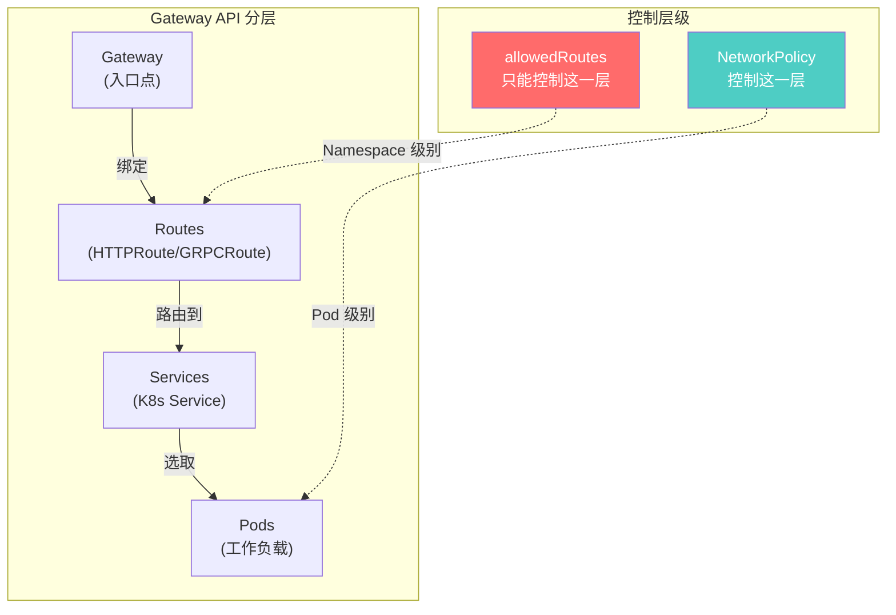
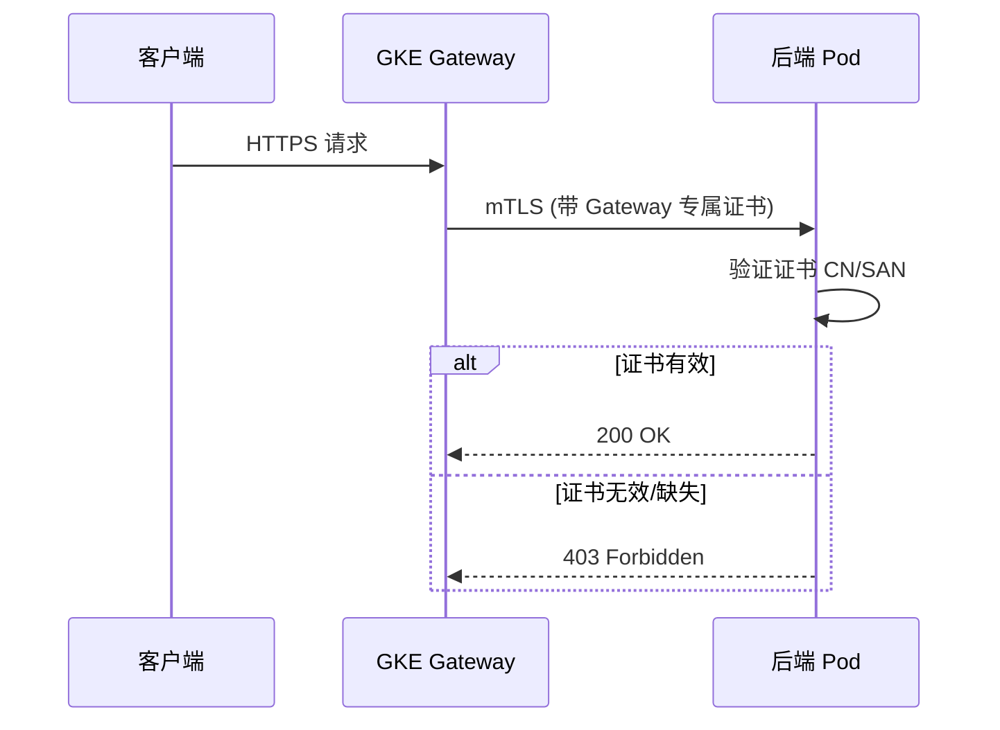
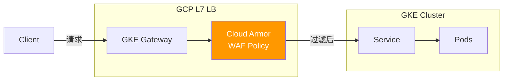
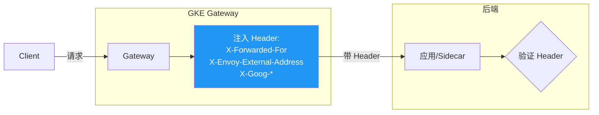
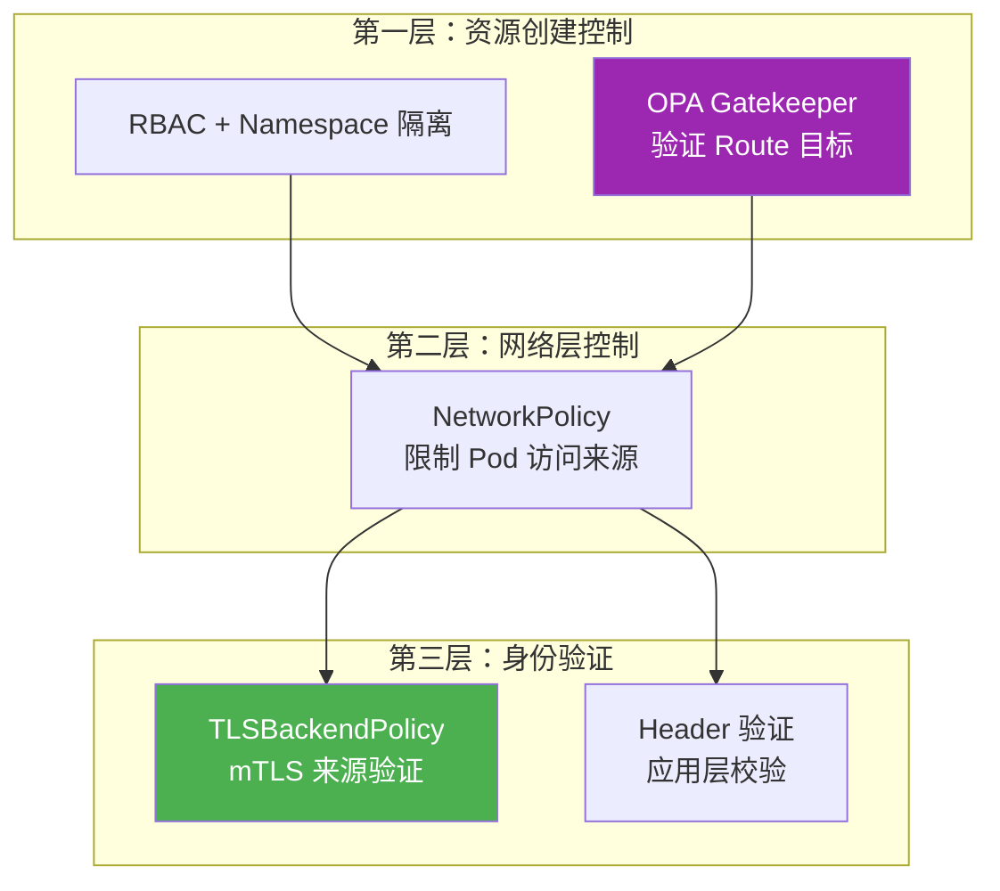
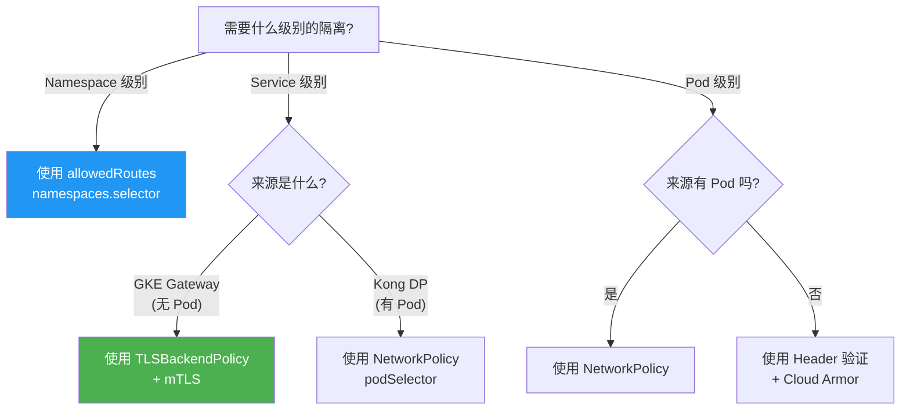

# GKE Gateway 安全控制策略指南

> 本文档基于 Gateway API 的 allowedRoutes 机制分析，探索在 GKE Gateway 环境中实现流量安全控制和防止配置漂移的多种方案。

---

## 📋 核心问题与结论速览

### 你关心的问题

| 问题 | 答案 | 说明 |
|------|------|------|
| Gateway 能否基于 Pod Selector 限制路由？ | ❌ **不可以** | Gateway API 只支持 Namespace 级别的路由控制 |
| allowedRoutes 能否选择特定 Pod？ | ❌ **不可以** | allowedRoutes 仅支持 `namespaces.from` 和 `namespaces.selector` |
| 同一 Namespace 内能否防止用户漂移？ | ⚠️ **需要其他机制** | 需要结合 TLSBackendPolicy、Header 验证、RBAC 等 |
| TLSBackendPolicy 能否做安全限制？ | ✅ **可以** | 通过 mTLS 证书验证来源身份 |

---

## 🏗️ Gateway API 分层架构



> [!IMPORTANT]
> **allowedRoutes 只工作在 Gateway → Route 层，无法深入到 Pod 或 Deployment 层面。**

---

## 🔐 安全控制机制全景

### 控制能力对比表

| 控制机制 | 控制粒度 | GKE Gateway 支持 | 适用场景 |
|----------|----------|------------------|----------|
| **allowedRoutes** | Namespace | ✅ 原生支持 | 跨 Namespace 路由授权 |
| **TLSBackendPolicy** | Service/Backend | ✅ 原生支持 | mTLS 来源身份验证 |
| **GCPBackendPolicy** | Backend Service | ✅ GCP 特有 | Cloud Armor、IAP、健康检查 |
| **GCPGatewayPolicy** | Gateway | ✅ GCP 特有 | SSL Policy、安全配置 |
| **NetworkPolicy** | Pod | ✅ K8s 原生 | L3/L4 网络隔离 |
| **RBAC** | K8s 资源 | ✅ K8s 原生 | 谁能创建/修改资源 |
| **Header 注入验证** | 应用层 | ✅ 需要应用配合 | L7 来源识别 |

---

## 📌 方案一：allowedRoutes Namespace 限制（基础）

### 工作原理

```yaml
apiVersion: gateway.networking.k8s.io/v1
kind: Gateway
metadata:
  name: my-gateway
  namespace: gateway-ns
spec:
  gatewayClassName: gke-l7-global-external-managed
  listeners:
  - name: https
    port: 443
    protocol: HTTPS
    allowedRoutes:
      namespaces:
        from: Selector   # Same | All | Selector
        selector:
          matchLabels:
            gateway-access: allowed
```

### 配置说明

| `namespaces.from` | 行为 |
|-------------------|------|
| `Same` | 只允许 Gateway 所在 Namespace 的 Route |
| `All` | 允许所有 Namespace 的 Route（不推荐） |
| `Selector` | 通过 Label Selector 选择特定 Namespace |

### 限制

> [!WARNING]
> - 只能控制到 **Namespace 级别**，无法控制 Namespace 内的特定 Pod
> - 无法防止同一 Namespace 内的用户"漂移"到错误的 Service

---

## 📌 方案二：TLSBackendPolicy（mTLS 来源身份验证）⭐推荐

### 核心思路

让 GKE Gateway 发送到后端时使用**特定的客户端证书**，后端只信任该证书，从而识别流量来源。



### 配置示例

```yaml
apiVersion: gateway.networking.k8s.io/v1alpha3
kind: BackendTLSPolicy
metadata:
  name: gateway-mtls-policy
  namespace: user-namespace
spec:
  targetRefs:
  - group: ""
    kind: Service
    name: my-backend-service
  validation:
    caCertificateRefs:
    - name: gateway-ca-cert       # CA 证书 Secret
      group: ""
      kind: Secret
    hostname: my-backend.internal
---
# 用于存储 CA 证书的 Secret
apiVersion: v1
kind: Secret
metadata:
  name: gateway-ca-cert
  namespace: user-namespace
type: kubernetes.io/tls
data:
  ca.crt: <base64-encoded-ca-certificate>
```

### 优势

- ✅ 真正的身份验证，无法伪造
- ✅ Kong DP 和 GKE Gateway 使用不同证书，可明确区分
- ✅ 符合零信任安全模型

### 实施要点

1. 为 GKE Gateway 配置专用客户端证书
2. 为 Kong DP 配置另一套证书
3. 后端服务验证客户端证书的 CN/SAN

---

## 📌 方案三：GCPBackendPolicy + Cloud Armor（WAF 防护）

### 架构图



### 配置示例

```yaml
apiVersion: networking.gke.io/v1
kind: GCPBackendPolicy
metadata:
  name: backend-security-policy
  namespace: user-namespace
spec:
  default:
    securityPolicy: projects/PROJECT_ID/global/securityPolicies/my-armor-policy
  targetRef:
    group: ""
    kind: Service
    name: my-backend-service
---
# Cloud Armor 安全策略（需在 GCP 控制台或 gcloud 创建）
# gcloud compute security-policies create my-armor-policy \
#   --description="Gateway backend protection"
# 
# gcloud compute security-policies rules create 1000 \
#   --security-policy=my-armor-policy \
#   --expression="request.headers['x-gateway-source'] != 'gke-gateway'" \
#   --action=deny-403
```

### Cloud Armor 可实现的控制

| 功能 | 说明 |
|------|------|
| IP 白名单/黑名单 | 基于源 IP 过滤 |
| 自定义 Header 检查 | 验证特定 Header 存在或值 |
| Rate Limiting | 限制请求频率 |
| WAF 规则 | 防止 SQL 注入、XSS 等 |
| 地理位置过滤 | 基于请求来源地区 |

---

## 📌 方案四：Header 注入 + 应用层验证

### 工作原理

GKE Gateway（基于 Envoy）会自动注入特定 Header，可在应用层验证。



### GKE Gateway 自动添加的 Header

| Header | 说明 |
|--------|------|
| `X-Forwarded-For` | 客户端原始 IP 链 |
| `X-Forwarded-Proto` | 原始协议（http/https） |
| `X-Envoy-External-Address` | Envoy 看到的外部地址 |
| `X-Request-Id` | 请求追踪 ID |
| `X-Goog-*` | Google LB 特有标识 |

### 应用层验证示例（Nginx）

```nginx
# 仅允许包含特定 Header 的请求
location /api/ {
    if ($http_x_goog_authenticated != "true") {
        return 403;
    }
    proxy_pass http://backend;
}
```

### 限制

> [!CAUTION]
> - Header 可被伪造（如果请求不经过 Gateway）
> - 需要配合 NetworkPolicy 确保流量必须经过 Gateway
> - 建议与 mTLS 结合使用以增强安全性

---

## 📌 方案五：NetworkPolicy（L3/L4 网络隔离）

### 适用场景

虽然 GKE Gateway 本身没有 Pod，但可以通过以下方式使用 NetworkPolicy：

1. **限制 Kong DP → Pod 的流量**（Kong DP 有 Pod）
2. **基于 GKE Gateway 的源 IP 范围**（内部 Gateway 场景）

### 示例：仅允许 Kong DP 访问

```yaml
apiVersion: networking.k8s.io/v1
kind: NetworkPolicy
metadata:
  name: allow-kong-only
  namespace: user-namespace
spec:
  podSelector:
    matchLabels:
      app: my-backend
  policyTypes:
  - Ingress
  ingress:
  - from:
    - namespaceSelector:
        matchLabels:
          runtime: kong-dp
      podSelector:
        matchLabels:
          app: kong-proxy
    ports:
    - protocol: TCP
      port: 8080
```

### 示例：基于 IP Block（内部 Gateway）

```yaml
apiVersion: networking.k8s.io/v1
kind: NetworkPolicy
metadata:
  name: allow-internal-gateway
  namespace: user-namespace
spec:
  podSelector:
    matchLabels:
      app: my-backend
  policyTypes:
  - Ingress
  ingress:
  - from:
    - ipBlock:
        cidr: 10.128.0.0/20  # proxy-only subnet CIDR
    ports:
    - protocol: TCP
      port: 8080
```

### GKE Gateway 源 IP 范围

| Gateway 类型 | 源 IP 范围 |
|--------------|-----------|
| 内部 Gateway（internal） | VPC proxy-only subnet CIDR |
| 外部 Gateway（external） | Google GFE ranges（难以精确限制） |

---

## 📌 方案六：RBAC 防止配置漂移

### 核心思路

通过 Kubernetes RBAC 限制用户只能创建/修改特定的 HTTPRoute。

```yaml
# 只允许用户管理路由到特定 Service 的 Route
apiVersion: rbac.authorization.k8s.io/v1
kind: Role
metadata:
  name: route-manager
  namespace: user-namespace
spec:
  rules:
  - apiGroups: ["gateway.networking.k8s.io"]
    resources: ["httproutes"]
    verbs: ["get", "list", "create", "update", "patch"]
    # 注意：RBAC 无法限制 Route 指向的目标 Service
---
apiVersion: rbac.authorization.k8s.io/v1
kind: RoleBinding
metadata:
  name: user-route-manager
  namespace: user-namespace
spec:
  roleRef:
    apiGroup: rbac.authorization.k8s.io
    kind: Role
    name: route-manager
  subjects:
  - kind: User
    name: team-a-user
    apiGroup: rbac.authorization.k8s.io
```

### 增强：使用 Admission Webhook/OPA Gatekeeper

```yaml
# OPA Gatekeeper ConstraintTemplate 示例
apiVersion: templates.gatekeeper.sh/v1
kind: ConstraintTemplate
metadata:
  name: httproutebackendvalidator
spec:
  crd:
    spec:
      names:
        kind: HTTPRouteBackendValidator
  targets:
    - target: admission.k8s.gatekeeper.sh
      rego: |
        package httproutebackendvalidator
        
        violation[{"msg": msg}] {
          input.review.object.kind == "HTTPRoute"
          backend := input.review.object.spec.rules[_].backendRefs[_]
          not allowed_service(backend.name)
          msg := sprintf("HTTPRoute cannot target service %v", [backend.name])
        }
        
        allowed_service(name) {
          # 只允许路由到以用户名开头的 Service
          startswith(name, input.review.userInfo.username)
        }
```

---

## 🎯 同一 Namespace 防止用户漂移：最佳实践

### 问题场景

```
Namespace: shared-ns
├── User A 的 Service: service-a
├── User B 的 Service: service-b
└── 担心：User A 创建的 HTTPRoute 指向了 service-b
```

### 推荐方案组合



### 实施步骤

1. **Namespace 隔离**（最简单）：将不同用户的资源放到不同 Namespace
2. **RBAC + OPA**：限制用户只能创建指向自己 Service 的 Route
3. **Service 命名规范**：`{user-id}-{service-name}` 便于策略匹配
4. **mTLS 身份验证**：每个用户/团队使用独立证书

---

## 📊 方案选择决策树



---

## 🔧 完整配置示例

### 场景：GKE Gateway + Kong DP 共存

```yaml
# 1. Gateway 定义（只允许特定 Namespace）
apiVersion: gateway.networking.k8s.io/v1
kind: Gateway
metadata:
  name: production-gateway
  namespace: gateway-infra
spec:
  gatewayClassName: gke-l7-global-external-managed
  listeners:
  - name: https
    port: 443
    protocol: HTTPS
    tls:
      mode: Terminate
      certificateRefs:
      - name: wildcard-cert
    allowedRoutes:
      namespaces:
        from: Selector
        selector:
          matchLabels:
            gateway-enabled: "true"
---
# 2. 后端 TLS 策略（mTLS）
apiVersion: gateway.networking.k8s.io/v1alpha3
kind: BackendTLSPolicy
metadata:
  name: backend-mtls
  namespace: user-namespace
spec:
  targetRefs:
  - group: ""
    kind: Service
    name: user-service
  validation:
    caCertificateRefs:
    - name: trusted-ca
      kind: Secret
    hostname: user-service.internal
---
# 3. GCP Backend Policy（Cloud Armor）
apiVersion: networking.gke.io/v1
kind: GCPBackendPolicy
metadata:
  name: user-service-policy
  namespace: user-namespace
spec:
  default:
    securityPolicy: projects/my-project/global/securityPolicies/api-protection
  targetRef:
    group: ""
    kind: Service
    name: user-service
---
# 4. NetworkPolicy（只允许 Kong DP）
apiVersion: networking.k8s.io/v1
kind: NetworkPolicy
metadata:
  name: allow-kong-gateway
  namespace: user-namespace
spec:
  podSelector:
    matchLabels:
      app: user-service
  policyTypes:
  - Ingress
  ingress:
  # 允许来自 Kong DP 的流量
  - from:
    - namespaceSelector:
        matchLabels:
          runtime: kong
      podSelector:
        matchLabels:
          app: kong-proxy
  # 允许来自 GKE Gateway proxy subnet 的流量
  - from:
    - ipBlock:
        cidr: 10.128.0.0/20
```

---

## ✅ 总结与建议

### 按安全强度排序的方案

| 优先级 | 方案 | 适用场景 | 实施复杂度 |
|--------|------|----------|-----------|
| 1️⃣ | **Namespace 隔离 + allowedRoutes** | 标准多租户 | ⭐ 低 |
| 2️⃣ | **TLSBackendPolicy (mTLS)** | 需要精确来源识别 | ⭐⭐⭐ 中高 |
| 3️⃣ | **GCPBackendPolicy + Cloud Armor** | 需要 WAF 防护 | ⭐⭐ 中 |
| 4️⃣ | **NetworkPolicy** | Kong DP 等有 Pod 的场景 | ⭐⭐ 中 |
| 5️⃣ | **OPA Gatekeeper** | 防止配置漂移 | ⭐⭐⭐ 中高 |
| 6️⃣ | **Header 验证** | 应用层控制 | ⭐⭐ 中 |

### 针对你的核心需求

> **"同一 Namespace 内防止用户漂移"**

**推荐组合**：
1. 使用 **OPA Gatekeeper** 在 Admission 阶段验证 HTTPRoute 的目标 Service
2. 配合 **TLSBackendPolicy** 验证来源身份
3. 遵循 **Service 命名规范**（`{owner}-{service}`）便于策略匹配

> **"基于 Pod Selector 选择路由"**

**结论**：Gateway API 不支持，但可以通过 **NetworkPolicy** 在网络层实现类似效果。

---

## 📚 参考资源

- [Gateway API 官方文档](https://gateway-api.sigs.k8s.io/)
- [GKE Gateway 控制器文档](https://cloud.google.com/kubernetes-engine/docs/concepts/gateway-api)
- [TLSBackendPolicy GEP](https://gateway-api.sigs.k8s.io/geps/gep-1897/)
- [GCPBackendPolicy 参考](https://cloud.google.com/kubernetes-engine/docs/how-to/configure-gateway-resources)
- [OPA Gatekeeper](https://open-policy-agent.github.io/gatekeeper/)
