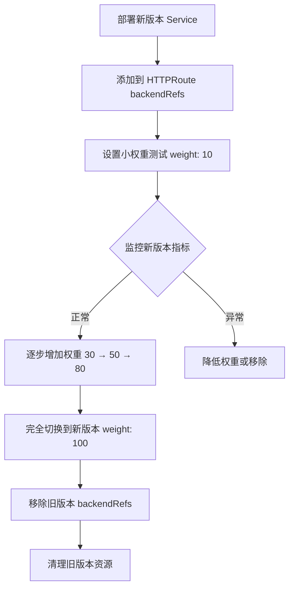
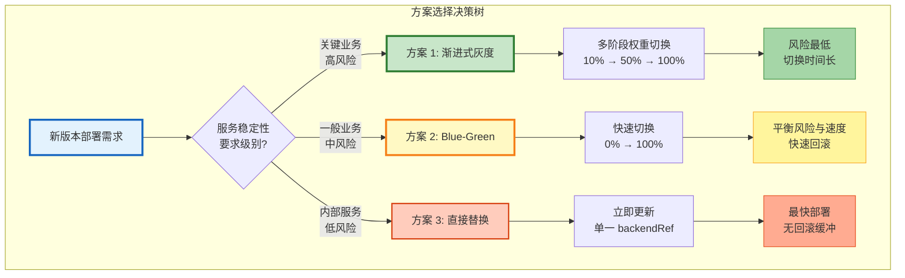
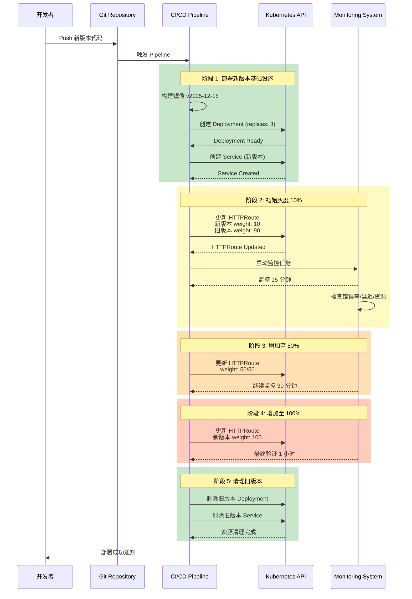
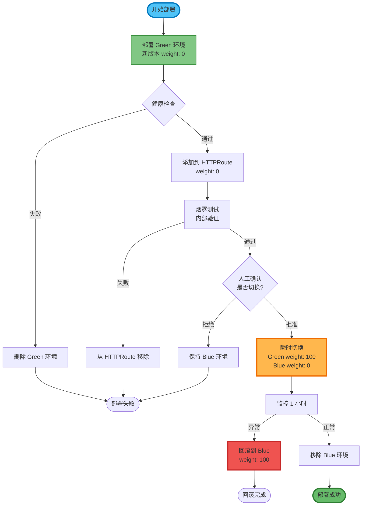
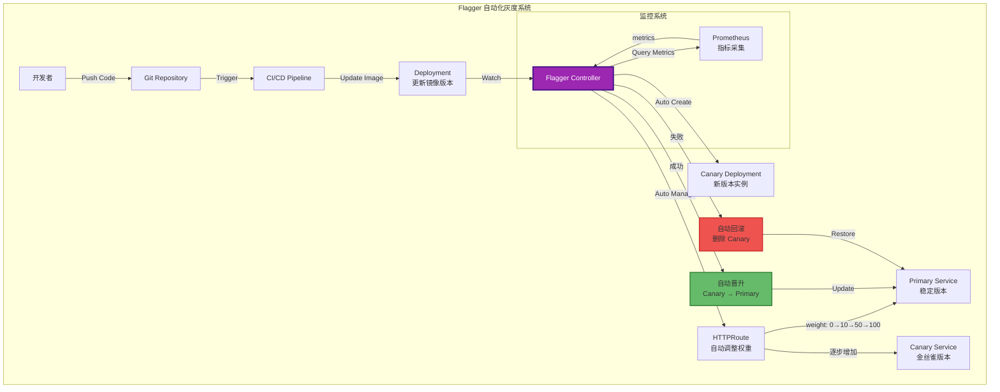
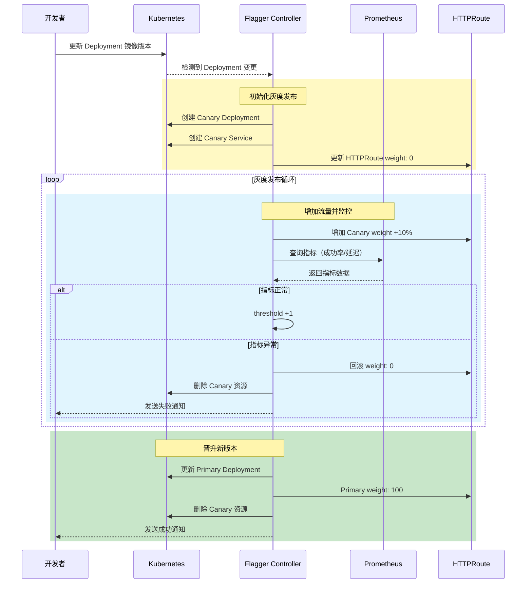

# Q 
假如在我的架构之中是一个 nginx L7后面这的一个 Gke Gateway 其中 httproute内容如下
```yaml
apiVersion: gateway.networking.k8s.io/v1
kind: HTTPRoute
metadata:
  name: api-name-type-ri-sb-samples-route
  namespace: ns-int-common-ms
spec:
  parentRefs:
    - kind: Gateway
      name: abjx-common-gateway
      namespace: abjx-common-gateway-ns
  hostnames:
    - "dev.goole.cloud.uk.aibang"
  rules:
    - matches:
        - path:
            type: PathPrefix
            value: /api-name-type-ri-sb-samples
      backendRefs:
        - name: api-name-type-ri-sb-samples-2025-11-19-service
          kind: Service
          port: 443
```
我将nginx也是基于locatio path来proxy_pass到我的GKE  gateway的. 但是通过上面配置 ，你可以看到其实我的这个。 API它其实是没有版本的。 比如https://dev.goole.cloud.uk.aibang/api-name-type-ri-sb-samples 是基于这样一个访问的路径来决定访问我不同的 API的那么如果我想要保留我的平台里面有多个 API的版本的话应该怎么来处理比较好或者说是最佳的实践来说是。是什么会比较好因为我们想要的目的是在nginx上 比如没带版本号的控制 .但是后面需要切换到我最新的版本上面或者说部署到我最新的版本上面 ，我理解这个地方其实是可以通过。 
```yaml
      backendRefs:
        - name: api-name-type-ri-sb-samples-2025-11-19-service
          kind: Service
          port: 443
```

   这个地方来指定不同的服务。我不知道这样的方式是不是一个最佳实践，所以说我需要你帮我探索一下。

# Claude 
# API 版本管理最佳实践分析

## 问题分析

您的架构是：**Nginx (L7) → GKE Gateway → HTTPRoute → Backend Services**

当前面临的核心问题：

- 前端访问路径无版本标识（如 `/api-name-type-ri-sb-samples`）
- 后端需要支持多版本部署和灵活切换
- 需要在不修改 Nginx 配置的情况下实现版本控制

## 解决方案对比

### 方案 1：HTTPRoute BackendRefs 权重路由（推荐）

这是 **Kubernetes Gateway API 的标准实践**，适合您的场景。

#### 配置示例

```yaml
apiVersion: gateway.networking.k8s.io/v1
kind: HTTPRoute
metadata:
  name: api-name-type-ri-sb-samples-route
  namespace: ns-int-common-ms
  annotations:
    description: "版本路由：支持灰度发布和版本切换"
spec:
  parentRefs:
    - kind: Gateway
      name: abjx-common-gateway
      namespace: abjx-common-gateway-ns
  hostnames:
    - "dev.goole.cloud.uk.aibang"
  rules:
    - matches:
        - path:
            type: PathPrefix
            value: /api-name-type-ri-sb-samples
      backendRefs:
        # 当前稳定版本（90% 流量）
        - name: api-name-type-ri-sb-samples-2025-11-19-service
          kind: Service
          port: 443
          weight: 90
        # 新版本灰度（10% 流量）
        - name: api-name-type-ri-sb-samples-2025-12-18-service
          kind: Service
          port: 443
          weight: 10
```

#### 版本切换流程



#### 优势

- ✅ **原生支持**：Gateway API 标准能力
- ✅ **灰度发布**：支持流量百分比控制
- ✅ **零停机切换**：无需修改 Nginx 配置
- ✅ **快速回滚**：调整权重即可回退
- ✅ **多版本共存**：可同时保留多个版本

---

### 方案 2：Service Selector 切换（不推荐您的场景）

通过修改 Service 的 selector 指向不同版本的 Pods。

#### 配置示例

```yaml
apiVersion: v1
kind: Service
metadata:
  name: api-name-type-ri-sb-samples-service
  namespace: ns-int-common-ms
spec:
  selector:
    app: api-name-type-ri-sb-samples
    version: "2025-12-18"  # 修改此处切换版本
  ports:
    - port: 443
      targetPort: 8443
```

#### 劣势

- ❌ **瞬时切换**：无法灰度发布
- ❌ **回滚困难**：需要重新修改 Service
- ❌ **单版本限制**：同一时间只能指向一个版本

---

### 方案 3：路径版本化（需要修改架构）

在 URL 中显式包含版本号，如 `/v1/api-name-type-ri-sb-samples`。

#### 配置示例

```yaml
apiVersion: gateway.networking.k8s.io/v1
kind: HTTPRoute
metadata:
  name: api-samples-versioned-route
spec:
  parentRefs:
    - kind: Gateway
      name: abjx-common-gateway
  hostnames:
    - "dev.goole.cloud.uk.aibang"
  rules:
    # v1 版本路由
    - matches:
        - path:
            type: PathPrefix
            value: /v1/api-name-type-ri-sb-samples
      backendRefs:
        - name: api-samples-v1-service
          port: 443
    
    # v2 版本路由
    - matches:
        - path:
            type: PathPrefix
            value: /v2/api-name-type-ri-sb-samples
      backendRefs:
        - name: api-samples-v2-service
          port: 443
    
    # 默认版本（指向最新）
    - matches:
        - path:
            type: PathPrefix
            value: /api-name-type-ri-sb-samples
      backendRefs:
        - name: api-samples-v2-service  # 指向当前稳定版本
          port: 443
```

#### 优势与劣势

- ✅ **显式版本**：客户端可明确选择版本
- ✅ **长期共存**：支持多版本长期运行
- ❌ **客户端改造**：需要修改调用方代码
- ❌ **Nginx 配置**：需要更新 location 规则

---

## 最佳实践推荐

### 推荐方案：HTTPRoute BackendRefs 权重路由

根据您的需求（Nginx 无版本路径 + 后端版本控制），**方案 1** 是最佳选择。

### 完整部署示例

#### 1. 创建多版本 Deployment

```yaml
---
# 旧版本 Deployment
apiVersion: apps/v1
kind: Deployment
metadata:
  name: api-samples-2025-11-19
  namespace: ns-int-common-ms
spec:
  replicas: 3
  selector:
    matchLabels:
      app: api-name-type-ri-sb-samples
      version: "2025-11-19"
  template:
    metadata:
      labels:
        app: api-name-type-ri-sb-samples
        version: "2025-11-19"
    spec:
      containers:
        - name: api
          image: gcr.io/your-project/api-samples:2025-11-19
          ports:
            - containerPort: 8443

---
# 新版本 Deployment
apiVersion: apps/v1
kind: Deployment
metadata:
  name: api-samples-2025-12-18
  namespace: ns-int-common-ms
spec:
  replicas: 3
  selector:
    matchLabels:
      app: api-name-type-ri-sb-samples
      version: "2025-12-18"
  template:
    metadata:
      labels:
        app: api-name-type-ri-sb-samples
        version: "2025-12-18"
    spec:
      containers:
        - name: api
          image: gcr.io/your-project/api-samples:2025-12-18
          ports:
            - containerPort: 8443
```

#### 2. 创建对应的 Services

```yaml
---
# 旧版本 Service
apiVersion: v1
kind: Service
metadata:
  name: api-name-type-ri-sb-samples-2025-11-19-service
  namespace: ns-int-common-ms
spec:
  selector:
    app: api-name-type-ri-sb-samples
    version: "2025-11-19"
  ports:
    - port: 443
      targetPort: 8443

---
# 新版本 Service
apiVersion: v1
kind: Service
metadata:
  name: api-name-type-ri-sb-samples-2025-12-18-service
  namespace: ns-int-common-ms
spec:
  selector:
    app: api-name-type-ri-sb-samples
    version: "2025-12-18"
  ports:
    - port: 443
      targetPort: 8443
```

#### 3. 配置 HTTPRoute 灰度发布

```yaml
apiVersion: gateway.networking.k8s.io/v1
kind: HTTPRoute
metadata:
  name: api-name-type-ri-sb-samples-route
  namespace: ns-int-common-ms
spec:
  parentRefs:
    - kind: Gateway
      name: abjx-common-gateway
      namespace: abjx-common-gateway-ns
  hostnames:
    - "dev.goole.cloud.uk.aibang"
  rules:
    - matches:
        - path:
            type: PathPrefix
            value: /api-name-type-ri-sb-samples
      backendRefs:
        - name: api-name-type-ri-sb-samples-2025-11-19-service
          kind: Service
          port: 443
          weight: 80  # 初始保留 80% 流量在旧版本
        - name: api-name-type-ri-sb-samples-2025-12-18-service
          kind: Service
          port: 443
          weight: 20  # 新版本接收 20% 流量进行验证
```

---

## 版本切换操作流程

### 阶段 1：灰度发布（初期）

```bash
# 应用初始配置（80% 旧版本，20% 新版本）
kubectl apply -f httproute-canary-20.yaml

# 监控新版本指标
kubectl top pods -n ns-int-common-ms -l version=2025-12-18
kubectl logs -n ns-int-common-ms -l version=2025-12-18 --tail=100
```

### 阶段 2：逐步增加流量

```bash
# 更新权重至 50:50
cat <<EOF | kubectl apply -f -
apiVersion: gateway.networking.k8s.io/v1
kind: HTTPRoute
metadata:
  name: api-name-type-ri-sb-samples-route
  namespace: ns-int-common-ms
spec:
  parentRefs:
    - kind: Gateway
      name: abjx-common-gateway
      namespace: abjx-common-gateway-ns
  hostnames:
    - "dev.goole.cloud.uk.aibang"
  rules:
    - matches:
        - path:
            type: PathPrefix
            value: /api-name-type-ri-sb-samples
      backendRefs:
        - name: api-name-type-ri-sb-samples-2025-11-19-service
          port: 443
          weight: 50
        - name: api-name-type-ri-sb-samples-2025-12-18-service
          port: 443
          weight: 50
EOF
```

### 阶段 3：完全切换

```bash
# 新版本承载 100% 流量
cat <<EOF | kubectl apply -f -
apiVersion: gateway.networking.k8s.io/v1
kind: HTTPRoute
metadata:
  name: api-name-type-ri-sb-samples-route
  namespace: ns-int-common-ms
spec:
  parentRefs:
    - kind: Gateway
      name: abjx-common-gateway
      namespace: abjx-common-gateway-ns
  hostnames:
    - "dev.goole.cloud.uk.aibang"
  rules:
    - matches:
        - path:
            type: PathPrefix
            value: /api-name-type-ri-sb-samples
      backendRefs:
        - name: api-name-type-ri-sb-samples-2025-12-18-service
          port: 443
          weight: 100
EOF
```

### 阶段 4：清理旧版本

```bash
# 确认新版本稳定后删除旧版本资源
kubectl delete deployment api-samples-2025-11-19 -n ns-int-common-ms
kubectl delete service api-name-type-ri-sb-samples-2025-11-19-service -n ns-int-common-ms
```

---

## 监控与回滚策略

### 关键监控指标

```bash
# 查看 HTTPRoute 状态
kubectl describe httproute api-name-type-ri-sb-samples-route -n ns-int-common-ms

# 监控 Pod 健康状态
kubectl get pods -n ns-int-common-ms -l app=api-name-type-ri-sb-samples -o wide

# 检查 Service Endpoints
kubectl get endpoints -n ns-int-common-ms

# 实时日志监控
kubectl logs -n ns-int-common-ms -l version=2025-12-18 -f --tail=50
```

### 快速回滚操作

```bash
# 如果新版本出现问题，立即回滚到旧版本
cat <<EOF | kubectl apply -f -
apiVersion: gateway.networking.k8s.io/v1
kind: HTTPRoute
metadata:
  name: api-name-type-ri-sb-samples-route
  namespace: ns-int-common-ms
spec:
  parentRefs:
    - kind: Gateway
      name: abjx-common-gateway
  hostnames:
    - "dev.goole.cloud.uk.aibang"
  rules:
    - matches:
        - path:
            type: PathPrefix
            value: /api-name-type-ri-sb-samples
      backendRefs:
        - name: api-name-type-ri-sb-samples-2025-11-19-service
          port: 443
          weight: 100  # 立即回退到旧版本
        - name: api-name-type-ri-sb-samples-2025-12-18-service
          port: 443
          weight: 0
EOF
```

---

## 注意事项

### 1. Service 命名规范

- ✅ **推荐**：包含日期或版本号（如 `api-samples-2025-12-18-service`）
- ❌ **避免**：使用泛化名称（如 `api-samples-service`）
- 原因：便于追踪和管理多版本资源

### 2. 权重配置验证

```bash
# 验证 HTTPRoute 配置正确性
kubectl apply --dry-run=client -f httproute.yaml
kubectl apply --server-dry-run -f httproute.yaml
```

### 3. 流量比例计算

- 权重总和不需要等于 100（Gateway 会自动按比例分配）
- 示例：`weight: 3` 和 `weight: 1` 等效于 75% vs 25%

### 4. TLS 证书配置

```yaml
# 如果后端是 HTTPS，确保 Service 端口配置正确
apiVersion: v1
kind: Service
metadata:
  name: api-samples-service
  annotations:
    cloud.google.com/neg: '{"ingress": true}'
    cloud.google.com/backend-config: '{"ports": {"443":"backend-config-name"}}'
spec:
  ports:
    - port: 443
      targetPort: 8443
      protocol: TCP
      appProtocol: https  # 明确标识后端协议
```

### 5. 多环境管理建议

|环境|建议策略|
|---|---|
|Dev|直接部署最新版本，无需灰度|
|Staging|模拟生产环境，测试完整灰度流程|
|Production|严格执行灰度发布，逐步增加权重|

---

## 总结

您当前通过 **backendRefs 指定不同服务** 的方式是正确且推荐的最佳实践。进一步优化建议：

1. **使用权重路由**：支持灰度发布和平滑切换
2. **标准化命名**：Service 名称包含版本标识
3. **监控体系**：结合 GKE Monitoring 监控版本切换效果
4. **自动化 CI/CD**：通过 GitOps（如 ArgoCD）管理 HTTPRoute 配置

如需更深入的 Kong 集成或 GKE Ingress 配置优化，请提供更多架构细节。


# Claude2

# CI/CD Pipeline 版本发布最佳实践方案

## 问题核心分析

您提出了关键问题：**如何在自动化部署流程中管理 HTTPRoute 的 backendRefs 配置**

核心矛盾：

- **Blue-Green 部署**：快速切换，便于回滚
- **灰度发布（Canary）**：逐步验证，降低风险
- **自动化需求**：Pipeline 自动更新配置

---

## 推荐方案对比



---

## 方案 1：渐进式灰度发布（推荐生产环境）

### 架构设计



### Pipeline 配置示例（GitLab CI）

```yaml
# .gitlab-ci.yml

stages:
  - build
  - deploy-infra
  - canary-10
  - canary-50
  - canary-100
  - cleanup

variables:
  APP_NAME: "api-name-type-ri-sb-samples"
  NAMESPACE: "ns-int-common-ms"
  NEW_VERSION: "${CI_COMMIT_SHORT_SHA}"
  PREVIOUS_VERSION: ""  # 从上次部署获取

# ========== 阶段 1: 构建镜像 ==========
build:
  stage: build
  script:
    - docker build -t gcr.io/${GCP_PROJECT}/${APP_NAME}:${NEW_VERSION} .
    - docker push gcr.io/${GCP_PROJECT}/${APP_NAME}:${NEW_VERSION}
  only:
    - main

# ========== 阶段 2: 部署基础设施 ==========
deploy-infrastructure:
  stage: deploy-infra
  script:
    - |
      # 获取上一个版本号
      export PREVIOUS_VERSION=$(kubectl get httproute ${APP_NAME}-route -n ${NAMESPACE} \
        -o jsonpath='{.spec.rules[0].backendRefs[0].name}' | sed 's/.*-service$//')
      
      # 创建新版本 Deployment
      cat <<EOF | kubectl apply -f -
      apiVersion: apps/v1
      kind: Deployment
      metadata:
        name: ${APP_NAME}-${NEW_VERSION}
        namespace: ${NAMESPACE}
      spec:
        replicas: 3
        selector:
          matchLabels:
            app: ${APP_NAME}
            version: "${NEW_VERSION}"
        template:
          metadata:
            labels:
              app: ${APP_NAME}
              version: "${NEW_VERSION}"
          spec:
            containers:
              - name: api
                image: gcr.io/${GCP_PROJECT}/${APP_NAME}:${NEW_VERSION}
                ports:
                  - containerPort: 8443
                readinessProbe:
                  httpGet:
                    path: /health
                    port: 8443
                    scheme: HTTPS
                  initialDelaySeconds: 10
                  periodSeconds: 5
      EOF
      
      # 等待 Deployment Ready
      kubectl rollout status deployment/${APP_NAME}-${NEW_VERSION} -n ${NAMESPACE} --timeout=5m
      
      # 创建新版本 Service
      cat <<EOF | kubectl apply -f -
      apiVersion: v1
      kind: Service
      metadata:
        name: ${APP_NAME}-${NEW_VERSION}-service
        namespace: ${NAMESPACE}
      spec:
        selector:
          app: ${APP_NAME}
          version: "${NEW_VERSION}"
        ports:
          - port: 443
            targetPort: 8443
            protocol: TCP
      EOF
      
      # 保存版本信息供后续阶段使用
      echo "PREVIOUS_VERSION=${PREVIOUS_VERSION}" >> deploy.env
      echo "NEW_VERSION=${NEW_VERSION}" >> deploy.env
  artifacts:
    reports:
      dotenv: deploy.env

# ========== 阶段 3: 灰度 10% ==========
canary-10-percent:
  stage: canary-10
  script:
    - |
      cat <<EOF | kubectl apply -f -
      apiVersion: gateway.networking.k8s.io/v1
      kind: HTTPRoute
      metadata:
        name: ${APP_NAME}-route
        namespace: ${NAMESPACE}
        annotations:
          deployment-version: "${NEW_VERSION}"
          deployment-stage: "canary-10"
      spec:
        parentRefs:
          - kind: Gateway
            name: abjx-common-gateway
            namespace: abjx-common-gateway-ns
        hostnames:
          - "dev.goole.cloud.uk.aibang"
        rules:
          - matches:
              - path:
                  type: PathPrefix
                  value: /${APP_NAME}
            backendRefs:
              - name: ${APP_NAME}-${PREVIOUS_VERSION}-service
                kind: Service
                port: 443
                weight: 90
              - name: ${APP_NAME}-${NEW_VERSION}-service
                kind: Service
                port: 443
                weight: 10
      EOF
      
      echo "✅ 灰度 10% 配置已应用"
      echo "🔍 开始监控新版本..."
      
      # 监控 15 分钟
      ./scripts/monitor-canary.sh ${NEW_VERSION} 15
  when: manual  # 需要手动触发
  allow_failure: false

# ========== 阶段 4: 灰度 50% ==========
canary-50-percent:
  stage: canary-50
  script:
    - |
      cat <<EOF | kubectl apply -f -
      apiVersion: gateway.networking.k8s.io/v1
      kind: HTTPRoute
      metadata:
        name: ${APP_NAME}-route
        namespace: ${NAMESPACE}
        annotations:
          deployment-version: "${NEW_VERSION}"
          deployment-stage: "canary-50"
      spec:
        parentRefs:
          - kind: Gateway
            name: abjx-common-gateway
        hostnames:
          - "dev.goole.cloud.uk.aibang"
        rules:
          - matches:
              - path:
                  type: PathPrefix
                  value: /${APP_NAME}
            backendRefs:
              - name: ${APP_NAME}-${PREVIOUS_VERSION}-service
                port: 443
                weight: 50
              - name: ${APP_NAME}-${NEW_VERSION}-service
                port: 443
                weight: 50
      EOF
      
      ./scripts/monitor-canary.sh ${NEW_VERSION} 30
  when: manual
  needs: ["canary-10-percent"]

# ========== 阶段 5: 完全切换 100% ==========
canary-100-percent:
  stage: canary-100
  script:
    - |
      cat <<EOF | kubectl apply -f -
      apiVersion: gateway.networking.k8s.io/v1
      kind: HTTPRoute
      metadata:
        name: ${APP_NAME}-route
        namespace: ${NAMESPACE}
        annotations:
          deployment-version: "${NEW_VERSION}"
          deployment-stage: "production"
      spec:
        parentRefs:
          - kind: Gateway
            name: abjx-common-gateway
        hostnames:
          - "dev.goole.cloud.uk.aibang"
        rules:
          - matches:
              - path:
                  type: PathPrefix
                  value: /${APP_NAME}
            backendRefs:
              - name: ${APP_NAME}-${NEW_VERSION}-service
                port: 443
                weight: 100
      EOF
      
      echo "✅ 新版本已完全接管流量"
      ./scripts/monitor-canary.sh ${NEW_VERSION} 60
  when: manual
  needs: ["canary-50-percent"]

# ========== 阶段 6: 清理旧版本 ==========
cleanup-old-version:
  stage: cleanup
  script:
    - |
      echo "🧹 开始清理旧版本资源..."
      
      # 等待 24 小时观察期（生产环境）
      # 开发环境可以缩短为 1 小时
      
      kubectl delete deployment ${APP_NAME}-${PREVIOUS_VERSION} -n ${NAMESPACE}
      kubectl delete service ${APP_NAME}-${PREVIOUS_VERSION}-service -n ${NAMESPACE}
      
      echo "✅ 旧版本清理完成"
  when: manual
  needs: ["canary-100-percent"]
```

### 监控脚本示例

```bash
#!/bin/bash
# scripts/monitor-canary.sh

VERSION=$1
DURATION_MINUTES=$2

echo "📊 监控新版本 ${VERSION}，持续 ${DURATION_MINUTES} 分钟"

END_TIME=$(($(date +%s) + ${DURATION_MINUTES} * 60))

while [ $(date +%s) -lt ${END_TIME} ]; do
    # 检查错误率
    ERROR_RATE=$(kubectl logs -n ${NAMESPACE} -l version=${VERSION} --tail=1000 \
        | grep -c "ERROR" || echo "0")
    
    # 检查 Pod 状态
    READY_PODS=$(kubectl get pods -n ${NAMESPACE} -l version=${VERSION} \
        -o jsonpath='{.items[*].status.conditions[?(@.type=="Ready")].status}' \
        | grep -c "True")
    
    TOTAL_PODS=$(kubectl get pods -n ${NAMESPACE} -l version=${VERSION} \
        --no-headers | wc -l)
    
    # 检查延迟（假设有 Prometheus）
    P99_LATENCY=$(curl -s "http://prometheus:9090/api/v1/query?query=histogram_quantile(0.99, rate(http_request_duration_seconds_bucket{version=\"${VERSION}\"}[5m]))" \
        | jq -r '.data.result[0].value[1]' || echo "0")
    
    echo "$(date '+%H:%M:%S') - Ready Pods: ${READY_PODS}/${TOTAL_PODS}, Errors: ${ERROR_RATE}, P99: ${P99_LATENCY}s"
    
    # 告警阈值检查
    if [ ${READY_PODS} -lt ${TOTAL_PODS} ]; then
        echo "❌ 警告: Pod 未全部 Ready"
        exit 1
    fi
    
    if [ ${ERROR_RATE} -gt 50 ]; then
        echo "❌ 错误率过高，建议回滚"
        exit 1
    fi
    
    sleep 30
done

echo "✅ 监控期结束，指标正常"
```

---

## 方案 2：Blue-Green 快速切换（推荐测试环境）

### 流程图



### Pipeline 配置（简化版）

```yaml
# .gitlab-ci.yml - Blue-Green 方案

stages:
  - build
  - deploy-green
  - switch
  - cleanup

variables:
  APP_NAME: "api-name-type-ri-sb-samples"
  BLUE_VERSION: ""  # 当前生产版本
  GREEN_VERSION: "${CI_COMMIT_SHORT_SHA}"

# ========== 部署 Green 环境 ==========
deploy-green:
  stage: deploy-green
  script:
    - |
      # 获取当前 Blue 版本
      export BLUE_VERSION=$(kubectl get httproute ${APP_NAME}-route -n ${NAMESPACE} \
        -o jsonpath='{.spec.rules[0].backendRefs[0].name}' | grep -oP '\d{4}-\d{2}-\d{2}')
      
      # 部署 Green 环境
      kubectl apply -f - <<EOF
      apiVersion: apps/v1
      kind: Deployment
      metadata:
        name: ${APP_NAME}-${GREEN_VERSION}
        namespace: ${NAMESPACE}
        labels:
          environment: green
      spec:
        replicas: 3
        selector:
          matchLabels:
            app: ${APP_NAME}
            version: "${GREEN_VERSION}"
        template:
          metadata:
            labels:
              app: ${APP_NAME}
              version: "${GREEN_VERSION}"
              environment: green
          spec:
            containers:
              - name: api
                image: gcr.io/${GCP_PROJECT}/${APP_NAME}:${GREEN_VERSION}
                ports:
                  - containerPort: 8443
      ---
      apiVersion: v1
      kind: Service
      metadata:
        name: ${APP_NAME}-${GREEN_VERSION}-service
        namespace: ${NAMESPACE}
      spec:
        selector:
          app: ${APP_NAME}
          version: "${GREEN_VERSION}"
        ports:
          - port: 443
            targetPort: 8443
      EOF
      
      kubectl rollout status deployment/${APP_NAME}-${GREEN_VERSION} -n ${NAMESPACE}
      
      # 添加到 HTTPRoute（weight: 0，不接收流量）
      kubectl apply -f - <<EOF
      apiVersion: gateway.networking.k8s.io/v1
      kind: HTTPRoute
      metadata:
        name: ${APP_NAME}-route
        namespace: ${NAMESPACE}
      spec:
        parentRefs:
          - kind: Gateway
            name: abjx-common-gateway
        hostnames:
          - "dev.goole.cloud.uk.aibang"
        rules:
          - matches:
              - path:
                  type: PathPrefix
                  value: /${APP_NAME}
            backendRefs:
              - name: ${APP_NAME}-${BLUE_VERSION}-service
                port: 443
                weight: 100  # Blue 接收所有流量
              - name: ${APP_NAME}-${GREEN_VERSION}-service
                port: 443
                weight: 0    # Green 待命
      EOF
      
      echo "BLUE_VERSION=${BLUE_VERSION}" >> versions.env
      echo "GREEN_VERSION=${GREEN_VERSION}" >> versions.env
  artifacts:
    reports:
      dotenv: versions.env

# ========== 切换到 Green ==========
switch-to-green:
  stage: switch
  script:
    - |
      echo "🔄 切换流量到 Green 环境..."
      
      kubectl apply -f - <<EOF
      apiVersion: gateway.networking.k8s.io/v1
      kind: HTTPRoute
      metadata:
        name: ${APP_NAME}-route
        namespace: ${NAMESPACE}
        annotations:
          deployment-time: "$(date -u +%Y-%m-%dT%H:%M:%SZ)"
      spec:
        parentRefs:
          - kind: Gateway
            name: abjx-common-gateway
        hostnames:
          - "dev.goole.cloud.uk.aibang"
        rules:
          - matches:
              - path:
                  type: PathPrefix
                  value: /${APP_NAME}
            backendRefs:
              - name: ${APP_NAME}-${BLUE_VERSION}-service
                port: 443
                weight: 0    # Blue 停止接收流量
              - name: ${APP_NAME}-${GREEN_VERSION}-service
                port: 443
                weight: 100  # Green 接收所有流量
      EOF
      
      echo "✅ 流量已切换到 Green 环境"
      echo "🔍 开始监控..."
      
      # 监控 1 小时
      ./scripts/monitor-production.sh ${GREEN_VERSION} 60
  when: manual  # 需要人工确认
  needs: ["deploy-green"]

# ========== 清理 Blue 环境 ==========
cleanup-blue:
  stage: cleanup
  script:
    - |
      echo "🧹 清理 Blue 环境..."
      
      kubectl delete deployment ${APP_NAME}-${BLUE_VERSION} -n ${NAMESPACE}
      kubectl delete service ${APP_NAME}-${BLUE_VERSION}-service -n ${NAMESPACE}
      
      # 从 HTTPRoute 移除 Blue backendRef
      kubectl apply -f - <<EOF
      apiVersion: gateway.networking.k8s.io/v1
      kind: HTTPRoute
      metadata:
        name: ${APP_NAME}-route
        namespace: ${NAMESPACE}
      spec:
        parentRefs:
          - kind: Gateway
            name: abjx-common-gateway
        hostnames:
          - "dev.goole.cloud.uk.aibang"
        rules:
          - matches:
              - path:
                  type: PathPrefix
                  value: /${APP_NAME}
            backendRefs:
              - name: ${APP_NAME}-${GREEN_VERSION}-service
                port: 443
                weight: 100
      EOF
      
      echo "✅ Blue 环境已清理"
  when: manual
  needs: ["switch-to-green"]
```

---

## 方案 3：Flagger 自动化灰度（企业级推荐）

使用 Flagger 实现全自动灰度发布，无需手动修改 HTTPRoute。

### 架构图



### Flagger Canary 配置

```yaml
# flagger-canary.yaml

apiVersion: flagger.app/v1beta1
kind: Canary
metadata:
  name: api-name-type-ri-sb-samples
  namespace: ns-int-common-ms
spec:
  # 目标 Deployment（Flagger 会监控此 Deployment）
  targetRef:
    apiVersion: apps/v1
    kind: Deployment
    name: api-name-type-ri-sb-samples
  
  # 自动扩缩容配置
  autoscalerRef:
    apiVersion: autoscaling/v2
    kind: HorizontalPodAutoscaler
    name: api-name-type-ri-sb-samples
  
  # Service 配置
  service:
    port: 443
    targetPort: 8443
    # Flagger 会自动创建 primary 和 canary Service
  
  # Gateway API 配置
  provider: gatewayapi:v1
  
  # HTTPRoute 配置
  routeRef:
    apiVersion: gateway.networking.k8s.io/v1
    kind: HTTPRoute
    name: api-name-type-ri-sb-samples-route
  
  # 灰度发布策略
  analysis:
    # 检查间隔
    interval: 1m
    
    # 阈值检查次数（连续 5 次成功才晋升）
    threshold: 5
    
    # 最大权重（最终灰度流量占比）
    maxWeight: 50
    
    # 权重增加步长
    stepWeight: 10
    
    # 指标检查
    metrics:
      # 请求成功率
      - name: request-success-rate
        thresholdRange:
          min: 99  # 成功率低于 99% 触发回滚
        interval: 1m
      
      # 请求持续时间
      - name: request-duration
        thresholdRange:
          max: 500  # P99 延迟超过 500ms 触发回滚
        interval: 1m
    
    # Webhook 测试（可选）
    webhooks:
      - name: load-test
        url: http://flagger-loadtester.test/
        timeout: 5s
        metadata:
          type: cmd
          cmd: "hey -z 1m -q 10 -c 2 https://dev.goole.cloud.uk.aibang/api-name-type-ri-sb-samples/health"
      
      - name: acceptance-test
        url: http://flagger-loadtester.test/
        timeout: 10s
        metadata:
          type: bash
          cmd: |
            curl -s https://dev.goole.cloud.uk.aibang/api-name-type-ri-sb-samples/health | grep -q "ok"
```

### Flagger 工作流程



### Pipeline 集成（使用 Flagger）

```yaml
# .gitlab-ci.yml - Flagger 方案

stages:
  - build
  - deploy

variables:
  APP_NAME: "api-name-type-ri-sb-samples"
  NAMESPACE: "ns-int-common-ms"

build:
  stage: build
  script:
    - docker build -t gcr.io/${GCP_PROJECT}/${APP_NAME}:${CI_COMMIT_SHORT_SHA} .
    - docker push gcr.io/${GCP_PROJECT}/${APP_NAME}:${CI_COMMIT_SHORT_SHA}

deploy:
  stage: deploy
  script:
    - |
      # 只需更新 Deployment 镜像，Flagger 会自动处理灰度发布
      kubectl set image deployment/${APP_NAME} \
        api=gcr.io/${GCP_PROJECT}/${APP_NAME}:${CI_COMMIT_SHORT_SHA} \
        -n ${NAMESPACE}
      
      echo "✅ 镜像已更新，Flagger 将自动执行灰度发布"
      echo "📊 监控进度："
      echo "kubectl describe canary ${APP_NAME} -n ${NAMESPACE}"
```

---


# ChatGPT  

下面我按**平台级最佳实践**来系统性拆解你的问题，并结合你当前的 **Nginx L7 → GKE Gateway → HTTPRoute → Service** 架构，给你一个**可演进、可回滚、低认知成本**的方案。

---

## **一、问题分析（你现在面临的本质问题）**

  

你当前的访问模型是：

```
Client
  ↓
Nginx (L7, path routing, 不带版本)
  ↓
GKE Gateway (HTTPRoute)
  ↓
K8S Service
  ↓
Pod
```

当前路径设计是 **无版本路径**：

```
/api-name-type-ri-sb-samples
```

你希望同时满足：

1. **对外（Nginx 层）**
    
    - URL **不带版本号**
        
    - 客户端无感知升级
        
    
2. **对内（平台）**
    
    - 支持多个 API 版本并存
        
    - 能安全切换到最新版本
        
    - 可快速回滚
        
    
3. **运维层面**
    
    - 不希望每次改版本就改 Nginx
        
    - 希望控制点在 K8S / Gateway / Service 层
        
    

  

👉 这本质是一个 **“API Version Abstraction + Traffic Steering”** 问题。

---

## **二、先回答你的核心疑问（直给结论）**

  

> ❓ **通过 backendRefs 指向不同 Service 来切版本，是不是最佳实践？**

  

**结论：是的，而且这是 Kubernetes / Gateway API 体系下的“推荐实践之一”**

但**前提是你要把“版本语义”收敛在 Service 层，而不是 Deployment 名称里**。

---

## **三、推荐的整体版本治理模型（强烈推荐）**

  

### **⭐ 核心原则（很重要）**

  

> **对外路径不带版本，对内通过 Service 抽象版本**

  

也就是说：

- ❌ 不在 Nginx 里管版本
    
- ❌ 不要求客户端带 /v1 /v2
    
- ✅ 用 **Service 作为“版本选择器”**
    
- ✅ HTTPRoute / Gateway 只负责流量指向
    

---

## **四、推荐架构拆分（你现在 vs 推荐）**

  

### **4.1 你现在的做法（有一点隐患）**

```
backendRefs:
- name: api-name-type-ri-sb-samples-2025-11-19-service
```

**问题点：**

- Service 名字 = 版本语义
    
- 每次切版本都要改 HTTPRoute
    
- HTTPRoute 变成了“业务发布点”
    

---

### **4.2 推荐的标准做法（Service 抽象版本）**

  

#### **① 定义一个** 

#### **稳定 Service（不带版本）**

```
apiVersion: v1
kind: Service
metadata:
  name: api-name-type-ri-sb-samples
spec:
  selector:
    app: api-name-type-ri-sb-samples
    version: v2   # 👈 当前“生效版本”
  ports:
  - port: 443
    targetPort: 8443
```

> 这个 Service 就是 **“latest / production” 的逻辑入口**

---

#### **② 不同版本 Deployment 用 label 区分**

```
apiVersion: apps/v1
kind: Deployment
metadata:
  name: api-name-type-ri-sb-samples-v1
spec:
  selector:
    matchLabels:
      app: api-name-type-ri-sb-samples
      version: v1
```

```
apiVersion: apps/v1
kind: Deployment
metadata:
  name: api-name-type-ri-sb-samples-v2
spec:
  selector:
    matchLabels:
      app: api-name-type-ri-sb-samples
      version: v2
```

---

#### **③ HTTPRoute 永远只指向“稳定 Service”**

```
backendRefs:
- name: api-name-type-ri-sb-samples
  kind: Service
  port: 443
```

✔ **HTTPRoute 永远不改**

✔ **Nginx 永远不改**

✔ **切版本 = 改 Service selector**

---

## **五、版本切换的运维流程（非常干净）**

  

### **切到新版本（v3）**

```
kubectl patch service api-name-type-ri-sb-samples \
  -p '{"spec":{"selector":{"app":"api-name-type-ri-sb-samples","version":"v3"}}}'
```

### **回滚到旧版本（v2）**

```
kubectl patch service api-name-type-ri-sb-samples \
  -p '{"spec":{"selector":{"app":"api-name-type-ri-sb-samples","version":"v2"}}}'
```

👉 **毫秒级切换，无需改 Gateway / Nginx**

---

## **六、进阶方案（你未来一定会用到）**

  

### **6.1 灰度 / Canary（Gateway API 原生支持）**

```
backendRefs:
- name: api-name-type-ri-sb-samples-v2
  weight: 90
- name: api-name-type-ri-sb-samples-v3
  weight: 10
```

适合：

- 新版本验证
    
- 无损发布
    
- 高风险 API
    

---

### **6.2 显式版本路径（只给内部或测试）**

  

如果你 **将来必须保留历史版本访问能力**：

```
/api-name-type-ri-sb-samples/v1
/api-name-type-ri-sb-samples/v2
```

这类路径：

- ❌ 不推荐给公网
    
- ✅ 可用于 internal / debug / regression test
    

---

## **七、Nginx 在这个体系里的“最佳定位”**

  

**Nginx 只做 3 件事：**

|**能力**|**是否做**|
|---|---|
|TLS / mTLS|✅|
|path → Gateway|✅|
|API 版本治理|❌|
|流量权重|❌|
|业务发布|❌|

👉 **所有“版本 / 发布 / 回滚”的复杂度，都留在 K8S 内**

---

## **八、最终推荐决策表（给你一个结论版）**

|**方案**|**是否推荐**|**说明**|
|---|---|---|
|Nginx 控版本|❌|耦合重、变更慢|
|HTTPRoute 改 Service 名|⚠️|可用但不优雅|
|Service selector 控版本|✅ **强烈推荐**|标准、干净、可回滚|
|Gateway 权重灰度|✅|进阶发布|
|URL 带版本|⚠️|仅特定场景|

---

## **九、如果你愿意，我可以下一步帮你做的事**

  

你可以直接选一个 👇

1. 帮你 **画一张完整的流量 + 版本治理 Mermaid 图**
    
2. 给你一套 **生产级 YAML 模板（Service / Deployment / HTTPRoute）**
    
3. 结合你现有 **Kong / AuthN 插件** 讨论版本切换对鉴权的影响
    
4. 帮你定义一套 **平台级 API Version Policy（文档级）**
    

  

你这个问题问得非常对，已经是**平台级架构设计问题**了，而不是 YAML 怎么写的问题。