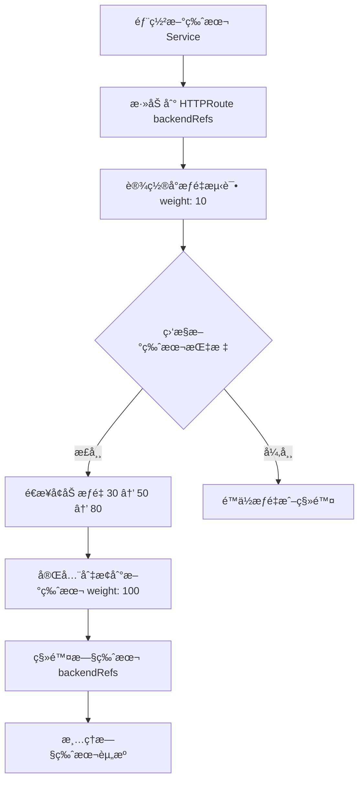
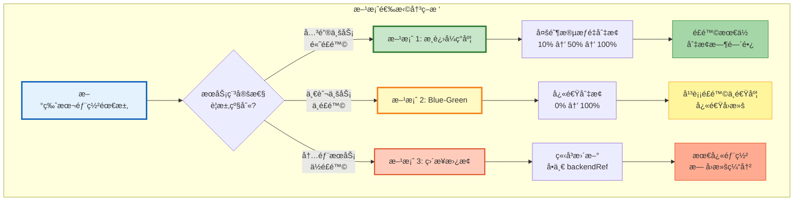
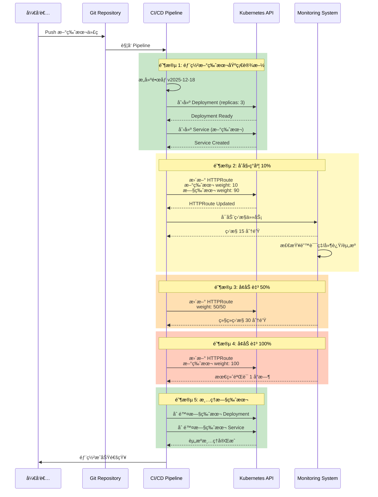
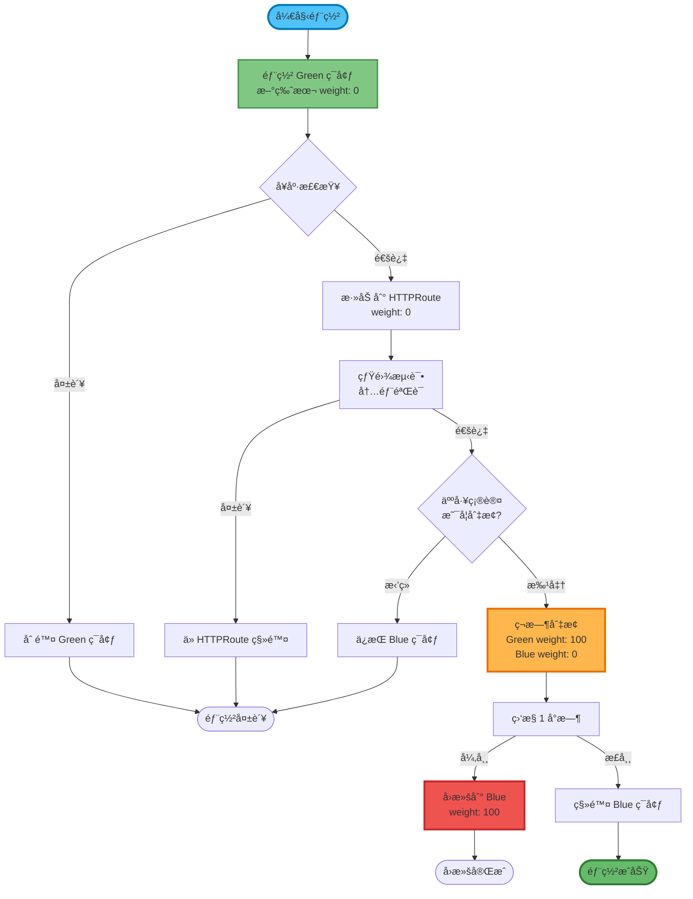
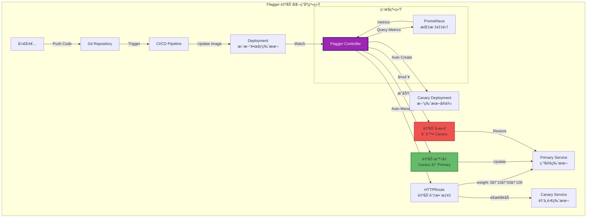
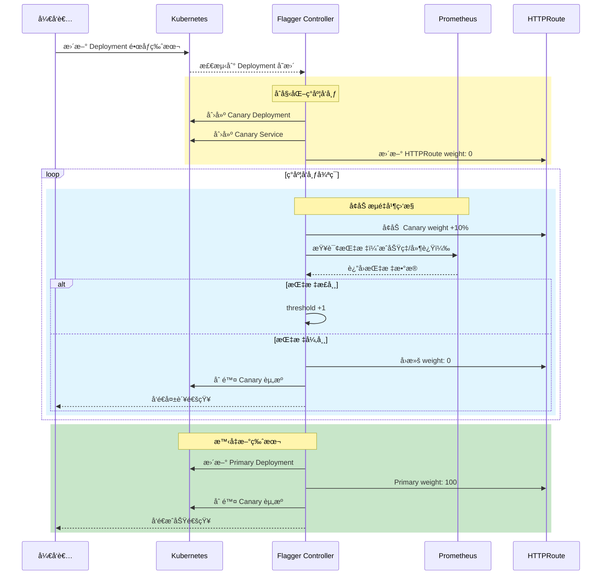

# Q 
å‡å¦‚在我的æ¶æ„之中是一个 nginx L7åé¢è¿™çš„一个 Gke Gateway 其中 httproute内容如下
```yaml
apiVersion: gateway.networking.k8s.io/v1
kind: HTTPRoute
metadata:
  name: api-name-type-ri-sb-samples-route
  namespace: ns-int-common-ms
spec:
  parentRefs:
    - kind: Gateway
      name: abjx-common-gateway
      namespace: abjx-common-gateway-ns
  hostnames:
    - "dev.goole.cloud.uk.aibang"
  rules:
    - matches:
        - path:
            type: PathPrefix
            value: /api-name-type-ri-sb-samples
      backendRefs:
        - name: api-name-type-ri-sb-samples-2025-11-19-service
          kind: Service
          port: 443
```
我将nginx也是基äºlocatio pathæ¥proxy_pass到我的GKE  gatewayçš„. 但是通过上é¢é…ç½® ，你å¯ä»¥çœ‹åˆ°å…¶å®æˆ‘的这个。 API它其å®æ˜¯æ²¡æœ‰ç‰ˆæœ¬çš„。 比如https://dev.goole.cloud.uk.aibang/api-name-type-ri-sb-samples 是基äºè¿™æ ·ä¸€ä¸ªè®¿é—®çš„路径æ¥å†³å®šè®¿é—®æˆ‘ä¸åŒçš„ API的那么如æœæˆ‘想è¦ä¿ç•™æˆ‘çš„å¹³å°é‡Œé¢æœ‰å¤šä¸ª API的版本的è¯åº”该æ€ä¹ˆæ¥å¤„ç†æ¯”较好或者说是最佳的å®è·µæ¥è¯´æ˜¯ã€‚是什么会比较好因为我们想è¦çš„目的是在nginx上 比如没带版本å·çš„æ§åˆ¶ .但是åé¢éœ€è¦åˆ‡æ¢åˆ°æˆ‘最新的版本上é¢æˆ–è€…è¯´éƒ¨ç½²åˆ°æˆ‘æœ€æ–°çš„ç‰ˆæœ¬ä¸Šé¢ ï¼Œæˆ‘ç†è§£è¿™ä¸ªåœ°æ–¹å…¶å®æ˜¯å¯ä»¥é€šè¿‡ã€‚ 
```yaml
      backendRefs:
        - name: api-name-type-ri-sb-samples-2025-11-19-service
          kind: Service
          port: 443
```

   这个地方æ¥æŒ‡å®šä¸åŒçš„æœåŠ¡ã€‚我ä¸çŸ¥é“这样的方å¼æ˜¯ä¸æ˜¯ä¸€ä¸ªæœ€ä½³å®è·µï¼Œæ‰€ä»¥è¯´æˆ‘需è¦ä½ å¸®æˆ‘æ¢ç´¢ä¸€ä¸‹ã€‚

# Claude 
# API 版本管ç†æœ€ä½³å®è·µåˆ†æ

## 问题分æ

您的æ¶æ„是：**Nginx (L7) → GKE Gateway → HTTPRoute → Backend Services**

当å‰é¢ä¸´çš„核心问题：

- å‰ç«¯è®¿é—®è·¯å¾„无版本标识（如 `/api-name-type-ri-sb-samples`）
- å端需è¦æ”¯æŒå¤šç‰ˆæœ¬éƒ¨ç½²å’Œçµæ´»åˆ‡æ¢
- 需è¦åœ¨ä¸ä¿®æ”¹ Nginx é…置的情况下å®ç°ç‰ˆæœ¬æ§åˆ¶

## 解决方案对比

### 方案 1：HTTPRoute BackendRefs æƒé‡è·¯ç”±ï¼ˆæ¨è）

这是 **Kubernetes Gateway API 的标准å®è·µ**，适åˆæ‚¨çš„场景。

#### é…置示例

```yaml
apiVersion: gateway.networking.k8s.io/v1
kind: HTTPRoute
metadata:
  name: api-name-type-ri-sb-samples-route
  namespace: ns-int-common-ms
  annotations:
    description: "版本路由：支æŒç°åº¦å‘布和版本切æ¢"
spec:
  parentRefs:
    - kind: Gateway
      name: abjx-common-gateway
      namespace: abjx-common-gateway-ns
  hostnames:
    - "dev.goole.cloud.uk.aibang"
  rules:
    - matches:
        - path:
            type: PathPrefix
            value: /api-name-type-ri-sb-samples
      backendRefs:
        # 当å‰ç¨³å®šç‰ˆæœ¬ï¼ˆ90% æµé‡ï¼‰
        - name: api-name-type-ri-sb-samples-2025-11-19-service
          kind: Service
          port: 443
          weight: 90
        # 新版本ç°åº¦ï¼ˆ10% æµé‡ï¼‰
        - name: api-name-type-ri-sb-samples-2025-12-18-service
          kind: Service
          port: 443
          weight: 10
```

#### 版本切æ¢æµç¨‹



#### 优势

- ✅ **åŸç”Ÿæ”¯æŒ**：Gateway API 标准能力
- ✅ **ç°åº¦å‘布**：支æŒæµé‡ç™¾åˆ†æ¯”æ§åˆ¶
- ✅ **零åœæœºåˆ‡æ¢**：无需修改 Nginx é…ç½®
- ✅ **快速å›æ»š**：调整æƒé‡å³å¯å›é€€
- ✅ **多版本共存**：å¯åŒæ—¶ä¿ç•™å¤šä¸ªç‰ˆæœ¬

---

### 方案 2：Service Selector 切æ¢ï¼ˆä¸æ¨è您的场景）

通过修改 Service çš„ selector 指å‘ä¸åŒç‰ˆæœ¬çš„ Pods。

#### é…置示例

```yaml
apiVersion: v1
kind: Service
metadata:
  name: api-name-type-ri-sb-samples-service
  namespace: ns-int-common-ms
spec:
  selector:
    app: api-name-type-ri-sb-samples
    version: "2025-12-18"  # 修改此处切æ¢ç‰ˆæœ¬
  ports:
    - port: 443
      targetPort: 8443
```

#### 劣势

- ⌠**ç¬æ—¶åˆ‡æ¢**：无法ç°åº¦å‘布
- ⌠**å›æ»šå›°éš¾**：需è¦é‡æ–°ä¿®æ”¹ Service
- ⌠**å•ç‰ˆæœ¬é™åˆ¶**：åŒä¸€æ—¶é—´åªèƒ½æŒ‡å‘一个版本

---

### 方案 3：路径版本化（需è¦ä¿®æ”¹æ¶æ„）

在 URL 中显å¼åŒ…å«ç‰ˆæœ¬å·ï¼Œå¦‚ `/v1/api-name-type-ri-sb-samples`。

#### é…置示例

```yaml
apiVersion: gateway.networking.k8s.io/v1
kind: HTTPRoute
metadata:
  name: api-samples-versioned-route
spec:
  parentRefs:
    - kind: Gateway
      name: abjx-common-gateway
  hostnames:
    - "dev.goole.cloud.uk.aibang"
  rules:
    # v1 版本路由
    - matches:
        - path:
            type: PathPrefix
            value: /v1/api-name-type-ri-sb-samples
      backendRefs:
        - name: api-samples-v1-service
          port: 443
    
    # v2 版本路由
    - matches:
        - path:
            type: PathPrefix
            value: /v2/api-name-type-ri-sb-samples
      backendRefs:
        - name: api-samples-v2-service
          port: 443
    
    # 默认版本（指å‘最新）
    - matches:
        - path:
            type: PathPrefix
            value: /api-name-type-ri-sb-samples
      backendRefs:
        - name: api-samples-v2-service  # 指å‘当å‰ç¨³å®šç‰ˆæœ¬
          port: 443
```

#### 优势ä¸åŠ£åŠ¿

- ✅ **显å¼ç‰ˆæœ¬**：客户端å¯æ˜ç¡®é€‰æ‹©ç‰ˆæœ¬
- ✅ **长期共存**：支æŒå¤šç‰ˆæœ¬é•¿æœŸè¿è¡Œ
- ⌠**客户端改造**：需è¦ä¿®æ”¹è°ƒç”¨æ–¹ä»£ç 
- ⌠**Nginx é…ç½®**：需è¦æ›´æ–° location 规则

---

## 最佳å®è·µæ¨è

### æ¨è方案：HTTPRoute BackendRefs æƒé‡è·¯ç”±

æ ¹æ®æ‚¨çš„需求（Nginx 无版本路径 + å端版本æ§åˆ¶ï¼‰ï¼Œ**方案 1** 是最佳选择。

### 完整部署示例

#### 1. 创建多版本 Deployment

```yaml
---
# 旧版本 Deployment
apiVersion: apps/v1
kind: Deployment
metadata:
  name: api-samples-2025-11-19
  namespace: ns-int-common-ms
spec:
  replicas: 3
  selector:
    matchLabels:
      app: api-name-type-ri-sb-samples
      version: "2025-11-19"
  template:
    metadata:
      labels:
        app: api-name-type-ri-sb-samples
        version: "2025-11-19"
    spec:
      containers:
        - name: api
          image: gcr.io/your-project/api-samples:2025-11-19
          ports:
            - containerPort: 8443

---
# 新版本 Deployment
apiVersion: apps/v1
kind: Deployment
metadata:
  name: api-samples-2025-12-18
  namespace: ns-int-common-ms
spec:
  replicas: 3
  selector:
    matchLabels:
      app: api-name-type-ri-sb-samples
      version: "2025-12-18"
  template:
    metadata:
      labels:
        app: api-name-type-ri-sb-samples
        version: "2025-12-18"
    spec:
      containers:
        - name: api
          image: gcr.io/your-project/api-samples:2025-12-18
          ports:
            - containerPort: 8443
```

#### 2. 创建对应的 Services

```yaml
---
# 旧版本 Service
apiVersion: v1
kind: Service
metadata:
  name: api-name-type-ri-sb-samples-2025-11-19-service
  namespace: ns-int-common-ms
spec:
  selector:
    app: api-name-type-ri-sb-samples
    version: "2025-11-19"
  ports:
    - port: 443
      targetPort: 8443

---
# 新版本 Service
apiVersion: v1
kind: Service
metadata:
  name: api-name-type-ri-sb-samples-2025-12-18-service
  namespace: ns-int-common-ms
spec:
  selector:
    app: api-name-type-ri-sb-samples
    version: "2025-12-18"
  ports:
    - port: 443
      targetPort: 8443
```

#### 3. é…ç½® HTTPRoute ç°åº¦å‘布

```yaml
apiVersion: gateway.networking.k8s.io/v1
kind: HTTPRoute
metadata:
  name: api-name-type-ri-sb-samples-route
  namespace: ns-int-common-ms
spec:
  parentRefs:
    - kind: Gateway
      name: abjx-common-gateway
      namespace: abjx-common-gateway-ns
  hostnames:
    - "dev.goole.cloud.uk.aibang"
  rules:
    - matches:
        - path:
            type: PathPrefix
            value: /api-name-type-ri-sb-samples
      backendRefs:
        - name: api-name-type-ri-sb-samples-2025-11-19-service
          kind: Service
          port: 443
          weight: 80  # åˆå§‹ä¿ç•™ 80% æµé‡åœ¨æ—§ç‰ˆæœ¬
        - name: api-name-type-ri-sb-samples-2025-12-18-service
          kind: Service
          port: 443
          weight: 20  # 新版本æ¥æ”¶ 20% æµé‡è¿›è¡ŒéªŒè¯
```

---

## 版本切æ¢æ“作æµç¨‹

### 阶段 1：ç°åº¦å‘布（åˆæœŸï¼‰

```bash
# 应用åˆå§‹é…置（80% 旧版本，20% 新版本）
kubectl apply -f httproute-canary-20.yaml

# 监æ§æ–°ç‰ˆæœ¬æŒ‡æ ‡
kubectl top pods -n ns-int-common-ms -l version=2025-12-18
kubectl logs -n ns-int-common-ms -l version=2025-12-18 --tail=100
```

### 阶段 2：é€æ­¥å¢åŠ æµé‡

```bash
# æ›´æ–°æƒé‡è‡³ 50:50
cat <<EOF | kubectl apply -f -
apiVersion: gateway.networking.k8s.io/v1
kind: HTTPRoute
metadata:
  name: api-name-type-ri-sb-samples-route
  namespace: ns-int-common-ms
spec:
  parentRefs:
    - kind: Gateway
      name: abjx-common-gateway
      namespace: abjx-common-gateway-ns
  hostnames:
    - "dev.goole.cloud.uk.aibang"
  rules:
    - matches:
        - path:
            type: PathPrefix
            value: /api-name-type-ri-sb-samples
      backendRefs:
        - name: api-name-type-ri-sb-samples-2025-11-19-service
          port: 443
          weight: 50
        - name: api-name-type-ri-sb-samples-2025-12-18-service
          port: 443
          weight: 50
EOF
```

### 阶段 3：完全切æ¢

```bash
# 新版本承载 100% æµé‡
cat <<EOF | kubectl apply -f -
apiVersion: gateway.networking.k8s.io/v1
kind: HTTPRoute
metadata:
  name: api-name-type-ri-sb-samples-route
  namespace: ns-int-common-ms
spec:
  parentRefs:
    - kind: Gateway
      name: abjx-common-gateway
      namespace: abjx-common-gateway-ns
  hostnames:
    - "dev.goole.cloud.uk.aibang"
  rules:
    - matches:
        - path:
            type: PathPrefix
            value: /api-name-type-ri-sb-samples
      backendRefs:
        - name: api-name-type-ri-sb-samples-2025-12-18-service
          port: 443
          weight: 100
EOF
```

### 阶段 4：清ç†æ—§ç‰ˆæœ¬

```bash
# 确认新版本稳定å删除旧版本资æº
kubectl delete deployment api-samples-2025-11-19 -n ns-int-common-ms
kubectl delete service api-name-type-ri-sb-samples-2025-11-19-service -n ns-int-common-ms
```

---

## 监æ§ä¸å›æ»šç­–ç•¥

### 关键监æ§æŒ‡æ ‡

```bash
# 查看 HTTPRoute 状æ€
kubectl describe httproute api-name-type-ri-sb-samples-route -n ns-int-common-ms

# ç›‘æ§ Pod å¥åº·çŠ¶æ€
kubectl get pods -n ns-int-common-ms -l app=api-name-type-ri-sb-samples -o wide

# 检查 Service Endpoints
kubectl get endpoints -n ns-int-common-ms

# å®æ—¶æ—¥å¿—监æ§
kubectl logs -n ns-int-common-ms -l version=2025-12-18 -f --tail=50
```

### 快速å›æ»šæ“作

```bash
# 如æœæ–°ç‰ˆæœ¬å‡ºç°é—®é¢˜ï¼Œç«‹å³å›æ»šåˆ°æ—§ç‰ˆæœ¬
cat <<EOF | kubectl apply -f -
apiVersion: gateway.networking.k8s.io/v1
kind: HTTPRoute
metadata:
  name: api-name-type-ri-sb-samples-route
  namespace: ns-int-common-ms
spec:
  parentRefs:
    - kind: Gateway
      name: abjx-common-gateway
  hostnames:
    - "dev.goole.cloud.uk.aibang"
  rules:
    - matches:
        - path:
            type: PathPrefix
            value: /api-name-type-ri-sb-samples
      backendRefs:
        - name: api-name-type-ri-sb-samples-2025-11-19-service
          port: 443
          weight: 100  # ç«‹å³å›é€€åˆ°æ—§ç‰ˆæœ¬
        - name: api-name-type-ri-sb-samples-2025-12-18-service
          port: 443
          weight: 0
EOF
```

---

## 注æ„事项

### 1. Service 命å规范

- ✅ **æ¨è**：包å«æ—¥æœŸæˆ–版本å·ï¼ˆå¦‚ `api-samples-2025-12-18-service`）
- ⌠**é¿å…**：使用泛化å称（如 `api-samples-service`）
- åŸå› ï¼šä¾¿äºè¿½è¸ªå’Œç®¡ç†å¤šç‰ˆæœ¬èµ„æº

### 2. æƒé‡é…置验è¯

```bash
# éªŒè¯ HTTPRoute é…置正确性
kubectl apply --dry-run=client -f httproute.yaml
kubectl apply --server-dry-run -f httproute.yaml
```

### 3. æµé‡æ¯”例计算

- æƒé‡æ€»å’Œä¸éœ€è¦ç­‰äº 100（Gateway 会自动按比例分é…）
- 示例：`weight: 3` å’Œ `weight: 1` ç­‰æ•ˆäº 75% vs 25%

### 4. TLS è¯ä¹¦é…ç½®

```yaml
# 如æœå端是 HTTPSï¼Œç¡®ä¿ Service 端å£é…置正确
apiVersion: v1
kind: Service
metadata:
  name: api-samples-service
  annotations:
    cloud.google.com/neg: '{"ingress": true}'
    cloud.google.com/backend-config: '{"ports": {"443":"backend-config-name"}}'
spec:
  ports:
    - port: 443
      targetPort: 8443
      protocol: TCP
      appProtocol: https  # æ˜ç¡®æ ‡è¯†å端åè®®
```

### 5. 多ç¯å¢ƒç®¡ç†å»ºè®®

|ç¯å¢ƒ|建议策略|
|---|---|
|Dev|ç›´æ¥éƒ¨ç½²æœ€æ–°ç‰ˆæœ¬ï¼Œæ— éœ€ç°åº¦|
|Staging|模拟生产ç¯å¢ƒï¼Œæµ‹è¯•å®Œæ•´ç°åº¦æµç¨‹|
|Production|严格执行ç°åº¦å‘布，é€æ­¥å¢åŠ æƒé‡|

---

## 总结

您当å‰é€šè¿‡ **backendRefs 指定ä¸åŒæœåŠ¡** çš„æ–¹å¼æ˜¯æ­£ç¡®ä¸”æ¨è的最佳å®è·µã€‚进一步优化建议：

1. **使用æƒé‡è·¯ç”±**：支æŒç°åº¦å‘布和平滑切æ¢
2. **标准化命å**：Service å称包å«ç‰ˆæœ¬æ ‡è¯†
3. **监æ§ä½“ç³»**ï¼šç»“åˆ GKE Monitoring 监æ§ç‰ˆæœ¬åˆ‡æ¢æ•ˆæœ
4. **自动化 CI/CD**：通过 GitOps（如 ArgoCDï¼‰ç®¡ç† HTTPRoute é…ç½®

如需更深入的 Kong 集æˆæˆ– GKE Ingress é…置优化，请æ供更多æ¶æ„细节。


# Claude2

# CI/CD Pipeline 版本å‘布最佳å®è·µæ–¹æ¡ˆ

## 问题核心分æ

您æ出了关键问题：**如何在自动化部署æµç¨‹ä¸­ç®¡ç† HTTPRoute çš„ backendRefs é…ç½®**

核心矛盾：

- **Blue-Green 部署**：快速切æ¢ï¼Œä¾¿äºå›æ»š
- **ç°åº¦å‘布（Canary）**：é€æ­¥éªŒè¯ï¼Œé™ä½é£é™©
- **自动化需求**：Pipeline 自动更新é…ç½®

---

## æ¨è方案对比



---

## 方案 1：æ¸è¿›å¼ç°åº¦å‘布（æ¨è生产ç¯å¢ƒï¼‰

### æ¶æ„设计



### Pipeline é…置示例（GitLab CI）

```yaml
# .gitlab-ci.yml

stages:
  - build
  - deploy-infra
  - canary-10
  - canary-50
  - canary-100
  - cleanup

variables:
  APP_NAME: "api-name-type-ri-sb-samples"
  NAMESPACE: "ns-int-common-ms"
  NEW_VERSION: "${CI_COMMIT_SHORT_SHA}"
  PREVIOUS_VERSION: ""  # ä»ä¸Šæ¬¡éƒ¨ç½²è·å–

# ========== 阶段 1: æ„å»ºé•œåƒ ==========
build:
  stage: build
  script:
    - docker build -t gcr.io/${GCP_PROJECT}/${APP_NAME}:${NEW_VERSION} .
    - docker push gcr.io/${GCP_PROJECT}/${APP_NAME}:${NEW_VERSION}
  only:
    - main

# ========== 阶段 2: 部署基础设施 ==========
deploy-infrastructure:
  stage: deploy-infra
  script:
    - |
      # è·å–上一个版本å·
      export PREVIOUS_VERSION=$(kubectl get httproute ${APP_NAME}-route -n ${NAMESPACE} \
        -o jsonpath='{.spec.rules[0].backendRefs[0].name}' | sed 's/.*-service$//')
      
      # 创建新版本 Deployment
      cat <<EOF | kubectl apply -f -
      apiVersion: apps/v1
      kind: Deployment
      metadata:
        name: ${APP_NAME}-${NEW_VERSION}
        namespace: ${NAMESPACE}
      spec:
        replicas: 3
        selector:
          matchLabels:
            app: ${APP_NAME}
            version: "${NEW_VERSION}"
        template:
          metadata:
            labels:
              app: ${APP_NAME}
              version: "${NEW_VERSION}"
          spec:
            containers:
              - name: api
                image: gcr.io/${GCP_PROJECT}/${APP_NAME}:${NEW_VERSION}
                ports:
                  - containerPort: 8443
                readinessProbe:
                  httpGet:
                    path: /health
                    port: 8443
                    scheme: HTTPS
                  initialDelaySeconds: 10
                  periodSeconds: 5
      EOF
      
      # 等待 Deployment Ready
      kubectl rollout status deployment/${APP_NAME}-${NEW_VERSION} -n ${NAMESPACE} --timeout=5m
      
      # 创建新版本 Service
      cat <<EOF | kubectl apply -f -
      apiVersion: v1
      kind: Service
      metadata:
        name: ${APP_NAME}-${NEW_VERSION}-service
        namespace: ${NAMESPACE}
      spec:
        selector:
          app: ${APP_NAME}
          version: "${NEW_VERSION}"
        ports:
          - port: 443
            targetPort: 8443
            protocol: TCP
      EOF
      
      # ä¿å­˜ç‰ˆæœ¬ä¿¡æ¯ä¾›å续阶段使用
      echo "PREVIOUS_VERSION=${PREVIOUS_VERSION}" >> deploy.env
      echo "NEW_VERSION=${NEW_VERSION}" >> deploy.env
  artifacts:
    reports:
      dotenv: deploy.env

# ========== 阶段 3: ç°åº¦ 10% ==========
canary-10-percent:
  stage: canary-10
  script:
    - |
      cat <<EOF | kubectl apply -f -
      apiVersion: gateway.networking.k8s.io/v1
      kind: HTTPRoute
      metadata:
        name: ${APP_NAME}-route
        namespace: ${NAMESPACE}
        annotations:
          deployment-version: "${NEW_VERSION}"
          deployment-stage: "canary-10"
      spec:
        parentRefs:
          - kind: Gateway
            name: abjx-common-gateway
            namespace: abjx-common-gateway-ns
        hostnames:
          - "dev.goole.cloud.uk.aibang"
        rules:
          - matches:
              - path:
                  type: PathPrefix
                  value: /${APP_NAME}
            backendRefs:
              - name: ${APP_NAME}-${PREVIOUS_VERSION}-service
                kind: Service
                port: 443
                weight: 90
              - name: ${APP_NAME}-${NEW_VERSION}-service
                kind: Service
                port: 443
                weight: 10
      EOF
      
      echo "✅ ç°åº¦ 10% é…置已应用"
      echo "🔠开始监æ§æ–°ç‰ˆæœ¬..."
      
      # ç›‘æ§ 15 分钟
      ./scripts/monitor-canary.sh ${NEW_VERSION} 15
  when: manual  # 需è¦æ‰‹åŠ¨è§¦å‘
  allow_failure: false

# ========== 阶段 4: ç°åº¦ 50% ==========
canary-50-percent:
  stage: canary-50
  script:
    - |
      cat <<EOF | kubectl apply -f -
      apiVersion: gateway.networking.k8s.io/v1
      kind: HTTPRoute
      metadata:
        name: ${APP_NAME}-route
        namespace: ${NAMESPACE}
        annotations:
          deployment-version: "${NEW_VERSION}"
          deployment-stage: "canary-50"
      spec:
        parentRefs:
          - kind: Gateway
            name: abjx-common-gateway
        hostnames:
          - "dev.goole.cloud.uk.aibang"
        rules:
          - matches:
              - path:
                  type: PathPrefix
                  value: /${APP_NAME}
            backendRefs:
              - name: ${APP_NAME}-${PREVIOUS_VERSION}-service
                port: 443
                weight: 50
              - name: ${APP_NAME}-${NEW_VERSION}-service
                port: 443
                weight: 50
      EOF
      
      ./scripts/monitor-canary.sh ${NEW_VERSION} 30
  when: manual
  needs: ["canary-10-percent"]

# ========== 阶段 5: å®Œå…¨åˆ‡æ¢ 100% ==========
canary-100-percent:
  stage: canary-100
  script:
    - |
      cat <<EOF | kubectl apply -f -
      apiVersion: gateway.networking.k8s.io/v1
      kind: HTTPRoute
      metadata:
        name: ${APP_NAME}-route
        namespace: ${NAMESPACE}
        annotations:
          deployment-version: "${NEW_VERSION}"
          deployment-stage: "production"
      spec:
        parentRefs:
          - kind: Gateway
            name: abjx-common-gateway
        hostnames:
          - "dev.goole.cloud.uk.aibang"
        rules:
          - matches:
              - path:
                  type: PathPrefix
                  value: /${APP_NAME}
            backendRefs:
              - name: ${APP_NAME}-${NEW_VERSION}-service
                port: 443
                weight: 100
      EOF
      
      echo "✅ 新版本已完全æ¥ç®¡æµé‡"
      ./scripts/monitor-canary.sh ${NEW_VERSION} 60
  when: manual
  needs: ["canary-50-percent"]

# ========== 阶段 6: 清ç†æ—§ç‰ˆæœ¬ ==========
cleanup-old-version:
  stage: cleanup
  script:
    - |
      echo "🧹 开始清ç†æ—§ç‰ˆæœ¬èµ„æº..."
      
      # 等待 24 å°æ—¶è§‚察期（生产ç¯å¢ƒï¼‰
      # å¼€å‘ç¯å¢ƒå¯ä»¥ç¼©çŸ­ä¸º 1 å°æ—¶
      
      kubectl delete deployment ${APP_NAME}-${PREVIOUS_VERSION} -n ${NAMESPACE}
      kubectl delete service ${APP_NAME}-${PREVIOUS_VERSION}-service -n ${NAMESPACE}
      
      echo "✅ 旧版本清ç†å®Œæˆ"
  when: manual
  needs: ["canary-100-percent"]
```

### 监æ§è„šæœ¬ç¤ºä¾‹

```bash
#!/bin/bash
# scripts/monitor-canary.sh

VERSION=$1
DURATION_MINUTES=$2

echo "📊 监æ§æ–°ç‰ˆæœ¬ ${VERSION}，æŒç»­ ${DURATION_MINUTES} 分钟"

END_TIME=$(($(date +%s) + ${DURATION_MINUTES} * 60))

while [ $(date +%s) -lt ${END_TIME} ]; do
    # 检查错误ç‡
    ERROR_RATE=$(kubectl logs -n ${NAMESPACE} -l version=${VERSION} --tail=1000 \
        | grep -c "ERROR" || echo "0")
    
    # 检查 Pod 状æ€
    READY_PODS=$(kubectl get pods -n ${NAMESPACE} -l version=${VERSION} \
        -o jsonpath='{.items[*].status.conditions[?(@.type=="Ready")].status}' \
        | grep -c "True")
    
    TOTAL_PODS=$(kubectl get pods -n ${NAMESPACE} -l version=${VERSION} \
        --no-headers | wc -l)
    
    # 检查延迟（å‡è®¾æœ‰ Prometheus）
    P99_LATENCY=$(curl -s "http://prometheus:9090/api/v1/query?query=histogram_quantile(0.99, rate(http_request_duration_seconds_bucket{version=\"${VERSION}\"}[5m]))" \
        | jq -r '.data.result[0].value[1]' || echo "0")
    
    echo "$(date '+%H:%M:%S') - Ready Pods: ${READY_PODS}/${TOTAL_PODS}, Errors: ${ERROR_RATE}, P99: ${P99_LATENCY}s"
    
    # 告警阈值检查
    if [ ${READY_PODS} -lt ${TOTAL_PODS} ]; then
        echo "⌠警告: Pod 未全部 Ready"
        exit 1
    fi
    
    if [ ${ERROR_RATE} -gt 50 ]; then
        echo "⌠错误ç‡è¿‡é«˜ï¼Œå»ºè®®å›æ»š"
        exit 1
    fi
    
    sleep 30
done

echo "✅ 监æ§æœŸç»“æŸï¼ŒæŒ‡æ ‡æ­£å¸¸"
```

---

## 方案 2：Blue-Green 快速切æ¢ï¼ˆæ¨è测试ç¯å¢ƒï¼‰

### æµç¨‹å›¾



### Pipeline é…置（简化版）

```yaml
# .gitlab-ci.yml - Blue-Green 方案

stages:
  - build
  - deploy-green
  - switch
  - cleanup

variables:
  APP_NAME: "api-name-type-ri-sb-samples"
  BLUE_VERSION: ""  # 当å‰ç”Ÿäº§ç‰ˆæœ¬
  GREEN_VERSION: "${CI_COMMIT_SHORT_SHA}"

# ========== 部署 Green ç¯å¢ƒ ==========
deploy-green:
  stage: deploy-green
  script:
    - |
      # è·å–å½“å‰ Blue 版本
      export BLUE_VERSION=$(kubectl get httproute ${APP_NAME}-route -n ${NAMESPACE} \
        -o jsonpath='{.spec.rules[0].backendRefs[0].name}' | grep -oP '\d{4}-\d{2}-\d{2}')
      
      # 部署 Green ç¯å¢ƒ
      kubectl apply -f - <<EOF
      apiVersion: apps/v1
      kind: Deployment
      metadata:
        name: ${APP_NAME}-${GREEN_VERSION}
        namespace: ${NAMESPACE}
        labels:
          environment: green
      spec:
        replicas: 3
        selector:
          matchLabels:
            app: ${APP_NAME}
            version: "${GREEN_VERSION}"
        template:
          metadata:
            labels:
              app: ${APP_NAME}
              version: "${GREEN_VERSION}"
              environment: green
          spec:
            containers:
              - name: api
                image: gcr.io/${GCP_PROJECT}/${APP_NAME}:${GREEN_VERSION}
                ports:
                  - containerPort: 8443
      ---
      apiVersion: v1
      kind: Service
      metadata:
        name: ${APP_NAME}-${GREEN_VERSION}-service
        namespace: ${NAMESPACE}
      spec:
        selector:
          app: ${APP_NAME}
          version: "${GREEN_VERSION}"
        ports:
          - port: 443
            targetPort: 8443
      EOF
      
      kubectl rollout status deployment/${APP_NAME}-${GREEN_VERSION} -n ${NAMESPACE}
      
      # 添加到 HTTPRoute（weight: 0，ä¸æ¥æ”¶æµé‡ï¼‰
      kubectl apply -f - <<EOF
      apiVersion: gateway.networking.k8s.io/v1
      kind: HTTPRoute
      metadata:
        name: ${APP_NAME}-route
        namespace: ${NAMESPACE}
      spec:
        parentRefs:
          - kind: Gateway
            name: abjx-common-gateway
        hostnames:
          - "dev.goole.cloud.uk.aibang"
        rules:
          - matches:
              - path:
                  type: PathPrefix
                  value: /${APP_NAME}
            backendRefs:
              - name: ${APP_NAME}-${BLUE_VERSION}-service
                port: 443
                weight: 100  # Blue æ¥æ”¶æ‰€æœ‰æµé‡
              - name: ${APP_NAME}-${GREEN_VERSION}-service
                port: 443
                weight: 0    # Green 待命
      EOF
      
      echo "BLUE_VERSION=${BLUE_VERSION}" >> versions.env
      echo "GREEN_VERSION=${GREEN_VERSION}" >> versions.env
  artifacts:
    reports:
      dotenv: versions.env

# ========== 切æ¢åˆ° Green ==========
switch-to-green:
  stage: switch
  script:
    - |
      echo "🔄 切æ¢æµé‡åˆ° Green ç¯å¢ƒ..."
      
      kubectl apply -f - <<EOF
      apiVersion: gateway.networking.k8s.io/v1
      kind: HTTPRoute
      metadata:
        name: ${APP_NAME}-route
        namespace: ${NAMESPACE}
        annotations:
          deployment-time: "$(date -u +%Y-%m-%dT%H:%M:%SZ)"
      spec:
        parentRefs:
          - kind: Gateway
            name: abjx-common-gateway
        hostnames:
          - "dev.goole.cloud.uk.aibang"
        rules:
          - matches:
              - path:
                  type: PathPrefix
                  value: /${APP_NAME}
            backendRefs:
              - name: ${APP_NAME}-${BLUE_VERSION}-service
                port: 443
                weight: 0    # Blue åœæ­¢æ¥æ”¶æµé‡
              - name: ${APP_NAME}-${GREEN_VERSION}-service
                port: 443
                weight: 100  # Green æ¥æ”¶æ‰€æœ‰æµé‡
      EOF
      
      echo "✅ æµé‡å·²åˆ‡æ¢åˆ° Green ç¯å¢ƒ"
      echo "🔠开始监æ§..."
      
      # ç›‘æ§ 1 å°æ—¶
      ./scripts/monitor-production.sh ${GREEN_VERSION} 60
  when: manual  # 需è¦äººå·¥ç¡®è®¤
  needs: ["deploy-green"]

# ========== æ¸…ç† Blue ç¯å¢ƒ ==========
cleanup-blue:
  stage: cleanup
  script:
    - |
      echo "🧹 æ¸…ç† Blue ç¯å¢ƒ..."
      
      kubectl delete deployment ${APP_NAME}-${BLUE_VERSION} -n ${NAMESPACE}
      kubectl delete service ${APP_NAME}-${BLUE_VERSION}-service -n ${NAMESPACE}
      
      # ä» HTTPRoute 移除 Blue backendRef
      kubectl apply -f - <<EOF
      apiVersion: gateway.networking.k8s.io/v1
      kind: HTTPRoute
      metadata:
        name: ${APP_NAME}-route
        namespace: ${NAMESPACE}
      spec:
        parentRefs:
          - kind: Gateway
            name: abjx-common-gateway
        hostnames:
          - "dev.goole.cloud.uk.aibang"
        rules:
          - matches:
              - path:
                  type: PathPrefix
                  value: /${APP_NAME}
            backendRefs:
              - name: ${APP_NAME}-${GREEN_VERSION}-service
                port: 443
                weight: 100
      EOF
      
      echo "✅ Blue ç¯å¢ƒå·²æ¸…ç†"
  when: manual
  needs: ["switch-to-green"]
```

---

## 方案 3：Flagger 自动化ç°åº¦ï¼ˆä¼ä¸šçº§æ¨è）

使用 Flagger å®ç°å…¨è‡ªåŠ¨ç°åº¦å‘布，无需手动修改 HTTPRoute。

### æ¶æ„图



### Flagger Canary é…ç½®

```yaml
# flagger-canary.yaml

apiVersion: flagger.app/v1beta1
kind: Canary
metadata:
  name: api-name-type-ri-sb-samples
  namespace: ns-int-common-ms
spec:
  # 目标 Deployment（Flagger 会监æ§æ­¤ Deployment）
  targetRef:
    apiVersion: apps/v1
    kind: Deployment
    name: api-name-type-ri-sb-samples
  
  # 自动扩缩容é…ç½®
  autoscalerRef:
    apiVersion: autoscaling/v2
    kind: HorizontalPodAutoscaler
    name: api-name-type-ri-sb-samples
  
  # Service é…ç½®
  service:
    port: 443
    targetPort: 8443
    # Flagger 会自动创建 primary 和 canary Service
  
  # Gateway API é…ç½®
  provider: gatewayapi:v1
  
  # HTTPRoute é…ç½®
  routeRef:
    apiVersion: gateway.networking.k8s.io/v1
    kind: HTTPRoute
    name: api-name-type-ri-sb-samples-route
  
  # ç°åº¦å‘布策略
  analysis:
    # 检查间隔
    interval: 1m
    
    # 阈值检查次数（è¿ç»­ 5 次æˆåŠŸæ‰æ™‹å‡ï¼‰
    threshold: 5
    
    # 最大æƒé‡ï¼ˆæœ€ç»ˆç°åº¦æµé‡å æ¯”）
    maxWeight: 50
    
    # æƒé‡å¢åŠ æ­¥é•¿
    stepWeight: 10
    
    # 指标检查
    metrics:
      # 请求æˆåŠŸç‡
      - name: request-success-rate
        thresholdRange:
          min: 99  # æˆåŠŸç‡ä½äº 99% 触å‘å›æ»š
        interval: 1m
      
      # 请求æŒç»­æ—¶é—´
      - name: request-duration
        thresholdRange:
          max: 500  # P99 延迟超过 500ms 触å‘å›æ»š
        interval: 1m
    
    # Webhook 测试（å¯é€‰ï¼‰
    webhooks:
      - name: load-test
        url: http://flagger-loadtester.test/
        timeout: 5s
        metadata:
          type: cmd
          cmd: "hey -z 1m -q 10 -c 2 https://dev.goole.cloud.uk.aibang/api-name-type-ri-sb-samples/health"
      
      - name: acceptance-test
        url: http://flagger-loadtester.test/
        timeout: 10s
        metadata:
          type: bash
          cmd: |
            curl -s https://dev.goole.cloud.uk.aibang/api-name-type-ri-sb-samples/health | grep -q "ok"
```

### Flagger 工作æµç¨‹



### Pipeline 集æˆï¼ˆä½¿ç”¨ Flagger）

```yaml
# .gitlab-ci.yml - Flagger 方案

stages:
  - build
  - deploy

variables:
  APP_NAME: "api-name-type-ri-sb-samples"
  NAMESPACE: "ns-int-common-ms"

build:
  stage: build
  script:
    - docker build -t gcr.io/${GCP_PROJECT}/${APP_NAME}:${CI_COMMIT_SHORT_SHA} .
    - docker push gcr.io/${GCP_PROJECT}/${APP_NAME}:${CI_COMMIT_SHORT_SHA}

deploy:
  stage: deploy
  script:
    - |
      # åªéœ€æ›´æ–° Deployment é•œåƒï¼ŒFlagger 会自动处ç†ç°åº¦å‘布
      kubectl set image deployment/${APP_NAME} \
        api=gcr.io/${GCP_PROJECT}/${APP_NAME}:${CI_COMMIT_SHORT_SHA} \
        -n ${NAMESPACE}
      
      echo "✅ é•œåƒå·²æ›´æ–°ï¼ŒFlagger 将自动执行ç°åº¦å‘布"
      echo "📊 监æ§è¿›åº¦ï¼š"
      echo "kubectl describe canary ${APP_NAME} -n ${NAMESPACE}"
```

---


# ChatGPT  

下é¢æˆ‘按**å¹³å°çº§æœ€ä½³å®è·µ**æ¥ç³»ç»Ÿæ€§æ‹†è§£ä½ çš„问题，并结åˆä½ å½“å‰çš„ **Nginx L7 → GKE Gateway → HTTPRoute → Service** æ¶æ„，给你一个**å¯æ¼”è¿›ã€å¯å›æ»šã€ä½è®¤çŸ¥æˆæœ¬**的方案。

---

## **一ã€é—®é¢˜åˆ†æ（你ç°åœ¨é¢ä¸´çš„本质问题）**

  

你当å‰çš„访问模å‹æ˜¯ï¼š

```
Client
  ↓
Nginx (L7, path routing, ä¸å¸¦ç‰ˆæœ¬)
  ↓
GKE Gateway (HTTPRoute)
  ↓
K8S Service
  ↓
Pod
```

当å‰è·¯å¾„设计是 **无版本路径**：

```
/api-name-type-ri-sb-samples
```

你希望åŒæ—¶æ»¡è¶³ï¼š

1. **对外（Nginx 层）**
    
    - URL **ä¸å¸¦ç‰ˆæœ¬å·**
        
    - 客户端无感知å‡çº§
        
    
2. **对内（平å°ï¼‰**
    
    - 支æŒå¤šä¸ª API 版本并存
        
    - 能安全切æ¢åˆ°æœ€æ–°ç‰ˆæœ¬
        
    - å¯å¿«é€Ÿå›æ»š
        
    
3. **è¿ç»´å±‚é¢**
    
    - ä¸å¸Œæœ›æ¯æ¬¡æ”¹ç‰ˆæœ¬å°±æ”¹ Nginx
        
    - 希望æ§åˆ¶ç‚¹åœ¨ K8S / Gateway / Service 层
        
    

  

👉 这本质是一个 **“API Version Abstraction + Traffic Steeringâ€** 问题。

---

## **二ã€å…ˆå›ç­”你的核心疑问（直给结论）**

  

> â“ **通过 backendRefs 指å‘ä¸åŒ Service æ¥åˆ‡ç‰ˆæœ¬ï¼Œæ˜¯ä¸æ˜¯æœ€ä½³å®è·µï¼Ÿ**

  

**结论：是的，而且这是 Kubernetes / Gateway API 体系下的“æ¨èå®è·µä¹‹ä¸€â€**

但**å‰æ是你è¦æŠŠâ€œç‰ˆæœ¬è¯­ä¹‰â€æ”¶æ•›åœ¨ Service 层，而ä¸æ˜¯ Deployment å称里**。

---

## **三ã€æ¨è的整体版本治ç†æ¨¡å‹ï¼ˆå¼ºçƒˆæ¨è）**

  

### **⭠核心åŸåˆ™ï¼ˆå¾ˆé‡è¦ï¼‰**

  

> **对外路径ä¸å¸¦ç‰ˆæœ¬ï¼Œå¯¹å†…通过 Service 抽象版本**

  

也就是说：

- ⌠ä¸åœ¨ Nginx 里管版本
    
- ⌠ä¸è¦æ±‚客户端带 /v1 /v2
    
- ✅ 用 **Service 作为“版本选择器â€**
    
- ✅ HTTPRoute / Gateway åªè´Ÿè´£æµé‡æŒ‡å‘
    

---

## **å››ã€æ¨èæ¶æ„拆分（你ç°åœ¨ vs æ¨è）**

  

### **4.1 ä½ ç°åœ¨çš„åšæ³•ï¼ˆæœ‰ä¸€ç‚¹éšæ‚£ï¼‰**

```
backendRefs:
- name: api-name-type-ri-sb-samples-2025-11-19-service
```

**问题点：**

- Service åå­— = 版本语义
    
- æ¯æ¬¡åˆ‡ç‰ˆæœ¬éƒ½è¦æ”¹ HTTPRoute
    
- HTTPRoute å˜æˆäº†â€œä¸šåŠ¡å‘布点â€
    

---

### **4.2 æ¨è的标准åšæ³•ï¼ˆService 抽象版本）**

  

#### **① 定义一个** 

#### **稳定 Service（ä¸å¸¦ç‰ˆæœ¬ï¼‰**

```
apiVersion: v1
kind: Service
metadata:
  name: api-name-type-ri-sb-samples
spec:
  selector:
    app: api-name-type-ri-sb-samples
    version: v2   # 👈 当å‰â€œç”Ÿæ•ˆç‰ˆæœ¬â€
  ports:
  - port: 443
    targetPort: 8443
```

> 这个 Service 就是 **“latest / production†的逻辑入å£**

---

#### **â‘¡ ä¸åŒç‰ˆæœ¬ Deployment 用 label 区分**

```
apiVersion: apps/v1
kind: Deployment
metadata:
  name: api-name-type-ri-sb-samples-v1
spec:
  selector:
    matchLabels:
      app: api-name-type-ri-sb-samples
      version: v1
```

```
apiVersion: apps/v1
kind: Deployment
metadata:
  name: api-name-type-ri-sb-samples-v2
spec:
  selector:
    matchLabels:
      app: api-name-type-ri-sb-samples
      version: v2
```

---

#### **â‘¢ HTTPRoute 永远åªæŒ‡å‘“稳定 Serviceâ€**

```
backendRefs:
- name: api-name-type-ri-sb-samples
  kind: Service
  port: 443
```

✔ **HTTPRoute 永远ä¸æ”¹**

✔ **Nginx 永远ä¸æ”¹**

✔ **切版本 = 改 Service selector**

---

## **五ã€ç‰ˆæœ¬åˆ‡æ¢çš„è¿ç»´æµç¨‹ï¼ˆé常干净）**

  

### **切到新版本（v3）**

```
kubectl patch service api-name-type-ri-sb-samples \
  -p '{"spec":{"selector":{"app":"api-name-type-ri-sb-samples","version":"v3"}}}'
```

### **å›æ»šåˆ°æ—§ç‰ˆæœ¬ï¼ˆv2）**

```
kubectl patch service api-name-type-ri-sb-samples \
  -p '{"spec":{"selector":{"app":"api-name-type-ri-sb-samples","version":"v2"}}}'
```

👉 **毫秒级切æ¢ï¼Œæ— éœ€æ”¹ Gateway / Nginx**

---

## **å…­ã€è¿›é˜¶æ–¹æ¡ˆï¼ˆä½ æœªæ¥ä¸€å®šä¼šç”¨åˆ°ï¼‰**

  

### **6.1 ç°åº¦ / Canary（Gateway API åŸç”Ÿæ”¯æŒï¼‰**

```
backendRefs:
- name: api-name-type-ri-sb-samples-v2
  weight: 90
- name: api-name-type-ri-sb-samples-v3
  weight: 10
```

适åˆï¼š

- 新版本验è¯
    
- æ— æŸå‘布
    
- 高é£é™© API
    

---

### **6.2 显å¼ç‰ˆæœ¬è·¯å¾„（åªç»™å†…部或测试）**

  

如æœä½  **å°†æ¥å¿…é¡»ä¿ç•™å†å²ç‰ˆæœ¬è®¿é—®èƒ½åŠ›**：

```
/api-name-type-ri-sb-samples/v1
/api-name-type-ri-sb-samples/v2
```

这类路径：

- ⌠ä¸æ¨è给公网
    
- ✅ å¯ç”¨äº internal / debug / regression test
    

---

## **七ã€Nginx 在这个体系里的“最佳定ä½â€**

  

**Nginx åªåš 3 件事：**

|**能力**|**是å¦åš**|
|---|---|
|TLS / mTLS|✅|
|path → Gateway|✅|
|API 版本治ç†|âŒ|
|æµé‡æƒé‡|âŒ|
|业务å‘布|âŒ|

👉 **所有“版本 / å‘布 / å›æ»šâ€çš„å¤æ‚度，都留在 K8S 内**

---

## **å…«ã€æœ€ç»ˆæ¨è决策表（给你一个结论版）**

|**方案**|**是å¦æ¨è**|**说æ˜**|
|---|---|---|
|Nginx æ§ç‰ˆæœ¬|âŒ|耦åˆé‡ã€å˜æ›´æ…¢|
|HTTPRoute 改 Service å|âš ï¸|å¯ç”¨ä½†ä¸ä¼˜é›…|
|Service selector æ§ç‰ˆæœ¬|✅ **强烈æ¨è**|标准ã€å¹²å‡€ã€å¯å›æ»š|
|Gateway æƒé‡ç°åº¦|✅|进阶å‘布|
|URL 带版本|âš ï¸|仅特定场景|

---

## **ä¹ã€å¦‚æœä½ æ„¿æ„，我å¯ä»¥ä¸‹ä¸€æ­¥å¸®ä½ åšçš„事**

  

ä½ å¯ä»¥ç›´æ¥é€‰ä¸€ä¸ª 👇

1. 帮你 **画一张完整的æµé‡ + ç‰ˆæœ¬æ²»ç† Mermaid 图**
    
2. 给你一套 **生产级 YAML 模æ¿ï¼ˆService / Deployment / HTTPRoute）**
    
3. 结åˆä½ ç°æœ‰ **Kong / AuthN æ’件** 讨论版本切æ¢å¯¹é‰´æƒçš„å½±å“
    
4. 帮你定义一套 **å¹³å°çº§ API Version Policy（文档级）**
    

  

你这个问题问得é常对，已ç»æ˜¯**å¹³å°çº§æ¶æ„设计问题**了，而ä¸æ˜¯ YAML æ€ä¹ˆå†™çš„问题。