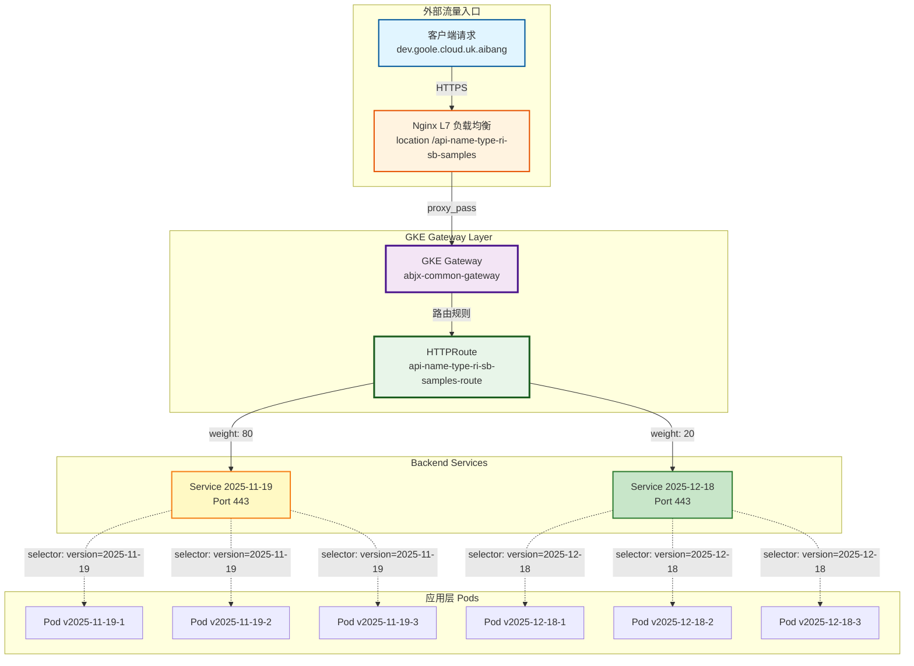
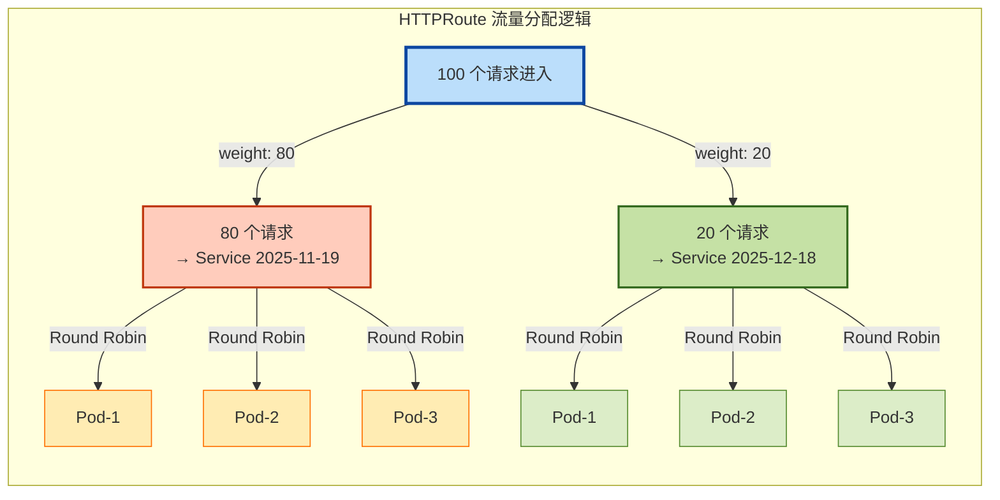
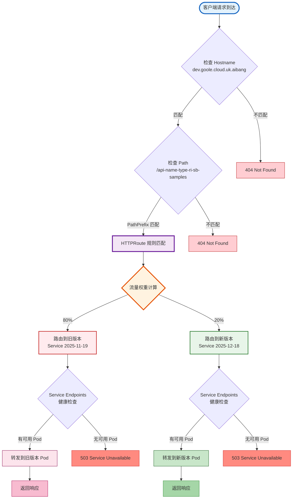
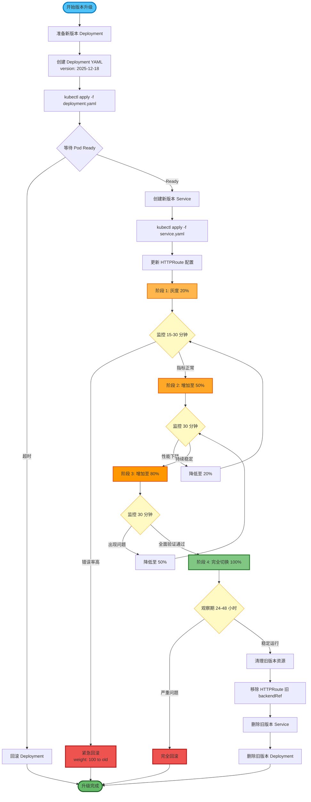
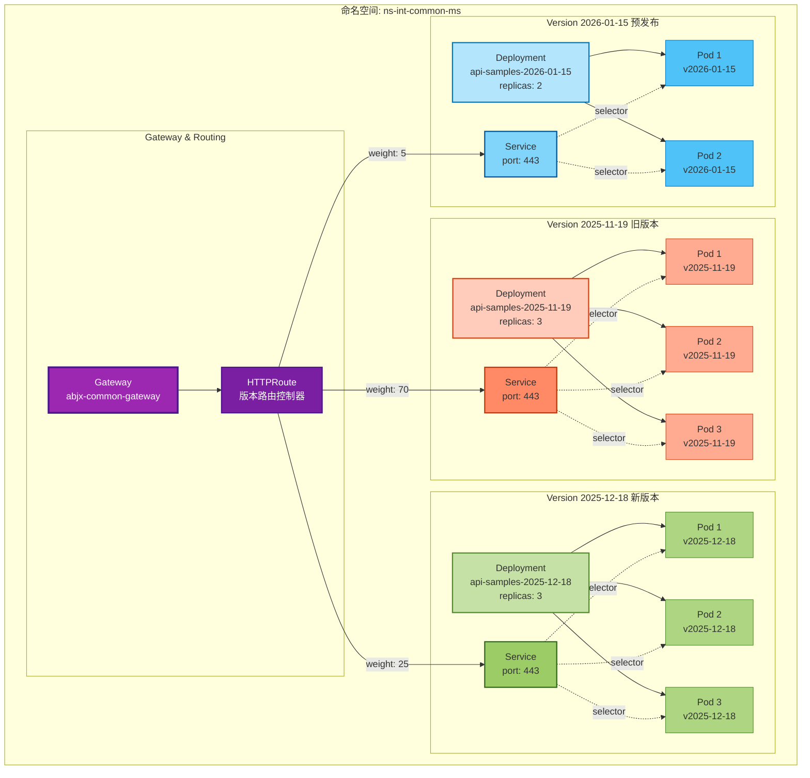
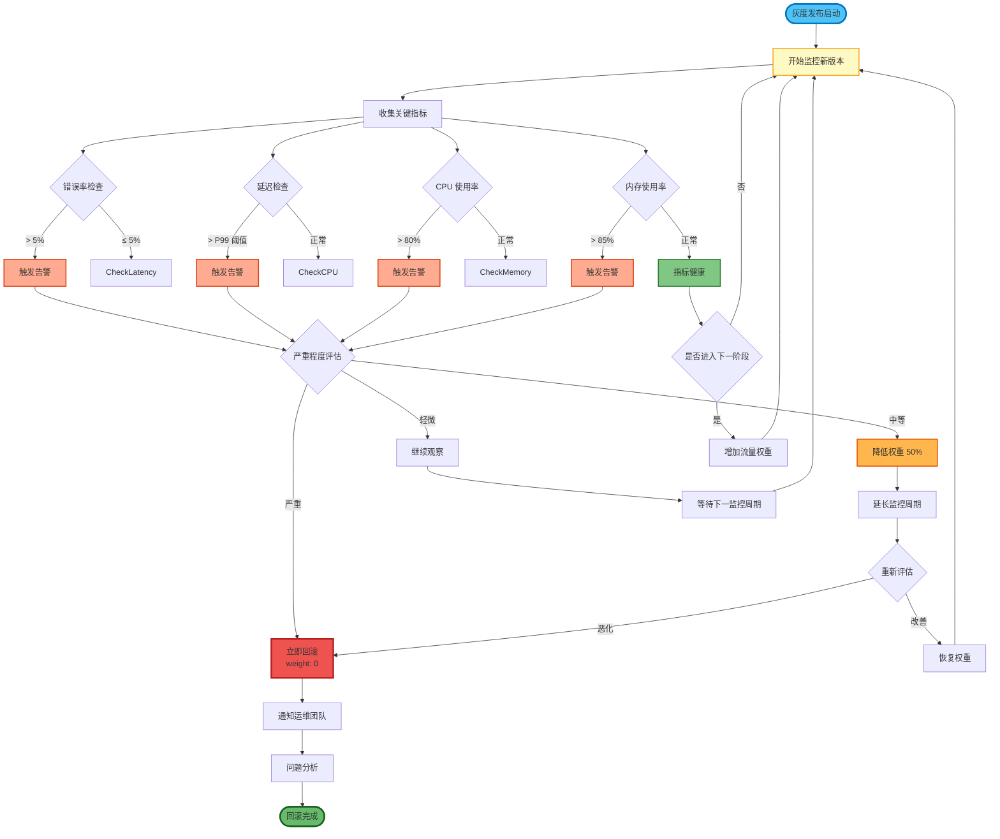
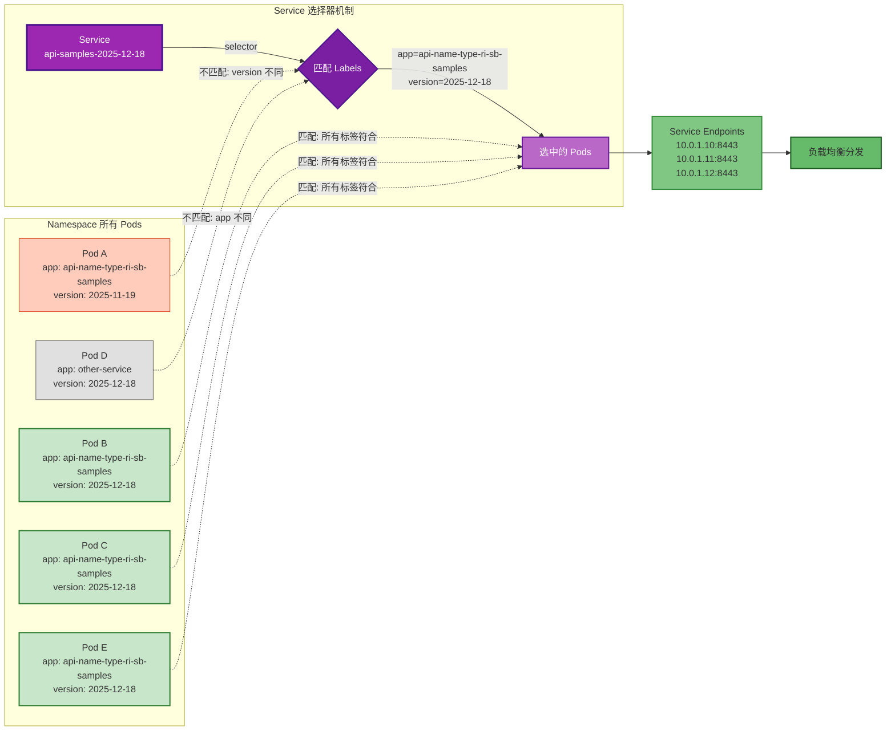
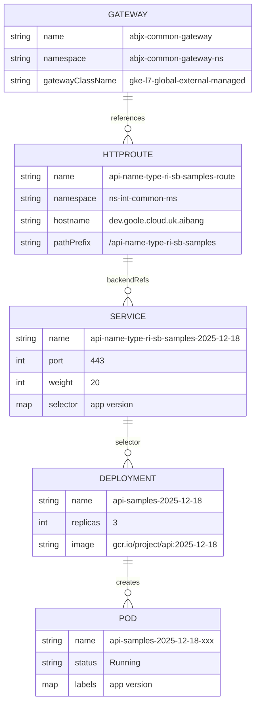
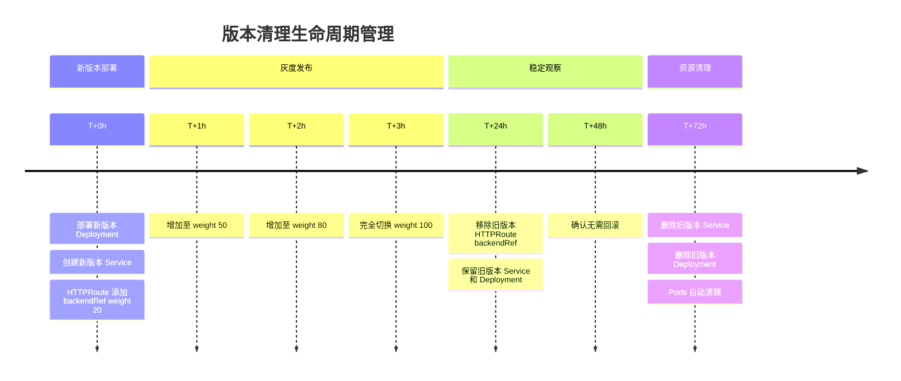

# GKE Gateway API 版本管理完整流程可视化

## 整体架构图

---

## 流量分配机制详解

---

## 完整灰度发布生命周期
---

## HTTPRoute 配置演进时间线

```mermaid
gantt
    title API 版本灰度发布时间线
    dateFormat HH:mm
    axisFormat %H:%M
    
    section 部署阶段
    部署新版本 Deployment        :done, deploy, 00:00, 10m
    创建新版本 Service           :done, svc, 00:10, 5m
    验证 Pod 健康状态            :done, health, 00:15, 5m
    
    section 灰度发布
    配置 20% 流量到新版本        :active, canary20, 00:20, 30m
    监控错误率和延迟             :active, monitor20, 00:20, 30m
    
    section 流量增加
    增加至 50% 流量              :canary50, 00:50, 30m
    持续监控性能指标             :monitor50, 00:50, 30m
    
    section 进一步验证
    增加至 80% 流量              :canary80, 01:20, 30m
    全面性能测试                 :monitor80, 01:20, 30m
    
    section 完全切换
    100% 流量切换到新版本        :switch100, 01:50, 15m
    最终验证                     :final, 02:05, 25m
    
    section 清理阶段
    移除旧版本 backendRef        :cleanup1, 02:30, 5m
    删除旧版本 Service           :cleanup2, 02:35, 5m
    删除旧版本 Deployment        :cleanup3, 02:40, 10m
```

---

## 请求路由决策树

---

## 版本切换操作流程图

---

## 多版本并存架构图

---

## 监控与回滚决策流程

---

## Service Selector 工作原理

---

## 完整配置对象关系图

---

## 资源清理时间线

---

这些图表涵盖了从架构概览、流量分配、版本切换、监控回滚到资源清理的完整流程。每个图表都可以独立使用，也可以组合展示给团队成员理解整个灰度发布系统。