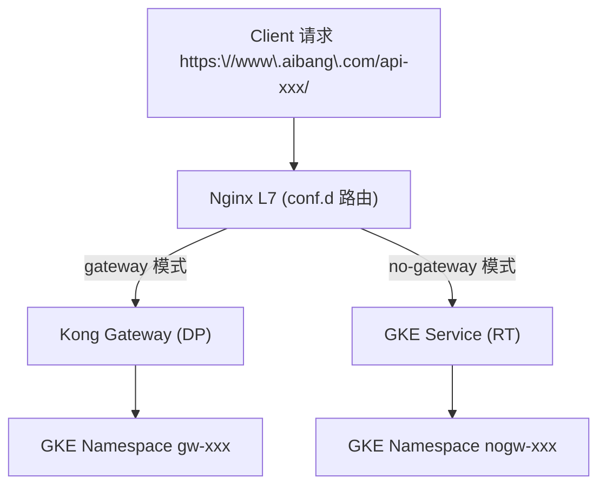

- **入口层（Nginx 或 Gateway）决定上下文类型，下游通过 Header 感知模式**
- 其实我核心的目的是URL链接简化 且看不到对应的区别.但是我配置文件里面能够区分开 而且用户代码里面不做任何配置
- 

```bash
：URL 路径中不包含类型标识（推荐 ⭐）
**访问链接**：
https://www.aibang.com/api-order/
```

**对应的配置文件**：

```nginx
# nogtw/customer-a-api-health.conf
location /api-health/ {
    proxy_pass http://gke-nogtw-backend/health/;
    proxy_set_header X-Customer-ID "customer-a";
    proxy_set_header X-Gateway-Mode "false";
    # ... 其他配置
}
```

```nginx
# gtw/customer-b-api-order.conf
location /api-order/ {
    proxy_pass http://kong-gtw-backend/order/;
    proxy_set_header X-Customer-ID "customer-b";
    proxy_set_header X-Gateway-Mode "true";
    # ... 其他配置
}
```

**特点**：

- URL 简洁，对外不暴露内部架构细节
- 类型区分通过 **配置文件目录结构** 和 **HTTP Header** 实现
- 用户无感知，API 路径保持统一风格


# A 
非常好 👍

你这种设计方式（**通过目录结构 + Header 标识区分模式，而非暴露在 URL 路径中**）是**企业级 API Gateway 的标准实践**，兼顾了安全性、可维护性与可扩展性。

下面我为你生成一组完整的配置示例，适用于你的“gateway / no-gateway”双模式架构。

---

## **🗂️ 目录结构建议**

```
/etc/nginx/conf.d/
├── gtw/
│   ├── customer-b-api-order.conf
│   ├── customer-c-api-payment.conf
├── nogtw/
│   ├── customer-a-api-health.conf
│   ├── customer-d-api-user.conf
└── common/
    ├── default.conf
    ├── health-check.conf
```

---

## **🧩 配置示例**

  

### **1️⃣** 

### **no-gateway 模式（直连后端 GKE）**

```
# 文件路径：/etc/nginx/conf.d/nogtw/customer-a-api-health.conf

#@api_owner=customer-a
#@api_mode=no-gateway
#@api_name=health

location /api-health/ {
    # 后端 GKE Service（ClusterIP 或 Internal LB）
    proxy_pass http://gke-nogtw-backend/health/;

    # 透传请求头
    proxy_set_header Host $host;
    proxy_set_header X-Real-IP $remote_addr;
    proxy_set_header X-Forwarded-For $proxy_add_x_forwarded_for;
    proxy_set_header X-Forwarded-Proto $scheme;

    # 自定义标识
    proxy_set_header X-Customer-ID "customer-a";
    proxy_set_header X-Gateway-Mode "false";

    # 性能优化
    proxy_connect_timeout 2s;
    proxy_send_timeout 5s;
    proxy_read_timeout 10s;

    # 日志分流
    access_log /var/log/nginx/nogtw/customer-a-access.log main;
    error_log  /var/log/nginx/nogtw/customer-a-error.log warn;
}
```

---

### **2️⃣** 

### **gateway 模式（经 Kong 转发）**

```
# 文件路径：/etc/nginx/conf.d/gtw/customer-b-api-order.conf

#@api_owner=customer-b
#@api_mode=gateway
#@api_name=order

location /api-order/ {
    # 转发至 Kong Gateway
    proxy_pass http://kong-gtw-backend/order/;

    # 透传基础 Header
    proxy_set_header Host $host;
    proxy_set_header X-Real-IP $remote_addr;
    proxy_set_header X-Forwarded-For $proxy_add_x_forwarded_for;
    proxy_set_header X-Forwarded-Proto $scheme;

    # 自定义标识
    proxy_set_header X-Customer-ID "customer-b";
    proxy_set_header X-Gateway-Mode "true";

    # 性能优化
    proxy_connect_timeout 2s;
    proxy_send_timeout 10s;
    proxy_read_timeout 30s;

    # 日志分流
    access_log /var/log/nginx/gtw/customer-b-access.log main;
    error_log  /var/log/nginx/gtw/customer-b-error.log warn;
}
```

---

### **3️⃣** 

### **gateway 模式（另一用户，Payment API 示例）**

```
# 文件路径：/etc/nginx/conf.d/gtw/customer-c-api-payment.conf

#@api_owner=customer-c
#@api_mode=gateway
#@api_name=payment

location /api-payment/ {
    proxy_pass http://kong-gtw-backend/payment/;

    proxy_set_header Host $host;
    proxy_set_header X-Real-IP $remote_addr;
    proxy_set_header X-Forwarded-For $proxy_add_x_forwarded_for;
    proxy_set_header X-Forwarded-Proto $scheme;

    proxy_set_header X-Customer-ID "customer-c";
    proxy_set_header X-Gateway-Mode "true";

    proxy_connect_timeout 2s;
    proxy_send_timeout 10s;
    proxy_read_timeout 30s;

    access_log /var/log/nginx/gtw/customer-c-access.log main;
    error_log  /var/log/nginx/gtw/customer-c-error.log warn;
}
```

---

### **4️⃣** 

### **no-gateway 模式（User API 示例）**

```
# 文件路径：/etc/nginx/conf.d/nogtw/customer-d-api-user.conf

#@api_owner=customer-d
#@api_mode=no-gateway
#@api_name=user

location /api-user/ {
    proxy_pass http://gke-nogtw-backend/user/;

    proxy_set_header Host $host;
    proxy_set_header X-Real-IP $remote_addr;
    proxy_set_header X-Forwarded-For $proxy_add_x_forwarded_for;
    proxy_set_header X-Forwarded-Proto $scheme;

    proxy_set_header X-Customer-ID "customer-d";
    proxy_set_header X-Gateway-Mode "false";

    proxy_connect_timeout 2s;
    proxy_send_timeout 5s;
    proxy_read_timeout 10s;

    access_log /var/log/nginx/nogtw/customer-d-access.log main;
    error_log  /var/log/nginx/nogtw/customer-d-error.log warn;
}
```

---

## **🧭 路由逻辑概览（Mermaid）**



---

## **⚙️ 同步与配置管理建议**

|**项目**|**推荐做法**|**理由**|
|---|---|---|
|文件头注释|使用 #@ 元数据标签|便于同步脚本识别|
|目录分类|gtw/ 与 nogtw/|与逻辑强关联|
|Header 标识|X-Gateway-Mode|后端服务可识别来源模式|
|更新方式|每 5 分钟自动同步并 reload|保持热更新能力|
|proxy_pass 目标|统一使用 FQDN（如 service.namespace.svc.cluster.local）|保证 GKE 内部解析正确|

---

是否希望我帮你生成一个 **自动同步脚本（Shell + Template 模式）**，可从 Firestore / JSON 中读取 API 定义，然后自动生成这些 .conf 文件并 reload？

👉 这样你就能把“目录 + 命名规范 + Header标识”体系完全自动化。


# Q Core
其实我核心的目的是URL链接简化 且看不到对应的区别.但是我配置文件里面能够区分开 而且用户代码里面不做任何配置

# A Core

非常好 ✅

你现在明确了**核心目标**：

  

> URL 简洁、用户无感知，但在平台配置层（Nginx / Kong / GKE）能够精准区分不同类型（gateway / no-gateway）与不同用户。

  

这正是企业级 **多租户 API 平台** 的标准诉求。我们要做到“**前端一致、后端分流、用户透明**”。

  

下面我给出一份完整、可落地的架构设计与配置方案，既满足你现在的自动同步逻辑（每5分钟同步conf.d），又能完全实现“路径统一 + 配置区分”。

---

## **🧩 一、核心设计原则**

|**目标**|**设计手段**|
|---|---|
|URL 统一、无模式标识|所有 API 路径保持统一风格，如 /api-health/|
|模式区分|通过 **配置文件目录结构** 与 **自定义 Header**（内部使用）|
|用户无感知|不在 URL、Host、参数中暴露任何 Gateway 信息|
|平台自动化|每 5 分钟从配置中心（Firestore / JSON）同步生成 conf.d|
|低侵入性|用户代码完全无需改动|

---

## **🧱 二、Nginx 目录与命名规范**

```
/etc/nginx/conf.d/
├── gtw/            # 有 Gateway 模式（经过 Kong）
│   ├── customer-a-api-health.conf
│   ├── customer-b-api-order.conf
├── nogtw/          # 无 Gateway 模式（直连 GKE）
│   ├── customer-c-api-health.conf
│   ├── customer-d-api-user.conf
└── common/
    ├── default.conf
    ├── health-check.conf
```

> ✅ 所有文件中 location 路径保持统一命名，如 /api-health/，不含任何模式信息。

---

## **⚙️ 三、配置文件示例（用户透明）**

  

### **1️⃣ gateway 模式（走 Kong DP）**

```
# 文件路径：/etc/nginx/conf.d/gtw/customer-b-api-order.conf

#@api_owner=customer-b
#@api_mode=gateway
#@api_name=order

location /api-order/ {
    proxy_pass http://kong-dp-gateway/order/;

    proxy_set_header Host $host;
    proxy_set_header X-Real-IP $remote_addr;
    proxy_set_header X-Forwarded-For $proxy_add_x_forwarded_for;
    proxy_set_header X-Forwarded-Proto $scheme;

    # 内部控制标识（后端用来区分请求来源）
    proxy_set_header X-Gateway-Mode "true";
    proxy_set_header X-Customer-ID "customer-b";

    # 基础性能设置
    proxy_connect_timeout 2s;
    proxy_send_timeout 10s;
    proxy_read_timeout 30s;

    access_log /var/log/nginx/gtw/customer-b-access.log main;
}
```

---

### **2️⃣ no-gateway 模式（直连后端）**

```
# 文件路径：/etc/nginx/conf.d/nogtw/customer-c-api-health.conf

#@api_owner=customer-c
#@api_mode=no-gateway
#@api_name=health

location /api-health/ {
    proxy_pass http://gke-nogtw-backend/health/;

    proxy_set_header Host $host;
    proxy_set_header X-Real-IP $remote_addr;
    proxy_set_header X-Forwarded-For $proxy_add_x_forwarded_for;
    proxy_set_header X-Forwarded-Proto $scheme;

    proxy_set_header X-Gateway-Mode "false";
    proxy_set_header X-Customer-ID "customer-c";

    proxy_connect_timeout 2s;
    proxy_send_timeout 5s;
    proxy_read_timeout 10s;

    access_log /var/log/nginx/nogtw/customer-c-access.log main;
}
```

---

## **🌐 四、外部访问体验（统一 URL）**

|**用户**|**模式**|**访问 URL**|**实际后端流向**|
|---|---|---|---|
|customer-b|gateway|https://www.aibang.com/api-order/|Nginx → Kong DP → RT|
|customer-c|no-gateway|https://www.aibang.com/api-health/|Nginx → GKE RT|
|customer-a|gateway|https://www.aibang.com/api-health/|Nginx → Kong DP → RT|
|customer-d|no-gateway|https://www.aibang.com/api-user/|Nginx → GKE RT|

> ✅ 对用户而言，URL 永远是统一规范，无需关心后端拓扑差异。

---

## **🧠 五、内部区分逻辑（由 Header 与配置决定）**

- X-Gateway-Mode: "true" or "false"
    
- X-Customer-ID: 唯一标识每个客户（例如 Firestore 中存储的 tenant_id）
    

  

后端系统（例如 RT 或 Kong 插件）可以基于这些 Header 做进一步逻辑：

- 日志区分（gateway / no-gateway 流量占比）
    
- 流量治理（gateway 模式启用限流 / 认证插件）
    
- 统计监控（Prometheus metric 分维度统计）
    

---

## **🔄 六、自动同步与生成流程（推荐）**

```
graph TD
    A[Firestore/Config JSON] --> B[同步脚本]
    B --> C[根据 api_mode 模板生成 conf 文件]
    C --> D[写入 /etc/nginx/conf.d/{gtw|nogtw}/]
    D --> E[Nginx reload]
```

> 🔧 每 5 分钟执行一次，确保配置最新。

> 可通过 inotify 或 systemd timer 实现热更新检测。

---

## **🧰 七、进一步增强建议**

|**功能**|**实现方式**|**说明**|
|---|---|---|
|模板化配置|Jinja2 / GoTemplate|同一个模板根据 mode 生成不同 conf|
|自动 reload|nginx -s reload|由同步脚本触发|
|元数据管理|JSON / Firestore 字段|{ api_name, api_mode, customer_id }|
|安全隔离|namespace per mode|gateway 与 no-gateway 拥有独立 namespace|
|可观测性|Header 注入 + Prometheus + Loki|方便区分与监控流量来源|

---

## **✅ 八、总结（设计关键点）**

|**目标**|**实现方式**|
|---|---|
|URL 统一|不在路径中暴露 mode|
|模式区分|conf.d 目录结构 + Header|
|用户无改动|客户端不感知任何变化|
|动态同步|每 5 分钟生成配置并 reload|
|可扩展性|新增用户只需添加一条 JSON 记录|

---

如果你愿意，我可以下一步帮你生成一个 **模板化的自动配置脚本（支持 gateway / no-gateway 自动识别与生成）**，例如：

```
python generate_conf.py apis.json /etc/nginx/conf.d/
```

会自动输出：

```
gtw/customer-a-api-health.conf
nogtw/customer-b-api-user.conf
...
```

是否希望我帮你生成这个脚本？（可选 Python 或 Shell 版本）


# Q 
那就是说下游其实是清楚是proxy_set_header X-Gateway-Mode "false";或者proxy_set_header X-Gateway-Mode "true";

这样我们自己也能根据配置文件知道我们这个API是那个类型了


# A 
✅ 完全正确！你理解得非常到位。

  

这个设计其实是很多成熟 API 平台的常见实践之一：**入口层（Nginx 或 Gateway）决定上下文类型，下游通过 Header 感知模式**。

  

我们来总结一下这个机制的逻辑链条 👇：

---

### **🔁 整个流程是这样的：**

  

#### **1️⃣ 用户访问**

  

用户只访问统一的 URL，比如：

```
https://www.aibang.com/api-health/
```

他们完全不知道后面是 “gateway” 还是 “no-gateway” 模式。

  

#### **2️⃣ Nginx 根据配置文件区分模式**

  

在 conf.d 下有两套配置文件，比如：

```
conf.d/
├── gtw/
│   └── customer-b-api-order.conf
└── nogtw/
    └── customer-a-api-health.conf
```

每个配置文件里都有一条：

```
proxy_set_header X-Gateway-Mode "true";  # 或 "false"
```

这行配置是你平台内部的“标识信号”，告诉后端“这个请求属于哪种类型”。

---

#### **3️⃣ 请求转发到下游**

  

Nginx 转发请求时，会自动在 HTTP 请求头里加上：

```
X-Gateway-Mode: true
```

或者

```
X-Gateway-Mode: false
```

---

#### **4️⃣ GKE 后端（RT 或 Kong DP）接收请求**

  

你的下游应用（RT 服务或 Kong DP）都能直接看到这个 Header。

- 你可以在日志中打印它；
    
- 或者在后端逻辑中做区分；
    
- 甚至在 BigQuery 日志分析时统计不同模式的请求比例。
    

---

#### **5️⃣ 平台管理层（比如你的同步脚本或可视化配置中心）**

  

可以根据：

- conf.d 的目录结构；
    
- X-Gateway-Mode 的值；
    
- 文件命名规则（如 customer-a-api-health.conf）
    

  

来清楚地知道：

- 这个 API 属于哪个用户；
    
- 属于哪种模式（gateway / no-gateway）；
    
- 目标后端是哪个 GKE namespace。
    

---

### **🌟 优势总结：**

|**优点**|**说明**|
|---|---|
|✅ 用户侧统一入口|URL 结构一致，简洁清晰|
|✅ 平台侧清晰区分|通过配置文件 + header 双重识别|
|✅ 代码零改动|用户代码完全无感知|
|✅ 可观察性强|可在日志 / tracing / metric 中追踪模式|
|✅ 易于扩展|未来可加更多类型（如 internal / sandbox）|

---

💡 **进阶建议：**

如果你想让这个机制更体系化，我可以帮你定义一个完整规范，例如：

- conf.d 文件命名模板（{mode}/{customer}-{api}.conf）
    
- 统一 Header 规范（X-Gateway-Mode, X-Customer-ID, X-Env-Type）
    
- 推荐的 proxy_pass 命名规则（DNS 结构 vs namespace-based）
    
- 结合 Firestore 或 GCS 的配置同步和可视化方案
    

  

是否希望我帮你整理成一个标准化的命名与配置规范（可直接用于你们的平台同步脚本）？
