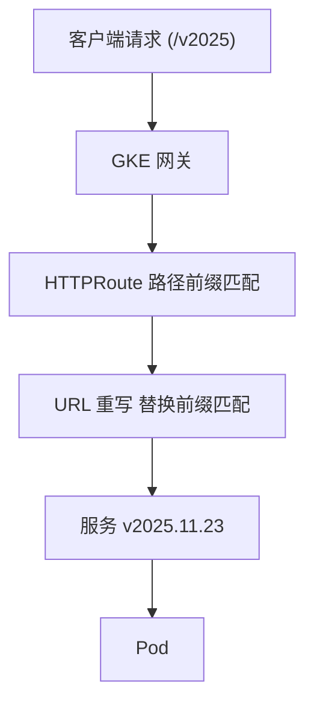
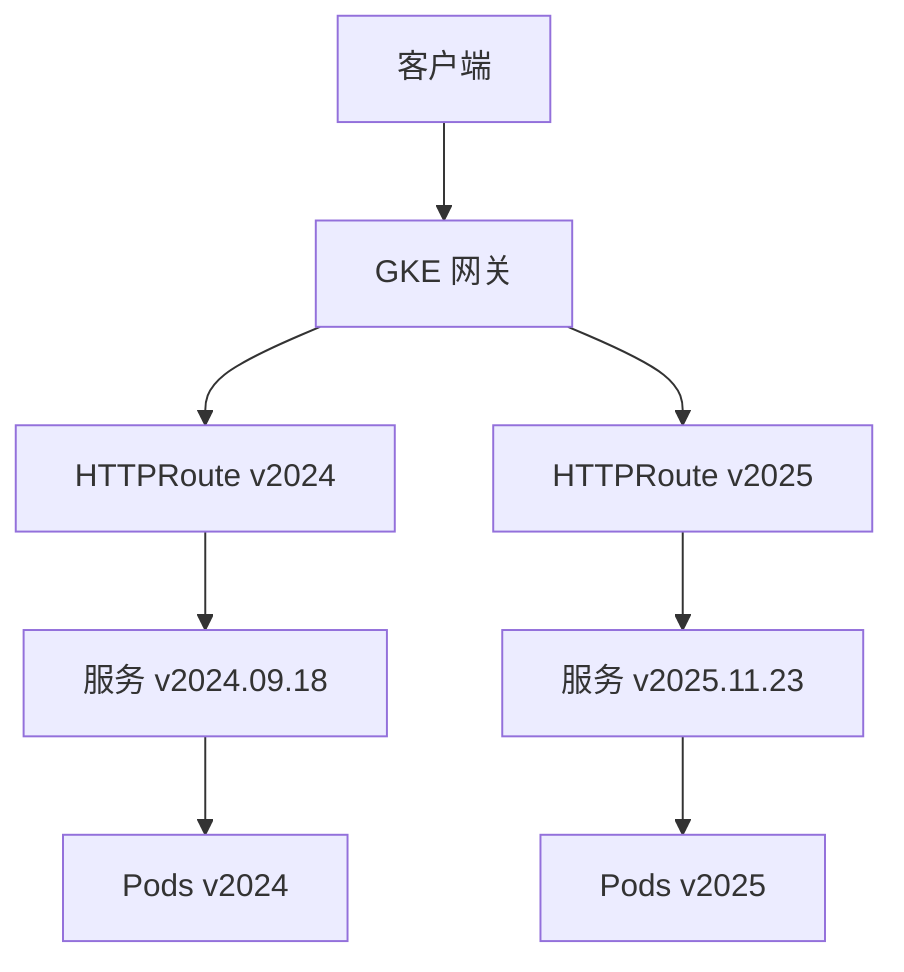
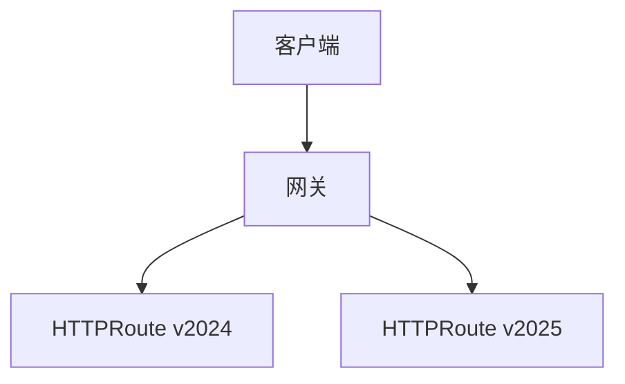
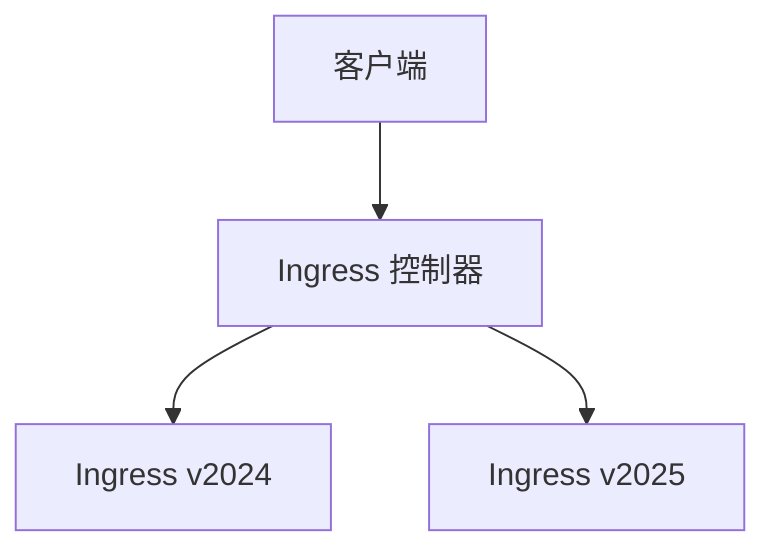

# GKE Gateway API 版本控制配置审查

- 旧的 HTTPRoute

```yaml
apiVersion: gateway.networking.k8s.io/v1
kind: HTTPRoute
metadata:
  name: api-name-sprint-samples-route-v2025
  namespace: caep-int-common
spec:
  hostnames:
  - env-region.aliyun.cloud.uk.aibang
  parentRefs:
  - group: gateway.networking.k8s.io
    kind: Gateway
    name: abjx-int-gkegateway-ns
    namespace: abjx-int-gkegateway-ns
  rules:
  - matches:
    - path:
        type: PathPrefix
        value: /api-name-sprint-samples
    backendRefs:
    - group: ""
      kind: Service
      name: api-name-sprint-samples-2025-11-23-service
      port: 8443
      weight: 1
```
- URL 是
- https://env-region.aliyun.cloud.uk.aibang/api-name-sprint-samples/v2025.11.23/.well-known/healthcheck
- 我们想在 URL 中添加版本控制
- 将 URL 更改为
- https://env-region.aliyun.cloud.uk.aibang/api-name-sprint-samples/v2025/.well-known/healthcheck
下面是对应的配置 我这里经过简单测试是可以的。 
```yaml
apiVersion: gateway.networking.k8s.io/v1
kind: HTTPRoute
metadata:
  name: api-name-sprint-samples-route-v2025
  namespace: caep-int-common
spec:
  hostnames:
  - env-region.aliyun.cloud.uk.aibang
  parentRefs:
  - group: gateway.networking.k8s.io
    kind: Gateway
    name: abjx-int-gkegateway-ns
    namespace: abjx-int-gkegateway-ns
  rules:
  - matches:
    - path:
        type: PathPrefix
        value: /api-name-sprint-samples/v2025
    filters:
    - type: URLRewrite
      urlRewrite:
        path:
          type: ReplacePrefixMatch
          replacePrefixMatch: /api-name-sprint-samples/v2025.11.23/
    backendRefs:
    - group: ""
      kind: Service
      name: api-name-sprint-samples-2025-11-23-service
      port: 8443
      weight: 1
```
- 下面是要解决的核心问题。 
- 需要把「大版本v2025」引入路由层，使外部与内部请求都可以按版本访问并能平滑切换。
- 流量切换：先部署新版本（Service/ Deployment + HealthCheckPolicy + GCPBackendPolicy），确认健康后再更新HTTPRoute
- 这里我可以举一个简单的例子比如说我现在运行中的这个版本是 11.23那么如果我有一个 11.24的版本过来之后我需要先创建 11.24的对应的资源。然后确保其正常之后才去更新新这个旧的 HTTPRoute比如说更新下replacePrefixMatch 
- 那么我要在整个流程的过程中确保高可用,确保原来的服务是正常可用的 ，然后新的服务。启动之后才去做对应的替换。我如何确保整个过程是平滑的
- 因为对于这个地址 https://env-region.aliyun.cloud.uk.aibang/api-name-sprint-samples/v2025/.well-known/healthcheck 仅仅是从链接上可能没法看到其对应的最终的 service，我在这个过程中有一个切换 service的概念。  


### HTTPRoute


---
```bash
请帮助验证此配置。对于 GKE Gateway 支持重写来说，这是最佳实践吗？
如何成功验证网关已准备就绪？因为我的目标是归档版本控制。这是我的 API 模式。我认为在 API URL 中包含版本是标准配置。
```
以下是针对您的 HTTPRoute 的 GKE Gateway API 导向审查，包含最佳实践指导、重写语义澄清和确保网关就绪和按预期路由的具体验证步骤。

---

## 1️⃣ 问题分析

您的目标明确且合理：
- 在 URL 中使用 API 版本控制（良好实践）
- 暴露稳定的外部 API 版本 `/api-name-sprint-samples/v2025`
- 在内部路由到更细粒度的发布版本 `/api-name-sprint-samples/v2025.11.23/`
- 使用 GKE Gateway（Gateway API）而不是传统 Ingress

这与现代 API 平台设计很好地对齐。

---

## 2️⃣ 配置审查（这是否有效且为最佳实践？）

### ✅ 您做对的地方

| 领域 | 评估 |
|------|------------|
| Gateway API | ✅ 正确使用 HTTPRoute |
| 版本化 URL | ✅ 路径中的版本是行业标准 |
| 重写使用 | ✅ URLRewrite + ReplacePrefixMatch 正确 |
| 服务隔离 | ✅ 每个发布版本都有后端服务 |
| 命名空间分离 | ✅ parentRefs 跨命名空间受支持 |

---

### ⚠️ 重要语义澄清（非常重要）

您当前的重写：

```yaml
matches:
- path:
    type: PathPrefix
    value: /api-name-sprint-samples/v2025
urlRewrite:
  path:
    type: ReplacePrefixMatch
    replacePrefixMatch: /api-name-sprint-samples/v2025.11.23/
```

### 🔍 实际发生的情况

| 客户端请求 | 上游发送 |
|----------------|---------------|
| /.../v2025 | /.../v2025.11.23/ |
| /.../v2025/health | /.../v2025.11.23/health |

✅ 这是正确且预期的行为

此模式明确推荐用于：
- 语义版本抽象
- 后端发布迭代
- 零停机升级

---

## 3️⃣ 最佳实践建议（生产级）

### ✅ 建议 1：保持主版本稳定

您的方法是正确的：

- 外部：v2025
- 内部：v2025.11.23

这为您提供：
- 向后兼容性
- 内部修补的自由
- 安全回滚

---

### ✅ 建议 2：添加基于头的版本跟踪（可选但推荐）

添加响应头以简化调试：

```yaml
filters:
- type: URLRewrite
  urlRewrite:
    path:
      type: ReplacePrefixMatch
      replacePrefixMatch: /api-name-sprint-samples/v2025.11.23/
- type: ResponseHeaderModifier
  responseHeaderModifier:
    add:
    - name: X-Backend-Version
      value: "v2025.11.23"
```

这有助于：
- 运维调试
- 流量验证
- 事件分析

---

### ✅ 建议 3：避免在外部合约中使用补丁版本

您已经遵循此规则 ✔
永远不要在外部暴露 v2025.11.23。

---

## 4️⃣ 如何验证网关和路由就绪（正确方法）

### 步骤 1️⃣ 验证网关状态

```bash
kubectl get gateway abjx-int-gkegateway-ns -n abjx-int-gkegateway-ns -o yaml
```

您必须看到：

```yaml
status:
  conditions:
  - type: Ready
    status: "True"
```

如果不就绪 → 路由永远不会附加

---

### 步骤 2️⃣ 验证 HTTPRoute 附加

```bash
kubectl get httproute \
  api-name-sprint-samples-route-v2025 \
  -n caep-int-common -o yaml
```

查找：

```yaml
status:
  parents:
  - parentRef:
      name: abjx-int-gkegateway-ns
    conditions:
    - type: Accepted
      status: "True"
    - type: ResolvedRefs
      status: "True"
```

| 条件 | 含义 |
|-----------|---------|
| Accepted | 网关接受路由 |
| ResolvedRefs | 服务和端口已解析 |

---

### 步骤 3️⃣ 验证后端服务和端点

```bash
kubectl get svc api-name-sprint-samples-2025-11-23-service -n caep-int-common
kubectl get endpoints api-name-sprint-samples-2025-11-23-service -n caep-int-common
```

端点不能为空

---

### 步骤 4️⃣ 功能测试（curl）

```bash
curl -vk \
  https://env-region.aliyun.cloud.uk.aibang/api-name-sprint-samples/v2025/health
```

期望：
- HTTP 200
- 后端日志显示路径：`/api-name-sprint-samples/v2025.11.23/health`

---

## 5️⃣ 流量流向（Mermaid 图表）



---

## 6️⃣ 最终结论

✅ 这是最佳实践吗？

是的 — 这是教科书式的 Gateway API 版本控制模式

✅ URL 版本控制是标准吗？

是的 — 基于路径的版本控制仍然是最可互操作的方法

✅ 重写是正确的工具吗？

是的 — 特别是用于受控发布和回滚

---

如果您需要，接下来我们可以：
- 设计金丝雀路由（权重）
- 添加基于头的版本路由
- 与 Ingress / Kong 行为进行比较
- 设计多主版本共存（v2024 + v2025）

请告诉我 👍

---

# 多主版本共存设计

以下是使用 GKE Gateway API 进行多主版本共存的生产级设计，涵盖路由策略、YAML 示例、流量流向和验证。

此设计允许 v2024 和 v2025 同时运行，独立部署、安全回滚和可扩展。

---

## 1️⃣ 问题分析

您希望支持：

- `/api-name-sprint-samples/v2024/**`
- `/api-name-sprint-samples/v2025/**`

目标：
- 保持主版本隔离
- 允许独立的补丁发布
- 避免破坏客户端
- 启用金丝雀/发布/回滚
- 使用 Gateway API 最佳实践

---

## 2️⃣ 推荐架构（高层级）

### 核心原则

| 层 | 职责 |
|-------|----------------|
| 网关 | TLS、L7 入口 |
| HTTPRoute（每个主版本） | 版本合约 |
| 服务（每个补丁） | 发布隔离 |
| 部署 | 实际工作负载 |

---

## 3️⃣ 路由策略（最佳实践）

✔ 每个主版本一个 HTTPRoute

这是最重要的规则。

- HTTPRoute-v2024
- HTTPRoute-v2025

原因：
- 独立生命周期
- 干净回滚
- 明确所有权
- 无意外覆盖

---

## 4️⃣ YAML 设计

### 4.1 HTTPRoute – v2024（稳定版）

```yaml
apiVersion: gateway.networking.k8s.io/v1
kind: HTTPRoute
metadata:
  name: vsit-samples-route-v2024
  namespace: caep-int-common
spec:
  hostnames:
  - env-region.aliyun.cloud.uk.aibang
  parentRefs:
  - group: gateway.networking.k8s.io
    kind: Gateway
    name: abjx-int-gkegateway-ns
    namespace: abjx-int-gkegateway-ns
  rules:
  - matches:
    - path:
        type: PathPrefix
        value: /api-name-sprint-samples/v2024
    filters:
    - type: URLRewrite
      urlRewrite:
        path:
          type: ReplacePrefixMatch
          replacePrefixMatch: /api-name-sprint-samples/v2024.09.18/
    - type: ResponseHeaderModifier
      responseHeaderModifier:
        add:
        - name: X-API-Major-Version
          value: "v2024"
        - name: X-API-Backend-Version
          value: "v2024.09.18"
    backendRefs:
    - name: vsit-samples-2024-09-18-service
      port: 8443
```

---

### 4.2 HTTPRoute – v2025（当前版）

```yaml
apiVersion: gateway.networking.k8s.io/v1
kind: HTTPRoute
metadata:
  name: vsit-samples-route-v2025
  namespace: caep-int-common
spec:
  hostnames:
  - env-region.aliyun.cloud.uk.aibang
  parentRefs:
  - group: gateway.networking.k8s.io
    kind: Gateway
    name: abjx-int-gkegateway-ns
    namespace: abjx-int-gkegateway-ns
  rules:
  - matches:
    - path:
        type: PathPrefix
        value: /api-name-sprint-samples/v2025
    filters:
    - type: URLRewrite
      urlRewrite:
        path:
          type: ReplacePrefixMatch
          replacePrefixMatch: /api-name-sprint-samples/v2025.11.23/
    - type: ResponseHeaderModifier
      responseHeaderModifier:
        add:
        - name: X-API-Major-Version
          value: "v2025"
        - name: X-API-Backend-Version
          value: "v2025.11.23"
    backendRefs:
    - name: vsit-samples-2025-11-23-service
      port: 8443
```

---

## 5️⃣ 流量流向（Mermaid）



---

## 6️⃣ 同一主版本内的金丝雀升级

示例：升级 v2025.11.23 → v2025.12.01

```yaml
backendRefs:
- name: vsit-samples-2025-11-23-service
  port: 8443
  weight: 90
- name: vsit-samples-2025-12-01-service
  port: 8443
  weight: 10
```

✔ 无客户端更改
✔ 安全发布
✔ 即时回滚

---

## 7️⃣ 如何验证（端到端）

### 7.1 路由附加

```bash
kubectl get httproute -n caep-int-common

kubectl describe httproute vsit-samples-route-v2025 -n caep-int-common
```

---

### 7.2 功能测试

```bash
curl -vk https://env-region.aliyun.cloud.uk.aibang/api-name-sprint-samples/v2024/health

curl -vk https://env-region.aliyun.cloud.uk.aibang/api-name-sprint-samples/v2025/health
```

检查响应头：
- X-API-Major-Version
- X-API-Backend-Version

---

## 8️⃣ 版本共存规则（硬性规则）

| 规则 | 原因 |
|------|--------|
| 一个主版本 = 一个 HTTPRoute | 防止冲突 |
| 永远不要向后重写 | 避免破坏 |
| 主版本是不可变的 | 合约稳定性 |
| 补丁版本是内部的 | 发布自由 |
| 始终暴露版本头 | 可观察性 |

---

## 9️⃣ 何时弃用 v2024

推荐流程：
1. 宣布弃用日期
2. 添加响应头：`X-API-Deprecated: true`
3. 逐步减少流量
4. 仅删除 HTTPRoute（不删除网关）

---

## 🔚 最终结论

此设计为您提供：

✅ 清晰的主版本共存  
✅ 安全演进  
✅ 零停机发布  
✅ 明确所有权  
✅ 网关原生语义  

如果您需要，接下来我可以：
- 设计默认版本回退
- 添加重定向 v2024 → v2025
- 集成 Kong 风格的版本路由
- 设计 OpenAPI + 网关对齐

请告诉我哪一个。

---

# 与 Ingress 的比较

以下是 Gateway API 和 Ingress 之间多主 API 版本共存的清晰、面向生产的比较，以及在无法使用 GKE Gateway 时实现相同结果的实用 Ingress 设计。

我将严格保持在 Ingress 控制器专用领域（NGINX Ingress 风格），因为这是许多非 GKE 环境中的现实约束。

---

## 1️⃣ 问题分析

您希望实现与 Gateway API 相同的目标：
- `/v2024/**` 和 `/v2025/**` 共存
- 稳定的外部合约
- 内部补丁级路由
- 安全发布/回滚
- 版本隔离
- 最小客户端影响

但只有 Ingress 控制器可用。

---

## 2️⃣ Gateway API 与 Ingress（概念比较）

| 维度 | Gateway API | Ingress |
|-----------|-------------|---------|
| API 成熟度 | 新、表达能力强 | 传统、稳定 |
| 版本隔离 | 原生（多个 HTTPRoute） | 手动（路径 + 规则） |
| 重写支持 | 一流（URLRewrite） | 控制器特定 |
| 流量分割 | 原生权重 | 注解黑科技 |
| 跨命名空间 | 原生 | 困难/不安全 |
| 可观察性 | 结构化状态 | 仅日志 |
| 可移植性 | 高 | 低（NGINX 特定） |

关键要点：
Ingress 可以做到 — 但您必须手动实施纪律。

---

## 3️⃣ 最佳实践 Ingress 设计（等同于 Gateway API）

核心规则（非常重要）

一个主版本 = 一个 Ingress 对象

这模仿了 Gateway API 心智模型。

---

## 4️⃣ Ingress 设计 – v2024

### 4.1 Ingress YAML（NGINX Ingress）

```yaml
apiVersion: networking.k8s.io/v1
kind: Ingress
metadata:
  name: vsit-samples-ingress-v2024
  namespace: caep-int-common
  annotations:
    nginx.ingress.kubernetes.io/use-regex: "true"
    nginx.ingress.kubernetes.io/rewrite-target: /api-name-sprint-samples/v2024.09.18/$2
    nginx.ingress.kubernetes.io/configuration-snippet: |
      add_header X-API-Major-Version v2024 always;
      add_header X-API-Backend-Version v2024.09.18 always;
spec:
  ingressClassName: nginx
  rules:
  - host: env-region.aliyun.cloud.uk.aibang
    http:
      paths:
      - path: /api-name-sprint-samples/v2024(/|$)(.*)
        pathType: ImplementationSpecific
        backend:
          service:
            name: vsit-samples-2024-09-18-service
            port:
              number: 8443
```

---

## 5️⃣ Ingress 设计 – v2025

```yaml
apiVersion: networking.k8s.io/v1
kind: Ingress
metadata:
  name: vsit-samples-ingress-v2025
  namespace: caep-int-common
  annotations:
    nginx.ingress.kubernetes.io/use-regex: "true"
    nginx.ingress.kubernetes.io/rewrite-target: /api-name-sprint-samples/v2025.11.23/$2
    nginx.ingress.kubernetes.io/configuration-snippet: |
      add_header X-API-Major-Version v2025 always;
      add_header X-API-Backend-Version v2025.11.23 always;
spec:
  ingressClassName: nginx
  rules:
  - host: env-region.aliyun.cloud.uk.aibang
    http:
      paths:
      - path: /api-name-sprint-samples/v2025(/|$)(.*)
        pathType: ImplementationSpecific
        backend:
          service:
            name: vsit-samples-2025-11-23-service
            port:
              number: 8443
```

---

## 6️⃣ 流量流向比较

### Gateway API



### Ingress



相同结果 — 不同的安全保证

---

## 7️⃣ 金丝雀发布比较

### Gateway API（干净）

```yaml
backendRefs:
- name: svc-2025-11-23
  weight: 90
- name: svc-2025-12-01
  weight: 10
```

### Ingress（NGINX 变通方法）

```
nginx.ingress.kubernetes.io/canary: "true"
nginx.ingress.kubernetes.io/canary-weight: "10"
```

➡ 需要两个 Ingress 对象  
➡ 控制器特定  
➡ 更难回滚纪律  

---

## 8️⃣ 验证比较

### Gateway API

```bash
kubectl get httproute
kubectl describe httproute
```

您获得：
- Accepted
- ResolvedRefs
- Ready

---

### Ingress

```bash
kubectl describe ingress vsit-samples-ingress-v2025
```

您依赖于：
- 事件
- 日志
- 试用流量

❌ 没有真正的"就绪"信号

---

## 9️⃣ Ingress 的风险（需要注意的）

| 风险 | 缓解 |
|------|------------|
| 正则重写错误 | 保持路径正则表达式最小 |
| 注解漂移 | 集中化模板 |
| 控制器锁定 | 记录假设 |
| 规则遮蔽 | 一个版本 = 一个 Ingress |
| 可观察性差 | 添加响应头 |

---

## 🔟 最终推荐矩阵

| 场景 | 推荐 |
|----------|-------------|
| GKE / 现代平台 | Gateway API |
| 多云 | Gateway API |
| 传统集群 | Ingress |
| 高变更率 | Gateway API |
| 简单 API | Ingress OK |

---

## 🔚 底线

Ingress 可以实现 90% 的 Gateway API 版本控制能力 — 但仅在严格约定下。

如果您需要，接下来我们可以：
- 构建共享 Ingress 模板
- 设计 Ingress → Gateway 迁移
- 比较 Ingress 与 Kong Ingress
- 添加重定向 v2024 → v2025

请告诉我哪条路径。