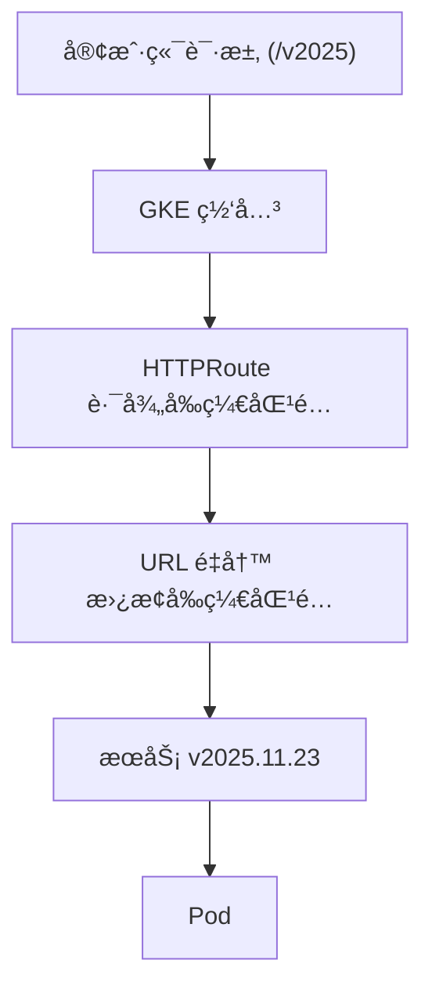
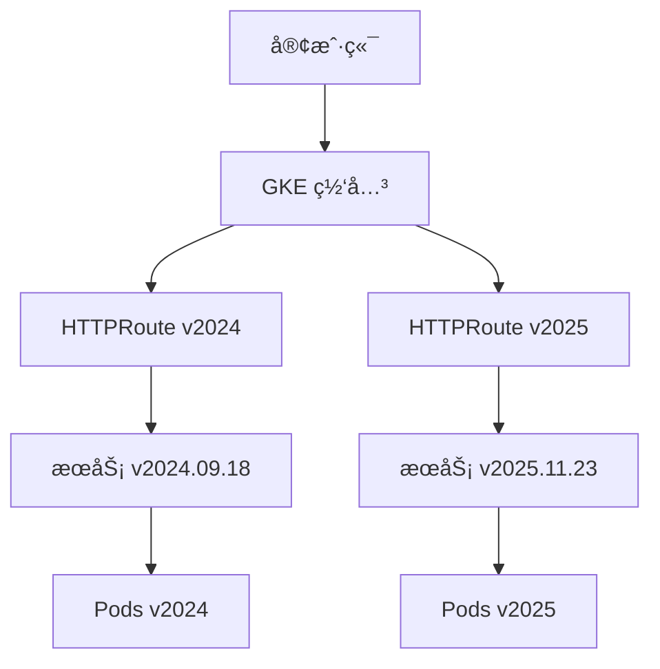
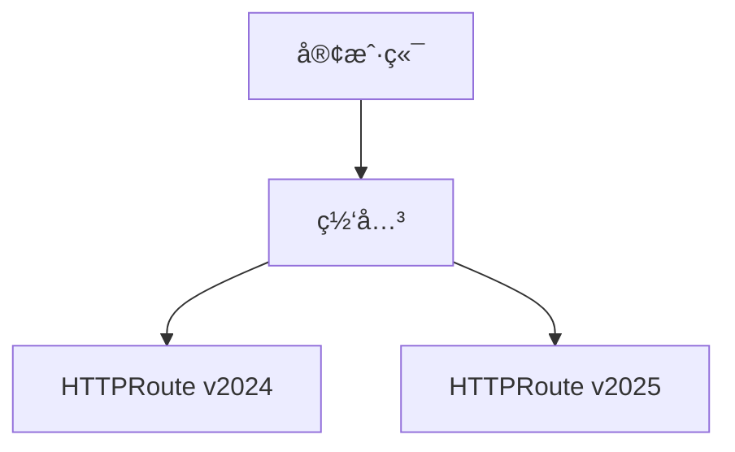
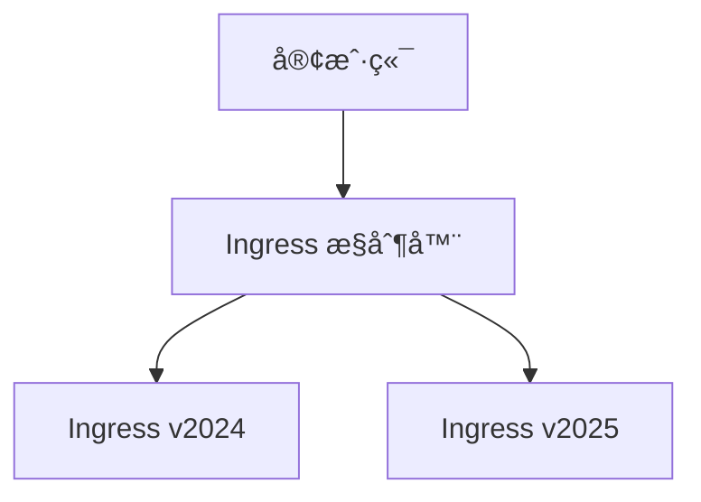

# GKE Gateway API 版本æ§åˆ¶é…置审查

- 旧的 HTTPRoute

```yaml
apiVersion: gateway.networking.k8s.io/v1
kind: HTTPRoute
metadata:
  name: api-name-sprint-samples-route-v2025
  namespace: caep-int-common
spec:
  hostnames:
  - env-region.aliyun.cloud.uk.aibang
  parentRefs:
  - group: gateway.networking.k8s.io
    kind: Gateway
    name: abjx-int-gkegateway-ns
    namespace: abjx-int-gkegateway-ns
  rules:
  - matches:
    - path:
        type: PathPrefix
        value: /api-name-sprint-samples
    backendRefs:
    - group: ""
      kind: Service
      name: api-name-sprint-samples-2025-11-23-service
      port: 8443
      weight: 1
```
- URL 是
- https://env-region.aliyun.cloud.uk.aibang/api-name-sprint-samples/v2025.11.23/.well-known/healthcheck
- 我们想在 URL 中添加版本æ§åˆ¶
- 将 URL 更改为
- https://env-region.aliyun.cloud.uk.aibang/api-name-sprint-samples/v2025/.well-known/healthcheck
下é¢æ˜¯å¯¹åº”çš„é…ç½® 我这里ç»è¿‡ç®€å•æµ‹è¯•æ˜¯å¯ä»¥çš„。 
```yaml
apiVersion: gateway.networking.k8s.io/v1
kind: HTTPRoute
metadata:
  name: api-name-sprint-samples-route-v2025
  namespace: caep-int-common
spec:
  hostnames:
  - env-region.aliyun.cloud.uk.aibang
  parentRefs:
  - group: gateway.networking.k8s.io
    kind: Gateway
    name: abjx-int-gkegateway-ns
    namespace: abjx-int-gkegateway-ns
  rules:
  - matches:
    - path:
        type: PathPrefix
        value: /api-name-sprint-samples/v2025
    filters:
    - type: URLRewrite
      urlRewrite:
        path:
          type: ReplacePrefixMatch
          replacePrefixMatch: /api-name-sprint-samples/v2025.11.23/
    backendRefs:
    - group: ""
      kind: Service
      name: api-name-sprint-samples-2025-11-23-service
      port: 8443
      weight: 1
```
- 下é¢æ˜¯è¦è§£å†³çš„核心问题。 
- 需è¦æŠŠã€Œå¤§ç‰ˆæœ¬v2025ã€å¼•å…¥è·¯ç”±å±‚，使外部ä¸å†…部请求都å¯ä»¥æŒ‰ç‰ˆæœ¬è®¿é—®å¹¶èƒ½å¹³æ»‘切æ¢ã€‚
- æµé‡åˆ‡æ¢ï¼šå…ˆéƒ¨ç½²æ–°ç‰ˆæœ¬ï¼ˆService/ Deployment + HealthCheckPolicy + GCPBackendPolicy），确认å¥åº·åå†æ›´æ–°HTTPRoute
- 这里我å¯ä»¥ä¸¾ä¸€ä¸ªç®€å•çš„例å­æ¯”如说我ç°åœ¨è¿è¡Œä¸­çš„这个版本是 11.23那么如æœæˆ‘有一个 11.24的版本过æ¥ä¹‹å我需è¦å…ˆåˆ›å»º 11.24的对应的资æºã€‚然åç¡®ä¿å…¶æ­£å¸¸ä¹‹åæ‰å»æ›´æ–°æ–°è¿™ä¸ªæ—§çš„ HTTPRoute比如说更新下replacePrefixMatch 
- 那么我è¦åœ¨æ•´ä¸ªæµç¨‹çš„过程中确ä¿é«˜å¯ç”¨,ç¡®ä¿åŸæ¥çš„æœåŠ¡æ˜¯æ­£å¸¸å¯ç”¨çš„ ，然åæ–°çš„æœåŠ¡ã€‚å¯åŠ¨ä¹‹åæ‰å»åšå¯¹åº”的替æ¢ã€‚我如何确ä¿æ•´ä¸ªè¿‡ç¨‹æ˜¯å¹³æ»‘çš„
- 因为对äºè¿™ä¸ªåœ°å€ https://env-region.aliyun.cloud.uk.aibang/api-name-sprint-samples/v2025/.well-known/healthcheck 仅仅是ä»é“¾æ¥ä¸Šå¯èƒ½æ²¡æ³•çœ‹åˆ°å…¶å¯¹åº”的最终的 serviceï¼Œæˆ‘åœ¨è¿™ä¸ªè¿‡ç¨‹ä¸­æœ‰ä¸€ä¸ªåˆ‡æ¢ service的概念。  


### HTTPRoute


---
```bash
请帮助验è¯æ­¤é…ç½®ã€‚å¯¹äº GKE Gateway 支æŒé‡å†™æ¥è¯´ï¼Œè¿™æ˜¯æœ€ä½³å®è·µå—？
如何æˆåŠŸéªŒè¯ç½‘关已准备就绪？因为我的目标是归档版本æ§åˆ¶ã€‚这是我的 API 模å¼ã€‚我认为在 API URL 中包å«ç‰ˆæœ¬æ˜¯æ ‡å‡†é…置。
```
以下是针对您的 HTTPRoute çš„ GKE Gateway API 导å‘审查，包å«æœ€ä½³å®è·µæŒ‡å¯¼ã€é‡å†™è¯­ä¹‰æ¾„清和确ä¿ç½‘关就绪和按预期路由的具体验è¯æ­¥éª¤ã€‚

---

## 1ï¸âƒ£ 问题分æ

您的目标æ˜ç¡®ä¸”åˆç†ï¼š
- 在 URL 中使用 API 版本æ§åˆ¶ï¼ˆè‰¯å¥½å®è·µï¼‰
- 暴露稳定的外部 API 版本 `/api-name-sprint-samples/v2025`
- 在内部路由到更细粒度的å‘布版本 `/api-name-sprint-samples/v2025.11.23/`
- 使用 GKE Gateway（Gateway API）而ä¸æ˜¯ä¼ ç»Ÿ Ingress

è¿™ä¸ç°ä»£ API å¹³å°è®¾è®¡å¾ˆå¥½åœ°å¯¹é½ã€‚

---

## 2ï¸âƒ£ é…置审查（这是å¦æœ‰æ•ˆä¸”为最佳å®è·µï¼Ÿï¼‰

### ✅ 您åšå¯¹çš„地方

| 领域 | 评估 |
|------|------------|
| Gateway API | ✅ 正确使用 HTTPRoute |
| 版本化 URL | ✅ 路径中的版本是行业标准 |
| é‡å†™ä½¿ç”¨ | ✅ URLRewrite + ReplacePrefixMatch 正确 |
| æœåŠ¡éš”离 | ✅ æ¯ä¸ªå‘布版本都有å端æœåŠ¡ |
| 命å空间分离 | ✅ parentRefs 跨命å空间å—æ”¯æŒ |

---

### âš ï¸ é‡è¦è¯­ä¹‰æ¾„清（é常é‡è¦ï¼‰

您当å‰çš„é‡å†™ï¼š

```yaml
matches:
- path:
    type: PathPrefix
    value: /api-name-sprint-samples/v2025
urlRewrite:
  path:
    type: ReplacePrefixMatch
    replacePrefixMatch: /api-name-sprint-samples/v2025.11.23/
```

### 🔠å®é™…å‘生的情况

| 客户端请求 | 上游å‘é€ |
|----------------|---------------|
| /.../v2025 | /.../v2025.11.23/ |
| /.../v2025/health | /.../v2025.11.23/health |

✅ 这是正确且预期的行为

此模å¼æ˜ç¡®æ¨è用äºï¼š
- 语义版本抽象
- å端å‘布迭代
- 零åœæœºå‡çº§

---

## 3ï¸âƒ£ 最佳å®è·µå»ºè®®ï¼ˆç”Ÿäº§çº§ï¼‰

### ✅ 建议 1：ä¿æŒä¸»ç‰ˆæœ¬ç¨³å®š

您的方法是正确的：

- 外部：v2025
- 内部：v2025.11.23

这为您æ供：
- å‘å兼容性
- 内部修补的自由
- 安全å›æ»š

---

### ✅ 建议 2：添加基äºå¤´çš„版本跟踪（å¯é€‰ä½†æ¨è）

添加å“应头以简化调试：

```yaml
filters:
- type: URLRewrite
  urlRewrite:
    path:
      type: ReplacePrefixMatch
      replacePrefixMatch: /api-name-sprint-samples/v2025.11.23/
- type: ResponseHeaderModifier
  responseHeaderModifier:
    add:
    - name: X-Backend-Version
      value: "v2025.11.23"
```

这有助äºï¼š
- è¿ç»´è°ƒè¯•
- æµé‡éªŒè¯
- 事件分æ

---

### ✅ 建议 3：é¿å…在外部åˆçº¦ä¸­ä½¿ç”¨è¡¥ä¸ç‰ˆæœ¬

您已ç»éµå¾ªæ­¤è§„则 ✔
永远ä¸è¦åœ¨å¤–部暴露 v2025.11.23。

---

## 4ï¸âƒ£ 如何验è¯ç½‘关和路由就绪（正确方法）

### 步骤 1ï¸âƒ£ 验è¯ç½‘关状æ€

```bash
kubectl get gateway abjx-int-gkegateway-ns -n abjx-int-gkegateway-ns -o yaml
```

您必须看到：

```yaml
status:
  conditions:
  - type: Ready
    status: "True"
```

如æœä¸å°±ç»ª → 路由永远ä¸ä¼šé™„加

---

### 步骤 2ï¸âƒ£ éªŒè¯ HTTPRoute 附加

```bash
kubectl get httproute \
  api-name-sprint-samples-route-v2025 \
  -n caep-int-common -o yaml
```

查找：

```yaml
status:
  parents:
  - parentRef:
      name: abjx-int-gkegateway-ns
    conditions:
    - type: Accepted
      status: "True"
    - type: ResolvedRefs
      status: "True"
```

| æ¡ä»¶ | å«ä¹‰ |
|-----------|---------|
| Accepted | 网关æ¥å—路由 |
| ResolvedRefs | æœåŠ¡å’Œç«¯å£å·²è§£æ |

---

### 步骤 3ï¸âƒ£ 验è¯å端æœåŠ¡å’Œç«¯ç‚¹

```bash
kubectl get svc api-name-sprint-samples-2025-11-23-service -n caep-int-common
kubectl get endpoints api-name-sprint-samples-2025-11-23-service -n caep-int-common
```

端点ä¸èƒ½ä¸ºç©º

---

### 步骤 4ï¸âƒ£ 功能测试（curl）

```bash
curl -vk \
  https://env-region.aliyun.cloud.uk.aibang/api-name-sprint-samples/v2025/health
```

期望：
- HTTP 200
- å端日志显示路径：`/api-name-sprint-samples/v2025.11.23/health`

---

## 5ï¸âƒ£ æµé‡æµå‘（Mermaid 图表）



---

## 6ï¸âƒ£ 最终结论

✅ 这是最佳å®è·µå—？

是的 — 这是教科书å¼çš„ Gateway API 版本æ§åˆ¶æ¨¡å¼

✅ URL 版本æ§åˆ¶æ˜¯æ ‡å‡†å—？

是的 — 基äºè·¯å¾„的版本æ§åˆ¶ä»ç„¶æ˜¯æœ€å¯äº’æ“作的方法

✅ é‡å†™æ˜¯æ­£ç¡®çš„工具å—？

是的 — 特别是用äºå—æ§å‘布和å›æ»š

---

如æœæ‚¨éœ€è¦ï¼Œæ¥ä¸‹æ¥æˆ‘们å¯ä»¥ï¼š
- 设计金ä¸é›€è·¯ç”±ï¼ˆæƒé‡ï¼‰
- 添加基äºå¤´çš„版本路由
- ä¸ Ingress / Kong 行为进行比较
- 设计多主版本共存（v2024 + v2025）

请告诉我 ğŸ‘

---

# 多主版本共存设计

以下是使用 GKE Gateway API 进行多主版本共存的生产级设计，涵盖路由策略ã€YAML 示例ã€æµé‡æµå‘和验è¯ã€‚

此设计å…许 v2024 å’Œ v2025 åŒæ—¶è¿è¡Œï¼Œç‹¬ç«‹éƒ¨ç½²ã€å®‰å…¨å›æ»šå’Œå¯æ‰©å±•ã€‚

---

## 1ï¸âƒ£ 问题分æ

您希望支æŒï¼š

- `/api-name-sprint-samples/v2024/**`
- `/api-name-sprint-samples/v2025/**`

目标：
- ä¿æŒä¸»ç‰ˆæœ¬éš”离
- å…许独立的补ä¸å‘布
- é¿å…ç ´å客户端
- å¯ç”¨é‡‘ä¸é›€/å‘布/å›æ»š
- 使用 Gateway API 最佳å®è·µ

---

## 2ï¸âƒ£ æ¨èæ¶æ„（高层级）

### 核心åŸåˆ™

| 层 | èŒè´£ |
|-------|----------------|
| 网关 | TLSã€L7 å…¥å£ |
| HTTPRoute（æ¯ä¸ªä¸»ç‰ˆæœ¬ï¼‰ | 版本åˆçº¦ |
| æœåŠ¡ï¼ˆæ¯ä¸ªè¡¥ä¸ï¼‰ | å‘布隔离 |
| 部署 | å®é™…工作负载 |

---

## 3ï¸âƒ£ 路由策略（最佳å®è·µï¼‰

✔ æ¯ä¸ªä¸»ç‰ˆæœ¬ä¸€ä¸ª HTTPRoute

这是最é‡è¦çš„规则。

- HTTPRoute-v2024
- HTTPRoute-v2025

åŸå› ï¼š
- 独立生命周期
- 干净å›æ»š
- æ˜ç¡®æ‰€æœ‰æƒ
- æ— æ„外覆盖

---

## 4ï¸âƒ£ YAML 设计

### 4.1 HTTPRoute – v2024（稳定版）

```yaml
apiVersion: gateway.networking.k8s.io/v1
kind: HTTPRoute
metadata:
  name: vsit-samples-route-v2024
  namespace: caep-int-common
spec:
  hostnames:
  - env-region.aliyun.cloud.uk.aibang
  parentRefs:
  - group: gateway.networking.k8s.io
    kind: Gateway
    name: abjx-int-gkegateway-ns
    namespace: abjx-int-gkegateway-ns
  rules:
  - matches:
    - path:
        type: PathPrefix
        value: /api-name-sprint-samples/v2024
    filters:
    - type: URLRewrite
      urlRewrite:
        path:
          type: ReplacePrefixMatch
          replacePrefixMatch: /api-name-sprint-samples/v2024.09.18/
    - type: ResponseHeaderModifier
      responseHeaderModifier:
        add:
        - name: X-API-Major-Version
          value: "v2024"
        - name: X-API-Backend-Version
          value: "v2024.09.18"
    backendRefs:
    - name: vsit-samples-2024-09-18-service
      port: 8443
```

---

### 4.2 HTTPRoute – v2025（当å‰ç‰ˆï¼‰

```yaml
apiVersion: gateway.networking.k8s.io/v1
kind: HTTPRoute
metadata:
  name: vsit-samples-route-v2025
  namespace: caep-int-common
spec:
  hostnames:
  - env-region.aliyun.cloud.uk.aibang
  parentRefs:
  - group: gateway.networking.k8s.io
    kind: Gateway
    name: abjx-int-gkegateway-ns
    namespace: abjx-int-gkegateway-ns
  rules:
  - matches:
    - path:
        type: PathPrefix
        value: /api-name-sprint-samples/v2025
    filters:
    - type: URLRewrite
      urlRewrite:
        path:
          type: ReplacePrefixMatch
          replacePrefixMatch: /api-name-sprint-samples/v2025.11.23/
    - type: ResponseHeaderModifier
      responseHeaderModifier:
        add:
        - name: X-API-Major-Version
          value: "v2025"
        - name: X-API-Backend-Version
          value: "v2025.11.23"
    backendRefs:
    - name: vsit-samples-2025-11-23-service
      port: 8443
```

---

## 5ï¸âƒ£ æµé‡æµå‘（Mermaid）



---

## 6ï¸âƒ£ åŒä¸€ä¸»ç‰ˆæœ¬å†…的金ä¸é›€å‡çº§

示例：å‡çº§ v2025.11.23 → v2025.12.01

```yaml
backendRefs:
- name: vsit-samples-2025-11-23-service
  port: 8443
  weight: 90
- name: vsit-samples-2025-12-01-service
  port: 8443
  weight: 10
```

✔ 无客户端更改
✔ 安全å‘布
✔ å³æ—¶å›æ»š

---

## 7ï¸âƒ£ 如何验è¯ï¼ˆç«¯åˆ°ç«¯ï¼‰

### 7.1 路由附加

```bash
kubectl get httproute -n caep-int-common

kubectl describe httproute vsit-samples-route-v2025 -n caep-int-common
```

---

### 7.2 功能测试

```bash
curl -vk https://env-region.aliyun.cloud.uk.aibang/api-name-sprint-samples/v2024/health

curl -vk https://env-region.aliyun.cloud.uk.aibang/api-name-sprint-samples/v2025/health
```

检查å“应头：
- X-API-Major-Version
- X-API-Backend-Version

---

## 8ï¸âƒ£ 版本共存规则（硬性规则）

| 规则 | åŸå›  |
|------|--------|
| 一个主版本 = 一个 HTTPRoute | é˜²æ­¢å†²çª |
| 永远ä¸è¦å‘åé‡å†™ | é¿å…ç ´å |
| 主版本是ä¸å¯å˜çš„ | åˆçº¦ç¨³å®šæ€§ |
| è¡¥ä¸ç‰ˆæœ¬æ˜¯å†…部的 | å‘布自由 |
| 始终暴露版本头 | å¯è§‚察性 |

---

## 9ï¸âƒ£ 何时弃用 v2024

æ¨èæµç¨‹ï¼š
1. 宣布弃用日期
2. 添加å“应头：`X-API-Deprecated: true`
3. é€æ­¥å‡å°‘æµé‡
4. 仅删除 HTTPRoute（ä¸åˆ é™¤ç½‘关）

---

## 🔚 最终结论

此设计为您æ供：

✅ 清晰的主版本共存  
✅ 安全演进  
✅ 零åœæœºå‘布  
✅ æ˜ç¡®æ‰€æœ‰æƒ  
✅ 网关åŸç”Ÿè¯­ä¹‰  

如æœæ‚¨éœ€è¦ï¼Œæ¥ä¸‹æ¥æˆ‘å¯ä»¥ï¼š
- 设计默认版本å›é€€
- 添加é‡å®šå‘ v2024 → v2025
- é›†æˆ Kong é£æ ¼çš„版本路由
- 设计 OpenAPI + 网关对é½

请告诉我哪一个。

---

# ä¸ Ingress 的比较

以下是 Gateway API å’Œ Ingress 之间多主 API 版本共存的清晰ã€é¢å‘生产的比较，以åŠåœ¨æ— æ³•ä½¿ç”¨ GKE Gateway æ—¶å®ç°ç›¸åŒç»“æœçš„å®ç”¨ Ingress 设计。

我将严格ä¿æŒåœ¨ Ingress æ§åˆ¶å™¨ä¸“用领域（NGINX Ingress é£æ ¼ï¼‰ï¼Œå› ä¸ºè¿™æ˜¯è®¸å¤šé GKE ç¯å¢ƒä¸­çš„ç°å®çº¦æŸã€‚

---

## 1ï¸âƒ£ 问题分æ

您希望å®ç°ä¸ Gateway API 相åŒçš„目标：
- `/v2024/**` 和 `/v2025/**` 共存
- 稳定的外部åˆçº¦
- 内部补ä¸çº§è·¯ç”±
- 安全å‘布/å›æ»š
- 版本隔离
- 最å°å®¢æˆ·ç«¯å½±å“

但åªæœ‰ Ingress æ§åˆ¶å™¨å¯ç”¨ã€‚

---

## 2ï¸âƒ£ Gateway API ä¸ Ingress（概念比较）

| 维度 | Gateway API | Ingress |
|-----------|-------------|---------|
| API æˆç†Ÿåº¦ | æ–°ã€è¡¨è¾¾èƒ½åŠ›å¼º | 传统ã€ç¨³å®š |
| 版本隔离 | åŸç”Ÿï¼ˆå¤šä¸ª HTTPRoute） | 手动（路径 + 规则） |
| é‡å†™æ”¯æŒ | 一æµï¼ˆURLRewrite） | æ§åˆ¶å™¨ç‰¹å®š |
| æµé‡åˆ†å‰² | åŸç”Ÿæƒé‡ | 注解黑科技 |
| 跨命å空间 | åŸç”Ÿ | å›°éš¾/ä¸å®‰å…¨ |
| å¯è§‚察性 | 结æ„åŒ–çŠ¶æ€ | 仅日志 |
| å¯ç§»æ¤æ€§ | 高 | ä½ï¼ˆNGINX 特定） |

关键è¦ç‚¹ï¼š
Ingress å¯ä»¥åšåˆ° — 但您必须手动å®æ–½çºªå¾‹ã€‚

---

## 3ï¸âƒ£ 最佳å®è·µ Ingress 设计（等åŒäº Gateway API）

核心规则（é常é‡è¦ï¼‰

一个主版本 = 一个 Ingress 对象

这模仿了 Gateway API 心智模å‹ã€‚

---

## 4ï¸âƒ£ Ingress 设计 – v2024

### 4.1 Ingress YAML（NGINX Ingress）

```yaml
apiVersion: networking.k8s.io/v1
kind: Ingress
metadata:
  name: vsit-samples-ingress-v2024
  namespace: caep-int-common
  annotations:
    nginx.ingress.kubernetes.io/use-regex: "true"
    nginx.ingress.kubernetes.io/rewrite-target: /api-name-sprint-samples/v2024.09.18/$2
    nginx.ingress.kubernetes.io/configuration-snippet: |
      add_header X-API-Major-Version v2024 always;
      add_header X-API-Backend-Version v2024.09.18 always;
spec:
  ingressClassName: nginx
  rules:
  - host: env-region.aliyun.cloud.uk.aibang
    http:
      paths:
      - path: /api-name-sprint-samples/v2024(/|$)(.*)
        pathType: ImplementationSpecific
        backend:
          service:
            name: vsit-samples-2024-09-18-service
            port:
              number: 8443
```

---

## 5ï¸âƒ£ Ingress 设计 – v2025

```yaml
apiVersion: networking.k8s.io/v1
kind: Ingress
metadata:
  name: vsit-samples-ingress-v2025
  namespace: caep-int-common
  annotations:
    nginx.ingress.kubernetes.io/use-regex: "true"
    nginx.ingress.kubernetes.io/rewrite-target: /api-name-sprint-samples/v2025.11.23/$2
    nginx.ingress.kubernetes.io/configuration-snippet: |
      add_header X-API-Major-Version v2025 always;
      add_header X-API-Backend-Version v2025.11.23 always;
spec:
  ingressClassName: nginx
  rules:
  - host: env-region.aliyun.cloud.uk.aibang
    http:
      paths:
      - path: /api-name-sprint-samples/v2025(/|$)(.*)
        pathType: ImplementationSpecific
        backend:
          service:
            name: vsit-samples-2025-11-23-service
            port:
              number: 8443
```

---

## 6ï¸âƒ£ æµé‡æµå‘比较

### Gateway API



### Ingress



相åŒç»“æœ â€” ä¸åŒçš„安全ä¿è¯

---

## 7ï¸âƒ£ 金ä¸é›€å‘布比较

### Gateway API（干净）

```yaml
backendRefs:
- name: svc-2025-11-23
  weight: 90
- name: svc-2025-12-01
  weight: 10
```

### Ingress（NGINX å˜é€šæ–¹æ³•ï¼‰

```
nginx.ingress.kubernetes.io/canary: "true"
nginx.ingress.kubernetes.io/canary-weight: "10"
```

⡠需è¦ä¸¤ä¸ª Ingress 对象  
â¡ æ§åˆ¶å™¨ç‰¹å®š  
â¡ æ›´éš¾å›æ»šçºªå¾‹  

---

## 8ï¸âƒ£ 验è¯æ¯”较

### Gateway API

```bash
kubectl get httproute
kubectl describe httproute
```

您è·å¾—：
- Accepted
- ResolvedRefs
- Ready

---

### Ingress

```bash
kubectl describe ingress vsit-samples-ingress-v2025
```

您ä¾èµ–äºï¼š
- 事件
- 日志
- 试用æµé‡

⌠没有真正的"就绪"ä¿¡å·

---

## 9ï¸âƒ£ Ingress çš„é£é™©ï¼ˆéœ€è¦æ³¨æ„的）

| é£é™© | 缓解 |
|------|------------|
| 正则é‡å†™é”™è¯¯ | ä¿æŒè·¯å¾„正则表达å¼æœ€å° |
| 注解漂移 | é›†ä¸­åŒ–æ¨¡æ¿ |
| æ§åˆ¶å™¨é”定 | 记录å‡è®¾ |
| 规则é®è”½ | 一个版本 = 一个 Ingress |
| å¯è§‚察性差 | 添加å“应头 |

---

## 🔟 最终æ¨è矩阵

| 场景 | æ¨è |
|----------|-------------|
| GKE / ç°ä»£å¹³å° | Gateway API |
| 多云 | Gateway API |
| 传统集群 | Ingress |
| 高å˜æ›´ç‡ | Gateway API |
| ç®€å• API | Ingress OK |

---

## 🔚 底线

Ingress å¯ä»¥å®ç° 90% çš„ Gateway API 版本æ§åˆ¶èƒ½åŠ› — 但仅在严格约定下。

如æœæ‚¨éœ€è¦ï¼Œæ¥ä¸‹æ¥æˆ‘们å¯ä»¥ï¼š
- æ„建共享 Ingress 模æ¿
- 设计 Ingress → Gateway è¿ç§»
- 比较 Ingress ä¸ Kong Ingress
- 添加é‡å®šå‘ v2024 → v2025

请告诉我哪æ¡è·¯å¾„。