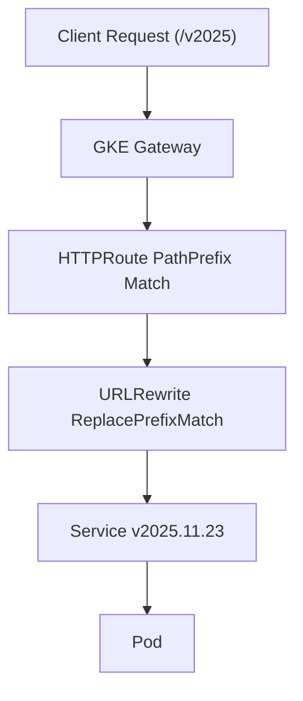
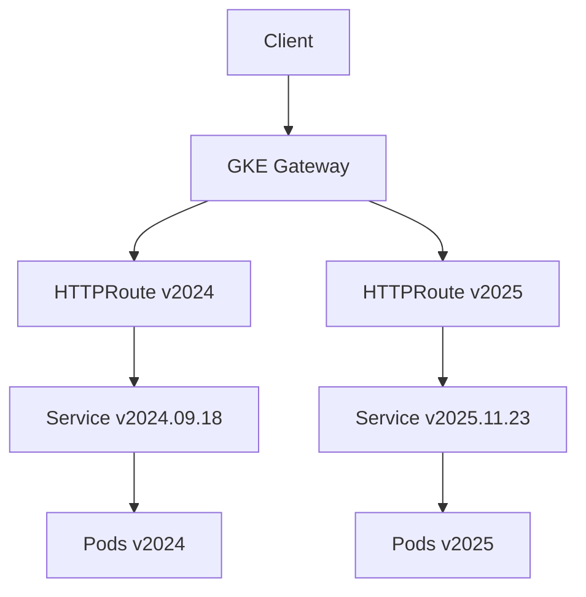
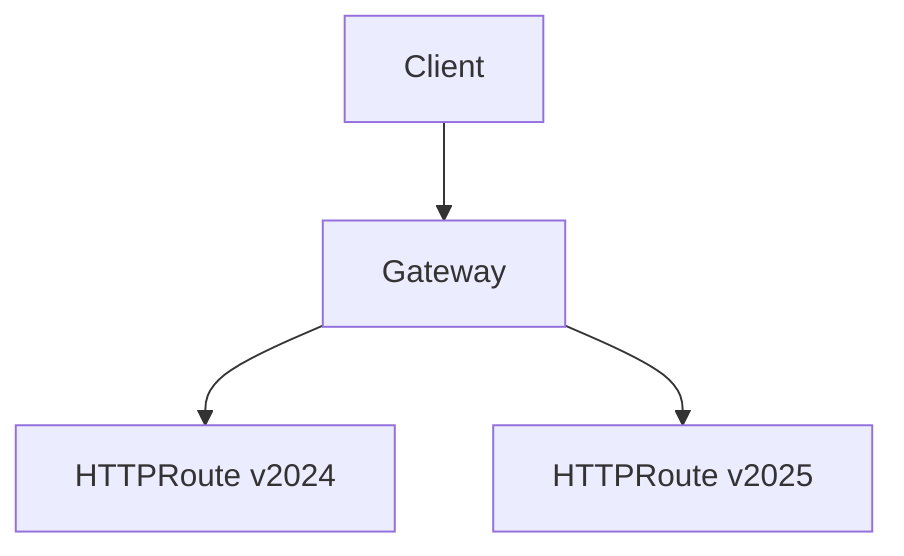
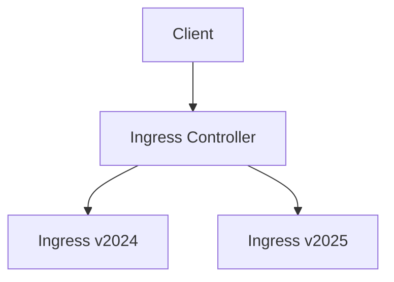

# GKE Gateway API Version Control Configuration Review

- old httproute

```yaml
apiVersion: gateway.networking.k8s.io/v1
kind: HTTPRoute
metadata:
  name: api-name-sprint-samples-route-v2025
  namespace: caep-int-common
spec:
  hostnames:
  - env-region.aliyun.cloud.uk.aibang
  parentRefs:
  - group: gateway.networking.k8s.io
    kind: Gateway
    name: abjx-int-gkegateway-ns
    namespace: abjx-int-gkegateway-ns
  rules:
  - matches:
    - path:
        type: PathPrefix
        value: /api-name-sprint-samples
    backendRefs:
    - group: ""
      kind: Service
      name: api-name-sprint-samples-2025-11-23-service
      port: 8443
      weight: 1
```
- the url is 
- https://env-region.aliyun.cloud.uk.aibang/api-name-sprint-samples/v2025.11.23/.well-known/healthcheck
- we want to add a version control to the url
- change the url to 
- https://env-region.aliyun.cloud.uk.aibang/api-name-sprint-samples/v2025/.well-known/healthcheck
# Question
```bash
Please help verify this configuration. Is this a best practice for GKE Gateway to support rewriting?
And how to successfully verify that the gateway is ready? Because my goal is to archive version control. This is my API pattern. I think including the version in the API URL is a standard configuration.
```

### HTTPRoute

```yaml
apiVersion: gateway.networking.k8s.io/v1
kind: HTTPRoute
metadata:
  name: api-name-sprint-samples-route-v2025
  namespace: caep-int-common
spec:
  hostnames:
  - env-region.aliyun.cloud.uk.aibang
  parentRefs:
  - group: gateway.networking.k8s.io
    kind: Gateway
    name: abjx-int-gkegateway-ns
    namespace: abjx-int-gkegateway-ns
  rules:
  - matches:
    - path:
        type: PathPrefix
        value: /api-name-sprint-samples/v2025
    filters:
    - type: URLRewrite
      urlRewrite:
        path:
          type: ReplacePrefixMatch
          replacePrefixMatch: /api-name-sprint-samples/v2025.11.23/
    backendRefs:
    - group: ""
      kind: Service
      name: api-name-sprint-samples-2025-11-23-service
      port: 8443
      weight: 1
```

Below is a GKE Gateway API–oriented review of your HTTPRoute, with best-practice guidance, rewrite semantics clarification, and concrete verification steps to ensure the Gateway is Ready and routing as expected.

---

## 1️⃣ Problem Analysis

Your goals are clear and reasonable:
- Use API versioning in the URL (good practice)
- Expose a stable external API version `/api-name-sprint-samples/v2025`
- Internally route to a more granular release version `/api-name-sprint-samples/v2025.11.23/`
- Use GKE Gateway (Gateway API) instead of legacy Ingress

This aligns well with modern API platform design.

---

## 2️⃣ Configuration Review (Is this valid & best practice?)

### ‚úÖ What you did right

| Area | Evaluation |
|------|------------|
| Gateway API | ‚úÖ Correct usage of HTTPRoute |
| Versioned URL | ‚úÖ Version in path is industry standard |
| Rewrite usage | ‚úÖ URLRewrite + ReplacePrefixMatch is correct |
| Service isolation | ‚úÖ Backend Service per release |
| Namespace separation | ‚úÖ parentRefs cross-namespace is supported |

---

### ⚠️ Important semantic clarification (VERY important)

Your current rewrite:

```yaml
matches:
- path:
    type: PathPrefix
    value: /api-name-sprint-samples/v2025
urlRewrite:
  path:
    type: ReplacePrefixMatch
    replacePrefixMatch: /api-name-sprint-samples/v2025.11.23/
```

### üîç What actually happens

| Client Request | Upstream Sent |
|----------------|---------------|
| /.../v2025 | /.../v2025.11.23/ |
| /.../v2025/health | /.../v2025.11.23/health |

‚úÖ This is correct and intended behavior

This pattern is explicitly recommended for:
- semantic version abstraction
- backend release iteration
- zero-downtime upgrades

---

## 3️⃣ Best-Practice Recommendations (Production-grade)

### ‚úÖ Recommendation 1: Keep major version stable

Your approach is correct:

- External: v2025
- Internal: v2025.11.23

This gives you:
- Backward compatibility
- Freedom to patch internally
- Safe rollback

---

### ‚úÖ Recommendation 2: Add header-based version tracing (optional but recommended)

Add a response header to make debugging easier:

```yaml
filters:
- type: URLRewrite
  urlRewrite:
    path:
      type: ReplacePrefixMatch
      replacePrefixMatch: /api-name-sprint-samples/v2025.11.23/
- type: ResponseHeaderModifier
  responseHeaderModifier:
    add:
    - name: X-Backend-Version
      value: "v2025.11.23"
```

This helps:
- Ops debugging
- Traffic validation
- Incident analysis

---

### ‚úÖ Recommendation 3: Avoid patch version in external contract

You already follow this rule ‚úî
Never expose v2025.11.23 externally.

---

## 4️⃣ How to Verify Gateway & Route Readiness (Correct Way)

### Step 1️⃣ Verify Gateway status

```bash
kubectl get gateway abjx-int-gkegateway-ns -n abjx-int-gkegateway-ns -o yaml
```

You must see:

```yaml
status:
  conditions:
  - type: Ready
    status: "True"
```

If not ready ‚Üí route will never attach

---

### Step 2️⃣ Verify HTTPRoute attachment

```bash
kubectl get httproute \
  api-name-sprint-samples-route-v2025 \
  -n caep-int-common -o yaml
```

Look for:

```yaml
status:
  parents:
  - parentRef:
      name: abjx-int-gkegateway-ns
    conditions:
    - type: Accepted
      status: "True"
    - type: ResolvedRefs
      status: "True"
```

| Condition | Meaning |
|-----------|---------|
| Accepted | Gateway accepted the route |
| ResolvedRefs | Service & port resolved |

---

### Step 3️⃣ Verify backend Service & Endpoints

```bash
kubectl get svc api-name-sprint-samples-2025-11-23-service -n caep-int-common
kubectl get endpoints api-name-sprint-samples-2025-11-23-service -n caep-int-common
```

Endpoints must not be empty

---

### Step 4️⃣ Functional test (curl)

```bash
curl -vk \
  https://env-region.aliyun.cloud.uk.aibang/api-name-sprint-samples/v2025/health
```

Expect:
- HTTP 200
- Backend logs show path: `/api-name-sprint-samples/v2025.11.23/health`

---

## 5️⃣ Traffic Flow (Mermaid Diagram)



---

## 6️⃣ Final Verdict

‚úÖ Is this best practice?

YES — this is a textbook-correct Gateway API versioning pattern

‚úÖ Is URL versioning standard?

YES — path-based versioning is still the most interoperable approach

‚úÖ Is rewrite the right tool?

YES — especially for controlled release & rollback

---

If you want, next we can:
- design canary routing (weight)
- add header-based version routing
- compare this with Ingress / Kong behavior
- design multi-major-version coexistence (v2024 + v2025)

Just tell me üëç

---

# Multi-Major-Version Coexistence Design

Below is a production-grade design for multi-major-version coexistence using GKE Gateway API, covering routing strategy, YAML examples, traffic flow, and verification.

This design allows v2024 and v2025 to run simultaneously, independently deployable, rollback-safe, and extensible.

---

## 1️⃣ Problem Analysis

You want to support:

- `/api-name-sprint-samples/v2024/**`
- `/api-name-sprint-samples/v2025/**`

Goals:
- Keep major versions isolated
- Allow independent patch releases
- Avoid breaking clients
- Enable canary / rollout / rollback
- Use Gateway API best practices

---

## 2️⃣ Recommended Architecture (High-level)

### Core principles

| Layer | Responsibility |
|-------|----------------|
| Gateway | TLS, L7 entry |
| HTTPRoute (per major version) | Version contract |
| Service (per patch) | Release isolation |
| Deployment | Actual workload |

---

## 3️⃣ Routing Strategy (Best Practice)

‚úî One HTTPRoute per major version

This is the most important rule.

- HTTPRoute-v2024
- HTTPRoute-v2025

Why:
- Independent lifecycle
- Clean rollback
- Clear ownership
- No accidental override

---

## 4️⃣ YAML Design

### 4.1 HTTPRoute – v2024 (stable)

```yaml
apiVersion: gateway.networking.k8s.io/v1
kind: HTTPRoute
metadata:
  name: vsit-samples-route-v2024
  namespace: caep-int-common
spec:
  hostnames:
  - env-region.aliyun.cloud.uk.aibang
  parentRefs:
  - group: gateway.networking.k8s.io
    kind: Gateway
    name: abjx-int-gkegateway-ns
    namespace: abjx-int-gkegateway-ns
  rules:
  - matches:
    - path:
        type: PathPrefix
        value: /api-name-sprint-samples/v2024
    filters:
    - type: URLRewrite
      urlRewrite:
        path:
          type: ReplacePrefixMatch
          replacePrefixMatch: /api-name-sprint-samples/v2024.09.18/
    - type: ResponseHeaderModifier
      responseHeaderModifier:
        add:
        - name: X-API-Major-Version
          value: "v2024"
        - name: X-API-Backend-Version
          value: "v2024.09.18"
    backendRefs:
    - name: vsit-samples-2024-09-18-service
      port: 8443
```

---

### 4.2 HTTPRoute – v2025 (current)

```yaml
apiVersion: gateway.networking.k8s.io/v1
kind: HTTPRoute
metadata:
  name: vsit-samples-route-v2025
  namespace: caep-int-common
spec:
  hostnames:
  - env-region.aliyun.cloud.uk.aibang
  parentRefs:
  - group: gateway.networking.k8s.io
    kind: Gateway
    name: abjx-int-gkegateway-ns
    namespace: abjx-int-gkegateway-ns
  rules:
  - matches:
    - path:
        type: PathPrefix
        value: /api-name-sprint-samples/v2025
    filters:
    - type: URLRewrite
      urlRewrite:
        path:
          type: ReplacePrefixMatch
          replacePrefixMatch: /api-name-sprint-samples/v2025.11.23/
    - type: ResponseHeaderModifier
      responseHeaderModifier:
        add:
        - name: X-API-Major-Version
          value: "v2025"
        - name: X-API-Backend-Version
          value: "v2025.11.23"
    backendRefs:
    - name: vsit-samples-2025-11-23-service
      port: 8443
```

---

## 5️⃣ Traffic Flow (Mermaid)



---

## 6️⃣ Canary Upgrade Within Same Major Version

Example: upgrading v2025.11.23 ‚Üí v2025.12.01

```yaml
backendRefs:
- name: vsit-samples-2025-11-23-service
  port: 8443
  weight: 90
- name: vsit-samples-2025-12-01-service
  port: 8443
  weight: 10
```

‚úî No client change
‚úî Safe rollout
‚úî Instant rollback

---

## 7️⃣ How to Verify (End-to-End)

### 7.1 Route attachment

```bash
kubectl get httproute -n caep-int-common

kubectl describe httproute vsit-samples-route-v2025 -n caep-int-common
```

---

### 7.2 Functional tests

```bash
curl -vk https://env-region.aliyun.cloud.uk.aibang/api-name-sprint-samples/v2024/health

curl -vk https://env-region.aliyun.cloud.uk.aibang/api-name-sprint-samples/v2025/health
```

Check response headers:
- X-API-Major-Version
- X-API-Backend-Version

---

## 8️⃣ Version Coexistence Rules (Hard Rules)

| Rule | Reason |
|------|--------|
| One major = one HTTPRoute | Prevent conflict |
| Never rewrite backwards | Avoid breaking |
| Major version is immutable | Contract stability |
| Patch version is internal | Release freedom |
| Always expose version headers | Observability |

---

## 9️⃣ When to Deprecate v2024

Recommended process:
1. Announce deprecation date
2. Add response header: `X-API-Deprecated: true`
3. Reduce traffic gradually
4. Remove HTTPRoute only (not Gateway)

---

## üîö Final Verdict

This design gives you:

‚úÖ Clean major-version coexistence  
‚úÖ Safe evolution  
‚úÖ Zero-downtime rollout  
‚úÖ Clear ownership  
‚úÖ Gateway-native semantics  

If you want next, I can:
- design default version fallback
- add redirect v2024 ‚Üí v2025
- integrate Kong-style version routing
- design OpenAPI + Gateway alignment

Just say which one.

---

# Comparison with Ingress

Below is a clear, production-oriented comparison between Gateway API and Ingress for multi-major API version coexistence, followed by a practical Ingress design that achieves the same outcome when GKE Gateway is not available.

I'll stay strictly in Ingress-controller–only territory (NGINX Ingress–style), because that's the realistic constraint in many non-GKE environments.

---

## 1️⃣ Problem Analysis

You want to achieve the same goals as Gateway API:
- `/v2024/**` and `/v2025/**` coexist
- Stable external contract
- Internal patch-level routing
- Safe rollout / rollback
- Version isolation
- Minimal client impact

But only Ingress Controller is available.

---

## 2️⃣ Gateway API vs Ingress (Conceptual Comparison)

| Dimension | Gateway API | Ingress |
|-----------|-------------|---------|
| API maturity | New, expressive | Legacy, stable |
| Version isolation | Native (multiple HTTPRoute) | Manual (paths + rules) |
| Rewrite support | First-class (URLRewrite) | Controller-specific |
| Traffic split | Native weight | Annotation hacks |
| Cross-namespace | Native | Hard / unsafe |
| Observability | Structured status | Logs only |
| Portability | High | Low (NGINX-specific) |

Key takeaway:
Ingress can do it — but you must implement discipline manually.

---

## 3️⃣ Best-Practice Ingress Design (Equivalent to Gateway API)

Core rule (very important)

One major version = one Ingress object

This mimics the Gateway API mental model.

---

## 4️⃣ Ingress Design – v2024

### 4.1 Ingress YAML (NGINX Ingress)

```yaml
apiVersion: networking.k8s.io/v1
kind: Ingress
metadata:
  name: vsit-samples-ingress-v2024
  namespace: caep-int-common
  annotations:
    nginx.ingress.kubernetes.io/use-regex: "true"
    nginx.ingress.kubernetes.io/rewrite-target: /api-name-sprint-samples/v2024.09.18/$2
    nginx.ingress.kubernetes.io/configuration-snippet: |
      add_header X-API-Major-Version v2024 always;
      add_header X-API-Backend-Version v2024.09.18 always;
spec:
  ingressClassName: nginx
  rules:
  - host: env-region.aliyun.cloud.uk.aibang
    http:
      paths:
      - path: /api-name-sprint-samples/v2024(/|$)(.*)
        pathType: ImplementationSpecific
        backend:
          service:
            name: vsit-samples-2024-09-18-service
            port:
              number: 8443
```

---

## 5️⃣ Ingress Design – v2025

```yaml
apiVersion: networking.k8s.io/v1
kind: Ingress
metadata:
  name: vsit-samples-ingress-v2025
  namespace: caep-int-common
  annotations:
    nginx.ingress.kubernetes.io/use-regex: "true"
    nginx.ingress.kubernetes.io/rewrite-target: /api-name-sprint-samples/v2025.11.23/$2
    nginx.ingress.kubernetes.io/configuration-snippet: |
      add_header X-API-Major-Version v2025 always;
      add_header X-API-Backend-Version v2025.11.23 always;
spec:
  ingressClassName: nginx
  rules:
  - host: env-region.aliyun.cloud.uk.aibang
    http:
      paths:
      - path: /api-name-sprint-samples/v2025(/|$)(.*)
        pathType: ImplementationSpecific
        backend:
          service:
            name: vsit-samples-2025-11-23-service
            port:
              number: 8443
```

---

## 6️⃣ Traffic Flow Comparison

### Gateway API



### Ingress



Same outcome — different safety guarantees

---

## 7️⃣ Canary Release Comparison

### Gateway API (clean)

```yaml
backendRefs:
- name: svc-2025-11-23
  weight: 90
- name: svc-2025-12-01
  weight: 10
```

### Ingress (NGINX workaround)

```
nginx.ingress.kubernetes.io/canary: "true"
nginx.ingress.kubernetes.io/canary-weight: "10"
```

‚û° Requires two Ingress objects  
‚û° Controller-specific  
‚û° Harder rollback discipline  

---

## 8️⃣ Verification Comparison

### Gateway API

```bash
kubectl get httproute
kubectl describe httproute
```

You get:
- Accepted
- ResolvedRefs
- Ready

---

### Ingress

```bash
kubectl describe ingress vsit-samples-ingress-v2025
```

You rely on:
- Events
- Logs
- Trial traffic

‚ùå No real "Ready" signal

---

## 9️⃣ Risks with Ingress (What to Watch)

| Risk | Mitigation |
|------|------------|
| Regex rewrite bugs | Keep path regex minimal |
| Annotation drift | Centralize templates |
| Controller lock-in | Document assumptions |
| Rule shadowing | One version = one Ingress |
| Poor observability | Add response headers |

---

## üîü Final Recommendation Matrix

| Scenario | Recommended |
|----------|-------------|
| GKE / modern platform | Gateway API |
| Multi-cloud | Gateway API |
| Legacy clusters | Ingress |
| High change rate | Gateway API |
| Simple APIs | Ingress OK |

---

## üîö Bottom Line

Ingress can achieve 90% of Gateway API versioning power — but only with strict conventions.

If you want, next we can:
- build a shared Ingress template
- design Ingress ‚Üí Gateway migration
- compare Ingress vs Kong Ingress
- add redirect v2024 ‚Üí v2025

Just tell me which path you want.