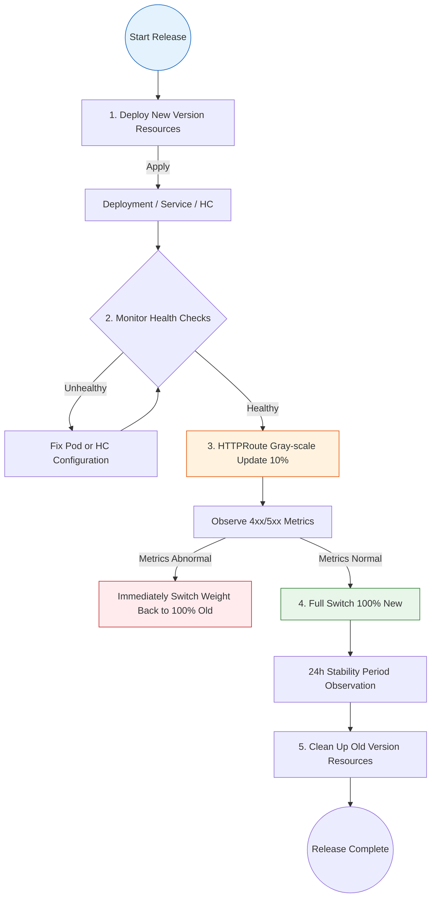
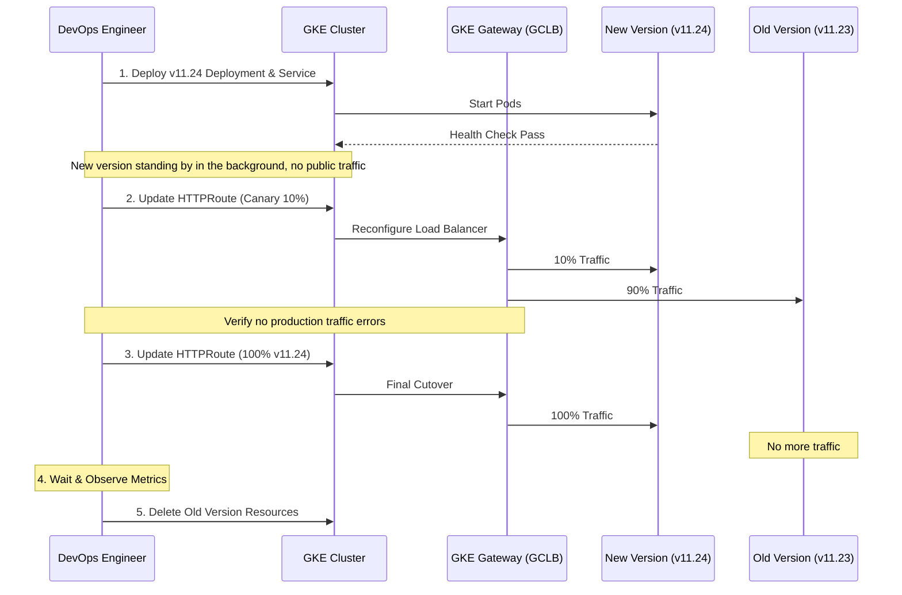

- [GKE Gateway API Smooth Version Switching and Validation Best Practices](#gke-gateway-api-smooth-version-switching-and-validation-best-practices)
  - [1. Path Conflict Assessment (Same Path Conflict)](#1-path-conflict-assessment-same-path-conflict)
    - [❓ Core Issue](#-core-issue)
    - [🔍 Gateway API Conflict Resolution Rules](#-gateway-api-conflict-resolution-rules)
    - [💡 Concrete Example: Longest Match](#-concrete-example-longest-match)
    - [💡 Concrete Example: Identical Match (Complete Conflict)](#-concrete-example-identical-match-complete-conflict)
      - [Case A: Multiple rules defined in the same HTTPRoute file](#case-a-multiple-rules-defined-in-the-same-httproute-file)
      - [Case B: Same path defined in different HTTPRoute files](#case-b-same-path-defined-in-different-httproute-files)
      - [✅ Best Practice Recommendations](#-best-practice-recommendations)
    - [⚠️ Risk Assessment](#️-risk-assessment)
  - [2. Zero-Downtime Smooth Switching Process (Zero-Downtime Workflow)](#2-zero-downtime-smooth-switching-process-zero-downtime-workflow)
    - [Phase 1: Pre-deployment and Readiness](#phase-1-pre-deployment-and-readiness)
    - [Phase 2: Internal Gray-scale Validation (Optional)](#phase-2-internal-gray-scale-validation-optional)
    - [Phase 3: Atomic Traffic Switching](#phase-3-atomic-traffic-switching)
    - [Phase 4: Observation and Cleanup](#phase-4-observation-and-cleanup)
  - [3. Validation Mechanism (Validation Methodology)](#3-validation-mechanism-validation-methodology)
    - [🛠 Validation Tool Comparison](#-validation-tool-comparison)
    - [Example: Adding Version Tracking Headers](#example-adding-version-tracking-headers)
  - [4. Version Switching Execution Panorama](#4-version-switching-execution-panorama)
    - [4.1 Logical Flow Decomposition](#41-logical-flow-decomposition)
    - [4.2 Traffic Transition Timeline](#42-traffic-transition-timeline)
  - [5. Summary Recommendations](#5-summary-recommendations)
  - [6. High Availability Assessment: Same HTTPRoute or New?](#6-high-availability-assessment-same-httproute-or-new)
    - [❓ Deep User Question](#-deep-user-question)
    - [💡 Core Assessment and Answer](#-core-assessment-and-answer)
      - [1. Why is "Creating New HTTPRoute" not viable in HA scenarios?](#1-why-is-creating-new-httproute-not-viable-in-ha-scenarios)
      - [2. How does "Updating Same HTTPRoute" ensure high availability?](#2-how-does-updating-same-httproute-ensure-high-availability)
      - [3. Recommended HA Switching Closed Loop](#3-recommended-ha-switching-closed-loop)
      - [🛡️ Final Recommendation](#️-final-recommendation)

# GKE Gateway API Smooth Version Switching and Validation Best Practices

This guide aims to address how to achieve smooth API version switching (zero downtime) in a GKE Gateway API environment, and delves into path conflict assessment and multi-version validation solutions.

---

## 1. Path Conflict Assessment (Same Path Conflict)

### ❓ Core Issue
What happens if I have two `HTTPRoute` objects whose `matches.path.value` are both `/api-name-sprint-samples/v2025`?

### 🔍 Gateway API Conflict Resolution Rules
When multiple `HTTPRoute` rules match the same request, GKE Gateway follows these priorities:
1.  **Longest Path First / Most Specific Match Wins**: Although paths are the same, if one rule contains more matching conditions (such as Headers), it will prevail.
2.  **Creation Time Priority (Oldest Wins)**: If two rules have identical paths and matching criteria weights are equal, typically the **earliest created** rule takes effect.

### 💡 Concrete Example: Longest Match
Assume you currently have two rule configurations that both point to the same path `/api-name-sprint-samples/v2025`:

```yaml
rules:
# Rule A: Path Match Only (General Match)
- matches:
  - path:
      type: PathPrefix
      value: /api-name-sprint-samples/v2025
  backendRefs:
  - name: service-v11-23
    port: 8443

# Rule B: Path Match + Header Match (Specific Match)
- matches:
  - path:
      type: PathPrefix
      value: /api-name-sprint-samples/v2025
    headers:
    - name: x-version
      value: v11.24
  backendRefs:
  - name: service-v11-24
    port: 8443
```

**Behavior:**
- **Scenario 1**: Client requests `/api-name-sprint-samples/v2025` without carrying any special Header.
  - **Result**: Matches **Rule A**, traffic flows to old version `v11.23`.
- **Scenario 2**: Client requests `/api-name-sprint-samples/v2025` and carries Header `x-version: v11.24`.
  - **Result**: Matches **Rule B**. Although the path is the same as Rule A, Rule B provides more specific matching conditions (Header), so it has **higher priority** than Rule A.

### 💡 Concrete Example: Identical Match (Complete Conflict)
If two configurations have **exactly the same path** (e.g., `/api-name-sprint-samples/v2025`), and **no Headers**, but point to **different Backend Services**, what happens?

#### Case A: Multiple rules defined in the same HTTPRoute file
```yaml
rules:
- matches:
  - path: { type: PathPrefix, value: /v2025 }
  backendRefs: [{ name: service-A }]  # Rule 1
- matches:
  - path: { type: PathPrefix, value: /v2025 }
  backendRefs: [{ name: service-B }]  # Rule 2
```
- **Processing Rule**: **First Match Wins**.
- **Result**: Traffic will all flow to `service-A`. Rule 2, although defined, is actually **shadowed** because the path matching logic completes and returns at Rule 1.

#### Case B: Same path defined in different HTTPRoute files
- **Processing Rule**: **Creation Time Priority (Oldest Wins)**.
- **Result**: Only the `HTTPRoute` deployed earliest to the cluster will successfully control that path. Later-created `HTTPRoute` objects typically show conflict warnings in their `status` and cannot take effect due to the path being occupied.

#### ✅ Best Practice Recommendations
If you need to distribute traffic from the same path to different Services, **do not define duplicate rules**, but instead use **Weights**:
```yaml
rules:
- matches:
  - path: { type: PathPrefix, value: /v2025 }
  backendRefs:
  - name: service-A
    weight: 50
  - name: service-B
    weight: 50
```

### ⚠️ Risk Assessment
- **Non-deterministic Routing**: If simply creating a new `HTTPRoute` with the same path name, it may cause traffic to still go to the old rule, or cause the Gateway controller to generate conflict alerts.
- **Recommended Solution**: **Do not create new HTTPRoute with the same path**. Instead, move `backendRefs` weights within the same `HTTPRoute` object, or directly execute atomic updates of `ReplacePrefixMatch`.

---

## 2. Zero-Downtime Smooth Switching Process (Zero-Downtime Workflow)

To ensure a smooth and seamless switching process, it is recommended to follow these four phases:

### Phase 1: Pre-deployment and Readiness
1.  **Deploy New Version Application**: Deploy the new `Deployment` (e.g., `v2025.11.24`).
    ```yaml
    apiVersion: apps/v1
    kind: Deployment
    metadata:
      name: api-samples-v2025-11-24
    spec:
      replicas: 3
      selector:
        matchLabels:
          app: api-name-sprint-samples
          version: v2025.11.24
      template:
        metadata:
          labels:
            app: api-name-sprint-samples
            version: v2025.11.24
        spec:
          containers:
          - name: app
            image: gcr.io/proj/api:v2025.11.24
            ports:
            - containerPort: 8443
    ```

2.  **Create Backend Supporting Resources**:
    - Create corresponding `Service`.
    ```yaml
    apiVersion: v1
    kind: Service
    metadata:
      name: api-samples-2025-11-24-service
    spec:
      selector:
        app: api-name-sprint-samples
        version: v2025.11.24
      ports:
      - protocol: TCP
        port: 8443
        targetPort: 8443
    ```
    - Configure `GCPBackendPolicy` and `HealthCheckPolicy` (GKE Gateway specific).
    ```yaml
    apiVersion: networking.gke.io/v1
    kind: HealthCheckPolicy
    metadata:
      name: api-samples-hc
    spec:
      default:
        config:
          type: HTTPS
          httpsHealthCheck:
            requestPath: /health
      targetRef:
        group: ""
        kind: Service
        name: api-samples-2025-11-24-service
    ---
    apiVersion: networking.gke.io/v1
    kind: GCPBackendPolicy
    metadata:
      name: api-samples-backend-policy
    spec:
      default:
        timeoutSec: 30
      targetRef:
        group: ""
        kind: Service
        name: api-samples-2025-11-24-service
    ```

3.  **Verify Endpoint Readiness**: Ensure the new Service's Endpoints have been generated and Pods have passed the Ready check.

### Phase 2: Internal Gray-scale Validation (Optional)
Before switching the main route, validate the new version through the following methods:
- **Header Routing**: Temporarily add a rule with a specific Header (e.g., `X-Beta-Test: true`) in `HTTPRoute` to direct test traffic to the new Service.

### Phase 3: Atomic Traffic Switching
Update the running `HTTPRoute` rule:
- **Option A: Canary Traffic Switch (Weight Transition)**
  ```yaml
  apiVersion: gateway.networking.k8s.io/v1
  kind: HTTPRoute
  metadata:
    name: api-name-sprint-samples-route-v2025
  spec:
    rules:
    - matches:
      - path: { type: PathPrefix, value: /api-name-sprint-samples/v2025 }
      filters:
      - type: URLRewrite
        urlRewrite: { path: { type: ReplacePrefixMatch, replacePrefixMatch: /api-name-sprint-samples/2025.11.24/ } }
      backendRefs:
      - name: api-name-sprint-samples-2025-11-23-service # Old version
        weight: 90
      - name: api-name-sprint-samples-2025-11-24-service # New version
        weight: 10
  ```
- **Option B: Atomic Update (Direct Full Replacement)**
  Directly modify the `ReplacePrefixMatch` and `name` in `backendRefs`. Since `kubectl apply` is an atomic operation, the API Server will distribute the complete configuration in one go.
  ```yaml
  # Execute command: kubectl apply -f httproute-v2025.yaml
  backendRefs:
  - name: api-name-sprint-samples-2025-11-24-service
    port: 8443
    weight: 1
  ```

### Phase 4: Observation and Cleanup
1.  **Check Metrics**: Monitor error rates (4xx/5xx) and latency.
2.  **Clean Up Resources**: After confirming stable operation for 24 hours, delete the old version's `Service` and `Deployment`.

---

## 3. Validation Mechanism (Validation Methodology)

How to ensure the new version is healthy "behind the scenes" and the switch has taken effect?

### 🛠 Validation Tool Comparison

| Validation Dimension | Tool/Command | Expected Result |
| :--- | :--- | :--- |
| **Gateway Mount** | `kubectl get httproute <name> -o jsonpath='{.status.parents[0].conditions}'` | `Accepted: True`, `ResolvedRefs: True` |
| **GCP Backend Health** | `kubectl get gcpbackendpolicy` | Ensure backend is recognized as Healthy on GCP side |
| **Version Transparency Validation** | `curl -i https://.../v2025/...` | Suggest adding `ResponseHeaderModifier` in Filter to return internal version number |

### Example: Adding Version Tracking Headers
Add the following configuration to `HTTPRoute` to confirm traffic destination without checking logs:
```yaml
filters:
- type: ResponseHeaderModifier
  responseHeaderModifier:
    add:
    - name: "X-Active-Backend"
      value: "v2025.11.24"
```

---

## 4. Version Switching Execution Panorama

### 4.1 Logical Flow Decomposition


### 4.2 Traffic Transition Timeline


---

## 5. Summary Recommendations

- **Avoid Name Conflicts**: Always manage version evolution by updating the same `HTTPRoute` rule, avoiding path shadowing issues.
- **Utilize URL Rewriting**: `ReplacePrefixMatch` is the most powerful weapon for abstracting "major versions" and "patch versions".
- **Observability First**: Always expose internal version numbers at the load balancer side or in response headers, which is key to quick troubleshooting.

---

## 6. High Availability Assessment: Same HTTPRoute or New?

### ❓ Deep User Question
> If I want to maintain high availability and smoothly switch to the new version, while keeping the path `/api-name-sprint-samples/v2025` unchanged. Based on the "creation time priority" rule, if I create a new HTTPRoute, will it never take effect? Do I have to update within the same HTTPRoute?

### 💡 Core Assessment and Answer

**Conclusion: In cases of identical paths, you must update within the same `HTTPRoute`.**

#### 1. Why is "Creating New HTTPRoute" not viable in HA scenarios?
As mentioned earlier, GKE Gateway follows **Oldest Wins (earliest creator wins)**.
- Assume you already have an `HTTPRoute-Old` occupying the path `/v2025`.
- You create an `HTTPRoute-New` also pointing to path `/v2025`.
- **Result**: Gateway will continue trusting `HTTPRoute-Old`. Traffic will **never** spontaneously flow to `HTTPRoute-New`.
- **Conclusion**: Creating a new file is an ineffective operation for "same-path switching".

#### 2. How does "Updating Same HTTPRoute" ensure high availability?
When you use `kubectl apply` to update an existing `HTTPRoute`, GKE Gateway (and the underlying Google Cloud Load Balancer) performs an **Atomic Update**:
- **No State Flapping**: During the configuration update process, old forwarding rules do not disappear immediately, until the new rules are synchronized on GFE (Google Front End) nodes.
- **Smooth Transition**: Once the new configuration takes effect, new incoming connections are forwarded according to the new rules. Established long connections (if they exist) typically finish processing requests before ending.

#### 3. Recommended HA Switching Closed Loop
If you worry that directly atomically replacing the `Service` name is too risky, the best HA practice is the **Two-Step Weight Method**:

1.  **Keep HTTPRoute filename unchanged**.
2.  **Configure weight ratios**:
    ```yaml
    # Step 1: Old and new coexist, verify health
    backendRefs:
    - name: service-v11-23  # Old version
      weight: 100
    - name: service-v11-24  # New version
      weight: 0             # 0 weight but already in configuration, ensuring backend mounts to load balancer
    ```
3.  **Gray-scale Traffic Switch**: Gradually increase new version weight (10 -> 50 -> 100) and decrease old version weight. This ensures that if there are issues with the new version, you can roll back instantly.

#### 🛡️ Final Recommendation
For version upgrades where **PathPrefix remains unchanged**:
- **Must** update using the same `HTTPRoute` object.
- **Must** deploy new version backend resources (Deployment/Service) first and confirm health.
- **Recommended** to use `backendRefs` weight ratio control to achieve physical "smooth switching".