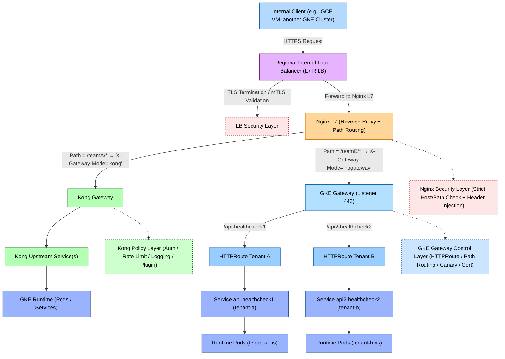
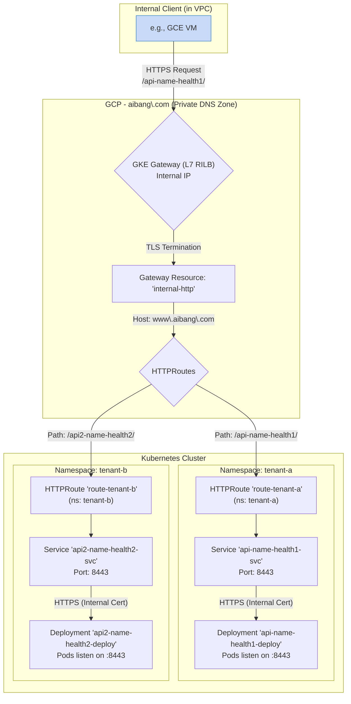

# Summary Architectural



---

## **🔍 流程简要说明**

|**层级**|**模块**|**作用描述**|
|---|---|---|
|**1️⃣ Client Layer**|Internal Client|VPC 网络内的客户端 (如 GCE, GKE) 发起 HTTPS 请求|
|**2️⃣ LB Layer**|Regional Internal Load Balancer|负责接收内部流量、TLS 终止及 mTLS 校验|
|**3️⃣ Nginx Layer**|Nginx L7 Proxy|实现反向代理与路径路由，将请求分发到不同 Gateway|
|**4️⃣ Kong Path (teamA)**|Kong Gateway → Upstream → Runtime|teamA 路由通过 Kong 处理，执行认证、限流、插件逻辑后转发到后端|
|**5️⃣ GKE Gateway Path (teamB)**|GKE Gateway → HTTPRoute → Service → Pods|teamB 路由直接使用 GKE Gateway + HTTPRoute 进行流量分发和健康检查|
|**6️⃣ Security Layers**|LB / Nginx / GKE Gateway 控制层|提供多层防护，包括 TLS 校验、Host 校验、Header 注入及 Canary 部署控制|

---

## **🧩 总结**

该架构展示了从 **VPC 内部统一入口 (Regional Internal LB)** 到 **多层 API Gateway (Nginx + Kong + GKE Gateway)** 的流量路径。

系统按路径（Path）与标头（Header）区分请求流向：

- /teamA/* 流量进入 **Kong Gateway**，适用于需要高级策略控制（认证、限流、插件）场景；
    
- /teamB/* 流量进入 **GKE Gateway**，用于原生 Kubernetes Gateway API 的轻量场景；
    
- 所有请求统一经过 **内部负载均衡器 + Nginx 安全层**，确保 TLS、mTLS 与安全策略一致性。
    

---


# Gemini

## GKE 内部 Gateway 深度解析与配置示例

根据您的需求，我们来详细分析如何配置 GKE Gateway 作为 **内部 L7 负载均衡器** (`gke-l7-rilb`)，以实现将 `https://www.aibang.com/api-name-health1` 和 `https://www.aibang.com/api2-name-health2` 分别路由到不同 Namespace (`tenant-a` 和 `tenant-b`) 的后端服务。

此方案的核心是利用 Kubernetes Gateway API 的标准资源，实现一个强大且灵活的 **内部** 路由层。

### 核心流程

1.  **内部请求**: VPC 网络内的客户端 (如 GCE 实例) 向 `https://www.aibang.com` 发起请求，该域名通过 **私有 DNS** 解析到 GKE Gateway 创建的 **区域内部负载均衡器 (L7 RILB)** 的内部 IP。
2.  **TLS 终止**: GKE Gateway 在内部 LB 层利用您提供的证书 (`www-aibang-com-cert`) 对客户端的 HTTPS 请求进行 TLS 终止。
3.  **路径匹配**: Gateway 上的 `HTTPRoute` 资源根据请求的 URL 路径 (`/api-name-health1/` 或 `/api2-name-health2/`) 进行匹配。
4.  **后端路由**:
    *   匹配到 `/api-name-health1/` 的请求被路由到 `tenant-a` 命名空间下的 `api-name-health1-svc` 服务。
    *   匹配到 `/api2-name-health2/` 的请求被路由到 `tenant-b` 命名空间下的 `api2-name-health2-svc` 服务。
5.  **后端加密 (TLS Re-encryption)**: GKE Gateway 遵循您的安全合规要求，与后端 Pod 建立一个新的 HTTPS 连接。它会验证 Pod 提供的内部证书 (`my-intra.gcp.uk.aibang.local`)，确保端到端的流量加密。

### 可视化流程 (Mermaid)



### 配置文件示例

以下是实现上述流程所需的完整 Kubernetes YAML 配置文件。

#### 1. Gateway 资源

这是内部架构的入口点，定义了一个 **区域内部负载均衡器**。

```yaml
# 01-gateway.yaml
apiVersion: gateway.networking.k8s.io/v1
kind: Gateway
metadata:
  name: internal-http
  namespace: default
spec:
  gatewayClassName: gke-l7-rilb
  listeners:
    - name: https
      protocol: HTTPS
      port: 443
      allowedRoutes:
        namespaces:
          from: All
      tls:
        mode: Terminate
        certificateRefs:
          - name: www-aibang-com-cert # 引用包含证书的 Secret
            kind: Secret
            group: ""
```
**说明**:
*   `gatewayClassName: gke-l7-rilb`: **关键变更**。指定使用 GKE 托管的 **区域内部 L7 负载均衡器**。
*   `certificateRefs`: 引用一个 TLS 证书。对于内部服务，这可以是由内部 CA 签发的证书。

---

#### 2. Tenant A 资源

为 `tenant-a` 创建独立的命名空间、路由、服务和应用部署 (此部分与外部 Gateway 场景配置相同)。

```yaml
# 02-tenant-a.yaml
apiVersion: v1
kind: Namespace
metadata:
  name: tenant-a
---
apiVersion: gateway.networking.k8s.io/v1
kind: HTTPRoute
metadata:
  name: route-tenant-a
  namespace: tenant-a
spec:
  parentRefs:
    - name: internal-http
      namespace: default
  hostnames:
    - "www.aibang.com"
  rules:
    - matches:
        - path:
            type: PathPrefix
            value: /api-name-health1/
      backendRefs:
        - name: api-name-health1-svc
          port: 8443
---
apiVersion: v1
kind: Service
metadata:
  name: api-name-health1-svc
  namespace: tenant-a
  annotations:
    cloud.google.com/app-protocols: '{"https_port":"HTTPS"}'
spec:
  ports:
    - port: 8443
      targetPort: 8443
      protocol: TCP
      name: https_port
  selector:
    app: api-name-health1
  type: ClusterIP
---
apiVersion: apps/v1
kind: Deployment
metadata:
  name: api-name-health1-deploy
  namespace: tenant-a
spec:
  replicas: 2
  selector:
    matchLabels:
      app: api-name-health1
  template:
    metadata:
      labels:
        app: api-name-health1
    spec:
      containers:
        - name: api-container
          image: your-api-image:v1 # 替换为您的应用镜像
          ports:
            - containerPort: 8443
          volumeMounts:
            - name: tls-certs
              mountPath: "/etc/tls"
              readOnly: true
      volumes:
        - name: tls-certs
          secret:
            secretName: my-intra-gcp-uk-aibang-local-cert # 包含内部证书的 Secret
```
**说明**:
*   **HTTPRoute**: `parentRefs` 现在指向新的内部 Gateway `internal-http`。
*   **Service Annotation**: `cloud.google.com/app-protocols` 注解依然是必需的，它指示内部负载均衡器与后端 Pod 之间应使用 HTTPS。

---

#### 3. Tenant B 资源

为 `tenant-b` 创建类似的资源 (此部分与外部 Gateway 场景配置相同)。

```yaml
# 03-tenant-b.yaml
apiVersion: v1
kind: Namespace
metadata:
  name: tenant-b
---
apiVersion: gateway.networking.k8s.io/v1
kind: HTTPRoute
metadata:
  name: route-tenant-b
  namespace: tenant-b
spec:
  parentRefs:
    - name: internal-http
      namespace: default
  hostnames:
    - "www.aibang.com"
  rules:
    - matches:
        - path:
            type: PathPrefix
            value: /api2-name-health2/
      backendRefs:
        - name: api2-name-health2-svc
          port: 8443
---
apiVersion: v1
kind: Service
metadata:
  name: api2-name-health2-svc
  namespace: tenant-b
  annotations:
    cloud.google.com/app-protocols: '{"https_port":"HTTPS"}'
spec:
  ports:
    - port: 8443
      targetPort: 8443
      protocol: TCP
      name: https_port
  selector:
    app: api2-name-health2
  type: ClusterIP
---
apiVersion: apps/v1
kind: Deployment
metadata:
  name: api2-name-health2-deploy
  namespace: tenant-b
spec:
  replicas: 2
  selector:
    matchLabels:
      app: api2-name-health2
  template:
    metadata:
      labels:
        app: api2-name-health2
    spec:
      containers:
        - name: api-container
          image: your-api-image-2:v1 # 替换为您的应用镜像
          ports:
            - containerPort: 8443
          volumeMounts:
            - name: tls-certs
              mountPath: "/etc/tls"
              readOnly: true
      volumes:
        - name: tls-certs
          secret:
            secretName: my-intra-gcp-uk-aibang-local-cert # 共享或使用另一个内部证书
```

### 部署步骤

1.  **创建证书 Secret**:
    *   为 `www.aibang.com` (或您的内部域名) 创建一个 TLS Secret `www-aibang-com-cert`。
    *   为内部服务 `my-intra.gcp.uk.aibang.local` 创建一个 TLS Secret `my-intra-gcp-uk-aibang-local-cert`。
2.  **应用 YAML**: 按顺序应用以上 YAML 文件。
    ```bash
    kubectl apply -f 01-gateway.yaml
    kubectl apply -f 02-tenant-a.yaml
    kubectl apply -f 03-tenant-b.yaml
    ```
3.  **获取内部 IP 地址**: GKE Gateway Controller 会自动创建一个区域内部负载均衡器。几分钟后，您可以通过以下命令获取其 **内部 IP 地址**：
    ```bash
    kubectl get gateway internal-http -n default -o jsonpath='{.status.addresses[0].value}'
    ```
4.  **配置内部 DNS**:
    *   在您的 GCP 项目中，找到或创建一个 **Cloud DNS 私有区域** (Private Zone)，该区域对您的 VPC 网络可见。
    *   在该私有区域中，为 `www.aibang.com` 创建一条 A 记录，指向您在上一步获取到的内部 IP 地址。

完成以上步骤后，您的 GKE 内部 Gateway 就配置好了。VPC 网络内的任何客户端现在都可以通过 `https://www.aibang.com` 访问您的 API，流量将通过内部负载均衡器安全地路由到相应的后端服务。