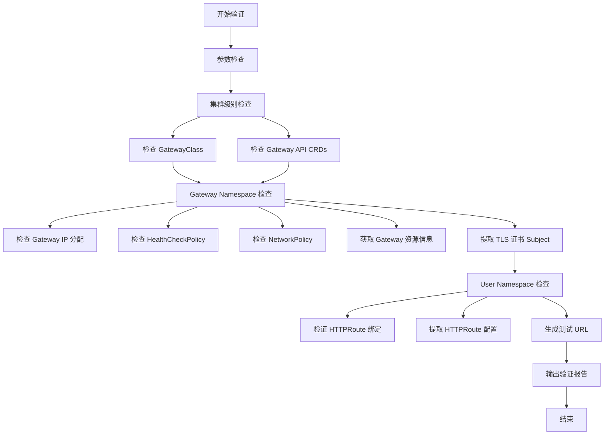

# GKE Internal Gateway 验证脚本

## 脚本说明

此脚本用于验证 GKE Internal Gateway 的配置状态，包括集群级别、Gateway Namespace 和 User Namespace 的各项资源检查。

## 完整脚本

```bash
#!/bin/bash

#==============================================================================
# GKE Internal Gateway 验证脚本
# 用途: 验证 GKE Gateway API 配置和资源状态
# 作者: Infrastructure Team
# 版本: 1.0
#==============================================================================

set -e

# 颜色输出定义
RED='\033[0;31m'
GREEN='\033[0;32m'
YELLOW='\033[1;33m'
BLUE='\033[0;34m'
NC='\033[0m' # No Color

# 日志函数
log_info() {
    echo -e "${BLUE}[INFO]${NC} $1"
}

log_success() {
    echo -e "${GREEN}[SUCCESS]${NC} $1"
}

log_warning() {
    echo -e "${YELLOW}[WARNING]${NC} $1"
}

log_error() {
    echo -e "${RED}[ERROR]${NC} $1"
}

print_section() {
    echo ""
    echo "========================================================================"
    echo "$1"
    echo "========================================================================"
}

# 参数检查
if [ $# -ne 2 ]; then
    log_error "参数错误！"
    echo "用法: $0 <GATEWAY_NAMESPACE> <USER_NAMESPACE>"
    echo "示例: $0 gateway-ns application-ns"
    exit 1
fi

GATEWAY_NAMESPACE=$1
USER_NAMESPACE=$2

log_info "Gateway Namespace: ${GATEWAY_NAMESPACE}"
log_info "User Namespace: ${USER_NAMESPACE}"

#==============================================================================
# 1. 集群级别检查
#==============================================================================
print_section "1. 集群级别 - GatewayClass 检查"

log_info "检查 GatewayClass 资源..."
if kubectl get gatewayclass &>/dev/null; then
    kubectl get gatewayclass
    log_success "GatewayClass 检查完成"
else
    log_error "未找到 GatewayClass 资源，请确认 Gateway API 已启用"
    exit 1
fi

# 检查 Gateway API CRD
log_info "检查 Gateway API CRDs..."
REQUIRED_CRDS=("gateways.gateway.networking.k8s.io" "httproutes.gateway.networking.k8s.io" "gatewayclasses.gateway.networking.k8s.io")
for crd in "${REQUIRED_CRDS[@]}"; do
    if kubectl get crd "$crd" &>/dev/null; then
        log_success "CRD $crd 已安装"
    else
        log_error "CRD $crd 未安装"
    fi
done

#==============================================================================
# 2. Gateway Namespace 检查
#==============================================================================
print_section "2. Gateway Namespace - ${GATEWAY_NAMESPACE}"

# 检查 Namespace 是否存在
if ! kubectl get namespace "$GATEWAY_NAMESPACE" &>/dev/null; then
    log_error "Namespace ${GATEWAY_NAMESPACE} 不存在"
    exit 1
fi

# 2.1 检查 Gateway IP 分配
log_info "检查 Gateway IP 分配..."
GATEWAYS=$(kubectl get gateway -n "$GATEWAY_NAMESPACE" -o jsonpath='{.items[*].metadata.name}')

if [ -z "$GATEWAYS" ]; then
    log_warning "未找到 Gateway 资源"
else
    for gw in $GATEWAYS; do
        echo ""
        log_info "Gateway: $gw"
        
        # 获取 Gateway 状态
        kubectl get gateway "$gw" -n "$GATEWAY_NAMESPACE" -o yaml | grep -A 10 "status:"
        
        # 获取分配的 IP
        GW_IP=$(kubectl get gateway "$gw" -n "$GATEWAY_NAMESPACE" -o jsonpath='{.status.addresses[0].value}' 2>/dev/null)
        if [ -n "$GW_IP" ]; then
            log_success "Gateway IP: $GW_IP"
        else
            log_warning "Gateway IP 尚未分配"
        fi
    done
fi

# 2.2 打印 HealthCheckPolicy 信息
echo ""
log_info "检查 HealthCheckPolicy..."
if kubectl get healthcheckpolicy -n "$GATEWAY_NAMESPACE" &>/dev/null; then
    kubectl get healthcheckpolicy -n "$GATEWAY_NAMESPACE" -o wide
    
    # 详细信息
    HCP_LIST=$(kubectl get healthcheckpolicy -n "$GATEWAY_NAMESPACE" -o jsonpath='{.items[*].metadata.name}')
    for hcp in $HCP_LIST; do
        echo ""
        log_info "HealthCheckPolicy 详情: $hcp"
        kubectl get healthcheckpolicy "$hcp" -n "$GATEWAY_NAMESPACE" -o yaml
    done
else
    log_warning "未找到 HealthCheckPolicy 资源"
fi

# 2.3 打印 NetworkPolicy
echo ""
log_info "检查 NetworkPolicy..."
if kubectl get networkpolicy -n "$GATEWAY_NAMESPACE" &>/dev/null; then
    kubectl get networkpolicy -n "$GATEWAY_NAMESPACE" -o wide
    
    # 详细信息
    NP_LIST=$(kubectl get networkpolicy -n "$GATEWAY_NAMESPACE" -o jsonpath='{.items[*].metadata.name}')
    for np in $NP_LIST; do
        echo ""
        log_info "NetworkPolicy 详情: $np"
        kubectl get networkpolicy "$np" -n "$GATEWAY_NAMESPACE" -o yaml
    done
else
    log_warning "未找到 NetworkPolicy 资源"
fi

# 2.4 获取 Gateway 资源信息和证书
echo ""
log_info "检查 Gateway 资源和证书信息..."

for gw in $GATEWAYS; do
    echo ""
    log_info "=== Gateway: $gw ==="
    
    # 获取 Gateway 详细信息
    kubectl get gateway "$gw" -n "$GATEWAY_NAMESPACE" -o yaml
    
    # 提取 hostname
    HOSTNAMES=$(kubectl get gateway "$gw" -n "$GATEWAY_NAMESPACE" -o jsonpath='{.spec.listeners[*].hostname}')
    if [ -n "$HOSTNAMES" ]; then
        log_success "Gateway Hostnames: $HOSTNAMES"
    fi
    
    # 检查 TLS 证书
    log_info "检查 TLS 证书..."
    LISTENERS=$(kubectl get gateway "$gw" -n "$GATEWAY_NAMESPACE" -o jsonpath='{range .spec.listeners[*]}{.name}{"|"}{.tls.certificateRefs[0].name}{"\n"}{end}')
    
    while IFS='|' read -r listener_name secret_name; do
        if [ -n "$secret_name" ]; then
            log_info "Listener: $listener_name, Secret: $secret_name"
            
            # 获取证书 Subject 和过期时间
            CERT_DATA=$(kubectl get secret "$secret_name" -n "$GATEWAY_NAMESPACE" -o jsonpath='{.data.tls\.crt}' 2>/dev/null | base64 -d)
            
            if [ -n "$CERT_DATA" ]; then
                echo "$CERT_DATA" | openssl x509 -noout -subject -enddate
                log_success "证书信息已提取"
            else
                log_warning "无法获取证书数据: $secret_name"
            fi
        fi
    done <<< "$LISTENERS"
done

#==============================================================================
# 3. User Namespace 检查
#==============================================================================
print_section "3. User Namespace - ${USER_NAMESPACE}"

# 检查 Namespace 是否存在
if ! kubectl get namespace "$USER_NAMESPACE" &>/dev/null; then
    log_error "Namespace ${USER_NAMESPACE} 不存在"
    exit 1
fi

# 3.1 验证 HTTPRoute 绑定
log_info "检查 HTTPRoute 资源..."
HTTPROUTES=$(kubectl get httproute -n "$USER_NAMESPACE" -o jsonpath='{.items[*].metadata.name}')

if [ -z "$HTTPROUTES" ]; then
    log_warning "未找到 HTTPRoute 资源"
else
    kubectl get httproute -n "$USER_NAMESPACE" -o wide
    
    # 3.2 提取 HTTPRoute 信息并生成 URL
    echo ""
    log_info "HTTPRoute 详细信息和测试 URL..."
    
    for route in $HTTPROUTES; do
        echo ""
        log_info "=== HTTPRoute: $route ==="
        
        # 获取完整 YAML
        kubectl get httproute "$route" -n "$USER_NAMESPACE" -o yaml
        
        # 提取关键信息
        HOSTNAMES=$(kubectl get httproute "$route" -n "$USER_NAMESPACE" -o jsonpath='{.spec.hostnames[*]}')
        
        # 提取 parentRefs (Gateway 引用)
        PARENT_REFS=$(kubectl get httproute "$route" -n "$USER_NAMESPACE" -o jsonpath='{.spec.parentRefs[*].name}')
        log_info "绑定的 Gateway: $PARENT_REFS"
        
        # 遍历每个 hostname
        for hostname in $HOSTNAMES; do
            # 获取 rules
            RULES_COUNT=$(kubectl get httproute "$route" -n "$USER_NAMESPACE" -o jsonpath='{.spec.rules}' | jq '. | length')
            
            for ((i=0; i<RULES_COUNT; i++)); do
                # 获取 path
                PATH_VALUE=$(kubectl get httproute "$route" -n "$USER_NAMESPACE" -o jsonpath="{.spec.rules[$i].matches[0].path.value}" 2>/dev/null)
                if [ -z "$PATH_VALUE" ]; then
                    PATH_VALUE="/"
                fi
                
                # 获取 backend service port
                BACKEND_PORT=$(kubectl get httproute "$route" -n "$USER_NAMESPACE" -o jsonpath="{.spec.rules[$i].backendRefs[0].port}" 2>/dev/null)
                
                # 默认使用 443 (HTTPS)
                if [ -z "$BACKEND_PORT" ]; then
                    BACKEND_PORT=443
                fi
                
                # 生成测试 URL
                TEST_URL="https://${hostname}:${BACKEND_PORT}${PATH_VALUE}"
                
                echo ""
                log_success "测试 URL: $TEST_URL"
                echo "  Hostname: $hostname"
                echo "  Port: $BACKEND_PORT"
                echo "  Path: $PATH_VALUE"
                
                # 可选: 执行连接测试
                log_info "执行连接测试 (可选)..."
                if command -v curl &>/dev/null; then
                    echo "curl -k -I \"$TEST_URL\""
                else
                    log_warning "未安装 curl，跳过连接测试"
                fi
            done
        done
    done
fi

#==============================================================================
# 4. 总结报告
#==============================================================================
print_section "验证完成"

log_success "GKE Internal Gateway 验证脚本执行完成"
echo ""
echo "验证范围:"
echo "  - 集群级别: GatewayClass, CRDs"
echo "  - Gateway Namespace (${GATEWAY_NAMESPACE}): Gateway, HealthCheckPolicy, NetworkPolicy, TLS 证书"
echo "  - User Namespace (${USER_NAMESPACE}): HTTPRoute, 绑定关系, 测试 URL"
echo ""
log_info "请检查以上输出信息，确认配置正确性"
```

## 使用方法

```bash
# 添加执行权限
chmod +x verify-gke-gateway.sh

# 执行脚本
./verify-gke-gateway.sh gateway-namespace user-namespace

# 示例
./verify-gke-gateway.sh gke-gateway production-apps
```

## 验证流程图



## 输出示例

脚本执行后将输出如下信息:

|检查项|输出内容|
|---|---|
|GatewayClass|已启用的 GatewayClass 列表|
|Gateway IP|分配的内部 IP 地址|
|HealthCheckPolicy|健康检查策略配置|
|NetworkPolicy|网络策略规则|
|TLS 证书|Subject 和过期时间|
|HTTPRoute|路由规则和绑定关系|
|测试 URL|自动生成的访问地址|

## 注意事项

1. **执行前提**: 确保已通过 `kubectl` 连接到目标 GKE 集群
2. **权限要求**: 需要对两个 Namespace 有读取权限
3. **依赖工具**:
    - `kubectl` (必需)
    - `openssl` (必需，用于证书解析)
    - `jq` (必需，用于 JSON 解析)
    - `curl` (可选，用于连接测试)
4. **证书检查**: 脚本会提取证书的 Subject 和过期时间，建议定期检查
5. **URL 生成**: 默认使用 HTTPS 和端口 443，根据实际情况可能需要调整

## 故障排查

如遇到以下问题:

- **GatewayClass 未找到**: 检查 Gateway API 是否已在集群中启用
- **Gateway IP 未分配**: 检查 GKE Gateway Controller 日志
- **HTTPRoute 未生效**: 验证 `parentRefs` 是否正确引用 Gateway
- **证书无法提取**: 确认 Secret 存在且包含 `tls.crt` 字段