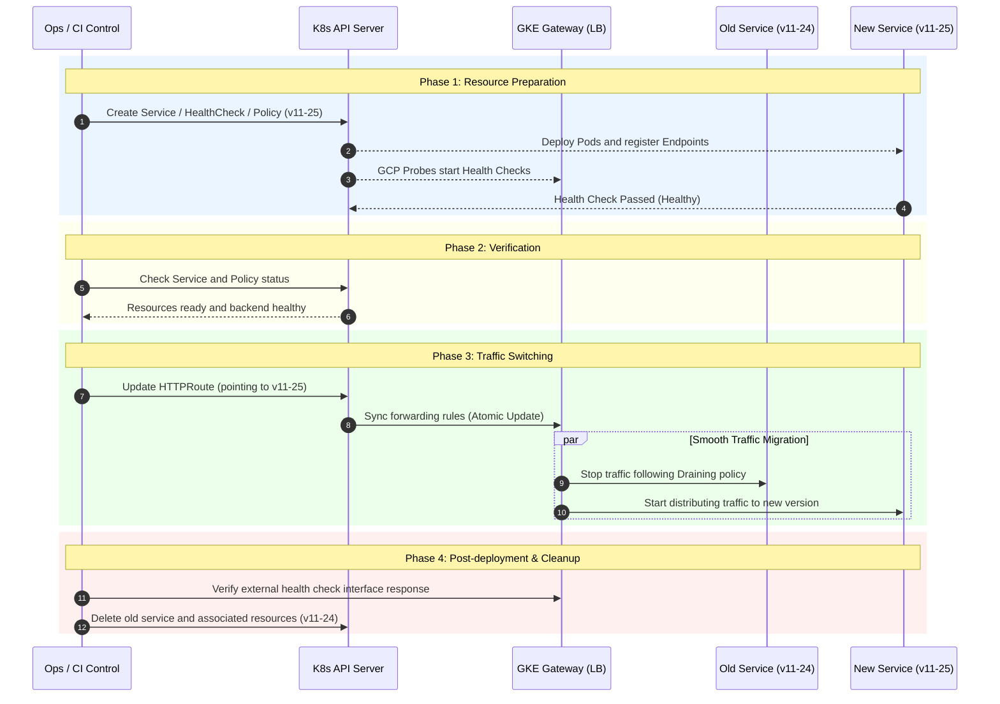

- [Core Concepts: Version Control and Smooth Switching in GKE Gateway API No-Gateway Mode](#core-concepts-version-control-and-smooth-switching-in-gke-gateway-api-no-gateway-mode)
  - [1. Core Architecture](#1-core-architecture)
  - [2. Versioning Strategy](#2-versioning-strategy)
    - [URL Abstraction Model](#url-abstraction-model)
    - [Key Configuration: URL Rewrite](#key-configuration-url-rewrite)
  - [3. Workflow \& Configuration](#3-workflow--configuration)
    - [3.1 Phase 1: Pre-deployment](#31-phase-1-pre-deployment)
      - [1. Create New Version Service](#1-create-new-version-service)
      - [2. Bind HealthCheckPolicy](#2-bind-healthcheckpolicy)
      - [3. Bind GCPBackendPolicy](#3-bind-gcpbackendpolicy)
      - [4. Pre-switch Verification](#4-pre-switch-verification)
        - [4.1 Verify K8s Resources \& Endpoints](#41-verify-k8s-resources--endpoints)
        - [4.2 Verify Policy Binding Status](#42-verify-policy-binding-status)
        - [4.3 Verify GCP Backend (NEG) Health (Critical Path)](#43-verify-gcp-backend-neg-health-critical-path)
        - [4.4 Internal Shadow Test](#44-internal-shadow-test)
    - [3.2 Phase 2: Traffic Switching](#32-phase-2-traffic-switching)
      - [Scenario: Upgrading from v11-24 to v11-25](#scenario-upgrading-from-v11-24-to-v11-25)
    - [3.3 Upgrade Process Sequence Diagram](#33-upgrade-process-sequence-diagram)
  - [4. FAQ](#4-faq)
    - [Q1: Why can't I create a new HTTPRoute to release a new version?](#q1-why-cant-i-create-a-new-httproute-to-release-a-new-version)
    - [Q2: How to verify the gateway is ready?](#q2-how-to-verify-the-gateway-is-ready)
    - [Q3: What is the difference between Ingress and Gateway API in switching?](#q3-what-is-the-difference-between-ingress-and-gateway-api-in-switching)

# Core Concepts: Version Control and Smooth Switching in GKE Gateway API No-Gateway Mode

This document summarizes the core concepts and best practices for managing backend service version control and smooth upgrades directly using GKE Gateway API, and provides detailed deployment configuration examples.

## 1. Core Architecture

In the No-Gateway mode, the GKE Gateway assumes the responsibility of traffic entry and routing distribution. The architecture design follows the **Immutable Infrastructure** principle.

*   **HTTPRoute (Routing Contract)**:
    *   Defines the external API structure (e.g., `/v2025`).
    *   **Does not carry** specific backend behavior configurations; it is only responsible for Matching, Filters (Filter/Rewrite), and Distribution (BackendRefs).
    *   Acts as the **sole atomic operation point** for version switching.

*   **Service (Immutable Backend)**:
    *   Each release version corresponds to an independent Kubernetes Service (e.g., `service-v11-25`).
    *   Releasing a new version means **creating a new Service**, not updating the old Service.

*   **Policies (Policy Binding)**:
    *   **HealthCheckPolicy** & **GCPBackendPolicy**: Must be **independently bound** to the Service of each version.
    *   The `metadata.name` of the Policy does not participate in routing logic; the only effective condition is that `targetRef` points to the corresponding Service.

---

## 2. Versioning Strategy

The goal is to separate the **stability of the external contract** from the **flexibility of internal releases**.

### URL Abstraction Model

*   **External URL**: `https://api.example.com/api/v2025/...`
    *   Uses the Major Version to maintain a long-term commitment to clients.
*   **Internal Routing**: Forwards to `service-v11-25`
    *   Uses the specific Patch Version to facilitate rollback and troubleshooting.

### Key Configuration: URL Rewrite

Utilize the Gateway API's `URLRewrite` filter to map the external generic path to the internal specific version path (if the backend application requires path version awareness).


---

## 3. Workflow & Configuration

To achieve **Zero-Downtime** deployment, the following process must be strictly followed. The core principle is: **Verify deployment first, then switch atomically**.

### 3.1 Phase 1: Pre-deployment

In this phase, we need to create the new version of the backend Service and its associated GKE Policies.

#### 1. Create New Version Service
The new version Service (`service-v11-25`) must exist independently and cannot overwrite the old version.

```yaml
apiVersion: v1
kind: Service
metadata:
  name: service-v11-25
  namespace: abjx-int-common
spec:
  selector:
    app: api-name-sprint-samples-v11-25
  ports:
  - port: 8443
    targetPort: 8443
```

#### 2. Bind HealthCheckPolicy
**Must** explicitly define the health check policy for the new Service.

```yaml
apiVersion: cloud.google.com/v1
kind: HealthCheckPolicy
metadata:
  name: hcp-service-v11-25
  namespace: abjx-int-common
spec:
  healthCheck:
    type: HTTP
    httpHealthCheck:
      port: 8443
      requestPath: /.well-known/healthcheck
  targetRef:
    group: ""
    kind: Service
    name: service-v11-25
```

#### 3. Bind GCPBackendPolicy
Configure backend parameters such as timeout and Connection Draining.

```yaml
apiVersion: cloud.google.com/v1
kind: GCPBackendPolicy
metadata:
  name: gbp-service-v11-25
  namespace: abjx-int-common
spec:
  backendConfig:
    # Configure specific backend parameters here, e.g., timeout
    timeoutSec: 40
  targetRef:
    group: ""
    kind: Service
    name: service-v11-25
```

#### 4. Pre-switch Verification

Before updating the `HTTPRoute` for a one-click switch, Ops/CI must perform the following checks to ensure the backend is ready to handle public traffic.

##### 4.1 Verify K8s Resources & Endpoints
Ensure Pods have started successfully and are associated with the Service.
```bash
# 1. Check the Service's Endpoints list to ensure the IP count meets expectations
kubectl get endpoints service-v11-25 -n abjx-int-common

# 2. Check the Pod's Readiness Probe status
kubectl get pods -l app=api-name-sprint-samples-v11-25 -n abjx-int-common
```

##### 4.2 Verify Policy Binding Status
Check if GKE Policies have been successfully Accepted by the Gateway controller.
```bash
# Check if HealthCheckPolicy is effective (Status.Conditions should be Accepted: True)
kubectl describe healthcheckpolicy hcp-service-v11-25 -n abjx-int-common

# Check GCPBackendPolicy status
kubectl describe gcpbackendpolicy gbp-service-v11-25 -n abjx-int-common
```

##### 4.3 Verify GCP Backend (NEG) Health (Critical Path)
The GKE Gateway mode forwards traffic directly via NEGs. Before switching traffic, you must ensure that the GCP Load Balancer's health checks have passed.
```bash
# 1. Get the NEG name corresponding to the Service (usually in annotations)
kubectl get svc service-v11-25 -n abjx-int-common -o jsonpath='{.metadata.annotations.cloud\.google\.com/neg-status}'

# 2. (Advanced) Use gcloud or the Cloud Console to verify the traffic state in the NEG
# Ensure all Endpoints are showing as HEALTHY on the GCP side
```

##### 4.4 Internal Shadow Test
Test the Service directly internally without modifying the public entry point.
```bash
# Use kubectl port-forward to request the new version's interface directly to verify business logic
kubectl port-forward svc/service-v11-25 8443:8443 -n abjx-int-common
curl -vk https://localhost:8443/.well-known/healthcheck
```

---

### 3.2 Phase 2: Traffic Switching

**Key Point:** Updates must be performed on the **same HTTPRoute object**.

#### Scenario: Upgrading from v11-24 to v11-25

Update the `backendRefs` and `URLRewrite` configuration of the HTTPRoute.

**Before Update (Pointing to v11-24):**
```yaml
apiVersion: gateway.networking.k8s.io/v1
kind: HTTPRoute
metadata:
  name: api-name-sprint-samples-route-v2025
  namespace: abjx-int-common
spec:
  rules:
  - matches:
    - path:
        type: PathPrefix
        value: /api-name-sprint-samples/v2025
    filters:
    - type: URLRewrite
      urlRewrite:
        path:
          type: ReplacePrefixMatch
          replacePrefixMatch: /api-name-sprint-samples/v2025.11.24/
    backendRefs:
    - name: service-v11-24
      port: 8443
      weight: 1
```

**After Update (Pointing to v11-25):**
You can choose to replace directly or use weights for a canary release.

*   **Atomic Switch**:
    Directly modify `replacePrefixMatch` to the new path and change `backendRefs` to the new Service.

*   **Canary Switch (Recommended)**:
    ```yaml
    apiVersion: gateway.networking.k8s.io/v1
    kind: HTTPRoute
    metadata:
      name: api-name-sprint-samples-route-v2025
      namespace: abjx-int-common
    spec:
      rules:
      - matches:
        - path:
            type: PathPrefix
            value: /api-name-sprint-samples/v2025
        # Note: When using weights to split traffic to Services with different path versions,
        # a single URLRewrite might not meet the rewriting needs of both backends.
        # If paths differ between old and new versions, it is recommended to switch completely
        # or update in stages.
        # Here shows the final state after a full switch:
        filters:
        - type: URLRewrite
          urlRewrite:
            path:
              type: ReplacePrefixMatch
              replacePrefixMatch: /api-name-sprint-samples/v2025.11.25/
        backendRefs:
        - name: service-v11-25  # New service
          port: 8443
          weight: 1
    ```

### 3.3 Upgrade Process Sequence Diagram


---


---

## 4. FAQ

### Q1: Why can't I create a new HTTPRoute to release a new version?
GKE Gateway follows the **Oldest Wins** principle. If two HTTPRoutes configure the same `host` and `path`, the one created earliest will take effect, and the later one will be ignored. Therefore, you must update the existing HTTPRoute object.

### Q2: How to verify the gateway is ready?
Check the status of the HTTPRoute:
```bash
kubectl get httproute <name> -o jsonpath='{.status.parents[0].conditions}'
```
Ensure `Accepted` is `True` and `ResolvedRefs` is `True`.
You can also verify using `curl`:
```bash
curl -vk https://env-region.aliyun.cloud.uk.aibang/api-name-sprint-samples/v2025/health
```

### Q3: What is the difference between Ingress and Gateway API in switching?
*   **Ingress**: Typically relies on NGINX Reload or complex Annotation configurations to implement canary releases, and has weaker rewrite rule capabilities.
*   **Gateway API**: Natively supports multi-backend weight distribution, standard URLRewrite filters, provides clearer status feedback, and is more suitable for automated releases.
