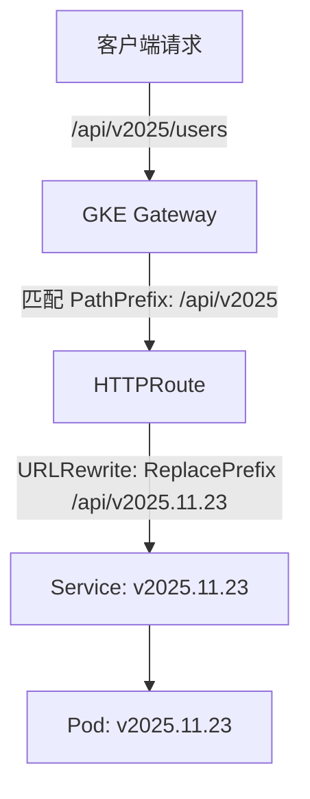
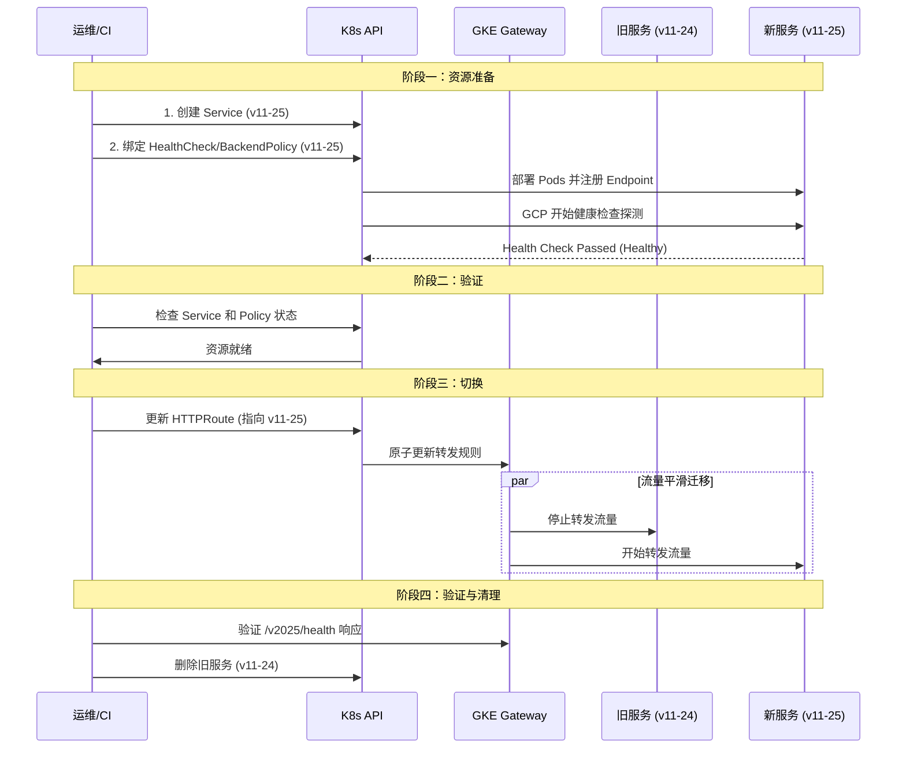

# 核心概念：GKE Gateway API 无网关模式下的版本控制与平滑切换

本文档总结了基于 GKE Gateway API 直接管理后端服务版本控制与平滑升级的核心概念与最佳实践，并提供了详细的部署配置示例。

## 1. 架构核心组件 (Core Architecture)

在无独立 API 网关（No-Gateway）模式下，GKE Gateway 承担了流量入口与路由分发的职责。架构设计遵循**不可变基础设施**原则。

*   **HTTPRoute (路由契约)**: 
    *   定义对外的 API 结构（如 `/v2025`）。
    *   **不承载**后端具体行为配置，仅负责匹配（Match）、过滤器（Filter/Rewrite）和分发（BackendRefs）。
    *   作为版本切换的**唯一原子操作点**。

*   **Service (不可变后端)**: 
    *   每一个发布版本（Release）对应一个独立的 Kubernetes Service（例如 `service-v11-25`）。
    *   发布新版本意味着**创建新 Service**，而不是更新旧 Service。

*   **Policies (策略绑定)**: 
    *   **HealthCheckPolicy** & **GCPBackendPolicy**: 必须**独立绑定**到每一个版本的 Service 上。
    *   Policy 的 `metadata.name` 不参与路由逻辑，唯一生效条件是 `targetRef` 指向对应的 Service。

---

## 2. 版本控制策略 (Versioning Strategy)

目标是实现**外部契约的稳定性**与**内部发布的灵活性**分离。

### URL 抽象模型

*   **外部 URL (External)**: `https://api.example.com/api/v2025/...`
    *   使用主版本号（Major Version），保持对客户端的长期承诺。
*   **内部路由 (Internal)**: 转发至 `service-v11-25`
    *   使用具体的补丁版本（Patch Version），便于回滚和排查。

### 关键配置：URL 重写

利用 Gateway API 的 `URLRewrite` 过滤器，将外部的通用路径映射到内部的具体版本路径（如果后端应用需要路径版本感知）。



---

## 3. 平滑切换流程与配置示例 (Workflow & Configuration)

为实现**零停机（Zero-Downtime）**部署，必须严格遵循以下流程。核心原则是：**先部署验证，后原子切换**。

### 3.1 阶段一：资源准备 (Pre-deployment)

在此阶段，我们需要创建新版本的后端 Service 及其配套的 GKE Policy。

#### 1. 创建新版本 Service
新版本 Service (`service-v11-25`) 必须独立存在，不能覆盖旧版本。

```yaml
apiVersion: v1
kind: Service
metadata:
  name: service-v11-25
  namespace: abjx-int-common
spec:
  selector:
    app: api-name-sprint-samples-v11-25
  ports:
  - port: 8443
    targetPort: 8443
```

#### 2. 绑定 HealthCheckPolicy
**必须**为新 Service 显式定义健康检查策略。

```yaml
apiVersion: cloud.google.com/v1
kind: HealthCheckPolicy
metadata:
  name: hcp-service-v11-25
  namespace: abjx-int-common
spec:
  healthCheck:
    type: HTTP
    httpHealthCheck:
      port: 8443
      requestPath: /.well-known/healthcheck
  targetRef:
    group: ""
    kind: Service
    name: service-v11-25
```

#### 3. 绑定 GCPBackendPolicy
配置超时、连接排空（Connection Draining）等后端参数。

```yaml
apiVersion: cloud.google.com/v1
kind: GCPBackendPolicy
metadata:
  name: gbp-service-v11-25
  namespace: abjx-int-common
spec:
  backendConfig:
    # 这里配置具体的后端参数，例如超时时间
    timeoutSec: 40
  targetRef:
    group: ""
    kind: Service
    name: service-v11-25
```

#### 4. 验证就绪状态
在进行流量切换前，确保新资源已就绪。
```bash
# 检查资源创建
kubectl get svc service-v11-25 -n abjx-int-common
kubectl get healthcheckpolicy hcp-service-v11-25 -n abjx-int-common

# 此时新服务应已启动，但没有任何外部流量进入
```

---

### 3.2 阶段二：流量切换 (Traffic Switching)

**关键点：** 必须在**同一个 HTTPRoute 对象**上进行更新。

#### 场景：从 v11-24 升级到 v11-25

更新 HTTPRoute 的 `backendRefs` 和 `URLRewrite` 配置。

**更新前 (指向 v11-24):**
```yaml
apiVersion: gateway.networking.k8s.io/v1
kind: HTTPRoute
metadata:
  name: api-name-sprint-samples-route-v2025
  namespace: abjx-int-common
spec:
  rules:
  - matches:
    - path:
        type: PathPrefix
        value: /api-name-sprint-samples/v2025
    filters:
    - type: URLRewrite
      urlRewrite:
        path:
          type: ReplacePrefixMatch
          replacePrefixMatch: /api-name-sprint-samples/v2025.11.24/
    backendRefs:
    - name: service-v11-24
      port: 8443
      weight: 1
```

**更新后 (指向 v11-25):**
你可以选择直接替换，或者使用权重进行金丝雀发布。

*   **原子全量切换 (Atomic Switch)**:
    直接修改 `replacePrefixMatch` 为新路径，并将 `backendRefs` 修改为新 Service。

*   **金丝雀权重切换 (Canary Switch - 推荐)**:
    ```yaml
    apiVersion: gateway.networking.k8s.io/v1
    kind: HTTPRoute
    metadata:
      name: api-name-sprint-samples-route-v2025
      namespace: abjx-int-common
    spec:
      rules:
      - matches:
        - path:
            type: PathPrefix
            value: /api-name-sprint-samples/v2025
        # 注意：在使用权重分流到不同路径版本的 Service 时，
        # 单一的 URLRewrite 可能无法满足两个后端不同的重写需求。
        # 如果新旧版本路径不一致，建议直接全量切换，或者分阶段更新。
        # 这里展示全量切换后的最终状态：
        filters:
        - type: URLRewrite
          urlRewrite:
            path:
              type: ReplacePrefixMatch
              replacePrefixMatch: /api-name-sprint-samples/v2025.11.25/
        backendRefs:
        - name: service-v11-25  # 新服务
          port: 8443
          weight: 1
    ```

### 3.3 升级流程序列图



---

## 4. 常见问题 (FAQ)

### Q1: 为什么不能新建一个 HTTPRoute 来发布新版本？
GKE Gateway 遵循 **Oldest Wins（最早创建者优先）** 原则。如果两个 HTTPRoute 配置了相同的 `host` 和 `path`，最早创建的那个会生效，后创建的会被忽略。因此，必须更新原有的 HTTPRoute 对象。

### Q2: 如何验证网关已准备就绪？
检查 HTTPRoute 的状态：
```bash
kubectl get httproute <name> -o jsonpath='{.status.parents[0].conditions}'
```
应确保 `Accepted` 为 `True` 且 `ResolvedRefs` 为 `True`。
同时可以使用 `curl` 命令验证：
```bash
curl -vk https://env-region.aliyun.cloud.uk.aibang/api-name-sprint-samples/v2025/health
```

### Q3: Ingress 和 Gateway API 在切换上有什么区别？
*   **Ingress**: 通常依赖 NGINX 的 Reload 或复杂的 Annotation 配置来实现灰度，重写规则能力较弱。
*   **Gateway API**: 原生支持多后端权重（Weight）分发，支持标准的 URLRewrite 过滤器，且状态反馈更清晰，更适合自动化发布。