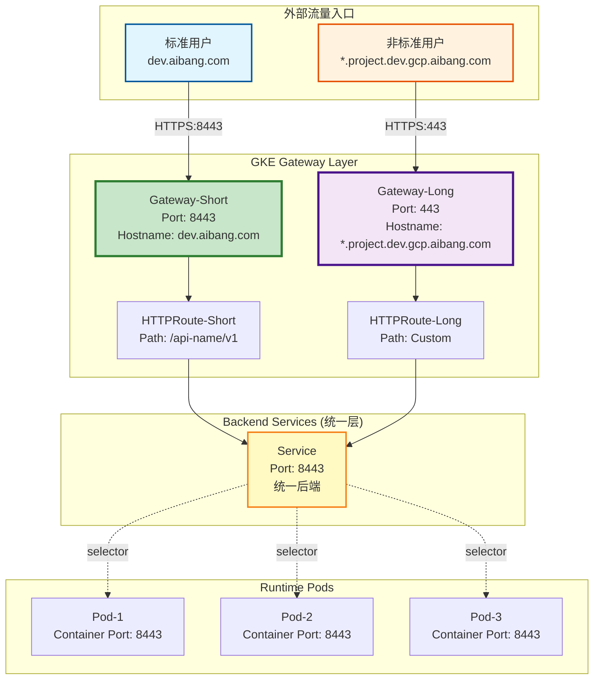
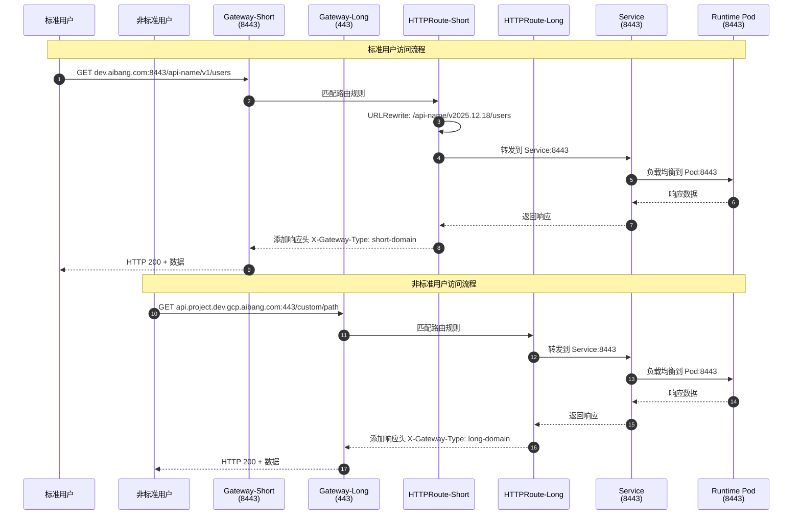
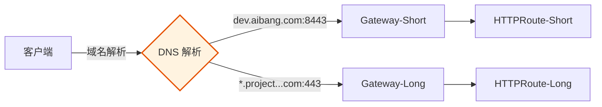

# 多 Gateway 入口架构设计与实现分析

## 目录

- [1. 需求分析与架构目标](#1-需求分析与架构目标)
- [2. 核心问题与架构挑战](#2-核心问题与架构挑战)
- [3. 推荐架构方案](#3-推荐架构方案)
- [4. 实现细节与配置示例](#4-实现细节与配置示例)
- [5. 流量流向与验证](#5-流量流向与验证)
- [6. 潜在问题与解决方案](#6-潜在问题与解决方案)
- [7. 实施路线图](#7-实施路线图)

---

## 1. 需求分析与架构目标

### 1.1 业务需求概述

你的平台需要支持两种不同的 API 访问模式：

**标准 API 模式（短域名）**

- 域名：`dev.aibang.com`
- 路径模式：`/api-name/v1/...`
- 后端端口：`8443`
- 用户群：标准平台用户

**非标准 API 模式（长域名）**

- 域名：`*.project.dev.gcp.aibang.com`
- 路径模式：自定义
- 后端端口：`443`
- 用户群：非标准用户（历史遗留）

### 1.2 核心架构目标

✅ **统一代码部署**：一套 SVC + Runtime，无需修改应用代码
✅ **平滑迁移**：用户无感知切换，不关心走哪个 Gateway
✅ **双入口访问**：同一套服务支持短域名和长域名两种访问方式
✅ **端口透明化**：Gateway 层处理端口差异，后端统一使用 8443

### 1.3 关键约束

- GKE Gateway API 资源模型：Gateway → HTTPRoute → Service → Runtime
- 端口唯一性：Gateway 的监听端口（443 vs 8443）决定了必须使用独立的 Gateway
- 路由冲突规则：相同 hostname + path 的 HTTPRoute 遵循 "Oldest Wins" 原则

---

## 2. 核心问题与架构挑战

### 2.1 端口唯一性问题

**问题描述**：
Gateway 资源的 `listeners` 配置中，端口是唯一标识符。如果你需要：

- Gateway-A 监听 443 端口（长域名入口）
- Gateway-B 监听 8443 端口（短域名入口）

那么这两个 Gateway **必须是独立的资源对象**。

**架构影响**：

```yaml
# Gateway-A（长域名）
spec:
  listeners:
  - name: https-443
    port: 443
    protocol: HTTPS
```

```yaml
# Gateway-B（短域名）
spec:
  listeners:
  - name: https-8443
    port: 8443
    protocol: HTTPS
```

### 2.2 后端服务统一性挑战

**核心矛盾**：

- 非标准用户的 SVC 监听 443 端口
- 标准用户的 SVC 监听 8443 端口
- 你希望最终统一到 8443 端口

**解决思路**：

1. **短期方案**：两个 Gateway 分别指向不同端口的 Service
2. **长期方案**：通过迁移，让所有用户的 SVC 统一使用 8443，Gateway 层做端口映射

### 2.3 HTTPRoute 路由冲突

**场景分析**：
如果两个 HTTPRoute 都配置了相同的 `hostname` 和 `path`：

- HTTPRoute-A（指向 Gateway-A，443 端口）
- HTTPRoute-B（指向 Gateway-B，8443 端口）

**GKE Gateway 行为**：

- 只要它们的 `parentRefs` 指向不同的 Gateway，就**不会冲突**
- 每个 Gateway 独立管理自己的路由规则

---

## 3. 推荐架构方案

### 3.1 整体架构视图



### 3.2 关键设计决策

| 决策点 | 方案 | 理由 |
|--------|------|------|
| Gateway 数量 | 2 个独立 Gateway | 端口唯一性要求 |
| HTTPRoute 数量 | 每个 Gateway 对应独立的 HTTPRoute | 避免路由冲突，清晰的所有权 |
| Service 数量 | 1 个统一 Service（8443 端口） | 简化后端管理，统一代码部署 |
| 端口映射 | Gateway 层处理（443 → 8443） | 对应用透明，无需修改代码 |

---

## 4. 实现细节与配置示例

### 4.1 Gateway 配置

#### Gateway-Short（标准 API，短域名）

```yaml
apiVersion: gateway.networking.k8s.io/v1
kind: Gateway
metadata:
  name: gateway-short-domain
  namespace: abjx-int-common
spec:
  gatewayClassName: gke-l7-global-external-managed
  listeners:
  - name: https-8443
    port: 8443
    protocol: HTTPS
    hostname: dev.aibang.com
    tls:
      mode: Terminate
      certificateRefs:
      - kind: Secret
        name: tls-cert-short-domain
    allowedRoutes:
      namespaces:
        from: Same
```

#### Gateway-Long（非标准 API，长域名）

```yaml
apiVersion: gateway.networking.k8s.io/v1
kind: Gateway
metadata:
  name: gateway-long-domain
  namespace: abjx-int-common
spec:
  gatewayClassName: gke-l7-global-external-managed
  listeners:
  - name: https-443
    port: 443
    protocol: HTTPS
    hostname: "*.project.dev.gcp.aibang.com"
    tls:
      mode: Terminate
      certificateRefs:
      - kind: Secret
        name: tls-cert-long-domain
    allowedRoutes:
      namespaces:
        from: Same
```

### 4.2 HTTPRoute 配置

#### HTTPRoute-Short（标准 API 路由）

```yaml
apiVersion: gateway.networking.k8s.io/v1
kind: HTTPRoute
metadata:
  name: api-route-short-domain
  namespace: abjx-int-common
spec:
  hostnames:
  - dev.aibang.com
  parentRefs:
  - group: gateway.networking.k8s.io
    kind: Gateway
    name: gateway-short-domain
    namespace: abjx-int-common
  rules:
  - matches:
    - path:
        type: PathPrefix
        value: /api-name/v1
    filters:
    - type: URLRewrite
      urlRewrite:
        path:
          type: ReplacePrefixMatch
          replacePrefixMatch: /api-name/v2025.12.18/
    - type: ResponseHeaderModifier
      responseHeaderModifier:
        add:
        - name: X-Gateway-Type
          value: "short-domain"
        - name: X-Backend-Version
          value: "v2025.12.18"
    backendRefs:
    - name: api-service-unified
      port: 8443
      weight: 1
```

#### HTTPRoute-Long（非标准 API 路由）

```yaml
apiVersion: gateway.networking.k8s.io/v1
kind: HTTPRoute
metadata:
  name: api-route-long-domain
  namespace: abjx-int-common
spec:
  hostnames:
  - "*.project.dev.gcp.aibang.com"
  parentRefs:
  - group: gateway.networking.k8s.io
    kind: Gateway
    name: gateway-long-domain
    namespace: abjx-int-common
  rules:
  - matches:
    - path:
        type: PathPrefix
        value: /
    filters:
    - type: ResponseHeaderModifier
      responseHeaderModifier:
        add:
        - name: X-Gateway-Type
          value: "long-domain"
        - name: X-Backend-Version
          value: "v2025.12.18"
    backendRefs:
    - name: api-service-unified
      port: 8443
      weight: 1
```

### 4.3 统一后端 Service

```yaml
apiVersion: v1
kind: Service
metadata:
  name: api-service-unified
  namespace: abjx-int-common
  annotations:
    cloud.google.com/neg: '{"ingress": true}'
spec:
  type: ClusterIP
  selector:
    app: api-runtime
    version: v2025-12-18
  ports:
  - name: https
    port: 8443
    targetPort: 8443
    protocol: TCP
```

### 4.4 HealthCheckPolicy 和 GCPBackendPolicy

```yaml
apiVersion: cloud.google.com/v1
kind: HealthCheckPolicy
metadata:
  name: hcp-api-unified
  namespace: abjx-int-common
spec:
  healthCheck:
    type: HTTPS
    httpsHealthCheck:
      port: 8443
      requestPath: /.well-known/healthcheck
  targetRef:
    group: ""
    kind: Service
    name: api-service-unified
---
apiVersion: cloud.google.com/v1
kind: GCPBackendPolicy
metadata:
  name: gbp-api-unified
  namespace: abjx-int-common
spec:
  backendConfig:
    timeoutSec: 40
    connectionDraining:
      drainingTimeoutSec: 60
  targetRef:
    group: ""
    kind: Service
    name: api-service-unified
```

---

## 5. 流量流向与验证

### 5.1 流量流向序列图



### 5.2 验证检查清单

#### 阶段 1：资源部署验证

```bash
# 1. 验证 Gateway 状态
kubectl get gateway -n abjx-int-common
kubectl describe gateway gateway-short-domain -n abjx-int-common
kubectl describe gateway gateway-long-domain -n abjx-int-common

# 期望：status.conditions.type=Ready, status=True

# 2. 验证 HTTPRoute 绑定
kubectl get httproute -n abjx-int-common
kubectl describe httproute api-route-short-domain -n abjx-int-common
kubectl describe httproute api-route-long-domain -n abjx-int-common

# 期望：status.parents[].conditions.type=Accepted, status=True

# 3. 验证 Service Endpoints
kubectl get endpoints api-service-unified -n abjx-int-common

# 期望：显示 Pod IP 列表，数量符合预期

# 4. 验证 Policy 绑定
kubectl describe healthcheckpolicy hcp-api-unified -n abjx-int-common
kubectl describe gcpbackendpolicy gbp-api-unified -n abjx-int-common

# 期望：targetRef 正确指向 Service，status 显示 Accepted
```

#### 阶段 2：流量功能验证

```bash
# 1. 测试短域名入口（标准 API）
curl -vk https://dev.aibang.com:8443/api-name/v1/.well-known/healthcheck

# 期望：
# - HTTP 200
# - 响应头包含：X-Gateway-Type: short-domain
# - 响应头包含：X-Backend-Version: v2025.12.18

# 2. 测试长域名入口（非标准 API）
curl -vk https://api.project.dev.gcp.aibang.com:443/custom/path

# 期望：
# - HTTP 200
# - 响应头包含：X-Gateway-Type: long-domain
# - 响应头包含：X-Backend-Version: v2025.12.18

# 3. 验证后端日志（确认端口统一）
kubectl logs -n abjx-int-common -l app=api-runtime --tail=50

# 期望：所有请求都显示来自端口 8443
```

#### 阶段 3：GCP 后端健康检查

```bash
# 1. 获取 NEG 信息
kubectl get svc api-service-unified -n abjx-int-common \
  -o jsonpath='{.metadata.annotations.cloud\.google\.com/neg-status}'

# 2. 使用 gcloud 验证 NEG 健康状态
gcloud compute network-endpoint-groups list \
  --filter="name~api-service-unified"

# 3. 检查后端服务健康
gcloud compute backend-services get-health <backend-service-name> \
  --global

# 期望：所有 Endpoint 显示为 HEALTHY
```

---

## 6. 潜在问题与解决方案

### 6.1 端口映射问题

**问题**：Gateway 监听 443，但 Service 是 8443，会不会有问题？

**答案**：不会。GKE Gateway 的工作原理：

1. Gateway 的 `listeners.port` 是**外部监听端口**（客户端连接的端口）
2. HTTPRoute 的 `backendRefs.port` 是**后端服务端口**（Service 的端口）
3. GCP Load Balancer 会自动处理端口映射

**配置示例**：

```yaml
# Gateway 监听 443
listeners:
- port: 443

# HTTPRoute 指向 Service 的 8443
backendRefs:
- name: api-service-unified
  port: 8443  # ← 这里指定后端端口
```

### 6.2 证书管理问题

**问题**：两个 Gateway 需要不同的证书吗？

**答案**：是的，因为域名不同：

- Gateway-Short 需要 `dev.aibang.com` 的证书
- Gateway-Long 需要 `*.project.dev.gcp.aibang.com` 的通配符证书

**解决方案**：

```bash
# 创建短域名证书 Secret
kubectl create secret tls tls-cert-short-domain \
  --cert=dev.aibang.com.crt \
  --key=dev.aibang.com.key \
  -n abjx-int-common

# 创建长域名通配符证书 Secret
kubectl create secret tls tls-cert-long-domain \
  --cert=wildcard.project.dev.gcp.aibang.com.crt \
  --key=wildcard.project.dev.gcp.aibang.com.key \
  -n abjx-int-common
```

### 6.3 路由优先级问题

**问题**：如果一个请求同时匹配两个 HTTPRoute 怎么办？

**答案**：不会发生，因为：

1. 两个 HTTPRoute 的 `parentRefs` 指向不同的 Gateway
2. 客户端请求只会到达一个 Gateway（基于域名和端口）
3. 每个 Gateway 只会评估绑定到自己的 HTTPRoute

**架构保证**：



### 6.4 非标准用户迁移问题

**问题**：如何让非标准用户（443 端口）平滑迁移到标准模式（8443 端口）？

**迁移策略**：

**阶段 1：双栈运行**（当前方案）

- Gateway-Long（443）→ Service-8443
- Gateway-Short（8443）→ Service-8443
- 两个入口共存，用户可以选择

**阶段 2：引导迁移**

```yaml
# 在 Gateway-Long 的 HTTPRoute 中添加响应头提示
filters:
- type: ResponseHeaderModifier
  responseHeaderModifier:
    add:
    - name: X-Deprecation-Warning
      value: "This endpoint will be deprecated. Please migrate to dev.aibang.com:8443"
    - name: X-New-Endpoint
      value: "https://dev.aibang.com:8443/api-name/v1"
```

**阶段 3：流量切换**

```yaml
# 使用权重逐步引导流量
backendRefs:
- name: api-service-unified
  port: 8443
  weight: 100
# 同时监控 Gateway-Long 的流量，确认用户已迁移
```

**阶段 4：下线旧入口**

```bash
# 当 Gateway-Long 流量降至阈值以下时
kubectl delete gateway gateway-long-domain -n abjx-int-common
kubectl delete httproute api-route-long-domain -n abjx-int-common
```

### 6.5 版本切换问题

**问题**：如何在双 Gateway 架构下进行版本切换？

**答案**：版本切换只需要更新 Service，两个 HTTPRoute 自动生效。

**示例：从 v2025.12.18 升级到 v2025.12.25**

```bash
# 1. 部署新版本 Deployment
kubectl apply -f deployment-v2025-12-25.yaml

# 2. 创建新版本 Service
kubectl apply -f service-v2025-12-25.yaml

# 3. 绑定 Policy 到新 Service
kubectl apply -f healthcheck-policy-v2025-12-25.yaml
kubectl apply -f backend-policy-v2025-12-25.yaml

# 4. 验证新 Service 健康
kubectl get endpoints api-service-v2025-12-25 -n abjx-int-common

# 5. 更新两个 HTTPRoute（金丝雀切换）
# HTTPRoute-Short
kubectl patch httproute api-route-short-domain -n abjx-int-common --type=json -p='[
  {
    "op": "replace",
    "path": "/spec/rules/0/backendRefs",
    "value": [
      {"name": "api-service-unified", "port": 8443, "weight": 90},
      {"name": "api-service-v2025-12-25", "port": 8443, "weight": 10}
    ]
  }
]'

# HTTPRoute-Long（同样的操作）
kubectl patch httproute api-route-long-domain -n abjx-int-common --type=json -p='[
  {
    "op": "replace",
    "path": "/spec/rules/0/backendRefs",
    "value": [
      {"name": "api-service-unified", "port": 8443, "weight": 90},
      {"name": "api-service-v2025-12-25", "port": 8443, "weight": 10}
    ]
  }
]'

# 6. 观察指标，逐步增加新版本权重
# 7. 全量切换后，清理旧版本资源
```

**关键点**：

- 两个 HTTPRoute 需要**同步更新**，确保两个入口的版本一致
- 可以使用 GitOps 工具（如 ArgoCD）自动化这个过程
- 建议在 CI/CD 中添加验证步骤，确保两个 HTTPRoute 的 backendRefs 一致

---

## 7. 实施路线图

### 7.1 阶段划分

```mermaid
timeline
    title 多 Gateway 入口实施路线图
    section 阶段 1: 基础设施准备
        Week 1 : 创建 Gateway-Short 和 Gateway-Long
               : 配置 TLS 证书
               : 部署 HTTPRoute 资源
    section 阶段 2: 后端统一
        Week 2 : 部署统一 Service（8443 端口）
               : 配置 HealthCheckPolicy 和 GCPBackendPolicy
               : 验证 NEG 健康状态
    section 阶段 3: 流量验证
        Week 3 : 内部测试短域名入口
               : 内部测试长域名入口
               : 监控错误率和延迟
    section 阶段 4: 灰度发布
        Week 4 : 10% 流量切换到新架构
               : 50% 流量切换
               : 100% 流量切换
    section 阶段 5: 优化与迁移
        Week 5-8 : 引导非标准用户迁移
                 : 监控长域名入口流量下降
                 : 下线 Gateway-Long（可选）
```

### 7.2 实施检查清单

#### 准备阶段

- [ ] 确认 GKE 集群版本支持 Gateway API
- [ ] 准备两个域名的 TLS 证书
- [ ] 确认现有 Service 的端口配置
- [ ] 评估非标准用户数量和迁移难度

#### 部署阶段

- [ ] 创建 Gateway-Short 资源
- [ ] 创建 Gateway-Long 资源
- [ ] 创建统一 Service（8443 端口）
- [ ] 创建 HTTPRoute-Short
- [ ] 创建 HTTPRoute-Long
- [ ] 绑定 HealthCheckPolicy
- [ ] 绑定 GCPBackendPolicy

#### 验证阶段

- [ ] 验证 Gateway 状态为 Ready
- [ ] 验证 HTTPRoute 状态为 Accepted
- [ ] 验证 Service Endpoints 非空
- [ ] 验证 GCP NEG 健康状态
- [ ] 功能测试短域名入口
- [ ] 功能测试长域名入口
- [ ] 验证响应头包含正确的 Gateway 类型标识

#### 监控阶段

- [ ] 配置 Prometheus 监控指标
- [ ] 配置 Cloud Monitoring 告警
- [ ] 监控 4xx/5xx 错误率
- [ ] 监控请求延迟（P50/P95/P99）
- [ ] 监控 Gateway 和 HTTPRoute 状态变化

#### 迁移阶段（可选）

- [ ] 在长域名响应中添加迁移提示头
- [ ] 通知非标准用户迁移计划
- [ ] 监控长域名入口流量趋势
- [ ] 评估下线 Gateway-Long 的时机
- [ ] 清理旧资源

---

## 8. 总结与建议

### 8.1 架构优势

✅ **统一后端管理**：一套代码，一套 Service，降低运维复杂度
✅ **灵活的入口策略**：支持不同用户群的访问模式
✅ **平滑迁移路径**：非标准用户可以逐步迁移到标准模式
✅ **版本控制友好**：版本切换只需更新 Service，两个入口自动生效
✅ **高可用保证**：GKE Gateway 原生支持零停机更新

### 8.2 关键成功因素

1. **端口映射透明化**：Gateway 层处理端口差异，应用无感知
2. **证书管理规范化**：两个域名使用独立的证书 Secret
3. **监控覆盖全面**：Gateway、HTTPRoute、Service、Pod 四层监控
4. **版本切换同步**：两个 HTTPRoute 需要同步更新 backendRefs
5. **迁移策略清晰**：为非标准用户提供明确的迁移路径和时间表

### 8.3 风险评估

| 风险 | 影响 | 缓解措施 |
|------|------|----------|
| 证书过期 | 高 | 配置自动续期（cert-manager） |
| Gateway 配置冲突 | 中 | 使用 GitOps 管理配置，PR Review |
| 版本切换不同步 | 中 | CI/CD 中添加一致性检查 |
| 非标准用户迁移阻力 | 低 | 提供充足的迁移时间和技术支持 |
| GCP 配额限制 | 低 | 提前评估 Load Balancer 配额 |

### 8.4 下一步行动

1. **技术验证**：在测试环境部署完整架构，验证端口映射和路由逻辑
2. **性能测试**：使用 load testing 工具验证双 Gateway 架构的性能
3. **文档编写**：为运维团队编写操作手册和故障排查指南
4. **监控配置**：配置 Grafana Dashboard 和告警规则
5. **迁移计划**：制定非标准用户的迁移时间表和沟通方案

---

## 附录：参考资源

### A. GKE Gateway API 官方文档

- [Gateway API Overview](https://cloud.google.com/kubernetes-engine/docs/concepts/gateway-api)
- [HTTPRoute Configuration](https://gateway-api.sigs.k8s.io/api-types/httproute/)
- [GCPBackendPolicy](https://cloud.google.com/kubernetes-engine/docs/how-to/configure-gateway-resources)

### B. 相关配置文件

- `core-concepts.md`：GKE Gateway API 核心概念
- `no-gateway-version-control-cn.md`：版本控制最佳实践
- `no-gateway-version-smoth-switch.md`：平滑切换流程

### C. 监控指标

```promql
# Gateway 健康状态
gateway_api_gateway_status{namespace="abjx-int-common"}

# HTTPRoute 绑定状态
gateway_api_httproute_status{namespace="abjx-int-common"}

# 请求错误率
rate(http_requests_total{status=~"5.."}[5m])

# 请求延迟
histogram_quantile(0.95, rate(http_request_duration_seconds_bucket[5m]))
```

---

**文档版本**：v1.0  
**创建日期**：2026-02-24  
**作者**：GKE Architecture Team  
**审核状态**：待审核
