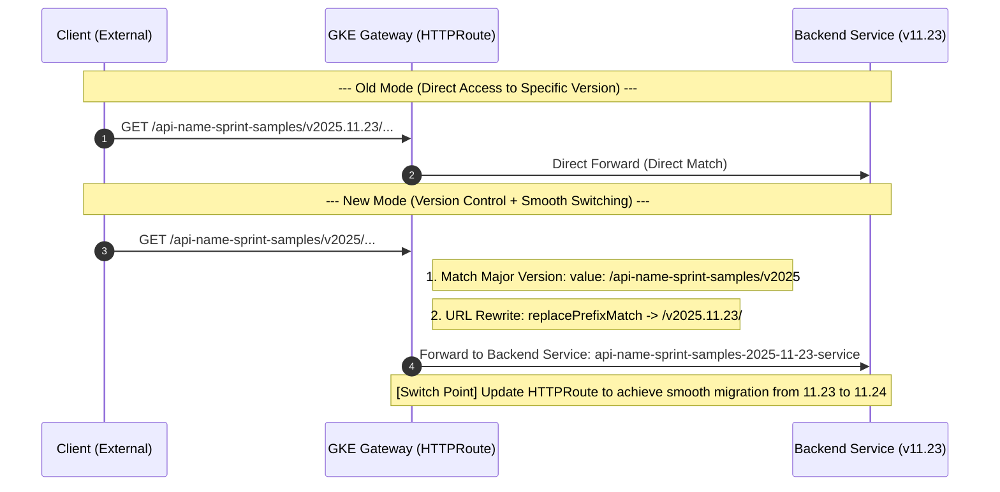
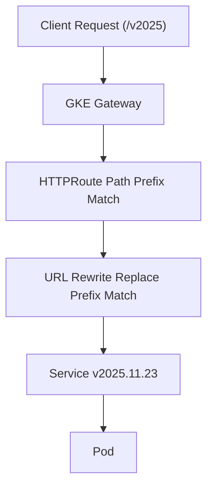
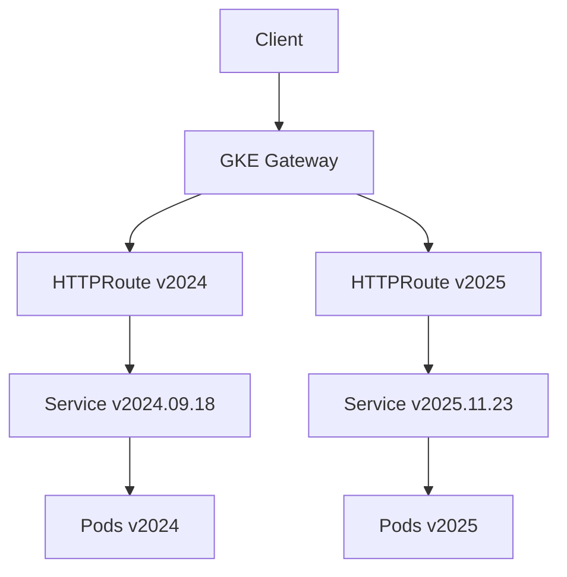
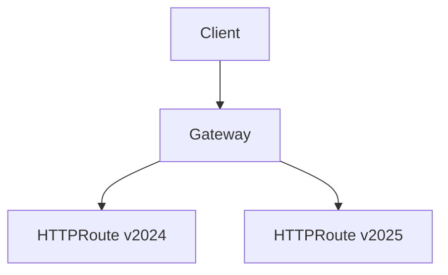
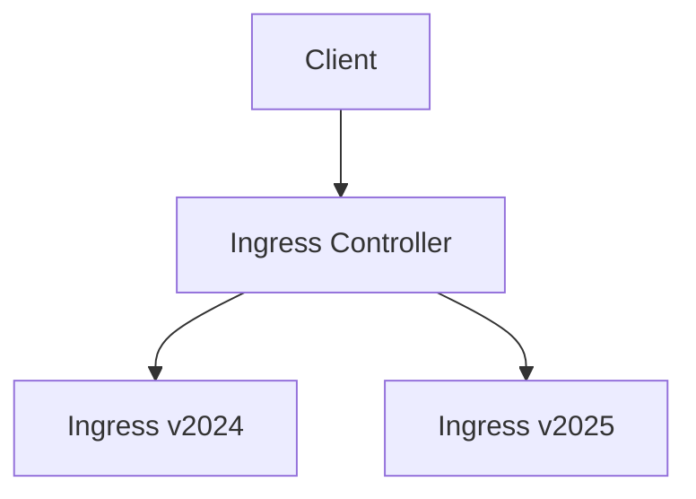

# GKE Gateway API Version Control Configuration Review

- Old HTTPRoute

```yaml
apiVersion: gateway.networking.k8s.io/v1
kind: HTTPRoute
metadata:
  name: api-name-sprint-samples-route-v2025
  namespace: caep-int-common
spec:
  hostnames:
  - env-region.aliyun.cloud.uk.aibang
  parentRefs:
  - group: gateway.networking.k8s.io
    kind: Gateway
    name: abjx-int-gkegateway-ns
    namespace: abjx-int-gkegateway-ns
  rules:
  - matches:
    - path:
        type: PathPrefix
        value: /api-name-sprint-samples
    backendRefs:
    - group: ""
      kind: Service
      name: api-name-sprint-samples-2025-11-23-service
      port: 8443
      weight: 1
```
- URL is
- https://env-region.aliyun.cloud.uk.aibang/api-name-sprint-samples/v2025.11.23/.well-known/healthcheck
- We want to add version control in the URL
- Change URL to
- https://env-region.aliyun.cloud.uk.aibang/api-name-sprint-samples/v2025/.well-known/healthcheck
Below is the corresponding configuration. I have tested it simply and it works.
```yaml
apiVersion: gateway.networking.k8s.io/v1
kind: HTTPRoute
metadata:
  name: api-name-sprint-samples-route-v2025
  namespace: caep-int-common
spec:
  hostnames:
  - env-region.aliyun.cloud.uk.aibang
  parentRefs:
  - group: gateway.networking.k8s.io
    kind: Gateway
    name: abjx-int-gkegateway-ns
    namespace: abjx-int-gkegateway-ns
  rules:
  - matches:
    - path:
        type: PathPrefix
        value: /api-name-sprint-samples/v2025
    filters:
    - type: URLRewrite
      urlRewrite:
        path:
          type: ReplacePrefixMatch
          replacePrefixMatch: /api-name-sprint-samples/v2025.11.23/
    backendRefs:
    - group: ""
      kind: Service
      name: api-name-sprint-samples-2025-11-23-service
      port: 8443
      weight: 1
```
- Below is the core problem to solve.
- Need to introduce "major version v2025" at the routing layer, allowing both external and internal requests to access by version and enable smooth switching.
- Traffic switching: Deploy the new version first (Service/Deployment + HealthCheckPolicy + GCPBackendPolicy), confirm health before updating HTTPRoute
- Here I can give a simple example. Say I currently have version 11.23 running, and if I have a 11.24 version coming, I need to first create the corresponding resources for 11.24, then ensure they are healthy before updating the old HTTPRoute, such as updating replacePrefixMatch
- Then I need to ensure high availability throughout the entire process, ensuring the original service remains normally available, and then the new service starts before doing the corresponding replacement. How do I ensure the entire process is smooth
- Because for this address https://env-region.aliyun.cloud.uk.aibang/api-name-sprint-samples/v2025/.well-known/healthcheck, from the link alone it may not be possible to see its corresponding final service, and in this process I have a concept of switching services.

---

## 🏁 Version Evolution Architecture Transformation

From "hardcoded paths" to "version abstraction", request flows and configuration adjustment points:



---


### HTTPRoute


---
```bash
Please help verify this configuration. For GKE Gateway support for rewriting, is this best practice?
How to successfully verify the gateway is ready? Because my goal is to archive version control. This is my API pattern. I think including version in the API URL is standard configuration.
```
Below is the GKE Gateway API-oriented review for HTTPRoute, including best practice guidance, rewrite semantics clarification, and specific verification steps to ensure the gateway is ready and routes as expected.

---

## 1️⃣ Problem Analysis

Goal:
- Use API version control in URL (good practice)
- Expose stable external API version `/api-name-sprint-samples/v2025`
- Route internally to finer-grained release versions
  - `/api-name-sprint-samples/v2025` -> `/api-name-sprint-samples/v2025.11.23/`
- If upgrading version, for example from 11.23 to 11.24, then
  - `/api-name-sprint-samples/v2025` -> `/api-name-sprint-samples/v2025.11.24`
- Then we update the corresponding fields in HTTPRoute configuration
  - `replacePrefixMatch`
  - `backendRefs`
- Use GKE Gateway (Gateway API) instead of traditional Ingress

This aligns well with modern API platform design.

---

## 2️⃣ Configuration Review (Is this effective and best practice?)

### ‚úÖ What You Did Right

| Domain | Assessment |
|------|------------|
| Gateway API | ‚úÖ Correctly using HTTPRoute |
| Versioned URL | ‚úÖ Version in path is industry standard |
| Rewrite Usage | ‚úÖ URLRewrite + ReplacePrefixMatch correct |
| Service Isolation | ‚úÖ Each release version has backend service |
| Namespace Separation | ‚úÖ parentRefs cross-namespace supported |

---

### ⚠️ Important Semantics Clarification (Very Important)

Current rewrite:

```yaml
matches:
- path:
    type: PathPrefix
    value: /api-name-sprint-samples/v2025
urlRewrite:
  path:
    type: ReplacePrefixMatch
    replacePrefixMatch: /api-name-sprint-samples/v2025.11.23/
```

### üîç What Actually Happens

| Client Request | Upstream Sent |
|----------------|---------------|
| /.../v2025 | /.../v2025.11.23/ |
| /.../v2025/health | /.../v2025.11.23/health |

‚úÖ This is correct and expected behavior

This pattern is explicitly recommended for:
- Semantic version abstraction
- Backend release iteration
- Zero-downtime upgrades

---

## 3️⃣ Best Practice Recommendations (Production-Level)

### ‚úÖ Recommendation 1: Keep Major Version Stable

Your approach is correct:

- External: v2025
- Internal: v2025.11.23

This provides you:
- Backward compatibility
- Freedom for internal patches
- Safe rollback

---

### ‚úÖ Recommendation 2: Add Header-Based Version Tracking (Optional but Recommended)

Add response headers to simplify debugging:

```yaml
filters:
- type: URLRewrite
  urlRewrite:
    path:
      type: ReplacePrefixMatch
      replacePrefixMatch: /api-name-sprint-samples/v2025.11.23/
- type: ResponseHeaderModifier
  responseHeaderModifier:
    add:
    - name: X-Backend-Version
      value: "v2025.11.23"
```

This helps:
- Operations debugging
- Traffic validation
- Event analysis

---

### ‚úÖ Recommendation 3: Avoid Using Patch Versions in External Contracts

You already follow this rule ‚úî
Never expose v2025.11.23 externally.

---

## 4️⃣ How to Verify Gateway and Route Readiness (Correct Method)

### Step 1️⃣ Verify Gateway Status

```bash
kubectl get gateway abjx-int-gkegateway-ns -n abjx-int-gkegateway-ns -o yaml
```

You must see:

```yaml
status:
  conditions:
  - type: Ready
    status: "True"
```

If not ready ‚Üí Routes will never attach

---

### Step 2️⃣ Verify HTTPRoute Attachment

```bash
kubectl get httproute \
  api-name-sprint-samples-route-v2025 \
  -n caep-int-common -o yaml
```

Look for:

```yaml
status:
  parents:
  - parentRef:
      name: abjx-int-gkegateway-ns
    conditions:
    - type: Accepted
      status: "True"
    - type: ResolvedRefs
      status: "True"
```

| Condition | Meaning |
|-----------|---------|
| Accepted | Gateway accepts route |
| ResolvedRefs | Services and ports resolved |

---

### Step 3️⃣ Verify Backend Services and Endpoints

```bash
kubectl get svc api-name-sprint-samples-2025-11-23-service -n caep-int-common
kubectl get endpoints api-name-sprint-samples-2025-11-23-service -n caep-int-common
```

Endpoints must not be empty

---

### Step 4️⃣ Functional Testing (curl)

```bash
curl -vk \
  https://env-region.aliyun.cloud.uk.aibang/api-name-sprint-samples/v2025/health
```

Expected:
- HTTP 200
- Backend logs showing path: `/api-name-sprint-samples/v2025.11.23/health`

---

## 5️⃣ Traffic Flow (Mermaid Chart)



---

## 6️⃣ Final Conclusion

‚úÖ Is this best practice?

Yes — This is textbook Gateway API version control pattern

‚úÖ Is URL versioning standard?

Yes — Path-based versioning remains most interoperable approach

‚úÖ Is rewrite the right tool?

Yes — Especially for controlled releases and rollbacks

---

If you need, next we can:
- Design canary routes (weighting)
- Add header-based version routing
- Compare with Ingress / Kong behavior
- Design multi-major version coexistence (v2024 + v2025)

Tell me please üëç

---

# Multi-Major Version Coexistence Design

Below is the production-level design for multi-major version coexistence using GKE Gateway API, covering routing strategies, YAML examples, traffic flows, and validation.

This design allows v2024 and v2025 to run simultaneously, with independent deployment, safe rollback, and scalability.

---

## 1️⃣ Problem Analysis

You want to support:

- `/api-name-sprint-samples/v2024/**`
- `/api-name-sprint-samples/v2025/**`

Goal:
- Maintain major version isolation
- Allow independent patch releases
- Avoid breaking clients
- Enable canary/releases/rollback
- Use Gateway API best practices

---

## 2️⃣ Recommended Architecture (High Level)

### Core Principles

| Layer | Responsibility |
|-------|----------------|
| Gateway | TLS, L7 entry |
| HTTPRoute (per major version) | Version contract |
| Service (per patch) | Release isolation |
| Deployment | Actual workload |

---

## 3️⃣ Routing Strategy (Best Practice)

‚úî One HTTPRoute per major version

This is the most important rule.

- HTTPRoute-v2024
- HTTPRoute-v2025

Reasons:
- Independent lifecycle
- Clean rollback
- Clear ownership
- No accidental override

---

## 4️⃣ YAML Design

### 4.1 HTTPRoute – v2024 (Stable)

```yaml
apiVersion: gateway.networking.k8s.io/v1
kind: HTTPRoute
metadata:
  name: vsit-samples-route-v2024
  namespace: caep-int-common
spec:
  hostnames:
  - env-region.aliyun.cloud.uk.aibang
  parentRefs:
  - group: gateway.networking.k8s.io
    kind: Gateway
    name: abjx-int-gkegateway-ns
    namespace: abjx-int-gkegateway-ns
  rules:
  - matches:
    - path:
        type: PathPrefix
        value: /api-name-sprint-samples/v2024
    filters:
    - type: URLRewrite
      urlRewrite:
        path:
          type: ReplacePrefixMatch
          replacePrefixMatch: /api-name-sprint-samples/v2024.09.18/
    - type: ResponseHeaderModifier
      responseHeaderModifier:
        add:
        - name: X-API-Major-Version
          value: "v2024"
        - name: X-API-Backend-Version
          value: "v2024.09.18"
    backendRefs:
    - name: vsit-samples-2024-09-18-service
      port: 8443
```

---

### 4.2 HTTPRoute – v2025 (Current)

```yaml
apiVersion: gateway.networking.k8s.io/v1
kind: HTTPRoute
metadata:
  name: vsit-samples-route-v2025
  namespace: caep-int-common
spec:
  hostnames:
  - env-region.aliyun.cloud.uk.aibang
  parentRefs:
  - group: gateway.networking.k8s.io
    kind: Gateway
    name: abjx-int-gkegateway-ns
    namespace: abjx-int-gkegateway-ns
  rules:
  - matches:
    - path:
        type: PathPrefix
        value: /api-name-sprint-samples/v2025
    filters:
    - type: URLRewrite
      urlRewrite:
        path:
          type: ReplacePrefixMatch
          replacePrefixMatch: /api-name-sprint-samples/v2025.11.23/
    - type: ResponseHeaderModifier
      responseHeaderModifier:
        add:
        - name: X-API-Major-Version
          value: "v2025"
        - name: X-API-Backend-Version
          value: "v2025.11.23"
    backendRefs:
    - name: vsit-samples-2025-11-23-service
      port: 8443
```

---

## 5️⃣ Traffic Flow (Mermaid)



---

## 6️⃣ Canary Upgrades Within Same Major Version

Example: Upgrade v2025.11.23 ‚Üí v2025.12.01

```yaml
backendRefs:
- name: vsit-samples-2025-11-23-service
  port: 8443
  weight: 90
- name: vsit-samples-2025-12-01-service
  port: 8443
  weight: 10
```

‚úî No client changes
‚úî Safe release
‚úî Instant rollback

---

## 7️⃣ How to Verify (End-to-End)

### 7.1 Route Attachment

```bash
kubectl get httproute -n caep-int-common

kubectl describe httproute vsit-samples-route-v2025 -n caep-int-common
```

---

### 7.2 Functional Testing

```bash
curl -vk https://env-region.aliyun.cloud.uk.aibang/api-name-sprint-samples/v2024/health

curl -vk https://env-region.aliyun.cloud.uk.aibang/api-name-sprint-samples/v2025/health
```

Check response headers:
- X-API-Major-Version
- X-API-Backend-Version

---

## 8️⃣ Version Coexistence Rules (Hard Rules)

| Rule | Reason |
|------|--------|
| One major version = One HTTPRoute | Prevent conflicts |
| Never backward rewrite | Avoid breakage |
| Major version is immutable | Contract stability |
| Patch versions are internal | Release freedom |
| Always expose version headers | Observability |

---

## 9️⃣ When to Deprecate v2024

Recommended process:
1. Announce deprecation date
2. Add response header: `X-API-Deprecated: true`
3. Gradually reduce traffic
4. Remove only HTTPRoute (not gateway)

---

## üîö Final Conclusion

This design provides you:

‚úÖ Clear major version coexistence
‚úÖ Safe evolution
‚úÖ Zero-downtime releases
‚úÖ Clear ownership
‚úÖ Gateway-native semantics

If you need, next I can:
- Design default version fallback
- Add redirect v2024 ‚Üí v2025
- Integrate Kong-style version routing
- Design OpenAPI + Gateway alignment

Tell me which one.

---

# Comparison with Ingress

Below is a clear, production-oriented comparison of multi-major API version coexistence between Gateway API and Ingress, along with practical Ingress designs to achieve the same results when GKE Gateway is unavailable.

I will strictly remain in the Ingress controller domain (NGINX Ingress style), as this is the reality constraint in many non-GKE environments.

---

## 1️⃣ Problem Analysis

You want to achieve the same goals as Gateway API:
- `/v2024/**` and `/v2025/**` coexist
- Stable external contracts
- Internal patch-level routing
- Safe release/rollback
- Version isolation
- Minimal client impact

But only Ingress controllers are available.

---

## 2️⃣ Gateway API vs Ingress (Conceptual Comparison)

| Dimension | Gateway API | Ingress |
|-----------|-------------|---------|
| API Maturity | New, expressive | Traditional, stable |
| Version Isolation | Native (multiple HTTPRoute) | Manual (path + rules) |
| Rewrite Support | First-class (URLRewrite) | Controller-specific |
| Traffic Splitting | Native weights | Annotation black magic |
| Cross-Namespace | Native | Difficult/unsafe |
| Observability | Structured status | Logs only |
| Portability | High | Low (NGINX specific) |

Key point:
Ingress can do it — but you must manually enforce discipline.

---

## 3️⃣ Best Practice Ingress Design (Equivalent to Gateway API)

Core Rule (Very Important)

One major version = One Ingress object

This mimics the Gateway API mental model.

---

## 4️⃣ Ingress Design – v2024

### 4.1 Ingress YAML (NGINX Ingress)

```yaml
apiVersion: networking.k8s.io/v1
kind: Ingress
metadata:
  name: vsit-samples-ingress-v2024
  namespace: caep-int-common
  annotations:
    nginx.ingress.kubernetes.io/use-regex: "true"
    nginx.ingress.kubernetes.io/rewrite-target: /api-name-sprint-samples/v2024.09.18/$2
    nginx.ingress.kubernetes.io/configuration-snippet: |
      add_header X-API-Major-Version v2024 always;
      add_header X-API-Backend-Version v2024.09.18 always;
spec:
  ingressClassName: nginx
  rules:
  - host: env-region.aliyun.cloud.uk.aibang
    http:
      paths:
      - path: /api-name-sprint-samples/v2024(/|$)(.*)
        pathType: ImplementationSpecific
        backend:
          service:
            name: vsit-samples-2024-09-18-service
            port:
              number: 8443
```

---

## 5️⃣ Ingress Design – v2025

```yaml
apiVersion: networking.k8s.io/v1
kind: Ingress
metadata:
  name: vsit-samples-ingress-v2025
  namespace: caep-int-common
  annotations:
    nginx.ingress.kubernetes.io/use-regex: "true"
    nginx.ingress.kubernetes.io/rewrite-target: /api-name-sprint-samples/v2025.11.23/$2
    nginx.ingress.kubernetes.io/configuration-snippet: |
      add_header X-API-Major-Version v2025 always;
      add_header X-API-Backend-Version v2025.11.23 always;
spec:
  ingressClassName: nginx
  rules:
  - host: env-region.aliyun.cloud.uk.aibang
    http:
      paths:
      - path: /api-name-sprint-samples/v2025(/|$)(.*)
        pathType: ImplementationSpecific
        backend:
          service:
            name: vsit-samples-2025-11-23-service
            port:
              number: 8443
```

---

## 6️⃣ Traffic Flow Comparison

### Gateway API



### Ingress



Same result — Different security guarantees

---

## 7️⃣ Canary Release Comparison

### Gateway API (Clean)

```yaml
backendRefs:
- name: svc-2025-11-23
  weight: 90
- name: svc-2025-12-01
  weight: 10
```

### Ingress (NGINX Workaround)

```
nginx.ingress.kubernetes.io/canary: "true"
nginx.ingress.kubernetes.io/canary-weight: "10"
```

‚û° Requires two Ingress objects
‚û° Controller specific
‚û° Harder rollback discipline

---

## 8️⃣ Verification Comparison

### Gateway API

```bash
kubectl get httproute
kubectl describe httproute
```

You get:
- Accepted
- ResolvedRefs
- Ready

---

### Ingress

```bash
kubectl describe ingress vsit-samples-ingress-v2025
```

You rely on:
- Events
- Logs
- Trial traffic

‚ùå No real "ready" signal

---

## 9️⃣ Ingress Risks (Need Attention)

| Risk | Mitigation |
|------|------------|
| Regex rewrite errors | Keep path regex minimal |
| Annotation drift | Centralize templates |
| Controller lock-in | Document assumptions |
| Rule shadowing | One version = One Ingress |
| Poor observability | Add response headers |

---

## üîü Final Recommendation Matrix

| Scenario | Recommendation |
|----------|-------------|
| GKE / Modern Platform | Gateway API |
| Multi-cloud | Gateway API |
| Legacy Cluster | Ingress |
| High Change Rate | Gateway API |
| Simple API | Ingress OK |

---

## üîö Bottom Line

Ingress can achieve 90% of Gateway API version control capabilities — but only under strict conventions.

If you need, next we can:
- Build shared Ingress templates
- Design Ingress ‚Üí Gateway migration
- Compare Ingress with Kong Ingress
- Add redirect v2024 ‚Üí v2025

Tell me which path.