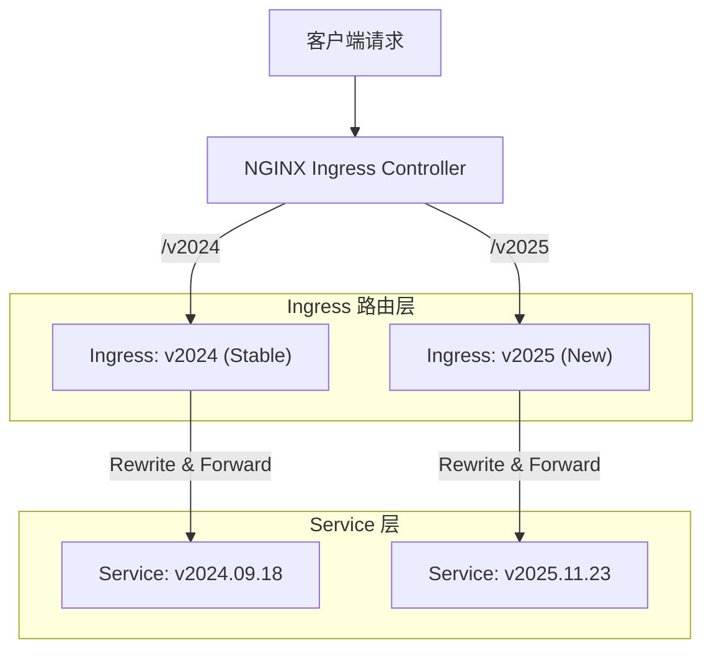

# OpenSource Ingress (NGINX) API 版本控制与平滑发布指南

本文档详细阐述如何在**不使用 Gateway API** 的情况下，利用标准的开源 **NGINX Ingress Controller** 实现 API 的多版本控制（Version Control）和基于权重的平滑灰度发布（Canary Release）。

---

## 1. 核心设计理念

在 Ingress 体系下，为了实现类似 GKE Gateway 的精细化版本控制，我们需要通过**"拆分 Ingress 对象"**和**"利用 Annotation 重写"**来达成目标。

### 关键原则

| 原则 | 说明 |
| :--- | :--- |
| **One Major, One Ingress** | 每个大版本（如 `/v1`, `/v2` 或 `/v2024`, `/v2025`）使用独立的 Ingress 对象管理 |
| **Rewrite Target** | 使用 `rewrite-target` 注解将外部版本路径映射到内部的具体 Release 版本 |
| **Canary Annotation** | 使用标准的 NGINX Canary 注解实现同版本下的平滑升级（如 `v1.1` -> `v1.2`） |

---

## 2. 架构流程图



---

## 3. 实施步骤：多版本共存

假设我们需要同时支持 `v2024`（稳定版）和 `v2025`（新版）。

### 3.1 部署 Stable 版本 (v2024)

此 Ingress 负责处理 `/api/v2024` 的流量，并将其转发到后端的 `v2024.09.18` 具体版本。

```yaml
apiVersion: networking.k8s.io/v1
kind: Ingress
metadata:
  name: api-ingress-v2024
  namespace: prod-ns
  annotations:
    kubernetes.io/ingress.class: nginx
    # 启用正则匹配
    nginx.ingress.kubernetes.io/use-regex: "true"
    # 重写规则：去掉 /api/v2024 前缀，保留后续路径，并拼接到内部版本路径后
    nginx.ingress.kubernetes.io/rewrite-target: /api/v2024.09.18/$2
    # 添加响应头便于调试
    nginx.ingress.kubernetes.io/configuration-snippet: |
      add_header X-API-Major-Version "v2024" always;
      add_header X-Backend-Version "v2024.09.18" always;
spec:
  rules:
  - host: api.example.com
    http:
      paths:
      - path: /api/v2024(/|$)(.*)
        pathType: ImplementationSpecific
        backend:
          service:
            name: service-v2024-09-18
            port:
              number: 80
```

### 3.2 部署 New 版本 (v2025)

同理，部署 `v2025` 的 Ingress，指向新的 Service。

```yaml
apiVersion: networking.k8s.io/v1
kind: Ingress
metadata:
  name: api-ingress-v2025
  namespace: prod-ns
  annotations:
    kubernetes.io/ingress.class: nginx
    nginx.ingress.kubernetes.io/use-regex: "true"
    # 不同的大版本指向不同的内部路径
    nginx.ingress.kubernetes.io/rewrite-target: /api/v2025.11.23/$2
    nginx.ingress.kubernetes.io/configuration-snippet: |
      add_header X-API-Major-Version "v2025" always;
      add_header X-Backend-Version "v2025.11.23" always;
spec:
  rules:
  - host: api.example.com
    http:
      paths:
      - path: /api/v2025(/|$)(.*)
        pathType: ImplementationSpecific
        backend:
          service:
            name: service-v2025-11-23
            port:
              number: 80
```

---

## 4. 进阶场景：平滑灰度发布 (Canary)

当你需要在**同一个大版本**内进行更新（例如 `v2025.11.23` -> `v2025.12.01`）时，应使用 Canary Ingress。

**场景**：将 10% 的流量切分到 `v2025.12.01`。

### 4.1 创建 Canary Ingress

**注意**：Canary Ingress 的 `host` 和 `path` 必须与主 Ingress (`api-ingress-v2025`) 完全一致。

```yaml
apiVersion: networking.k8s.io/v1
kind: Ingress
metadata:
  name: api-ingress-v2025-canary
  namespace: prod-ns
  annotations:
    kubernetes.io/ingress.class: nginx
    nginx.ingress.kubernetes.io/use-regex: "true"
    # 标记为 Canary
    nginx.ingress.kubernetes.io/canary: "true"
    # 设置 10% 权重
    nginx.ingress.kubernetes.io/canary-weight: "10"
    # Canary 版本的重写目标
    nginx.ingress.kubernetes.io/rewrite-target: /api/v2025.12.01/$2
    nginx.ingress.kubernetes.io/configuration-snippet: |
      add_header X-API-Major-Version "v2025" always;
      add_header X-Backend-Version "v2025.12.01-canary" always;
spec:
  rules:
  - host: api.example.com
    http:
      paths:
      - path: /api/v2025(/|$)(.*)
        pathType: ImplementationSpecific
        backend:
          service:
            name: service-v2025-12-01  # 新版本 Service
            port:
              number: 80
```

### 4.2 验证 Canary

使用 `curl` 循环访问，检查 Header 变化：

```bash
for i in {1..20}; do 
  curl -sI https://api.example.com/api/v2025/health | grep "X-Backend-Version"
done
```

**预期输出**：
大约有 2 次输出 `v2025.12.01-canary`，其余为 `v2025.11.23`。

---

## 5. 对比总结

| 功能 | Gateway API (推荐但非必须) | OpenSource Ingress (本方案) |
| :--- | :--- | :--- |
| **版本隔离** | 通过不同的 `HTTPRoute` 资源 | 通过不同的 `Ingress` 资源 |
| **路径重写** | `URLRewrite` Filter (标准) | `rewrite-target` Annotation (NGINX 特有) |
| **流量切分** | `weight` 字段 (原生支持) | `canary` Annotation (需额外 Ingress 对象) |
| **可观测性** | 状态字段清晰 | 依赖 Logs 和 Headers |

**结论**：
使用 OpenSource NGINX Ingress 完全可以实现生产级的 API 版本控制和平滑发布，虽然配置上比 Gateway API 稍显繁琐（主要是 Canary 部分），但在不支持 Gateway API 的存量集群中是**最佳实践**。
