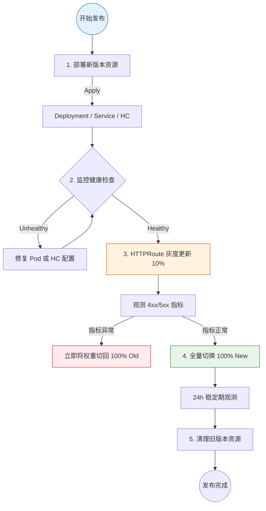
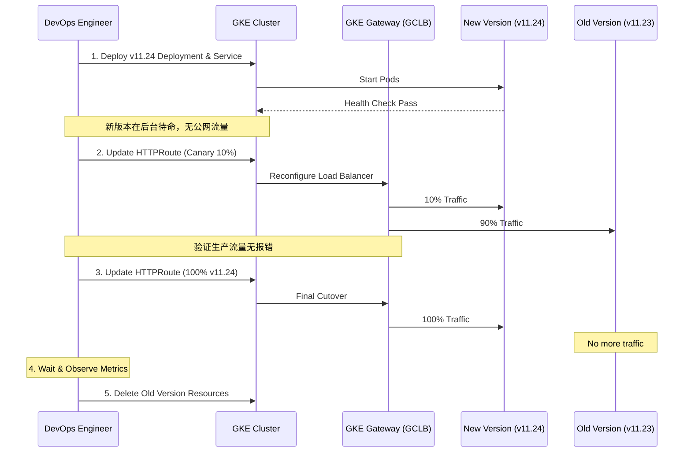

- [GKE Gateway API 平滑版本切换与验证最佳实践](#gke-gateway-api-平滑版本切换与验证最佳实践)
  - [1. 路径冲突评估 (Same Path Conflict)](#1-路径冲突评估-same-path-conflict)
    - [❓ 核心问题](#-核心问题)
    - [🔍 Gateway API 冲突解决规则](#-gateway-api-冲突解决规则)
    - [💡 Concrete Example: Longest Match](#-concrete-example-longest-match)
    - [💡 Concrete Example: Identical Match (完全一致冲突)](#-concrete-example-identical-match-完全一致冲突)
      - [情况 A：在同一个 HTTPRoute 文件中定义了多条规则](#情况-a在同一个-httproute-文件中定义了多条规则)
      - [情况 B：在不同的 HTTPRoute 文件中定义了相同的路径](#情况-b在不同的-httproute-文件中定义了相同的路径)
      - [✅ 最佳实践建议](#-最佳实践建议)
    - [⚠️ 风险评估](#️-风险评估)
  - [2. 零停机平滑切换流程 (Zero-Downtime Workflow)](#2-零停机平滑切换流程-zero-downtime-workflow)
    - [阶段 1：预部署与就绪](#阶段-1预部署与就绪)
    - [阶段 2：内部灰度验证 (Optional)](#阶段-2内部灰度验证-optional)
    - [阶段 3：原子化流量切换](#阶段-3原子化流量切换)
    - [阶段 4：观测与清理](#阶段-4观测与清理)
  - [3. 验证机制 (Validation Methodology)](#3-验证机制-validation-methodology)
    - [🛠 验证手段对比](#-验证手段对比)
    - [示例：添加版本追踪头](#示例添加版本追踪头)
  - [4. 版本切换执行全景图](#4-版本切换执行全景图)
    - [4.1 逻辑流程分解](#41-逻辑流程分解)
    - [4.2 流量平移时序图](#42-流量平移时序图)
  - [5. 总结建议](#5-总结建议)
  - [6. 高可用评估：同一个 HTTPRoute 还是新建？](#6-高可用评估同一个-httproute-还是新建)
    - [❓ 用户深度疑问](#-用户深度疑问)
    - [💡 核心评估与回答](#-核心评估与回答)
      - [1. 为什么“新建 HTTPRoute”在 HA 场景下不可行？](#1-为什么新建-httproute在-ha-场景下不可行)
      - [2. “在同一个 HTTPRoute 更改”如何确保高可用？](#2-在同一个-httproute-更改如何确保高可用)
      - [3. 推荐的 HA 切换闭环](#3-推荐的-ha-切换闭环)
      - [🛡️ 最终建议](#️-最终建议)

# GKE Gateway API 平滑版本切换与验证最佳实践

本指南旨在解决在 GKE Gateway API 环境下，如何实现 API 版本的平滑切换（零停机时间），并深入探讨路径冲突评估及多版本验证方案。

---

## 1. 路径冲突评估 (Same Path Conflict)

### ❓ 核心问题
如果我有两个 `HTTPRoute`，其 `matches.path.value` 都是 `/api-name-sprint-samples/v2025`，会发生什么？

### 🔍 Gateway API 冲突解决规则
当多个 `HTTPRoute` 规则匹配同一个请求时，GKE Gateway 遵循以下优先级：
1.  **最长路径优先 / 最全匹配优先 (Most Specific Match Wins)**: 虽然路径相同，但如果一个规则包含更多匹配条件（如 Header），它将胜出。
2.  **创建时间优先 (Oldest Wins)**: 如果两个规则路径完全相同且匹配条目权重一致，通常**最早创建**的规则会生效。

### 💡 Concrete Example: Longest Match
假设你现在有两个规则配置，它们都指向同一个路径 `/api-name-sprint-samples/v2025`：

```yaml
rules:
# 规则 A: 仅路径匹配 (General Match)
- matches:
  - path:
      type: PathPrefix
      value: /api-name-sprint-samples/v2025
  backendRefs:
  - name: service-v11-23
    port: 8443

# 规则 B: 路径匹配 + Header 匹配 (Specific Match)
- matches:
  - path:
      type: PathPrefix
      value: /api-name-sprint-samples/v2025
    headers:
    - name: x-version
      value: v11.24
  backendRefs:
  - name: service-v11-24
    port: 8443
```

**行为表现：**
- **场景 1**: 客户端请求 `/api-name-sprint-samples/v2025`，不携带任何特殊 Header。
  - **结果**: 匹配 **规则 A**，流量流向旧版本 `v11.23`。
- **场景 2**: 客户端请求 `/api-name-sprint-samples/v2025`，且携带 Header `x-version: v11.24`。
  - **结果**: 匹配 **规则 B**。虽然路径和规则 A 一样，但规则 B 提供了更具体的匹配条件（Header），因此它在优先级上**优于**规则 A。

### 💡 Concrete Example: Identical Match (完全一致冲突)
如果两个配置里面**路径完全一样**（如 `/api-name-sprint-samples/v2025`），且**都没有 Header**，但指向了**不同的 Backend Service**，会发生什么？

#### 情况 A：在同一个 HTTPRoute 文件中定义了多条规则
```yaml
rules:
- matches:
  - path: { type: PathPrefix, value: /v2025 }
  backendRefs: [{ name: service-A }]  # 规则 1
- matches:
  - path: { type: PathPrefix, value: /v2025 }
  backendRefs: [{ name: service-B }]  # 规则 2
```
- **处理规则**: **首位匹配优先 (First Match Wins)**。
- **结果**: 流量会全部流向 `service-A`。规则 2 虽然定义了，但因为路径匹配逻辑在规则 1 就已经完成并返回，规则 2 实际上被**屏蔽 (Shadowed)** 了。

#### 情况 B：在不同的 HTTPRoute 文件中定义了相同的路径
- **处理规则**: **创建时间优先 (Oldest Wins)**。
- **结果**: 只有最早部署到集群中的那个 `HTTPRoute` 会成功控制该路径。后创建的 `HTTPRoute` 在 `status` 中通常会显示冲突警告，且由于路径被占用而无法生效。

#### ✅ 最佳实践建议
如果你需要将同路径的流量分发到不同的 Service，**不要定义重复的规则**，而是应该使用 **权重 (Weight)**：
```yaml
rules:
- matches:
  - path: { type: PathPrefix, value: /v2025 }
  backendRefs:
  - name: service-A
    weight: 50
  - name: service-B
    weight: 50
```

### ⚠️ 风险评估
- **非确定性路由**: 如果简单创建同名路径的新 `HTTPRoute`，可能会导致流量依然走向旧规则，或者导致 Gateway 控制器产生冲突报警。
- **推荐方案**: **不要新建相同路径的 HTTPRoute**。相反，应该在同一个 `HTTPRoute` 对象内移动 `backendRefs` 权重，或者直接执行 `ReplacePrefixMatch` 的原子更新。

---

## 2. 零停机平滑切换流程 (Zero-Downtime Workflow)

为了确保切换过程平滑无感，建议遵循以下四个阶段：

### 阶段 1：预部署与就绪
1.  **部署新版本应用**: 部署新的 `Deployment` (如 `v2025.11.24`)。
    ```yaml
    apiVersion: apps/v1
    kind: Deployment
    metadata:
      name: api-samples-v2025-11-24
    spec:
      replicas: 3
      selector:
        matchLabels:
          app: api-name-sprint-samples
          version: v2025.11.24
      template:
        metadata:
          labels:
            app: api-name-sprint-samples
            version: v2025.11.24
        spec:
          containers:
          - name: app
            image: gcr.io/proj/api:v2025.11.24
            ports:
            - containerPort: 8443
    ```

2.  **创建后端配套资源**:
    - 创建对应的 `Service`。
    ```yaml
    apiVersion: v1
    kind: Service
    metadata:
      name: api-samples-2025-11-24-service
    spec:
      selector:
        app: api-name-sprint-samples
        version: v2025.11.24
      ports:
      - protocol: TCP
        port: 8443
        targetPort: 8443
    ```
    - 配置 `GCPBackendPolicy` 和 `HealthCheckPolicy` (GKE Gateway 专用)。
    ```yaml
    apiVersion: networking.gke.io/v1
    kind: HealthCheckPolicy
    metadata:
      name: api-samples-hc
    spec:
      default:
        config:
          type: HTTPS
          httpsHealthCheck:
            requestPath: /health
      targetRef:
        group: ""
        kind: Service
        name: api-samples-2025-11-24-service
    ---
    apiVersion: networking.gke.io/v1
    kind: GCPBackendPolicy
    metadata:
      name: api-samples-backend-policy
    spec:
      default:
        timeoutSec: 30
      targetRef:
        group: ""
        kind: Service
        name: api-samples-2025-11-24-service
    ```

3.  **验证端点就绪**: 确保新 Service 的 Endpoints 已经生成且 Pod 通过了 Ready 检查。

### 阶段 2：内部灰度验证 (Optional)
在切换主路由之前，可以通过以下方式验证新版本：
- **Header 路由**: 在 `HTTPRoute` 中临时添加一条带特定 Header（如 `X-Beta-Test: true`）的规则，将测试流量导向新 Service。

### 阶段 3：原子化流量切换
更新正在运行的 `HTTPRoute` 规则：
- **方案 A：金丝雀切流 (权重过渡)**
  ```yaml
  apiVersion: gateway.networking.k8s.io/v1
  kind: HTTPRoute
  metadata:
    name: api-name-sprint-samples-route-v2025
  spec:
    rules:
    - matches:
      - path: { type: PathPrefix, value: /api-name-sprint-samples/v2025 }
      filters:
      - type: URLRewrite
        urlRewrite: { path: { type: ReplacePrefixMatch, replacePrefixMatch: /api-name-sprint-samples/2025.11.24/ } }
      backendRefs:
      - name: api-name-sprint-samples-2025-11-23-service # 旧版
        weight: 90
      - name: api-name-sprint-samples-2025-11-24-service # 新版
        weight: 10
  ```
- **方案 B：原子更新 (直接全量替换)**
  直接修改 `ReplacePrefixMatch` 和 `backendRefs` 的 `name`。由于 `kubectl apply` 是原子操作，API Server 会一次性下发完整配置。
  ```yaml
  # 执行命令：kubectl apply -f httproute-v2025.yaml
  backendRefs:
  - name: api-name-sprint-samples-2025-11-24-service
    port: 8443
    weight: 1
  ```

### 阶段 4：观测与清理
1.  **检查指标**: 监控错误率 (4xx/5xx) 和延迟。
2.  **清理资源**: 确认稳定运行 24 小时后，删除旧版本的 `Service` 和 `Deployment`。

---

## 3. 验证机制 (Validation Methodology)

如何确保新版本在“幕后”是健康的且切换已生效？

### 🛠 验证手段对比

| 验证维度 | 工具/命令 | 预期结果 |
| :--- | :--- | :--- |
| **Gateway 挂载** | `kubectl get httproute <name> -o jsonpath='{.status.parents[0].conditions}'` | `Accepted: True`, `ResolvedRefs: True` |
| **GCP 后端健康** | `kubectl get gcpbackendpolicy` | 确保后端在 GCP 侧被识别为 Healthy |
| **版本透传验证** | `curl -i https://.../v2025/...` | 建议在 Filter 中添加 `ResponseHeaderModifier` 返回内部版本号 |

### 示例：添加版本追踪头
在 `HTTPRoute` 中加入以下配置，可以在不看日志的情况下确认流量去向：
```yaml
filters:
- type: ResponseHeaderModifier
  responseHeaderModifier:
    add:
    - name: "X-Active-Backend"
      value: "v2025.11.24"
```

---

## 4. 版本切换执行全景图

### 4.1 逻辑流程分解


### 4.2 流量平移时序图


---

## 5. 总结建议

- **避免同名冲突**: 始终通过更新同一个 `HTTPRoute` 规则来管理版本演进，避免路径影子 (Path Shadowing) 问题。
- **利用 URL 重写**: `ReplacePrefixMatch` 是抽象“大版本”和“补丁版本”最强大的武器。
- **可观察性优先**: 始终在负载均衡侧或响应头中暴露内部版本号，这是快速排错的关键。

---

## 6. 高可用评估：同一个 HTTPRoute 还是新建？

### ❓ 用户深度疑问
> 如果我要保持高可用，且能够平滑切换到新的版本，同时路径 `/api-name-sprint-samples/v2025` 保持不变。基于“创建时间优先”规律，如果我新建一个 HTTPRoute，它是不是永远不会生效？我是不是只能在同一个 HTTPRoute 里面更新？

### 💡 核心评估与回答

**结论：在路径完全一致的情况下，你必须在同一个 `HTTPRoute` 中进行更新。**

#### 1. 为什么“新建 HTTPRoute”在 HA 场景下不可行？
如前所述，GKE Gateway 遵循 **Oldest Wins (最早创建者获胜)**。
- 假设你已有一个 `HTTPRoute-Old` 占用了路径 `/v2025`。
- 你创建了一个 `HTTPRoute-New` 也指向路径 `/v2025`。
- **结果**：Gateway 会继续信任 `HTTPRoute-Old`。流量**永远不会**自发流向 `HTTPRoute-New`。
- **结论**：创建新文件对于“同路径切换”是无效的操作。

#### 2. “在同一个 HTTPRoute 更改”如何确保高可用？
当你使用 `kubectl apply` 更新现有的 `HTTPRoute` 时，GKE Gateway (以及底层的 Google Cloud Load Balancer) 会执行**原子化更新 (Atomic Update)**：
- **无状态抖动**：更新配置的过程中，旧的转发规则不会立即消失，直到新的规则在 GFE (Google Front End) 节点上同步完成。
- **平滑平移**：一旦新配置生效，新进入的连接会根据新规则转发。已建立的长连接（如果存在）通常会处理完请求后结束。

#### 3. 推荐的 HA 切换闭环
如果你担心直接原子替换 `Service` 名称风险太大，最佳的 HA 实践是**两步权重法**：

1.  **保持 HTTPRoute 文件名不变**。
2.  **配置权重比例**：
    ```yaml
    # 第一步：新旧共存，验证健康
    backendRefs:
    - name: service-v11-23  # 旧版
      weight: 100
    - name: service-v11-24  # 新版
      weight: 0             # 0 权重但已在配置中，确保后端挂载到负载均衡器
    ```
3.  **灰度切流**：将新版权重逐步调大（10 -> 50 -> 100），旧版调小。这保证了如果新版有问题，可以秒级回滚。

#### 🛡️ 最终建议
对于 **PathPrefix 不变** 的版本升级：
- **必须**使用同一个 `HTTPRoute` 对象进行更新。
- **必须**先部署新版本的后端资源（Deployment/Service），并确认健康。
- **推荐**使用 `backendRefs` 权限比例控制来实现物理意义上的“平滑切换”。
