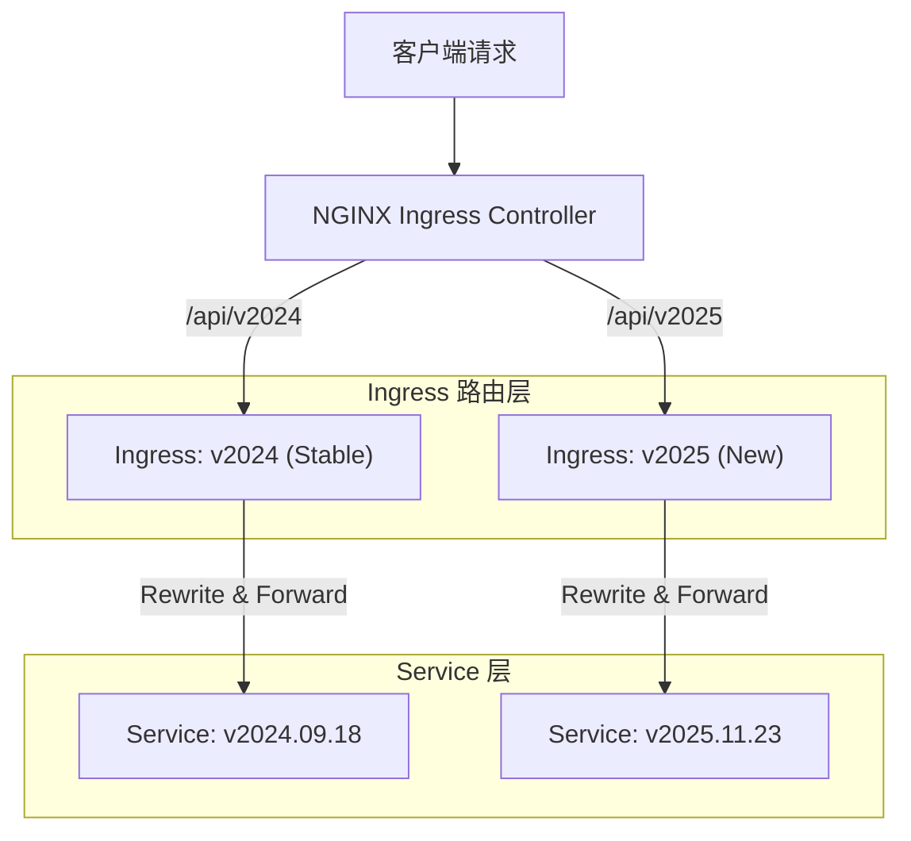

# NGINX Ingress Controller API 版本控制与灰度发布完全指南

本文档详细介绍如何在**不使用 Gateway API** 的情况下，利用标准的开源 **NGINX Ingress Controller** 实现 API 的多版本控制（Version Control）和基于权重的平滑灰度发布（Canary Release）。

---

## 1. 核心理念与设计原则

在 Ingress 体系下，要实现类似 Gateway API 的精细化版本控制，我们需要通过以下策略：

### 关键原则

| 原则 | 说明 |
| :--- | :--- |
| **One Major, One Ingress** | 每个大版本（如 `/v1`, `/v2` 或 `/v2024`, `/v2025`）使用独立的 Ingress 对象管理 |
| **Rewrite Target** | 使用 `rewrite-target` 注解将外部版本路径映射到内部的具体 Release 版本 |
| **Canary Annotation** | 使用标准的 NGINX Canary 注解实现同版本下的平滑升级（如 `v1.1` -> `v1.2`） |
| **Path Priority** | 利用 NGINX 的路径匹配优先级机制确保精确路由 |

---

## 2. 架构流程图



---

## 3. 实施步骤详解

### 3.1 多版本共存策略

#### 3.1.1 部署 Stable 版本 (v2024)

此 Ingress 负责处理 `/api/v2024` 的流量，并将其转发到后端的 `v2024.09.18` 具体版本。

```yaml
apiVersion: networking.k8s.io/v1
kind: Ingress
metadata:
  name: api-ingress-v2024
  namespace: prod-ns
  annotations:
    kubernetes.io/ingress.class: nginx
    # 启用正则匹配以支持复杂的路径重写
    nginx.ingress.kubernetes.io/use-regex: "true"
    # 重写规则：去掉 /api/v2024 前缀，保留后续路径，并拼接到内部版本路径后
    nginx.ingress.kubernetes.io/rewrite-target: /api/v2024.09.18/$2
    # 添加响应头便于调试和监控
    nginx.ingress.kubernetes.io/configuration-snippet: |
      add_header X-API-Major-Version "v2024" always;
      add_header X-Backend-Version "v2024.09.18" always;
      add_header X-Routed-By "Main-Ingress" always;
spec:
  rules:
  - host: api.example.com
    http:
      paths:
      - path: /api/v2024(/|$)(.*)
        pathType: ImplementationSpecific
        backend:
          service:
            name: service-v2024-09-18
            port:
              number: 80
```

#### 3.1.2 部署 New 版本 (v2025)

同理，部署 `v2025` 的 Ingress，指向新的 Service。

```yaml
apiVersion: networking.k8s.io/v1
kind: Ingress
metadata:
  name: api-ingress-v2025
  namespace: prod-ns
  annotations:
    kubernetes.io/ingress.class: nginx
    nginx.ingress.kubernetes.io/use-regex: "true"
    # 不同的大版本指向不同的内部路径
    nginx.ingress.kubernetes.io/rewrite-target: /api/v2025.11.23/$2
    nginx.ingress.kubernetes.io/configuration-snippet: |
      add_header X-API-Major-Version "v2025" always;
      add_header X-Backend-Version "v2025.11.23" always;
      add_header X-Routed-By "Main-Ingress" always;
spec:
  rules:
  - host: api.example.com
    http:
      paths:
      - path: /api/v2025(/|$)(.*)
        pathType: ImplementationSpecific
        backend:
          service:
            name: service-v2025-11-23
            port:
              number: 80
```

---

## 4. 高级场景：平滑灰度发布 (Canary Release)

当你需要在**同一个大版本**内进行更新（例如 `v2025.11.23` -> `v2025.12.01`）时，应使用 Canary Ingress。

### 4.1 Canary 发布策略

**场景**：将 10% 的流量切分到 `v2025.12.01`，逐步验证新版本稳定性。

#### 4.1.1 创建 Canary Ingress

**重要**：Canary Ingress 的 `host` 和 `path` 必须与主 Ingress (`api-ingress-v2025`) 完全一致。

```yaml
apiVersion: networking.k8s.io/v1
kind: Ingress
metadata:
  name: api-ingress-v2025-canary
  namespace: prod-ns
  annotations:
    kubernetes.io/ingress.class: nginx
    nginx.ingress.kubernetes.io/use-regex: "true"
    # 标记为 Canary
    nginx.ingress.kubernetes.io/canary: "true"
    # 设置 10% 权重，可根据观察结果逐步调整
    nginx.ingress.kubernetes.io/canary-weight: "10"
    # Canary 版本的重写目标
    nginx.ingress.kubernetes.io/rewrite-target: /api/v2025.12.01/$2
    nginx.ingress.kubernetes.io/configuration-snippet: |
      add_header X-API-Major-Version "v2025" always;
      add_header X-Backend-Version "v2025.12.01-canary" always;
      add_header X-Routed-By "Canary-Ingress" always;
spec:
  rules:
  - host: api.example.com
    http:
      paths:
      - path: /api/v2025(/|$)(.*)
        pathType: ImplementationSpecific
        backend:
          service:
            name: service-v2025-12-01  # 新版本 Service
            port:
              number: 80
```

### 4.2 渐进式流量切换

随着对新版本的信心增加，可以逐步增加 Canary 权重：

```yaml
# 当验证通过后，将权重提升至 25%
nginx.ingress.kubernetes.io/canary-weight: "25"

# 继续观察，再提升至 50%
nginx.ingress.kubernetes.io/canary-weight: "50"

# 最终提升至 100%，完成切换
nginx.ingress.kubernetes.io/canary-weight: "100"
```

### 4.3 验证 Canary 效果

使用 `curl` 循环访问，检查 Header 变化：

```bash
# 验证流量分布
for i in {1..20}; do
  curl -sI https://api.example.com/api/v2025/health | grep "X-Backend-Version"
done
```

**预期输出**：
大约有 2 次输出 `v2025.12.01-canary`，其余为 `v2025.11.23`（假设权重为 10%）。

---

## 5. 高级 Canary 策略

### 5.1 基于 Header 的流量分割

除了权重外，还可以基于特定 HTTP Header 进行流量分割：

```yaml
apiVersion: networking.k8s.io/v1
kind: Ingress
metadata:
  name: api-ingress-v2025-header-canary
  namespace: prod-ns
  annotations:
    kubernetes.io/ingress.class: nginx
    nginx.ingress.kubernetes.io/use-regex: "true"
    nginx.ingress.kubernetes.io/canary: "true"
    # 基于 Header 的流量分割
    nginx.ingress.kubernetes.io/canary-by-header: "canary-version"
    nginx.ingress.kubernetes.io/canary-by-header-value: "v2025.12.01"
    nginx.ingress.kubernetes.io/rewrite-target: /api/v2025.12.01/$2
spec:
  rules:
  - host: api.example.com
    http:
      paths:
      - path: /api/v2025(/|$)(.*)
        pathType: ImplementationSpecific
        backend:
          service:
            name: service-v2025-12-01
            port:
              number: 80
```

### 5.2 基于 Cookie 的流量分割

```yaml
apiVersion: networking.k8s.io/v1
kind: Ingress
metadata:
  name: api-ingress-v2025-cookie-canary
  namespace: prod-ns
  annotations:
    kubernetes.io/ingress.class: nginx
    nginx.ingress.kubernetes.io/use-regex: "true"
    nginx.ingress.kubernetes.io/canary: "true"
    # 基于 Cookie 的流量分割
    nginx.ingress.kubernetes.io/canary-by-cookie: "canary-user"
    nginx.ingress.kubernetes.io/canary-weight: "5"
    nginx.ingress.kubernetes.io/rewrite-target: /api/v2025.12.01/$2
spec:
  rules:
  - host: api.example.com
    http:
      paths:
      - path: /api/v2025(/|$)(.*)
        pathType: ImplementationSpecific
        backend:
          service:
            name: service-v2025-12-01
            port:
              number: 80
```

---

## 6. 版本生命周期管理

### 6.1 版本退役流程

当某个版本不再需要时，按照以下步骤安全退役：

1. **停止接收新流量**：将该版本的 Canary 权重设置为 0
2. **等待现有连接结束**：给一定时间让现有连接自然结束
3. **删除 Ingress 资源**：移除对应的 Ingress 配置
4. **清理后端服务**：删除相应的 Service 和 Deployment

### 6.2 版本回滚机制

如果新版本出现问题，可以通过以下方式快速回滚：

1. **立即停止 Canary 流量**：将 Canary 权重设置为 0
2. **临时增加故障转移**：如有必要，可以临时增加备用版本的权重
3. **分析问题并修复**：调查问题原因并准备修复版本

---

## 7. 监控与可观测性

### 7.1 关键指标监控

```yaml
# 在 Ingress 中添加自定义日志格式以便监控
nginx.ingress.kubernetes.io/configuration-snippet: |
  # 添加版本信息到日志
  log_by_lua_block {
    ngx.log(ngx.INFO, "API_VERSION: ", ngx.var.api_version, 
            " CLIENT_IP: ", ngx.var.remote_addr,
            " REQUEST_PATH: ", ngx.var.request_uri,
            " BACKEND: ", ngx.var.upstream_addr)
  }
```

### 7.2 Prometheus 监控标签

NGINX Ingress Controller 会自动暴露带有版本信息的监控指标，可以基于以下标签进行查询：

- `ingress`：Ingress 资源名称
- `service`：后端服务名称  
- `namespace`：命名空间
- `path`：请求路径

---

## 8. 最佳实践总结

### 8.1 路径设计规范

- **版本前缀统一**：建议使用 `/api/vYYYY` 或 `/api/vX.Y` 的格式
- **路径层次清晰**：遵循 RESTful 设计原则，保持路径结构一致性
- **避免路径冲突**：确保不同版本的路径不会产生冲突

### 8.2 配置管理最佳实践

- **模板化配置**：使用 Helm 或 Kustomize 管理 Ingress 配置
- **版本化部署**：将 Ingress 配置与应用版本关联
- **自动化测试**：建立自动化测试验证版本切换的正确性

### 8.3 安全考虑

- **访问控制**：在必要时使用认证和授权机制
- **限流保护**：配置适当的速率限制防止滥用
- **TLS 配置**：确保所有 API 访问都通过 HTTPS

---

## 9. Gateway API vs Ingress 对比

| 功能 | Gateway API (GKE Gateway) | OpenSource Ingress (NGINX) |
| :--- | :--- | :--- |
| **版本隔离** | 通过不同的 `HTTPRoute` 资源 | 通过不同的 `Ingress` 资源 |
| **路径重写** | `URLRewrite` Filter (标准) | `rewrite-target` Annotation (NGINX 特有) |
| **流量切分** | `weight` 字段 (原生支持) | `canary` Annotation (需额外 Ingress 对象) |
| **配置复杂度** | 较低，声明式语法 | 较高，依赖注解和额外对象 |
| **学习曲线** | 需要理解 Gateway API 概念 | 基于熟悉的标准 Ingress |
| **社区支持** | 较新，生态系统发展中 | 成熟，大量文档和案例 |
| **适用场景** | 新项目，支持 Gateway API 的环境 | 存量集群，标准化需求 |

**结论**：
使用 OpenSource NGINX Ingress 完全可以实现生产级的 API 版本控制和平滑发布。虽然配置上比 Gateway API 稍显繁琐（主要是 Canary 部置部分），但在不支持 Gateway API 的存量集群中是**最佳实践**。对于需要在不使用 Gateway API 的环境中实现版本控制的需求，NGINX Ingress 提供了灵活且可靠的解决方案。

---

## 10. 故障排除指南

### 10.1 常见问题

**Q: 为什么 Canary 流量没有按预期分配？**
A: 检查以下几点：
1. 主 Ingress 和 Canary Ingress 的 Host、Path 是否完全一致
2. 权重值是否在 0-100 范围内
3. NGINX Ingress Controller 版本是否支持 Canary 功能

**Q: 重写规则不生效怎么办？**
A: 确认：
1. 已启用 `use-regex: "true"`
2. 正则表达式语法正确
3. 捕获组（如 `$1`, `$2`）使用正确

**Q: 如何验证 Ingress 配置是否正确加载？**
A: 
1. 查看 NGINX Ingress Controller 日志
2. 检查 Ingress 资源状态：`kubectl describe ingress <name>`
3. 使用浏览器开发者工具查看实际请求路径

### 10.2 调试技巧

```bash
# 查看 Ingress 控制器日志
kubectl logs -n ingress-nginx deployment/ingress-nginx-controller

# 检查 Ingress 配置详情
kubectl describe ingress -n <namespace> <ingress-name>

# 验证路由规则
kubectl exec -it <ingress-controller-pod> -- cat /etc/nginx/nginx.conf
```

---

## 附录：完整示例配置

以下是一个完整的生产环境示例，展示如何同时管理多个版本：

```yaml
---
# 主版本 Ingress - v2024
apiVersion: networking.k8s.io/v1
kind: Ingress
metadata:
  name: api-main-v2024
  namespace: prod-ns
  annotations:
    kubernetes.io/ingress.class: nginx
    nginx.ingress.kubernetes.io/use-regex: "true"
    nginx.ingress.kubernetes.io/rewrite-target: /api/v2024.09.18/$2
    nginx.ingress.kubernetes.io/configuration-snippet: |
      add_header X-API-Version "v2024.09.18" always;
spec:
  rules:
  - host: api.example.com
    http:
      paths:
      - path: /api/v2024(/|$)(.*)
        pathType: ImplementationSpecific
        backend:
          service:
            name: service-api-v2024-09-18
            port:
              number: 80
---
# 主版本 Ingress - v2025
apiVersion: networking.k8s.io/v1
kind: Ingress
metadata:
  name: api-main-v2025
  namespace: prod-ns
  annotations:
    kubernetes.io/ingress.class: nginx
    nginx.ingress.kubernetes.io/use-regex: "true"
    nginx.ingress.kubernetes.io/rewrite-target: /api/v2025.11.23/$2
    nginx.ingress.kubernetes.io/configuration-snippet: |
      add_header X-API-Version "v2025.11.23" always;
spec:
  rules:
  - host: api.example.com
    http:
      paths:
      - path: /api/v2025(/|$)(.*)
        pathType: ImplementationSpecific
        backend:
          service:
            name: service-api-v2025-11-23
            port:
              number: 80
---
# v2025 版本的 Canary Ingress
apiVersion: networking.k8s.io/v1
kind: Ingress
metadata:
  name: api-canary-v2025
  namespace: prod-ns
  annotations:
    kubernetes.io/ingress.class: nginx
    nginx.ingress.kubernetes.io/use-regex: "true"
    nginx.ingress.kubernetes.io/canary: "true"
    nginx.ingress.kubernetes.io/canary-weight: "5"
    nginx.ingress.kubernetes.io/rewrite-target: /api/v2025.12.01/$2
    nginx.ingress.kubernetes.io/configuration-snippet: |
      add_header X-API-Version "v2025.12.01-canary" always;
spec:
  rules:
  - host: api.example.com
    http:
      paths:
      - path: /api/v2025(/|$)(.*)
        pathType: ImplementationSpecific
        backend:
          service:
            name: service-api-v2025-12-01
            port:
              number: 80
```