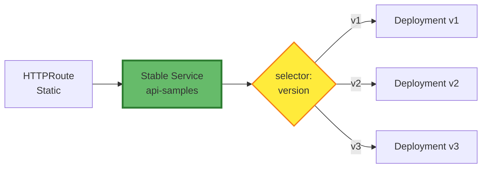

# Warp Explorer: No-Gateway API Version Management Analysis

## Executive Summary

This document explores API version management strategies in a **Nginx L7 → GKE Gateway → HTTPRoute → Backend Services** architecture, where the external URL path contains **no version identifiers** but internal systems must support multiple versions with safe deployment and rollback capabilities.

**Key Challenge**: Decouple external API stability from internal version evolution without requiring Nginx configuration changes for each deployment.

---

## Architecture Context

### Current Stack
```
Client Request (no version in URL)
  ↓
Nginx L7 (location-based proxy_pass)
  ↓
GKE Gateway (Gateway API)
  ↓
HTTPRoute (path matching)
  ↓
Kubernetes Service
  ↓
Backend Pods
```

### Design Goals
1. **External Stability**: URL remains unchanged (`/api-name-type-ri-sb-samples`)
2. **Internal Flexibility**: Support multiple concurrent API versions
3. **Safe Deployments**: Gradual rollouts with canary/blue-green strategies
4. **Fast Rollbacks**: Instant version switching without Nginx changes
5. **Operational Simplicity**: Minimize configuration drift across environments

---

## Strategy Comparison Matrix

| Strategy | Complexity | Rollback Speed | Canary Support | Production Ready | Best For |
|----------|------------|----------------|----------------|------------------|----------|
| **HTTPRoute Weight Routing** | Medium | Fast | ✅ Native | ✅ Yes | Standard deployments |
| **Service Selector Switching** | Low | Instant | ❌ No | ⚠️ Limited | Low-risk services |
| **Path Versioning** | High | N/A | ❌ No | ⚠️ Breaking | API contracts |
| **Flagger Automation** | High | Auto | ✅ Advanced | ✅ Yes | Enterprise scale |
| **Blue-Green** | Medium | Instant | ❌ No | ✅ Yes | Test environments |

---

## Recommended Approach: Layered Version Abstraction

### Core Principle
> **Separate logical routing from physical versions**

Instead of tightly coupling Service names to dates/versions:
```yaml
# ❌ Avoid: Version in Service name
name: api-name-type-ri-sb-samples-2025-11-19-service

# ✅ Prefer: Stable Service + Selector-based routing
name: api-name-type-ri-sb-samples
selector:
  app: api-name-type-ri-sb-samples
  version: "v2"  # Change only this
```

### Benefits
- HTTPRoute configuration remains static
- Nginx configuration remains static  
- Version switching = 1-line `kubectl patch`
- Clear separation of concerns

---

## Implementation Patterns

### Pattern 1: Stable Service with Version Selectors (Recommended)

#### Architecture


#### Deployment Structure
```yaml
# Stable Service (never changes)
apiVersion: v1
kind: Service
metadata:
  name: api-name-type-ri-sb-samples
  namespace: ns-int-common-ms
spec:
  selector:
    app: api-name-type-ri-sb-samples
    version: "v2"  # 👈 Only this line changes
  ports:
    - port: 443
      targetPort: 8443
```

```yaml
# Multiple version Deployments
---
apiVersion: apps/v1
kind: Deployment
metadata:
  name: api-samples-v1
spec:
  selector:
    matchLabels:
      app: api-name-type-ri-sb-samples
      version: "v1"
---
apiVersion: apps/v1
kind: Deployment
metadata:
  name: api-samples-v2
spec:
  selector:
    matchLabels:
      app: api-name-type-ri-sb-samples
      version: "v2"
```

#### Version Switching
```bash
# Switch to v3
kubectl patch service api-name-type-ri-sb-samples -n ns-int-common-ms \
  --type='json' -p='[{"op": "replace", "path": "/spec/selector/version", "value":"v3"}]'

# Rollback to v2
kubectl patch service api-name-type-ri-sb-samples -n ns-int-common-ms \
  --type='json' -p='[{"op": "replace", "path": "/spec/selector/version", "value":"v2"}]'
```

**Advantages**:
- ✅ Instant switching (ms latency)
- ✅ HTTPRoute never changes
- ✅ Nginx never changes
- ✅ Clean operational model

**Trade-offs**:
- ⚠️ No traffic splitting (all-or-nothing)
- ⚠️ Requires manual health validation before switch

---

### Pattern 2: HTTPRoute Weight-Based Canary (Production Grade)

#### Use Case
High-risk deployments requiring gradual traffic shifting.

#### Configuration
```yaml
apiVersion: gateway.networking.k8s.io/v1
kind: HTTPRoute
metadata:
  name: api-name-type-ri-sb-samples-route
  namespace: ns-int-common-ms
spec:
  parentRefs:
    - kind: Gateway
      name: abjx-common-gateway
      namespace: abjx-common-gateway-ns
  hostnames:
    - "dev.goole.cloud.uk.aibang"
  rules:
    - matches:
        - path:
            type: PathPrefix
            value: /api-name-type-ri-sb-samples
      backendRefs:
        # Stable version (90% traffic)
        - name: api-samples-v2-service
          kind: Service
          port: 443
          weight: 90
        # Canary version (10% traffic)
        - name: api-samples-v3-service
          kind: Service
          port: 443
          weight: 10
```

#### Progressive Rollout
```
Stage 1: 90/10 split → Monitor 15 minutes
Stage 2: 50/50 split → Monitor 30 minutes
Stage 3: 10/90 split → Monitor 1 hour
Stage 4: 0/100 split → Full cutover
Stage 5: Remove old version
```

**Advantages**:
- ✅ Risk mitigation through gradual rollout
- ✅ Gateway API native capability
- ✅ Real-time traffic shaping
- ✅ Easy rollback (adjust weights)

**Trade-offs**:
- ⚠️ Requires updating HTTPRoute multiple times
- ⚠️ Manual progression (unless automated with Flagger)

---

### Pattern 3: Flagger Automation (Enterprise)

#### When to Use
- Large-scale platforms with frequent deployments
- Teams requiring GitOps-style automation
- Need for metric-driven automatic rollbacks

#### Flagger Canary Resource
```yaml
apiVersion: flagger.app/v1beta1
kind: Canary
metadata:
  name: api-name-type-ri-sb-samples
  namespace: ns-int-common-ms
spec:
  targetRef:
    apiVersion: apps/v1
    kind: Deployment
    name: api-name-type-ri-sb-samples
  
  provider: gatewayapi:v1
  
  service:
    port: 443
    targetPort: 8443
  
  analysis:
    interval: 1m
    threshold: 5
    maxWeight: 50
    stepWeight: 10
    
    metrics:
      - name: request-success-rate
        thresholdRange:
          min: 99
      - name: request-duration
        thresholdRange:
          max: 500ms
    
    webhooks:
      - name: load-test
        url: http://flagger-loadtester/
        metadata:
          cmd: "hey -z 1m -q 10 https://dev.goole.cloud.uk.aibang/api-name-type-ri-sb-samples/health"
```

#### Workflow
```
Developer pushes code
  ↓
CI builds new image
  ↓
Deployment updates image tag
  ↓
Flagger detects change
  ↓
Creates canary deployment
  ↓
Progressively shifts traffic (10% → 50% → 100%)
  ↓
Queries Prometheus metrics
  ↓
[Success] Promotes canary to primary
[Failure] Automatic rollback to stable
```

**Advantages**:
- ✅ Fully automated canary deployments
- ✅ Metric-driven decisions
- ✅ Automatic rollbacks on failure
- ✅ Minimal manual intervention

**Trade-offs**:
- ⚠️ Additional infrastructure (Flagger controller + Prometheus)
- ⚠️ Learning curve for configuration
- ⚠️ Requires mature observability stack

---

## CI/CD Integration Strategies

### GitLab CI Example: Progressive Canary
```yaml
stages:
  - build
  - deploy-infra
  - canary-10
  - canary-50
  - canary-100
  - cleanup

variables:
  APP_NAME: "api-name-type-ri-sb-samples"
  NAMESPACE: "ns-int-common-ms"
  NEW_VERSION: "${CI_COMMIT_SHORT_SHA}"

deploy-infrastructure:
  stage: deploy-infra
  script:
    - |
      # Get previous version
      export PREVIOUS_VERSION=$(kubectl get httproute ${APP_NAME}-route -n ${NAMESPACE} \
        -o jsonpath='{.spec.rules[0].backendRefs[0].name}' | sed 's/.*-//')
      
      # Deploy new version
      kubectl apply -f deployment-${NEW_VERSION}.yaml
      kubectl rollout status deployment/${APP_NAME}-${NEW_VERSION} -n ${NAMESPACE}
      
      # Create new Service
      kubectl apply -f service-${NEW_VERSION}.yaml

canary-10-percent:
  stage: canary-10
  script:
    - kubectl apply -f httproute-canary-10.yaml
    - ./scripts/monitor-metrics.sh ${NEW_VERSION} 15
  when: manual

canary-100-percent:
  stage: canary-100
  script:
    - kubectl apply -f httproute-production.yaml
    - ./scripts/monitor-metrics.sh ${NEW_VERSION} 60
  when: manual
  needs: ["canary-50-percent"]
```

### Key Automation Principles
1. **Artifact Management**: Store version info in pipeline artifacts
2. **Health Checks**: Wait for `kubectl rollout status` before progression
3. **Monitoring Integration**: Query metrics (error rate, latency, throughput)
4. **Manual Gates**: Require approval before production cutover
5. **Rollback Scripts**: Pre-configured emergency rollback commands

---

## Version Naming Conventions

### Recommended Approaches

#### Option 1: Semantic Versioning
```yaml
version: "v1"
version: "v2"
version: "v3"
```
**Best for**: API contract changes, major refactors

#### Option 2: Date-Based Versioning
```yaml
version: "2025-12-18"
```
**Best for**: Frequent deployments, tracking deployment cadence

#### Option 3: Git SHA
```yaml
version: "a1b2c3d"
```
**Best for**: Traceability to source code

### Anti-Patterns
```yaml
# ❌ Avoid embedding version in Service name
name: api-samples-2025-11-19-service

# ❌ Avoid mixing version schemes
version: "v2-2025-11-19-hotfix"
```

---

## Monitoring and Observability

### Key Metrics to Track

#### Deployment Health
```bash
# Pod readiness
kubectl get pods -n ${NAMESPACE} -l version=${VERSION} \
  -o jsonpath='{.items[*].status.conditions[?(@.type=="Ready")].status}'

# HTTPRoute status
kubectl describe httproute ${APP_NAME}-route -n ${NAMESPACE}

# Service endpoints
kubectl get endpoints -n ${NAMESPACE} ${SERVICE_NAME}
```

#### Application Metrics (Prometheus)
```promql
# Request success rate
sum(rate(http_requests_total{job="api-samples", version="v3", status=~"2.."}[5m]))
/
sum(rate(http_requests_total{job="api-samples", version="v3"}[5m]))

# P99 latency
histogram_quantile(0.99, 
  rate(http_request_duration_seconds_bucket{version="v3"}[5m])
)

# Error rate comparison
sum(rate(http_requests_total{status=~"5..", version="v3"}[5m]))
```

#### Alerting Thresholds
| Metric | Warning | Critical | Action |
|--------|---------|----------|--------|
| Success Rate | < 99.5% | < 99% | Pause rollout |
| P99 Latency | > 500ms | > 1s | Investigate |
| Error Rate | > 0.5% | > 1% | Rollback |
| Pod Restarts | > 3/hour | > 10/hour | Check logs |

---

## Rollback Strategies

### Strategy 1: Weight Adjustment (Canary)
```bash
# Instant rollback: Shift all traffic back to stable
kubectl apply -f - <<EOF
apiVersion: gateway.networking.k8s.io/v1
kind: HTTPRoute
metadata:
  name: api-name-type-ri-sb-samples-route
spec:
  rules:
    - backendRefs:
        - name: api-samples-v2-service  # Stable
          weight: 100
        - name: api-samples-v3-service  # Failed canary
          weight: 0
EOF
```

### Strategy 2: Service Selector Rollback
```bash
# Single command rollback
kubectl patch service api-name-type-ri-sb-samples -n ns-int-common-ms \
  -p '{"spec":{"selector":{"version":"v2"}}}'
```

### Strategy 3: Flagger Automatic Rollback
```yaml
# Flagger handles automatically when metrics fail
analysis:
  metrics:
    - name: request-success-rate
      thresholdRange:
        min: 99  # Below this triggers auto-rollback
```

### Rollback Decision Tree
```
Deployment issue detected
  ↓
Is traffic split active? 
  ├─ Yes → Adjust weights to 100/0
  └─ No → Patch Service selector
       ↓
Verify old version health
  ↓
Incident post-mortem
  ↓
Fix & redeploy
```

---

## Environment-Specific Strategies

| Environment | Strategy | Automation Level | Risk Tolerance |
|-------------|----------|------------------|----------------|
| **Dev** | Direct replacement | Full | High |
| **Staging** | Progressive canary | Semi-automated | Medium |
| **Production** | Flagger + monitoring | Automated with gates | Low |

### Dev Environment
```yaml
# Simple: Update Deployment image, no canary
kubectl set image deployment/api-samples api=gcr.io/project/api:${VERSION}
```

### Staging Environment
```yaml
# Canary with manual gates
- 10% canary → Manual approval
- 100% cutover → Automated after 1 hour
```

### Production Environment
```yaml
# Flagger automation + SRE monitoring
- Automatic progression based on SLOs
- PagerDuty integration for failures
- Automatic rollback on threshold breach
```

---

## Best Practices Summary

### ✅ Do
1. **Use stable Service names** with version selectors
2. **Keep HTTPRoute configuration static** whenever possible
3. **Implement health checks** before version switches
4. **Monitor canary metrics** during progressive rollouts
5. **Automate rollback procedures** with runbooks
6. **Version Deployments** with clear labels
7. **Document version history** in Service annotations

### ❌ Don't
1. **Embed versions in external URLs** unless required by API contracts
2. **Mix version semantics** (don't combine dates + semver)
3. **Skip monitoring** during canary phases
4. **Change Nginx for every deployment**
5. **Delete old versions immediately** after cutover
6. **Assume health checks = production readiness**

---

## Migration Path

### Phase 1: Current State Assessment
```bash
# Audit existing HTTPRoute configurations
kubectl get httproute -A -o yaml | grep -A 10 backendRefs

# List all version-specific Services
kubectl get services -A | grep -E '\d{4}-\d{2}-\d{2}'
```

### Phase 2: Introduce Stable Services
```bash
# Create stable Service pointing to current version
kubectl apply -f stable-service.yaml

# Update HTTPRoute to use stable Service
kubectl apply -f httproute-updated.yaml
```

### Phase 3: Implement Canary Capability
```bash
# Keep version-specific Services for canary
kubectl apply -f service-v2.yaml
kubectl apply -f service-v3.yaml

# HTTPRoute with weights
kubectl apply -f httproute-canary.yaml
```

### Phase 4: Automation Layer
```bash
# Install Flagger (optional)
helm install flagger flagger/flagger

# Configure Canary resources
kubectl apply -f flagger-canary.yaml
```

---

## Troubleshooting Guide

### Issue: Traffic not reaching new version
**Check**:
```bash
# Verify Service selector matches Pods
kubectl get service ${SERVICE_NAME} -o yaml | grep -A 5 selector
kubectl get pods -l app=${APP_NAME},version=${VERSION}

# Check endpoints
kubectl get endpoints ${SERVICE_NAME}
```

### Issue: HTTPRoute weight not distributing correctly
**Check**:
```bash
# Verify Gateway status
kubectl describe gateway ${GATEWAY_NAME}

# Check HTTPRoute conditions
kubectl get httproute ${ROUTE_NAME} -o jsonpath='{.status.parents[0].conditions}'
```

### Issue: Rollback not taking effect
**Check**:
```bash
# Verify Service selector was updated
kubectl get service ${SERVICE_NAME} -o yaml

# Check if old Pods are still running
kubectl get pods -l app=${APP_NAME}

# Force endpoint refresh (if using kube-proxy)
kubectl delete endpoints ${SERVICE_NAME}
```

---

## Conclusion

The **optimal strategy** for your architecture is:

1. **Foundation**: Stable Service with version selectors (Pattern 1)
2. **Safety Net**: HTTPRoute weight-based canary for critical deployments (Pattern 2)
3. **Scale Goal**: Flagger automation for enterprise-grade operations (Pattern 3)

**Key Insight**: The question isn't "*should I use backendRefs to switch versions?*" but rather "*how do I abstract version semantics to minimize configuration churn?*"

By keeping version control at the **Service selector layer**, you achieve:
- Nginx remains static ✅
- HTTPRoute remains static (or changes minimally) ✅
- Version switching is a single kubectl command ✅
- Rollbacks are instant ✅

This approach scales from small teams to enterprise platforms while maintaining operational simplicity.

---

## References

### Kubernetes Gateway API
- [Gateway API Documentation](https://gateway-api.sigs.k8s.io/)
- [HTTPRoute Specification](https://gateway-api.sigs.k8s.io/references/spec/#gateway.networking.k8s.io/v1.HTTPRoute)

### Progressive Delivery Tools
- [Flagger](https://flagger.app/) - Kubernetes progressive delivery operator
- [Argo Rollouts](https://argoproj.github.io/argo-rollouts/) - Alternative progressive delivery solution

### Observability
- [Prometheus](https://prometheus.io/) - Metrics collection
- [Grafana](https://grafana.com/) - Visualization
- [Kiali](https://kiali.io/) - Service mesh observability

---

## Document Metadata

- **Author**: Warp AI Agent
- **Created**: 2025-12-19
- **Source**: Analysis of no-gateway-path-explorer.md
- **Scope**: API version management in Gateway API architecture
- **Status**: Reference Guide
