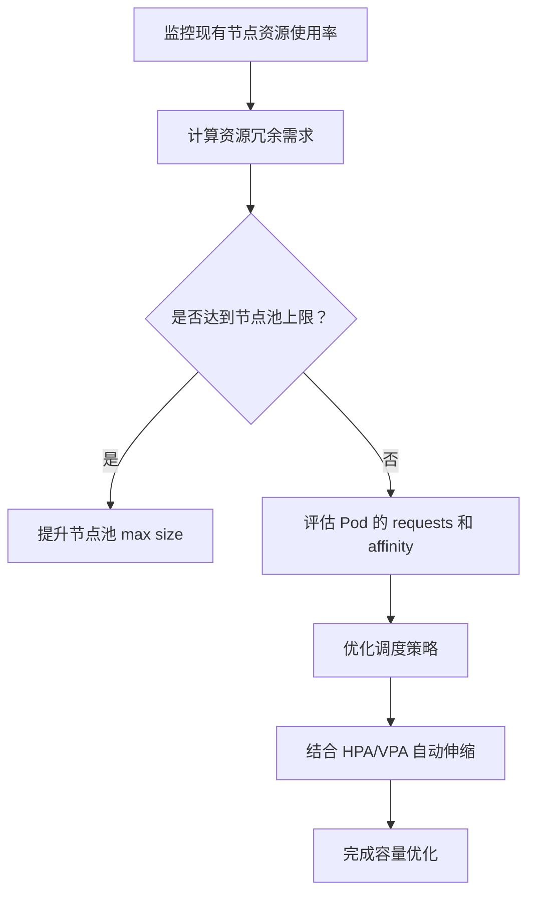

你这份 GKE Pod 的事件日志清楚指出了两大问题：

1. **调度失败（FailedScheduling）**
    
    - 40 Insufficient memory：40 个节点没有足够的内存可分配给该 Pod。
        
    - 5 node(s) didn't match pod anti-affinity rules：5 个节点由于 PodAntiAffinity 策略无法调度。
        
    - preemption: 0/45：没有找到可以抢占的 Pod 来腾出资源。
        
    
2. **扩容失败（NotTriggerScaleUp）**
    
    - cluster-autoscaler pod didn't trigger scale-up: max node group size reached：自动扩容器没有触发，因为已经达到最大节点组上限。
        
    

---

### **问题总结**

  

你当前面临的问题是：

- **节点内存资源不足**（大多数节点）。
    
- **Pod 的 affinity/anti-affinity 限制了可调度范围**（5个节点）。
    
- **集群不能再扩容**，因为已经达到了你为节点池设定的上限。
    

---

### **实践建议：容量规划与冗余策略**

  

GKE 实际生产场景中，一般建议按照以下思路进行容量和冗余规划：

  

#### **✅ 1.** 

#### **设置合理的 Node Pool 上限**

  

确保你的 Node Pool 设置的 maxSize 足够高，允许在负载增长时扩容。

```
gcloud container clusters update CLUSTER_NAME \
  --enable-autoscaling \
  --min-nodes=3 \
  --max-nodes=30 \
  --node-pool=POOL_NAME
```

#### **✅ 2.** 

#### **预留 15%~30% 的资源冗余**

  

> 实践中建议预留资源冗余来应对突发流量或滚动升级，尤其是内存资源更紧张的应用。

|**类型**|**建议冗余比例**|
|---|---|
|CPU|15% ~ 20%|
|Memory|25% ~ 30%|

例如，如果当前总内存需求为 100GiB，那你的集群节点应能提供至少 130GiB 的可分配内存。

  

#### **✅ 3.** 

#### **Pod 资源请求设置要合理**

- 不要设置过高的 resources.requests。
    
- requests 是调度依据，limits 仅限制运行期。
    
- 使用 HPA/VPA 动态调整资源分配（Vertical/Horizontal Pod Autoscaler）。
    

  

#### **✅ 4.** 

#### **优化 Affinity 策略**

  

你的日志提示有部分节点未能调度是因为 anti-affinity：

```
podAntiAffinity:
  requiredDuringSchedulingIgnoredDuringExecution:
    - labelSelector:
        matchLabels:
          app: your-app
      topologyKey: "kubernetes.io/hostname"
```

可检查是否 **必要要求强制隔离**，还是可适度放宽为 preferredDuringSchedulingIgnoredDuringExecution。

  

#### **✅ 5.** 

#### **提前监控和告警：预测资源瓶颈**

- 配置 Prometheus + Grafana / Cloud Monitoring。
    
- 设置对 Node CPU、Memory 使用率超过 80% 的告警。
    
- 结合 HPA/VPA 的趋势预测未来资源增长。
    

---

### **建议的容量规划流程（Mermaid 流程图）**



---

### **总结建议**

- **立即措施**：
    
    - 提高 NodePool 的 maxNodes。
        
    - 检查 PodAntiAffinity 是否可以放宽。
        
    - 检查 Pod 的 resource.requests 是否设定合理。
        
    
- **中期优化**：
    
    - 引入 HPA/VPA。
        
    - 保留约 25~30% 的资源冗余。
        
    - 每季度进行一次容量评估。
        
    

  

如果你提供你每个 Pod 的 requests.memory 情况以及当前节点配置（如：每节点内存总量），我可以帮你算出具体的冗余比例建议。是否要一起看？