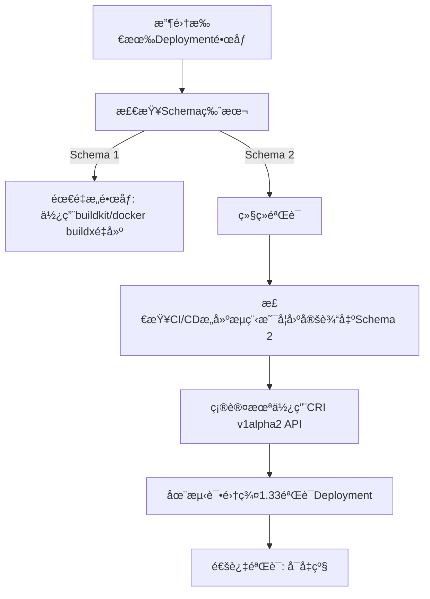

# GKE containerd 2.0 Upgrade Assessment

## Background

We are the company's GKE maintenance team and have received this requirement. What should we do and what are the best practices? Our API deployments are typically stored in Git repositories.

**Engineering Request**: Can the engineering team help review if this container update will affect our build?

**Reference**: [https://cloud.google.com/kubernetes-engine/docs/deprecations/migrate-containerd-2]

**Key Changes**: With minor version 1.33, GKE uses containerd 2.0, which removes support for Docker Schema 1 images and the v1alpha2 API.

**Assessment Scope**: What do we need to evaluate? We need more detailed information and actionable steps.

## GKE containerd 2.0 Upgrade Impact Assessment & Best Practices

### 1. Major Change Impact Analysis

#### 1.1 Docker Schema 1 Image Support Removal

- **Impact**: containerd 2.0 no longer supports Docker Schema 1 format images
- **Risk**: Applications using old format images will fail to start
- **Identification**: Schema 1 images are typically built before 2017

#### 1.2 v1alpha2 API Removal

- **Impact**: Removes Container Runtime Interface (CRI) v1alpha2 API
- **Risk**: Tools and scripts depending on old API may fail
- **Current Status**: Most modern tools already use v1 API

### 2. Assessment Checklist

#### 2.1 Image Compatibility Check (GAR Specific)

```bash
# Check current image formats in use
kubectl get pods --all-namespaces -o jsonpath='{range .items[*]}{.spec.containers[*].image}{"\n"}{end}' | sort -u > current_images.txt

# Use gcloud to check GAR image manifest information
for image in $(cat current_images.txt); do
  if [[ $image == *"pkg.dev"* ]]; then
    echo "Checking GAR image: $image"
    # Extract GAR image information
    LOCATION=$(echo $image | cut -d'/' -f1 | cut -d'-' -f1)
    PROJECT=$(echo $image | cut -d'/' -f2)
    REPO=$(echo $image | cut -d'/' -f3)
    IMAGE_TAG=$(echo $image | cut -d'/' -f4)

    # Get image manifest
    gcloud artifacts docker images describe $image \
      --format="value(image_summary.digest)" 2>/dev/null

    # Check manifest schema version
    gcloud artifacts docker images describe $image \
      --format="json" | jq -r '.manifest.schemaVersion // "unknown"'
  else
    echo "Non-GAR image: $image"
    docker manifest inspect $image --verbose | grep -i "schemaVersion"
  fi
done
```

#### 2.1.1 GAR Image Detailed Check Commands

```bash
# List all images in GAR repositories
gcloud artifacts repositories list --location=LOCATION

# List images in specific repository
gcloud artifacts docker images list LOCATION-docker.pkg.dev/PROJECT/REPOSITORY

# Get detailed image information including schema version
gcloud artifacts docker images describe \
  LOCATION-docker.pkg.dev/PROJECT/REPOSITORY/IMAGE:TAG \
  --format="json" | jq '{
    schemaVersion: .manifest.schemaVersion,
    mediaType: .manifest.mediaType,
    created: .image_summary.create_time,
    digest: .image_summary.digest
  }'

# Batch check schema versions for all images in GAR
gcloud artifacts docker images list \
  LOCATION-docker.pkg.dev/PROJECT/REPOSITORY \
  --format="value(IMAGE)" | while read image; do
    echo "Checking: $image"
    gcloud artifacts docker images describe \
      "LOCATION-docker.pkg.dev/PROJECT/REPOSITORY/$image" \
      --format="value(manifest.schemaVersion)"
done
```

#### 2.2 Base Image Audit

- [ ] Check all FROM statements in Dockerfiles
- [ ] Verify base image build dates and versions
- [ ] Confirm third-party image compatibility

#### 2.3 CI/CD Pipeline Check

- [ ] Review image build processes in build pipelines
- [ ] Check for outdated Docker versions
- [ ] Verify image push format to registry

### 3. Best Practice Solutions

#### 3.1 Pre-upgrade Preparation

```bash
# 1. Create test cluster to verify compatibility
gcloud container clusters create containerd2-test \
  --zone=us-central1-a \
  --cluster-version=1.33 \
  --num-nodes=2 \
  --machine-type=e2-medium

# 2. Deploy existing applications in test cluster
kubectl apply -f your-deployment-manifests/
```

#### 3.2 Image Modernization Strategy

```dockerfile
# Ensure Dockerfile uses modern base images
FROM node:18-alpine  # instead of node:6 and other old versions
FROM python:3.11-slim # instead of python:2.7

# Use multi-stage builds to optimize images
FROM node:18-alpine AS builder
WORKDIR /app
COPY package*.json ./
RUN npm ci --only=production

FROM node:18-alpine AS runtime
WORKDIR /app
COPY --from=builder /app/node_modules ./node_modules
COPY . .
CMD ["npm", "start"]
```

#### 3.3 Git Repository Management Best Practices

```yaml
# .github/workflows/image-compatibility-check.yml
name: Image Compatibility Check
on:
  pull_request:
    paths:
      - 'k8s/**'
      - 'Dockerfile*'

jobs:
  check-images:
    runs-on: ubuntu-latest
    steps:
      - uses: actions/checkout@v3
      - name: Extract images from manifests
        run: |
          grep -r "image:" k8s/ | grep -v "#" | awk '{print $2}' > images.txt
      - name: Check image schemas
        run: |
          while read image; do
            echo "Checking $image"
            docker manifest inspect $image --verbose | grep schemaVersion || echo "Failed to inspect $image"
          done < images.txt
```

### 4. Phased Upgrade Plan

#### Phase 1: Assessment & Preparation (1-2 weeks)

- [ ] Complete image compatibility audit
- [ ] Identify images requiring updates
- [ ] Create test environment
- [ ] Update CI/CD pipelines

#### Phase 2: Testing & Validation (1 week)

- [ ] Validate all applications in test cluster
- [ ] Performance benchmark testing
- [ ] Functional regression testing
- [ ] Monitoring and logging validation

#### Phase 3: Production Upgrade (2-3 weeks)

- [ ] Upgrade non-critical environments first
- [ ] Gradually migrate critical applications
- [ ] Monitor upgrade process
- [ ] Prepare rollback plan

### 5. Risk Mitigation Measures

#### 5.1 Rollback Strategy

```bash
# Maintain old version node pool as backup
gcloud container node-pools create fallback-pool \
  --cluster=your-cluster \
  --zone=your-zone \
  --node-version=1.32.x \
  --num-nodes=0

# Quickly scale up old version nodes when necessary
gcloud container clusters resize your-cluster \
  --node-pool=fallback-pool \
  --num-nodes=3 \
  --zone=your-zone
```

#### 5.2 Monitoring & Alerting

```yaml
# Add containerd-related monitoring
apiVersion: monitoring.coreos.com/v1
kind: PrometheusRule
metadata:
  name: containerd-monitoring
spec:
  groups:
  - name: containerd.rules
    rules:
    - alert: ContainerdImagePullFailure
      expr: increase(container_runtime_image_pull_failures_total[5m]) > 0
      labels:
        severity: warning
      annotations:
        summary: "Container image pull failure detected"
```

### 6. Common Issues & Solutions

#### Q1: How to identify Schema 1 images in GAR?

```bash
# Use gcloud to check GAR image schema version
gcloud artifacts docker images describe \
  LOCATION-docker.pkg.dev/PROJECT/REPOSITORY/IMAGE:TAG \
  --format="value(manifest.schemaVersion)"

# Schema 1 returns 1, Schema 2 returns 2

# Batch check and filter Schema 1 images
gcloud artifacts docker images list \
  LOCATION-docker.pkg.dev/PROJECT/REPOSITORY \
  --format="value(IMAGE)" | while read image; do
    schema=$(gcloud artifacts docker images describe \
      "LOCATION-docker.pkg.dev/PROJECT/REPOSITORY/$image" \
      --format="value(manifest.schemaVersion)" 2>/dev/null)
    if [ "$schema" = "1" ]; then
      echo "âš ï¸  Schema 1 image: $image"
    fi
done

# Use skopeo as alternative (requires installation)
skopeo inspect docker://LOCATION-docker.pkg.dev/PROJECT/REPOSITORY/IMAGE:TAG | jq '.SchemaVersion'
```

#### Q2: What to do when old images cannot be updated?

- Rebuild images using modern base images
- Contact image maintainers for updated versions
- Consider alternative image solutions

#### Q3: Application fails to start after upgrade?

```bash
# Check containerd logs
kubectl logs -n kube-system -l k8s-app=containerd

# Check node events
kubectl describe node your-node-name
```

### 7. Validation Script

```bash
#!/bin/bash
# containerd2-readiness-check.sh - GAR Optimized Version

echo "=== GKE containerd 2.0 Upgrade Readiness Check (GAR Version) ==="

# Check cluster version
echo "Current cluster version:"
kubectl version --short

# Check all images
echo "Extracting all images in use..."
kubectl get pods --all-namespaces -o jsonpath='{range .items[*]}{.spec.containers[*].image}{"\n"}{end}' | sort -u > all_images.txt

echo "Checking image Schema versions..."
schema1_count=0
total_count=0

while read image; do
  echo "Checking: $image"
  total_count=$((total_count + 1))

  if [[ $image == *"pkg.dev"* ]]; then
    # GAR images use gcloud check
    schema_version=$(gcloud artifacts docker images describe "$image" \
      --format="value(manifest.schemaVersion)" 2>/dev/null)

    if [ "$schema_version" = "1" ]; then
      echo "âš ï¸  Warning: $image uses Schema 1 format (GAR)"
      schema1_count=$((schema1_count + 1))
    elif [ "$schema_version" = "2" ]; then
      echo "✅ $image compatible (Schema 2)"
    else
      echo "â“ $image unable to determine schema version"
    fi
  else
    # Non-GAR images use docker check
    if docker manifest inspect "$image" --verbose 2>/dev/null | grep -q '"schemaVersion": 1'; then
      echo "âš ï¸  Warning: $image uses Schema 1 format"
      schema1_count=$((schema1_count + 1))
    else
      echo "✅ $image compatible"
    fi
  fi
done < all_images.txt

echo "=== Check Complete ==="
echo "Total images: $total_count"
echo "Schema 1 images: $schema1_count"

if [ $schema1_count -gt 0 ]; then
  echo "âš ï¸  Found $schema1_count Schema 1 images, upgrade required before using containerd 2.0"
  exit 1
else
  echo "✅ All images compatible with containerd 2.0"
  exit 0
fi
```

### 8. GAR-Specific Tools & Techniques

#### 8.1 GAR Image Batch Analysis Script

```bash
#!/bin/bash
# gar-schema-analyzer.sh

PROJECT_ID="your-project-id"
LOCATION="us-central1"  # or other regions
REPOSITORY="your-repo"

echo "=== GAR Image Schema Version Analysis ==="

# Get all image list
gcloud artifacts docker images list \
  $LOCATION-docker.pkg.dev/$PROJECT_ID/$REPOSITORY \
  --format="csv[no-heading](IMAGE,DIGEST,CREATE_TIME)" > gar_images.csv

# Analyze each image
echo "Image Name,Schema Version,Create Time,Status" > schema_analysis.csv

while IFS=',' read -r image digest create_time; do
  full_image="$LOCATION-docker.pkg.dev/$PROJECT_ID/$REPOSITORY/$image"

  schema_version=$(gcloud artifacts docker images describe "$full_image" \
    --format="value(manifest.schemaVersion)" 2>/dev/null)

  if [ "$schema_version" = "1" ]; then
    status="Needs Upgrade"
  elif [ "$schema_version" = "2" ]; then
    status="Compatible"
  else
    status="Unknown"
  fi

  echo "$image,$schema_version,$create_time,$status" >> schema_analysis.csv
  echo "Processing: $image - Schema $schema_version - $status"
done < gar_images.csv

echo "Analysis complete, results saved in schema_analysis.csv"
```

#### 8.2 GAR Image Cleanup Recommendations

```bash
# Find and delete Schema 1 images (use with caution)
gcloud artifacts docker images list \
  LOCATION-docker.pkg.dev/PROJECT/REPOSITORY \
  --format="value(IMAGE)" | while read image; do
    schema=$(gcloud artifacts docker images describe \
      "LOCATION-docker.pkg.dev/PROJECT/REPOSITORY/$image" \
      --format="value(manifest.schemaVersion)" 2>/dev/null)

    if [ "$schema" = "1" ]; then
      echo "Found Schema 1 image: $image"
      # Uncomment the line below to delete (backup first!)
      # gcloud artifacts docker images delete \
      #   "LOCATION-docker.pkg.dev/PROJECT/REPOSITORY/$image" --quiet
    fi
done
```

#### 8.3 Automated GAR Monitoring

```bash
# Create monitoring script for Schema 1 images
cat > monitor-gar-schemas.sh << 'EOF'
#!/bin/bash
PROJECT_ID="your-project-id"
LOCATION="us-central1"
REPOSITORY="your-repo"

schema1_images=$(gcloud artifacts docker images list \
  $LOCATION-docker.pkg.dev/$PROJECT_ID/$REPOSITORY \
  --format="value(IMAGE)" | while read image; do
    schema=$(gcloud artifacts docker images describe \
      "$LOCATION-docker.pkg.dev/$PROJECT_ID/$REPOSITORY/$image" \
      --format="value(manifest.schemaVersion)" 2>/dev/null)
    if [ "$schema" = "1" ]; then
      echo "$image"
    fi
done)

if [ -n "$schema1_images" ]; then
  echo "âš ï¸  Schema 1 images found:"
  echo "$schema1_images"
  # Send alert to your monitoring system
else
  echo "✅ No Schema 1 images found"
fi
EOF

chmod +x monitor-gar-schemas.sh
```

### 9. Ongoing Maintenance Recommendations

- Establish regular image security scanning processes
- Implement image lifecycle management
- Keep GKE cluster versions up to date
- Build automated image compatibility testing
- Set up proactive monitoring for deprecated image formats
- Create documentation for image upgrade procedures

---

**Document Updated**: $(date +%Y-%m-%d)  
**Responsible Team**: GKE Maintenance Team  
**Review Status**: Pending Review

# chatgpt

好的，这个问题核心是 **GKE 1.33 èµ· containerd å‡çº§åˆ° 2.0**，会导致一些功能和镜åƒå…¼å®¹æ€§è¢«ç§»é™¤ã€‚作为 GKE 维护组，你们è¦åšçš„是帮助业务/API 团队评估：**ç°æœ‰çš„ Deployment å’Œ CI/CD Build æµç¨‹æ˜¯å¦ä¼šå—å½±å“**。

我给你分几个维度æ¥æ‹†è§£ã€‚

---

## **1. 问题分æ**

GKE 1.33+ 默认使用 containerd 2.0，å˜åŒ–点包括：

- **移除 Docker Schema 1 é•œåƒæ”¯æŒ** → åªèƒ½ç”¨ Schema 2 æ ¼å¼çš„ OCI é•œåƒ
- **移除 CRI v1alpha2 API** → åªèƒ½ä½¿ç”¨ CRI v1 API
- **å¯èƒ½å½±å“自定义æ„建ã€è€æ—§é•œåƒå’Œå·¥å…·é“¾**

æ¢å¥è¯è¯´ï¼Œä½ ä»¬è¦è¯„估的是：

1. é•œåƒä»“库里是å¦æœ‰æ—§æ ¼å¼é•œåƒï¼ˆSchema 1）
2. 部署 YAML 或 CI/CD æµç¨‹é‡Œæ˜¯å¦ä¾èµ– v1alpha2 API
3. 是å¦æœ‰è‡ªå®šä¹‰ runtimeã€debug 工具或脚本调用旧 API

---

## **2. 解决方案（评估æµç¨‹ï¼‰**

建议拆æˆä»¥ä¸‹å‡ ä¸ªé˜¶æ®µï¼š

### **A. é•œåƒæ£€æŸ¥**

1. **确认所有 Deployment 使用的镜åƒ**

```bash
kubectl get deploy -A -o=jsonpath='{range .items[*]}{.metadata.namespace}{" "}{.metadata.name}{" "}{.spec.template.spec.containers[*].image}{"\n"}{end}'
```

1.

2.  **检测镜åƒæ˜¯å¦æ˜¯ Schema 1**

    - Docker Hub 上的è€é•œåƒï¼ˆ2017 å‰æ„建的）å¯èƒ½æ˜¯ Schema 1
    - å¯ç”¨ skopeo 检查：

```
skopeo inspect docker://<image> | jq .SchemaVersion
```

2.  - è¿”å› 1 → ä¸å…¼å®¹ï¼Œéœ€é‡æ–°æ„建

### **B. Build Pipeline 检查**

- 确认 CI/CD（如 Cloud Buildã€GitHub Actionsã€Jenkins）输出的是 **OCI/Docker Schema 2** æ ¼å¼é•œåƒ
- 大部分ç°ä»£ Docker/BuildKit 默认就是 Schema 2，但如æœä½¿ç”¨äº†è€ç‰ˆæœ¬ docker save/load，需è¦éªŒè¯

### **C. API 使用检查**

- æœç´¢ä»£ç /脚本中是å¦æœ‰å¯¹ v1alpha2 CRI 的调用
    å…¸å‹ä½ç½®ï¼š
    - 自定义 CNI æ’件或容器è¿è¡Œæ—¶å·¥å…·
    - kubelet runtimeClass çš„é…ç½®

### **D. Runtime 行为验è¯**

- 在测试 GKE 1.33 预览集群里跑ç°æœ‰ Deployment，确认 Pod 能正常拉å–é•œåƒå¹¶å¯åŠ¨
- 对关键 API åšå†’烟测试（healthcheck/请求链路验è¯ï¼‰

---

## **3. 示例代ç ä¸éªŒè¯è„šæœ¬**

### **é•œåƒæ‰¹é‡éªŒè¯è„šæœ¬ï¼ˆbash + skopeo）**

```bash
#!/bin/bash
set -e

for img in $(kubectl get deploy -A -o=jsonpath='{range .items[*]}{.spec.template.spec.containers[*].image}{"\n"}{end}' | sort -u); do
  echo "Checking image: $img"
  schema=$(skopeo inspect docker://$img | jq .SchemaVersion)
  if [ "$schema" -eq 1 ]; then
    echo "⌠Incompatible (Schema 1): $img"
  else
    echo "✅ OK (Schema 2/OCI): $img"
  fi
done
```

---

## **4. æµç¨‹å›¾**



---

## **5. 注æ„事项ä¸æœ€ä½³å®è·µ**

- **强制å‡çº§é•œåƒä»“库**：统一è¦æ±‚团队æ¨é€ OCI/Docker Schema 2 é•œåƒ
- **æå‰åš staging 验è¯**：在é生产 GKE 1.33 上å›å½’测试
- **CI/CD 最佳å®è·µ**：
    - 使用 docker buildx build --push ç¡®ä¿ OCI é•œåƒ
    - é•œåƒæ‰«æ/验签工具（如 GCP Artifact Registry Vulnerability Scan）åŒæ­¥å‡çº§
- **文档沉淀**：建立一个清å•ï¼Œè®°å½•å“ªäº›é•œåƒ/æœåŠ¡å·²éªŒè¯é€šè¿‡ï¼Œä»¥åå‡çº§æ›´å¿«

---

👉 总结下æ¥ï¼Œä½ ä»¬éœ€è¦ **评估三大点**：

1. é•œåƒï¼ˆSchema æ ¼å¼å…¼å®¹æ€§ï¼‰
2. CI/CD Pipeline（镜åƒæ„建方å¼ï¼‰
3. API/Runtime（是å¦ä¾èµ– v1alpha2）

---

è¦ä¸è¦æˆ‘帮你写一个 **评估清å•æ¨¡æ¿ï¼ˆChecklist）**，你们团队å¯ä»¥åœ¨æ¥åˆ° API owner 请求时é€é¡¹æ‰“勾？
