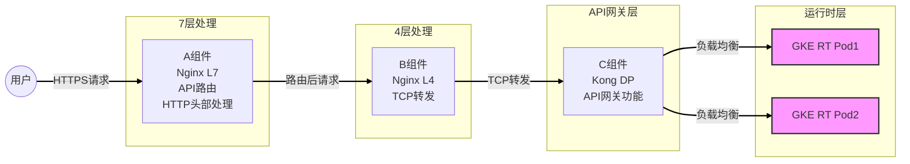

- [current configure](#current-configure)
- [MabyTODO](#mabytodo)
- [Chatgpt](#chatgpt)
  - [Chattgpt2](#chattgpt2)
- [Claude](#claude)
- [Gemini](#gemini)
  - [old Pod](#old-pod)
- [Deepseek](#deepseek)
    - [**1. 现有问题诊断**](#1-现有问题诊断)
    - [**2. 核心优化方案**](#2-核心优化方案)
      - [**2.1 优化就绪探针（Readiness Probe）**](#21-优化就绪探针readiness-probe)
      - [**2.2 添加优雅终止（Graceful Shutdown）**](#22-添加优雅终止graceful-shutdown)
      - [**2.3 配置 PodDisruptionBudget (PDB)**](#23-配置-poddisruptionbudget-pdb)
      - [**2.4 调整滚动更新策略**](#24-调整滚动更新策略)
      - [**2.5 优化 Service 与 Kong DP 配置**](#25-优化-service-与-kong-dp-配置)
    - [**3. 验证与监控**](#3-验证与监控)
    - [**4. 高级补充方案**](#4-高级补充方案)
    - [**最终效果**](#最终效果)
  - [old pod enhance](#old-pod-enhance)
    - [**1. 核心问题分析**](#1-核心问题分析)
    - [**2. 解决方案：优雅终止四步走**](#2-解决方案优雅终止四步走)
      - [**2.1 配置 preStop Hook（关键步骤）**](#21-配置-prestop-hook关键步骤)
      - [**2.2 应用层实现优雅关闭（必要逻辑）**](#22-应用层实现优雅关闭必要逻辑)
      - [**2.3 调整 terminationGracePeriodSeconds**](#23-调整-terminationgraceperiodseconds)
      - [**2.4 验证流量排空效果**](#24-验证流量排空效果)
    - [**3. 高级优化技巧**](#3-高级优化技巧)
      - [**3.1 结合 Service 配置**](#31-结合-service-配置)
      - [**3.2 使用 Readiness Gate**](#32-使用-readiness-gate)
      - [**3.3 网关层配合（Kong 特定配置）**](#33-网关层配合kong-特定配置)
    - [**4. 最终效果验证**](#4-最终效果验证)
    - [**附：常见问题排查表**](#附常见问题排查表)
- [terminationGracePeriodSeconds](#terminationgraceperiodseconds)
- [确保服务的会话亲和性](#确保服务的会话亲和性)

# current configure

在GCP工程中我的请求流程如下
```yaml
  strategy:
    type: RollingUpdate
    rollingUpdate:
      maxUnavailable: 1  # 允许最多 1 个 Pod 不可用
      maxSurge: 2  # 允许额外创建 2 个 Pod
```
- 也有readinessProbe的配置
```yaml
readinessProbe:
  failureThreshold: 3
  httpGet:
    path: /health
    port: 8080
    scheme: HTTPS
  periodSeconds: 20
  successThreshold: 1
  timeoutSeconds: 3
```

# MabyTODO
- add pdb 配置
- readinessProbe的检查间隔(periodSeconds)为20秒，这个间隔可能过长
- 就绪探针灵敏度不足：20 秒探测间隔可能导致新 Pod 就绪状态延迟。
periodSeconds: 20
	•	定义：periodSeconds指定健康检查之间的间隔时间。也就是每隔20秒就进行一次健康检查。
	•	含义：在每次健康检查之间会有20秒的间隔。也就是说，如果Pod启动后，Kubernetes会等待20秒才会发起下一次健康检查。
	•	影响：较大的periodSeconds值意味着健康检查较为宽松，因为Pod可以有更多的时间来完成启动并响应健康检查。然而，这也意味着如果Pod启动缓慢，Kubernetes会等更长时间才会判断Pod是否健康。
- [对于Kong DP](https://github.com/aibangjuxin/knowledge/blob/main/kong/kongdp-setting-timeout.md)
  - 分析我们一般标准的Kong的[route](../kong/route.md) and service 配置, 学习这个timeout和retries
  - [对于Kong DP](../kong/kongdp-setting-timeout.md)
  -  retries  5 ? 建议配置重试机制 所以有5次502
  -  timeout 适当的超时设置
  - 这个应该也是我们优化的方向 [Kong health check RT ?](../kong/kong-healthcheck-rt.md)
  -  
- Kubernetes 中 Pod 的优雅停止 (Graceful Shutdown) 机制，以及如何确保连接 Drain 的充分性，并处理强制终止的情况
- [terminationGracePeriodSeconds](#terminationgraceperiodseconds)
- 可能不需要,但是可以分析[确保服务的会话亲和性](#确保服务的会话亲和性)


1. **立即配置 PDB:** 这是确保滚动更新高可用性的最重要步骤。
2. **优化 Readiness Probe:** 缩短 `periodSeconds` 并确保 Probe 逻辑准确快速。
3. **检查并优化 Graceful Shutdown:**  确认 GKE RT 应用处理 `SIGTERM` 信号，并根据需要调整 `terminationGracePeriodSeconds`。
4. **配置 Kong DP 的重试、超时和健康检查:**  提高 Kong DP 的鲁棒性和容错能力。
5. **监控和调优:**  在完成上述配置后，进行滚动更新测试，并监控系统指标，例如错误率、延迟等，根据监控结果进一步调优配置。
   

# Chatgpt
在GKE中使用RollingUpdate时，确实可能会遇到在Pod替换过程中出现短暂的不可用状态，这可能导致502错误或连接被拒绝。这通常是由于新Pod启动时需要一些时间来准备好接受请求，或者在Pod被终止时，旧的Pod还没有完全移除。

为了优化高可用性并避免Downtime，你可以考虑以下几点：
	1.	PodDisruptionBudget (PDB)：PDB可以限制在Pod替换或删除时，最大允许不可用的Pod数。如果你设定了一个合理的PDB策略，可以防止在升级过程中，Pod数量降到不可用的状态。例如，你可以设置minAvailable为至少1，这样即使有Pod被终止，也会保持至少一个Pod可用。
示例配置：
```yaml
apiVersion: policy/v1
kind: PodDisruptionBudget
metadata:
  name: gke-rt-pdb
spec:
  minAvailable: 1  # 至少保持1个Pod可用
  selector:
    matchLabels:
      app: gke-rt
```

	2.	Readiness Probe：确保每个Pod都有正确配置的readiness probe。这样，当Pod处于不可用状态时，Kubernetes不会将流量路由到该Pod，直到它准备好接收请求。这是避免502错误的关键。
示例配置：
如果我的Readiness Probe配置如下,帮我分析每行并解释.这个配置会不会减慢Pod的启动?也就是其最长可能多长时间才能接受不了流量
```yaml
readinessProbe:
  failureThreshold: 3
  httpGet:
    path: /health
    port: 8080
    scheme: HTTPS
  periodSeconds: 20
  successThreshold: 1
  timeoutSeconds: 3
```

1. failureThreshold: 3
	•	定义：failureThreshold表示如果连续失败的次数达到了这个值，Kubernetes就会认为Pod不可用（readiness失败）。
	•	含义：在这个配置中，如果/health路径的请求连续失败3次，Pod会被认为不可用，并且不会接收流量。
	•	影响：这意味着Pod可以在健康检查失败时容忍最多3次错误，如果3次失败后Pod仍然不健康，Kubernetes会将其从服务的负载均衡池中移除。

2. httpGet:
	•	path: /health：指定健康检查的路径为/health。这个路径通常是你应用的健康检查接口。
	•	port: 8080：健康检查请求会发送到Pod的8080端口。
	•	scheme: HTTPS：健康检查请求将使用HTTPS协议，而非HTTP。这意味着你的应用需要在此端口上启用HTTPS并能正确响应健康检查请求。

3. periodSeconds: 20
	•	定义：periodSeconds指定健康检查之间的间隔时间。也就是每隔20秒就进行一次健康检查。
	•	含义：在每次健康检查之间会有20秒的间隔。也就是说，如果Pod启动后，Kubernetes会等待20秒才会发起下一次健康检查。
	•	影响：较大的periodSeconds值意味着健康检查较为宽松，因为Pod可以有更多的时间来完成启动并响应健康检查。然而，这也意味着如果Pod启动缓慢，Kubernetes会等更长时间才会判断Pod是否健康。

4. successThreshold: 1
	•	定义：successThreshold表示Pod必须成功通过健康检查的次数，才能被认为是健康的。对于readinessProbe，通常是1，意味着一旦Pod通过一次健康检查，就会被认为可以接收流量。
	•	含义：这意味着Pod只需要通过一次健康检查就会被标记为健康，并开始接受流量。successThreshold大于1通常适用于livenessProbe，但在readinessProbe中，1表示只要第一次检查成功，Pod就会被认为准备好。
	•	影响：这一设置使得Pod的健康检查通过较为快速，只需要通过一次检查即可开始接收流量。

5. timeoutSeconds: 3
	•	定义：timeoutSeconds指定每次健康检查请求的超时时间。如果健康检查请求在此时间内没有收到响应，Kubernetes会认为该请求失败。
	•	含义：每次健康检查请求最多会等待3秒钟，如果超过3秒没有收到响应，则认为健康检查失败。
	•	影响：较小的超时时间可以加快失败的检测速度，但如果应用启动较慢或者响应较慢，可能会导致健康检查过早失败。如果应用启动时的响应时间超过3秒，这个值需要调整。

启动延迟分析
	•	启动时间：根据这个配置，Pod的启动会受到failureThreshold、periodSeconds、timeoutSeconds的影响。假设Pod在启动时需要一些时间才能响应/health请求：
	•	如果Pod启动较慢且第一次健康检查在3秒内没有响应，检查会失败。然后，Kubernetes会再次检查，最多尝试3次（failureThreshold: 3）。
	•	每次检查间隔是20秒（periodSeconds: 20），所以健康检查可能会持续较长时间，直到Pod成功通过健康检查。
	•	如果Pod启动时间较长，可能需要几个周期才能通过健康检查。例如，如果Pod第一次健康检查失败，第二次检查通过，则最多可能经历（2次失败 + 1次成功）= 60秒的延迟。
	•	最大延迟：如果Pod的启动时间较长，可能需要60秒（3次检查间隔 + 1次成功）才能成功接受流量。

会不会减慢Pod启动？
	•	影响：这个配置并不会直接影响Pod启动本身，但如果应用启动比较慢或健康检查响应慢，那么这些健康检查配置会导致Pod在健康检查失败后的延迟，延缓其接收流量的时间。特别是periodSeconds: 20和failureThreshold: 3会使得健康检查失败时有较长的等待时间。

总结
	•	如果Pod启动非常迅速且健康检查响应很快，这个配置对Pod启动影响不大，Pod会比较快地接收流量。
	•	如果Pod启动慢或健康检查响应慢，那么健康检查的配置（特别是periodSeconds和failureThreshold）会延迟Pod接受流量的时间，最长可能会延迟60秒或更长时间（如果健康检查一直失败）。

如果你希望加速Pod启动并尽早开始接收流量，可以考虑减少periodSeconds（例如改为10秒）或调整failureThreshold来更快速地标记Pod为不可用。

	3.	控制流量的迁移：你可以通过调整maxUnavailable和maxSurge的设置，确保在Pod替换过程中不会同时丢失太多的Pod。在你的配置中，maxUnavailable: 1和maxSurge: 2可以确保在升级过程中，最多只会有1个Pod不可用，同时允许最多2个额外的Pod被创建。这可以减少对服务的影响。
	4.	使用API Gateway的重试机制：确保Kong DP有配置合适的重试机制（如超时、连接重试等），可以在Pod切换过程中保持请求的容错能力。

通过上述配置和策略，应该能够大大减少GKE RT Pod替换过程中出现Downtime和502错误的情况。如果你已经使用了PDB，那对整个服务的稳定性是非常有帮助的，尤其是对于确保Pod替换过程中的高可用性。


在GKE升级过程中，特别是使用RollingUpdate策略替换旧的Pod时，readinessProbe的配置直接影响Pod的可用性和升级过程中的流量转发。考虑到你在GKE中的Pod替换过程中希望减少Downtime，以下是几个优化的建议：

1. 调整 failureThreshold 和 periodSeconds
	•	failureThreshold: 如果failureThreshold设置得太高（例如：3），这意味着Kubernetes会容忍最多3次健康检查失败，才能认定Pod不可用。对于一个正在逐步替换的Pod，可能希望减少这种容忍度，以便尽早检测到Pod的健康问题。如果Pod的启动时间较长，可以适当增大failureThreshold，但如果目标是尽早发现不可用Pod，可以适当降低。
	•	优化建议：如果你希望Pod在较长的启动时间内更宽松地容忍失败，保持failureThreshold: 3是合理的；如果希望快速反应并尽早重新调度Pod，可以适当降低至2或1。
	•	periodSeconds: 当前设置的20秒表示每20秒检查一次。如果你的Pod启动较慢，这个值可能会导致较长的等待时间，从而延迟Pod接收流量。对于需要较长启动时间的应用（例如数据库服务），增加periodSeconds是合理的；但是，如果你希望在更短的时间内检测Pod是否已准备好接收流量，可以考虑减少这个时间间隔。
	•	优化建议：可以考虑将periodSeconds减少到10秒或更低，确保更频繁地进行健康检查，以便尽早发现Pod是否准备好。

2. 优化 timeoutSeconds
	•	**timeoutSeconds**设置为3秒是较短的超时时间。考虑到你的应用和环境，确保健康检查请求的响应时间不超过3秒。如果应用在升级过程中有一些启动延迟或较慢的响应时间，可能会导致过早失败。
	•	优化建议：根据应用启动时的延迟，考虑适当增大timeoutSeconds，比如增加到5秒或10秒，以便给Pod更多的时间响应健康检查请求，减少因短暂延迟导致的失败。

3. 确保健康检查的稳定性
	•	readinessProbe的稳定性：健康检查是决定Pod是否接收流量的关键。如果Pod在启动时有大量依赖外部服务或资源的初始化过程，确保/health路径的健康检查不会被过早标记为失败，可以通过检查Pod是否完全初始化（如数据库连接或缓存加载完成）。
	•	优化建议：根据应用的实际启动过程，确保/health路径的检查是全面的。例如，确保/health不仅仅检查HTTP返回，还可以检查一些关键的依赖是否正常运行（例如数据库连接、外部API调用等）。

4. PodDisruptionBudget (PDB)
	•	PDB在Pod替换中的作用：在升级过程中，PDB可以帮助确保始终有足够的Pod可用，而不会因Pod的替换导致服务不可用。如果你已经配置了RollingUpdate，结合PDB能够保证至少有一定数量的Pod处于健康状态。
	•	优化建议：确保设置合适的PDB，限制最小可用Pod数。通过增加minAvailable，可以防止Pod替换过程中，容器实例数降到不可用状态。
示例配置：
```yaml
apiVersion: policy/v1
kind: PodDisruptionBudget
metadata:
  name: gke-rt-pdb
spec:
  minAvailable: 1  # 保证至少1个Pod处于健康状态
  selector:
    matchLabels:
      app: gke-rt
```


5. 应用启动时的流量控制
	•	确保流量不会立即路由到正在初始化的Pod：在Pod替换过程中，Kubernetes会在readinessProbe成功前，不将流量路由到新的Pod。通过健康检查，你能确保只有在Pod完全准备好后，才会接收到流量。
	•	优化建议：通过readinessProbe的设置，确保新的Pod只会在健康检查通过后接收流量。你可以通过更精确的健康检查（如数据库连接、外部API依赖等）来确保Pod准备好处理生产流量。

6. 避免Pod同时停止
	•	通过合理配置maxUnavailable和maxSurge，你可以控制在升级过程中，最多允许多少Pod不可用，以及在Pod替换时最多可以多创建多少Pod。你已经设置了maxUnavailable: 1和maxSurge: 2，这意味着在替换时最多允许一个Pod不可用，并允许最多额外创建2个Pod。这对于避免服务中断非常重要。
	•	优化建议：保持这种设置或稍微调整，以确保在升级过程中不会过多Pod同时被替换。maxSurge: 2可以确保Pod替换时能快速启动新的Pod，maxUnavailable: 1可以减少一个Pod不可用的时间。

7. Kong DP的错误处理
	•	在Kong DP方面，确保它能够处理Pod替换过程中可能的短暂不稳定，避免502或connection refused错误。Kong应该具备重试机制，并且能够灵活处理Pod不可用的情况。
	•	优化建议：确保Kong配置了合适的连接重试和超时设置。比如可以为Kong的API请求设置适当的重试次数，避免短暂的Pod不可用导致API请求失败。

总结优化建议：
	•	调整健康检查配置：降低periodSeconds，增加timeoutSeconds，并根据应用启动时的实际情况调整failureThreshold。
	•	使用PodDisruptionBudget：确保在Pod升级过程中始终有足够的Pod可用，避免服务不可用。
	•	控制Pod替换速率：合理配置maxUnavailable和maxSurge，确保Pod替换过程中的高可用性。
	•	加强Kong DP的重试机制：确保API网关能够适应Pod替换过程中的短暂不可用期。

这样可以有效优化GKE升级过程中Pod替换的稳定性和高可用性。


## Chattgpt2
你的问题涉及到GKE中Pod替换过程中的高可用性，特别是升级期间的Downtime以及502错误和连接拒绝问题。这里有几个要点可以考虑优化：
	1.	Pod Readiness 和 Liveness Probe：
你已经配置了readinessProbe，这对于避免流量路由到尚未准备好的Pod非常重要。确保新Pod在向API请求流量之前，只有当它完全健康且准备好接受流量时才会加入到服务池中。readinessProbe的配置已经很好，但确保它的间隔（periodSeconds）和超时时间（timeoutSeconds）合理，避免过早认为Pod不健康。
	2.	PDB（PodDisruptionBudget）：
你提到考虑增加PDB。PDB的作用是限制在Pod被驱逐或升级时，同时不可用的Pod数量，从而确保有足够的Pod可以继续提供服务。你可以为你的Deployment创建一个PDB，确保在升级过程中至少有一个Pod是可用的。
例如，你可以为你的Deployment配置一个PDB，保证至少1个Pod处于可用状态：
```yaml
apiVersion: policy/v1
kind: PodDisruptionBudget
metadata:
  name: rt-pdb
spec:
  minAvailable: 1
  selector:
    matchLabels:
      app: gke-rt
```

	3.	增加Kong DP的重试机制：
502错误和连接拒绝通常是由于Kong DP尝试访问GKE RT的Pod时，目标Pod正在替换或不可用。为了缓解这种情况，可以考虑在Kong Gateway中配置重试策略，让Kong在短暂的失败后自动重试。这可以帮助减少在Pod替换过程中出现的连接问题。
	4.	确保Kong的健康检查：
同时，确保Kong DP与GKE RT的连接健康检查配置到位，避免将流量路由到不可用的Pod。你可以在Kong的负载均衡配置中使用健康检查来进一步提高系统稳定性。
	5.	调整RollingUpdate策略：
如果你希望确保新Pod准备好接受流量后再替换旧Pod，可以尝试调整RollingUpdate的maxSurge和maxUnavailable参数。你已经配置了maxUnavailable: 1，可以增加maxSurge（比如设置为maxSurge: 1）来确保在旧Pod替换时，总是有一个额外的Pod准备好处理流量。
	6.	GKE RT的水平扩展：
如果有条件的话，可以通过增加Pod的数量来提高容错性，即使在Pod替换时，系统也能承受一定的负载波动。

总结
	•	配置PDB以保证Pod替换时至少一个Pod始终可用。
	•	调整Kong的重试机制和健康检查策略。
	•	使用RollingUpdate时调整maxSurge和maxUnavailable参数，以平衡升级过程中的可用性。
	•	确保Pod的readinessProbe配置合理，避免流量在Pod未准备好时被路由过去。

这些措施应该能有效降低升级过程中可能出现的Downtime，并减少502错误和连接拒绝问题。如果需要更细节的配置，我可以帮你一起优化。

# Claude 
让我帮你分析这个问题并提供一些优化建议。


首先分析当前出现502和connection refused的可能原因：

1. Pod替换过程中的时序问题：
- readinessProbe的检查间隔(periodSeconds)为20秒，这个间隔可能过长
- 新Pod启动后到真正ready之间存在窗口期
- Kong DP可能在这个窗口期尝试连接还未完全就绪的Pod

2. 负载均衡和连接处理：
- 当Pod被终止时，可能还有活跃的连接
- 新的请求可能被转发到正在终止的Pod
- kube-proxy更新endpoint的延迟

针对这些问题，以下是优化建议：

1. 首先，添加PDB(Pod Disruption Budget)配置：

```yaml
apiVersion: policy/v1
kind: PodDisruptionBudget
metadata:
  name: rt-pdb
spec:
  minAvailable: 1  # 或者使用 maxUnavailable: 1
  selector:
    matchLabels:
      app: your-rt-app  # 确保与你的Deployment的标签匹配

```

2. 优化readinessProbe配置：
```yaml
readinessProbe:
  failureThreshold: 3
  httpGet:
    path: /health
    port: 8080
    scheme: HTTPS
  periodSeconds: 5  # 减少到5秒
  successThreshold: 1
  timeoutSeconds: 2  # 减少超时时间
```

3. 添加预停止钩子(preStop hook)来优雅关闭：
```yaml
lifecycle:
  preStop:
    exec:
      command: ["/bin/sh", "-c", "sleep 10 && kill -SIGTERM 1"]
```

4. 调整Deployment的策略：
```yaml
strategy:
  type: RollingUpdate
  rollingUpdate:
    maxUnavailable: 0  # 改为0，确保总是先启动新Pod
    maxSurge: 1        # 限制为1，控制更新节奏
```

5. 为Pod添加优雅终止期：
```yaml
terminationGracePeriodSeconds: 60
```

6. 确保服务的会话亲和性：
```yaml
apiVersion: v1
kind: Service
metadata:
  name: rt-service
spec:
  sessionAffinity: ClientIP
  sessionAffinityConfig:
    clientIP:
      timeoutSeconds: 10800
```

优化后的完整工作流程：

1. 当更新开始时：
   - 由于maxUnavailable=0，系统会先创建新Pod
   - PDB确保至少有1个Pod可用
   - 新Pod完成readinessProbe后才会加入服务

2. 当终止旧Pod时：
   - preStop hook给予10秒钟处理现有请求
   - 60秒的优雅终止期保证大多数请求能够完成
   - 服务的会话亲和性减少请求跳转

3. 对于Kong DP：
   - 建议配置重试机制
   - 适当的超时设置
   - 健康检查和断路器

你还可以考虑以下建议：

1. 监控指标：
- 添加Prometheus监控
- 监控Pod生命周期事件
- 监控连接断开和重试次数

2. 日志增强：
- 记录Pod启动和终止的详细时间线
- 记录连接失败的具体原因
- 启用Kong DP的详细日志

3. 负载均衡优化：
- 考虑使用服务网格（如Istio）
- 实现更细粒度的流量控制
- 添加故障注入测试

这些优化措施应该能显著减少升级过程中的服务中断。你可以逐步实施这些变更，每次实施后都进行充分的测试。

想了解更多具体的配置细节或有其他问题吗？

# Gemini 
从你描述的请求流程和遇到的问题来看，在GKE Deployment 的滚动更新过程中，出现 downtime 是一个常见的问题，尤其是在没有进行针对性优化的情况下。你观察到的 502 和 connection refused 错误正是 downtime 的体现。

我们来逐步分析问题和可能的解决方案，并结合你提到的 PDB (Pod Disruption Budget)。

**问题分析：GKE RollingUpdate 导致 Downtime 的原因**

1. **Pod 替换的时间差:**  RollingUpdate 的机制是逐步替换旧的 Pod。在替换过程中，会先启动新的 Pod，然后逐步停止旧的 Pod。但是，从新 Pod 启动到 `readinessProbe` 通过并被 Service 纳入 endpoint 的过程中，需要一定的时间。这段时间内，如果旧的 Pod 已经停止，但新 Pod 尚未就绪，就会出现短暂的服务不可用。

2. **Readiness Probe 的配置:**  你配置了 `readinessProbe`，这是非常重要的。但是，`readinessProbe` 的配置是否合理直接影响到新 Pod 被 Service 纳入 endpoint 的速度和准确性。
    * **`periodSeconds: 20` 太长:**  20 秒的检查间隔相对较长。这意味着，即使新 Pod 已经就绪，Service 也可能需要最多 20 秒才能检测到并开始将流量转发到新的 Pod。
    * **`/health` 端点是否足够快:**  `/health` 端点本身的响应速度也很重要。如果 `/health` 端点需要较长时间才能返回成功，也会延长 Pod 就绪的时间。
    * **`failureThreshold: 3` 和 `successThreshold: 1`:**  这些配置是合理的，表示连续 3 次探测失败才认为不就绪，成功 1 次就认为就绪。

3. **Kong DP 的重试和超时:**  Kong DP 作为 API 网关，如果请求 GKE RT 时遇到错误 (例如 502, connection refused)，默认的重试和超时机制是什么？如果没有合理的重试和超时配置，Kong DP 可能会过早地放弃请求，导致用户体验下降。

4. **Service 的 Endpoint 更新延迟:**  Kubernetes Service 需要一定时间来更新其 endpoint 列表，以反映 Pod 的就绪状态。虽然这个延迟通常很短，但在某些情况下也可能导致短暂的不一致。

5. **连接 Drain (Connection Draining) 不足:**  在旧 Pod 停止之前，是否进行了充分的连接 Drain 操作？如果旧 Pod 在处理请求的过程中被强制终止，可能会导致请求失败。


**优化方案和改进措施**

为了解决滚动更新过程中的 downtime 问题，可以从以下几个方面进行优化：

1. **引入 Pod Disruption Budget (PDB)**

   PDB 是解决滚动更新 downtime 的关键工具。PDB 可以限制在任何时候可以同时被 "驱逐" (disrupted) 的 Pod 数量。对于你的情况，你可以配置 PDB 来确保在任何时候，至少有一个 GKE RT Pod 是可用的。

   ```yaml
   apiVersion: policy/v1
   kind: PodDisruptionBudget
   metadata:
     name: gke-rt-pdb
     namespace: <你的命名空间>
   spec:
     minAvailable: 1  # 至少保持 1 个 Pod 可用
     selector:
       matchLabels:
         app: gke-rt  # 替换为你的 GKE RT Deployment 的 label
   ```

   **PDB 的作用:**
   * 当你进行 Deployment 滚动更新时，Kubernetes 会检查 PDB 的配置。
   * 如果停止一个 Pod 会导致可用 Pod 数量低于 `minAvailable`，Kubernetes 会阻止这次驱逐操作，直到有新的 Pod 变为 Ready 状态并加入 Service 的 endpoint 列表。
   * 这可以确保在滚动更新过程中，始终有至少 `minAvailable` 个 Pod 可以处理请求，从而最大限度地减少 downtime。

   **注意:** 对于只有 2 个 Pod 的 Deployment，`minAvailable: 1` 是一个合理的配置。如果你的 Deployment Pod 数量更多，你可以根据实际情况调整 `minAvailable` 的值，例如 `minAvailable: 50%` 或 `minAvailable: N-1` (N 是总 Pod 数量)。

2. **优化 Readiness Probe 配置**

   * **缩短 `periodSeconds`:** 将 `periodSeconds` 缩短到 5-10 秒，甚至更短 (例如 5 秒)。这样 Service 可以更快地检测到新 Pod 的就绪状态。
   * **确保 `/health` 端点快速且可靠:**  `/health` 端点应该尽可能快地返回成功，并且只检查关键的依赖项是否就绪。避免在 `/health` 端点进行过于复杂的健康检查，这会延长 Pod 就绪的时间。
   * **考虑更全面的健康检查:** `/health` 端点除了检查服务是否启动，还可以考虑检查一些关键的依赖项是否就绪，例如数据库连接、缓存连接等。确保 Pod 在真正准备好处理请求时才返回成功。

   ```yaml
   readinessProbe:
     failureThreshold: 3
     httpGet:
       path: /health
       port: 8080
       scheme: HTTPS
     periodSeconds: 5  # 缩短检查间隔
     successThreshold: 1
     timeoutSeconds: 3
   ```

3. **实现 Graceful Shutdown (连接 Drain)**

   确保你的 GKE RT 应用能够优雅地处理 SIGTERM 信号，并进行连接 Drain 操作。当 Kubernetes 发送 SIGTERM 信号给 Pod 时，应用应该：
   * **停止接收新的连接:**  拒绝新的请求，但继续处理已有的请求。
   * **等待正在处理的请求完成:**  等待当前正在处理的请求完成，或者设置一个合理的超时时间。
   * **释放资源:**  关闭数据库连接、缓存连接等。

   你可以在 Pod 的 `lifecycle.preStop` hook 中配置连接 Drain 的逻辑。例如，如果你的应用是基于 HTTP 的，你可以让 Nginx 或应用自身在接收到 SIGTERM 信号后，等待一段时间 (例如 30 秒) 再退出，期间只处理已有的连接，不再接受新的连接。

   ```yaml
   lifecycle:
     preStop:
       exec:
         command: ["/bin/sh", "-c", "sleep 30"] # 简单示例，实际需要根据你的应用调整
   ```

   **更完善的 `preStop` 示例 (假设你的应用监听 8080 端口):**

   ```yaml
   lifecycle:
     preStop:
       exec:
         command: ["/bin/sh", "-c", "nginx -s quit && sleep 30"] # 如果使用 Nginx，先优雅停止 Nginx，再 sleep
   ```

   **或者，如果你的应用自身实现了 HTTP 服务，可以在应用代码中处理 SIGTERM 信号，例如 (伪代码):**

   ```python
   import signal
   import time
   import threading

   is_shutting_down = False

   def signal_handler(sig, frame):
       global is_shutting_down
       print("SIGTERM received, starting graceful shutdown...")
       is_shutting_down = True
       # 停止接收新连接
       # ...

       # 等待正在处理的请求完成 (设置超时时间)
       # ...

       print("Graceful shutdown complete.")
       exit(0)

   signal.signal(signal.SIGTERM, signal_handler)

   # ... 启动 HTTP 服务 ...

   while True:
       # 接收请求
       # 如果 is_shutting_down 为 True，拒绝新请求
       # ... 处理请求 ...
       time.sleep(0.1)
   ```

4. **Kong DP 的重试和超时配置**

   * **配置重试策略:**  在 Kong DP 中，为 GKE RT 的 upstream 服务配置合理的重试策略。可以配置在遇到 502, 503, 504, connection refused 等错误时进行重试。
   * **设置合理的超时时间:**  设置连接超时、请求超时等参数，避免 Kong DP 长时间等待无响应的 GKE RT Pod。超时时间应该足够长，以允许新 Pod 启动并就绪，但又不能太长，以免影响用户体验。

   具体的 Kong DP 配置方法请参考 Kong 的官方文档。通常可以在 Upstream 或 Service 级别配置重试和超时策略。

5. **滚动更新策略 (`RollingUpdate` 策略)**

   你当前的 `RollingUpdate` 配置 `maxUnavailable: 1` 和 `maxSurge: 2` 对于两个 Pod 的 Deployment 来说是可以接受的。但是，你可以根据实际情况进行调整。

   * **`maxUnavailable: 0` (更保守):**  如果对 downtime 非常敏感，可以尝试将 `maxUnavailable` 设置为 `0`。这意味着在滚动更新过程中，始终保持至少和原来数量相同的 Pod 可用。但是，这可能会延长滚动更新的时间。
   * **`maxSurge: 1` (更保守):**  减少 `maxSurge` 可以减少滚动更新期间额外的资源消耗，但也会稍微延长滚动更新的时间。

   对于大多数情况，你当前的 `maxUnavailable: 1` 和 `maxSurge: 2` 配置在配合 PDB 和优化的 Readiness Probe 后，应该可以达到比较好的平衡。

6. **监控和日志**

   * **监控 Service 的 Endpoint 数量:**  监控你的 GKE RT Service 的 endpoint 数量，确保在滚动更新过程中，endpoint 数量不会降为 0。
   * **监控 Pod 的 Ready 状态:**  监控 GKE RT Pod 的 Ready 状态，确保 Pod 在滚动更新过程中能够快速进入 Ready 状态。
   * **分析 Kong DP 的日志:**  仔细分析 Kong DP 的日志，查看 502 和 connection refused 错误发生的频率和时间段，以便更好地定位问题。
   * **监控 GKE RT 应用的健康状况:**  监控 GKE RT 应用自身的健康状况，例如 CPU、内存使用率、错误率等，以便及时发现和解决问题。

**总结步骤和建议**

1. **优先实施 PDB:**  这是解决滚动更新 downtime 最关键的步骤。配置 PDB 确保滚动更新期间至少有一个 Pod 可用。
2. **优化 Readiness Probe:**  缩短 `periodSeconds`，确保 `/health` 端点快速且可靠。
3. **实现 Graceful Shutdown:**  在 GKE RT 应用中处理 SIGTERM 信号，并配置 `preStop` hook 进行连接 Drain。
4. **配置 Kong DP 的重试和超时:**  为 GKE RT upstream 配置合理的重试策略和超时时间。
5. **Review RollingUpdate 策略:**  根据实际情况考虑调整 `maxUnavailable` 和 `maxSurge`。
6. **加强监控和日志:**  监控 Service endpoint, Pod Ready 状态, Kong DP 日志和 GKE RT 应用健康状况。

通过以上优化措施，你应该可以显著减少甚至消除 GKE Deployment 滚动更新过程中的 downtime，提高你的 GCP 工程的整体高可用性。记住，逐步实施这些优化，并在每个步骤后进行测试和验证，以确保改进效果。

## old Pod
你问的这个问题非常关键，**旧 Pod 在停止之前是否进行了充分的连接 Drain 操作，以及如何处理请求处理时被强制终止的情况**，直接关系到滚动更新的平滑性和最终的用户体验。

让我更详细地解释一下 Kubernetes 中 Pod 的优雅停止 (Graceful Shutdown) 机制，以及如何确保连接 Drain 的充分性，并处理强制终止的情况。

**Kubernetes Pod 的优雅停止 (Graceful Shutdown) 流程**

当 Kubernetes 需要停止一个 Pod (例如在滚动更新、节点维护等场景下) 时，它会经历一个优雅停止的流程，目标是在不中断正在进行的工作的情况下尽可能平滑地停止 Pod。这个流程主要包含以下步骤：

1. **发送 SIGTERM 信号:** Kubernetes 首先会向 Pod 内的容器主进程 (PID 1) 发送 `SIGTERM` 信号。这是一个终止信号，告知应用程序需要开始关闭。

2. **Pod 从 Service Endpoint 列表中移除 (Endpoint Removal):** 在发送 `SIGTERM` 信号的同时 (实际上可能略有延迟，但非常快)，Kubernetes 会将该 Pod 从关联 Service 的 Endpoint 列表中移除。这意味着新的请求将不会再路由到这个 Pod。

3. **等待 `terminationGracePeriodSeconds`:**  Kubernetes 默认会等待一段时间，这个时间由 Pod 的 `terminationGracePeriodSeconds` 字段配置 (默认值是 30 秒)。在这个等待期间，Kubernetes 期望应用程序能够完成以下操作：
    * **停止接收新的连接:**  应用程序应该立即停止监听新的连接请求。
    * **完成正在处理的请求 (Connection Drain):**  应用程序应该继续处理已经建立的连接上的请求，直到请求完成或者达到超时时间。
    * **清理资源:**  应用程序可以进行一些清理工作，例如关闭数据库连接、释放缓存资源等。

4. **检查 Pod 是否终止:** 在 `terminationGracePeriodSeconds` 结束后，Kubernetes 会检查 Pod 是否已经成功终止。

5. **强制终止 (SIGKILL):** 如果在 `terminationGracePeriodSeconds` 时间内，Pod 仍然没有终止 (可能是应用程序没有正确处理 `SIGTERM` 信号，或者处理时间超过了等待时间)，Kubernetes 会强制发送 `SIGKILL` 信号给 Pod。`SIGKILL` 信号会立即终止进程，不会给应用程序任何清理资源和完成请求的机会。

**连接 Drain 的关键点和最佳实践**

要确保旧 Pod 在停止之前进行了充分的连接 Drain 操作，并避免请求被强制终止，你需要关注以下几个方面：

1. **应用程序处理 SIGTERM 信号:**  这是最核心的一点。你的 GKE RT 应用 **必须** 正确地处理 `SIGTERM` 信号。当接收到 `SIGTERM` 信号时，应用应该：
    * **立即停止接受新的连接:**  例如，在 HTTP 服务中，停止监听新的端口连接。
    * **开始进入 Drain 模式:**  进入 Drain 模式后，应用应该继续处理已经建立的连接上的请求，直到请求完成或者达到一个合理的超时时间。
    * **拒绝新的请求:**  对于已经建立的连接，如果接收到新的请求，可以返回一个临时的错误响应 (例如 HTTP 503 Service Unavailable)，并告知客户端稍后重试。
    * **记录日志:**  记录开始 Drain 过程和完成 Drain 过程的日志，方便排查问题。

2. **合理设置 `terminationGracePeriodSeconds`:** 默认的 30 秒对于很多应用来说可能足够，但对于处理长连接或者请求处理时间较长的应用，可能需要增加这个值。你需要根据你的应用的特性来设置一个合理的 `terminationGracePeriodSeconds` 值。  **重要的是要确保 `terminationGracePeriodSeconds` 的值足够长，以允许你的应用完成正在处理的请求和进行必要的清理工作。**

3. **使用 `preStop` Hook 增强 Drain 能力:**  除了应用自身处理 `SIGTERM` 信号外，你还可以使用 Pod 的 `preStop` hook 来进一步增强 Drain 能力。`preStop` hook 会在 Kubernetes 发送 `SIGTERM` 信号 *之前* 执行。你可以在 `preStop` hook 中执行一些操作，例如：
    * **延迟一段时间:**  使用 `sleep` 命令延迟一段时间，给应用更多时间来完成正在处理的请求。
    * **反注册服务:**  如果你的应用使用了服务发现机制 (例如注册到 Consul, Etcd 等)，可以在 `preStop` hook 中将 Pod 从服务发现中反注册，确保新的请求不会再路由到这个 Pod。
    * **优雅停止负载均衡器:**  如果你的 Pod 前面有负载均衡器 (例如 Nginx Ingress Controller)，可以在 `preStop` hook 中通知负载均衡器停止向该 Pod 发送新的请求。

   **`preStop` hook 示例 (延迟 30 秒):**

   ```yaml
   lifecycle:
     preStop:
       exec:
         command: ["/bin/sh", "-c", "sleep 30"]
   ```

   **`preStop` hook 示例 (优雅停止 Nginx):**  如果你的应用使用了 Nginx 作为反向代理，可以使用 Nginx 的优雅停止命令 `nginx -s quit`。

   ```yaml
   lifecycle:
     preStop:
       exec:
         command: ["/bin/sh", "-c", "nginx -s quit && sleep 30"]
   ```

   **注意:**  `preStop` hook 的执行时间会计入 `terminationGracePeriodSeconds` 总时间。

4. **监控和日志:**  监控你的应用的 Drain 过程，并记录相关的日志。你可以监控以下指标：
    * **请求完成时间:**  监控请求的平均处理时间、最大处理时间等，确保 `terminationGracePeriodSeconds` 的设置是合理的。
    * **错误率:**  监控滚动更新期间的错误率，如果错误率明显升高，可能是 Drain 过程没有做好。
    * **Pod 终止日志:**  查看 Pod 的日志，确认是否接收到了 `SIGTERM` 信号，是否正确开始了 Drain 过程，以及是否最终被 `SIGKILL` 强制终止 (如果被 `SIGKILL` 终止，说明 `terminationGracePeriodSeconds` 可能设置得太短了)。

5. **Kong DP 的超时和重试配置:**  即使做了充分的连接 Drain，在滚动更新的短暂时间内，仍然可能出现短暂的不可用。因此，在 Kong DP 中配置合理的超时和重试策略仍然非常重要。这可以提高系统的鲁棒性，应对短暂的瞬时错误。

**如何处理请求处理时被强制终止的情况 (SIGKILL)**

如果 `terminationGracePeriodSeconds` 设置得太短，或者应用程序在 `terminationGracePeriodSeconds` 内没有完成 Drain 过程，Kubernetes 最终会发送 `SIGKILL` 信号强制终止 Pod。当发生 `SIGKILL` 时，**正在处理的请求会被强制中断，无法完成，可能会导致请求失败或数据不一致。**

**为了避免这种情况，你需要：**

* **确保 `terminationGracePeriodSeconds` 足够长:**  根据你的应用的请求处理时间和 Drain 逻辑，设置一个足够长的 `terminationGracePeriodSeconds` 值。
* **优化应用 Drain 逻辑:**  尽可能优化应用的 Drain 逻辑，使其能够更快地完成正在处理的请求。
* **在客户端 (Kong DP) 实现幂等性或重试机制:**  对于重要的操作，在客户端 (例如 Kong DP 或更上层的调用方) 实现请求的幂等性或重试机制。这样即使请求被强制中断，客户端也可以安全地重试请求，而不会导致数据不一致或其他问题。
* **避免长时间运行的请求:**  尽量避免在 GKE RT 应用中处理长时间运行的请求。如果必须处理长时间运行的请求，可以考虑使用异步处理、断点续传等机制，以减少请求被强制中断的影响。

**总结**

为了确保旧 Pod 在停止之前进行了充分的连接 Drain 操作，并避免请求被强制终止，你需要：

* **核心是应用程序正确处理 `SIGTERM` 信号，实现连接 Drain 逻辑。**
* **合理设置 `terminationGracePeriodSeconds`，确保有足够的时间进行 Drain。**
* **使用 `preStop` hook 增强 Drain 能力 (可选但推荐)。**
* **监控 Drain 过程和错误率，并根据监控结果调整配置。**
* **在客户端实现重试或幂等性，提高系统鲁棒性。**

通过这些措施，你可以最大程度地减少滚动更新过程中的 downtime，并确保用户请求的平滑过渡。记住，测试和验证你的 Drain 策略非常重要，可以在测试环境中模拟滚动更新，并观察应用的表现，确保一切按预期工作。

# Deepseek
根据你的描述和现有配置，以下是为优化滚动升级期间高可用性及减少 502 错误的详细分析和建议方案：

---

### **1. 现有问题诊断**
- **502 错误根源**：新 Pod 尚未就绪时就被加入 Service 的 Endpoints，或旧 Pod 被终止时未完成正在处理的请求。
- **连接拒绝**：旧 Pod 被终止但未优雅关闭，导致 TCP 层直接拒绝连接。
- **就绪探针灵敏度不足**：20 秒探测间隔可能导致新 Pod 就绪状态延迟。

---

### **2. 核心优化方案**

#### **2.1 优化就绪探针（Readiness Probe）**
```yaml
readinessProbe:
  httpGet:
    path: /health
    port: 8080
    scheme: HTTPS
  initialDelaySeconds: 5   # 增加初始延迟等待应用启动
  periodSeconds: 5        # 缩短探测间隔至 5 秒
  timeoutSeconds: 2        # 缩短超时时间
  successThreshold: 1
  failureThreshold: 3      # 连续 3 次失败才标记未就绪
```
- **作用**：更快检测新 Pod 是否就绪，避免流量过早切入未准备好的 Pod。

---

#### **2.2 添加优雅终止（Graceful Shutdown）**
```yaml
apiVersion: apps/v1
kind: Deployment
spec:
  template:
    spec:
      containers:
      - name: app
        lifecycle:
          preStop:
            exec:
              command: ["sh", "-c", "sleep 30"]   # 等待 30 秒让现有请求完成
      terminationGracePeriodSeconds: 60            # 总终止宽限期 >= preStop 时间
```
- **作用**：旧 Pod 在收到终止信号后等待现有请求完成，避免强制中断。

---

#### **2.3 配置 PodDisruptionBudget (PDB)**
```yaml
apiVersion: policy/v1
kind: PodDisruptionBudget
metadata:
  name: rt-pdb
spec:
  minAvailable: 1      # 保证至少 1 个 Pod 始终可用
  selector:
    matchLabels:
      app: your-app-label
```
- **作用**：防止滚动升级或节点维护时同时终止过多 Pod，确保最小可用实例数。

---

#### **2.4 调整滚动更新策略**
```yaml
strategy:
  type: RollingUpdate
  rollingUpdate:
    maxUnavailable: 1  # 保持最多 1 个不可用
    maxSurge: 1        # 降低 surge 数量至 1，避免同时启动过多新 Pod
```
- **权衡**：升级时间可能延长，但减少了同时出现多个未就绪 Pod 的风险。

---

#### **2.5 优化 Service 与 Kong DP 配置**
- **Service 配置检查**：
  - 确保 `service.spec.sessionAffinity` 未设置为 `ClientIP`（除非必需），避免长连接导致流量不均衡。
  - 验证 Endpoints 更新延迟：Kubernetes 默认约几秒内更新 Endpoints，通常无需调整。

- **Kong DP 优化**：
  - **重试机制**：在 Kong 的路由配置中增加重试逻辑。
    ```nginx
    route {
      path: "/your-api"
      retries: 3                     # 失败后重试 3 次
      retry_timeout: 5               # 每次重试超时时间
    }
    ```
  - **上游健康检查**：配置主动健康检查，及时剔除不健康节点。
    ```nginx
    upstream your_upstream {
      health_check {
        active {
          type            = "https"
          path            = "/health"
          interval        = 5  # 缩短健康检查间隔
          successes       = 1  # 1 次成功即标记健康
          http_statuses  = [200]
        }
      }
    }
    ```

---

### **3. 验证与监控**
- **步骤 1**：部署更新后，通过 `kubectl get pods -w` 观察 Pod 替换过程。
- **步骤 2**：监控 Kong 日志，过滤 `502` 和 `connection refused` 错误是否减少。
- **步骤 3**：使用压测工具（如 `wrk` 或 `locust`）模拟滚动升级，验证请求成功率。

---

### **4. 高级补充方案**
- **蓝绿部署**：通过两个完全独立的 Deployment 切换，彻底避免滚动更新期间的干扰（需配合负载均衡器）。
- **Istio 流量镜像**：在服务网格中逐步切量，监控新版本稳定性后再完成切换。

---

### **最终效果**
通过上述优化，滚动升级期间的流量中断应显著减少，理想情况下用户无感知。若仍存在零星错误，需进一步检查应用本身的启动耗时或数据库连接池等内部状态。


## old pod enhance 
在 Kubernetes 中，旧 Pod 被终止时若未正确处理正在处理的请求，会导致 **请求中断、连接重置** 或 **502 错误**。以下是确保优雅终止（Graceful Shutdown）的完整方案：

---

### **1. 核心问题分析**
当 Pod 收到 `SIGTERM` 信号时：
- **Kubernetes 行为**：立即从 Service 的 Endpoints 列表中移除该 Pod，但实际网络规则更新（iptables/ipvs）可能有 **1-2 秒延迟**。
- **应用行为**：若直接退出，会导致已建立的 TCP 连接被强制关闭，正在处理的请求直接失败。
- **现象**：客户端可能遇到 `connection refused` 或 `502 Bad Gateway` 错误。

---

### **2. 解决方案：优雅终止四步走**

#### **2.1 配置 preStop Hook（关键步骤）**
在 Pod 收到 `SIGTERM` 后，预留时间让应用完成收尾工作：
```yaml
# Deployment 配置
spec:
  template:
    spec:
      containers:
      - name: your-container
        lifecycle:
          preStop:
            exec:
              command: ["sh", "-c", "sleep 20"]  # 等待 20 秒
      terminationGracePeriodSeconds: 30           # 总终止时间 ≥ preStop 时间
```
- **作用**：
  - 给 Kubernetes 时间从 Endpoints 移除 Pod，避免新请求进入。
  - 允许应用继续处理存量请求。

---

#### **2.2 应用层实现优雅关闭（必要逻辑）**
应用需监听 `SIGTERM` 信号，并执行：
1. **停止接受新请求**：关闭监听端口。
2. **等待存量请求完成**：设置超时时间（如 20 秒）。
3. **强制退出**：超时后仍未完成的请求记录日志后退出。

**伪代码示例（Node.js）：**
```javascript
process.on('SIGTERM', () => {
  console.log('Received SIGTERM, starting graceful shutdown');
  
  server.close(() => {           // 停止接受新连接
    console.log('All connections closed');
    process.exit(0);
  });

  setTimeout(() => {             // 强制终止保护
    console.error('Forcing shutdown after timeout');
    process.exit(1);
  }, 20_000);
});
```

---

#### **2.3 调整 terminationGracePeriodSeconds**
确保 Kubernetes 等待足够时间让 preStop 和应用清理完成：
```yaml
terminationGracePeriodSeconds: 30  # 必须 ≥ preStop 时间 + 应用清理时间
```
- 若总时间超过此值，Pod 将被强制终止（`SIGKILL`）。

---

#### **2.4 验证流量排空效果**
使用 **连续请求压测** 观察中断情况：
```bash
# 发送持续请求并监控错误率
while true; do
  curl -sI https://your-api.com/health | grep 'HTTP/1.1'
  sleep 0.1
done

# 同时触发滚动更新
kubectl rollout restart deployment/your-deployment
```
- **期望结果**：滚动更新期间无 `5xx` 错误。

---

### **3. 高级优化技巧**

#### **3.1 结合 Service 配置**
- **启用 `externalTrafficPolicy: Local`**（仅限 NodePort/LoadBalancer）：
  ```yaml
  apiVersion: v1
  kind: Service
  spec:
    externalTrafficPolicy: Local
  ```
  - **优点**：Pod 终止时，kube-proxy 立即清除本节点 iptables 规则，加速流量切换。
  - **缺点**：可能导致跨节点负载不均衡。

#### **3.2 使用 Readiness Gate**
通过 **Pod Readiness Gates** 精确控制流量摘除时机（需结合自定义控制器）：
```yaml
apiVersion: v1
kind: Pod
metadata:
  annotations:
    service.alpha.kubernetes.io/traffic-termination-grace-period: "30"  # 自定义摘除等待
```

#### **3.3 网关层配合（Kong 特定配置）**
在 Kong 中配置 **上游连接保持时间**，避免复用旧连接：
```nginx
upstream your_upstream {
  server <pod-ip>:<port> fail_timeout=5s;

  # 关键参数
  keepalive 100;              # 最大空闲连接数
  keepalive_timeout 60s;      # 空闲连接超时时间
  keepalive_requests 1000;    # 单连接最大请求数
}
```
- **作用**：减少因连接池中已关闭 Pod 的连接导致的错误。

---

### **4. 最终效果验证**
通过 **日志分析** 和 **监控指标** 确认：
- **应用日志**：观察是否有 `正在处理中的请求被强制终止` 的警告。
- **Kong 日志**：`502` 错误率下降至接近零。
- **Kubernetes 事件**：无 `强制终止 Pod` 事件。

---

### **附：常见问题排查表**

| 现象                | 可能原因                          | 解决方案                         |
|---------------------|----------------------------------|--------------------------------|
| 502 错误持续存在     | preStop 时间不足                  | 增加 `sleep` 时间至 30 秒       |
| 连接拒绝 (Connection Refused) | 网络规则更新延迟              | 配置 `externalTrafficPolicy: Local` |
| 请求超时             | 应用清理时间不足                  | 优化应用优雅关闭逻辑             |
| 滚动升级时间过长     | `terminationGracePeriodSeconds` 过大 | 根据压测结果调整至合理值         |

通过以上方案，可确保旧 Pod 在终止前充分排空存量请求，实现真正的零宕期升级。


# terminationGracePeriodSeconds 
The user is asking for an example of how to configure `terminationGracePeriodSeconds` within a Kubernetes Deployment manifest. They also want an explanation of the configuration line.

To answer this, I need to:
1. **Show the YAML structure** where `terminationGracePeriodSeconds` is placed within a Deployment.
2. **Provide a concrete example** with a specific value for `terminationGracePeriodSeconds`.
3. **Explain what the configuration line does** and its implications.

I should emphasize that `terminationGracePeriodSeconds` is set at the Pod spec level, which is nested within the Deployment spec.

`terminationGracePeriodSeconds` 是 Pod 级别的配置，用于设置 Kubernetes 等待 Pod 内的容器正常终止的时间，单位是秒。在 Deployment 中配置它，你需要将其放在 Pod 模板 (`spec.template.spec`) 的位置。

下面是一个 Deployment 配置的 YAML 示例，其中包含了 `terminationGracePeriodSeconds` 的配置：

```yaml
apiVersion: apps/v1
kind: Deployment
metadata:
  name: gke-rt-deployment
  namespace: <你的命名空间> # 替换为你的命名空间
spec:
  replicas: 2
  selector:
    matchLabels:
      app: gke-rt
  strategy:
    type: RollingUpdate
    rollingUpdate:
      maxUnavailable: 1
      maxSurge: 2
  template: # Pod 模板开始
    metadata:
      labels:
        app: gke-rt
    spec: # Pod 规格开始
      containers:
      - name: gke-rt-container
        image: <你的 GKE RT 镜像> # 替换为你的 GKE RT 镜像
        ports:
        - containerPort: 8080
          name: http
          protocol: TCP
        readinessProbe:
          failureThreshold: 3
          httpGet:
            path: /health
            port: 8080
            scheme: HTTPS
          periodSeconds: 5
          successThreshold: 1
          timeoutSeconds: 3
        lifecycle:
          preStop:
            exec:
              command: ["/bin/sh", "-c", "sleep 30"] # 示例: preStop hook 延迟 30 秒
      terminationGracePeriodSeconds: 60 # 配置 terminationGracePeriodSeconds
```

**配置行解释:**

```yaml
terminationGracePeriodSeconds: 60
```

* **`terminationGracePeriodSeconds`**:  这就是配置项的名称，明确指定了我们要设置的是优雅终止宽限期。
* **`60`**:  这是一个整数值，表示 **秒数**。在这个例子中，我们设置 `terminationGracePeriodSeconds` 为 **60 秒**。

**配置行的作用和含义:**

当 Kubernetes 需要停止这个 Deployment 管理的 Pod (例如在滚动更新、缩容、节点维护等场景下)，它会执行以下步骤：

1. **发送 `SIGTERM` 信号:** Kubernetes 会向 Pod 内的每个容器的主进程 (PID 1) 发送 `SIGTERM` 信号。这是一个告知容器进程需要开始优雅关闭的信号。
2. **等待宽限期:** Kubernetes 会开始倒计时 `terminationGracePeriodSeconds` 设置的时间 (在本例中是 60 秒)。
3. **容器处理 `SIGTERM` 和进行清理:** 在这 60 秒内，Kubernetes **期望** 容器内的应用程序能够：
    * **接收到 `SIGTERM` 信号并进行处理。**
    * **停止接收新的连接。**
    * **完成正在处理的请求 (连接 Drain)。**
    * **进行必要的清理工作，例如关闭文件、数据库连接等。**
4. **宽限期结束或容器提前终止:**
    * **如果在 60 秒内，容器内的所有进程都正常退出 (退出码为 0)，则 Kubernetes 认为 Pod 已经成功优雅终止，流程结束。**
    * **如果 60 秒宽限期到了，容器内的进程仍然没有退出，Kubernetes 会立即发送 `SIGKILL` 信号强制终止容器进程。** `SIGKILL` 信号会直接杀死进程，不会给应用程序任何机会进行清理，可能会导致数据丢失或请求中断。

**如何选择 `terminationGracePeriodSeconds` 的值:**

`terminationGracePeriodSeconds` 的值需要根据你的应用程序的特性来选择：

* **请求处理时间:**  如果你的应用程序处理请求的时间比较长，你需要确保 `terminationGracePeriodSeconds` 的值 **大于** 你的应用程序处理请求的最长耗时，以便给应用程序足够的时间完成正在处理的请求。
* **连接 Drain 时间:**  如果你的应用程序需要进行复杂的连接 Drain 操作 (例如等待所有连接都关闭)，你需要根据 Drain 操作的耗时来设置 `terminationGracePeriodSeconds`。
* **清理资源时间:**  如果你的应用程序在关闭时需要进行一些耗时的资源清理工作 (例如刷写缓存到磁盘)，也需要考虑这部分时间。

**建议:**

* **默认值 (30 秒) 可能对一些简单的应用足够，但对于生产环境的应用，特别是需要进行连接 Drain 和资源清理的应用，建议增加 `terminationGracePeriodSeconds` 的值。**
* **从一个相对保守的值开始，例如 60 秒或 120 秒，然后根据实际情况进行调整。**
* **监控你的应用程序在滚动更新过程中的表现，如果发现有请求被强制中断或者错误率升高，可以考虑增加 `terminationGracePeriodSeconds` 的值。**
* **同时配置 `preStop` hook 和处理 `SIGTERM` 信号，以增强优雅终止的能力，并确保在 `terminationGracePeriodSeconds` 内完成所有必要的清理工作。**

**总结:**

`terminationGracePeriodSeconds` 是一个重要的配置，用于控制 Kubernetes 等待 Pod 优雅终止的时间。合理配置 `terminationGracePeriodSeconds` 可以帮助你实现更平滑的滚动更新，减少 downtime，并提高应用程序的可靠性。 在你的 Deployment 中配置 `terminationGracePeriodSeconds`，并根据你的应用的特性进行调整，是优化高可用性的关键步骤之一。


# 确保服务的会话亲和性 
确保服务的会话亲和性 (Session Affinity)，也称为会话粘性 (Session Stickiness)，意味着将来自同一客户端的连续请求路由到相同的后端 Pod 实例。 这在某些应用场景下非常重要，例如：

* **状态ful 应用:**  如果你的 GKE RT 应用是状态ful 的，例如它在本地缓存中存储了会话数据，或者需要维护与客户端的持久连接 (例如 WebSocket)。
* **减少重复计算或数据加载:**  如果客户端的第一个请求在后端 Pod 中触发了昂贵的计算或数据加载，会话亲和性可以确保后续请求仍然由同一个 Pod 处理，避免重复这些操作。
* **某些特定的应用逻辑:**  有些应用可能依赖于客户端请求被路由到同一后端实例的特性来实现特定的功能。

在你的 GKE 工程架构中 (用户请求 -> A(7层Nginx) -> B(4层Nginx) -> C(Kong DP) -> D(GKE RT))，你可以在不同的层面上实现会话亲和性，每种方式都有其优缺点和适用场景。

**常见的会话亲和性实现方式:**

1. **客户端 IP 亲和性 (Client IP Affinity):**

   * **原理:**  根据客户端的 IP 地址进行哈希，并将具有相同 IP 地址的请求路由到相同的后端 Pod。
   * **优点:**  配置简单，易于实现，在 Kubernetes Service 和 Nginx 中都支持。
   * **缺点:**
      * **NAT 环境问题:**  如果多个用户通过同一个 NAT 网关访问服务，他们可能具有相同的外部 IP 地址，导致负载不均衡，所有这些用户的请求都会被路由到同一个 Pod。
      * **客户端 IP 地址可能变化:**  用户的 IP 地址可能会发生变化 (例如移动网络切换)，导致会话亲和性失效。
      * **不够灵活:**  只能基于 IP 地址进行亲和性，无法基于更细粒度的会话标识 (例如 Cookie)。

   * **如何在 GKE Service 中配置客户端 IP 亲和性:**

     你可以在 GKE Service 的 `spec` 中设置 `sessionAffinity: ClientIP` 来启用客户端 IP 亲和性。

     ```yaml
     apiVersion: v1
     kind: Service
     metadata:
       name: gke-rt-svc
       namespace: <你的命名空间> # 替换为你的命名空间
     spec:
       selector:
         app: gke-rt # 匹配你的 GKE RT Deployment 的 label
       ports:
       - port: 80
         protocol: TCP
         targetPort: 8080
       type: ClusterIP # 或 LoadBalancer, NodePort 等
       sessionAffinity: ClientIP # 启用客户端 IP 亲和性
       sessionAffinityConfig: # 可选配置
         clientIP:
           timeoutSeconds: 10800 # 可选: 会话亲和性超时时间 (秒)，默认 10800 秒 (3小时)
     ```

     **配置行解释:**

     * `sessionAffinity: ClientIP`:  启用客户端 IP 会话亲和性。
     * `sessionAffinityConfig.clientIP.timeoutSeconds`: (可选) 设置会话亲和性的超时时间。如果客户端在超时时间内没有新的请求，会话亲和性可能会失效。默认超时时间是 10800 秒 (3 小时)。你可以根据你的应用需求调整这个值。

2. **基于 Cookie 的亲和性 (Cookie-based Affinity):**

   * **原理:**  在客户端的第一个请求中，后端服务或负载均衡器会设置一个 Cookie (例如 `JSESSIONID`, `ROUTEID` 等)。后续请求如果携带了这个 Cookie，负载均衡器会根据 Cookie 的值将请求路由到最初处理请求的后端 Pod。
   * **优点:**
      * **更精确:**  基于 Cookie 可以更精确地识别会话，即使客户端 IP 地址发生变化或使用 NAT 也不会影响会话亲和性。
      * **更灵活:**  可以使用自定义的 Cookie 名称和属性。
   * **缺点:**
      * **需要应用或负载均衡器支持:**  需要后端应用或负载均衡器 (例如 Kong DP, Nginx Ingress Controller) 能够生成和识别 Cookie。
      * **Cookie 管理:**  需要考虑 Cookie 的生命周期、安全性和大小等问题。

   * **如何在 Kong DP 中配置基于 Cookie 的亲和性:**

     Kong DP 提供了多种会话亲和性插件，包括基于 Cookie 的亲和性。 你可以使用 Kong 的 `session` 插件来实现基于 Cookie 的会话亲和性。

     以下是一个 Kong 的 Service 或 Route 配置示例，使用了 `session` 插件并配置了基于 Cookie 的亲和性：

     ```yaml
     # Kong Service 或 Route 配置 (使用 declarative configuration 示例)
     services:
     - name: gke-rt-service
       url: "http://gke-rt-svc:80" # 指向你的 GKE Service
       plugins:
       - name: session
         config:
           cookie: gke_session_id # 自定义 Cookie 名称
           cookie_samesite: Lax # Cookie SameSite 属性 (可选)
           cookie_httponly: true # Cookie HttpOnly 属性 (可选，推荐)
           cookie_secure: true  # Cookie Secure 属性 (可选，推荐，HTTPS 环境)
           secret: your_secret_key # 用于 Cookie 加密的密钥 (重要，请替换为安全的密钥)
           storage: cookie # 使用 Cookie 存储会话信息
           cookie_path: / # Cookie Path 属性 (可选，默认 /)
           cookie_domain: example.com # Cookie Domain 属性 (可选，根据你的域名设置)
           strategy: cookie # 亲和性策略设置为 cookie
     ```

     **配置行解释 (Kong `session` 插件):**

     * `plugins.name: session`:  启用 `session` 插件。
     * `config.cookie: gke_session_id`:  设置用于会话亲和性的 Cookie 名称 (自定义)。
     * `config.strategy: cookie`:  明确指定使用 Cookie 策略进行会话亲和性。
     * `config.secret: your_secret_key`:  **非常重要!**  用于加密 Cookie 的密钥。 **必须替换为你自己的安全密钥。**  确保密钥的安全性。
     * `config.cookie_samesite`, `config.cookie_httponly`, `config.cookie_secure`, `config.cookie_path`, `config.cookie_domain`:  可选的 Cookie 属性，可以根据你的安全性和应用需求进行配置。

   * **在 GKE RT 应用中实现 Cookie-based Affinity (可选):**

     你也可以在你的 GKE RT 应用自身中实现 Cookie-based Affinity。应用在处理第一个请求时生成一个唯一的会话 ID，并将其设置到 Cookie 中。后续请求应用读取 Cookie 中的会话 ID，并根据会话 ID 将请求路由到特定的后端实例 (例如通过某种负载均衡或路由策略)。  这种方式通常更复杂，但可以提供更大的灵活性。

3. **Nginx 层面的会话亲和性 (A 或 B 组件):**

   * **7层 Nginx (A 组件):**  7层 Nginx 可以基于 Cookie 或客户端 IP 地址实现会话亲和性。你可以使用 Nginx 的 `upstream` 模块和 `ip_hash` (客户端 IP 亲和性) 或 `sticky cookie` (Cookie-based 亲和性) 指令来配置。

     * **示例 (7层 Nginx - `ip_hash` 客户端 IP 亲和性):**

       ```nginx
       upstream gke_rt_backend {
           ip_hash; # 启用客户端 IP 亲和性
           server gke-rt-svc:80; # 指向你的 GKE Service
       }

       server {
           listen 80;
           server_name example.com;

           location / {
               proxy_pass http://gke_rt_backend;
               # ... 其他 proxy 配置 ...
           }
       }
       ```

     * **示例 (7层 Nginx - `sticky cookie` Cookie-based 亲和性):**

       ```nginx
       upstream gke_rt_backend {
           server gke-rt-svc:80; # 指向你的 GKE Service
           sticky cookie srv_id expires=1h domain=.example.com path=/; # 启用 Cookie-based 亲和性
       }

       server {
           listen 80;
           server_name example.com;

           location / {
               proxy_pass http://gke_rt_backend;
               proxy_cookie_path / /; # 确保 Cookie Path 正确
               proxy_pass http://gke_rt_backend;
               # ... 其他 proxy 配置 ...
           }
       }
       ```

   * **4层 Nginx (B 组件):**  4层 Nginx 主要处理 TCP 转发，对于 HTTP 协议的 Cookie 等信息是不可见的。因此，4层 Nginx 通常只能实现基于客户端 IP 地址的亲和性 (如果你的 4层 Nginx 配置支持基于源 IP 地址的负载均衡策略)。

**在你的架构中选择哪种会话亲和性方式?**

考虑到你的架构和需求，我建议你 **优先考虑在 Kong DP (C 组件) 或 GKE Service (D 组件的 SVC)** 上实现会话亲和性：

* **GKE Service (客户端 IP 亲和性):**  这是最简单快速的方式，特别适合你的 GKE RT 应用本身是无状态的，但你希望在滚动更新期间尽可能保持会话的连续性。配置 `sessionAffinity: ClientIP` 即可。

* **Kong DP (Cookie-based 亲和性):**  如果你的应用需要更可靠和精确的会话亲和性，或者你需要在 API 网关层面进行更精细的会话管理和控制 (例如会话超时、会话共享等)，那么在 Kong DP 中配置基于 Cookie 的亲和性是更好的选择。Kong 的 `session` 插件提供了丰富的功能和配置选项。

* **Nginx (A 或 B 组件):**  在 7层或 4层 Nginx 上配置会话亲和性也是可以的，但这通常不是最佳实践，除非你有非常特定的需求：
    * **7层 Nginx (A 组件):**  如果你的 7层 Nginx 除了路由外，还承担了其他重要的 HTTP 处理功能，并且需要在请求到达 Kong DP 之前就进行会话亲和性处理，那么可以在 7层 Nginx 上配置。
    * **4层 Nginx (B 组件):**  4层 Nginx 主要负责 TCP 转发，不太适合处理 HTTP 会话。除非你有特殊网络拓扑或性能方面的考虑，否则不建议在 4层 Nginx 上配置会话亲和性。

**总结和建议:**

1. **评估你的应用是否真的需要会话亲和性:**  对于无状态应用，会话亲和性可能不是必需的，反而可能降低负载均衡的效率。 只有当你的应用是状态ful 的，或者有明确的会话保持需求时，才考虑启用会话亲和性。

2. **优先考虑在 GKE Service 或 Kong DP 上配置会话亲和性:**  这通常是更合理和易于管理的方式。

3. **如果选择客户端 IP 亲和性 (GKE Service):**  配置简单，但需要注意 NAT 环境的潜在问题。

4. **如果选择 Cookie-based 亲和性 (Kong DP):**  更精确和可靠，但配置稍微复杂一些，需要配置 Kong 的 `session` 插件，并妥善保管 Cookie 加密密钥。

5. **测试和监控:**  配置会话亲和性后，务必进行充分的测试，并监控会话亲和性的效果和负载均衡情况，确保配置符合预期。

根据你的具体应用场景和需求，选择最适合你的会话亲和性实现方式，并仔细配置和测试，以确保服务的高可用性和用户体验。


