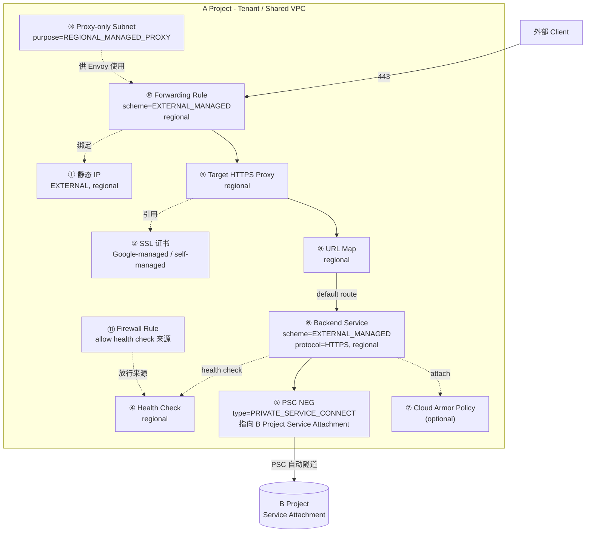
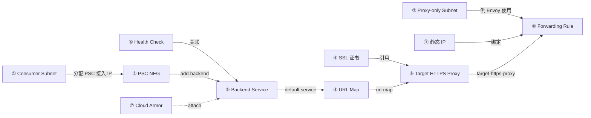

# 跨项目 PSC NEG — Tenant Project (Project A) 完整资源创建指南

> 本文档是 `3.md` 的**补充与修订**，**只关注 Tenant Project (Project A) 这一侧要创建的所有资源**。
> Producer Project (Project B) 侧的资源（PSC NAT Subnet / Service Attachment / ILB）请参考 `3.md` 的 Step 1。

## 1. 为什么单独写一份 Tenant Project 文档

原 `3.md` 的 Step 2.1（创建 PSC NEG）讲得不错，但 **Step 2.2 / 2.3 / Step 3 存在以下缺口**：

| 缺口 | 后果 |
| --- | --- |
| Backend Service 用 `--global` | PSC NEG 是 regional 的，挂到 global backend service 会失败 |
| 没建 Proxy-only Subnet | Regional External HTTPS LB 启动时报 `Required proxy-only subnet` |
| 没建静态 IP | GLB 默认拿临时 IP，DNS 切流无法做 |
| 没建 SSL 证书 | Target HTTPS Proxy 命令只能写 `my-ssl-cert` 占位符 |
| 没建 Firewall | Health check 流量被默认 deny rule 挡住 |
| 没验证 / 清理脚本 | 排查靠人脑回忆资源名 |

**新文档的目标**：把 Tenant Project 这一侧要建的 **13 类资源**、**完整 gcloud 命令**、**3 个辅助脚本**（create / verify / cleanup）一次性梳理清楚，每一步给出可复制粘贴的命令。

---

## 2. 整体架构（Tenant Project 这一侧）



> **强约束**：除了 ② SSL 证书（global 资源）和 ⑦ Cloud Armor Policy（global 资源）外，其余 9 类资源**全部是 regional**，命令必须带 `--region=asia-east1`，**绝对不能用 `--global`**。

---

## 3. 前置条件（先确认，再动手）

### 3.1 从 Producer Project 拿到的关键信息

开始任何命令前，先填好这张表：

| 变量 | 示例 | 说明 |
| --- | --- | --- |
| `TENANT_PROJECT` | `a-project-xxxxxx` | Project A，**Service Project**（使用 Shared VPC） |
| `HOST_PROJECT` | `host-project-xxxxxx` | 拥有 Shared VPC 的 Host Project |
| `PRODUCER_PROJECT` | `b-project-xxxxxx` | Project B，提供 Service Attachment |
| `REGION` | `asia-east1` | **Tenant / Producer / ILB 必须在同一 region** |
| `VPC_NETWORK` | `shared-vpc-network` | 共享 VPC 网络名 |
| `CONSUMER_SUBNET` | `consumer-subnet` | 普通 subnet，供 PSC NEG 分配接入 IP |
| `PROXY_SUBNET` | `proxy-only-subnet` | Proxy-only subnet，供 Envoy 代理 |
| `SERVICE_ATTACHMENT_URI` | `projects/b-project/regions/asia-east1/serviceAttachments/my-service-attachment` | B Project 给的 Service Attachment 完整 URI |
| `PRODUCER_ILB_NETWORK` | `producer-vpc` | B Project 的 VPC 名（用于 `--allowed-google-projects` 等授权） |

> **关键：Region 三方一致**。Tenant / Producer 的 Service Attachment / ILB **必须在同一 region**，否则 PSC 通道建不起来。

### 3.2 确认 Shared VPC 上有 `compute.networkUser` 角色

PSC NEG 创建时会校验 Service Project 是否有 Host Project subnet 的 `compute.networkUser` 角色。**没有这个角色 → 创建失败，错误信息类似 `Permission denied on the specified resource`**。

```bash
# 检查 Service Project SA 在 Host Project subnet 上的权限
gcloud compute networks subnets get-iam-policy ${CONSUMER_SUBNET} \
  --project=${HOST_PROJECT} \
  --region=${REGION}

# 若未授权，补上（注意用 Service Project 的 service account 或 allUsers）
gcloud compute networks subnets add-iam-policy-binding ${CONSUMER_SUBNET} \
  --project=${HOST_PROJECT} \
  --region=${REGION} \
  --member="serviceAccount:${TENANT_PROJECT}@appspot.gserviceaccount.com" \
  --role="roles/compute.networkUser"
```

> **重要洞察**（来自 `3.md`）：Shared VPC 授权有两种粒度 — 整个 network / 单个 subnet。**只指定 `--subnetwork` 即可绕过 network 级别校验**，所以下面所有命令都只传 `--subnetwork` 不传 `--network`。

### 3.3 确认 Service Attachment 已 approve 本 Project

如果 Service Attachment 配置的是 `ACCEPT_MANUAL`，需要在 B Project 侧手动 approve A Project 的连接请求。检查方法：

```bash
# 在 Producer Project 侧查 connectedEndpoints
gcloud compute service-attachments describe ${SERVICE_ATTACHMENT_NAME} \
  --project=${PRODUCER_PROJECT} \
  --region=${REGION} \
  --format="json" | jq '.connectedEndpoints'
```

未出现 `${TENANT_PROJECT}` → 联系 Producer 运维加 accept-list 或 approve。

---

## 4. 资源清单与依赖顺序

按以下顺序创建，**靠前的资源是后续资源的依赖**：

| 序 | 资源 | 类型 | scope | 命令前缀 |
| --- | --- | --- | --- | --- |
| 1 | Consumer Subnet | 已有 / 新建 | regional | `gcloud compute networks subnets` |
| 2 | Proxy-only Subnet | 新建 | regional | `gcloud compute networks subnets create` |
| 3 | 静态 IP | 新建 | regional | `gcloud compute addresses create` |
| 4 | SSL 证书 | 新建 | **global** | `gcloud compute ssl-certificates create` |
| 5 | Health Check | 新建 | regional | `gcloud compute health-checks create` |
| 6 | PSC NEG | 新建 | regional | `gcloud compute network-endpoint-groups create` |
| 7 | Backend Service | 新建 | regional | `gcloud compute backend-services create` |
| 8 | Add Backend | 操作 | regional | `gcloud compute backend-services add-backend` |
| 9 | Cloud Armor Policy (opt) | 新建 | **global** | `gcloud compute security-policies create` |
| 10 | URL Map | 新建 | regional | `gcloud compute url-maps create` |
| 11 | Target HTTPS Proxy | 新建 | regional | `gcloud compute target-https-proxies create` |
| 12 | Forwarding Rule | 新建 | regional | `gcloud compute forwarding-rules create` |
| 13 | Firewall Rule | 新建 | regional | `gcloud compute firewall-rules create` |

---

## 5. 详细步骤

> 下面的命令假设 shell 已 export 第 3.1 节的所有变量。建议用第 7 节的 `create-tenant-lb.sh` 一键跑完。

### Step 1：网络前置（Consumer Subnet + Proxy-only Subnet）

#### 1.1 Consumer Subnet（普通 subnet，供 PSC NEG 分配接入 IP）

如果 Host Project 里已经有可用 subnet 可以复用，否则新建：

```bash
# 确认是否已有
gcloud compute networks subnets describe ${CONSUMER_SUBNET} \
  --project=${HOST_PROJECT} --region=${REGION} 2>/dev/null

# 没有则新建（在 Host Project，因为这是 Shared VPC）
gcloud compute networks subnets create ${CONSUMER_SUBNET} \
  --project=${HOST_PROJECT} \
  --network=${VPC_NETWORK} \
  --region=${REGION} \
  --range=10.0.1.0/24 \
  --enable-private-ip-google-access
```

> 关键：Consumer subnet **不需要** `purpose=PRIVATE_SERVICE_CONNECT`，普通 subnet 即可。这个 subnet 的 IP 仅用于 PSC NEG 入口，**不是 backend 真实 IP**。

#### 1.2 Proxy-only Subnet（Regional External HTTPS LB 硬性要求）

> **不建这个 subnet，Forwarding Rule 创建会报**：
> `Invalid value for field 'resource.IPAddress': ... 'The load balancing scheme EXTERNAL_MANAGED requires a proxy-only subnet'`

```bash
gcloud compute networks subnets create ${PROXY_SUBNET} \
  --project=${HOST_PROJECT} \
  --network=${VPC_NETWORK} \
  --region=${REGION} \
  --range=10.0.2.0/24 \
  --purpose=REGIONAL_MANAGED_PROXY \
  --role=ACTIVE
```

**关键 flag 说明**：

| Flag | 值 | 为什么 |
| --- | --- | --- |
| `--purpose` | `REGIONAL_MANAGED_PROXY` | 标记为 LB 代理专用，**不能放业务 VM** |
| `--role` | `ACTIVE` | 这个 VPC 里这个 subnet 是 active 角色（vs BACKUP） |
| `--range` | `/24` | **至少 /26**（GCP 最低要求），生产建议 /23 ~ /20 |

> 一个 region + 一个 VPC 只能有一个 active proxy-only subnet，重名会报错。

---

### Step 2：静态 IP（生产必须，DNS 切流靠它）

```bash
gcloud compute addresses create ${POC_PREFIX}-glb-ip \
  --project=${TENANT_PROJECT} \
  --region=${REGION} \
  --network-tier=PREMIUM \
  --ip-version=IPV4
```

记录分配的 IP：

```bash
GLB_IP=$(gcloud compute addresses describe ${POC_PREFIX}-glb-ip \
  --project=${TENANT_PROJECT} \
  --region=${REGION} \
  --format="value(address)")
echo "GLB IP: ${GLB_IP}"
```

> **网络层级 `PREMIUM` vs `STANDARD`**：POC 阶段用 PREMIUM 即可（Google 全球 Anycast）；如果想用更便宜的 STANDARD（中国 / 部分地区走 ISP）需用 `--ip-version=IPV4 --network-tier=STANDARD`，但 STARDARD 性能差。

---

### Step 3：SSL 证书（HTTPS 入口必备）

#### 3.1 Google-managed（推荐，POC 友好）

```bash
gcloud compute ssl-certificates create ${POC_PREFIX}-cert \
  --project=${TENANT_PROJECT} \
  --domains=api.example.com
```

> 这种证书由 Google 自动签发 + 续期，但要求 `api.example.com` 的 DNS A 记录**先指向 GLB 的 IP**（证明域名控制权）。如果 DNS 还没切到 GLB IP，就用下面的自管理证书。

#### 3.2 Self-managed（DNS 未切时使用）

```bash
# 1. 生成 CSR
openssl req -new -newkey rsa:2048 -nodes \
  -keyout tls.key \
  -out tls.csr \
  -subj "/CN=api.example.com"

# 2. 用 CA 签发（或自签）
openssl x509 -req -days 365 -in tls.csr -signkey tls.key -out tls.crt

# 3. 合并 PEM 并上传
cat tls.crt tls.key > tls.pem

gcloud compute ssl-certificates create ${POC_PREFIX}-cert \
  --project=${TENANT_PROJECT} \
  --certificate=tls.pem \
  --private-key=tls.key
```

---

### Step 4：Health Check（PSC NEG 的健康检查走的是 producer ILB 路径）

```bash
gcloud compute health-checks create http ${POC_PREFIX}-hc \
  --project=${TENANT_PROJECT} \
  --region=${REGION} \
  --port=80 \
  --request-path=/healthz \
  --check-interval=10s \
  --timeout=5s \
  --healthy-threshold=2 \
  --unhealthy-threshold=3
```

| Flag | 含义 |
| --- | --- |
| `--port` | Producer backend 服务实际监听的端口（**不是 PSC 接入 IP 的端口**） |
| `--request-path` | Producer 后端暴露的 health endpoint，需 B Project 配合 |
| `--check-interval/--timeout` | GCP 探测间隔 / 单次超时，建议 timeout < interval |

> Health check 流量通过 PSC 隧道发到 B Project 的 backend，**Producer 侧的后端 VM 也需要放行 health check 来源（见 Step 10 Firewall）**。

---

### Step 5：PSC NEG（核心 — 跨项目桥接）

```bash
gcloud compute network-endpoint-groups create ${POC_PREFIX}-neg \
  --project=${TENANT_PROJECT} \
  --region=${REGION} \
  --network-endpoint-type=PRIVATE_SERVICE_CONNECT \
  --psc-target-service=${SERVICE_ATTACHMENT_URI} \
  --subnetwork=${CONSUMER_SUBNET} \
  --network=${VPC_NETWORK}
```

> **只传 `--subnetwork` 也可以创建成功**（参考 3.md 的 Shared VPC IAM 洞察），但同时传 `--network` + `--subnetwork` 在 IAM 授权是 network 级别时更稳妥。

验证 NEG 状态（应该有 `pscConnectionId` 表示 PSC 通道已建立）：

```bash
gcloud compute network-endpoint-groups describe ${POC_PREFIX}-neg \
  --project=${TENANT_PROJECT} \
  --region=${REGION} \
  --format="json" | jq '.pscConnectionId, .pscTargetService'
```

---

### Step 6：Backend Service（Regional，不是 Global）

```bash
gcloud compute backend-services create ${POC_PREFIX}-bs \
  --project=${TENANT_PROJECT} \
  --region=${REGION} \
  --load-balancing-scheme=EXTERNAL_MANAGED \
  --protocol=HTTPS \
  --port-name=https \
  --health-checks=${POC_PREFIX}-hc \
  --health-checks-region=${REGION} \
  --timeout=30s \
  --enable-logging \
  --logging-sample-rate=1.0 \
  --description="Tenant LB → PSC NEG → B Project"
```

| 关键 flag | 值 | 说明 |
| --- | --- | --- |
| `--region` | `${REGION}` | **不能 `--global`**，PSC NEG 是 regional |
| `--load-balancing-scheme` | `EXTERNAL_MANAGED` | 对应 Regional External Application LB |
| `--protocol` | `HTTPS` | 与 Producer backend 协议对齐（Producer 通常 HTTPS） |
| `--port-name` | `https` | PSC NEG 不需要 named port，但 backend service 仍要求填一个占位 |
| `--health-checks-region` | `${REGION}` | 必须显式指定 regional health check 所在 region |

#### 把 PSC NEG 加进 Backend Service

```bash
gcloud compute backend-services add-backend ${POC_PREFIX}-bs \
  --project=${TENANT_PROJECT} \
  --region=${REGION} \
  --network-endpoint-group=${POC_PREFIX}-neg \
  --network-endpoint-group-region=${REGION}
```

> 注意：这是**`--network-endpoint-group` + `--network-endpoint-group-region`**，不是 `--instance-group`（后者是给 MIG 的）。

---

### Step 7：Cloud Armor（可选但强烈推荐）

```bash
# 1. 创建 security policy
gcloud compute security-policies create ${POC_PREFIX}-armor \
  --project=${TENANT_PROJECT} \
  --description="Tenant GLB protection"

# 2. 添加默认规则（rate limit + 地理封锁示例）
gcloud compute security-policies rules create 1000 \
  --project=${TENANT_PROJECT} \
  --security-policy=${POC_PREFIX}-armor \
  --expression="true" \
  --action=rate-based-ban \
  --rate-limit-threshold-count=200 \
  --rate-limit-threshold-interval-sec=60 \
  --ban-duration-sec=600

# 3. 添加地理封锁示例（可选）
gcloud compute security-policies rules create 2000 \
  --project=${TENANT_PROJECT} \
  --security-policy=${POC_PREFIX}-armor \
  --expression="origin.region_code == 'CN'" \
  --action=deny-403

# 4. 绑定到 backend service
gcloud compute backend-services update ${POC_PREFIX}-bs \
  --project=${TENANT_PROJECT} \
  --region=${REGION} \
  --security-policy=${POC_PREFIX}-armor
```

---

### Step 8：URL Map

```bash
# 最简版本：所有请求都走 default service
gcloud compute url-maps create ${POC_PREFIX}-um \
  --project=${TENANT_PROJECT} \
  --region=${REGION} \
  --default-service=${POC_PREFIX}-bs \
  --description="Tenant GLB url map"
```

如果需要按路径分流（host-based / path-based）：

```bash
gcloud compute url-maps create ${POC_PREFIX}-um \
  --project=${TENANT_PROJECT} \
  --region=${REGION} \
  --default-service=${POC_PREFIX}-bs \
  --host-rule=host=api.example.com,path-matcher-name=api-paths

# 详细 host-rule / path-matcher 用法见 gcloud help url-maps
```

> `--region` 的 url-maps 创建后**不能再改成 global**，先想清楚再创建。

---

### Step 9：Target HTTPS Proxy

```bash
gcloud compute target-https-proxies create ${POC_PREFIX}-proxy \
  --project=${TENANT_PROJECT} \
  --region=${REGION} \
  --url-map=${POC_PREFIX}-um \
  --url-map-region=${REGION} \
  --ssl-certificates=${POC_PREFIX}-cert
```

> `--url-map-region` 必须显式传，否则 gcloud 默认找 global url map，会报 `url map not found`。

---

### Step 10：Forwarding Rule（GLB 入口）

```bash
gcloud compute forwarding-rules create ${POC_PREFIX}-fr \
  --project=${TENANT_PROJECT} \
  --region=${REGION} \
  --load-balancing-scheme=EXTERNAL_MANAGED \
  --target-https-proxy=${POC_PREFIX}-proxy \
  --target-https-proxy-region=${REGION} \
  --address=${POC_PREFIX}-glb-ip \
  --address-region=${REGION} \
  --ports=443 \
  --network-tier=PREMIUM \
  --description="Tenant GLB → PSC → B Project"
```

| 关键 flag | 值 | 说明 |
| --- | --- | --- |
| `--region` | `${REGION}` | **regional forwarding rule** |
| `--load-balancing-scheme` | `EXTERNAL_MANAGED` | Regional External Application LB |
| `--target-https-proxy` / `--target-https-proxy-region` | 显式传 region | 否则 gcloud 默认找 global proxy |
| `--address` | Step 2 创建的静态 IP 名 | 不是 IP 值本身 |

---

### Step 11：Firewall Rule（放行 Health Check 来源）

GCP 健康检查从一组固定的 IP 段发过来（`35.191.0.0/16` + `130.211.0.0/22`）。**Producer 侧的 backend VM 要放行**（但 Producer 不是本文档范围）。**Tenant 侧不需要**为 health check 单独建 firewall — PSC NEG 流量走 GCP 内部通道。

但 **Tenant 侧仍然需要 2 个 firewall**：

1. **Allow proxy-only subnet → backend**（如果 backend 在 Tenant VPC 内，但 PSC NEG 场景下 backend 在 Producer 侧，所以这条不需要）
2. **Allow IAP / SSH for debugging**（如果要从外部 SSH 到 Tenant VPC 内的 VM）

对于纯 GLB 入口场景（backend 全在 B Project），Tenant Project 实际**不需要** 任何 firewall rule。

```bash
# 仅在调试时启用：放行 IAP SSH 到 Tenant VPC
gcloud compute firewall-rules create ${POC_PREFIX}-allow-iap-ssh \
  --project=${HOST_PROJECT} \
  --direction=INGRESS \
  --action=ALLOW \
  --rules=tcp:22 \
  --source-ranges=35.235.240.0/20 \
  --network=${VPC_NETWORK}
```

---

## 6. 资源依赖关系图



---

## 7. 完整脚本

### 7.1 create-tenant-lb.sh（一键创建全部 13 类资源）

```bash
#!/usr/bin/env bash
# create-tenant-lb.sh — Tenant Project 侧完整 LB 链路创建
# 依赖：gcloud, jq
# 用法：
#   export TENANT_PROJECT=a-project HOST_PROJECT=host-project \
#          PRODUCER_PROJECT=b-project REGION=asia-east1 \
#          VPC_NETWORK=shared-vpc CONSUMER_SUBNET=consumer-subnet \
#          PROXY_SUBNET=proxy-only-subnet \
#          SERVICE_ATTACHMENT_URI=projects/b-project/regions/asia-east1/serviceAttachments/my-sa \
#          POC_PREFIX=poc
#   bash create-tenant-lb.sh
set -euo pipefail

: "${TENANT_PROJECT:?must set TENANT_PROJECT}"
: "${HOST_PROJECT:?must set HOST_PROJECT}"
: "${PRODUCER_PROJECT:?must set PRODUCER_PROJECT}"
: "${REGION:?must set REGION}"
: "${VPC_NETWORK:?must set VPC_NETWORK}"
: "${CONSUMER_SUBNET:?must set CONSUMER_SUBNET}"
: "${PROXY_SUBNET:?must set PROXY_SUBNET}"
: "${SERVICE_ATTACHMENT_URI:?must set SERVICE_ATTACHMENT_URI}"
: "${POC_PREFIX:=poc}"

log()  { printf '\033[34m%s\033[0m\n' "$*"; }
ok()   { printf '\033[32m%s\033[0m\n' "$*"; }
fail() { printf '\033[31m%s\033[0m\n' "$*" >&2; exit 1; }

# ─── Step 1: Consumer Subnet（Host Project 侧） ─────────────
log "Step 1.1: 确保 Consumer Subnet 存在..."
if ! gcloud compute networks subnets describe "${CONSUMER_SUBNET}" \
    --project="${HOST_PROJECT}" --region="${REGION}" &>/dev/null; then
  gcloud compute networks subnets create "${CONSUMER_SUBNET}" \
    --project="${HOST_PROJECT}" --network="${VPC_NETWORK}" \
    --region="${REGION}" --range=10.0.1.0/24 \
    --enable-private-ip-google-access
fi
ok "  ✓ Consumer Subnet OK"

# ─── Step 1.2: Proxy-only Subnet ─────────────────────────────
log "Step 1.2: 创建 Proxy-only Subnet..."
if ! gcloud compute networks subnets describe "${PROXY_SUBNET}" \
    --project="${HOST_PROJECT}" --region="${REGION}" &>/dev/null; then
  gcloud compute networks subnets create "${PROXY_SUBNET}" \
    --project="${HOST_PROJECT}" --network="${VPC_NETWORK}" \
    --region="${REGION}" --range=10.0.2.0/24 \
    --purpose=REGIONAL_MANAGED_PROXY --role=ACTIVE
fi
ok "  ✓ Proxy-only Subnet OK"

# ─── Step 2: 静态 IP ─────────────────────────────────────────
log "Step 2: 创建静态 IP..."
if ! gcloud compute addresses describe "${POC_PREFIX}-glb-ip" \
    --project="${TENANT_PROJECT}" --region="${REGION}" &>/dev/null; then
  gcloud compute addresses create "${POC_PREFIX}-glb-ip" \
    --project="${TENANT_PROJECT}" --region="${REGION}" \
    --network-tier=PREMIUM --ip-version=IPV4
fi
GLB_IP=$(gcloud compute addresses describe "${POC_PREFIX}-glb-ip" \
  --project="${TENANT_PROJECT}" --region="${REGION}" --format="value(address)")
ok "  ✓ 静态 IP: ${GLB_IP}"

# ─── Step 3: SSL 证书（占位 — 需用户手动创建） ────────────────
log "Step 3: SSL 证书（需要用户预创建 ${POC_PREFIX}-cert）"
if ! gcloud compute ssl-certificates describe "${POC_PREFIX}-cert" \
    --project="${TENANT_PROJECT}" &>/dev/null; then
  fail "  ✗ SSL 证书 ${POC_PREFIX}-cert 不存在。请先在 global 范围创建证书。"
fi
ok "  ✓ SSL 证书 OK"

# ─── Step 4: Health Check ─────────────────────────────────────
log "Step 4: 创建 Health Check..."
if ! gcloud compute health-checks describe "${POC_PREFIX}-hc" \
    --project="${TENANT_PROJECT}" --region="${REGION}" &>/dev/null; then
  gcloud compute health-checks create http "${POC_PREFIX}-hc" \
    --project="${TENANT_PROJECT}" --region="${REGION}" \
    --port=80 --request-path=/healthz \
    --check-interval=10s --timeout=5s \
    --healthy-threshold=2 --unhealthy-threshold=3
fi
ok "  ✓ Health Check OK"

# ─── Step 5: PSC NEG ──────────────────────────────────────────
log "Step 5: 创建 PSC NEG..."
if ! gcloud compute network-endpoint-groups describe "${POC_PREFIX}-neg" \
    --project="${TENANT_PROJECT}" --region="${REGION}" &>/dev/null; then
  gcloud compute network-endpoint-groups create "${POC_PREFIX}-neg" \
    --project="${TENANT_PROJECT}" --region="${REGION}" \
    --network-endpoint-type=PRIVATE_SERVICE_CONNECT \
    --psc-target-service="${SERVICE_ATTACHMENT_URI}" \
    --subnetwork="${CONSUMER_SUBNET}" --network="${VPC_NETWORK}"
fi
ok "  ✓ PSC NEG OK"

# ─── Step 6: Backend Service ──────────────────────────────────
log "Step 6: 创建 Backend Service (regional)..."
if ! gcloud compute backend-services describe "${POC_PREFIX}-bs" \
    --project="${TENANT_PROJECT}" --region="${REGION}" &>/dev/null; then
  gcloud compute backend-services create "${POC_PREFIX}-bs" \
    --project="${TENANT_PROJECT}" --region="${REGION}" \
    --load-balancing-scheme=EXTERNAL_MANAGED \
    --protocol=HTTPS --port-name=https \
    --health-checks="${POC_PREFIX}-hc" \
    --health-checks-region="${REGION}" \
    --timeout=30s --enable-logging --logging-sample-rate=1.0
fi

# 把 NEG 加入 backend service
log "Step 6.1: 添加 PSC NEG 到 Backend Service..."
NEG_REF=$(gcloud compute network-endpoint-groups list \
  --project="${TENANT_PROJECT}" --region="${REGION}" \
  --filter="name=${POC_PREFIX}-neg" --format="value(selfLink)")
if gcloud compute backend-services describe "${POC_PREFIX}-bs" \
    --project="${TENANT_PROJECT}" --region="${REGION}" \
    --format="json" | jq -e --arg neg "${POC_PREFIX}-neg" \
    '.backends[]?.group | split("/")[-1] | select(. == $neg)' >/dev/null; then
  log "  → backend 已存在，跳过"
else
  gcloud compute backend-services add-backend "${POC_PREFIX}-bs" \
    --project="${TENANT_PROJECT}" --region="${REGION}" \
    --network-endpoint-group="${POC_PREFIX}-neg" \
    --network-endpoint-group-region="${REGION}"
fi
ok "  ✓ Backend Service OK"

# ─── Step 7: URL Map ─────────────────────────────────────────
log "Step 7: 创建 URL Map..."
if ! gcloud compute url-maps describe "${POC_PREFIX}-um" \
    --project="${TENANT_PROJECT}" --region="${REGION}" &>/dev/null; then
  gcloud compute url-maps create "${POC_PREFIX}-um" \
    --project="${TENANT_PROJECT}" --region="${REGION}" \
    --default-service="${POC_PREFIX}-bs"
fi
ok "  ✓ URL Map OK"

# ─── Step 8: Target HTTPS Proxy ───────────────────────────────
log "Step 8: 创建 Target HTTPS Proxy..."
if ! gcloud compute target-https-proxies describe "${POC_PREFIX}-proxy" \
    --project="${TENANT_PROJECT}" --region="${REGION}" &>/dev/null; then
  gcloud compute target-https-proxies create "${POC_PREFIX}-proxy" \
    --project="${TENANT_PROJECT}" --region="${REGION}" \
    --url-map="${POC_PREFIX}-um" --url-map-region="${REGION}" \
    --ssl-certificates="${POC_PREFIX}-cert"
fi
ok "  ✓ Target HTTPS Proxy OK"

# ─── Step 9: Forwarding Rule ──────────────────────────────────
log "Step 9: 创建 Forwarding Rule..."
if ! gcloud compute forwarding-rules describe "${POC_PREFIX}-fr" \
    --project="${TENANT_PROJECT}" --region="${REGION}" &>/dev/null; then
  gcloud compute forwarding-rules create "${POC_PREFIX}-fr" \
    --project="${TENANT_PROJECT}" --region="${REGION}" \
    --load-balancing-scheme=EXTERNAL_MANAGED \
    --target-https-proxy="${POC_PREFIX}-proxy" \
    --target-https-proxy-region="${REGION}" \
    --address="${POC_PREFIX}-glb-ip" --address-region="${REGION}" \
    --ports=443 --network-tier=PREMIUM
fi
ok "  ✓ Forwarding Rule OK"

ok "━━━━━━━━━━━━━━━━━━━━━━━━━━━━━━━━━━━━━━━━━━━━━━━━━━━━"
ok "✓ 全部 9 个 regional 资源 + 1 个 global 证书创建完成"
ok "✓ GLB IP: ${GLB_IP}"
ok "✓ DNS A 记录请指向: ${GLB_IP}"
ok "━━━━━━━━━━━━━━━━━━━━━━━━━━━━━━━━━━━━━━━━━━━━━━━━━━━━"
```

### 7.2 verify-tenant-lb.sh（资源 + 流量双层验证）

```bash
#!/usr/bin/env bash
# verify-tenant-lb.sh — 验证 Tenant Project 侧 LB 链路完整且可达
# 用法：bash verify-tenant-lb.sh
set -euo pipefail

: "${TENANT_PROJECT:?must set TENANT_PROJECT}"
: "${HOST_PROJECT:=${TENANT_PROJECT}}"
: "${REGION:?must set REGION}"
: "${POC_PREFIX:=poc}"

GREEN='\033[0;32m'; RED='\033[0;31m'; YELLOW='\033[1;33m'; RESET='\033[0m'
pass=0; fail=0; warn=0
ok()   { printf "${GREEN}✓${RESET} %s\n" "$*"; pass=$((pass+1)); }
bad()  { printf "${RED}✗${RESET} %s\n" "$*"; fail=$((fail+1)); }
note() { printf "${YELLOW}⚠${RESET} %s\n" "$*"; warn=$((warn+1)); }

echo "━━━━━ 1. 资源存在性检查 ━━━━━"

check() {
  local desc="$1" cmd="$2" notfound_msg="$3"
  if eval "$cmd" &>/dev/null; then
    ok "$desc"
  else
    bad "$desc — $notfound_msg"
  fi
}

check "Consumer Subnet" \
  "gcloud compute networks subnets describe ${POC_PREFIX%-*}-consumer-subnet --project=${HOST_PROJECT} --region=${REGION}" \
  "Subnet 不存在或权限不足"

check "Proxy-only Subnet (purpose=REGIONAL_MANAGED_PROXY)" \
  "gcloud compute networks subnets describe proxy-only-subnet --project=${HOST_PROJECT} --region=${REGION}" \
  "Proxy-only subnet 缺失，Forwarding Rule 将无法工作"

check "静态 IP" \
  "gcloud compute addresses describe ${POC_PREFIX}-glb-ip --project=${TENANT_PROJECT} --region=${REGION}" \
  "静态 IP 缺失"

check "SSL 证书 (global)" \
  "gcloud compute ssl-certificates describe ${POC_PREFIX}-cert --project=${TENANT_PROJECT}" \
  "SSL 证书缺失，HTTPS 入口会失败"

check "Health Check" \
  "gcloud compute health-checks describe ${POC_PREFIX}-hc --project=${TENANT_PROJECT} --region=${REGION}" \
  "Health Check 缺失"

check "PSC NEG" \
  "gcloud compute network-endpoint-groups describe ${POC_PREFIX}-neg --project=${TENANT_PROJECT} --region=${REGION}" \
  "PSC NEG 缺失"

check "Backend Service (regional)" \
  "gcloud compute backend-services describe ${POC_PREFIX}-bs --project=${TENANT_PROJECT} --region=${REGION}" \
  "Backend Service 缺失或不是 regional"

check "URL Map (regional)" \
  "gcloud compute url-maps describe ${POC_PREFIX}-um --project=${TENANT_PROJECT} --region=${REGION}" \
  "URL Map 缺失或不是 regional"

check "Target HTTPS Proxy (regional)" \
  "gcloud compute target-https-proxies describe ${POC_PREFIX}-proxy --project=${TENANT_PROJECT} --region=${REGION}" \
  "Target HTTPS Proxy 缺失或不是 regional"

check "Forwarding Rule (regional)" \
  "gcloud compute forwarding-rules describe ${POC_PREFIX}-fr --project=${TENANT_PROJECT} --region=${REGION}" \
  "Forwarding Rule 缺失或不是 regional"

echo
echo "━━━━━ 2. 关联关系检查 ━━━━━"

# Backend Service 是否引用了 NEG
if gcloud compute backend-services describe "${POC_PREFIX}-bs" \
    --project="${TENANT_PROJECT}" --region="${REGION}" --format=json 2>/dev/null \
    | jq -e --arg neg "${POC_PREFIX}-neg" \
      '.backends[]?.group | split("/")[-1] | select(. == $neg)' >/dev/null; then
  ok "Backend Service 已挂载 PSC NEG"
else
  bad "Backend Service 未挂载 PSC NEG"
fi

# NEG 是否成功连上 Service Attachment
PSC_CONN=$(gcloud compute network-endpoint-groups describe "${POC_PREFIX}-neg" \
  --project="${TENANT_PROJECT}" --region="${REGION}" --format="value(pscConnectionId)" 2>/dev/null || echo "")
if [[ -n "${PSC_CONN}" && "${PSC_CONN}" != "None" ]]; then
  ok "PSC NEG 已建立连接 (pscConnectionId=${PSC_CONN})"
else
  bad "PSC NEG 未建立连接 — Service Attachment 可能未 approve Tenant Project"
fi

# Cloud Armor（可选）
if gcloud compute backend-services describe "${POC_PREFIX}-bs" \
    --project="${TENANT_PROJECT}" --region="${REGION}" --format=json 2>/dev/null \
    | jq -e '.securityPolicy' >/dev/null; then
  ok "Cloud Armor Policy 已绑定"
else
  note "Cloud Armor Policy 未绑定（可选但推荐）"
fi

echo
echo "━━━━━ 3. 流量验证 ━━━━━"

GLB_IP=$(gcloud compute addresses describe "${POC_PREFIX}-glb-ip" \
  --project="${TENANT_PROJECT}" --region="${REGION}" --format="value(address)" 2>/dev/null || echo "")

if [[ -n "${GLB_IP}" ]]; then
  ok "GLB IP 解析: ${GLB_IP}"

  # HTTP 测（应 301/308 跳 HTTPS）
  HTTP_CODE=$(curl -sk -o /dev/null -w "%{http_code}" --max-time 10 "http://${GLB_IP}/" || echo "000")
  if [[ "${HTTP_CODE}" =~ ^(301|302|307|308)$ ]]; then
    ok "HTTP 入口正常 (${HTTP_CODE} → HTTPS)"
  else
    note "HTTP 返回码 ${HTTP_CODE}（如果 000 可能是 IP 尚未广播，等待 1-2 分钟）"
  fi

  # HTTPS 测（应 200 / 502 / 503，而不是 connection refused）
  HTTPS_CODE=$(curl -sk -o /dev/null -w "%{http_code}" --max-time 10 "https://${GLB_IP}/" || echo "000")
  case "${HTTPS_CODE}" in
    200) ok "HTTPS 入口正常 (200)" ;;
    502|503|504) note "HTTPS 返回 ${HTTPS_CODE} — 后端不健康或路径不存在" ;;
    000) bad "HTTPS 连接失败 — 检查 Forwarding Rule / Firewall" ;;
    *) note "HTTPS 返回 ${HTTPS_CODE}" ;;
  esac
else
  bad "无法获取 GLB IP"
fi

echo
echo "━━━━━━━━━━━━━━━━━━━━━━━━━━━━━━━━━━━━"
printf "通过: ${GREEN}%d${RESET}  失败: ${RED}%d${RESET}  警告: ${YELLOW}%d${RESET}\n" "$pass" "$fail" "$warn"
[[ "$fail" -eq 0 ]] || exit 1
```

### 7.3 cleanup-tenant-lb.sh（按逆序删除）

```bash
#!/usr/bin/env bash
# cleanup-tenant-lb.sh — 删除 Tenant Project 侧全部 LB 资源（逆序）
set -euo pipefail

: "${TENANT_PROJECT:?must set TENANT_PROJECT}"
: "${HOST_PROJECT:=${TENANT_PROJECT}}"
: "${REGION:?must set REGION}"
: "${POC_PREFIX:=poc}"

log() { printf '\033[33m%s\033[0m\n' "$*"; }
rmr() { gcloud "$@" delete --quiet 2>/dev/null || true; }

log "1. Forwarding Rule..."
rmr compute forwarding-rules describe "${POC_PREFIX}-fr" \
  --project="${TENANT_PROJECT}" --region="${REGION}"
rmr compute forwarding-rules describe "${POC_PREFIX}-fr" \
  --project="${TENANT_PROJECT}" --region="${REGION}" 2>/dev/null

log "2. Target HTTPS Proxy..."
gcloud compute target-https-proxies delete "${POC_PREFIX}-proxy" \
  --project="${TENANT_PROJECT}" --region="${REGION}" --quiet 2>/dev/null || true

log "3. URL Map..."
gcloud compute url-maps delete "${POC_PREFIX}-um" \
  --project="${TENANT_PROJECT}" --region="${REGION}" --quiet 2>/dev/null || true

log "4. Backend Service..."
gcloud compute backend-services delete "${POC_PREFIX}-bs" \
  --project="${TENANT_PROJECT}" --region="${REGION}" --quiet 2>/dev/null || true

log "5. PSC NEG..."
gcloud compute network-endpoint-groups delete "${POC_PREFIX}-neg" \
  --project="${TENANT_PROJECT}" --region="${REGION}" --quiet 2>/dev/null || true

log "6. Health Check..."
gcloud compute health-checks delete "${POC_PREFIX}-hc" \
  --project="${TENANT_PROJECT}" --region="${REGION}" --quiet 2>/dev/null || true

log "7. SSL 证书 (global)..."
gcloud compute ssl-certificates delete "${POC_PREFIX}-cert" \
  --project="${TENANT_PROJECT}" --quiet 2>/dev/null || true

log "8. 静态 IP..."
gcloud compute addresses delete "${POC_PREFIX}-glb-ip" \
  --project="${TENANT_PROJECT}" --region="${REGION}" --quiet 2>/dev/null || true

log "9. Proxy-only Subnet (Host Project)..."
gcloud compute networks subnets delete "${POC_PREFIX}-proxy-subnet" \
  --project="${HOST_PROJECT}" --region="${REGION}" --quiet 2>/dev/null || true

log "10. Consumer Subnet (Host Project，谨慎！其他 LB 可能复用)..."
# 默认注释，避免误删。取消注释可执行。
# gcloud compute networks subnets delete "${POC_PREFIX}-consumer-subnet" \
#   --project="${HOST_PROJECT}" --region="${REGION}" --quiet 2>/dev/null || true

echo
echo "✓ 清理完成。Consumer Subnet 保留（可能被其他 LB 复用）。"
```

---

## 8. 与现有工具的关系

| 工具 | 用途 | 在本场景的角色 |
| --- | --- | --- |
| `3.md` (B Project 侧) | 跨项目 PSC 总览 + Producer 侧资源 | **生产者侧文档**，Step 1 对应本文档 Step 5 |
| `refer-lb-create.sh` | 从现有 MIG 关联的 LB 链路反推参数 | **POC 起步工具**：先在一个有 MIG 的项目跑一遍，确认 regional/global + port-name + health check 协议，再回到本脚本 |
| **本文档** | Tenant Project 完整资源创建 | **生产级实施指南** |

**典型工作流**：


---

## 9. 常见问题与排查

### 9.1 Forwarding Rule 创建报 `requires a proxy-only subnet`

→ Step 1.2 没建或建错 VPC / region。检查：

```bash
gcloud compute networks subnets list \
  --project=${HOST_PROJECT} \
  --filter="purpose=REGIONAL_MANAGED_PROXY AND region=${REGION}"
```

### 9.2 PSC NEG 创建报 `Permission denied`

→ Service Project (A) 对 Host Project subnet 没有 `compute.networkUser`。参考第 3.2 节补授权。

### 9.3 PSC NEG 创建成功但 `pscConnectionId` 为空

→ Service Attachment 未 approve Tenant Project，或者 region 不一致。检查：

```bash
# Tenant 侧
gcloud compute network-endpoint-groups describe ${POC_PREFIX}-neg \
  --project=${TENANT_PROJECT} --region=${REGION} --format="json" | jq

# Producer 侧
gcloud compute service-attachments describe my-sa \
  --project=${PRODUCER_PROJECT} --region=${REGION} --format="json" | jq '.connectedEndpoints'
```

### 9.4 Backend Service 报 `Network Endpoint Group ... is in region X but backend service is in region Y`

→ 所有 regional 资源的 `--region` 必须一致。用 verify 脚本的 `关联关系检查` 段排查。

### 9.5 Target HTTPS Proxy 创建报 `url map not found`

→ 漏了 `--url-map-region=${REGION}`，gcloud 默认找 global url map。

### 9.6 Forwarding Rule 创建报 `target proxy not found`

→ 漏了 `--target-https-proxy-region=${REGION}`，同 9.5。

### 9.7 HTTPS 访问返回 502/503

→ 后端不健康。在 Producer Project 检查 backend health：

```bash
gcloud compute backend-services list --project=${PRODUCER_PROJECT}
# 对每个 backend service 查 healthCheck
gcloud compute backend-services get-health ${PRODUCER_BS} \
  --project=${PRODUCER_PROJECT} --region=${REGION}
```

并确认 Producer 侧 backend service 也有 Tenant Project 自己的 health check 引用（不一定要同一个，但协议要对齐）。

### 9.8 清理时资源被引用，无法删除

→ 没按逆序删除，必须用 `cleanup-tenant-lb.sh` 或手工按 Step 9 → 1 的顺序操作。

---

## 10. 一句话总结

Tenant Project 侧建一个跨项目 PSC 入口 LB，**9 个 regional + 1 个 global** 共 10 类资源，全部命令在 `create-tenant-lb.sh` 里。

> **Region 一致性 + 静态 IP + Proxy-only Subnet + SSL 证书**，这 4 个是新手最容易漏的，按本文档顺序走不会出问题。

相关文档：
- `3.md` — Producer Project (B) 侧的 Service Attachment / ILB / PSC NAT Subnet
- `refer-lb-create.sh` — 从现有 LB 链路反推参数的 POC 工具
- `cross-project/psc-firewall.md` — Producer 侧 backend VM 防火墙放行规则
