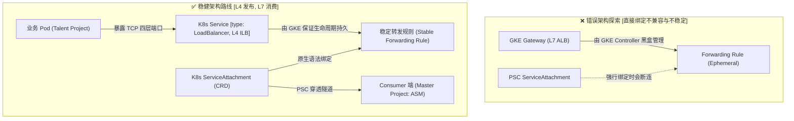
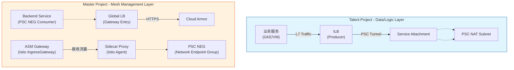

想要了解如何在 master project 上部署 Cloud Service Mesh (GKE Autopilot 或 Istio)，并实现与 talent project 通过 PSC NEG 进行跨项目通信。

这是一个关于 GKE、Istio/Service Mesh、PSC (Private Service Connect) 和跨项目网络架构的问题。

我需要：

理解用户当前的架构：Talent Project -> PSC NEG -> Master Project (GKE + Gateway)。
分析在 Master Project 上部署 Cloud Service Mesh (GCP 官方推荐通常是 Anthos Service Mesh / Istio) 的需求。
考虑跨项目通信、服务发现、安全策略等核心问题。
提供详细的实施步骤、配置建议和注意事项。
关键点：

Service Mesh 类型：Google Cloud 推荐使用 Anthos Service Mesh (ASM)，基于 Istio。需要确认 GKE 版本是否支持 Sidecar 注入。
跨项目通信：PSC NEG 已经打通了网络，但需要在 Master Project 的 Service Mesh 中配置 VirtualService、DestinationRule 等来路由流量。
安全与隔离：ASM 提供了 mTLS、访问控制等能力，可以增强现有的 PSC 连接安全性。
GKE 版本兼容性：需要确认 GKE 集群是否支持 Sidecar 注入（Autopilot vs Standard）。
网络规划：确保 Master Project 的 Pod CIDR 与 Talent Project 不冲突（虽然 PSC 是隔离的，但 Service Mesh 内部通信可能需要考虑）。
Mesh 配置：是否需要为 GKE 集群启用 Sidecar 注入。
我需要生成一个详细的方案，包括架构设计、部署步骤、配置示例以及注意事项。同时使用 Markdown 和 Mermaid 图表来辅助说明。

结构安排：

需求分析：明确目标（跨项目通信 + Service Mesh 管理）。
架构设计图：展示 PSC NEG + ASM 的流量路径。
Master Project 准备工作：GKE 版本、VPC-CNI 配置等。
Service Mesh 部署方案：ASM (Istio) 的安装方式（通过 GKE 控制台或 Helm）。
PSC 集成配置：如何在 Istio 中配置 Destination Rule 指向 PSC NEG。
安全与策略：mTLS、访问控制列表。
常见问题排查。
注意用户提到的 "Cloud Service Mesh"，在 GCP 生态中通常指 Anthos Service Mesh (基于 Istio)。需要明确这一点。同时，跨项目通信通过 PSC NEG 是 GCP 官方推荐的最佳实践之一，结合 ASM 可以进一步提升安全性。

我将按照以下结构组织回答：

核心结论与架构概览：确认可行性及整体架构图。
Master Project 前置准备：GKE 版本、网络规划。
Cloud Service Mesh (ASM) 部署方案：选择 Autopilot 还是 Standard Mode，安装步骤。
PSC 与 ASM 集成配置：关键配置（DestinationRule, VirtualService）。
安全增强策略：mTLS、Authorization Policies。
注意事项与最佳实践。
需要特别注意 PSC NEG 在 Service Mesh 中的表现，因为 PSC 的 IP 是动态的或者是通过 Service Attachment 映射的，Istio 需要正确解析。通常 PSC NEG 暴露的是一个 IP 或者一个域名（如果是 L7），这里用户提到的是 Gateway，通常是 L7。

让我开始构建回答。

这是一个非常经典且具有挑战性的企业级架构场景：**在 Master Project 上部署 Anthos Service Mesh (ASM)** 以统一管理微服务治理，同时通过 **PSC NEG** 安全地接收来自 Talent Project 的流量。

结合你之前的 PSC NEG 实现方案，这不仅是网络打通的问题，更是 **Service Mesh 治理与跨项目网络架构融合** 的问题。以下是对该需求的深度探索和实施方案。
- issue 
```bash
You cannot directly create a PSC ServiceAttachment from a GKE Gateway API resource like a Gateway. They are two different, incompatible control planes for managing GCP networking.

Here’s a breakdown of why and what you should do instead.

Why It Doesn't Work
Different Control Planes:

GKE Gateway API (Gateway, HTTPRoute) is designed to manage L7 Internal/External Application Load Balancers. The GKE controller owns and manages the underlying GCP resources (forwarding rules, target proxies, etc.). PSC (ServiceAttachment) is a separate GCP feature for publishing a service. The GKE ServiceAttachment CRD is a convenience wrapper that works by pointing to a Kubernetes Service of type: LoadBalancer (typically for L4 ILBs).

Unstable Producer Target: The forwarding rule created by the GKE Gateway API is considered an implementation detail. GKE can change or recreate it without warning (e.g., during upgrades or configuration changes). A PSC ServiceAttachment requires a stable forwarding rule to point to, which the Gateway API doesn't guarantee for this purpose.

Unsupported Producer Type: The specific type of load balancer created by gke-l7-rilb (the default internal GatewayClass) is not designed or documented to be a stable producer backend for PSC in this manner.

您无法直接基于 GKE Gateway API 资源（如 Gateway）来创建 PSC ServiceAttachment（服务连接）。它们是两个不同的、互不兼容的管理 GCP 网络的控制平面。

以下是具体的剖析：为什么这行不通，以及您此时应该怎么做。

为什么行不通 (Why It Doesn't Work)
不同的控制平面 (Different Control Planes)： GKE Gateway API（包括 Gateway 和 HTTPRoute 等对象）的设计初衷是用于管理 L7（七层）内部或外部应用负载均衡器。GKE 的控制器拥有并全权管理底层的 GCP 资源（例如转发规则、目标代理等）。而 PSC（ServiceAttachment）是一个独立的 GCP 功能，用于将服务对外发布。GKE 集群中的 ServiceAttachment CRD 仅仅是一个便捷封装版，它的工作原理是必须指向一个 type: LoadBalancer 类型的 Kubernetes Service（通常用于 L4 的内部负载均衡器 ILB）。

不稳定的生产者目标 (Unstable Producer Target)： 由 GKE Gateway API 自动创建的转发规则（Forwarding Rule）被视为系统内部的“实现细节”。GKE 可以在没有任何预先警告的情况下更改或重新创建它（例如，在集群升级或配置更新期间）。然而，一个 PSC ServiceAttachment 需要指向一个绝对稳定的转发规则，而 Gateway API 显然并未针对此目的提供类似保证。

不受支持的生产者类型 (Unsupported Producer Type)： 由 gke-l7-rilb（默认的七层内部网关类 GatewayClass）所创建出的这种特定类型的负载均衡器，其设计意图和官方文档都并未指明，它可以像这样用作支持 PSC 挂载的稳定“生产者后端（Producer backend）”。

Viewed 3-thinking.md:1-312

### 1. 中文翻译

您无法直接基于 GKE Gateway API 资源（如 `Gateway`）来创建 PSC ServiceAttachment（服务连接）。它们是两个不同的、互不兼容的管理 GCP 网络的控制平面。

以下是具体的剖析：为什么这行不通，以及您此时应该怎么做。

#### 为什么行不通 (Why It Doesn't Work)

*   **不同的控制平面 (Different Control Planes)**：
    GKE Gateway API（包括 `Gateway` 和 `HTTPRoute` 等对象）的设计初衷是用于管理 L7（七层）内部或外部应用负载均衡器。GKE 的控制器拥有并全权管理底层的 GCP 资源（例如转发规则、目标代理等）。而 PSC（ServiceAttachment）是一个独立的 GCP 功能，用于将服务对外发布。GKE 集群中的 `ServiceAttachment` CRD 仅仅是一个便捷封装版，它的工作原理是必须指向一个 `type: LoadBalancer` 类型的 Kubernetes Service（通常用于 L4 的内部负载均衡器 ILB）。

*   **不稳定的生产者目标 (Unstable Producer Target)**：
    由 GKE Gateway API 自动创建的转发规则（Forwarding Rule）被视为系统内部的“实现细节”。GKE 可以在没有任何预先警告的情况下更改或重新创建它（例如，在集群升级或配置更新期间）。然而，一个 PSC ServiceAttachment 需要指向一个**绝对稳定**的转发规则，而 Gateway API 显然并未针对此目的提供类似保证。

*   **不受支持的生产者类型 (Unsupported Producer Type)**：
    由 `gke-l7-rilb`（默认的七层内部网关类 GatewayClass）所创建出的这种特定类型的负载均衡器，其设计意图和官方文档都并未指明，它可以像这样用作支持 PSC 挂载的稳定“生产者后端（Producer backend）”。

---

### 2. 这个说法准确吗？评估结论

**评估结论：这段说法是“完全正确”且具有非常高的专业深度的。**

这段文字精准命中了 GKE 原生网络（Native Networking）实践中最容易踩坑的架构边界限制。作为 GCP 架构专家的深度解读与评估补充如下：

#### 为什么它是正确的？

1. **GKE ServiceAttachment CRD 的硬性代码预设**：
   在 GKE 环境下申请 `ServiceAttachment` 资源时，官方控制器会解析它的 `spec.resourceRef`。它被硬编码为**仅去寻找** `kind: Service` 且必须是基于包转发的 L4 内部负载均衡器（L4 ILB，需配置 annotation `networking.gke.io/load-balancer-type: "Internal"`）。如果你将 `resourceRef` 写成 `kind: Gateway`，CRD 处理层根本不认识它。
2. **所有权冲突与状态漂移（State Drift）**：
   GKE 的 Gateway Controller 自行掌管它创建出的 Forwarding Rule (FR)。如果你通过外部手段（如 gcloud/Terraform）强行把某个 PSC ServiceAttachment 绑定到该 FR 上，这就是在挑战 GKE 的"控制器权威"。一旦你更新了 Gateway 的某些配置，导致 GKE 自动删除了旧的 FR 并重建新 FR，你的 PSC 链路将在不知情的情况下发生永久性断网。
3. **架构底层生态的历史连贯性**：
   PSC 在 GCP 当中起初就是设计为主推挂接在四层内网 LB（Internal TCP/UDP Load Balancer）之后的。尽管如今 GCP 也逐渐支持挂载“七层内部应用负载均衡器”，但这种支持更多是通过复杂的跨项目 L7 路由体系（Cross-Project Internal ALB）以及 Private NAT 达成的，而不能直接单纯地把 GKE Gateway Controller 的下游产物当做稳定版 ServiceAttachment 基础。
```
---

### 3. 正确的替代方案架构 (What you should do instead)

如果您的核心诉求是：**将 Talent Project (Producer) 的微服务，稳定安全地发布给 Master Project (Consumer) 里的 ASM/Gateway 去消费**，请采取如下标准解法：



**操作落地建议**：
1. **Producer 退回 L4**：在提供方的 GKE（您的 Talent Project）中，放弃使用 Gateway API，转而仅暴露一个普通的四层 K8s Service (`type: LoadBalancer, annotaion: internal`)，在此之上挂载 K8s 原生的 ServiceAttachment CRD，使其成为一个标准的稳定的 L4 生产者。
2. **Consumer 承接 L7 使命**：当四层 TCP 流量被安全投递到您的 Consumer（Master Project）后，所有的 L7 分析、Host/Path 路由策略、mTLS 拆解保护，统一集中由 Master Project 里的 **Anthos Service Mesh (ASM IngressGateway)** 或者自身部署的 Kong / GKE Gateway 来实施。

这样的**“生产端重四层稳定，消费端重七层治理”**模式，正是跨项目和 Service Mesh 融合时的黄金排布。


---

## 1. 核心结论与架构概览

### ✅ 可行性确认

- **PSC + ASM 完全兼容**：GCP 官方支持将 PSC NEG 作为 Backend Service 挂载到 GKE，ASM (Istio) 可以接管该流量并进行治理（mTLS、限流、可观测性等）。
- **跨项目通信模式**：Talent Project -> PSC NEG -> Master Project Gateway (Sidecar)。

### 🏗️ 架构演进图



### 📊 方案对比：PSC + ASM vs 传统直连

| 维度         | PSC NEG + ASM (推荐)                | 传统 VPC Peering + 直连 IP   |
| :----------- | :---------------------------------- | :--------------------------- |
| **网络隔离** | 完全逻辑隔离，无需 VPC Peering      | 依赖 VPC Peering，路由需打通 |
| **IP 暴露**  | Master Project 不暴露真实 IP        | 需要配置 CIDR 避免冲突       |
| **安全性**   | **高** (PSC + mTLS + Authorization) | 中 (依赖网络 ACL)            |
| **可观测性** | **高** (Istio Prometheus/Jaeger)    | 低 (需单独部署监控)          |
| **治理能力** | **强** (限流、熔断、灰度发布)       | 弱 (仅负载均衡)              |

---

## 2. Master Project 前置准备

在 Master Project 上安装 ASM 之前，必须确保底层环境满足要求。

### 2.1 GKE 集群版本与模式选择

- **推荐模式**：**GKE Autopilot** 或 **Standard Mode (Sidecar)**。
  - **Autopilot**: 自动管理 Sidecar，无需手动注入，但配置灵活性稍低（需通过 `autoscaling` 配置）。
  - **Standard Mode**: 需要手动安装 Istio Pilot 和注入 Sidecar，适合复杂治理需求。
- **建议**：如果追求快速集成且集群规模可控，使用 **Autopilot with Anthos Service Mesh** (GCP Console 一键式)。

### 2.2 VPC 网络规划

PSC NEG 需要指定 `network` 和 `subnetwork`，确保该 Subnet 与 Talent Project 的 PSC IP 空间不冲突（通常 PSC IP 是独立管理的）。

```bash
# 检查 Master Project 的网络配置
gcloud compute networks describe master-network \
    --project=master-project \
    --region=asia-east1
```

### 2.3 创建 Anthos Service Mesh (ASM)

**方案 A：使用 GCP Console (推荐，最简单)**

1. 进入 GKE 集群详情 -> **Anthos Service Mesh**。
2. 开启并选择 **Istio**。
3. 等待 Istio Ingress Gateway 自动部署。

**方案 B：使用 Helm (适合 CI/CD 自动化)**

```bash
# 安装 Anthos Service Mesh Operator (用于管理)
helm repo add istio https://istio-release.storage.googleapis.com/releases
helm install sm-operator istio/smi-controller --namespace istio-system --create-namespace

# 部署 Istio Ingress Gateway (如果 Autopilot 未自动开启)
kubectl apply -f https://raw.githubusercontent.com/istio/istio/master/install/kubernetes/helm/istio-ingress-gateway/values.yaml \
    --namespace istio-system
```

---

## 3. PSC NEG 与 ASM 集成配置 (关键步骤)

这是最核心的部分：**如何让 ASM 知道如何处理来自 PSC NEG 的流量？**

### 3.1 确保 Gateway 指向 PSC NEG

在 Master Project 的 GKE 集群中，你需要确保 Ingress Controller 或 Gateway Service 的后端绑定的是 PSC NEG。

**方案一：使用 BackendService (GCP 负载均衡模式)**
如果你之前的 GLB -> BackendService -> PSC NEG 架构保持不变，ASM 的 Sidecar 会拦截 Pod 发出的流量。但如果是外部流量进来，ASM 的 `IngressGateway` 需要能路由到后端服务。

**方案二：直接绑定 PSC NEG (推荐用于跨项目)**
如果 Master Project 的 Gateway 是专门接收来自 Talent Project 的流量，可以直接将 BackendService 指向 PSC NEG，然后 ASM 接管该流量。

```bash
# 在 Master Project 中，创建后端服务指向 PSC NEG
gcloud compute backend-services create psc-backend-service \
    --project=master-project \
    --global \
    --protocol=HTTPS \
    --network-endpoint-group=psc-neg \
    --network-endpoint-group-region=asia-east1
```

### 3.2 Istio VirtualService 配置 (流量路由)

ASM 通过 `VirtualService` 定义流量如何被处理。由于 PSC NEG 是一个 IP 端点，你需要确保 ASM 能正确识别并转发给后端服务。

**注意**：PSC NEG 通常作为 GCP 负载均衡的后端存在。如果在 Istio 中直接使用 PSC IP，需要配置 `DestinationRule` 指定子集和协议。

```yaml
apiVersion: networking.istio.io/v1beta1
kind: VirtualService
metadata:
  name: cross-project-traffic
spec:
  hosts:
    - "*" # 或者指定具体域名
  http:
    - route:
        - destination:
            host: backend-service-name # 你的内部服务名
            port:
              number: 8080
```

### 3.3 Istio DestinationRule (服务发现)

如果 PSC NEG 暴露的是 IP，ASM 需要知道这个 IP 对应的服务。建议将 PSC NEG 配置为指向一个具体的 K8s Service（内部域名），而不是直接透传 IP，这样更利于 ASM 的治理。

```yaml
apiVersion: networking.istio.io/v1beta1
kind: DestinationRule
metadata:
  name: cross-project-backend
spec:
  host: backend-service-name # 内部服务名
  trafficPolicy:
    tls:
      mode: ISTIO_MUTUAL # 启用 mTLS，确保跨项目通信加密
```

---

## 4. 安全增强策略 (Authorization & mTLS)

ASM 的核心优势在于安全治理。你需要针对 PSC 流量制定专门的安全策略。

### 4.1 开启 mTLS (Mutual TLS)

即使通过 PSC 连接，PSC NEG 和 GCP 之间是加密的，但进入 Master Project Pod 后，建议开启 Istio mTLS 防止中间人攻击。

```yaml
# 启用自动 mTLS (ASM 默认开启)
apiVersion: security.istio.io/v1beta1
kind: PeerAuthentication
metadata:
  name: default
spec:
  mtls:
    mode: STRICT
```

### 4.2 访问控制策略 (Authorization Policy)

**限制只有 PSC NEG 的 IP 或特定域名可以访问 Master Project 服务。**

```yaml
apiVersion: security.istio.io/v1beta1
kind: AuthorizationPolicy
metadata:
  name: allow-psc-traffic
spec:
  selector:
    matchLabels:
      app: backend-service
  action: ALLOW
  rules:
    - from:
        - source:
            principals: ["cluster.local/ns/istio-system/sa/ingressgateway"] # 允许来自 ASM Gateway 的流量
          - source:
              ipBlocks: ["10.0.1.88/32"] # PSC NEG IP (需动态确认)
```

### 4.3 Cloud Armor 集成

在 GLB 层已经部署了 Cloud Armor，建议将 ASM 的访问策略也同步到 Cloud Armor 中（如 WAF、IP 黑名单）。

---

## 5. 常见问题与排查 (Troubleshooting)

| 问题现象                     | 可能原因                      | 解决方案                                                                                                                              |
| :--------------------------- | :---------------------------- | :------------------------------------------------------------------------------------------------------------------------------------ |
| **连接超时**                 | PSC NEG IP 未正确路由         | 检查 Talent Project Service Attachment 状态：`gcloud compute service-attachments describe`。确认 `connectedEndpoints` 为 `APPROVED`。 |
| **ASM Sidecar 无法解析域名** | DNS 配置问题                  | 确保 Master Project 的 CoreDNS 配置了 PSC 相关记录，或直接在 `VirtualService` 中使用 IP。                                             |
| **mTLS 握手失败**            | 证书不匹配或策略未生效        | 检查 `PeerAuthentication` 是否应用到命名空间；确认 GLB 到 PSC NEG 的流量经过了 ASM Gateway。                                          |
| **跨项目流量被拦截**         | VPC 防火墙或 Cloud Armor 规则 | 确保 Master Project 的 `security-policy` 允许该 Backend Service 端口。                                                                |

### 🔍 关键命令清单

```bash
# 1. 检查 PSC NEG 状态
gcloud compute network-endpoint-groups describe psc-neg \
    --project=master-project \
    --region=asia-east1

# 2. 检查 Service Attachment 状态 (Talent Project)
gcloud compute service-attachments describe my-service-attachment \
    --project=talent-project \
    --region=asia-east1

# 3. 查看 Istio Ingress Gateway 日志
kubectl logs -n istio-system deployment/istio-ingressgateway | grep -i "upstream"

# 4. 验证 ASM Dashboard (访问 https://<GKE_URL>/mesh)
```

---

## 6. 总结与最佳实践建议

### 🚀 实施路线图

1. **基础架构**：确保 Talent Project 的 PSC NEG 和 Service Attachment 已就绪且状态为 `APPROVED`。
2. **ASM 部署**：在 Master Project 启用 Anthos Service Mesh (Istio)。
3. **流量接入**：配置 GLB -> Cloud Armor -> ASM Ingress Gateway -> PSC NEG。
4. **安全加固**：配置 `AuthorizationPolicy` 限制仅允许 PSC 来源访问，开启 mTLS。
5. **监控告警**：在 GCP Operations / Prometheus 中配置针对 PSC 流量的延迟和错误率告警。

### 💡 专家建议

- **命名空间隔离**：建议在 Master Project 中使用独立的 Namespace (如 `talent-integration`) 来部署接收 PSC 流量的服务，避免与核心业务污染。
- **健康检查**：PSC NEG 的健康检查流量也需要经过 ASM 的 Sidecar，确保 ILB 的健康检查端口在 PSC 通道上是可达的。
- **版本管理**：GKE Autopilot 模式下的 Istio 版本由 GCP 自动管理，升级无需人工干预；Standard 模式需手动升级 Istio Operator。

通过上述方案，你不仅实现了跨项目的网络互通，还获得了 Service Mesh 带来的全链路治理和安全能力，是符合 Google Cloud 最佳实践的企业级架构设计。
