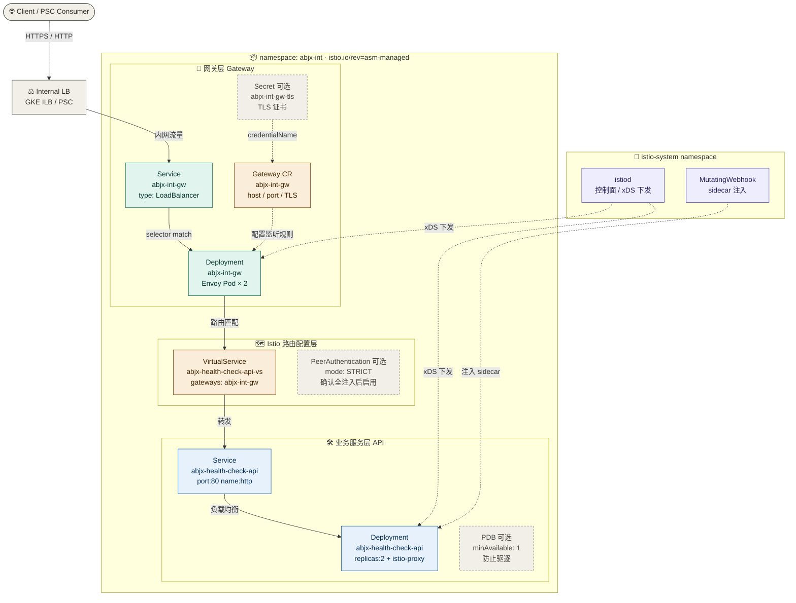
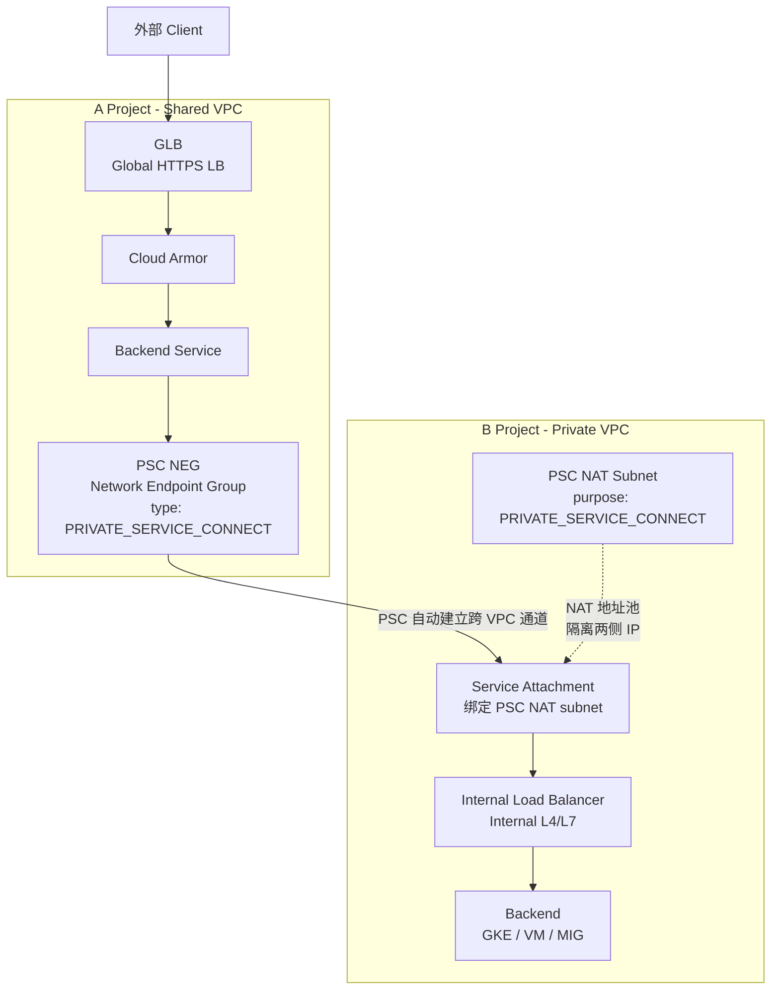
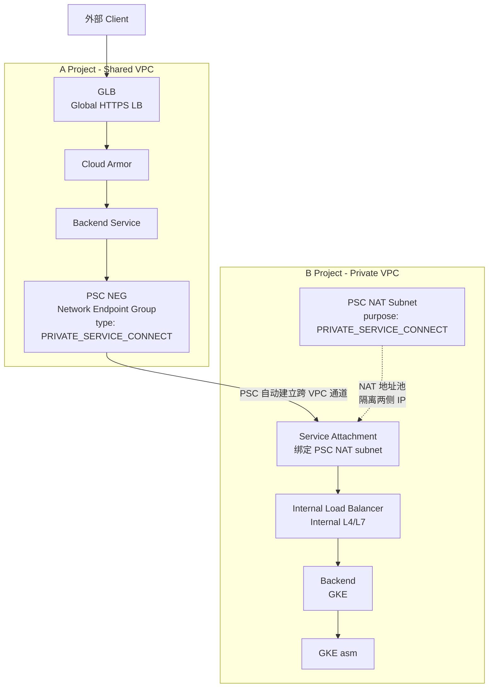

```mermaid
flowchart TB
  Client(["🌐 Client / PSC Consumer"])
  ILB["⚖️ Internal LB\nGKE ILB / PSC"]

  subgraph istio-system ["🔧 istio-system namespace"]
    direction LR
    istiod["istiod\n控制面 / xDS 下发"]
    webhook["MutatingWebhook\nsidecar 注入"]
  end

  subgraph abjx-int ["📦 namespace: abjx-int  ·  istio.io/rev=asm-managed"]
    direction TB

    subgraph gw-layer ["🚪 网关层 Gateway"]
      direction LR
      GW_SVC["Service\nabjx-int-gw\ntype: LoadBalancer"]
      GW_DEP["Deployment\nabjx-int-gw\nEnvoy Pod × 2"]
      GW_CR["Gateway CR\nabjx-int-gw\nhost / port / TLS"]
      TLS_SECRET["Secret 可选\nabjx-int-gw-tls\nTLS 证书"]
    end

    subgraph route-layer ["🗺️ Istio 路由配置层"]
      direction LR
      VS["VirtualService\nabjx-health-check-api-vs\ngateways: abjx-int-gw"]
      PA["PeerAuthentication 可选\nmode: STRICT\n确认全注入后启用"]
    end

    subgraph api-layer ["🛠️ 业务服务层 API"]
      direction LR
      API_DEP["Deployment\nabjx-health-check-api\nreplicas:2 + istio-proxy"]
      API_SVC["Service\nabjx-health-check-api\nport:80  name:http"]
      PDB["PDB 可选\nminAvailable: 1\n防止驱逐"]
    end
  end

  Client -->|"HTTPS / HTTP"| ILB
  ILB -->|"内网流量"| GW_SVC
  GW_SVC -->|"selector match"| GW_DEP
  GW_CR -. "配置监听规则" .-> GW_DEP
  TLS_SECRET -. "credentialName" .-> GW_CR
  GW_DEP -->|"路由匹配"| VS
  VS -->|"转发"| API_SVC
  API_SVC -->|"负载均衡"| API_DEP
  istiod -. "xDS 下发" .-> GW_DEP
  istiod -. "xDS 下发" .-> API_DEP
  webhook -. "注入 sidecar" .-> API_DEP

  classDef ext  fill:#F1EFE8,stroke:#5F5E5A,color:#2C2C2A
  classDef ctrl fill:#EEEDFE,stroke:#534AB7,color:#26215C
  classDef gw   fill:#E1F5EE,stroke:#0F6E56,color:#04342C
  classDef cfg  fill:#FAEEDA,stroke:#854F0B,color:#412402
  classDef api  fill:#E6F1FB,stroke:#185FA5,color:#042C53
  classDef opt  fill:#F1EFE8,stroke:#888780,color:#444441,stroke-dasharray:4 3

  class Client,ILB ext
  class istiod,webhook ctrl
  class GW_SVC,GW_DEP gw
  class GW_CR,VS cfg
  class API_DEP,API_SVC api
  class TLS_SECRET,PA,PDB opt
```

---
## 架构全景图

```mermaid
graph TD
    subgraph A_Project [A Project - Shared VPC]
        GLB["GLB\nGlobal HTTPS LB"]
        CA["Cloud Armor"]
        BS_A["Backend Service"]
        PSC_NEG["PSC NEG\nNetwork Endpoint Group\ntype: PRIVATE_SERVICE_CONNECT"]
    end

    subgraph B_Project [B Project - Private VPC]
        SA["Service Attachment\n绑定 PSC NAT subnet"]
        ILB["Internal Load Balancer\nInternal L4/L7"]
        GKE["Backend\nGKE / VM / MIG"]
        PSC_SUBNET["PSC NAT Subnet\npurpose: PRIVATE_SERVICE_CONNECT"]
    end

    Client["外部 Client"] --> GLB
    GLB --> CA
    CA --> BS_A
    BS_A --> PSC_NEG
    PSC_NEG -->|"PSC 自动建立跨 VPC 通道"| SA
    SA --> ILB
    ILB --> GKE
    PSC_SUBNET -.->|"NAT 地址池\n隔离两侧 IP"| SA
```

---

```mermaid
graph TD
    subgraph A_Project [A Project - Shared VPC]
        GLB["GLB\nGlobal HTTPS LB"]
        CA["Cloud Armor"]
        BS_A["Backend Service"]
        PSC_NEG["PSC NEG\nNetwork Endpoint Group\ntype: PRIVATE_SERVICE_CONNECT"]
    end

    subgraph B_Project [B Project - Private VPC]
        SA["Service Attachment\n绑定 PSC NAT subnet"]
        ILB["Internal Load Balancer\nInternal L4/L7"]
        GKE["Backend\nGKE"]
        ASM["GKE asm "]
        PSC_SUBNET["PSC NAT Subnet\npurpose: PRIVATE_SERVICE_CONNECT"]
    end

    Client["外部 Client"] --> GLB
    GLB --> CA
    CA --> BS_A
    BS_A --> PSC_NEG
    PSC_NEG -->|"PSC 自动建立跨 VPC 通道"| SA
    SA --> ILB
    ILB --> GKE
    GKE --> ASM
    PSC_SUBNET -.->|"NAT 地址池\n隔离两侧 IP"| SA
```