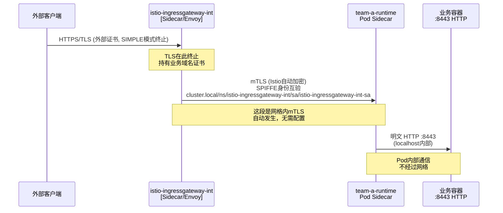
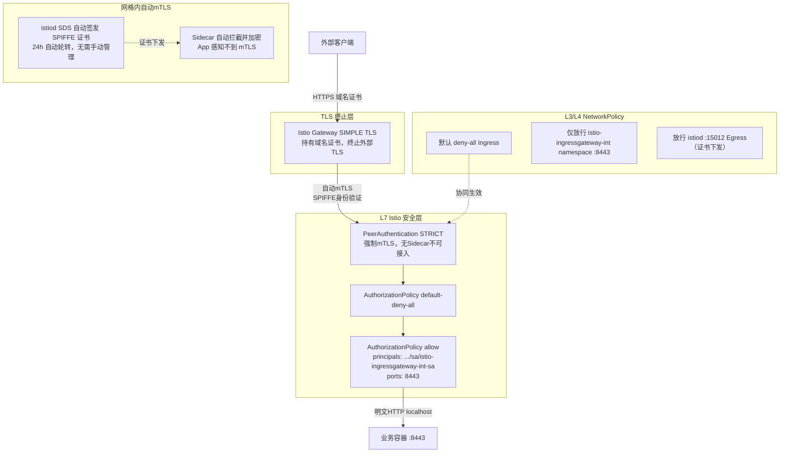

这是一个非常深入的问题，涉及 Istio 的核心工作机制。我来系统地拆解。

---

## 🔍 问题分析

你的核心疑问有两个：
1. **mTLS 证书在哪里？我没有手动配置，它是怎么工作的？**
2. **TLS 在 Gateway 终止后，Pod 之间明文通信，mTLS 还有意义吗？安全如何保障？**

---

## 一、Istio mTLS 工作原理：证书从哪来？

### 1.1 Sidecar 自动注入 + SPIFFE/SPIRE 身份体系

Istio 的 mTLS **不需要你手动管理证书**，这是它的核心设计。

```
每个 Pod 启动时：
  Kubernetes → 注入 istio-proxy (Envoy Sidecar)
               ↓
  istiod (Pilot + CA) → 颁发 SPIFFE 证书
               ↓
  证书格式：spiffe://cluster.local/ns/<namespace>/sa/<serviceaccount>
               ↓
  存储于 Sidecar 内存中（不落盘，不可见）
```

**你看不到证书**，因为：
- 证书由 `istiod` 的内置 CA（Citadel）自动签发
- 通过 xDS SDS（Secret Discovery Service）推送到每个 Envoy Sidecar
- 证书生命周期默认 **24小时**，自动轮转，全程透明

### 1.2 mTLS 在哪个层面发生

```
┌─────────────────────────────────────────────────────┐
│  Pod A                          Pod B               │
│  ┌──────────┐  ┌──────────┐    ┌──────────┐  ┌──────────┐│
│  │ App:8443 │  │ Sidecar  │    │ Sidecar  │  │ App:8443 ││
│  │ (明文HTTP)│  │ (Envoy)  │    │ (Envoy)  │  │ (明文HTTP)││
│  └──────────┘  └──────────┘    └──────────┘  └──────────┘│
│       ↑               ↑              ↑              ↑    │
│    localhost        mTLS握手在这里发生（Sidecar之间）      │
└─────────────────────────────────────────────────────┘
```

**关键理解**：
- App 容器 → Sidecar：**明文**（localhost 内部）
- Sidecar → Sidecar（跨 Pod）：**自动 mTLS 加密**
- 你的 App 完全不感知 mTLS 的存在

---

## 二、你的架构下 mTLS 完整流量路径



---

## 三、PeerAuthentication STRICT 的意义

你配置了 `STRICT` 模式，这意味着：

| 场景 | 是否允许 |
|------|----------|
| Sidecar → Sidecar（mTLS） | ✅ 允许 |
| 无 Sidecar 的 Pod 直连（明文） | ❌ 拒绝 |
| 外部流量绕过 Gateway 直连 | ❌ 拒绝 |
| Gateway Sidecar → App Sidecar | ✅ 允许（自动mTLS） |

**这就是你的 AuthorizationPolicy 生效的前提**：只有携带合法 SPIFFE 证书的 Sidecar 才能建立连接，AP 规则才能匹配 `principals`。

---

## 四、Pod 内 App 是 HTTPS 的问题

你提到"如果 Pod 内 App 也是 HTTPS（8443），会不会影响 Istio 配置？"

### 分析：

```
场景A：App 是 HTTP（推荐）
  Sidecar 接管 :8443 → mTLS → 对端 Sidecar → 转发明文到 App
  → AuthorizationPolicy 正常工作 ✅

场景B：App 本身是 HTTPS
  Sidecar 看到的是加密流量 → 无法解析 L7 信息
  → AuthorizationPolicy 的 ports/methods/paths 规则失效 ⚠️
  → 需要在 DestinationRule 中声明 TLS mode
```

**结论：你的 App 保持 HTTP（8443），让 Sidecar 处理加密，是正确选择。**

如果 App 必须是 HTTPS，需要额外配置：

```yaml
apiVersion: networking.istio.io/v1beta1
kind: DestinationRule
metadata:
  name: team-a-runtime-dr
  namespace: team-a-runtime
spec:
  host: "*.team-a-runtime.svc.cluster.local"
  trafficPolicy:
    tls:
      mode: DISABLE  # 告诉Sidecar不要再套mTLS，App自己处理TLS
```

---

## 五、完整 YAML 配置参考

### 5.1 Gateway（TLS SIMPLE 终止）

```yaml
apiVersion: networking.istio.io/v1beta1
kind: Gateway
metadata:
  name: team-a-gateway
  namespace: istio-ingressgateway-int
spec:
  selector:
    app: istio-ingressgateway-int  # 匹配你的自定义 Gateway Pod
  servers:
  - port:
      number: 443
      name: https
      protocol: HTTPS
    tls:
      mode: SIMPLE                  # 单向TLS，Gateway侧终止
      credentialName: team-a-tls-cert  # Secret名称，存放域名证书
    hosts:
    - "*.team-a.appdev.aibang"      # 匹配Team-A的域名
```

### 5.2 VirtualService

```yaml
apiVersion: networking.istio.io/v1beta1
kind: VirtualService
metadata:
  name: team-a-vs
  namespace: team-a-runtime
spec:
  hosts:
  - "*.team-a.appdev.aibang"
  gateways:
  - istio-ingressgateway-int/team-a-gateway
  http:
  - match:
    - uri:
        prefix: "/"
    route:
    - destination:
        host: team-a-service.team-a-runtime.svc.cluster.local
        port:
          number: 8443              # Service 端口，App 是 HTTP
```

### 5.3 PeerAuthentication（STRICT mTLS）

```yaml
apiVersion: security.istio.io/v1beta1
kind: PeerAuthentication
metadata:
  name: default-strict-mtls
  namespace: team-a-runtime
spec:
  mtls:
    mode: STRICT                    # 强制所有入站流量必须是 mTLS
  # 不设置 selector = 命名空间级别生效
```

### 5.4 AuthorizationPolicy（默认拒绝 + 放行 Gateway）

```yaml
# 默认拒绝所有
apiVersion: security.istio.io/v1beta1
kind: AuthorizationPolicy
metadata:
  name: default-deny-all
  namespace: team-a-runtime
spec:
  {}  # 空 spec = 拒绝所有

---
# 仅允许来自 Gateway 的流量
apiVersion: security.istio.io/v1beta1
kind: AuthorizationPolicy
metadata:
  name: allow-ingressgateway-int
  namespace: team-a-runtime
spec:
  action: ALLOW
  rules:
  - from:
    - source:
        principals:
          # SPIFFE格式：cluster.local/ns/<ns>/sa/<serviceaccount>
          - "cluster.local/ns/istio-ingressgateway-int/sa/istio-ingressgateway-int-sa"
    to:
    - operation:
        ports: ["8443"]
```

### 5.5 NetworkPolicy（L3/L4 双层防护）

```yaml
# 默认拒绝所有入站
apiVersion: networking.k8s.io/v1
kind: NetworkPolicy
metadata:
  name: default-deny-ingress
  namespace: team-a-runtime
spec:
  podSelector: {}
  policyTypes:
  - Ingress

---
# 允许来自 Gateway namespace 的流量
apiVersion: networking.k8s.io/v1
kind: NetworkPolicy
metadata:
  name: allow-from-ingressgateway-int
  namespace: team-a-runtime
spec:
  podSelector: {}
  policyTypes:
  - Ingress
  ingress:
  - from:
    - namespaceSelector:
        matchLabels:
          kubernetes.io/metadata.name: istio-ingressgateway-int
    ports:
    - protocol: TCP
      port: 8443

---
# 允许 istiod 控制面通信（证书下发必须）
apiVersion: networking.k8s.io/v1
kind: NetworkPolicy
metadata:
  name: allow-istiod-control-plane
  namespace: team-a-runtime
spec:
  podSelector: {}
  policyTypes:
  - Egress
  egress:
  - to:
    - namespaceSelector:
        matchLabels:
          kubernetes.io/metadata.name: istio-system
    ports:
    - protocol: TCP
      port: 15012   # istiod xDS/SDS 端口（证书下发）
    - protocol: TCP
      port: 15014   # istiod 监控端口
  - to:             # DNS 放行
    - namespaceSelector: {}
    ports:
    - protocol: UDP
      port: 53
```

---

## 六、安全层次总结



---

## ⚠️ 注意事项

1. **NetworkPolicy 必须放行 `:15012`**：这是 istiod SDS 端口，Sidecar 从这里获取 SPIFFE 证书。若被 NetworkPolicy 阻断，mTLS 将无法建立，Pod 间通信全部中断。

2. **AuthorizationPolicy 的 principals 匹配依赖 mTLS**：在 STRICT 模式下，AP 才能拿到对端的 SPIFFE 身份。若 PeerAuthentication 降级为 PERMISSIVE，AP 的 `principals` 规则对明文流量**不生效**。

3. **Gateway 的 ServiceAccount 名称要精确**：`istio-ingressgateway-int-sa` 必须与实际 Gateway Pod 使用的 SA 名称完全一致，可用 `kubectl get pod -n istio-ingressgateway-int -o jsonpath='{.items[0].spec.serviceAccountName}'` 验证。

4. **App 保持 HTTP，不要在 App 层再做 TLS**：让 Sidecar 统一处理加密，否则 L7 AuthorizationPolicy（基于 path/method/header 的规则）将失效。