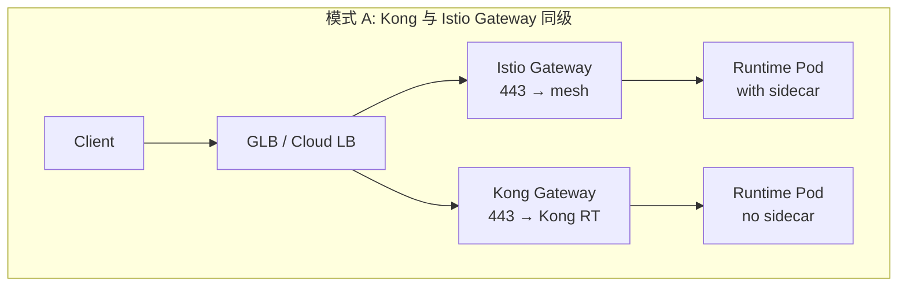
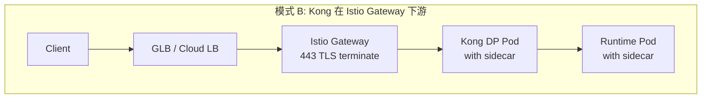
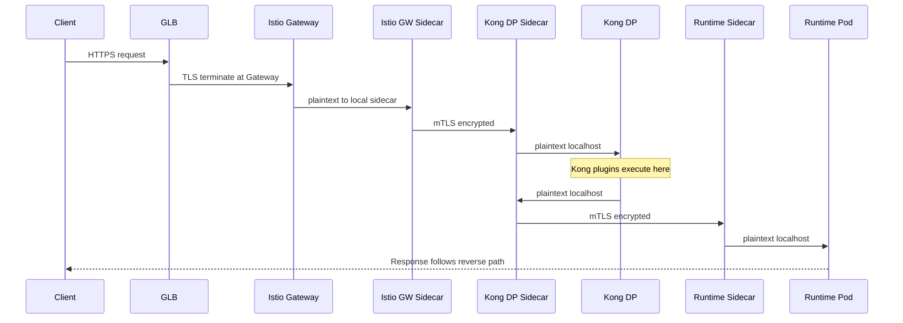
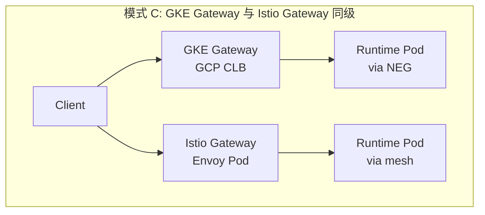
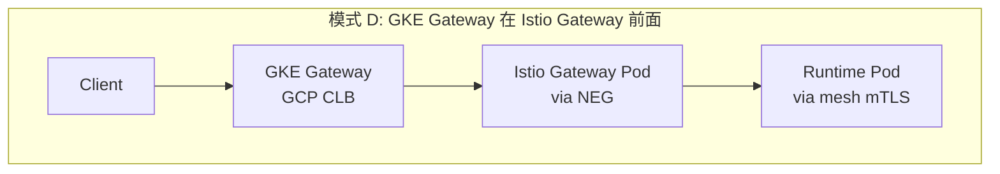
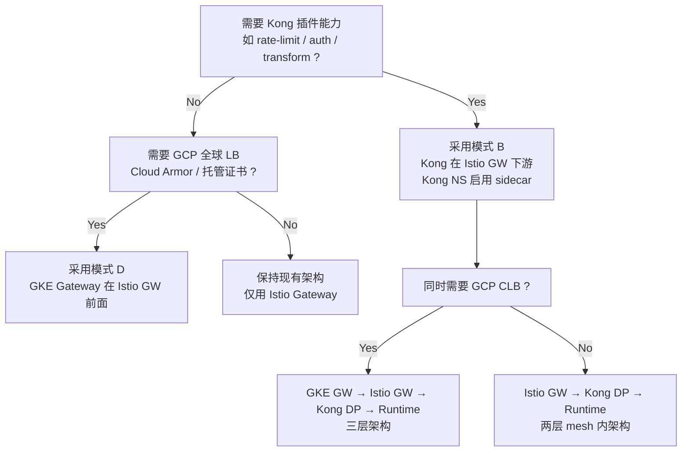

# Current 架构

## 三段流量的本质区别

| 段           | 路径                          | 加密方式            | 谁负责                |
| ------------ | ----------------------------- | ------------------- | --------------------- |
| ① 外部 TLS   | Client → Gateway              | 域名证书（SIMPLE）  | 你手动配置的 Secret   |
| ② 网格 mTLS  | Gateway Sidecar → App Sidecar | SPIFFE 证书（自动） | istiod 全权管理       |
| ③ Pod 内明文 | Sidecar → App 容器            | 无（localhost）     | iptables 拦截保障边界 |


## 部分 YAML 配置参考 当然这个部分里面我没有列出L3和L4的Network Policy。

### 1 Gateway（TLS SIMPLE 终止）

```yaml
apiVersion: networking.istio.io/v1beta1
kind: Gateway
metadata:
  name: team-a-gateway
  namespace: istio-ingressgateway-int
spec:
  selector:
    app: istio-ingressgateway-int  # 匹配你的自定义 Gateway Pod
  servers:
  - port:
      number: 443
      name: https
      protocol: HTTPS
    tls:
      mode: SIMPLE                  # 单向TLS，Gateway侧终止
      credentialName: team-a-tls-cert  # Secret名称，存放域名证书
    hosts:
    - "*.team-a.appdev.aibang"      # 匹配Team-A的域名
```

### 2 VirtualService

```yaml
apiVersion: networking.istio.io/v1beta1
kind: VirtualService
metadata:
  name: team-a-vs
  namespace: team-a-runtime
spec:
  hosts:
  - "*.team-a.appdev.aibang"
  gateways:
  - istio-ingressgateway-int/team-a-gateway
  http:
  - match:
    - uri:
        prefix: "/"
    route:
    - destination:
        host: team-a-service.team-a-runtime.svc.cluster.local
        port:
          number: 8443              # Service 端口，App 是 HTTP
```

### 3 PeerAuthentication（STRICT mTLS）

```yaml
apiVersion: security.istio.io/v1beta1
kind: PeerAuthentication
metadata:
  name: default-strict-mtls
  namespace: team-a-runtime
spec:
  mtls:
    mode: STRICT                    # 强制所有入站流量必须是 mTLS
  # 不设置 selector = 命名空间级别生效
```

### 4 AuthorizationPolicy（默认拒绝 + 放行 Gateway）

```yaml
# 默认拒绝所有
apiVersion: security.istio.io/v1beta1
kind: AuthorizationPolicy
metadata:
  name: default-deny-all
  namespace: team-a-runtime
spec:
  {}  # 空 spec = 拒绝所有

---
# 仅允许来自 Gateway 的流量
apiVersion: security.istio.io/v1beta1
kind: AuthorizationPolicy
metadata:
  name: allow-ingressgateway-int
  namespace: team-a-runtime
spec:
  action: ALLOW
  rules:
  - from:
    - source:
        principals:
          # SPIFFE格式：cluster.local/ns/<ns>/sa/<serviceaccount>
          - "cluster.local/ns/istio-ingressgateway-int/sa/istio-ingressgateway-int-sa"
    to:
    - operation:
        ports: ["8443"]
```

---

# 在已有 Istio Gateway 的环境中引入 Kong Gateway / GKE Gateway 的最佳实践

> 以下章节讨论：当 GKE 集群已启用 ASM（Istio）并以 Istio Gateway 作为入口网关时，
> 如何正确引入 **Kong Gateway** 或 **GKE Gateway（Gateway API 实现）**，
> 以及它们与 Istio sidecar 注入、mTLS、AuthorizationPolicy 之间的交互关系。

---

## 5 Istio Sidecar 注入机制回顾

在分析 Kong / GKE Gateway 之前，先明确 sidecar 注入的控制粒度：

| 控制层级 | 标签 / 注解 | 作用 |
|---|---|---|
| Namespace 级别 | `istio-injection=enabled` | 该 NS 下所有新建 Pod 自动注入 sidecar |
| Namespace 级别 | `istio-injection=disabled` | 该 NS 下所有新建 Pod **不注入** sidecar |
| Pod 级别 | `sidecar.istio.io/inject: "false"` (annotation) | 覆盖 NS 级别设置，单个 Pod 不注入 |
| Pod 级别 | `sidecar.istio.io/inject: "true"` (annotation) | 覆盖 NS 级别设置，单个 Pod 注入 |

**关键结论**：
- 你完全可以创建一个 **不带 `istio-injection` 标签** 的 Namespace，部署 Kong 或其他非 Istio 组件，**不会被自动注入 sidecar**。
- 即使集群启用了 ASM，sidecar 注入仍然是 **opt-in per Namespace / per Pod**，不是全局强制的。

---

## 6 Kong Gateway 集成方案

### 6.1 两种架构模式对比





### 6.2 模式 A — Kong 与 Istio Gateway **同级（并列入口）**

**架构要点**：
- Kong 部署在一个 **独立 Namespace**（如 `kong-gateway`），**不启用** `istio-injection`。
- Kong 有自己的 Service (type: LoadBalancer 或通过独立 BackendConfig 接入 GLB)。
- Kong 的路由 → 直连后端 Runtime Pod（这些 Pod 所在的 NS **也不注入 sidecar**，或者在 Kong 到后端之间不走 mTLS）。

**优点**：
- Kong 与 Istio **完全解耦**，互不影响。
- Kong 的插件生态（认证、限流、熔断、日志）完全独立运作。
- 运维复杂度低，两套网关各管各的流量。

**缺点**：
- Kong 到后端的流量 **不享受** mesh mTLS 保护，需要自行实现 TLS。
- 无法利用 Istio 的 AuthorizationPolicy / PeerAuthentication 对 Kong 流量进行治理。
- 如果后端 Runtime Pod 同时服务 Istio 和 Kong 流量，会出现 **安全策略冲突**：
  - 如果 NS 启用了 `STRICT` mTLS，Kong（无 sidecar）发来的明文流量会被拒绝。
  - 如果 NS 设置 `PERMISSIVE`，则降低了 Istio 侧的安全等级。

**适用场景**：
- Kong 管理的 API 与 Istio 管理的 API **完全隔离**（不同的后端 Pod / 不同的 Namespace）。
- 团队希望保留 Kong 全栈能力，不受 mesh 限制。

### 6.3 模式 B — Kong 在 Istio Gateway **下游（推荐）** ✅

**架构要点**：
- Kong DP（Data Plane）部署在一个 **启用了 `istio-injection=enabled`** 的 Namespace 中。
- Kong DP Pod 会被注入 Istio sidecar，成为 mesh 的一部分。
- 外部流量路径：`Client → GLB → Istio Gateway (TLS terminate) → Kong DP (with sidecar, mTLS) → Runtime Pod (with sidecar, mTLS)`。
- Istio Gateway 通过 VirtualService 将特定 host/path 路由到 Kong DP 的 Service。
- Kong 再根据自身路由规则将流量分发到最终的 Runtime Pod。

**优点**：
- **统一安全边界**：所有流量都在 mesh 内，mTLS 端到端覆盖。
- Kong 仍然可以使用其插件体系（rate-limiting, auth, transformation 等）。
- Istio 的 AuthorizationPolicy 可以同时保护 Kong DP 和后端 Runtime。
- 不需要为 Kong 单独暴露 LoadBalancer，减少公网暴露面。

**缺点**：
- Kong DP Pod 的 sidecar 会增加一跳延迟（通常 < 1ms）。
- 需要确保 Kong 的健康检查和探针兼容 sidecar 代理。
- 调试链路更长（Istio GW → sidecar → Kong → sidecar → 后端）。

### 6.4 模式 B 的 YAML 配置参考

#### 6.4.1 Kong Namespace（启用 sidecar 注入）

```yaml
apiVersion: v1
kind: Namespace
metadata:
  name: kong-dp
  labels:
    istio-injection: enabled        # Kong DP Pod 将被注入 sidecar
```

#### 6.4.2 Istio VirtualService — 将流量路由到 Kong DP

```yaml
apiVersion: networking.istio.io/v1beta1
kind: VirtualService
metadata:
  name: kong-route
  namespace: kong-dp
spec:
  hosts:
  - "*.kong.appdev.aibang"           # Kong 管理的域名模式
  gateways:
  - istio-ingressgateway-int/team-a-gateway   # 复用已有的 Istio Gateway
  http:
  - route:
    - destination:
        host: kong-dp-proxy.kong-dp.svc.cluster.local  # Kong DP 的 proxy Service
        port:
          number: 8000                # Kong proxy HTTP 端口
```

#### 6.4.3 AuthorizationPolicy — 放行 Istio Gateway 到 Kong DP

```yaml
apiVersion: security.istio.io/v1beta1
kind: AuthorizationPolicy
metadata:
  name: allow-istio-gw-to-kong
  namespace: kong-dp
spec:
  action: ALLOW
  rules:
  - from:
    - source:
        principals:
          - "cluster.local/ns/istio-ingressgateway-int/sa/istio-ingressgateway-int-sa"
    to:
    - operation:
        ports: ["8000"]
```

#### 6.4.4 AuthorizationPolicy — 放行 Kong DP 到 Runtime

```yaml
apiVersion: security.istio.io/v1beta1
kind: AuthorizationPolicy
metadata:
  name: allow-kong-to-runtime
  namespace: team-a-runtime
spec:
  action: ALLOW
  rules:
  - from:
    - source:
        principals:
          - "cluster.local/ns/kong-dp/sa/kong-dp-sa"  # Kong DP 的 Service Account
    to:
    - operation:
        ports: ["8443"]
```

#### 6.4.5 完整流量链路



### 6.5 Kong 不注入 sidecar 但后端在 mesh 内的折中方案

如果你希望 Kong 本身 **不被注入 sidecar**（例如避免 sidecar 对 Kong 性能的影响），但后端 Pod 在 mesh 内：

```yaml
# Kong Namespace: 不注入
apiVersion: v1
kind: Namespace
metadata:
  name: kong-dp
  labels:
    istio-injection: disabled

---
# Runtime Namespace: PeerAuthentication 设为 PERMISSIVE
apiVersion: security.istio.io/v1beta1
kind: PeerAuthentication
metadata:
  name: allow-plaintext-from-kong
  namespace: team-a-runtime
spec:
  mtls:
    mode: PERMISSIVE                # 允许明文 + mTLS 混合
  # selector:                       # 如需更精细控制，可指定特定 workload
  #   matchLabels:
  #     app: team-a-service
```

> [!CAUTION]
> 此方案会降低 Runtime Namespace 的安全等级。`PERMISSIVE` 模式下，
> 任何无 sidecar 的 Pod 都可直接以明文访问后端，绕过 mTLS 验证。
> **不推荐在生产环境使用**，除非有额外的 NetworkPolicy 作为补充。

---

## 7 GKE Gateway（Gateway API）集成方案

### 7.1 GKE Gateway 与 Istio Gateway 的本质区别

| 维度 | Istio Gateway | GKE Gateway（Gateway API） |
|---|---|---|
| 实现层 | Envoy proxy（用户空间 sidecar/standalone） | GCP Cloud Load Balancer（基础设施层） |
| 数据面位置 | **集群内** Pod（Envoy） | **集群外** GCP CLB + NEG |
| TLS 终止 | Gateway Pod 上（需手动挂证书） | CLB 上（GCP 证书管理器 / ManagedCert） |
| mTLS 支持 | 原生支持（SPIFFE 证书） | 需要通过 BackendPolicy + CLB 配置 |
| CRD 规范 | `networking.istio.io/v1beta1` | `gateway.networking.k8s.io/v1` |
| 与 mesh 关系 | **mesh 原生组件** | **mesh 外部组件**，不参与 mesh mTLS |

### 7.2 两种架构模式





### 7.3 模式 C — GKE Gateway 与 Istio Gateway 同级

**架构要点**：
- GKE Gateway 创建一个 GCP CLB，通过 NEG 直接路由到后端 Pod。
- 后端 Pod 如果在 mesh 内（有 sidecar），CLB 发来的流量是 **明文 HTTP**（因为 CLB 不参与 mesh mTLS）。
- 需要将 Pod 的 PeerAuthentication 设为 `PERMISSIVE`，或对特定端口排除 sidecar 拦截。

**缺点**：
- 与 Kong 模式 A 相同的问题：mesh 安全等级降低。
- GKE Gateway 和 Istio Gateway 管理两套路由规则，运维分散。

**不推荐**，除非 GKE Gateway 管理的后端完全独立于 mesh。

### 7.4 模式 D — GKE Gateway 在 Istio Gateway **前面（推荐）** ✅

**架构要点**：
- GKE Gateway（GCP CLB）作为最外层负载均衡，处理：
  - TLS 终止（使用 GCP 托管证书）
  - Cloud Armor / WAF 防护
  - 全局负载均衡（Multi-region）
- CLB 将流量转发到 Istio Gateway Pod（通过 NEG）。
- Istio Gateway 再进入 mesh 内部路由。

**完整流量链路**：

```
Client → GKE Gateway (GCP CLB, TLS terminate, Cloud Armor)
       → Istio Gateway Pod (via NEG, HTTP/HTTPS)
       → Istio Sidecar → Runtime Sidecar (mTLS)
       → Runtime Pod
```

**优点**：
- **混合优势**：GCP CLB 提供全球负载均衡 + Cloud Armor + 托管证书；Istio mesh 提供 mTLS + 细粒度流量治理。
- mesh 内 mTLS 完整性不受影响（STRICT 模式可保持）。
- GKE Gateway 只需要知道 Istio Gateway Pod 的 NEG，**不直接暴露后端 Pod**。

**缺点**：
- 两层网关增加延迟（通常 CLB 增加 < 5ms）。
- 需要维护两层路由规则（GKE Gateway HTTPRoute + Istio VirtualService）。

### 7.5 模式 D 的 YAML 配置参考

#### 7.5.1 GKE Gateway 资源

```yaml
apiVersion: gateway.networking.k8s.io/v1
kind: Gateway
metadata:
  name: external-gke-gateway
  namespace: infra-gateway
  annotations:
    networking.gke.io/certmap: "team-a-certmap"  # GCP 证书映射
spec:
  gatewayClassName: gke-l7-global-external-managed  # GCP 托管 CLB
  listeners:
  - name: https
    protocol: HTTPS
    port: 443
    tls:
      mode: Terminate
      options:
        networking.gke.io/cert-manager-certs: "team-a-managed-cert"
    allowedRoutes:
      namespaces:
        from: All
```

#### 7.5.2 HTTPRoute — 路由到 Istio Gateway Pod

```yaml
apiVersion: gateway.networking.k8s.io/v1
kind: HTTPRoute
metadata:
  name: route-to-istio-gw
  namespace: istio-ingressgateway-int
spec:
  parentRefs:
  - name: external-gke-gateway
    namespace: infra-gateway
  hostnames:
  - "*.team-a.appdev.aibang"
  rules:
  - backendRefs:
    - name: istio-ingressgateway-int  # Istio Gateway Service
      port: 443
```

#### 7.5.3 Istio Gateway Service 需要 NEG 注解

```yaml
apiVersion: v1
kind: Service
metadata:
  name: istio-ingressgateway-int
  namespace: istio-ingressgateway-int
  annotations:
    cloud.google.com/neg: '{"ingress": true}'  # 启用 NEG 供 GKE Gateway 使用
spec:
  type: ClusterIP          # 不再需要 LoadBalancer，由 GKE Gateway 暴露
  ports:
  - name: https
    port: 443
    targetPort: 8443
  selector:
    app: istio-ingressgateway-int
```

---

## 8 三种 Gateway 模式总结对比

| 维度 | Istio Gateway（当前） | Kong Gateway（推荐模式 B） | GKE Gateway（推荐模式 D） |
|---|---|---|---|
| **部署位置** | 集群内 Envoy Pod | 集群内 Kong DP Pod（with sidecar） | 集群外 GCP CLB |
| **TLS 终止** | Gateway Pod 上 | Istio GW 上（Kong 收明文） | GCP CLB 上 |
| **mTLS 参与** | ✅ 完全参与 mesh | ✅ 通过 sidecar 参与 | ❌ CLB 不参与 mesh |
| **mesh 安全完整性** | ✅ STRICT | ✅ STRICT 保持 | ✅ STRICT 保持（CLB→Istio GW 这段非 mTLS） |
| **插件/策略能力** | VirtualService + AuthPolicy | Kong 插件 + Istio AuthPolicy | Cloud Armor + HTTPRoute |
| **全球负载均衡** | ❌ 需额外 LB | ❌ 需额外 LB | ✅ 原生支持 |
| **运维复杂度** | 低 | 中等（多一个 Kong 组件） | 中等（两层路由规则） |
| **推荐场景** | 标准 mesh 内部路由 | 需要 Kong 插件生态（认证/限流/转换） | 需要全球 LB / Cloud Armor / 托管证书 |

### 决策树



> [!IMPORTANT]
> 无论选择哪种方案，**核心原则是不破坏现有 mesh 的 STRICT mTLS 策略**。
> 如果引入的新网关组件会导致你不得不将 PeerAuthentication 降级为 PERMISSIVE，
> 那么这个方案在安全层面就需要额外补偿措施（如 NetworkPolicy L3/L4 限制）。
