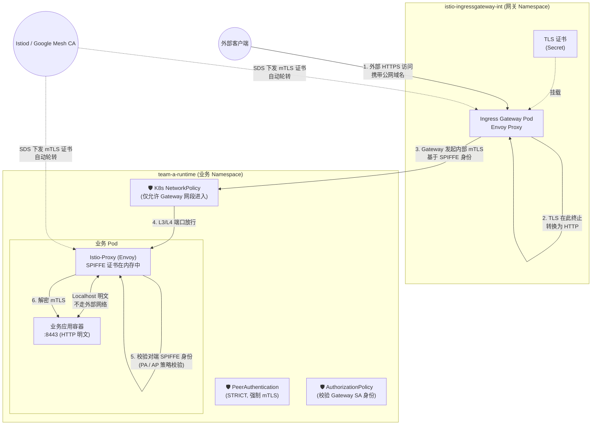
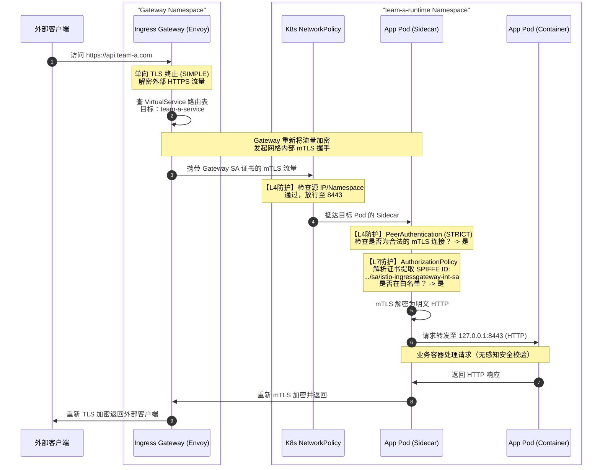

# Istio mTLS + Gateway TLS Termination 深度解析

> 适用环境：Google Cloud Service Mesh (ASM) / Upstream Istio
> 核心主题：mTLS 证书机制、三段流量架构、Zero Trust 安全模型

---

## 一、核心问题

1. **mTLS 证书在哪里？我没有手动配置，它是怎么工作的？**
2. **TLS 在 Gateway 终止后，Pod 之间明文通信，mTLS 还有意义吗？安全如何保障？**

---

## 二、三段流量的本质区别

| 段           | 路径                          | 加密方式            | 谁负责                    |
| ------------ | ----------------------------- | ------------------- | ------------------------- |
| ① 外部 TLS   | Client → Gateway              | 域名证书（SIMPLE）  | 你手动配置的 Secret       |
| ② 网格 mTLS  | Gateway Sidecar → App Sidecar | SPIFFE 证书（自动） | istiod / Mesh CA 全权管理 |
| ③ Pod 内明文 | Sidecar → App 容器            | 无（localhost）     | iptables 拦截保障边界     |

**第 ② 段是你"看不见但一直在工作"的部分**——istiod 在每个 Pod 启动时自动通过 SDS 推送证书，Envoy 之间握手全程透明，App 容器完全感知不到。

---

## 三、Istio mTLS 工作原理

### 3.1 证书从哪里来

Istio 的 mTLS **不需要你手动管理证书**，这是它的核心设计。

```
每个 Pod 启动时：
Kubernetes → 注入 istio-proxy (Envoy Sidecar)
↓ istiod (Pilot + CA) → 颁发 SPIFFE 证书
↓ 证书格式：spiffe://cluster.local/ns/<namespace>/sa/<serviceaccount>
↓ 存储于 Sidecar 内存中（不落盘，不可见）
```

**你看不到证书**，因为：
- 证书由 `istiod` 的内置 CA 自动签发（ASM 中也可使用 Google Mesh CA）
- 通过 xDS SDS（Secret Discovery Service）推送到每个 Envoy Sidecar
- 证书生命周期默认 **24 小时**，自动轮转，全程透明

### 3.2 mTLS 在哪个层面发生

```
┌─────────────────────────────────────────────────────┐
│ Pod A                                              │
│ ┌──────────┐   ┌──────────┐   ┌──────────┐         │
│ │App:8443  │◄──│ Sidecar  │◄──│  网络    │         │
│ │(明文HTTP)│   │ (Envoy)  │   │ mTLS加密 │         │
│ └──────────┘   └──────────┘   └──────────┘         │
└─────────────────────────────────────────────────────┘
                  ↑           ↑
              localhost    跨 Pod
              明文          mTLS 加密
```

**关键理解**：
- App 容器 → Sidecar：**明文**（localhost 内部）
- Sidecar → Sidecar（跨 Pod）：**自动 mTLS 加密**
- 你的 App 完全不感知 mTLS 的存在

### 3.3 GCP ASM vs Upstream Istio 的区别

| 特性           | Upstream Istio      | GCP ASM                  |
| -------------- | ------------------- | ------------------------ |
| 证书签发       | istiod 内置 Citadel | Google Mesh CA           |
| IAM 集成       | 无                  | 与 GCP IAM 绑定          |
| 客户端工作原理 | SPIFFE + SDS        | SPIFFE + SDS（完全一致） |
| Envoy 拦截机制 | iptables            | iptables（完全一致）     |

---

## 四、完整流量路径

### 4.1 架构拓扑



### 4.2 流量时序流



---

## 五、为什么 PeerAuthentication STRICT 是关键前提

`AuthorizationPolicy` 里的 `principals` 字段只有在 mTLS 握手完成后才能被填充（Envoy 从对端证书里提取 SPIFFE URI）。如果降级为 `PERMISSIVE`，明文流量进来时 `principals` 为空，AP 规则对明文流量**静默失效**——这是一个很隐蔽的安全漏洞。

配置了 `STRICT` 模式后的效果：

| 场景                           | 是否允许            |
| ------------------------------ | ------------------- |
| Sidecar → Sidecar（mTLS）      | ✅ 允许              |
| 无 Sidecar 的 Pod 直连（明文） | ❌ 拒绝              |
| 外部流量绕过 Gateway 直连      | ❌ 拒绝              |
| Gateway Sidecar → App Sidecar  | ✅ 允许（自动 mTLS） |

**STRICT 是 AP 规则生效的基础，不能妥协**。

---

## 六、Pod 内 App 是 HTTP 还是 HTTPS

### 分析

```text
场景A：App 是 HTTP（推荐）
Sidecar 接管 :8443 → mTLS → 对端 Sidecar → 转发明文到 App
→ AuthorizationPolicy 正常工作 ✅

场景B：App 本身是 HTTPS
Sidecar 看到的是加密流量 → 无法解析 L7 信息
→ AuthorizationPolicy 的 ports/methods/paths 规则失效 ⚠️
→ 需要在 DestinationRule 中声明 TLS mode
```

**结论：你的 App 保持 HTTP（8443），让 Sidecar 处理加密，是正确选择。**

### 如果 App 必须是 HTTPS

需要额外配置：

```yaml
apiVersion: networking.istio.io/v1beta1
kind: DestinationRule
metadata:
  name: team-a-runtime-dr
  namespace: team-a-runtime
spec:
  host: "*.team-a-runtime.svc.cluster.local"
  trafficPolicy:
    tls:
      mode: DISABLE # 告诉 Sidecar 不要再套 mTLS，App 自己处理 TLS
```

| 能力                   | App=HTTP | App=HTTPS |
| ---------------------- | -------- | --------- |
| Path 匹配              | ✅        | ❌         |
| Header 解析            | ✅        | ❌         |
| JWT 校验               | ✅        | ❌         |
| L7 AuthorizationPolicy | ✅        | ❌         |

---

## 七、完整 YAML 配置参考

### 7.1 Gateway（TLS SIMPLE 终止）

```yaml
apiVersion: networking.istio.io/v1beta1
kind: Gateway
metadata:
  name: team-a-gateway
  namespace: istio-ingressgateway-int
spec:
  selector:
    app: istio-ingressgateway-int
  servers:
    - port:
        number: 443
        name: https
        protocol: HTTPS
      tls:
        mode: SIMPLE
        credentialName: team-a-tls-cert
      hosts:
        - "*.team-a.appdev.aibang"
```

### 7.2 VirtualService

```yaml
apiVersion: networking.istio.io/v1beta1
kind: VirtualService
metadata:
  name: team-a-vs
  namespace: team-a-runtime
spec:
  hosts:
    - "*.team-a.appdev.aibang"
  gateways:
    - istio-ingressgateway-int/team-a-gateway
  http:
    - match:
        - uri:
            prefix: "/"
      route:
        - destination:
            host: team-a-service.team-a-runtime.svc.cluster.local
            port:
              number: 8443
```

### 7.3 PeerAuthentication（STRICT mTLS）

```yaml
apiVersion: security.istio.io/v1beta1
kind: PeerAuthentication
metadata:
  name: default-strict-mtls
  namespace: team-a-runtime
spec:
  mtls:
    mode: STRICT
```

### 7.4 AuthorizationPolicy（默认拒绝 + 放行 Gateway）

```yaml
# 默认拒绝所有
apiVersion: security.istio.io/v1beta1
kind: AuthorizationPolicy
metadata:
  name: default-deny-all
  namespace: team-a-runtime
spec:
  {}

---
# 仅允许来自 Gateway 的流量
apiVersion: security.istio.io/v1beta1
kind: AuthorizationPolicy
metadata:
  name: allow-ingressgateway-int
  namespace: team-a-runtime
spec:
  action: ALLOW
  rules:
    - from:
        - source:
            principals:
              - "cluster.local/ns/istio-ingressgateway-int/sa/istio-ingressgateway-int-sa"
      to:
        - operation:
            ports: ["8443"]
```

### 7.5 NetworkPolicy（L3/L4 双层防护）

```yaml
# 默认拒绝所有入站
apiVersion: networking.k8s.io/v1
kind: NetworkPolicy
metadata:
  name: default-deny-ingress
  namespace: team-a-runtime
spec:
  podSelector: {}
  policyTypes:
    - Ingress

---
# 允许来自 Gateway namespace 的流量
apiVersion: networking.k8s.io/v1
kind: NetworkPolicy
metadata:
  name: allow-from-ingressgateway-int
  namespace: team-a-runtime
spec:
  podSelector: {}
  policyTypes:
    - Ingress
  ingress:
    - from:
        - namespaceSelector:
            matchLabels:
              kubernetes.io/metadata.name: istio-ingressgateway-int
      ports:
        - protocol: TCP
          port: 8443

---
# 允许 istiod 控制面通信（证书下发必须）
apiVersion: networking.k8s.io/v1
kind: NetworkPolicy
metadata:
  name: allow-istiod-control-plane
  namespace: team-a-runtime
spec:
  podSelector: {}
  policyTypes:
    - Egress
  egress:
    - to:
        - namespaceSelector:
            matchLabels:
              kubernetes.io/metadata.name: istio-system
      ports:
        - protocol: TCP
          port: 15012
        - protocol: TCP
          port: 15014
    - to:
        - namespaceSelector: {}
      ports:
        - protocol: UDP
          port: 53
```

---

## 八、安全层次总结


### 双重零信任防护机制

| 防护层级            | 实现技术                    | 防御目标                                                                 | 你的配置体现                                                                            |
| ------------------- | --------------------------- | ------------------------------------------------------------------------ | --------------------------------------------------------------------------------------- |
| **L3/L4 网络层**    | Kubernetes `NetworkPolicy`  | 防止未经授权的 IP、外部网段、其他非白名单 Namespace 发起底层 TCP 连接    | 默认 `Deny-All` 入站，仅允许 `istio-ingressgateway-int` 命名空间的 IP 访问 `:8443`      |
| **网格传输层**      | Istio `PeerAuthentication`  | 防止内网抓包窃听；防止没有注入 Sidecar 的 Pod 冒充合法客户端发起请求     | `STRICT` 模式，任何不用 mTLS 发起的连接直接在 Sidecar 层面被掐断                        |
| **L7 应用与身份层** | Istio `AuthorizationPolicy` | 细粒度控制"谁可以访问"，即使配置失误导致网络层通了，身份不对依然会被拒绝 | 默认 `Deny-All`，仅允许携带 `istio-ingressgateway-int-sa` SPIFFE 证书的流量调用 `:8443` |

---

## 九、⚠️ 注意事项

1. **NetworkPolicy 必须放行 `:15012`**：这是 istiod SDS 端口，Sidecar 从这里获取 SPIFFE 证书。若被 NetworkPolicy 阻断，mTLS 将无法建立，Pod 间通信全部中断。

2. **AuthorizationPolicy 的 principals 匹配依赖 mTLS**：在 STRICT 模式下，AP 才能拿到对端的 SPIFFE 身份。若 PeerAuthentication 降级为 PERMISSIVE，AP 的 `principals` 规则对明文流量**不生效**。

3. **Gateway 的 ServiceAccount 名称要精确**：`istio-ingressgateway-int-sa` 必须与实际 Gateway Pod 使用的 SA 名称完全一致，可用以下命令验证：
   ```bash
   kubectl get pod -n istio-ingressgateway-int -o jsonpath='{.items[0].spec.serviceAccountName}'
   ```

4. **App 保持 HTTP，不要在 App 层再做 TLS**：让 Sidecar 统一处理加密，否则 L7 AuthorizationPolicy（基于 path/method/header 的规则）将失效。

---

## 十、✅ 最终总结

1. **mTLS 在 Sidecar 层实现，不是在应用层**
2. **Pod 使用 HTTP 仍然安全**：真实链路是 `Envoy ↔ Envoy = mTLS` 加密
3. **HTTPS 应该终止在 Gateway，避免破坏 Istio L7 能力**
4. **当前架构是标准 Zero Trust 模型**：
   - ✅ mTLS（身份认证）
   - ✅ AuthorizationPolicy（授权）
   - ✅ NetworkPolicy（网络隔离）