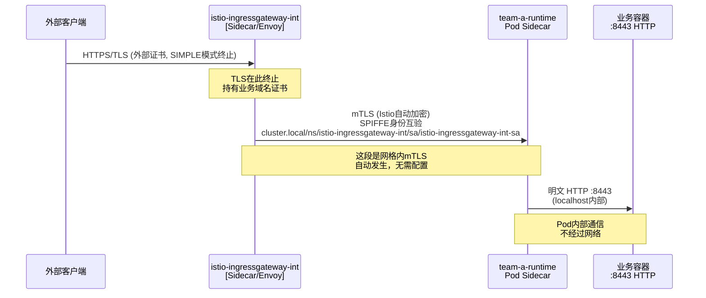
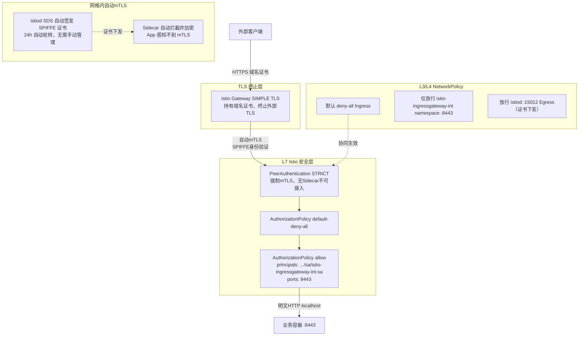
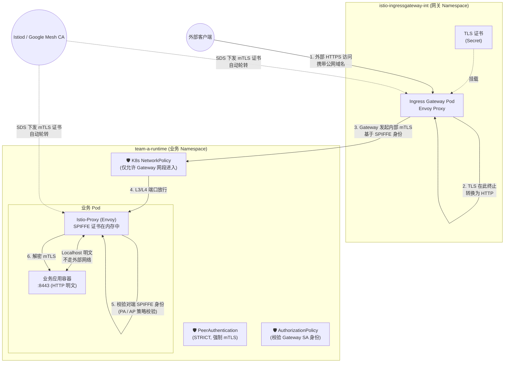
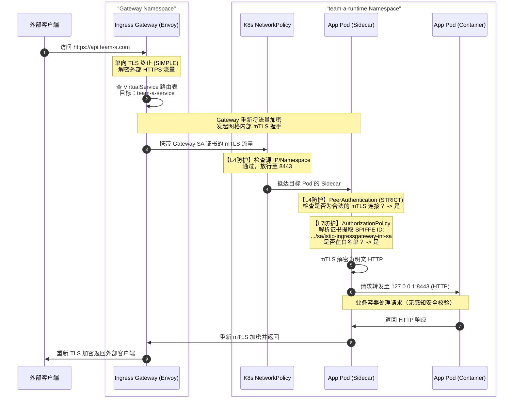

## 三段流量的本质区别

| 段           | 路径                          | 加密方式            | 谁负责                |
| ------------ | ----------------------------- | ------------------- | --------------------- |
| ① 外部 TLS   | Client → Gateway              | 域名证书（SIMPLE）  | 你手动配置的 Secret   |
| ② 网格 mTLS  | Gateway Sidecar → App Sidecar | SPIFFE 证书（自动） | istiod 全权管理       |
| ③ Pod 内明文 | Sidecar → App 容器            | 无（localhost）     | iptables 拦截保障边界 |

**第 ② 段是你"看不见但一直在工作"的部分**——istiod 在每个 Pod 启动时自动通过 SDS 推送证书，Envoy 之间握手全程透明，App 容器完全感知不到。

---
--
- 

## 为什么 PeerAuthentication STRICT 是关键前提

`AuthorizationPolicy` 里的 `principals` 字段只有在 mTLS 握手完成后才能被填充（Envoy 从对端证书里提取 SPIFFE URI）。如果降级为 `PERMISSIVE`，明文流量进来时 `principals` 为空，AP 规则对明文流量**静默失效**——这是一个很隐蔽的安全漏洞。

所以你的模型是正确的：**STRICT 是 AP 规则生效的基础，不能妥协**。
---

## 三段流量的本质区别

| 段           | 路径                          | 加密方式            | 谁负责                |
| ------------ | ----------------------------- | ------------------- | --------------------- |
| ① 外部 TLS   | Client → Gateway              | 域名证书（SIMPLE）  | 你手动配置的 Secret   |
| ② 网格 mTLS  | Gateway Sidecar → App Sidecar | SPIFFE 证书（自动） | istiod 全权管理       |
| ③ Pod 内明文 | Sidecar → App 容器            | 无（localhost）     | iptables 拦截保障边界 |

**第 ② 段是你"看不见但一直在工作"的部分**——istiod 在每个 Pod 启动时自动通过 SDS 推送证书，Envoy 之间握手全程透明，App 容器完全感知不到。


```bash
图中每个节点均可点击，会直接发起对应主题的追问。以下是核心要点的文字对照：
外部客户端HTTPS 请求 *.team-a.appdev.aibang
① HTTPS / TLS（外部证书）namespace: istio-ingressgateway-intIstio Gateway PodTLS SIMPLE 终止 · 持有域名证书Envoy SidecarSPIFFE 身份 · 持有 istiod 颁发证书明文istiod CA（SDS）→ 自动签发 SPIFFE 证书，每 24h 轮转，存于 Sidecar 内存，不落盘，不可见
② mTLS（自动加密）SPIFFE 双向证书验证NetworkPolicyL3/L4 仅放行 :8443namespace: team-a-runtimePeerAuthenticationSTRICT — 强制 mTLS，无证书即拒绝AuthorizationPolicydefault-deny-all + allow gateway SABusiness PodEnvoy Sidecar接收 mTLS 流量验证 SPIFFE 证书
③ 明文localhost业务容器 AppHTTP :8443（明文）完全感知不到 mTLSiptables 规则由 istio-init 注入，自动拦截所有出入站流量至 Sidecar（App 无感知）安全层说明① 外部 TLS（SIMPLE）客户端 → Gateway 终止。使用业务域名证书（team-a 独立证书）。Gateway 之后无外部 TLS。
② 网格内 mTLS（自动）Sidecar ↔ Sidecar 自动加密。istiod 颁发 SPIFFE 证书，无需手动配置。PeerAuthentication STRICT 强制。
③ Pod 内明文（localhost）Sidecar → App 容器，走 localhost，不经过网络，安全边界由 Sidecar 保障。双层防护NetworkPolicy（L3/L4）+ AuthorizationPolicy（L7 SPIFFE）同时生效，互为补充。
```
---


---

## 为什么 PeerAuthentication STRICT 是关键前提

`AuthorizationPolicy` 里的 `principals` 字段只有在 mTLS 握手完成后才能被填充（Envoy 从对端证书里提取 SPIFFE URI）。如果降级为 `PERMISSIVE`，明文流量进来时 `principals` 为空，AP 规则对明文流量**静默失效**——这是一个很隐蔽的安全漏洞。

所以你的模型是正确的：**STRICT 是 AP 规则生效的基础，不能妥协**。


这是一个非常深入的问题，涉及 Istio 的核心工作机制。我来系统地拆解。

---

## 🔍 问题分析

你的核心疑问有两个：
1. **mTLS 证书在哪里？我没有手动配置，它是怎么工作的？**
2. **TLS 在 Gateway 终止后，Pod 之间明文通信，mTLS 还有意义吗？安全如何保障？**

---

## 一、Istio mTLS 工作原理：证书从哪来？

### 1.1 Sidecar 自动注入 + SPIFFE/SPIRE 身份体系

Istio 的 mTLS **不需要你手动管理证书**，这是它的核心设计。

```
每个 Pod 启动时：
  Kubernetes → 注入 istio-proxy (Envoy Sidecar)
               ↓
  istiod (Pilot + CA) → 颁发 SPIFFE 证书
               ↓
  证书格式：spiffe://cluster.local/ns/<namespace>/sa/<serviceaccount>
               ↓
  存储于 Sidecar 内存中（不落盘，不可见）
```

**你看不到证书**，因为：
- 证书由 `istiod` 的内置 CA（Citadel）自动签发
- 通过 xDS SDS（Secret Discovery Service）推送到每个 Envoy Sidecar
- 证书生命周期默认 **24小时**，自动轮转，全程透明

### 1.2 mTLS 在哪个层面发生

```
┌─────────────────────────────────────────────────────┐
│  Pod A                          Pod B               │
│  ┌──────────┐  ┌──────────┐    ┌──────────┐  ┌──────────┐│
│  │ App:8443 │  │ Sidecar  │    │ Sidecar  │  │ App:8443 ││
│  │ (明文HTTP)│  │ (Envoy)  │    │ (Envoy)  │  │ (明文HTTP)││
│  └──────────┘  └──────────┘    └──────────┘  └──────────┘│
│       ↑               ↑              ↑              ↑    │
│    localhost        mTLS握手在这里发生（Sidecar之间）      │
└─────────────────────────────────────────────────────┘
```

**关键理解**：
- App 容器 → Sidecar：**明文**（localhost 内部）
- Sidecar → Sidecar（跨 Pod）：**自动 mTLS 加密**
- 你的 App 完全不感知 mTLS 的存在

---

## 二、你的架构下 mTLS 完整流量路径



---

## 三、PeerAuthentication STRICT 的意义

你配置了 `STRICT` 模式，这意味着：

| 场景                           | 是否允许           |
| ------------------------------ | ------------------ |
| Sidecar → Sidecar（mTLS）      | ✅ 允许             |
| 无 Sidecar 的 Pod 直连（明文） | ❌ 拒绝             |
| 外部流量绕过 Gateway 直连      | ❌ 拒绝             |
| Gateway Sidecar → App Sidecar  | ✅ 允许（自动mTLS） |

**这就是你的 AuthorizationPolicy 生效的前提**：只有携带合法 SPIFFE 证书的 Sidecar 才能建立连接，AP 规则才能匹配 `principals`。

---

## 四、Pod 内 App 是 HTTPS 的问题

你提到"如果 Pod 内 App 也是 HTTPS（8443），会不会影响 Istio 配置？"

### 分析：

```
场景A：App 是 HTTP（推荐）
  Sidecar 接管 :8443 → mTLS → 对端 Sidecar → 转发明文到 App
  → AuthorizationPolicy 正常工作 ✅

场景B：App 本身是 HTTPS
  Sidecar 看到的是加密流量 → 无法解析 L7 信息
  → AuthorizationPolicy 的 ports/methods/paths 规则失效 ⚠️
  → 需要在 DestinationRule 中声明 TLS mode
```

**结论：你的 App 保持 HTTP（8443），让 Sidecar 处理加密，是正确选择。**

如果 App 必须是 HTTPS，需要额外配置：

```yaml
apiVersion: networking.istio.io/v1beta1
kind: DestinationRule
metadata:
  name: team-a-runtime-dr
  namespace: team-a-runtime
spec:
  host: "*.team-a-runtime.svc.cluster.local"
  trafficPolicy:
    tls:
      mode: DISABLE  # 告诉Sidecar不要再套mTLS，App自己处理TLS
```

---

## 五、完整 YAML 配置参考

### 5.1 Gateway（TLS SIMPLE 终止）

```yaml
apiVersion: networking.istio.io/v1beta1
kind: Gateway
metadata:
  name: team-a-gateway
  namespace: istio-ingressgateway-int
spec:
  selector:
    app: istio-ingressgateway-int  # 匹配你的自定义 Gateway Pod
  servers:
  - port:
      number: 443
      name: https
      protocol: HTTPS
    tls:
      mode: SIMPLE                  # 单向TLS，Gateway侧终止
      credentialName: team-a-tls-cert  # Secret名称，存放域名证书
    hosts:
    - "*.team-a.appdev.aibang"      # 匹配Team-A的域名
```

### 5.2 VirtualService

```yaml
apiVersion: networking.istio.io/v1beta1
kind: VirtualService
metadata:
  name: team-a-vs
  namespace: team-a-runtime
spec:
  hosts:
  - "*.team-a.appdev.aibang"
  gateways:
  - istio-ingressgateway-int/team-a-gateway
  http:
  - match:
    - uri:
        prefix: "/"
    route:
    - destination:
        host: team-a-service.team-a-runtime.svc.cluster.local
        port:
          number: 8443              # Service 端口，App 是 HTTP
```

### 5.3 PeerAuthentication（STRICT mTLS）

```yaml
apiVersion: security.istio.io/v1beta1
kind: PeerAuthentication
metadata:
  name: default-strict-mtls
  namespace: team-a-runtime
spec:
  mtls:
    mode: STRICT                    # 强制所有入站流量必须是 mTLS
  # 不设置 selector = 命名空间级别生效
```

### 5.4 AuthorizationPolicy（默认拒绝 + 放行 Gateway）

```yaml
# 默认拒绝所有
apiVersion: security.istio.io/v1beta1
kind: AuthorizationPolicy
metadata:
  name: default-deny-all
  namespace: team-a-runtime
spec:
  {}  # 空 spec = 拒绝所有

---
# 仅允许来自 Gateway 的流量
apiVersion: security.istio.io/v1beta1
kind: AuthorizationPolicy
metadata:
  name: allow-ingressgateway-int
  namespace: team-a-runtime
spec:
  action: ALLOW
  rules:
  - from:
    - source:
        principals:
          # SPIFFE格式：cluster.local/ns/<ns>/sa/<serviceaccount>
          - "cluster.local/ns/istio-ingressgateway-int/sa/istio-ingressgateway-int-sa"
    to:
    - operation:
        ports: ["8443"]
```

### 5.5 NetworkPolicy（L3/L4 双层防护）

```yaml
# 默认拒绝所有入站
apiVersion: networking.k8s.io/v1
kind: NetworkPolicy
metadata:
  name: default-deny-ingress
  namespace: team-a-runtime
spec:
  podSelector: {}
  policyTypes:
  - Ingress

---
# 允许来自 Gateway namespace 的流量
apiVersion: networking.k8s.io/v1
kind: NetworkPolicy
metadata:
  name: allow-from-ingressgateway-int
  namespace: team-a-runtime
spec:
  podSelector: {}
  policyTypes:
  - Ingress
  ingress:
  - from:
    - namespaceSelector:
        matchLabels:
          kubernetes.io/metadata.name: istio-ingressgateway-int
    ports:
    - protocol: TCP
      port: 8443

---
# 允许 istiod 控制面通信（证书下发必须）
apiVersion: networking.k8s.io/v1
kind: NetworkPolicy
metadata:
  name: allow-istiod-control-plane
  namespace: team-a-runtime
spec:
  podSelector: {}
  policyTypes:
  - Egress
  egress:
  - to:
    - namespaceSelector:
        matchLabels:
          kubernetes.io/metadata.name: istio-system
    ports:
    - protocol: TCP
      port: 15012   # istiod xDS/SDS 端口（证书下发）
    - protocol: TCP
      port: 15014   # istiod 监控端口
  - to:             # DNS 放行
    - namespaceSelector: {}
    ports:
    - protocol: UDP
      port: 53
```

---

## 六、安全层次总结



---

## ⚠️ 注意事项

1. **NetworkPolicy 必须放行 `:15012`**：这是 istiod SDS 端口，Sidecar 从这里获取 SPIFFE 证书。若被 NetworkPolicy 阻断，mTLS 将无法建立，Pod 间通信全部中断。

2. **AuthorizationPolicy 的 principals 匹配依赖 mTLS**：在 STRICT 模式下，AP 才能拿到对端的 SPIFFE 身份。若 PeerAuthentication 降级为 PERMISSIVE，AP 的 `principals` 规则对明文流量**不生效**。

3. **Gateway 的 ServiceAccount 名称要精确**：`istio-ingressgateway-int-sa` 必须与实际 Gateway Pod 使用的 SA 名称完全一致，可用 `kubectl get pod -n istio-ingressgateway-int -o jsonpath='{.items[0].spec.serviceAccountName}'` 验证。

4. **App 保持 HTTP，不要在 App 层再做 TLS**：让 Sidecar 统一处理加密，否则 L7 AuthorizationPolicy（基于 path/method/header 的规则）将


# Istio mTLS + Gateway TLS Termination 深度解析

---

## 🔍 问题分析

你的核心疑问：

1. **mTLS 证书在哪里？为什么没有手动配置？**
2. **Gateway 终止 TLS 后，Pod 之间是明文通信，是否安全？**

---

## 一、Istio mTLS 工作原理

### 1.1 Sidecar + SPIFFE 身份体系

Istio 自动完成证书管理，无需人工干预。

Pod 启动流程：

```text
Kubernetes
  → 注入 istio-proxy (Envoy Sidecar)
  → istiod (内置 CA) 签发证书
  → 生成 SPIFFE Identity
  → 通过 SDS 下发到 Envoy

证书格式：

spiffe://cluster.local/ns/<namespace>/sa/<serviceaccount>

证书特点：

特性	描述
自动签发	✔
自动轮转（默认24h）	✔
每 Pod 独立身份	✔
不落盘（仅内存）	✔


⸻

1.2 mTLS 实际发生位置

App (HTTP) → Sidecar → mTLS → Sidecar → App (HTTP)

说明：
	•	App → Sidecar：localhost 明文
	•	Sidecar → Sidecar：mTLS 加密
	•	应用层完全无感知

⸻

二、完整流量路径

sequenceDiagram
    participant Client as "Client"
    participant GW as "Istio Gateway"
    participant SC as "Pod Sidecar"
    participant APP as "App Container"

    Client->>GW: HTTPS
    Note over GW: TLS Termination

    GW->>SC: mTLS (SPIFFE Identity)
    Note over GW,SC: Envoy 自动建立

    SC->>APP: HTTP localhost
    Note over SC,APP: Pod 内通信


⸻

三、PeerAuthentication STRICT 含义

mtls:
  mode: STRICT

效果：

流量类型	是否允许
Sidecar → Sidecar	✔
无 Sidecar Pod	✘
绕过 Gateway	✘
Gateway → Sidecar	✔


⸻

四、Pod 使用 HTTP vs HTTPS

推荐模式（HTTP）

Sidecar → mTLS → Sidecar → HTTP → App

优点：
	•	支持 AuthorizationPolicy（L7）
	•	支持 Header / Path / JWT 控制
	•	Istio 完整能力可用

⸻

不推荐模式（HTTPS）

Sidecar → TLS → App

问题：

能力	状态
Path 匹配	✘
Header 解析	✘
JWT 校验	✘

原因：
	•	Envoy 无法解密流量
	•	L7 能力失效

⸻

特殊场景（必须 HTTPS）

apiVersion: networking.istio.io/v1beta1
kind: DestinationRule
metadata:
  name: disable-mtls
  namespace: team-a-runtime
spec:
  host: "*.team-a-runtime.svc.cluster.local"
  trafficPolicy:
    tls:
      mode: DISABLE


⸻

五、完整配置示例

5.1 Gateway（TLS 终止）

apiVersion: networking.istio.io/v1beta1
kind: Gateway
metadata:
  name: team-a-gateway
  namespace: istio-ingressgateway-int
spec:
  selector:
    app: istio-ingressgateway-int
  servers:
  - port:
      number: 443
      name: https
      protocol: HTTPS
    tls:
      mode: SIMPLE
      credentialName: team-a-tls-cert
    hosts:
    - "*.team-a.appdev.aibang"


⸻

5.2 VirtualService

apiVersion: networking.istio.io/v1beta1
kind: VirtualService
metadata:
  name: team-a-vs
  namespace: team-a-runtime
spec:
  hosts:
  - "*.team-a.appdev.aibang"
  gateways:
  - istio-ingressgateway-int/team-a-gateway
  http:
  - route:
    - destination:
        host: team-a-service.team-a-runtime.svc.cluster.local
        port:
          number: 8443


⸻

5.3 PeerAuthentication（强制 mTLS）

apiVersion: security.istio.io/v1beta1
kind: PeerAuthentication
metadata:
  name: strict-mtls
  namespace: team-a-runtime
spec:
  mtls:
    mode: STRICT


⸻

5.4 AuthorizationPolicy（默认拒绝 + 放行 Gateway）

apiVersion: security.istio.io/v1beta1
kind: AuthorizationPolicy
metadata:
  name: default-deny
  namespace: team-a-runtime
spec: {}
---
apiVersion: security.istio.io/v1beta1
kind: AuthorizationPolicy
metadata:
  name: allow-gateway
  namespace: team-a-runtime
spec:
  rules:
  - from:
    - source:
        principals:
        - "cluster.local/ns/istio-ingressgateway-int/sa/istio-ingressgateway-int-sa"
    to:
    - operation:
        ports: ["8443"]


⸻

5.5 NetworkPolicy（L4 防护）

apiVersion: networking.k8s.io/v1
kind: NetworkPolicy
metadata:
  name: deny-all
  namespace: team-a-runtime
spec:
  podSelector: {}
  policyTypes:
  - Ingress
---
apiVersion: networking.k8s.io/v1
kind: NetworkPolicy
metadata:
  name: allow-gateway
  namespace: team-a-runtime
spec:
  podSelector: {}
  policyTypes:
  - Ingress
  ingress:
  - from:
    - namespaceSelector:
        matchLabels:
          kubernetes.io/metadata.name: istio-ingressgateway-int
    ports:
    - protocol: TCP
      port: 8443


⸻

六、安全模型总结

graph TD
    A["Client HTTPS"] --> B["Gateway TLS Termination"]
    B --> C["Envoy Gateway"]
    C -->|mTLS| D["Pod Sidecar"]
    D --> E["App HTTP"]

    subgraph L7["Istio L7 Security"]
        F["PeerAuthentication STRICT"]
        G["AuthorizationPolicy"]
    end

    subgraph L4["Network Policy"]
        H["Default Deny"]
        I["Allow Gateway"]
    end

    C --> F
    F --> G
    G --> D
    H -.-> D


⸻

⚠️ 注意事项
	1.	必须放行 istiod:15012（SDS 证书下发）
	2.	AuthorizationPolicy 的 principals 依赖 mTLS
	3.	Gateway ServiceAccount 必须精确匹配
	4.	不建议在 App 层启用 HTTPS

⸻

✅ 最终总结

1️⃣ mTLS 在 Sidecar 层实现

不是在应用层

⸻

2️⃣ Pod 使用 HTTP 仍然安全

真实链路：

Envoy ↔ Envoy = mTLS 加密


⸻

3️⃣ HTTPS 应该终止在 Gateway

避免破坏 Istio L7 能力

⸻

4️⃣ 当前架构是标准 Zero Trust 模型

✔ mTLS（身份认证）
✔ AuthorizationPolicy（授权）
✔ NetworkPolicy（网络隔离）

⸻


# gemini


你提供的前一个 AI 的回答**非常准确、专业且逻辑严密**。它完美地抓住了 Istio/Google Cloud Service Mesh (ASM) 的核心工作机制，尤其是证书的下发（SDS）、Sidecar 的代理机制、以及 L4 和 L7 策略如何协同工作。

不过，既然你使用的是 **Google Cloud Service Mesh (ASM)**，有一个微小的区别需要补充：开源 Istio 默认使用 `istiod` (内部的 Citadel) 签发证书，而在 GCP ASM 中，默认由 **Google Mesh CA** 提供高度安全的、与 GCP IAM 绑定的证书签发服务，但**客户端（Pod）侧的工作原理、SPIFFE 身份校验和 Envoy 的拦截机制是完全一致的**。

为了让你更直观地理解整个流程，我为你做了一个**核心总结**，并重新绘制了**全局架构图与流量时序图**，最后整理了一份标准的 Markdown 供你参考和存档。

---

### 💡 核心总结：你的三个“为什么”

1. **证书在哪里？为什么我看不见？**
   * **答案**：证书在 **Envoy Sidecar 的内存里**。网格内的服务启动时，Sidecar 会通过 SDS (Secret Discovery Service) 动态向控制面（istiod/Mesh CA）申请临时证书。证书生命周期极短（通常 24 小时或更短），不写磁盘，自动轮转，对开发人员和业务代码完全透明。
2. **Gateway 做了 TLS 终止，Pod 之间变明文了，还安全吗？**
   * **答案**：安全，因为**并未变成真正的明文传输**。流量离开 Gateway 所在的机器、前往你的业务 Pod 之前，Gateway 自身的 Sidecar 会**再次把流量加密（自动发起 mTLS）**。直到流量抵达你业务 Pod 的 Sidecar 时，才会被解密。真正在网络线缆上传输的，始终是 mTLS 加密流量。
3. **如果业务 Pod 本身启动了 HTTPS，为什么会让 Istio 策略失效？**
   * **答案**：Envoy Sidecar 需要读取 HTTP Header（比如 Path、Method）来进行七层路由和 `AuthorizationPolicy` 校验。如果你把业务代码写死成 HTTPS，Sidecar 看到的只是一堆加密的二进制流（TCP 流量），它成了“瞎子”，自然无法执行任何基于七层 HTTP 的安全与路由策略。因此，**让业务容器监听 HTTP，让外层的 Sidecar 负责 HTTPS (mTLS)** 是最标准的设计。

---

# 📖 Google Cloud Service Mesh 安全架构指南

## 一、 全局安全与流量流转图 (Traffic & Security Flow)

以下图表展示了你的流量从外部进入，经过网关，最终安全抵达业务 Pod 的全过程，以及安全策略在哪个节点生效。

### 1. 架构拓扑与策略拦截点


### 2. 流量处理时序流 (Sequence Diagram)
这个时序图展示了数据包在微观层面上是如何被加密和解密的：



---

## 二、 双重零信任防护机制 (Zero-Trust)

根据你的需求，在 `team-a-runtime` namespace 实现了真正的深度防御 (Defense in Depth)：

| 防护层级            | 实现技术                    | 防御目标                                                                       | 你的配置体现                                                                              |
| :------------------ | :-------------------------- | :----------------------------------------------------------------------------- | :---------------------------------------------------------------------------------------- |
| **L3/L4 网络层**    | Kubernetes `NetworkPolicy`  | 防止未经授权的 IP、外部网段、其他非白名单 Namespace 发起底层 TCP 连接。        | 默认 `Deny-All` 入站，仅允许 `istio-ingressgateway-int` 命名空间的 IP 访问 `:8443`。      |
| **网格传输层**      | Istio `PeerAuthentication`  | 防止内网抓包窃听；防止没有注入 Sidecar 的 Pod 冒充合法客户端发起请求。         | `STRICT` 模式。任何不用 mTLS 发起的连接直接在 Sidecar 层面被掐断。                        |
| **L7 应用与身份层** | Istio `AuthorizationPolicy` | 细粒度控制“谁可以访问”。即使由于配置失误导致网络层通了，身份不对依然会被拒绝。 | 默认 `Deny-All`，仅允许携带 `istio-ingressgateway-int-sa` SPIFFE 证书的流量调用 `:8443`。 |

---

## 三、 标准化 YAML 配置文件参考

结合你的场景，为你整理了一套可以直接用于参考并落地的 YAML。修正了原描述中的一些拼写错误（如 `vlbetal` 等）。

### 1. Istio 网关层配置 (TLS 终止与路由)
```yaml
# 1.1 Gateway：在网关处配置自定义域名并终止外网 TLS
apiVersion: networking.istio.io/v1beta1
kind: Gateway
metadata:
  name: team-a-gateway
  namespace: istio-ingressgateway-int
spec:
  selector:
    # 关联你自定义部署的 Ingress Gateway Pod
    app: istio-ingressgateway-int
  servers:
  - port:
      number: 443
      name: https
      protocol: HTTPS
    tls:
      mode: SIMPLE
      credentialName: team-a-credential-secret # 存放你自有域名的 TLS 证书
    hosts:
    - "api.team-a.yourdomain.com"

---
# 1.2 VirtualService：将网关流量路由到业务 Service
apiVersion: networking.istio.io/v1beta1
kind: VirtualService
metadata:
  name: team-a-vs
  namespace: team-a-runtime
spec:
  hosts:
  - "api.team-a.yourdomain.com"
  gateways:
  - istio-ingressgateway-int/team-a-gateway # 跨 namespace 引用 Gateway
  http:
  - match:
    - uri:
        prefix: "/"
    route:
    - destination:
        host: team-a-service.team-a-runtime.svc.cluster.local
        port:
          number: 8443 # 路由到业务 Service 的 8443 (HTTP)
```

### 2. Istio 安全层配置 (mTLS 与身份鉴权)
```yaml
# 2.1 PeerAuthentication：Namespace 级别强制 mTLS
apiVersion: security.istio.io/v1beta1
kind: PeerAuthentication
metadata:
  name: default-strict
  namespace: team-a-runtime
spec:
  mtls:
    mode: STRICT

---
# 2.2 AuthorizationPolicy：默认拒绝所有
apiVersion: security.istio.io/v1beta1
kind: AuthorizationPolicy
metadata:
  name: default-deny-all
  namespace: team-a-runtime
spec:
  {} # 空的 spec 代表拒绝本 namespace 下所有的访问请求

---
# 2.3 AuthorizationPolicy：仅放行网关 ServiceAccount
apiVersion: security.istio.io/v1beta1
kind: AuthorizationPolicy
metadata:
  name: allow-from-gateway
  namespace: team-a-runtime
spec:
  action: ALLOW
  rules:
  - from:
    - source:
        # 基于 SPIFFE 身份进行强校验，而不是单纯基于 IP
        principals:["cluster.local/ns/istio-ingressgateway-int/sa/istio-ingressgateway-int-sa"]
    to:
    - operation:
        ports:["8443"]
```

### 3. Kubernetes 网络层配置 (L3/L4)
> **⚠️ 重点避坑**：当你开启了默认拒绝的 `NetworkPolicy` 且开启了 Istio mTLS 时，**必须**放行控制面的出站端口（15012 等），否则 Sidecar 无法去控制面拉取 SPIFFE 证书，导致 mTLS 彻底崩溃。

```yaml
# 3.1 NetworkPolicy：入站规则 (Ingress)
apiVersion: networking.k8s.io/v1
kind: NetworkPolicy
metadata:
  name: allow-gateway-ingress
  namespace: team-a-runtime
spec:
  podSelector: {} # 作用于命名空间下所有 Pod
  policyTypes:
  - Ingress
  ingress:
  - from:
    - namespaceSelector:
        matchLabels:
          # 必须确保你的网关 namespace 上打了对应的 label
          kubernetes.io/metadata.name: istio-ingressgateway-int
    ports:
    - protocol: TCP
      port: 8443

---
# 3.2 NetworkPolicy：出站规则 (Egress) - 核心基础组件放行
apiVersion: networking.k8s.io/v1
kind: NetworkPolicy
metadata:
  name: allow-essential-egress
  namespace: team-a-runtime
spec:
  podSelector: {}
  policyTypes:
  - Egress
  egress:
  # 允许与 Istio 控制面通信 (证书下发、配置下发)
  - to:
    - namespaceSelector:
        matchLabels:
          kubernetes.io/metadata.name: istio-system # 如果你是 ASM，这里可能是 asm-system
    ports:
    - protocol: TCP
      port: 15012 # xDS 及 SPIFFE 证书下发
    - protocol: TCP
      port: 15010
    - protocol: TCP
      port: 15014
  # 允许 DNS 解析 (CoreDNS)
  - to:
    - namespaceSelector:
        matchLabels:
          kubernetes.io/metadata.name: kube-system
    ports:
    - protocol: UDP
      port: 53
    - protocol: TCP
      port: 53
```


