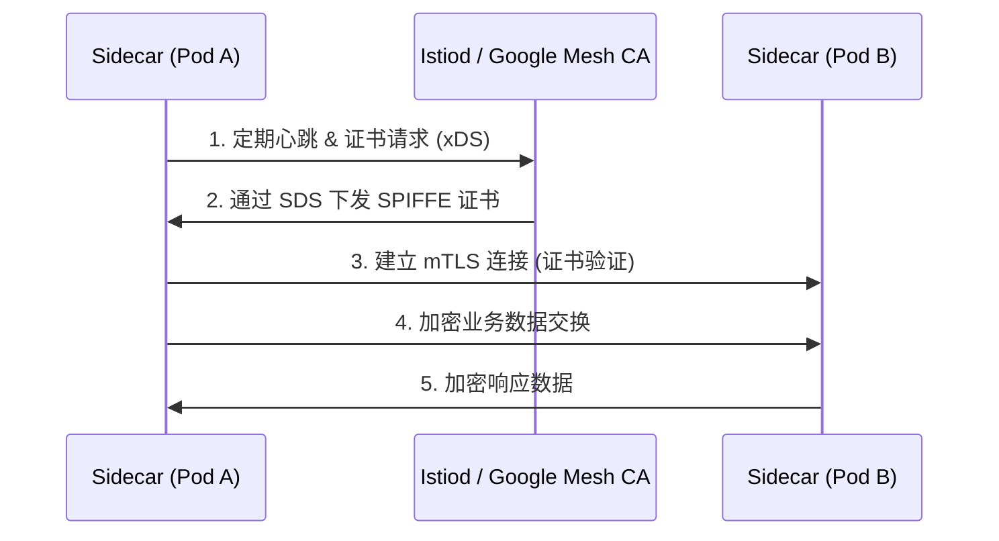
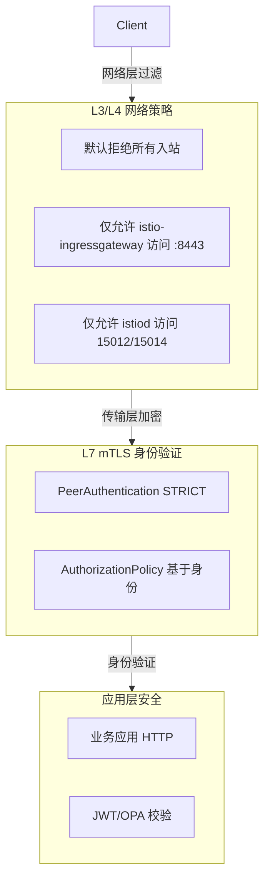
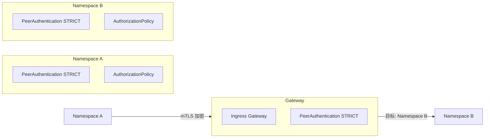

# ASM mTLS 在 Pod 间通信的深度探索与实践

> 适用环境：Google Cloud Service Mesh (ASM) / Upstream Istio  
> 核心主题：mTLS 在 Pod 间通信的实现机制、差异分析与故障排查

---

## 1. ASM 托管 Istio 与标准 Istio 的 mTLS 实现差异

### 1.1 核心架构差异对比

| 特性 | 标准 Istio | GCP ASM 托管 Istio |
|------|-----------|-------------------|
| 证书签发实体 | Istiod 内置 Citadel (或 Citadel 衍生) | Google Mesh CA |
| 证书存储位置 | Sidecar 内存 (SDS) | Sidecar 内存 (SDS) |
| 证书格式 | SPIFFE URI: `spiffe://cluster.local/ns/...` | SPIFFE URI: `spiffe://cluster.local/ns/...` |
| 证书轮换周期 | 默认 24 小时 | 默认 24 小时 |
| IAM 集成 | ❌ 无直接集成 | ✅ 与 GCP IAM 绑定 |
| 客户端工作机制 | SPIFFE + SDS | SPIFFE + SDS (完全一致) |
| Envoy 流量拦截 | iptables | iptables (完全一致) |
| 证书管理复杂度 | 需要关注 CA 证书备份 | Google 全托管，无需维护 |

### 1.2 关键差异详解

#### 1.2.1 证书颁发机构 (CA)
- **标准 Istio**: 依赖内置 Citadel 或其他外部 CA，需要自行管理根证书、CA 证书轮换
- **GCP ASM**: 使用 Google Mesh CA，与 GCP IAM 深度集成，提供更强的身份绑定能力

#### 1.2.2 IAM 集成优势
```yaml
# 在 ASM 中，ServiceAccount 与 mTLS 身份强关联
apiVersion: v1
kind: ServiceAccount
metadata:
  name: istio-ingressgateway-int-sa
  namespace: istio-ingressgateway-int
# 该 SA 可绑定 IAM 角色，实现工作负载身份认证 (Workload Identity)
```

**优势**：
- 证书颁发与 IAM 角色关联，增强安全性
- 支持 Workload Identity，避免在 Pod 中使用长期密钥
- 与 GCP Cloud KMS 集成，可使用云托管密钥

#### 1.2.3 配置管理
- **标准 Istio**: 需要自行配置 CA 证书、证书轮换策略
- **GCP ASM**: Google 管理证书生命周期，简化运维负担

---

## 2. Pod 间 mTLS 通信的具体流程和证书下发机制

### 2.1 完整通信流程图



### 2.2 证书下发机制详解

#### 2.2.1 证书生命周期

| 阶段 | 描述 | 关键细节 |
|------|------|----------|
| **初始化** | Pod 启动，Sidecar 注入完成 | Istio sidecar 自动注入，iptables 配置完成 |
| **请求证书** | Sidecar 向 istiod 发送 xDS请求 | 包含 SPIFFE ID: `spiffe://cluster.local/ns/<ns>/sa/<sa>` |
| **颁发证书** | istiod/Google Mesh CA 签发证书 | 有效期 24 小时，采用 ECDSA 算法 |
| **分发证书** | 通过 SDS (Secret Discovery Service) 推送 | 证书存储在 Sidecar 内存，不落盘 |
| **自动轮换** | 到期前自动请求新证书 | 无缝切换，零停机 |
| **吊销处理** | CA 主动推送吊销列表 (CRL) | 实时生效，安全可靠 |

#### 2.2.2 SDS 工作流程

```yaml
# Istio SDS 配置 (Envoy 层面)
name: "sddsecret-istio.default"
filename: "/etc/certs/sds/secrets/sds-cert.pem"
sds_config:
  path_config_source:
    path: "/etc/certs/sds/sds_config"
  resource_api_version: V3
```

**SDS 特点**:
- 动态密钥分发，无需重启 Envoy
- 支持证书热更新
- 最小权限原则：Sidecar 仅能访问自己的证书

#### 2.2.3 SPIFFE 身份标识

```
spiffe://<cluster.domain>/ns/<namespace>/sa/<serviceaccount>
├── 集群域 (cluster.local)
├── 命名空间 (namespace)
└── 服务账号 (serviceaccount)
```

**身份验证优势**:
- 防伪造：基于公钥基础设施 (PKI)
- 防重放：证书包含时间戳和序列号
- 细粒度：精确到 ServiceAccount 级别

---

## 3. PeerAuthentication STRICT 模式对 Pod 间通信的具体影响

### 3.1 STRICT 模式的行为矩阵

| 通信场景 | STRICT 模式结果 | PERMISSIVE 模式结果 |
|----------|----------------|---------------------|
| Sidecar → Sidecar (mTLS) | ✅ 允许 | ✅ 允许 |
| 无 Sidecar Pod 直连 (明文) | ❌ 拒绝 | ⚠️ 允许 (但无 mTLS) |
| 外部流量绕过 Gateway 直连 | ❌ 拒绝 | ⚠️ 允许 (但无 mTLS) |
| Gateway → App (自动 mTLS) | ✅ 允许 | ✅ 允许 |

### 3.2 STRICT 模式的强制约束

```yaml
# PeerAuthentication 配置示例
apiVersion: security.istio.io/v1beta1
kind: PeerAuthentication
metadata:
  name: default-strict-mtls
  namespace: team-a-runtime
spec:
  mtls:
    mode: STRICT  # 关键配置
```

**影响分析**:

#### 3.2.1 授权策略 (AuthorizationPolicy) 的先决条件
```
只有 mTLS 握手成功 → 证书信息填充 → principals 字段可解析 → AP 规则生效
```

**关键代码**: AuthorizationPolicy 中的 principals 匹配
```yaml
apiVersion: security.istio.io/v1beta1
kind: AuthorizationPolicy
metadata:
  name: allow-ingressgateway
spec:
  action: ALLOW
  rules:
    - from:
        - source:
            # 这个值只能在 mTLS 握手后解析
            principals:
              - "cluster.local/ns/istio-ingressgateway-int/sa/istio-ingressgateway-int-sa"
      to:
        - operation:
            ports: ["8443"]
```

⚠️ **安全漏洞警告**: 如果 PeerAuthentication 降级为 PERMISSIVE，`principals` 字段将为空，AP 规则静默失效！

#### 3.2.2 网络策略 (NetworkPolicy) 的协同

```
NetworkPolicy (L3/L4) → PeerAuthentication (L7 mTLS) → AuthorizationPolicy (L7 身份)
     粗粒度隔离              强制身份验证              细粒度授权
```

**协同防护示例**:
```yaml
# NetworkPolicy: 允许来自特定 namespace 的流量
apiVersion: networking.k8s.io/v1
kind: NetworkPolicy
metadata:
  name: allow-from-ingress
spec:
  podSelector: {}
  ingress:
    - from:
        - namespaceSelector:
            matchLabels:
              kubernetes.io/metadata.name: istio-ingressgateway-int
      ports:
        - protocol: TCP
          port: 8443
```

```yaml
# PeerAuthentication: 强制 mTLS
apiVersion: security.istio.io/v1beta1
kind: PeerAuthentication
metadata:
  name: default-strict-mtls
spec:
  mtls:
    mode: STRICT
```

```yaml
# AuthorizationPolicy: 基于身份授权
apiVersion: security.istio.io/v1beta1
kind: AuthorizationPolicy
metadata:
  name: allow-gateway-to-app
spec:
  selector:
    matchLabels:
      app: team-a-service
  action: ALLOW
  rules:
    - from:
        - source:
            principals: ["cluster.local/ns/istio-ingressgateway-int/sa/istio-ingressgateway-int-sa"]
      to:
        - operation:
            ports: ["8443"]
```

### 3.3 故障场景分析

| 故障现象 | 可能原因 | 诊断方法 |
|----------|----------|----------|
| mTLS 握手失败 | PeerAuthentication 策略冲突 | `istioctl authn tls-check <pod>` |
| 证书获取超时 | 15012 端口被 NetworkPolicy 阻断 | 检查 egress 规则 |
| principals 为空 | PeerAuthentication 非 STRICT 模式 | 检查所有 namespace 的 PA 配置 |
| 403 拒绝访问 | AuthorizationPolicy 规则限制 | 检查 AP 日志和匹配条件 |

---

## 4. 网络策略 (NetworkPolicy) 和 mTLS 的联动防护

### 4.1 分层防御架构



### 4.2 NetworkPolicy 与 mTLS 的联动场景

#### 场景 1: 初始连接建立
```
1. Pod A 尝试连接 Pod B:8443
2. NetworkPolicy 检查源 IP/命名空间
   - ✅ 允许 → 连接建立
   - ❌ 拒绝 → 连接中断
3. mTLS 握手阶段
   - Istiod 验证证书链
   - Google Mesh CA 校验吊销状态
4. 身份验证阶段
   - AuthorizationPolicy 检查 principals
   - 策略匹配 → 允许访问
```

#### 场景 2: 证书吊销处理
```
1. CA 发现证书泄露
2. 推送 CRL (Certificate Revocation List) 到所有 Sidecar
3. NetworkPolicy 仍保持 L3/L4 控制
4. mTLS 握手时验证证书状态
   - 已吊销 → 拒绝连接
   - 有效 → 允许通信
```

### 4.3 NetworkPolicy 关键配置要点

```yaml
# 必须放行 istiod 控制面通信
apiVersion: networking.k8s.io/v1
kind: NetworkPolicy
metadata:
  name: allow-istiod-control-plane
  namespace: <your-namespace>
spec:
  podSelector: {}  # 选中所有 Pod
  policyTypes:
    - Egress  # 重点：出站规则
  egress:
    - to:
        - namespaceSelector:
            matchLabels:
              kubernetes.io/metadata.name: istio-system
      ports:
        - protocol: TCP
          port: 15012  # SDS 端口
        - protocol: TCP
          port: 15014  # Webhook 端口
    - to:
        - namespaceSelector: {}  # 所有命名空间
      ports:
        - protocol: UDP
          port: 53  # DNS 查询
```

**注意**:
- 必须放行 `:15012` 端口，否则证书下发失败
- DNS (`:53`) 必须放行，服务发现依赖 DNS
- 默认拒绝策略应应用于 `Ingress` 方向

---

## 5. 跨 namespace 通信时 mTLS 和 AuthorizationPolicy 的配置要点

### 5.1 跨 namespace 通信架构



### 5.2 关键配置要点

#### 5.2.1 跨 namespace 的 AuthorizationPolicy

```yaml
# 在 Namespace B，允许来自 Namespace A 的特定服务访问
apiVersion: security.istio.io/v1beta1
kind: AuthorizationPolicy
metadata:
  name: allow-namespace-a
  namespace: namespace-b  # 目标 namespace
spec:
  selector:
    matchLabels:
      app: target-service
  action: ALLOW
  rules:
    - from:
        - source:
            # 跨 namespace 的 principals 格式
            namespaces: ["namespace-a"]
            # 或指定具体的 ServiceAccount
            principals: [
              "cluster.local/ns/namespace-a/sa/source-sa",
              "cluster.local/ns/namespace-b/sa/target-sa"
              ]
      to:
        - operation:
            ports: ["8443"]
            methods: ["GET", "POST"]
```

#### 5.2.2 跨 namespace 的 NetworkPolicy

```yaml
# 允许跨 namespace 的 mTLS 流量
apiVersion: networking.k8s.io/v1
kind: NetworkPolicy
metadata:
  name: allow-cross-namespace
  namespace: namespace-b
spec:
  podSelector: {}  # 或选择特定 Pod
  policyTypes:
    - Ingress
  ingress:
    - from:
        - namespaceSelector:
            matchLabels:
              name: namespace-a
      ports:
        - protocol: TCP
          port: 8443
```

#### 5.2.3 跨 namespace 的 Gateway 配置

```yaml
# Gateway 需配置为跨 namespace 路由
apiVersion: networking.istio.io/v1beta1
kind: Gateway
metadata:
  name: cross-namespace-gateway
  namespace: istio-ingressgateway-int
spec:
  selector:
    istio: ingressgateway-int
  servers:
    - port:
        number: 443
        name: https
        protocol: HTTPS
      tls:
        mode: SIMPLE
        credentialName: cross-namespace-cert
      hosts:
        - "*.namespace-a.app.com"
        - "*.namespace-b.app.com"
  
# 虚拟服务路由到不同 namespace
apiVersion: networking.istio.io/v1beta1
kind: VirtualService
metadata:
  name: cross-namespace-route
  namespace: istio-ingressgateway-int
spec:
  hosts:
    - "*.namespace-a.app.com"
    - "*.namespace-b.app.com"
  gateways:
    - cross-namespace-gateway
  http:
    - match:
        - uri:
            prefix: "/api/v1"
      route:
        - destination:
            host: service.namespace-a.svc.cluster.local
            port:
              number: 8443
    - match:
        - uri:
            prefix: "/api/v2"
      route:
        - destination:
            host: service.namespace-b.svc.cluster.local
            port:
              number: 8443
```

#### 5.2.4 跨 namespace 身份传递

```yaml
# 启用跨 namespace 的身份传递
apiVersion: security.istio.io/v1beta1
kind: RequestAuthentication
metadata:
  name: cross-namespace-jwt
  namespace: namespace-b
spec:
  selector:
    matchLabels:
      app: target-service
  jwtRules:
    - issuer: "https://accounts.google.com"
      jwksUri: "https://www.googleapis.com/oauth2/v3/certs"
      # 允许来自 namespace-a 的 JWT 令牌
      audiences: ["namespace-a-audience"]
```

---

## 6. 在 ASM 环境下排错 mTLS 问题的实用方法和命令

### 6.1 常用排错命令清单

#### 6.1.1 验证 mTLS 状态

```bash
# 检查 Pod 的 mTLS 状态
istioctl authn tls-check <pod-name> -n <namespace>

# 示例输出解读
# Peer authentication: STRICT (mTLS required)
#     Port 8443: TLS_MUTUAL (STANDARD)
#     Certificate CN: spiffe://cluster.local/ns/team-a-runtime/sa/service-account

# 查看所有 Pod 的 mTLS 状态
kubectl get peerauthentications --all-namespaces -o wide
```

#### 6.1.2 检查证书信息

```bash
# 查看 Sidecar 的证书状态
kubectl exec -it <pod-name> -c istio-proxy -- curl -s http://localhost:15020/certs | jq .

# 关键字段说明:
# - certificate_chain: 当前证书 PEM 格式
# - private_key: 私钥 (Base64 编码)
# - expiry_timestamp: 证书过期时间
# - issuer: 证书颁发者
# - subject_alt_names: 主题备用名称

# 检查证书轮换日志
kubectl logs -l istio=sidecar-injector -n istio-system | grep -i "certificate\|rotation"
```

#### 6.1.3 诊断网络连接

```bash
# 查看 Endpoint 状态 (确认 mTLS 端口是否可达)
kubectl get endpoints -n <namespace>

# 检查 Service 到 Endpoint 的连接
istioctl proxy-status
# 或详细模式
istioctl proxy-status --proxy-admin-port 15000

# 查看 Envoy 监听端口
kubectl exec -it <pod-name> -c istio-proxy -- netstat -tlnp | grep 8443
```

### 6.2 典型故障排查流程

#### 故障 1: mTLS 握手失败

```bash
# 1. 检查 PeerAuthentication 配置
kubectl get peerauthentication -A -o yaml | grep -A 5 "mtls:"

# 2. 验证证书是否下发
kubectl exec <pod> -c istio-proxy -- curl -s http://localhost:15020/certs | jq '.certificate_chain != null'

# 3. 检查证书是否有效 (未过期)
kubectl exec <pod> -c istio-proxy -- curl -s http://localhost:15020/certs | jq '.expiry_timestamp'

# 4. 查看 istiod 日志 (需访问控制平面)
kubectl logs -l istio= pilot -n istio-system | grep -i "certificate\|sds\|secret"
```

**解决方案**:
- 确认 `:15012` 端口未被 NetworkPolicy 阻断
- 检查 Google Mesh CA 配额和权限
- 验证 ServiceAccount 是否存在且正确

#### 故障 2: AuthorizationPolicy 不生效

```bash
# 1. 验证 mTLS 状态 (Principals 依赖 mTLS)
istioctl authn tls-check <pod> -n <namespace>

# 2. 检查 AP 匹配条件
kubectl get authorizationpolicy -A -o yaml | grep -B5 -A10 "principals"

# 3. 查看 Envoy 过滤规则
istioctl proxy-config routes <pod> -n <namespace> | grep -i "principal\|certificate"

# 4. 检查 L7 过滤日志 (需要开启访问日志)
kubectl logs -l istio=ingressgateway -n istio-ingressgateway-int | grep "x-envoy-decorator-operation"
```

**常见问题**:
- ❌ principals 为空 → PeerAuthentication 非 STRICT 模式
- ❌ 证书不匹配 → 跨 namespace principals 格式错误
- ❌ 端口不匹配 → AP 中端口配置与服务端口不一致

#### 故障 3: 证书轮换异常

```bash
# 1. 检查证书有效期
kubectl get secrets -n <namespace> -o json | jq '.items[] | select(.metadata.name | startswith("istio-")) | {name: .metadata.name, expiry: .data."token"}'

# 2. 查看 SDS 同步状态
kubectl exec -it <pod> -c istio-proxy -- curl -s http://localhost:15010/config_dump | jq '.dynamic_resources.sds_configs'

# 3. 强制证书轮换 (调试用)
kubectl delete secret -n istio-system -l istio=sd-token
# ⚠️ 注意: 生产环境慎用，可能导致短暂连接中断
```

**解决方案**:
- 确认 Google Cloud KMS 密钥权限
- 检查 Google Cloud IAM 角色 `roles/secretmanager.secretAccessor`
- 验证 VPC Service Controls 是否限制 Secret Manager 访问

### 6.3 诊断工具高级用法

#### 使用 istioctl 分析 mTLS 策略

```bash
# 分析整个 namespace 的 mTLS 策略
istioctl analyze -n team-a-runtime

# 检查特定服务的认证策略
istioctl authn tls-check -n team-a-runtime deployment/team-a-service

# 导出所有 PeerAuthentication 配置
istioctl get peerauthentications -A -o yaml > all-peer-auth.yaml
```

#### 结合 Prometheus 监控 mTLS 指标

```yaml
# 关键监控指标
- name: istio_mtls_time_to_first_byte_milliseconds
  description: mTLS 握手延迟
- name: istio_requests_total
  labels:
    - source_workload_namespace
    - source_workload
    - destination_workload
    - response_code
    - connection_security_policy  # 包含 mTLS 状态
```

**监控查询示例** (PromQL):
```promql
# mTLS 握手失败率
rate(istio_requests_total{response_code=~"5.*", connection_security_policy="MUTUAL"}[5m])
  /
rate(istio_requests_total{connection_security_policy="MUTUAL"}[5m])
```

## 总结

1. **ASM 与标准 Istio mTLS 实现一致**: 核心机制相同，差异在于证书管理由 Google 全托管
2. **证书自动轮换**: SPIFFE 证书每 24 小时自动轮换，SDS 动态分发
3. **STRICT 模式强制要求**: mTLS 是 AP 规则生效的前提条件
4. **分层防御**: NetworkPolicy + PeerAuthentication + AuthorizationPolicy 协同防护
5. **跨 namespace 通信**: 需同时配置命名空间选择器和 principals 匹配
6. **排错关键命令**: `istioctl authn tls-check` 是诊断 mTLS 问题的主要工具

> 最佳实践：始终保持 PeerAuthentication 为 STRICT 模式，结合 NetworkPolicy 实现纵深防御，避免在 AP 规则中使用空 principals。
