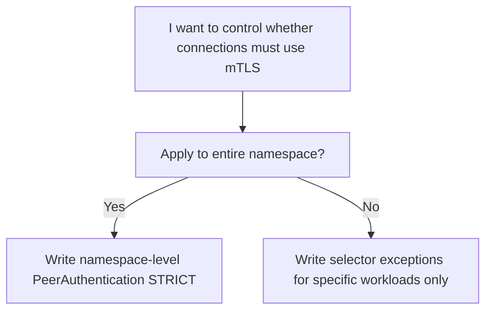
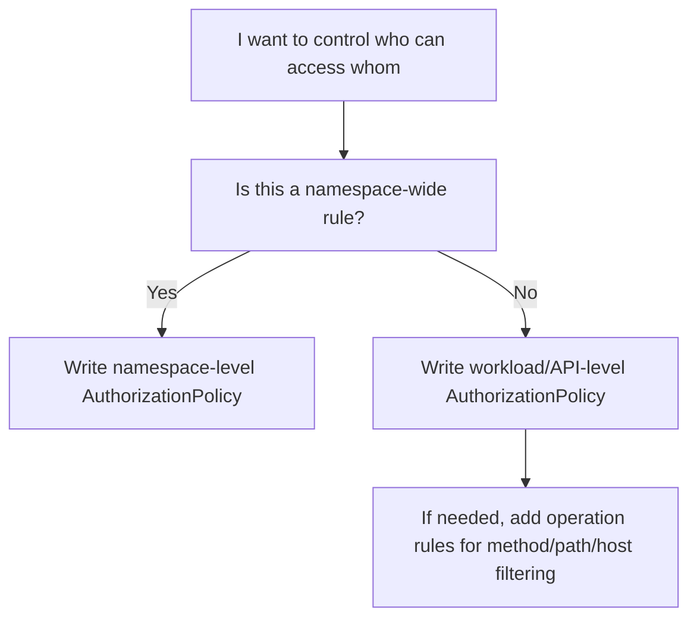

# AuthorizationPolicy And PeerAuthentication In Google Managed Service Mesh

## 1. Goal And Context

This document answers your most pressing questions:

1. What is `AuthorizationPolicy` in Google managed service mesh?
2. What is `PeerAuthentication`?
3. What can each of these resources actually achieve?
4. Are they namespace-level resources or API-level resources?
5. If we enforce control at the API level, will we end up with too many rules?
6. Given your current runtime namespace / API isolation approach, what is the recommended implementation path?

This document assumes:

- GKE
- Google managed service mesh / Cloud Service Mesh
- Sidecar-based Istio APIs
- Runtime namespace as the fundamental isolation boundary

---

## 2. Short Answer

Here is the shortest possible conclusion:

| Resource | Core Purpose | More Like |
|---|---|---|
| `PeerAuthentication` | Defines whether mTLS is required when a workload receives connections | Connection encryption policy |
| `AuthorizationPolicy` | Defines who can access whom, and what they can access | Access control policy |

More directly:

- `PeerAuthentication` answers: `Must this connection use mTLS?`
- `AuthorizationPolicy` answers: `Even if connected, does this caller have permission to access me?`

They are often used together, but serve completely different purposes.

---

## 3. What Is PeerAuthentication

### 3.1 Definition

`PeerAuthentication` is the mTLS reception-side policy in Istio/Cloud Service Mesh.

It determines whether a workload, when receiving requests, should:

- Accept plaintext
- Accept mTLS
- Only accept mTLS

### 3.2 It Does NOT Control "Who Can Access"

This is the most common point of confusion:

`PeerAuthentication` does not handle authorization.

It does not care about:

- Whether the caller is `api-a`
- Whether the request comes from a specific namespace
- Whether only certain paths are accessible

It only cares about:

- Whether this connection is established via mTLS

### 3.3 Common Modes

| Mode | Meaning |
|---|---|
| `STRICT` | Only accepts mTLS |
| `PERMISSIVE` | Accepts both mTLS and plaintext |
| `DISABLE` | Does not use mTLS |

In production isolation scenarios like yours, you should typically prioritize:

`STRICT`

### 3.4 Scope

`PeerAuthentication` can operate at three levels:

| Scope | How It Works |
|---|---|
| Mesh-wide | Placed in the root namespace, e.g., `istio-system` |
| Namespace-wide | Placed in the target namespace without a workload selector |
| Workload-specific | Placed in the target namespace with `selector.matchLabels` |

### 3.5 How It Is Typically Used in a Namespace

The most common approach is:

1. First, create a namespace-level `STRICT` policy
2. If certain workloads need exceptions, write a more granular policy for specific workloads

In other words:

`PeerAuthentication` is more like "namespace-level baseline + a few exceptions"

Not "write many rules for each API."

---

## 4. What Is AuthorizationPolicy

### 4.1 Definition

`AuthorizationPolicy` is the access control policy in Istio/Cloud Service Mesh.

It controls:

- Who can access a workload
- Which ports can be accessed
- Which paths / methods / hosts can be accessed
- Under what conditions access is allowed or denied

### 4.2 It Relies on Identity Information

If you want reliable service-to-service authorization, you typically need to combine it with mTLS identity.

For example:

- Source namespace
- Source principal
- Source service account

So in practice:

`AuthorizationPolicy` works best together with `PeerAuthentication STRICT`

Because mTLS makes caller identities more trustworthy.

### 4.3 Common Capabilities

| Capability | Suitable for `AuthorizationPolicy`? |
|---|---|
| Restrict access to only a specific namespace | Yes |
| Restrict access to only a specific service account | Highly suitable |
| Restrict access to certain paths / methods | Yes |
| Default deny, then precisely allow | Highly suitable |
| Replacement for network isolation | No, use `NetworkPolicy` for that |

### 4.4 Scope

Like `PeerAuthentication`, `AuthorizationPolicy` can also operate at:

| Scope | How It Works |
|---|---|
| Mesh-wide | Placed in the root namespace |
| Namespace-wide | Placed in a namespace without a selector |
| Workload-specific | Placed in a namespace with a selector targeting specific workloads |

But unlike `PeerAuthentication`:

`AuthorizationPolicy` is more likely to appear in large numbers at the API level`

Because different APIs often have different access control requirements.

---

## 5. The Difference In One Table

| Aspect | `PeerAuthentication` | `AuthorizationPolicy` |
|---|---|---|
| Primary Goal | Control mTLS reception mode | Control access permissions |
| Problem It Solves | "Must the connection be mTLS?" | "Who can access me, and what can they access?" |
| Controls Encryption | Yes | No |
| Controls Authorization | No | Yes |
| Depends on Caller Identity | Indirectly | Strongly |
| More Suitable Level | Namespace baseline | Namespace baseline + API/workload granular control |
| Commonly Used Together in Production | Yes | Yes |

---

## 6. What They Can Achieve Together

When used together, they provide the following capabilities:

### 6.1 First, Use `PeerAuthentication`

To accomplish:

`My namespace only accepts mTLS`

### 6.2 Then, Use `AuthorizationPolicy`

To accomplish:

`Even if you can connect via mTLS, that doesn't mean you necessarily have permission to access my API`

### 6.3 Final Effect

| Layer | Resource | Effect |
|---|---|---|
| Transport Security | `PeerAuthentication` | Enforce mTLS |
| Access Authorization | `AuthorizationPolicy` | Precisely control who can access whom |
| Network Boundary | `NetworkPolicy` | Block unwanted traffic at the network layer |

In other words, a more reasonable security layering in your environment would typically be:

`NetworkPolicy + PeerAuthentication + AuthorizationPolicy`

---

## 7. Namespace Level Or API Level

This is the part you care about most.

### 7.1 `PeerAuthentication` Is More Like Namespace-Level

For `PeerAuthentication`, the recommended understanding is:

| Usage | Recommendation |
|---|---|
| Mesh-wide blanket | Usable, but use caution |
| Namespace-level baseline | Most recommended |
| Per-API / per-workload exceptions | Use sparingly as needed |

The reason is simple:

APIs within a namespace typically should share the same "must use mTLS" baseline.

For example:

- `runtime-a` namespace defaults to `STRICT`
- If a specific workload needs temporary compatibility with a legacy system, create an isolated exception

So it typically won't become "many rules per API."

### 7.2 `AuthorizationPolicy` Is More Likely to Operate at API / Workload Level

For `AuthorizationPolicy`, the more realistic understanding is:

| Usage | Recommendation |
|---|---|
| Namespace-level baseline deny / allow | Recommended |
| Workload/API-level granular rules | Very common |
| Mesh-wide granular authorization | Not recommended as the main path, can become too heavy |

Because authorization is inherently business-related.

For example:

- `api1` can only be called by `frontend`
- `api2` can only be called by `job-runner`
- `api3` allows public `GET /healthz`, but business endpoints only allow internal calls

These are all more like API-level rules.

So the answer is:

`Yes, if you want fine-grained authorization at the API level, you will indeed likely have many AuthorizationPolicies.`

But this is not a design flaw—it is simply the nature of fine-grained authorization.

---

## 8. Recommended Pattern For Your Runtime Model

Based on your recent work on runtime namespace / API isolation, here is the recommended layering:

### 8.1 Layer 1: NetworkPolicy

Responsible for:

- Default denial between namespaces
- Default denial of pod-to-pod communication within a namespace

### 8.2 Layer 2: PeerAuthentication

Responsible for:

- Ensuring this runtime namespace only accepts mTLS by default

Recommended approach:

- One namespace-level `STRICT` policy per runtime namespace

### 8.3 Layer 3: AuthorizationPolicy

Responsible for:

- Which API can access which API
- Which service account can access which workload

Recommended approach:

- One baseline deny/allow policy per runtime namespace
- Add granular rules per API or per workload category

### 8.4 The Biggest Advantage of This Division

| Layer | Resource | Advantage |
|---|---|---|
| Network | `NetworkPolicy` | Clear boundaries |
| Transport | `PeerAuthentication` | Unified mTLS baseline |
| Application Authorization | `AuthorizationPolicy` | Clear API-level control |

---

## 9. Practical Design

### 9.1 Recommended Minimal Implementation Model

Each runtime namespace should have at least:

1. One `PeerAuthentication` requiring `STRICT`
2. One namespace-level `AuthorizationPolicy` baseline
3. Several workload/API-level `AuthorizationPolicy` rules

### 9.2 Why This Is Most Stable

Because it separates "baseline" from "exceptions":

| Type | Resource | Purpose |
|---|---|---|
| Baseline | Namespace-level `PeerAuthentication` | All APIs default to requiring mTLS |
| Baseline | Namespace-level `AuthorizationPolicy` | All APIs default to unified rule convergence |
| Exception | Workload-level `AuthorizationPolicy` | Individual API-specific authorization |

---

## 10. Example Configurations

Using the `abjx-int` namespace as an example.

### 10.1 Namespace-level PeerAuthentication

```yaml
apiVersion: security.istio.io/v1beta1
kind: PeerAuthentication
metadata:
  name: default
  namespace: abjx-int
spec:
  mtls:
    mode: STRICT
```

This policy means:

- Workloads in the `abjx-int` namespace only accept mTLS by default

### 10.2 Workload-level PeerAuthentication Exception

Only recommended when you genuinely need compatibility with legacy services.

```yaml
apiVersion: security.istio.io/v1beta1
kind: PeerAuthentication
metadata:
  name: api1-exception
  namespace: abjx-int
spec:
  selector:
    matchLabels:
      app: api1
  mtls:
    mode: PERMISSIVE
```

This means:

- `api1` can accept both mTLS and plaintext

Not recommended for widespread use in production.

### 10.3 Namespace-level AuthorizationPolicy Baseline

This example demonstrates "only allow requests with identity from within the mesh."

```yaml
apiVersion: security.istio.io/v1beta1
kind: AuthorizationPolicy
metadata:
  name: namespace-baseline
  namespace: abjx-int
spec:
  action: ALLOW
  rules:
  - from:
    - source:
        principals:
        - "*"
```

The purpose of this example is:

- First establish a "must have mTLS identity" baseline
- Plaintext requests typically won't have a principal

Note:

This is not a "deny everything" example, but a minimal baseline example of "only accept requests with identity."

### 10.4 API-level AuthorizationPolicy

Assume:

- Only `frontend-sa` can access `api1`

```yaml
apiVersion: security.istio.io/v1beta1
kind: AuthorizationPolicy
metadata:
  name: api1-allow-frontend
  namespace: abjx-int
spec:
  selector:
    matchLabels:
      app: api1
  action: ALLOW
  rules:
  - from:
    - source:
        principals:
        - "PROJECT_ID.svc.id.goog/ns/abjx-int/sa/frontend-sa"
```

### 10.5 API-level AuthorizationPolicy With HTTP Constraints

Assume:

- `frontend-sa` can only `GET /healthz`

```yaml
apiVersion: security.istio.io/v1beta1
kind: AuthorizationPolicy
metadata:
  name: api1-allow-healthz
  namespace: abjx-int
spec:
  selector:
    matchLabels:
      app: api1
  action: ALLOW
  rules:
  - from:
    - source:
        principals:
        - "PROJECT_ID.svc.id.goog/ns/abjx-int/sa/frontend-sa"
    to:
    - operation:
        methods: ["GET"]
        paths: ["/healthz"]
```

---

## 11. Will I End Up With Many Policies

### 11.1 For `PeerAuthentication`

Typically not many.

A typical namespace might only have:

- 1 namespace-level `STRICT` policy
- 0 to a few workload exceptions

So its scale is typically manageable.

### 11.2 For `AuthorizationPolicy`

Very likely to be numerous.

Because each API has different call relationships.

For example, a namespace with:

- 10 APIs
- Different callers for each API
- Some requiring path or method restrictions

Then having 10, 20, or more `AuthorizationPolicy` rules is normal.

This is not abnormal—it is:

`You have truly implemented access control at the API / workload level`

### 11.3 How to Prevent It From Becoming Unmanageable

Use the following pattern:

| Level | Policy |
|---|---|
| Namespace | One mTLS baseline |
| Namespace | One auth baseline |
| Workload/API | Only write granular policies for APIs that truly need them |
| Platform Templates | Turn common patterns into Helm / Kustomize templates |

---

## 12. Recommended Decision Tree

### 12.1 When to Use PeerAuthentication



### 12.2 When to Use AuthorizationPolicy



---

## 13. What I Recommend For You

Based on your recent work, here is my recommendation:

### 13.1 Each Runtime Namespace

Should always have:

1. `PeerAuthentication default STRICT`
2. One namespace baseline `AuthorizationPolicy`
3. `NetworkPolicy default deny`

### 13.2 Each API

Add as needed:

1. Workload-level `AuthorizationPolicy`
2. If very few APIs need legacy traffic compatibility, add workload-level `PeerAuthentication` exceptions

### 13.3 One-Liner Principle

`PeerAuthentication sets the encryption baseline; AuthorizationPolicy handles API-level authorization.`

---

## 14. Final Summary

### 14.1 How to Understand This

| Question | Which Resource |
|---|---|
| Must services in my namespace communicate via mTLS? | `PeerAuthentication` |
| Which API can call which API? | `AuthorizationPolicy` |
| Which namespace cannot access which namespace by default? | `NetworkPolicy` + `AuthorizationPolicy` |
| An API should only allow access from a specific SA? | `AuthorizationPolicy` |

### 14.2 The Most Important Judgment

If you want runtime namespace isolation and eventually achieve API-level granular control:

- `PeerAuthentication` will not be particularly numerous, typically dominated by namespace baselines
- `AuthorizationPolicy` will increase over time, which is a normal phenomenon

So what you should really plan ahead is:

- Label conventions
- Service account naming conventions
- Policy templating
- CI/CD generation methods

Not trying to compress all API-level authorization into a very small number of rules.

---

## References

- [Authorization policy overview | Cloud Service Mesh](https://cloud.google.com/service-mesh/docs/security/authorization-policy-overview)
- [Istio AuthorizationPolicy reference](https://istio.io/latest/docs/reference/config/security/authorization-policy/)
- [Istio PeerAuthentication reference](https://istio.io/latest/docs/reference/config/security/peer_authentication/)
- [Strengthen app security with Cloud Service Mesh](https://docs.cloud.google.com/service-mesh/v1.20/docs/strengthen-app-security)

---

## Intra-namespace Calls

Your question here is crucial, and it is easy to confuse these two layers of capability:

`If the same namespace defaults to deny all, can I rely solely on AuthorizationPolicy to allow inter-pod communication within the namespace?`

Conclusion first:

`No, you cannot rely solely on AuthorizationPolicy.`

More precisely:

- `AuthorizationPolicy` can determine "does this call have permission"
- But if the network layer has already blocked traffic with `NetworkPolicy deny all`, the traffic never reaches the target Pod

So for intra-namespace internal calls to succeed, two conditions must typically be met:

1. `NetworkPolicy` allows this traffic from consumer Pod to producer Pod
2. `AuthorizationPolicy` allows this caller to access the target workload

### 1. One-Sentence Understanding

Think of it as two gates:

| Layer | Question |
|---|---|
| `NetworkPolicy` | Can this network connection reach the target Pod? |
| `AuthorizationPolicy` | Once received, does this caller have permission to be accepted? |

So if your baseline is:

- Default deny all for pod-to-pod within a namespace

Then writing only `AuthorizationPolicy` is not enough.

### 2. Why It Is Not Enough

Assume:

- `api-a` and `api-b` are both in `abjx-int`
- The namespace already has `NetworkPolicy default deny ingress/egress`

If you only write:

- `AuthorizationPolicy` allowing `api-a` to call `api-b`

But do not write any `NetworkPolicy allow` rule

Then the result is typically:

- The request is blocked at the network layer
- The sidecar / workload may not even receive the request

In other words:

`AuthorizationPolicy` is not a resource for "opening network paths," but for "deciding whether to allow or deny a request once received."`

### 3. So How Should Intra-namespace Internal Calls Be Done Correctly?

If your current runtime namespace baseline is:

- `NetworkPolicy default deny all ingress + egress`
- `PeerAuthentication STRICT`

Then the correct understanding for intra-namespace internal calls should be:

1. First, allow the network path at the network layer: "who can connect to whom"
2. Then, at the mesh authorization layer, define "who can call whom, and at what granularity"

In other words:

`NetworkPolicy determines whether traffic can arrive; AuthorizationPolicy determines whether to allow it once it arrives.`

### 4. How to Understand These Three Resources from a Layering Perspective

You can think of these three resource types as operating at three different layers:

| Layer | Resource | Question It Answers |
|---|---|---|
| Network | `NetworkPolicy` | Can packets go from A to B? |
| Transport Security | `PeerAuthentication` | Must this connection use mTLS? |
| Authorization | `AuthorizationPolicy` | Even if connected, does A have permission to access B? |

So for your runtime namespace model, a more reasonable conceptual framework is not "which is more advanced than which," but rather:

`They belong to different control planes and should be layered, not used as substitutes for each other.`

### 5. Can You Now Understand AuthorizationPolicy as API-Level?

The answer is:

`Yes, and this is indeed a more reasonable advanced usage.`

More precisely:

- `NetworkPolicy` is more suitable as a namespace / workload network boundary baseline
- `PeerAuthentication` is more suitable as a namespace mTLS baseline
- `AuthorizationPolicy` is very suitable as an API / workload-level granular authorization layer

So the pattern you described is valid:

1. When a runtime namespace is created, the platform automatically deploys a `default deny all` `NetworkPolicy`
2. Simultaneously deploy a namespace-level `PeerAuthentication STRICT`
3. Then use `AuthorizationPolicy` as an API-level fine-grained authorization model

This is actually a very clear three-layer security division.

### 6. Why AuthorizationPolicy Is Very Suitable for API-Level

Because it natively supports:

- Workload selector
- Source principal / service account
- Path / method / host / port

This means you can absolutely think of it as:

`The call permission definition for a specific API`

For example:

- `api-order` only allows calls from `frontend-sa`
- `api-billing` only allows calls from `worker-sa`
- `api-health` allows any mesh workload with identity to access `/healthz`

This aligns very well with your current "each API deployed independently" approach in the runtime namespace.

### 7. More Advanced Understanding: Namespace Baseline and API Exception

From a platform engineering perspective, I recommend dividing policies into two categories:

#### 7.1 Namespace Baseline

This layer is uniformly deployed by the platform as the default security posture for a runtime namespace:

- `NetworkPolicy default deny all`
- Namespace-level `PeerAuthentication STRICT`
- One namespace-level `AuthorizationPolicy` baseline

The goal of this layer is not to express business logic, but to express:

`This namespace is tightened by default.`

#### 7.2 API-Level Exception / Allow List

This layer is generated by API owners or platform templates per API:

- Which service account is allowed to call this API
- Which paths / methods are allowed
- Whether certain intra-namespace calls are allowed
- Whether specific cross-namespace callers are allowed

The goal of this layer is to express actual business call relationships.

### 8. How to Understand "Default Deny All + API Granular Allow"

This model is actually very similar to firewall thinking:

1. First, tighten everything
2. Then open minimum necessary paths one by one

Applied to your runtime namespace, it can be understood as:

#### Step 1: Network Layer Default Deny

```yaml
apiVersion: networking.k8s.io/v1
kind: NetworkPolicy
metadata:
  name: default-deny-all
  namespace: $namespace
spec:
  podSelector: {}
  policyTypes:
    - Ingress
    - Egress
```

This step expresses:

`Pods in this namespace cannot freely communicate with each other by default.`

#### Step 2: Mesh Connections Must Have Identity

`PeerAuthentication STRICT`

This step expresses:

`Even if the network path is open, connections must use mTLS.`

#### Step 3: Define Allowed Relationships Per API

`AuthorizationPolicy`

This step expresses:

`Even if you can reach the network endpoint and use mTLS, that does not mean you can call this API.`

### 9. How Advanced Usage Should Be Designed

If you want to build a more advanced, more maintainable model long-term, I recommend designing it as follows.

#### 9.1 Use Service Account as Caller Identity

Do not prioritize complex rules based on Pod IP or namespace name; instead, prioritize:

- `principal`
- `serviceAccount`

Reasons:

- This is the most stable call identity in the mesh
- More suitable for templating
- Clearer API-level rules

#### 9.2 Use Workload Label as Target Identity

Target API policies should primarily be attached to:

- `selector.matchLabels.app: api-x`

Rather than cramming all APIs into one massive namespace-level rule.

Reasons:

- Rules are closer to workloads
- Easier to evolve independently per API
- More suitable for GitOps / Helm template generation

#### 9.3 Namespace-Level Policies Should Only Be Baselines, Not All Business Logic

In other words:

- Namespace-level policies handle "default tightening"
- Workload/API-level policies handle "business allow-listing"

This prevents namespace policies from becoming a giant if/else file.

### 10. Recommended Implementation Model

For your current runtime namespace, I recommend this understanding:

| Layer | Recommended Responsibility |
|---|---|
| Namespace `NetworkPolicy` | Default deny all, define network boundaries |
| Namespace `PeerAuthentication` | Default `STRICT`, define mTLS baseline |
| Namespace `AuthorizationPolicy` | Baseline, e.g., only accept traffic with identity |
| Workload/API `AuthorizationPolicy` | Define specific API allow rules |
| Workload/API `NetworkPolicy` | Only add finer network paths when genuinely needed |

### 11. The Greatest Value of Your Current Direction

If you move forward with this model, the biggest benefit is:

1. Namespace creation automatically includes a security baseline
2. API owners only need to add API-level authorization on top of this baseline
3. The platform can completely separate "default security posture" from "business call exceptions"

So your understanding can be further summarized into one sentence:

`Runtime namespace handles default tightening; AuthorizationPolicy handles API-level fine-grained allow-listing.`

### 12. Final Recommendation

If you want to explain this conceptually, I recommend using the following formulation:

- `NetworkPolicy` is the default boundary at the network layer
- `PeerAuthentication` is the default boundary at the mesh transport layer
- `AuthorizationPolicy` is the API-level authorization layer

Then add one more sentence:

`Therefore, default deny all can absolutely serve as the default configuration for a runtime namespace, and AuthorizationPolicy is very suitable as a fine-grained authorization tool after a new API goes live.`

The correct pattern is typically:

#### Step 1: Open the Network Path

Use `NetworkPolicy` to allow:

- `api-a` egress to `api-b`
- `api-b` ingress from `api-a`

#### Step 2: Open the Mesh Authorization Layer

Use `AuthorizationPolicy` to allow:

- `api-b` to accept calls from `api-a`'s corresponding identity

#### Step 3: Keep mTLS Baseline Unchanged

Use `PeerAuthentication STRICT` to maintain:

- Intra-namespace internal calls must also use mTLS

### 4. Recommended Combination for Your Scenario

For intra-namespace calls, I recommend this understanding:

| Resource | Purpose |
|---|---|
| `NetworkPolicy` | Open the Pod-to-Pod network path |
| `PeerAuthentication` | Require mTLS for all calls |
| `AuthorizationPolicy` | Allow specific APIs to call specific APIs |

So the answer is not:

`Use AuthorizationPolicy to implement intra-namespace communication`

But rather:

`Use NetworkPolicy + AuthorizationPolicy together to implement controlled intra-namespace communication`

### 5. Recommended Design Approach

#### 5.1 If You Want Default Deny All Within the Same Namespace

Then your baseline should be:

1. `NetworkPolicy default deny`
2. `PeerAuthentication STRICT`
3. `AuthorizationPolicy` only as an authorization allowlist

Then whenever two APIs need to communicate:

1. Add one `NetworkPolicy` allow rule
2. Add one `AuthorizationPolicy` allow rule

#### 5.2 If You Want to Allow Partial Workload Communication Within the Same Namespace by Default

You can also design a partial allowlist pattern within the namespace:

- Network layer: Allow certain label groups to communicate
- Authorization layer: Continue fine-grained restrictions based on service account / workload

But do not open the entire namespace from the start.

### 6. Examples

Using:

- Consumer: `api-a`
- Producer: `api-b`
- Namespace: `abjx-int`

As an example.

#### 6.1 NetworkPolicy: Allow api-a -> api-b

```yaml
apiVersion: networking.k8s.io/v1
kind: NetworkPolicy
metadata:
  name: api-a-to-api-b
  namespace: abjx-int
spec:
  podSelector:
    matchLabels:
      app: api-a
  policyTypes:
  - Egress
  egress:
  - to:
    - podSelector:
        matchLabels:
          app: api-b
    ports:
    - protocol: TCP
      port: 8080
---
apiVersion: networking.k8s.io/v1
kind: NetworkPolicy
metadata:
  name: api-b-from-api-a
  namespace: abjx-int
spec:
  podSelector:
    matchLabels:
      app: api-b
  policyTypes:
  - Ingress
  ingress:
  - from:
    - podSelector:
        matchLabels:
          app: api-a
    ports:
    - protocol: TCP
      port: 8080
```

#### 6.2 PeerAuthentication: Namespace STRICT

```yaml
apiVersion: security.istio.io/v1beta1
kind: PeerAuthentication
metadata:
  name: default
  namespace: abjx-int
spec:
  mtls:
    mode: STRICT
```

#### 6.3 AuthorizationPolicy: Allow api-a Identity to Access api-b

```yaml
apiVersion: security.istio.io/v1beta1
kind: AuthorizationPolicy
metadata:
  name: api-b-allow-api-a
  namespace: abjx-int
spec:
  selector:
    matchLabels:
      app: api-b
  action: ALLOW
  rules:
  - from:
    - source:
        principals:
        - "PROJECT_ID.svc.id.goog/ns/abjx-int/sa/api-a-sa"
```

### 7. If Two APIs Within the Same Namespace Want to Call Each Other, Will It Require Many Rules?

The answer is:

`Usually more than if you only implemented network policies, but this is reasonable.`

Because you are expressing two different things:

1. Network layer allows traffic
2. Security layer allows access

For one API calling another, the minimum set is typically:

- 1 group of `NetworkPolicy` ingress/egress
- 1 `AuthorizationPolicy` rule

If there are many call relationships, rules will increase.

This is not a resource design problem, but rather your security boundary itself being more granular.

### 8. Final Recommendation

If you ask:

`Can intra-namespace internal calls be implemented through AuthorizationPolicy?`

The most accurate answer is:

`It can implement authorization, but cannot implement connectivity alone.`

The more complete statement is:

`Intra-namespace internal calls should have NetworkPolicy open the network path, then AuthorizationPolicy allow the call identity, and PeerAuthentication ensure the connection uses mTLS.`

### 9. Conclusion Table

| Question | Conclusion |
|---|---|
| When the same namespace defaults to deny all, can you rely solely on `AuthorizationPolicy` for communication? | No |
| Can `AuthorizationPolicy` control "who can access whom"? | Yes |
| Can `AuthorizationPolicy` replace `NetworkPolicy` to open denied traffic? | No |
| How to handle intra-namespace internal calls? | `NetworkPolicy + PeerAuthentication + AuthorizationPolicy` |
