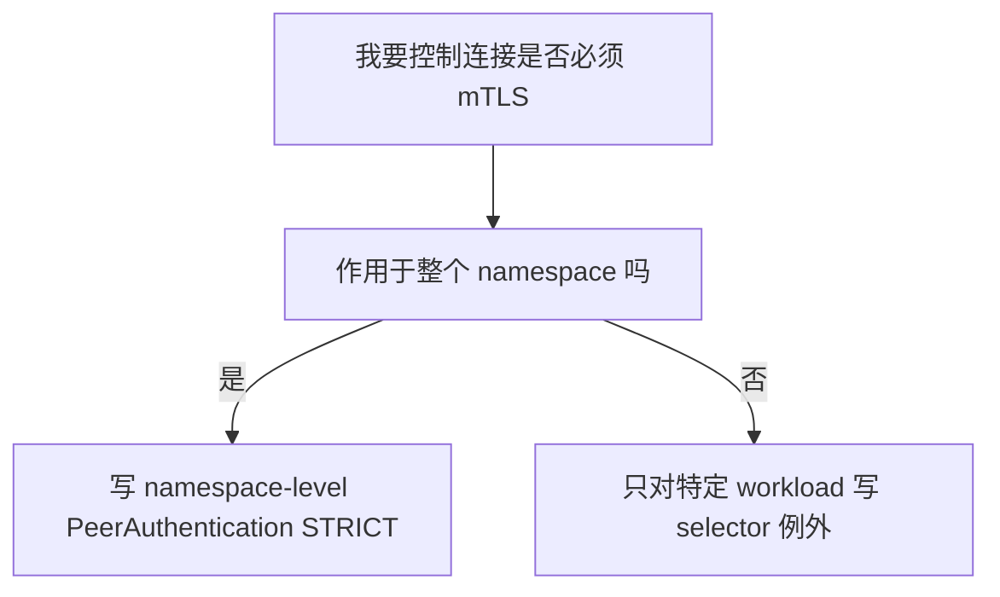
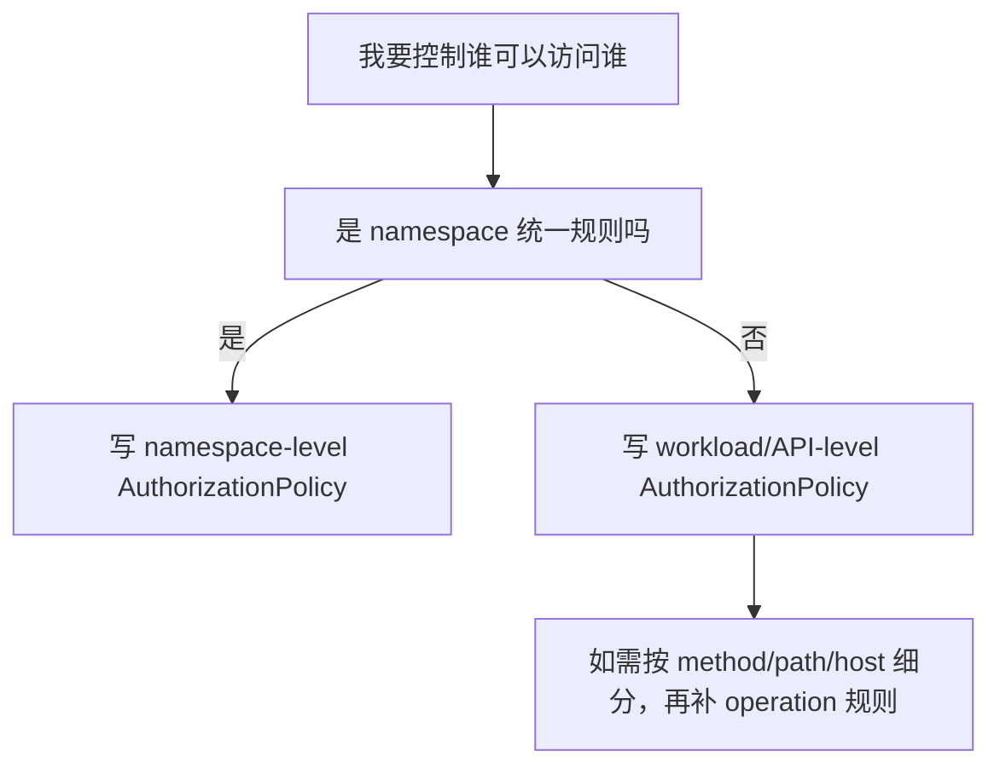

# AuthorizationPolicy And PeerAuthentication In Google Managed Service Mesh

## 1. Goal And Context

这份文档回答你当前最关心的几个问题：

1. Google managed service mesh 里的 `AuthorizationPolicy` 是什么
2. `PeerAuthentication` 是什么
3. 这两个资源分别能实现什么
4. 它们是 namespace 级资源，还是 API 级资源
5. 如果按 API level 做控制，是不是会生成很多规则
6. 在你当前 runtime namespace / API 隔离的思路下，推荐怎么落地

这份文档默认基于：

- GKE
- Google managed service mesh / Cloud Service Mesh
- sidecar 模式的 Istio APIs
- runtime namespace 作为基本隔离边界

---

## 2. Short Answer

先给你最短结论：

| 资源 | 核心作用 | 更像什么 |
|---|---|---|
| `PeerAuthentication` | 定义工作负载接收连接时是否要求 mTLS | 连接加密策略 |
| `AuthorizationPolicy` | 定义谁可以访问谁，能访问什么 | 访问控制策略 |

更直接一点：

- `PeerAuthentication` 解决的是：`这条连接是不是必须是 mTLS`
- `AuthorizationPolicy` 解决的是：`即使连上了，这个调用者有没有权限访问我`

它们经常一起使用，但职责完全不同。

---

## 3. What Is PeerAuthentication

### 3.1 定义

`PeerAuthentication` 是 Istio/Cloud Service Mesh 的 mTLS 接收侧策略。

它决定一个 workload 在接收请求时，是否：

- 接受明文
- 接受 mTLS
- 只接受 mTLS

### 3.2 它控制的不是“谁能访问”

这是最容易混淆的一点：

`PeerAuthentication` 不负责授权。

它不关心：

- 调用者是不是 `api-a`
- 是否来自某个 namespace
- 是否只能访问某条 path

它只关心：

- 这条连接是不是以 mTLS 方式建立

### 3.3 常见模式

| 模式 | 含义 |
|---|---|
| `STRICT` | 只接受 mTLS |
| `PERMISSIVE` | 同时接受 mTLS 和 plaintext |
| `DISABLE` | 不使用 mTLS |

在你现在这类生产隔离场景里，通常应优先考虑：

`STRICT`

### 3.4 作用范围

`PeerAuthentication` 可以作用在三个层级：

| 作用范围 | 如何体现 |
|---|---|
| mesh-wide | 放在 root namespace，例如 `istio-system` |
| namespace-wide | 放在目标 namespace，且不加 workload selector |
| workload-specific | 放在目标 namespace，并加 `selector.matchLabels` |

### 3.5 一个 namespace 里通常怎么用

最常见的做法是：

1. 先做一个 namespace 级 `STRICT`
2. 如果个别 workload 需要例外，再针对某个 workload 单独写更细粒度策略

也就是说：

`PeerAuthentication` 更像“namespace 级基线 + 少量例外”

而不是“每个 API 都写很多条”

---

## 4. What Is AuthorizationPolicy

### 4.1 定义

`AuthorizationPolicy` 是 Istio/Cloud Service Mesh 的访问控制策略。

它控制：

- 谁可以访问某个 workload
- 可以访问哪些端口
- 可以访问哪些 path / method / host
- 在哪些条件下允许或拒绝

### 4.2 它依赖身份信息

如果你想做可靠的服务间授权，通常需要结合 mTLS 身份。

例如：

- 来源 namespace
- 来源 principal
- 来源 service account

所以在实践上：

`AuthorizationPolicy` 最适合和 `PeerAuthentication STRICT` 一起用

因为 mTLS 打开后，调用方身份更可靠。

### 4.3 常见能力

| 能力 | 是否适合用 `AuthorizationPolicy` |
|---|---|
| 限制只有某个 namespace 可以访问我 | 适合 |
| 限制只有某个 service account 可以访问我 | 非常适合 |
| 限制只能访问某些 path / method | 适合 |
| 默认拒绝，再精确允许 | 非常适合 |
| 网络隔离替代品 | 不适合，网络隔离还是 `NetworkPolicy` |

### 4.4 作用范围

和 `PeerAuthentication` 类似，`AuthorizationPolicy` 也可以作用在：

| 作用范围 | 如何体现 |
|---|---|
| mesh-wide | 放在 root namespace |
| namespace-wide | 放在某个 namespace，不加 selector |
| workload-specific | 放在某个 namespace，并用 selector 选中目标 workload |

但和 `PeerAuthentication` 不同的是：

`AuthorizationPolicy` 更容易在 API 级别大量出现`

因为不同 API 的访问控制往往不同。

---

## 5. The Difference In One Table

| 对比项 | `PeerAuthentication` | `AuthorizationPolicy` |
|---|---|---|
| 主要目标 | 控制 mTLS 接收模式 | 控制访问权限 |
| 解决的问题 | “连进来时是否必须是 mTLS” | “谁可以访问我、访问什么” |
| 是否控制加密 | 是 | 否 |
| 是否控制授权 | 否 | 是 |
| 是否依赖调用方身份 | 间接相关 | 强相关 |
| 更适合的层级 | namespace baseline | namespace baseline + API/workload 精细控制 |
| 在生产里是否常配合使用 | 是 | 是 |

---

## 6. What They Can Achieve Together

如果两者一起用，你可以得到这样一套能力：

### 6.1 先用 `PeerAuthentication`

做这件事：

`我的 namespace 只接受 mTLS`

### 6.2 再用 `AuthorizationPolicy`

做这件事：

`即使你能通过 mTLS 连进来，也不代表你一定有权限访问我的 API`

### 6.3 最终效果

| 层次 | 资源 | 效果 |
|---|---|---|
| 传输安全 | `PeerAuthentication` | 强制使用 mTLS |
| 访问授权 | `AuthorizationPolicy` | 精确允许谁访问谁 |
| 网络边界 | `NetworkPolicy` | 从网络层阻止不该互通的流量 |

也就是说，在你的环境里更合理的安全分层通常是：

`NetworkPolicy + PeerAuthentication + AuthorizationPolicy`

---

## 7. Namespace Level Or API Level

这是你最关心的部分。

### 7.1 `PeerAuthentication` 更像 namespace 级

对于 `PeerAuthentication`，推荐理解是：

| 用法 | 推荐度 |
|---|---|
| mesh-wide 一刀切 | 可用，但要谨慎 |
| namespace-level baseline | 最推荐 |
| per-API / per-workload 例外 | 按需少量使用 |

原因很简单：

一个 namespace 里的 API，通常应该共享同一套“是否必须 mTLS”的基线。

例如：

- `runtime-a` 命名空间默认 `STRICT`
- 某个特殊 workload 如果临时兼容老系统，再单独例外

所以它通常不会变成“每个 API 好多条”。

### 7.2 `AuthorizationPolicy` 更可能走 API / workload 级

对于 `AuthorizationPolicy`，更现实的理解是：

| 用法 | 推荐度 |
|---|---|
| namespace-level baseline deny / allow | 推荐 |
| workload/API 级精细规则 | 很常见 |
| mesh-wide 精细授权 | 不推荐作为主路径，容易过重 |

因为授权天然是业务相关的。

例如：

- `api1` 只能被 `frontend` 调
- `api2` 只能被 `job-runner` 调
- `api3` 允许 `GET /healthz` 公开，但业务接口只允许内部调用

这些都更像 API 级规则。

所以答案是：

`是的，如果你要按 API level 做细粒度授权，确实可能会有很多 AuthorizationPolicy。`

但这不是设计错了，而是授权本身就细粒度。

---

## 8. Recommended Pattern For Your Runtime Model

结合你最近在做的 runtime namespace / API 隔离思路，我建议你按下面方式分层：

### 8.1 Layer 1: NetworkPolicy

负责：

- namespace 间默认不通
- namespace 内 pod-to-pod 默认不通

### 8.2 Layer 2: PeerAuthentication

负责：

- 这个 runtime namespace 默认只能接收 mTLS

推荐做法：

- 每个 runtime namespace 一条 namespace-level `STRICT`

### 8.3 Layer 3: AuthorizationPolicy

负责：

- 哪个 API 可以访问哪个 API
- 哪个 service account 可以访问哪个 workload

推荐做法：

- 每个 runtime namespace 一条 baseline deny/allow 策略
- 每个 API 或每类 workload，再补精细规则

### 8.4 这套分工的最大好处

| 层 | 资源 | 优势 |
|---|---|---|
| 网络层 | `NetworkPolicy` | 边界清晰 |
| 传输层 | `PeerAuthentication` | mTLS 基线统一 |
| 应用授权层 | `AuthorizationPolicy` | API 级控制清晰 |

---

## 9. Practical Design

### 9.1 推荐的最小落地模型

每个 runtime namespace 建议至少有：

1. 一条 `PeerAuthentication`，要求 `STRICT`
2. 一条 namespace 级 `AuthorizationPolicy` 基线策略
3. 若干条 workload/API 级 `AuthorizationPolicy`

### 9.2 为什么这样最稳

因为这能把“基线”和“例外”分开：

| 类型 | 资源 | 作用 |
|---|---|---|
| 基线 | namespace-level `PeerAuthentication` | 所有 API 默认必须 mTLS |
| 基线 | namespace-level `AuthorizationPolicy` | 所有 API 默认按统一规则收敛 |
| 例外 | workload-level `AuthorizationPolicy` | 某个 API 做单独授权 |

---

## 10. Example Configurations

下面以 `abjx-int` namespace 为例。

### 10.1 Namespace-level PeerAuthentication

```yaml
apiVersion: security.istio.io/v1beta1
kind: PeerAuthentication
metadata:
  name: default
  namespace: abjx-int
spec:
  mtls:
    mode: STRICT
```

这个策略表示：

- `abjx-int` 命名空间里的 workload 默认只接受 mTLS

### 10.2 Workload-level PeerAuthentication Exception

只有在你确实需要兼容老服务时才建议这样做。

```yaml
apiVersion: security.istio.io/v1beta1
kind: PeerAuthentication
metadata:
  name: api1-exception
  namespace: abjx-int
spec:
  selector:
    matchLabels:
      app: api1
  mtls:
    mode: PERMISSIVE
```

这表示：

- `api1` 可以同时接受 mTLS 和明文

生产里不建议大量使用这种例外。

### 10.3 Namespace-level AuthorizationPolicy Baseline

这个例子展示“默认只允许来自 mesh 内有身份的请求”。

```yaml
apiVersion: security.istio.io/v1beta1
kind: AuthorizationPolicy
metadata:
  name: namespace-baseline
  namespace: abjx-int
spec:
  action: ALLOW
  rules:
  - from:
    - source:
        principals:
        - "*"
```

这个示例的意义是：

- 先建立一个“必须带 mTLS 身份”的基线
- 如果是明文请求，通常拿不到 principal

注意：

这不是一个“全部拒绝”的例子，而是一个“只接受带身份请求”的最小基线例子。

### 10.4 API-level AuthorizationPolicy

假设：

- 只允许 `frontend-sa` 访问 `api1`

```yaml
apiVersion: security.istio.io/v1beta1
kind: AuthorizationPolicy
metadata:
  name: api1-allow-frontend
  namespace: abjx-int
spec:
  selector:
    matchLabels:
      app: api1
  action: ALLOW
  rules:
  - from:
    - source:
        principals:
        - "PROJECT_ID.svc.id.goog/ns/abjx-int/sa/frontend-sa"
```

### 10.5 API-level AuthorizationPolicy With HTTP Constraints

假设：

- `frontend-sa` 只能 `GET /healthz`

```yaml
apiVersion: security.istio.io/v1beta1
kind: AuthorizationPolicy
metadata:
  name: api1-allow-healthz
  namespace: abjx-int
spec:
  selector:
    matchLabels:
      app: api1
  action: ALLOW
  rules:
  - from:
    - source:
        principals:
        - "PROJECT_ID.svc.id.goog/ns/abjx-int/sa/frontend-sa"
    to:
    - operation:
        methods: ["GET"]
        paths: ["/healthz"]
```

---

## 11. Will I End Up With Many Policies

### 11.1 对 `PeerAuthentication`

通常不会很多。

一个典型 namespace 可能只有：

- 1 条 namespace-level `STRICT`
- 0 到少量 workload 例外

所以它的规模通常可控。

### 11.2 对 `AuthorizationPolicy`

很可能会多。

因为每个 API 的调用关系不同。

比如一个 namespace 有：

- 10 个 API
- 每个 API 的调用方不同
- 有的还要按 path 或 method 限制

那出现 10 条、20 条、更多条 `AuthorizationPolicy` 都是正常的。

这不是异常，而是：

`你把访问控制真的落实到 API / workload 级了`

### 11.3 怎么避免失控

建议用下面的模式：

| 层级 | 策略 |
|---|---|
| namespace | 一条 mTLS baseline |
| namespace | 一条 auth baseline |
| workload/API | 只给真正需要细分的 API 写精细策略 |
| 平台模板 | 把通用模式做成 Helm / Kustomize 模板 |

---

## 12. Recommended Decision Tree

### 12.1 什么时候用 PeerAuthentication



### 12.2 什么时候用 AuthorizationPolicy



---

## 13. What I Recommend For You

基于你最近的工作方向，我建议你这样落：

### 13.1 每个 runtime namespace

固定有：

1. `PeerAuthentication default STRICT`
2. 一条 namespace baseline `AuthorizationPolicy`
3. `NetworkPolicy default deny`

### 13.2 每个 API

按需补：

1. workload-level `AuthorizationPolicy`
2. 如果极少数 API 需要兼容旧流量，再补 workload-level `PeerAuthentication` 例外

### 13.3 一句话原则

`PeerAuthentication 做加密基线，AuthorizationPolicy 做 API 级授权。`

---

## 14. Final Summary

### 14.1 你可以这样理解

| 问题 | 用哪个资源 |
|---|---|
| 我的 namespace 里服务之间是不是必须 mTLS | `PeerAuthentication` |
| 哪个 API 可以调用哪个 API | `AuthorizationPolicy` |
| 哪个 namespace 默认不能访问哪个 namespace | `NetworkPolicy` + `AuthorizationPolicy` |
| 某个 API 只允许某个 SA 访问 | `AuthorizationPolicy` |

### 14.2 最重要的判断

如果你要做 runtime namespace 隔离，并且未来要做到 API level 的精细控制：

- `PeerAuthentication` 不会特别多，通常以 namespace baseline 为主
- `AuthorizationPolicy` 会越来越多，这是正常现象

所以你真正应该提前规划的是：

- label 规范
- service account 命名规范
- policy 模板化
- CI/CD 生成方式

而不是试图把所有 API 级授权都压缩成极少数几条规则。

---

## References

- [Authorization policy overview | Cloud Service Mesh](https://cloud.google.com/service-mesh/docs/security/authorization-policy-overview)
- [Istio AuthorizationPolicy reference](https://istio.io/latest/docs/reference/config/security/authorization-policy/)
- [Istio PeerAuthentication reference](https://istio.io/latest/docs/reference/config/security/peer_authentication/)
- [Strengthen app security with Cloud Service Mesh](https://docs.cloud.google.com/service-mesh/v1.20/docs/strengthen-app-security)

---

## Intrall call

你这里的问题非常关键，而且很容易把两层能力混在一起：

`如果同一个 namespace 默认是 deny all，我能不能只靠 AuthorizationPolicy 来实现 namespace 内 Pod 之间相互访问？`

先给结论：

`不能只靠 AuthorizationPolicy。`

更准确地说：

- `AuthorizationPolicy` 可以决定“这个调用有没有权限”
- 但如果网络层本身已经被 `NetworkPolicy deny all` 拦住了，流量根本到不了目标 Pod

所以对于同 namespace 的 internal call，要成功通常要同时满足两件事：

1. `NetworkPolicy` 允许这条流量从 consumer Pod 到 producer Pod
2. `AuthorizationPolicy` 允许这个调用者访问目标 workload

### 1. 一句话理解

你可以把它理解成两道门：

| 层次 | 问题 |
|---|---|
| `NetworkPolicy` | 这条网络连接能不能到达对方 Pod |
| `AuthorizationPolicy` | 到达之后，这个调用者有没有权限被接受 |

所以如果你现在的基线是：

- namespace 内 pod-to-pod 默认 deny all

那只写 `AuthorizationPolicy` 是不够的。

### 2. 为什么不够

假设：

- `api-a` 和 `api-b` 都在 `abjx-int`
- namespace 已经有 `NetworkPolicy default deny ingress/egress`

这时如果你只写：

- `AuthorizationPolicy` 允许 `api-a` 调 `api-b`

但没有写任何 `NetworkPolicy allow`

那么结果通常是：

- 请求先在网络层就被拦掉
- sidecar / workload 甚至可能根本收不到请求

也就是说：

`AuthorizationPolicy` 不是“打通网络”的资源，而是“收到请求以后决定放不放行”的资源。`

### 3. 那同 namespace internal call 正确怎么做

正确模式通常是：

#### 第一步：网络层放通

用 `NetworkPolicy` 允许：

- `api-a` egress 到 `api-b`
- `api-b` ingress 来自 `api-a`

#### 第二步：Mesh 授权层放通

用 `AuthorizationPolicy` 允许：

- `api-b` 接受来自 `api-a` 对应 identity 的调用

#### 第三步：mTLS 基线保持不变

用 `PeerAuthentication STRICT` 保持：

- 同 namespace 内部调用也必须是 mTLS

### 4. 在你的场景里，推荐组合

对于 intral namespace call，我建议你这样理解：

| 资源 | 作用 |
|---|---|
| `NetworkPolicy` | 打通 Pod 到 Pod 的网络路径 |
| `PeerAuthentication` | 要求调用必须走 mTLS |
| `AuthorizationPolicy` | 允许指定 API 调用指定 API |

所以答案不是：

`用 AuthorizationPolicy 实现同 namespace 内互通`

而是：

`用 NetworkPolicy + AuthorizationPolicy 一起实现同 namespace 内受控互通`

### 5. 推荐的设计方式

#### 5.1 如果你希望同 namespace 默认都不能互通

那么你的基线应该是：

1. `NetworkPolicy default deny`
2. `PeerAuthentication STRICT`
3. `AuthorizationPolicy` 只作为授权白名单

然后每当某两个 API 需要互调时：

1. 增加一条 `NetworkPolicy` allow
2. 增加一条 `AuthorizationPolicy` allow

#### 5.2 如果你希望同 namespace 内默认允许部分工作负载互通

也可以做成 namespace 内局部白名单模式：

- 网络层：允许某些 label 组之间互通
- 授权层：继续按 service account / workload 精细限制

但不建议一上来就把整个 namespace 全开。

### 6. 示例

下面以：

- consumer: `api-a`
- producer: `api-b`
- namespace: `abjx-int`

为例。

#### 6.1 NetworkPolicy: allow api-a -> api-b

```yaml
apiVersion: networking.k8s.io/v1
kind: NetworkPolicy
metadata:
  name: api-a-to-api-b
  namespace: abjx-int
spec:
  podSelector:
    matchLabels:
      app: api-a
  policyTypes:
  - Egress
  egress:
  - to:
    - podSelector:
        matchLabels:
          app: api-b
    ports:
    - protocol: TCP
      port: 8080
---
apiVersion: networking.k8s.io/v1
kind: NetworkPolicy
metadata:
  name: api-b-from-api-a
  namespace: abjx-int
spec:
  podSelector:
    matchLabels:
      app: api-b
  policyTypes:
  - Ingress
  ingress:
  - from:
    - podSelector:
        matchLabels:
          app: api-a
    ports:
    - protocol: TCP
      port: 8080
```

#### 6.2 PeerAuthentication: namespace strict

```yaml
apiVersion: security.istio.io/v1beta1
kind: PeerAuthentication
metadata:
  name: default
  namespace: abjx-int
spec:
  mtls:
    mode: STRICT
```

#### 6.3 AuthorizationPolicy: allow api-a identity to access api-b

```yaml
apiVersion: security.istio.io/v1beta1
kind: AuthorizationPolicy
metadata:
  name: api-b-allow-api-a
  namespace: abjx-int
spec:
  selector:
    matchLabels:
      app: api-b
  action: ALLOW
  rules:
  - from:
    - source:
        principals:
        - "PROJECT_ID.svc.id.goog/ns/abjx-int/sa/api-a-sa"
```

### 7. 如果只是同 namespace 内两个 API 想互相调用，要不要很多规则

答案是：

`通常会比你只做网络策略时多一些，但这是合理的。`

因为你在表达两件不同的事：

1. 网络上允许通
2. 安全上允许访问

对于一个 API 对另一个 API 的调用，通常最小集合就是：

- 1 组 `NetworkPolicy` ingress/egress
- 1 条 `AuthorizationPolicy`

如果调用关系很多，规则就会增多。

这不是资源设计的问题，而是你的安全边界本身更精细。

### 8. 最终建议

如果你问：

`同 namespace internal call 能不能通过 AuthorizationPolicy 实现？`

最准确的回答是：

`它可以实现授权，但不能单独实现连通。`

更完整的说法是：

`同 namespace internal call 应该由 NetworkPolicy 打通网络路径，再由 AuthorizationPolicy 放行调用身份，PeerAuthentication 保证连接走 mTLS。`

### 9. 结论表

| 问题 | 结论 |
|---|---|
| 同 namespace 默认 deny all 时，能不能只靠 `AuthorizationPolicy` 实现互通 | 不能 |
| `AuthorizationPolicy` 能不能控制“谁能访问谁” | 能 |
| `AuthorizationPolicy` 能不能替代 `NetworkPolicy` 打通被 deny 的流量 | 不能 |
| 同 namespace internal call 推荐怎么做 | `NetworkPolicy + PeerAuthentication + AuthorizationPolicy` |
