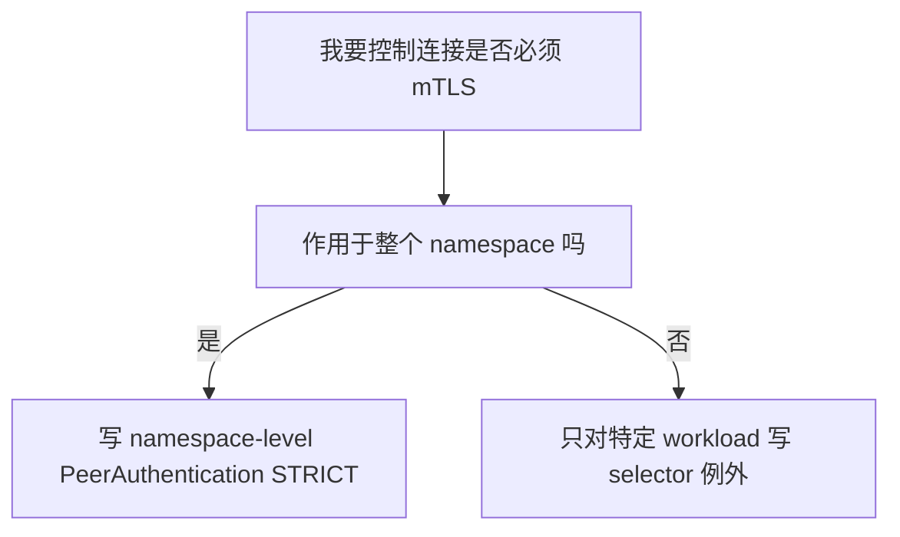
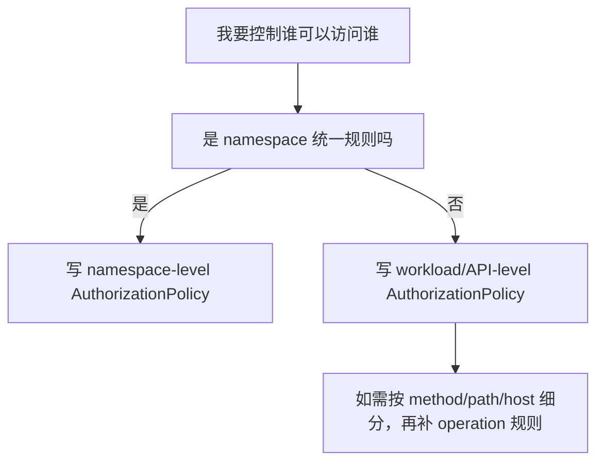

- [summary](#summary)
  - [AuthorizationPolicy And PeerAuthentication In Google Managed Service Mesh](#authorizationpolicy-and-peerauthentication-in-google-managed-service-mesh)
  - [8.4 这套分工的最大好处](#84-这套分工的最大好处)
- [1. Goal And Context](#1-goal-and-context)
  - [2. Short Answer](#2-short-answer)
  - [3. What Is PeerAuthentication](#3-what-is-peerauthentication)
    - [3.1 定义](#31-定义)
    - [3.2 它控制的不是“谁能访问”](#32-它控制的不是谁能访问)
    - [3.3 常见模式](#33-常见模式)
    - [3.4 作用范围](#34-作用范围)
    - [3.5 一个 namespace 里通常怎么用](#35-一个-namespace-里通常怎么用)
  - [4. What Is AuthorizationPolicy](#4-what-is-authorizationpolicy)
    - [4.1 定义](#41-定义)
    - [4.2 它依赖身份信息](#42-它依赖身份信息)
    - [4.3 常见能力](#43-常见能力)
    - [4.4 作用范围](#44-作用范围)
  - [5. The Difference In One Table](#5-the-difference-in-one-table)
  - [6. What They Can Achieve Together](#6-what-they-can-achieve-together)
    - [6.1 先用 `PeerAuthentication`](#61-先用-peerauthentication)
    - [6.2 再用 `AuthorizationPolicy`](#62-再用-authorizationpolicy)
    - [6.3 最终效果](#63-最终效果)
  - [7. Namespace Level Or API Level](#7-namespace-level-or-api-level)
    - [7.1 `PeerAuthentication` 更像 namespace 级](#71-peerauthentication-更像-namespace-级)
    - [7.2 `AuthorizationPolicy` 更可能走 API / workload 级](#72-authorizationpolicy-更可能走-api--workload-级)
  - [8. Recommended Pattern For Your Runtime Model](#8-recommended-pattern-for-your-runtime-model)
    - [8.1 Layer 1: NetworkPolicy](#81-layer-1-networkpolicy)
    - [8.2 Layer 2: PeerAuthentication](#82-layer-2-peerauthentication)
    - [8.3 Layer 3: AuthorizationPolicy](#83-layer-3-authorizationpolicy)
    - [8.4 这套分工的最大好处](#84-这套分工的最大好处-1)
  - [9. Practical Design](#9-practical-design)
    - [9.1 推荐的最小落地模型](#91-推荐的最小落地模型)
    - [9.2 为什么这样最稳](#92-为什么这样最稳)
  - [10. Example Configurations](#10-example-configurations)
    - [10.1 Namespace-level PeerAuthentication](#101-namespace-level-peerauthentication)
    - [10.2 Workload-level PeerAuthentication Exception](#102-workload-level-peerauthentication-exception)
    - [10.3 Namespace-level AuthorizationPolicy Baseline](#103-namespace-level-authorizationpolicy-baseline)
    - [10.4 API-level AuthorizationPolicy](#104-api-level-authorizationpolicy)
    - [10.5 API-level AuthorizationPolicy With HTTP Constraints](#105-api-level-authorizationpolicy-with-http-constraints)
  - [11. Will I End Up With Many Policies](#11-will-i-end-up-with-many-policies)
    - [11.1 对 `PeerAuthentication`](#111-对-peerauthentication)
    - [11.2 对 `AuthorizationPolicy`](#112-对-authorizationpolicy)
    - [11.3 怎么避免失控](#113-怎么避免失控)
  - [12. Recommended Decision Tree](#12-recommended-decision-tree)
    - [12.1 什么时候用 PeerAuthentication](#121-什么时候用-peerauthentication)
    - [12.2 什么时候用 AuthorizationPolicy](#122-什么时候用-authorizationpolicy)
  - [13. What I Recommend For You](#13-what-i-recommend-for-you)
    - [13.1 每个 runtime namespace](#131-每个-runtime-namespace)
    - [13.2 每个 API](#132-每个-api)
    - [13.3 一句话原则](#133-一句话原则)
  - [14. Final Summary](#14-final-summary)
    - [14.1 你可以这样理解](#141-你可以这样理解)
    - [14.2 最重要的判断](#142-最重要的判断)
  - [References](#references)
  - [Intrall call](#intrall-call)
    - [1. 一句话理解](#1-一句话理解)
    - [2. 为什么不够](#2-为什么不够)
    - [3. 那同 namespace internal call 正确怎么做](#3-那同-namespace-internal-call-正确怎么做)
    - [4. 从层级上怎么理解三种资源](#4-从层级上怎么理解三种资源)
    - [5. 你现在这个思路是不是可以把 AuthorizationPolicy 理解成 API level](#5-你现在这个思路是不是可以把-authorizationpolicy-理解成-api-level)
    - [6. 为什么说 AuthorizationPolicy 很适合做 API level](#6-为什么说-authorizationpolicy-很适合做-api-level)
    - [7. 更高级的理解：namespace baseline 和 API exception](#7-更高级的理解namespace-baseline-和-api-exception)
      - [7.1 Namespace baseline](#71-namespace-baseline)
      - [7.2 API-level exception / allow list](#72-api-level-exception--allow-list)
    - [8. 你可以怎么理解“默认 deny all + API 精细授权”](#8-你可以怎么理解默认-deny-all--api-精细授权)
      - [第一步：网络层默认不通](#第一步网络层默认不通)
      - [第二步：mesh 连接必须带身份](#第二步mesh-连接必须带身份)
      - [第三步：按 API 定义允许关系](#第三步按-api-定义允许关系)
    - [9. 高级用法应该怎么设计](#9-高级用法应该怎么设计)
      - [9.1 以 service account 作为调用方身份](#91-以-service-account-作为调用方身份)
      - [9.2 以 workload label 作为被访问方身份](#92-以-workload-label-作为被访问方身份)
      - [9.3 namespace 级策略只做基线，不做全部业务逻辑](#93-namespace-级策略只做基线不做全部业务逻辑)
    - [10. 推荐的落地模型](#10-推荐的落地模型)
    - [11. 你当前这个方向的最大价值](#11-你当前这个方向的最大价值)
    - [12. 最终建议](#12-最终建议)
      - [第一步：网络层放通](#第一步网络层放通)
      - [第二步：Mesh 授权层放通](#第二步mesh-授权层放通)
      - [第三步：mTLS 基线保持不变](#第三步mtls-基线保持不变)
    - [4. 在你的场景里，推荐组合](#4-在你的场景里推荐组合)
    - [5. 推荐的设计方式](#5-推荐的设计方式)
      - [5.1 如果你希望同 namespace 默认都不能互通](#51-如果你希望同-namespace-默认都不能互通)
      - [5.2 如果你希望同 namespace 内默认允许部分工作负载互通](#52-如果你希望同-namespace-内默认允许部分工作负载互通)
    - [6. 示例](#6-示例)
      - [6.1 NetworkPolicy: allow api-a -\> api-b](#61-networkpolicy-allow-api-a---api-b)
      - [6.2 PeerAuthentication: namespace strict](#62-peerauthentication-namespace-strict)
      - [6.3 AuthorizationPolicy: allow api-a identity to access api-b](#63-authorizationpolicy-allow-api-a-identity-to-access-api-b)
    - [7. 如果只是同 namespace 内两个 API 想互相调用，要不要很多规则](#7-如果只是同-namespace-内两个-api-想互相调用要不要很多规则)
    - [8. 最终建议](#8-最终建议)
    - [9. 结论表](#9-结论表)
  - [15. Platform Default Baseline + Fine-Grained Control](#15-platform-default-baseline--fine-grained-control)
    - [15.1 你的问题核心](#151-你的问题核心)
    - [15.2 你提供的两个例子分析](#152-你提供的两个例子分析)
      - [示例 1：基于 principal 的精细规则](#示例-1基于-principal-的精细规则)
      - [示例 2：基于 namespace 的宽松规则](#示例-2基于-namespace-的宽松规则)
    - [15.3 两种规则的关系](#153-两种规则的关系)
    - [15.4 那还需要为每个 API 写规则吗](#154-那还需要为每个-api-写规则吗)
      - [模式 A：同 namespace 内默认互通（宽松模式）](#模式-a同-namespace-内默认互通宽松模式)
      - [模式 B：同 namespace 内默认不互通（严格模式）](#模式-b同-namespace-内默认不互通严格模式)
    - [15.5 推荐的平台初始化策略](#155-推荐的平台初始化策略)
      - [第一层：平台默认基线（创建 namespace 时自动 apply）](#第一层平台默认基线创建-namespace-时自动-apply)
      - [第二层：平台标准扩展规则（按需 apply）](#第二层平台标准扩展规则按需-apply)
      - [第三层：API owner 精细规则（由 API 团队维护）](#第三层api-owner-精细规则由-api-团队维护)
    - [15.6 回答你的核心问题](#156-回答你的核心问题)
    - [15.7 平台工程建议](#157-平台工程建议)
      - [建议 1：把基线策略做成 Helm/Kustomize 模板](#建议-1把基线策略做成-helmkustomize-模板)
      - [建议 2：把精细规则做成 CI/CD 自动生成](#建议-2把精细规则做成-cicd-自动生成)
      - [建议 3：文档化策略决策树](#建议-3文档化策略决策树)
    - [15.8 最终决策表](#158-最终决策表)
    - [15.9 一句话总结](#159-一句话总结)
  - [16. Layer A vs Layer B: Balancing NetworkPolicy And AuthorizationPolicy](#16-layer-a-vs-layer-b-balancing-networkpolicy-and-authorizationpolicy)
    - [16.1 你的两种设计意图分析](#161-你的两种设计意图分析)
      - [Layer A 的核心逻辑](#layer-a-的核心逻辑)
      - [Layer B 的核心逻辑](#layer-b-的核心逻辑)
    - [16.2 两者的本质区别](#162-两者的本质区别)
    - [16.3 推荐的分层模型](#163-推荐的分层模型)
      - [Layer 1: NetworkPolicy - 网络边界隔离（对应你的 Layer A）](#layer-1-networkpolicy---网络边界隔离对应你的-layer-a)
      - [Layer 2: AuthorizationPolicy - 零信任授权控制（对应你的 Layer B）](#layer-2-authorizationpolicy---零信任授权控制对应你的-layer-b)
    - [16.4 两者的叠加效果](#164-两者的叠加效果)
    - [16.5 你的场景推荐组合](#165-你的场景推荐组合)
      - [第一步：NetworkPolicy 实现 Layer A](#第一步networkpolicy-实现-layer-a)
      - [第二步：AuthorizationPolicy 实现 Layer B](#第二步authorizationpolicy-实现-layer-b)
      - [第三步：PeerAuthentication 保持 mTLS 基线](#第三步peerauthentication-保持-mtls-基线)
    - [16.6 最终的分层决策表](#166-最终的分层决策表)
    - [16.7 常见误区](#167-常见误区)
      - [误区 1：用 AuthorizationPolicy 替代 NetworkPolicy](#误区-1用-authorizationpolicy-替代-networkpolicy)
      - [误区 2：NetworkPolicy 和 AuthorizationPolicy 规则重复](#误区-2networkpolicy-和-authorizationpolicy-规则重复)
      - [误区 3：忘记 DNS 和 control plane 流量](#误区-3忘记-dns-和-control-plane-流量)
    - [16.8 平台工程落地建议](#168-平台工程落地建议)
      - [建议 1：NetworkPolicy 由平台统一下发](#建议-1networkpolicy-由平台统一下发)
      - [建议 2：AuthorizationPolicy 由 API owner 按需申请](#建议-2authorizationpolicy-由-api-owner-按需申请)
      - [建议 3：提供策略验证工具](#建议-3提供策略验证工具)
    - [16.9 一句话总结](#169-一句话总结)
# summary 
## AuthorizationPolicy And PeerAuthentication In Google Managed Service Mesh


你可以把它理解成两道门：

| 层次                  | 问题                                 |
| --------------------- | ------------------------------------ |
| `NetworkPolicy`       | 这条网络连接能不能到达对方 Pod       |
| `AuthorizationPolicy` | 到达之后，这个调用者有没有权限被接受 |


对于 intral namespace call，我建议你这样理解：

| 资源                  | 作用                       |
| --------------------- | -------------------------- |
| `NetworkPolicy`       | 打通 Pod 到 Pod 的网络路径 |
| `PeerAuthentication`  | 要求调用必须走 mTLS        |
| `AuthorizationPolicy` | 允许指定 API 调用指定 API  |


## 8.4 这套分工的最大好处

| 层         | 资源                  | 优势           |
| ---------- | --------------------- | -------------- |
| 网络层     | `NetworkPolicy`       | 边界清晰       |
| 传输层     | `PeerAuthentication`  | mTLS 基线统一  |
| 应用授权层 | `AuthorizationPolicy` | API 级控制清晰 |


NetworkPolicy 负责"网络能不能到"，AuthorizationPolicy 负责"到了以后让不让进"。

更完整的说法是：

Layer A（网络边界）用 NetworkPolicy 实现，Layer B（零信任授权）用 AuthorizationPolicy 实现，两者叠加才能做到"默认收紧、按需放行"的完整安全模型。

# 1. Goal And Context

这份文档回答你当前最关心的几个问题：

1. Google managed service mesh 里的 `AuthorizationPolicy` 是什么
2. `PeerAuthentication` 是什么
3. 这两个资源分别能实现什么
4. 它们是 namespace 级资源，还是 API 级资源
5. 如果按 API level 做控制，是不是会生成很多规则
6. 在你当前 runtime namespace / API 隔离的思路下，推荐怎么落地

这份文档默认基于：

- GKE
- Google managed service mesh / Cloud Service Mesh
- sidecar 模式的 Istio APIs
- runtime namespace 作为基本隔离边界

---

## 2. Short Answer

先给你最短结论：

| 资源                  | 核心作用                            | 更像什么     |
| --------------------- | ----------------------------------- | ------------ |
| `PeerAuthentication`  | 定义工作负载接收连接时是否要求 mTLS | 连接加密策略 |
| `AuthorizationPolicy` | 定义谁可以访问谁，能访问什么        | 访问控制策略 |

更直接一点：

- `PeerAuthentication` 解决的是：`这条连接是不是必须是 mTLS`
- `AuthorizationPolicy` 解决的是：`即使连上了，这个调用者有没有权限访问我`

它们经常一起使用，但职责完全不同。

---

## 3. What Is PeerAuthentication

### 3.1 定义

`PeerAuthentication` 是 Istio/Cloud Service Mesh 的 mTLS 接收侧策略。

它决定一个 workload 在接收请求时，是否：

- 接受明文
- 接受 mTLS
- 只接受 mTLS

### 3.2 它控制的不是“谁能访问”

这是最容易混淆的一点：

`PeerAuthentication` 不负责授权。

它不关心：

- 调用者是不是 `api-a`
- 是否来自某个 namespace
- 是否只能访问某条 path

它只关心：

- 这条连接是不是以 mTLS 方式建立

### 3.3 常见模式

| 模式         | 含义                       |
| ------------ | -------------------------- |
| `STRICT`     | 只接受 mTLS                |
| `PERMISSIVE` | 同时接受 mTLS 和 plaintext |
| `DISABLE`    | 不使用 mTLS                |

在你现在这类生产隔离场景里，通常应优先考虑：

`STRICT`

### 3.4 作用范围

`PeerAuthentication` 可以作用在三个层级：

| 作用范围          | 如何体现                                        |
| ----------------- | ----------------------------------------------- |
| mesh-wide         | 放在 root namespace，例如 `istio-system`        |
| namespace-wide    | 放在目标 namespace，且不加 workload selector    |
| workload-specific | 放在目标 namespace，并加 `selector.matchLabels` |

### 3.5 一个 namespace 里通常怎么用

最常见的做法是：

1. 先做一个 namespace 级 `STRICT`
2. 如果个别 workload 需要例外，再针对某个 workload 单独写更细粒度策略

也就是说：

`PeerAuthentication` 更像“namespace 级基线 + 少量例外”

而不是“每个 API 都写很多条”

---

## 4. What Is AuthorizationPolicy

### 4.1 定义

`AuthorizationPolicy` 是 Istio/Cloud Service Mesh 的访问控制策略。

它控制：

- 谁可以访问某个 workload
- 可以访问哪些端口
- 可以访问哪些 path / method / host
- 在哪些条件下允许或拒绝

### 4.2 它依赖身份信息

如果你想做可靠的服务间授权，通常需要结合 mTLS 身份。

例如：

- 来源 namespace
- 来源 principal
- 来源 service account

所以在实践上：

`AuthorizationPolicy` 最适合和 `PeerAuthentication STRICT` 一起用

因为 mTLS 打开后，调用方身份更可靠。

### 4.3 常见能力

| 能力                                    | 是否适合用 `AuthorizationPolicy`     |
| --------------------------------------- | ------------------------------------ |
| 限制只有某个 namespace 可以访问我       | 适合                                 |
| 限制只有某个 service account 可以访问我 | 非常适合                             |
| 限制只能访问某些 path / method          | 适合                                 |
| 默认拒绝，再精确允许                    | 非常适合                             |
| 网络隔离替代品                          | 不适合，网络隔离还是 `NetworkPolicy` |

### 4.4 作用范围

和 `PeerAuthentication` 类似，`AuthorizationPolicy` 也可以作用在：

| 作用范围          | 如何体现                                            |
| ----------------- | --------------------------------------------------- |
| mesh-wide         | 放在 root namespace                                 |
| namespace-wide    | 放在某个 namespace，不加 selector                   |
| workload-specific | 放在某个 namespace，并用 selector 选中目标 workload |

但和 `PeerAuthentication` 不同的是：

`AuthorizationPolicy` 更容易在 API 级别大量出现`

因为不同 API 的访问控制往往不同。

---

## 5. The Difference In One Table

| 对比项                 | `PeerAuthentication`      | `AuthorizationPolicy`                      |
| ---------------------- | ------------------------- | ------------------------------------------ |
| 主要目标               | 控制 mTLS 接收模式        | 控制访问权限                               |
| 解决的问题             | “连进来时是否必须是 mTLS” | “谁可以访问我、访问什么”                   |
| 是否控制加密           | 是                        | 否                                         |
| 是否控制授权           | 否                        | 是                                         |
| 是否依赖调用方身份     | 间接相关                  | 强相关                                     |
| 更适合的层级           | namespace baseline        | namespace baseline + API/workload 精细控制 |
| 在生产里是否常配合使用 | 是                        | 是                                         |

---

## 6. What They Can Achieve Together

如果两者一起用，你可以得到这样一套能力：

### 6.1 先用 `PeerAuthentication`

做这件事：

`我的 namespace 只接受 mTLS`

### 6.2 再用 `AuthorizationPolicy`

做这件事：

`即使你能通过 mTLS 连进来，也不代表你一定有权限访问我的 API`

### 6.3 最终效果

| 层次     | 资源                  | 效果                       |
| -------- | --------------------- | -------------------------- |
| 传输安全 | `PeerAuthentication`  | 强制使用 mTLS              |
| 访问授权 | `AuthorizationPolicy` | 精确允许谁访问谁           |
| 网络边界 | `NetworkPolicy`       | 从网络层阻止不该互通的流量 |

也就是说，在你的环境里更合理的安全分层通常是：

`NetworkPolicy + PeerAuthentication + AuthorizationPolicy`

---

## 7. Namespace Level Or API Level

这是你最关心的部分。

### 7.1 `PeerAuthentication` 更像 namespace 级

对于 `PeerAuthentication`，推荐理解是：

| 用法                        | 推荐度         |
| --------------------------- | -------------- |
| mesh-wide 一刀切            | 可用，但要谨慎 |
| namespace-level baseline    | 最推荐         |
| per-API / per-workload 例外 | 按需少量使用   |

原因很简单：

一个 namespace 里的 API，通常应该共享同一套“是否必须 mTLS”的基线。

例如：

- `runtime-a` 命名空间默认 `STRICT`
- 某个特殊 workload 如果临时兼容老系统，再单独例外

所以它通常不会变成“每个 API 好多条”。

### 7.2 `AuthorizationPolicy` 更可能走 API / workload 级

对于 `AuthorizationPolicy`，更现实的理解是：

| 用法                                  | 推荐度                     |
| ------------------------------------- | -------------------------- |
| namespace-level baseline deny / allow | 推荐                       |
| workload/API 级精细规则               | 很常见                     |
| mesh-wide 精细授权                    | 不推荐作为主路径，容易过重 |

因为授权天然是业务相关的。

例如：

- `api1` 只能被 `frontend` 调
- `api2` 只能被 `job-runner` 调
- `api3` 允许 `GET /healthz` 公开，但业务接口只允许内部调用

这些都更像 API 级规则。

所以答案是：

`是的，如果你要按 API level 做细粒度授权，确实可能会有很多 AuthorizationPolicy。`

但这不是设计错了，而是授权本身就细粒度。

---

## 8. Recommended Pattern For Your Runtime Model

结合你最近在做的 runtime namespace / API 隔离思路，我建议你按下面方式分层：

### 8.1 Layer 1: NetworkPolicy

负责：

- namespace 间默认不通
- namespace 内 pod-to-pod 默认不通

### 8.2 Layer 2: PeerAuthentication

负责：

- 这个 runtime namespace 默认只能接收 mTLS

推荐做法：

- 每个 runtime namespace 一条 namespace-level `STRICT`

### 8.3 Layer 3: AuthorizationPolicy

负责：

- 哪个 API 可以访问哪个 API
- 哪个 service account 可以访问哪个 workload

推荐做法：

- 每个 runtime namespace 一条 baseline deny/allow 策略
- 每个 API 或每类 workload，再补精细规则

### 8.4 这套分工的最大好处

| 层         | 资源                  | 优势           |
| ---------- | --------------------- | -------------- |
| 网络层     | `NetworkPolicy`       | 边界清晰       |
| 传输层     | `PeerAuthentication`  | mTLS 基线统一  |
| 应用授权层 | `AuthorizationPolicy` | API 级控制清晰 |

---

## 9. Practical Design

### 9.1 推荐的最小落地模型

每个 runtime namespace 建议至少有：

1. 一条 `PeerAuthentication`，要求 `STRICT`
2. 一条 namespace 级 `AuthorizationPolicy` 基线策略
3. 若干条 workload/API 级 `AuthorizationPolicy`

### 9.2 为什么这样最稳

因为这能把“基线”和“例外”分开：

| 类型 | 资源                                  | 作用                        |
| ---- | ------------------------------------- | --------------------------- |
| 基线 | namespace-level `PeerAuthentication`  | 所有 API 默认必须 mTLS      |
| 基线 | namespace-level `AuthorizationPolicy` | 所有 API 默认按统一规则收敛 |
| 例外 | workload-level `AuthorizationPolicy`  | 某个 API 做单独授权         |

---

## 10. Example Configurations

下面以 `abjx-int` namespace 为例。

### 10.1 Namespace-level PeerAuthentication

```yaml
apiVersion: security.istio.io/v1beta1
kind: PeerAuthentication
metadata:
  name: default
  namespace: abjx-int
spec:
  mtls:
    mode: STRICT
```

这个策略表示：

- `abjx-int` 命名空间里的 workload 默认只接受 mTLS

### 10.2 Workload-level PeerAuthentication Exception

只有在你确实需要兼容老服务时才建议这样做。

```yaml
apiVersion: security.istio.io/v1beta1
kind: PeerAuthentication
metadata:
  name: api1-exception
  namespace: abjx-int
spec:
  selector:
    matchLabels:
      app: api1
  mtls:
    mode: PERMISSIVE
```

这表示：

- `api1` 可以同时接受 mTLS 和明文

生产里不建议大量使用这种例外。

### 10.3 Namespace-level AuthorizationPolicy Baseline

这个例子展示“默认只允许来自 mesh 内有身份的请求”。

```yaml
apiVersion: security.istio.io/v1beta1
kind: AuthorizationPolicy
metadata:
  name: namespace-baseline
  namespace: abjx-int
spec:
  action: ALLOW
  rules:
  - from:
    - source:
        principals:
        - "*"
```

这个示例的意义是：

- 先建立一个“必须带 mTLS 身份”的基线
- 如果是明文请求，通常拿不到 principal

注意：

这不是一个“全部拒绝”的例子，而是一个“只接受带身份请求”的最小基线例子。

### 10.4 API-level AuthorizationPolicy

假设：

- 只允许 `frontend-sa` 访问 `api1`

```yaml
apiVersion: security.istio.io/v1beta1
kind: AuthorizationPolicy
metadata:
  name: api1-allow-frontend
  namespace: abjx-int
spec:
  selector:
    matchLabels:
      app: api1
  action: ALLOW
  rules:
  - from:
    - source:
        principals:
        - "PROJECT_ID.svc.id.goog/ns/abjx-int/sa/frontend-sa"
```

### 10.5 API-level AuthorizationPolicy With HTTP Constraints

假设：

- `frontend-sa` 只能 `GET /healthz`

```yaml
apiVersion: security.istio.io/v1beta1
kind: AuthorizationPolicy
metadata:
  name: api1-allow-healthz
  namespace: abjx-int
spec:
  selector:
    matchLabels:
      app: api1
  action: ALLOW
  rules:
  - from:
    - source:
        principals:
        - "PROJECT_ID.svc.id.goog/ns/abjx-int/sa/frontend-sa"
    to:
    - operation:
        methods: ["GET"]
        paths: ["/healthz"]
```

---

## 11. Will I End Up With Many Policies

### 11.1 对 `PeerAuthentication`

通常不会很多。

一个典型 namespace 可能只有：

- 1 条 namespace-level `STRICT`
- 0 到少量 workload 例外

所以它的规模通常可控。

### 11.2 对 `AuthorizationPolicy`

很可能会多。

因为每个 API 的调用关系不同。

比如一个 namespace 有：

- 10 个 API
- 每个 API 的调用方不同
- 有的还要按 path 或 method 限制

那出现 10 条、20 条、更多条 `AuthorizationPolicy` 都是正常的。

这不是异常，而是：

`你把访问控制真的落实到 API / workload 级了`

### 11.3 怎么避免失控

建议用下面的模式：

| 层级         | 策略                                 |
| ------------ | ------------------------------------ |
| namespace    | 一条 mTLS baseline                   |
| namespace    | 一条 auth baseline                   |
| workload/API | 只给真正需要细分的 API 写精细策略    |
| 平台模板     | 把通用模式做成 Helm / Kustomize 模板 |

---

## 12. Recommended Decision Tree

### 12.1 什么时候用 PeerAuthentication



### 12.2 什么时候用 AuthorizationPolicy



---

## 13. What I Recommend For You

基于你最近的工作方向，我建议你这样落：

### 13.1 每个 runtime namespace

固定有：

1. `PeerAuthentication default STRICT`
2. 一条 namespace baseline `AuthorizationPolicy`
3. `NetworkPolicy default deny`

### 13.2 每个 API

按需补：

1. workload-level `AuthorizationPolicy`
2. 如果极少数 API 需要兼容旧流量，再补 workload-level `PeerAuthentication` 例外

### 13.3 一句话原则

`PeerAuthentication 做加密基线，AuthorizationPolicy 做 API 级授权。`

---

## 14. Final Summary

### 14.1 你可以这样理解

| 问题                                      | 用哪个资源                              |
| ----------------------------------------- | --------------------------------------- |
| 我的 namespace 里服务之间是不是必须 mTLS  | `PeerAuthentication`                    |
| 哪个 API 可以调用哪个 API                 | `AuthorizationPolicy`                   |
| 哪个 namespace 默认不能访问哪个 namespace | `NetworkPolicy` + `AuthorizationPolicy` |
| 某个 API 只允许某个 SA 访问               | `AuthorizationPolicy`                   |

### 14.2 最重要的判断

如果你要做 runtime namespace 隔离，并且未来要做到 API level 的精细控制：

- `PeerAuthentication` 不会特别多，通常以 namespace baseline 为主
- `AuthorizationPolicy` 会越来越多，这是正常现象

所以你真正应该提前规划的是：

- label 规范
- service account 命名规范
- policy 模板化
- CI/CD 生成方式

而不是试图把所有 API 级授权都压缩成极少数几条规则。

---

## References

- [Authorization policy overview | Cloud Service Mesh](https://cloud.google.com/service-mesh/docs/security/authorization-policy-overview)
- [Istio AuthorizationPolicy reference](https://istio.io/latest/docs/reference/config/security/authorization-policy/)
- [Istio PeerAuthentication reference](https://istio.io/latest/docs/reference/config/security/peer_authentication/)
- [Strengthen app security with Cloud Service Mesh](https://docs.cloud.google.com/service-mesh/v1.20/docs/strengthen-app-security)

---

## Intrall call

你这里的问题非常关键，而且很容易把两层能力混在一起：

`如果同一个 namespace 默认是 deny all，我能不能只靠 AuthorizationPolicy 来实现 namespace 内 Pod 之间相互访问？`

先给结论：

`不能只靠 AuthorizationPolicy。`

更准确地说：

- `AuthorizationPolicy` 可以决定“这个调用有没有权限”
- 但如果网络层本身已经被 `NetworkPolicy deny all` 拦住了，流量根本到不了目标 Pod

所以对于同 namespace 的 internal call，要成功通常要同时满足两件事：

1. `NetworkPolicy` 允许这条流量从 consumer Pod 到 producer Pod
2. `AuthorizationPolicy` 允许这个调用者访问目标 workload

### 1. 一句话理解

你可以把它理解成两道门：

| 层次                  | 问题                                 |
| --------------------- | ------------------------------------ |
| `NetworkPolicy`       | 这条网络连接能不能到达对方 Pod       |
| `AuthorizationPolicy` | 到达之后，这个调用者有没有权限被接受 |

所以如果你现在的基线是：

- namespace 内 pod-to-pod 默认 deny all

那只写 `AuthorizationPolicy` 是不够的。

### 2. 为什么不够

假设：

- `api-a` 和 `api-b` 都在 `abjx-int`
- namespace 已经有 `NetworkPolicy default deny ingress/egress`

这时如果你只写：

- `AuthorizationPolicy` 允许 `api-a` 调 `api-b`

但没有写任何 `NetworkPolicy allow`

那么结果通常是：

- 请求先在网络层就被拦掉
- sidecar / workload 甚至可能根本收不到请求

也就是说：

`AuthorizationPolicy` 不是“打通网络”的资源，而是“收到请求以后决定放不放行”的资源。`

### 3. 那同 namespace internal call 正确怎么做

如果你当前 runtime namespace 的基线是：

- `NetworkPolicy default deny all ingress + egress`
- `PeerAuthentication STRICT`

那么同 namespace 的 internal call 正确理解应该是：

1. 先在网络层放通“谁可以连到谁”
2. 再在 mesh 授权层定义“谁可以调用谁、可以调用到什么粒度”

也就是说：

`NetworkPolicy 决定流量能不能到；AuthorizationPolicy 决定到了以后放不放。`

### 4. 从层级上怎么理解三种资源

你可以把这三类资源理解成三个不同层次：

| 层次       | 资源                  | 回答的问题                     |
| ---------- | --------------------- | ------------------------------ |
| 网络层     | `NetworkPolicy`       | 包能不能从 A 到 B              |
| 传输安全层 | `PeerAuthentication`  | 这条连接是不是必须 mTLS        |
| 授权层     | `AuthorizationPolicy` | 即使连上了，A 有没有权限访问 B |

所以对于你的 runtime namespace 模型，更合理的层级概念不是“谁比谁高级”，而是：

`它们分属不同控制面，应该叠加，而不是互相替代。`

### 5. 你现在这个思路是不是可以把 AuthorizationPolicy 理解成 API level

答案是：

`可以，而且这正是比较合理的高级用法。`

更准确地说：

- `NetworkPolicy` 更适合作为 namespace / workload 的网络边界基线
- `PeerAuthentication` 更适合作为 namespace 的 mTLS 基线
- `AuthorizationPolicy` 非常适合作为 API / workload level 的精细授权层

所以你现在说的这个模式是成立的：

1. runtime namespace 创建时，平台自动下发 `default deny all` 的 `NetworkPolicy`
2. 同时下发 namespace 级 `PeerAuthentication STRICT`
3. 再把 `AuthorizationPolicy` 作为 API level 的细粒度授权模型

这其实就是一个很清晰的三层安全分工。

### 6. 为什么说 AuthorizationPolicy 很适合做 API level

因为它天然支持：

- workload selector
- source principal / service account
- path / method / host / port

这意味着你完全可以把它理解成：

`某个 API 的调用权限定义`

例如：

- `api-order` 只允许 `frontend-sa` 调用
- `api-billing` 只允许 `worker-sa` 调用
- `api-health` 允许 mesh 内任意带身份 workload 访问 `/healthz`

这和你现在 runtime namespace 里“每个 API 独立部署”的思路是非常匹配的。

### 7. 更高级的理解：namespace baseline 和 API exception

如果从平台工程角度去理解，我更建议你把策略分成两类：

#### 7.1 Namespace baseline

这部分由平台统一下发，作为 runtime namespace 默认安全姿态：

- `NetworkPolicy default deny all`
- namespace 级 `PeerAuthentication STRICT`
- 一条 namespace 级 `AuthorizationPolicy` baseline

这一层的目标不是表达业务逻辑，而是表达：

`这个 namespace 默认是收紧的。`

#### 7.2 API-level exception / allow list

这部分由 API owner 或平台模板按 API 生成：

- 允许哪个 service account 调用这个 API
- 允许哪些 path / method
- 是否允许 namespace 内某类调用
- 是否允许跨 namespace 的特定 caller

这一层的目标才是表达真正的业务调用关系。

### 8. 你可以怎么理解“默认 deny all + API 精细授权”

这个模型其实很像防火墙思维：

1. 先全部收紧
2. 再逐个放开最小必要通路

放到你的 runtime namespace 里，可以理解成：

#### 第一步：网络层默认不通

```yaml
apiVersion: networking.k8s.io/v1
kind: NetworkPolicy
metadata:
  name: default-deny-all
  namespace: $namespace
spec:
  podSelector: {}
  policyTypes:
    - Ingress
    - Egress
```

这一步表达：

`这个 namespace 里的 Pod 默认谁也不能随便互访。`

#### 第二步：mesh 连接必须带身份

`PeerAuthentication STRICT`

这一步表达：

`即使网络放通，连接也必须是 mTLS。`

#### 第三步：按 API 定义允许关系

`AuthorizationPolicy`

这一步表达：

`就算你网络能到、而且是 mTLS，也不代表你可以调用这个 API。`

### 9. 高级用法应该怎么设计

如果你想把它做成更高级、更长期可维护的模型，我建议你按下面方式设计。

#### 9.1 以 service account 作为调用方身份

不要优先基于 Pod IP 或 namespace name 做复杂规则，而是优先基于：

- `principal`
- `serviceAccount`

原因：

- 这才是 mesh 里最稳定的调用身份
- 更适合模板化
- API level 规则更清晰

#### 9.2 以 workload label 作为被访问方身份

目标 API 的策略尽量挂在：

- `selector.matchLabels.app: api-x`

而不是一条 namespace 级巨型规则里塞所有 API。

原因：

- 规则和 workload 更接近
- 更方便按 API 独立演进
- 更适合 GitOps / Helm 模板生成

#### 9.3 namespace 级策略只做基线，不做全部业务逻辑

也就是说：

- namespace 级策略做“默认收紧”
- workload/API 级策略做“业务放行”

这样不会把 namespace policy 写成一个巨型 if/else 文件。

### 10. 推荐的落地模型

对于你现在的 runtime namespace，我建议这样理解：

| 层级                               | 推荐职责                          |
| ---------------------------------- | --------------------------------- |
| namespace `NetworkPolicy`          | 默认 deny all，定义网络边界       |
| namespace `PeerAuthentication`     | 默认 `STRICT`，定义 mTLS 基线     |
| namespace `AuthorizationPolicy`    | 做 baseline，例如只接受带身份流量 |
| workload/API `AuthorizationPolicy` | 定义具体 API 的 allow rules       |
| workload/API `NetworkPolicy`       | 只在确实需要时补充更细网络通路    |

### 11. 你当前这个方向的最大价值

如果你按这个模型往前走，最大的收益是：

1. namespace 创建时就自带安全基线
2. API owner 只需要在这个基线上补 API 级授权
3. 平台能把“默认安全姿态”和“业务调用例外”彻底分开

所以你的理解可以进一步总结成一句话：

`runtime namespace 负责默认收紧，AuthorizationPolicy 负责 API 级精细放行。`

### 12. 最终建议

如果你要从概念上把这件事讲清楚，我建议用下面这套表述：

- `NetworkPolicy` 是网络层默认边界
- `PeerAuthentication` 是 mesh 传输层默认边界
- `AuthorizationPolicy` 是 API 级授权层

然后再补一句：

`因此，default deny all 完全可以作为 runtime namespace 的默认配置，而 AuthorizationPolicy 非常适合作为新 API 上线后的精细化授权工具。`

正确模式通常是：

#### 第一步：网络层放通

用 `NetworkPolicy` 允许：

- `api-a` egress 到 `api-b`
- `api-b` ingress 来自 `api-a`

#### 第二步：Mesh 授权层放通

用 `AuthorizationPolicy` 允许：

- `api-b` 接受来自 `api-a` 对应 identity 的调用

#### 第三步：mTLS 基线保持不变

用 `PeerAuthentication STRICT` 保持：

- 同 namespace 内部调用也必须是 mTLS

### 4. 在你的场景里，推荐组合

对于 intral namespace call，我建议你这样理解：

| 资源                  | 作用                       |
| --------------------- | -------------------------- |
| `NetworkPolicy`       | 打通 Pod 到 Pod 的网络路径 |
| `PeerAuthentication`  | 要求调用必须走 mTLS        |
| `AuthorizationPolicy` | 允许指定 API 调用指定 API  |

所以答案不是：

`用 AuthorizationPolicy 实现同 namespace 内互通`

而是：

`用 NetworkPolicy + AuthorizationPolicy 一起实现同 namespace 内受控互通`

### 5. 推荐的设计方式

#### 5.1 如果你希望同 namespace 默认都不能互通

那么你的基线应该是：

1. `NetworkPolicy default deny`
2. `PeerAuthentication STRICT`
3. `AuthorizationPolicy` 只作为授权白名单

然后每当某两个 API 需要互调时：

1. 增加一条 `NetworkPolicy` allow
2. 增加一条 `AuthorizationPolicy` allow

#### 5.2 如果你希望同 namespace 内默认允许部分工作负载互通

也可以做成 namespace 内局部白名单模式：

- 网络层：允许某些 label 组之间互通
- 授权层：继续按 service account / workload 精细限制

但不建议一上来就把整个 namespace 全开。

### 6. 示例

下面以：

- consumer: `api-a`
- producer: `api-b`
- namespace: `abjx-int`

为例。

#### 6.1 NetworkPolicy: allow api-a -> api-b

```yaml
apiVersion: networking.k8s.io/v1
kind: NetworkPolicy
metadata:
  name: api-a-to-api-b
  namespace: abjx-int
spec:
  podSelector:
    matchLabels:
      app: api-a
  policyTypes:
  - Egress
  egress:
  - to:
    - podSelector:
        matchLabels:
          app: api-b
    ports:
    - protocol: TCP
      port: 8080
---
apiVersion: networking.k8s.io/v1
kind: NetworkPolicy
metadata:
  name: api-b-from-api-a
  namespace: abjx-int
spec:
  podSelector:
    matchLabels:
      app: api-b
  policyTypes:
  - Ingress
  ingress:
  - from:
    - podSelector:
        matchLabels:
          app: api-a
    ports:
    - protocol: TCP
      port: 8080
```

#### 6.2 PeerAuthentication: namespace strict

```yaml
apiVersion: security.istio.io/v1beta1
kind: PeerAuthentication
metadata:
  name: default
  namespace: abjx-int
spec:
  mtls:
    mode: STRICT
```

#### 6.3 AuthorizationPolicy: allow api-a identity to access api-b

```yaml
apiVersion: security.istio.io/v1beta1
kind: AuthorizationPolicy
metadata:
  name: api-b-allow-api-a
  namespace: abjx-int
spec:
  selector:
    matchLabels:
      app: api-b
  action: ALLOW
  rules:
  - from:
    - source:
        principals:
        - "PROJECT_ID.svc.id.goog/ns/abjx-int/sa/api-a-sa"
```

### 7. 如果只是同 namespace 内两个 API 想互相调用，要不要很多规则

答案是：

`通常会比你只做网络策略时多一些，但这是合理的。`

因为你在表达两件不同的事：

1. 网络上允许通
2. 安全上允许访问

对于一个 API 对另一个 API 的调用，通常最小集合就是：

- 1 组 `NetworkPolicy` ingress/egress
- 1 条 `AuthorizationPolicy`

如果调用关系很多，规则就会增多。

这不是资源设计的问题，而是你的安全边界本身更精细。

### 8. 最终建议

如果你问：

`同 namespace internal call 能不能通过 AuthorizationPolicy 实现？`

最准确的回答是：

`它可以实现授权，但不能单独实现连通。`

更完整的说法是：

`同 namespace internal call 应该由 NetworkPolicy 打通网络路径，再由 AuthorizationPolicy 放行调用身份，PeerAuthentication 保证连接走 mTLS。`

### 9. 结论表

| 问题                                                                     | 结论                                                       |
| ------------------------------------------------------------------------ | ---------------------------------------------------------- |
| 同 namespace 默认 deny all 时，能不能只靠 `AuthorizationPolicy` 实现互通 | 不能                                                       |
| `AuthorizationPolicy` 能不能控制"谁能访问谁"                             | 能                                                         |
| `AuthorizationPolicy` 能不能替代 `NetworkPolicy` 打通被 deny 的流量      | 不能                                                       |
| 同 namespace internal call 推荐怎么做                                    | `NetworkPolicy + PeerAuthentication + AuthorizationPolicy` |

---

## 15. Platform Default Baseline + Fine-Grained Control

这是你作为平台工程团队最需要提前设计好的部分。

### 15.1 你的问题核心

你实际问的是：

> 我是不是每部署一个 API，就必须配一条 AuthorizationPolicy？
> 还是说我可以有一条 namespace 级的默认规则，让某些调用自动被允许？

答案是：

`可以两者结合，但要看你怎么设计"默认放行"和"精细化控制"的边界。`

### 15.2 你提供的两个例子分析

#### 示例 1：基于 principal 的精细规则

```yaml
apiVersion: security.istio.io/v1
kind: AuthorizationPolicy
metadata:
  name: allow-ingress-istio-ext-tcp
  namespace: abjx-int
spec:
  action: ALLOW
  rules:
  - from:
      source:
        principals:
        - "cluster.local/ns/istio-ingressgateway-ext/sa/ext-istio-ingressgateway-sa"
      to:
        operation:
          ports:
          - "8443"
    selector:
      matchLabels:
        app: app-labels
```

这个规则的含义是：

- 只有来自特定 service account 的请求
- 才能访问带有 `app: app-labels` label 的 workload
- 并且只能访问 8443 端口

这属于 **workload/API 级精细规则**。

#### 示例 2：基于 namespace 的宽松规则

```yaml
apiVersion: security.istio.io/v1
kind: AuthorizationPolicy
metadata:
  name: allow-namespace-freeflow
  namespace: abjx-int
spec:
  action: ALLOW
  rules:
  - from:
      source:
        namespaces:
        - abjx-int
```

这个规则的含义是：

- 任何来自 `abjx-int` namespace 的请求
- 都允许访问这个 namespace 里的 workload（因为没有 selector）

这属于 **namespace 级宽松基线规则**。

### 15.3 两种规则的关系

关键理解是：

`Istio AuthorizationPolicy 的多条规则是 OR 关系。`

也就是说，如果你的 namespace 里同时存在：

1. 一条 namespace 级 `allow-namespace-freeflow`（允许同 namespace 任意调用）
2. 一条 workload 级 `allow-ingress-istio-ext-tcp`（允许外部 ingress gateway 访问特定 workload）

那么最终效果是：

| 调用方来源                     | 是否允许 | 命中哪条规则                  |
| ------------------------------ | -------- | ----------------------------- |
| 同 namespace 内的任意 workload | 允许     | `allow-namespace-freeflow`    |
| 外部 ingress gateway 的特定 SA | 允许     | `allow-ingress-istio-ext-tcp` |
| 其他 namespace 的 workload     | 拒绝     | 都不匹配，默认 deny           |

所以答案是：

`如果你有一条 namespace 级的 freeflow 规则，同 namespace 内的 API 互调不需要再单独写 AuthorizationPolicy。`

### 15.4 那还需要为每个 API 写规则吗

这取决于你的安全要求和平台定位。

#### 模式 A：同 namespace 内默认互通（宽松模式）

如果你在 namespace 级别部署了类似这样的规则：

```yaml
apiVersion: security.istio.io/v1
kind: AuthorizationPolicy
metadata:
  name: allow-namespace-internal
  namespace: abjx-int
spec:
  action: ALLOW
  rules:
  - from:
      source:
        namespaces:
        - abjx-int
```

那么：

- 同 namespace 内任意 workload 互调 **不需要额外规则**
- 只有跨 namespace 或来自外部 ingress gateway 的调用才需要精细规则

**适用场景**：

- 你信任同 namespace 内的所有 workload
- namespace 本身就是信任边界
- 平台希望减少 API owner 的运维负担

**不适用场景**：

- 同 namespace 内也需要做 API 级隔离
- 存在多租户或敏感 API 需要额外保护
- 审计要求每个 API 的调用关系必须显式声明

#### 模式 B：同 namespace 内默认不互通（严格模式）

如果你不在 namespace 级别部署 freeflow 规则，那么：

- 每个 API 被调用前，必须有对应的 AuthorizationPolicy 允许它
- 即使调用方和被调用方在同一个 namespace

**适用场景**：

- 零信任架构，每个调用都要显式授权
- 同 namespace 内也可能存在多租户
- 需要审计每条 API 的完整调用链路

**不适用场景**：

- API 数量很多，运维成本高
- 内部服务间调用关系复杂且频繁变化

### 15.5 推荐的平台初始化策略

结合你作为平台的定位，我建议分成 **三层策略**：

#### 第一层：平台默认基线（创建 namespace 时自动 apply）

这部分由平台统一维护，作为每个 runtime namespace 的默认安全姿态：

```yaml
# 1. NetworkPolicy: 默认 deny all
apiVersion: networking.k8s.io/v1
kind: NetworkPolicy
metadata:
  name: default-deny-all
  namespace: $namespace
spec:
  podSelector: {}
  policyTypes:
    - Ingress
    - Egress
```

```yaml
# 2. PeerAuthentication: 默认 STRICT
apiVersion: security.istio.io/v1beta1
kind: PeerAuthentication
metadata:
  name: default
  namespace: $namespace
spec:
  mtls:
    mode: STRICT
```

```yaml
# 3. AuthorizationPolicy: 基线策略（二选一）
```

**选项 A：如果平台定位是"同 namespace 内默认互通"**

```yaml
apiVersion: security.istio.io/v1
kind: AuthorizationPolicy
metadata:
  name: allow-namespace-internal
  namespace: $namespace
spec:
  action: ALLOW
  rules:
  - from:
      source:
        namespaces:
        - $namespace
```

**选项 B：如果平台定位是"零信任，每个调用都要显式授权"**

```yaml
# 不部署 namespace 级 freeflow 规则
# 只保留"没有匹配规则就默认拒绝"的 Istio 隐式行为
```

**两者的区别**：

| 对比项              | 选项 A（同 namespace 互通）  | 选项 B（零信任）             |
| ------------------- | ---------------------------- | ---------------------------- |
| 同 namespace 内互调 | 不需要额外规则               | 每个 API 调用都需要精细规则  |
| 跨 namespace 调用   | 需要精细规则                 | 需要精细规则                 |
| 外部 ingress 调用   | 需要精细规则                 | 需要精细规则                 |
| 运维成本            | 低                           | 高                           |
| 安全粒度            | namespace 级信任             | API/workload 级信任          |
| 适合的平台类型      | 单租户或强信任边界的 runtime | 多租户或零信任要求的 runtime |

#### 第二层：平台标准扩展规则（按需 apply）

这部分是平台提供的"标准能力"，通常在 namespace 创建后按需启用：

```yaml
# 例如：允许外部 ingress gateway 访问特定 workload
apiVersion: security.istio.io/v1
kind: AuthorizationPolicy
metadata:
  name: allow-ingress-istio-ext-tcp
  namespace: $namespace
spec:
  action: ALLOW
  rules:
  - from:
      source:
        principals:
        - "cluster.local/ns/istio-ingressgateway-ext/sa/ext-istio-ingressgateway-sa"
      to:
        operation:
          ports:
          - "8443"
    selector:
      matchLabels:
        app: app-labels
```

这类规则通常：

- 由平台提供标准模板
- API owner 或运维团队按需部署
- 用于打通外部流量或特殊调用关系

#### 第三层：API owner 精细规则（由 API 团队维护）

这部分真正表达业务调用关系：

```yaml
# 例如：只允许特定 SA 访问这个 API
apiVersion: security.istio.io/v1
kind: AuthorizationPolicy
metadata:
  name: api-order-allow-frontend
  namespace: $namespace
spec:
  selector:
    matchLabels:
      app: api-order
  action: ALLOW
  rules:
  - from:
      source:
        principals:
        - "PROJECT_ID.svc.id.goog/ns/$namespace/sa/frontend-sa"
```

这类规则通常：

- 由 API owner 或业务团队维护
- 随 API 上线/下线一起变更
- 最适合模板化或 CI/CD 自动生成

### 15.6 回答你的核心问题

> 我任何部署一个 API，都需要开启一个对应的 AuthorizationPolicy？

**答案取决于你的平台选择**：

| 你的平台选择                  | 结果                                                   |
| ----------------------------- | ------------------------------------------------------ |
| 有 namespace 级 freeflow 规则 | 同 namespace 内不需要，只有跨 namespace/外部调用才需要 |
| 没有 freeflow 规则（零信任）  | 每个 API 被调用前都必须有对应的 AuthorizationPolicy    |

> 我已经 namespace 内允许了，那么就不需要类似这样的规则了？

**答案是**：

`如果你部署了 allow-namespace-freeflow 这样的规则，同 namespace 内的 API 互调确实不需要额外 AuthorizationPolicy。`

但仍然需要：

- `NetworkPolicy` 打通网络路径
- `PeerAuthentication` 保证 mTLS

### 15.7 平台工程建议

如果你想把这个做成一个可维护的平台方案：

#### 建议 1：把基线策略做成 Helm/Kustomize 模板

```yaml
# values.yaml
namespace: abjx-int
trustModel: namespace-internal  # 或 zero-trust
```

```yaml
# templates/authorization-policy-baseline.yaml
{{- if eq .Values.trustModel "namespace-internal" }}
apiVersion: security.istio.io/v1
kind: AuthorizationPolicy
metadata:
  name: allow-namespace-internal
  namespace: {{ .Values.namespace }}
spec:
  action: ALLOW
  rules:
  - from:
      source:
        namespaces:
        - {{ .Values.namespace }}
{{- end }}
```

#### 建议 2：把精细规则做成 CI/CD 自动生成

对于 API owner，提供简单的声明式配置：

```yaml
# api-order/authz-policy.yaml
api:
  name: api-order
  allowedCallers:
    - principal: "PROJECT_ID.svc.id.goog/ns/abjx-int/sa/frontend-sa"
      paths: ["/api/v1/orders"]
      methods: ["GET", "POST"]
```

平台 CI/CD 自动生成对应的 `AuthorizationPolicy` 并 apply。

#### 建议 3：文档化策略决策树

```
新 API 上线 → 是否需要跨 namespace 调用？
  ├─ 是 → 申请 AuthorizationPolicy
  ├─ 否 → 同 namespace 内是否有 freeflow 规则？
  │   ├─ 有 → 不需要额外规则
  │   └─ 无 → 申请 AuthorizationPolicy
```

### 15.8 最终决策表

| 你的场景                            | 推荐方案                                          | 每条 API 都要写 AuthorizationPolicy？ |
| ----------------------------------- | ------------------------------------------------- | ------------------------------------- |
| 单租户，同 namespace 内强信任       | 部署 freeflow 规则，只做跨 namespace/外部精细控制 | 否                                    |
| 多租户，需要 API 级隔离             | 不部署 freeflow 规则，每个 API 显式授权           | 是                                    |
| 混合模式（部分 API 宽松，部分严格） | freeflow 规则 + 个别 API 额外精细规则（收紧）     | 部分需要                              |

### 15.9 一句话总结

`AuthorizationPolicy 不一定要每条 API 都写，取决于你的 namespace 级 freeflow 规则是否已经覆盖了同 namespace 内互调的场景。`

更完整的说法是：

`平台通过基线策略定义"默认信任边界"，通过精细策略定义"例外或更细控制"。API owner 只需要在基线不覆盖的场景下补 AuthorizationPolicy。`

---

## 16. Layer A vs Layer B: Balancing NetworkPolicy And AuthorizationPolicy

你补充的这个设计意图非常关键：

> **Layer A**: 不允许内部容器到外部容器的流量，所有其他容器到容器流量均被允许
> **Layer B**: 默认阻止容器到容器通信，用户可通过更新授权策略来启用

这实际上是在问：

`NetworkPolicy 和 AuthorizationPolicy 各应该承担什么角色，怎么分工最合理？`

### 16.1 你的两种设计意图分析

#### Layer A 的核心逻辑

```
目标：只阻止 internal → external，允许所有其他 container-to-container
```

翻译成具体行为：

| 流量方向                  | 是否允许 |
| ------------------------- | -------- |
| 同 namespace 内 Pod → Pod | 允许     |
| 跨 namespace Pod → Pod    | 允许     |
| 内部 Pod → 外部服务/容器  | 阻止     |

这实际上是一个 **网络边界隔离** 的需求。

**最适合的资源**：`NetworkPolicy`

因为：

- 这是在控制"网络包能不能从 A 到 B"
- 不涉及"调用者有没有业务权限"
- 更像基础设施层的防火墙规则

#### Layer B 的核心逻辑

```
目标：默认阻止所有 container-to-container，用户按需精细放行
```

翻译成具体行为：

| 流量方向                    | 是否允许 |
| --------------------------- | -------- |
| 任意 Pod → Pod（默认）      | 阻止     |
| 有 AuthorizationPolicy 放行 | 允许     |
| 无 AuthorizationPolicy      | 拒绝     |

这实际上是一个 **零信任授权** 的需求。

**最适合的资源**：`AuthorizationPolicy`

因为：

- 这是在控制"谁有权限访问谁"
- 需要基于身份（service account / principal）做精细授权
- 更像应用层的访问控制列表

### 16.2 两者的本质区别

| 对比项         | Layer A（NetworkPolicy 主导） | Layer B（AuthorizationPolicy 主导）      |
| -------------- | ----------------------------- | ---------------------------------------- |
| 控制层级       | L3/L4 网络层                  | L7 应用层 + 身份授权                     |
| 判断依据       | Pod IP、namespace label、端口 | service account、principal、path、method |
| 典型场景       | 阻止内到外、隔离特定网段      | 零信任、API 级白名单                     |
| 默认行为       | 允许所有，除非明确 deny       | 拒绝所有，除非明确 allow                 |
| 运维成本       | 低（规则少）                  | 高（需要为每个调用关系写规则）           |
| 安全粒度       | 粗（网络级）                  | 细（API/workload 级）                    |
| 能否被 sidecar | 不一定经过 sidecar            | 必须经过 sidecar/proxy                   |

### 16.3 推荐的分层模型

结合你的两种设计意图，我建议这样分层：

#### Layer 1: NetworkPolicy - 网络边界隔离（对应你的 Layer A）

负责 **大方向的网络连通性控制**：

```yaml
# 示例：阻止内部 Pod 访问外部网络
apiVersion: networking.k8s.io/v1
kind: NetworkPolicy
metadata:
  name: deny-internal-to-external
  namespace: $namespace
spec:
  podSelector: {}
  policyTypes:
  - Egress
  egress:
  - to:
    - namespaceSelector: {}  # 只允许访问集群内其他 namespace
    - podSelector: {}        # 只允许访问同 namespace 内 Pod
  # 注意：这里没有允许外部 IP 或互联网
```

**职责边界**：

- 只关心"网络包能不能到"
- 不关心"调用者是谁、有没有业务权限"
- 适合做粗粒度的网络分区

#### Layer 2: AuthorizationPolicy - 零信任授权控制（对应你的 Layer B）

负责 **细粒度的业务授权**：

```yaml
# 示例：默认拒绝所有
# 注意：Istio 的隐式行为是"没有 allow 规则就拒绝"
# 所以这条策略可以省略，或者显式写一条 DENY all 策略
```

```yaml
# 示例：允许特定 SA 访问特定 API
apiVersion: security.istio.io/v1
kind: AuthorizationPolicy
metadata:
  name: api-a-allow-frontend
  namespace: $namespace
spec:
  selector:
    matchLabels:
      app: api-a
  action: ALLOW
  rules:
  - from:
    - source:
        principals:
        - "PROJECT_ID.svc.id.goog/ns/$namespace/sa/frontend-sa"
```

**职责边界**：

- 只关心"调用者有没有权限"
- 假设网络层已经放通（流量能到达 sidecar）
- 适合做精细的业务访问控制

### 16.4 两者的叠加效果

当 NetworkPolicy 和 AuthorizationPolicy 同时存在时，流量要经过两层判断：

```
调用方 Pod
    ↓
[NetworkPolicy] → 网络层是否允许？
    ├─ 否 → 丢弃（Connection refused/timeout）
    └─ 是 ↓
[sidecar/proxy]
    ↓
[AuthorizationPolicy] → 调用者是否有权限？
    ├─ 否 → 拒绝（RBAC: access denied）
    └─ 是 ↓
目标 Pod
```

**关键理解**：

`两层策略是 AND 关系，不是 OR 关系。`

也就是说：

- NetworkPolicy 允许 + AuthorizationPolicy 允许 → 成功
- NetworkPolicy 允许 + AuthorizationPolicy 拒绝 → 失败
- NetworkPolicy 拒绝 + AuthorizationPolicy 允许 → 失败（流量根本到不了 sidecar）

### 16.5 你的场景推荐组合

基于你的设计意图：

> Layer A: 阻止 internal → external，允许其他
> Layer B: 默认阻止所有，按需放行

我建议这样落地：

#### 第一步：NetworkPolicy 实现 Layer A

```yaml
# 1. 默认允许同 namespace 内互访
apiVersion: networking.k8s.io/v1
kind: NetworkPolicy
metadata:
  name: allow-internal-traffic
  namespace: $namespace
spec:
  podSelector: {}
  policyTypes:
  - Ingress
  - Egress
  ingress:
  - from:
    - podSelector: {}  # 允许同 namespace 内 ingress
  egress:
  - to:
    - podSelector: {}  # 允许同 namespace 内 egress
  - to:
    - namespaceSelector:
        matchLabels:
          kubernetes.io/metadata.name: kube-system
    ports:
    - protocol: UDP
      port: 53
    - protocol: TCP
      port: 53
  # 允许 DNS 解析
```

```yaml
# 2. 显式阻止到外部的流量（可选，如果上面已经隐式阻止了）
apiVersion: networking.k8s.io/v1
kind: NetworkPolicy
metadata:
  name: deny-to-external
  namespace: $namespace
spec:
  podSelector: {}
  policyTypes:
  - Egress
  egress:
  - to:
    - namespaceSelector: {}  # 只允许到其他 namespace
    - podSelector: {}        # 或到同 namespace 的 Pod
  # 注意：这里没有允许外部 IP 或 0.0.0.0/0
```

**这一步的效果**：

- 同 namespace 内 Pod 互访：允许
- 跨 namespace Pod 互访：允许（如果允许的话）
- 内部 Pod 访问外部服务：阻止

#### 第二步：AuthorizationPolicy 实现 Layer B

```yaml
# 1. 默认拒绝所有（可选，Istio 隐式行为）
# 如果你希望显式表达"零信任"姿态，可以写：
apiVersion: security.istio.io/v1
kind: AuthorizationPolicy
metadata:
  name: default-deny-all
  namespace: $namespace
spec: {}
# 空 spec 表示默认拒绝所有
```

```yaml
# 2. 按需放行特定调用关系
apiVersion: security.istio.io/v1
kind: AuthorizationPolicy
metadata:
  name: api-a-allow-frontend
  namespace: $namespace
spec:
  selector:
    matchLabels:
      app: api-a
  action: ALLOW
  rules:
  - from:
    - source:
        principals:
        - "PROJECT_ID.svc.id.goog/ns/$namespace/sa/frontend-sa"
```

**这一步的效果**：

- 没有 AuthorizationPolicy 的 API：拒绝所有调用
- 有 AuthorizationPolicy 的 API：只允许指定调用者

#### 第三步：PeerAuthentication 保持 mTLS 基线

```yaml
apiVersion: security.istio.io/v1beta1
kind: PeerAuthentication
metadata:
  name: default
  namespace: $namespace
spec:
  mtls:
    mode: STRICT
```

### 16.6 最终的分层决策表

| 你的需求                       | 用哪个资源            | 为什么                         |
| ------------------------------ | --------------------- | ------------------------------ |
| 阻止内部到外部的网络访问       | `NetworkPolicy`       | 这是网络层边界控制             |
| 允许同 namespace 内网络互通    | `NetworkPolicy`       | 这是网络连通性问题             |
| 默认拒绝所有业务调用           | `AuthorizationPolicy` | 这是应用层零信任               |
| 允许特定 SA 访问特定 API       | `AuthorizationPolicy` | 这是业务授权                   |
| 限制只能访问特定 path / method | `AuthorizationPolicy` | NetworkPolicy 无法识别 L7 内容 |
| 强制所有连接使用 mTLS          | `PeerAuthentication`  | 这是传输安全                   |

### 16.7 常见误区

#### 误区 1：用 AuthorizationPolicy 替代 NetworkPolicy

```
错误想法："我只写 AuthorizationPolicy 就能控制谁能访问谁，不需要 NetworkPolicy"
```

**问题**：

- 如果 NetworkPolicy 已经阻止了流量，AuthorizationPolicy 根本收不到请求
- 反过来，如果 NetworkPolicy 放通了所有流量，AuthorizationPolicy 成为唯一防线

**正确做法**：

`NetworkPolicy 做粗粒度网络分区，AuthorizationPolicy 做细粒度业务授权`

#### 误区 2：NetworkPolicy 和 AuthorizationPolicy 规则重复

```
错误做法：
- NetworkPolicy 允许 api-a → api-b
- AuthorizationPolicy 允许 api-a → api-b
- 写了两遍相同的规则，维护成本高
```

**正确做法**：

- NetworkPolicy 做 namespace 级或 workload 组的网络放通
- AuthorizationPolicy 做 API 级或 SA 级的精细授权
- 两层规则各司其职，不重复

#### 误区 3：忘记 DNS 和 control plane 流量

```
常见错误：
- NetworkPolicy 阻止了所有 egress
- Pod 无法解析 DNS，导致 sidecar 无法连接 istiod
- 整个 mesh 功能失效
```

**正确做法**：

```yaml
# 始终允许 DNS 和 control plane 流量
egress:
- to:
  - namespaceSelector:
      matchLabels:
        kubernetes.io/metadata.name: kube-system
  ports:
  - protocol: UDP
    port: 53
  - protocol: TCP
    port: 53
- to:
  - namespaceSelector:
      matchLabels:
        kubernetes.io/metadata.name: istio-system
  ports:
  - protocol: TCP
    port: 15012  # istiod
  - protocol: TCP
    port: 15014  # istiod monitoring
```

### 16.8 平台工程落地建议

如果你想把这个做成平台标准方案：

#### 建议 1：NetworkPolicy 由平台统一下发

```yaml
# 平台模板：runtime-namespace-netpol.yaml
apiVersion: networking.k8s.io/v1
kind: NetworkPolicy
metadata:
  name: allow-internal-deny-external
  namespace: $namespace
spec:
  podSelector: {}
  policyTypes:
  - Ingress
  - Egress
  ingress:
  - from:
    - podSelector: {}
  egress:
  - to:
    - podSelector: {}
  - to:
    - namespaceSelector:
        matchLabels:
          kubernetes.io/metadata.name: kube-system
    ports:
    - protocol: UDP
      port: 53
    - protocol: TCP
      port: 53
```

**特点**：

- 所有 runtime namespace 共用同一套模板
- 只做网络层粗粒度控制
- 不随业务逻辑变化

#### 建议 2：AuthorizationPolicy 由 API owner 按需申请

```yaml
# API 声明式配置：api-order-authz.yaml
api:
  name: api-order
  allowedCallers:
    - sa: frontend-sa
      methods: ["GET", "POST"]
      paths: ["/api/v1/orders"]
    - sa: worker-sa
      methods: ["POST"]
      paths: ["/api/v1/orders/process"]
```

平台 CI/CD 自动生成：

```yaml
apiVersion: security.istio.io/v1
kind: AuthorizationPolicy
metadata:
  name: api-order-allow-frontend
  namespace: $namespace
spec:
  selector:
    matchLabels:
      app: api-order
  action: ALLOW
  rules:
  - from:
    - source:
        principals:
        - "PROJECT_ID.svc.id.goog/ns/$namespace/sa/frontend-sa"
    to:
    - operation:
        methods: ["GET", "POST"]
        paths: ["/api/v1/orders"]
---
apiVersion: security.istio.io/v1
kind: AuthorizationPolicy
metadata:
  name: api-order-allow-worker
  namespace: $namespace
spec:
  selector:
    matchLabels:
      app: api-order
  action: ALLOW
  rules:
  - from:
    - source:
        principals:
        - "PROJECT_ID.svc.id.goog/ns/$namespace/sa/worker-sa"
    to:
    - operation:
        methods: ["POST"]
        paths: ["/api/v1/orders/process"]
```

#### 建议 3：提供策略验证工具

```bash
# 平台提供 CLI 工具，验证两层策略是否一致
$ mesh-policy check --namespace abjx-int --api api-order

✓ NetworkPolicy: allow internal traffic
✓ PeerAuthentication: STRICT
✓ AuthorizationPolicy: allow frontend-sa → api-order
✗ AuthorizationPolicy: missing rule for worker-sa → api-order
```

### 16.9 一句话总结

`NetworkPolicy 负责"网络能不能到"，AuthorizationPolicy 负责"到了以后让不让进"。`

更完整的说法是：

`Layer A（网络边界）用 NetworkPolicy 实现，Layer B（零信任授权）用 AuthorizationPolicy 实现，两者叠加才能做到"默认收紧、按需放行"的完整安全模型。`
