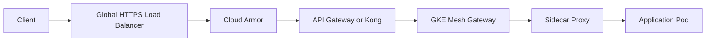
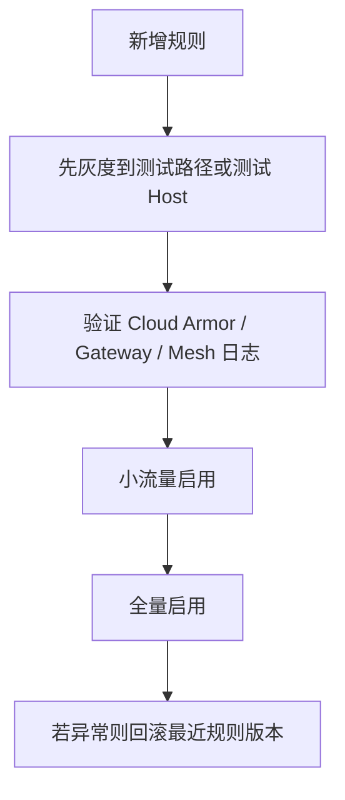

# Google Cloud Service Mesh 控制面设计

## 1. Goal and Constraints

### 目标

你现在关心的问题不是“怎么把 GKE 暴露出去”，而是：

- 当流量进入 GKE 之前，是否能先做一层统一控制
- 对某些 API 做更细粒度限制
- 对某些用户场景做差异化能力控制
- 希望判断哪些能力适合放在 `Google Cloud Service Mesh`，哪些不适合

你提到的典型需求包括：

- API 超时
- 上传文件大小限制
- 是否允许 upload
- 某些用户是否允许访问某些 API
- 希望在 GKE 入口之前先做判断或限制

### 核心结论

`Google Cloud Service Mesh` 可以做一部分控制，但**不能把它当成“全能 API 入口控制器”**。

更准确地说：

- `Cloud Service Mesh` 擅长：
  - 服务间流量治理
  - 超时、重试、熔断
  - JWT 校验后的授权
  - mTLS
  - 服务级路由
  - Mesh Gateway 边界策略
- `Cloud Service Mesh` 不擅长：
  - 上传文件大小这类 HTTP Body 细节治理
  - 很复杂的用户级 API 产品化能力控制
  - 强 API 生命周期管理
  - 在“流量进入 GKE 之前”的最外层做统一 WAF / Anti-Abuse / Bot / 大请求拦截

### 结论先说

如果你的目标是“在 GKE 入口之前先做限制”，推荐控制层次应该是：

1. `Global HTTPS Load Balancer + Cloud Armor`
2. `API Gateway / Kong / Apigee`
3. `Mesh Gateway`
4. `Service Mesh Sidecar`
5. `Application`

也就是说：

- **最外层拦截** 放在 `GLB + Cloud Armor`
- **API 级策略** 放在 `API Gateway`
- **服务到服务治理** 放在 `Cloud Service Mesh`
- **业务级权限和复杂规则** 最终仍然要回到应用层

### 复杂度

- 推荐 V1：`Moderate`
- 如果要把复杂用户能力控制强塞进 Mesh：`Advanced`，且不推荐作为第一选择

## 2. Recommended Architecture (V1)

### 推荐架构

对于你当前场景，最稳妥的设计不是“让 Service Mesh 单独承担入口治理”，而是让它在一个分层入口链路中承担中间治理角色。

推荐链路：

### 每一层的职责

| 层 | 推荐职责 | 是否适合你的需求 |
|---|---|---|
| `GLB` | TLS 终止、入口转发 | ✅ 必须有 |
| `Cloud Armor` | WAF、IP/Geo/基础防刷、大请求防护 | ✅ 适合“进入 GKE 前先拦截” |
| `API Gateway / Kong / Apigee` | API 产品化、Consumer 管理、细粒度入口策略 | ✅ 适合用户/API级控制 |
| `Mesh Gateway` | 入口到服务的统一路由、JWT、基础授权、超时/重试 | ✅ 适合边界治理 |
| `Sidecar / Mesh` | 服务间超时、重试、mTLS、熔断 | ✅ 这是 Mesh 强项 |
| `Application` | 复杂业务权限、上传语义、租户级规则 | ✅ 最终落点 |

### V1 推荐原则

- 不要让 `Cloud Service Mesh` 直接承担所有入口逻辑
- 如果只是为了“暴露 GKE”，`GKE Gateway` 或现有 `GLB` 仍是主入口
- `Service Mesh` 更适合作为：
  - `Gateway` 后面的治理层
  - Mesh 内部服务之间的流量控制层

## 3. Trade-offs and Alternatives

### 方案 A：只用 Cloud Service Mesh 做入口控制

优点：

- 组件少
- 配置统一在 Istio CRD

问题：

- 你会很快把 `EnvoyFilter` 用到失控
- 上传大小、复杂鉴权、复杂限流会越来越难维护
- 入口治理会和服务治理耦合在一起

结论：

- **不推荐**

### 方案 B：GLB + Cloud Armor + Mesh Gateway

优点：

- 最外层先拦截明显恶意流量
- Mesh Gateway 可以继续做 JWT、路由、超时等治理
- 比引入完整 API 网关更轻

缺点：

- 对“某些用户可以 upload、某些用户不行”这类能力控制不够优雅

结论：

- **适合作为最小可行版本**

### 方案 C：GLB + Cloud Armor + API Gateway + Mesh Gateway

优点：

- 分层最清晰
- API 生命周期、消费者、鉴权、限流、Header 操作更适合在网关层统一做
- Mesh 保持专注于服务治理

缺点：

- 组件更多
- 成本和运维复杂度更高

结论：

- **如果你有很多 API、很多个性化策略，这是长期正确方向**

## 4. Implementation Steps

### 4.1 先定义控制项，不要先定义 CRD

建议你先把需求拆成四类：

| 控制类型 | 示例 | 最适合放置位置 |
|---|---|---|
| 流量与连接控制 | timeout、retry、circuit breaking | `Mesh Gateway / VirtualService / DestinationRule` |
| 安全与身份控制 | JWT、用户角色、租户身份、来源限制 | `API Gateway` 或 `Mesh Gateway + AuthorizationPolicy` |
| 边缘防护控制 | WAF、IP 黑白名单、基础 Anti-Abuse | `Cloud Armor` |
| HTTP 协议细节控制 | 上传大小、Body 处理、复杂 Header 改写 | `API Gateway` 优先，Mesh 次选 |

这个拆分很关键。

因为你担心的很多“feature”看起来都像入口能力，但它们本质上不是同一类问题。

### 4.2 哪些能力适合放在 Cloud Service Mesh

#### 适合放在 Mesh 的能力

1. `API timeout`

- 非常适合放在 `VirtualService`
- 这是 Service Mesh 的标准能力

2. `retry`

- 非常适合放在 `VirtualService`
- 可按 path、host、route 做统一控制

3. `circuit breaking / connection pool`

- 适合放在 `DestinationRule`

4. `mTLS`

- 适合放在 `PeerAuthentication`、`DestinationRule`

5. `JWT 解析 + 基础授权`

- 可以通过 `RequestAuthentication + AuthorizationPolicy`
- 适合做：
  - 某类用户能不能访问某类 API
  - 某个 tenant 是否允许访问某个 path

6. `Path / Host / Header 路由`

- 非常适合 `Gateway + VirtualService`

#### 不适合主要放在 Mesh 的能力

1. `上传文件大小限制`

- Istio 原生 CRD 没有友好的高层字段
- 往往需要 `EnvoyFilter`
- 配置晦涩，维护成本高

2. `复杂用户能力开关`

- 例如：
  - VIP 用户可上传 500MB
  - 普通用户只能上传 20MB
  - 某些租户只允许某些文件类型

这种能力如果依赖请求体、动态规则、用户套餐、数据库状态，**不应该主要靠 Mesh 做**。

3. `全局 API 产品化治理`

- 比如：
  - consumer subscription
  - API key 生命周期
  - 配额包
  - 开发者门户

这些更像 `Apigee / Kong` 的职责

### 4.3 你提到的具体需求应该放哪里

| 需求 | 推荐位置 | 原因 |
|---|---|---|
| API 超时 | `VirtualService` | Mesh 原生能力，适合统一治理 |
| retry | `VirtualService` | 和 timeout 一样，适合 Mesh |
| 熔断 | `DestinationRule` | Mesh 原生能力 |
| 某用户是否允许 upload | `API Gateway` 或 `Mesh Gateway + JWT/AuthZ` | 简单 claim 判断可在 Mesh，复杂规则不建议 |
| 上传文件大小限制 | `API Gateway` 优先，`Cloud Armor` 次之，`EnvoyFilter` 兜底 | 这不是 Mesh 最擅长的能力 |
| 某 API 是否允许外部访问 | `Cloud Armor + Gateway + AuthorizationPolicy` | 分层最稳 |
| 某租户访问某 path | `AuthorizationPolicy` | Mesh 可以做得很好 |
| 某些 API 的复杂参数校验 | `Application` | 业务语义必须在应用里 |

### 4.4 如果你坚持想在 Mesh Gateway 入口做控制

那么推荐只把以下能力放到 Mesh Gateway：

- JWT 校验
- tenant / role 基础授权
- path / host 路由
- timeout / retry
- 简单 header 匹配
- 少量静态限流

不推荐在 Mesh Gateway 做：

- 大量 `EnvoyFilter`
- 复杂上传语义控制
- 强业务逻辑判断
- 依赖数据库状态的动态能力控制

### 4.5 V1 推荐落地方案

对于你当前需求，我建议 V1 这样做：

#### 入口前

- `Global HTTPS Load Balancer`
- `Cloud Armor`

控制内容：

- 基础 WAF
- IP / Geo 限制
- 恶意请求基础过滤
- 明显异常请求在进入 GKE 前拦截

#### GKE 边界

- `Mesh Gateway`

控制内容：

- JWT 验证
- host/path 路由
- timeout / retry
- 基础授权

#### 应用层

控制内容：

- upload 业务语义
- 用户套餐与能力判断
- 文件类型、业务字段、动态规则

这个分层是最稳的。

## 5. Validation and Rollback

### 你在设计时要先回答的验证问题

| 问题 | 推荐答案 |
|---|---|
| 这个控制是否必须在流量进入 GKE 前执行 | 是的话优先 `Cloud Armor / API Gateway` |
| 这个控制是否只是服务治理 | 是的话优先 `Mesh` |
| 这个控制是否依赖用户身份 claims | 简单则 `Mesh Gateway`，复杂则 `API Gateway / App` |
| 这个控制是否依赖请求体或业务数据 | 大概率放 `Application` |

### 回滚原则

入口控制改动一旦失败，影响面会很大，所以建议：

1. `Cloud Armor` 规则单独版本管理
2. `Gateway / VirtualService / AuthorizationPolicy` 走 GitOps
3. `EnvoyFilter` 变更必须单独审批
4. 所有入口规则都要有回滚版本

### 变更顺序建议

## 6. Reliability and Cost Optimizations

### 高可用设计建议

- 不要把所有 API 控制都堆到一个 `EnvoyFilter`
- Gateway 保持多副本
- Mesh Gateway 独立 node pool 更稳
- 把入口控制和服务治理分层，降低 blast radius

### 可靠性建议

- `VirtualService` 里统一设置 timeout / retry，避免后端被打穿
- `AuthorizationPolicy` 尽量做“显式允许”，不要做含糊规则
- `EnvoyFilter` 只用于 Mesh 原生能力做不到、且确实值得的场景

### 成本与维护建议

- 如果只是少量 API，`Cloud Armor + Mesh Gateway` 就够
- 如果 API 很多、消费者很多、策略很多，应该引入 `Kong` 或 `Apigee`
- 不要把 API 管理平台问题伪装成 Mesh 问题

## 7. Handoff Checklist

在决定采用 Cloud Service Mesh 做哪些控制前，建议确认以下清单：

- 是否明确区分“入口治理”和“服务治理”
- 是否明确哪些规则必须在进入 GKE 前拦截
- 是否明确哪些规则依赖 JWT claim
- 是否明确哪些规则依赖业务数据库状态
- 是否接受 `EnvoyFilter` 的长期维护成本
- 是否已有 `Cloud Armor` 作为外层第一道防线
- 是否需要 `Kong / Apigee` 承担 API 产品化治理
- 是否准备把 Gateway / Mesh 配置纳入 GitOps

## 最终建议

针对你的问题，我的直接建议是：

### 第一结论

`Google Cloud Service Mesh` **能做一部分细粒度控制，但不适合单独承担你说的所有入口 feature。**

### 第二结论

如果你强调“在 GKE 入口之前先做判断”，主控制点应该优先放在：

- `Global HTTPS LB`
- `Cloud Armor`
- `API Gateway / Kong / Apigee`

而不是首先想到 `Service Mesh`。

### 第三结论

`Cloud Service Mesh` 最适合你放进去的能力是：

- timeout
- retry
- route
- mTLS
- JWT 基础授权
- tenant/path 级访问控制

### 第四结论

像下面这些需求，不建议以 Mesh 为主实现：

- 上传文件大小限制
- 很复杂的用户级 feature 开关
- 依赖请求体内容的判断
- API 产品化能力

### 推荐 V1

| 控制层 | 你的需求建议 |
|---|---|
| `Cloud Armor` | 基础安全拦截，尽量在进入 GKE 前挡掉坏流量 |
| `API Gateway / Kong` | 用户/API 级 feature 控制 |
| `Mesh Gateway` | JWT、path/host 路由、timeout、retry、基础授权 |
| `Application` | upload 业务语义、复杂权限、动态规则 |

如果你愿意，我下一步可以继续直接补一版：

- `Cloud Armor + Mesh Gateway + AuthorizationPolicy` 的标准控制模板
- 或者一版“哪些需求放 Gateway，哪些放 Mesh，哪些放应用”的平台规范文档
