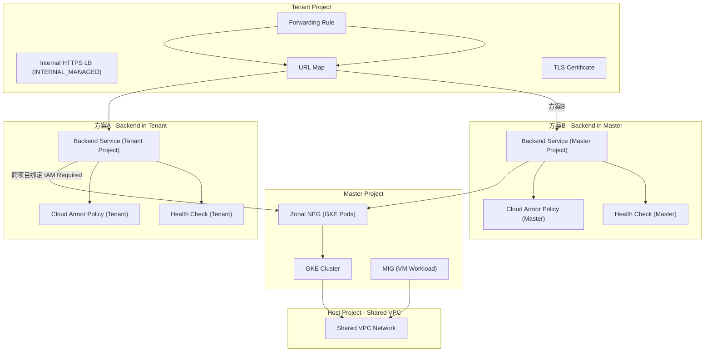
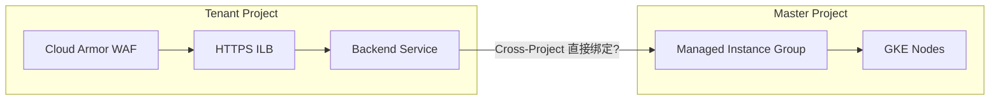
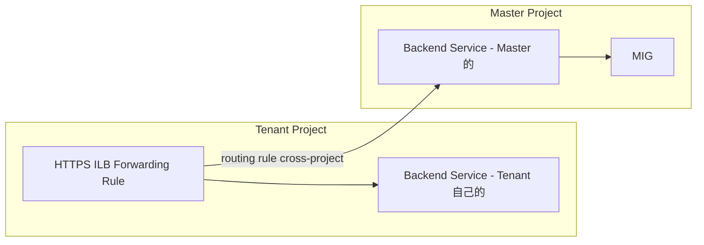
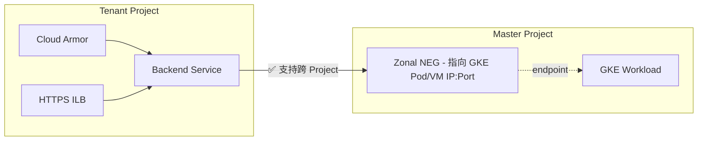
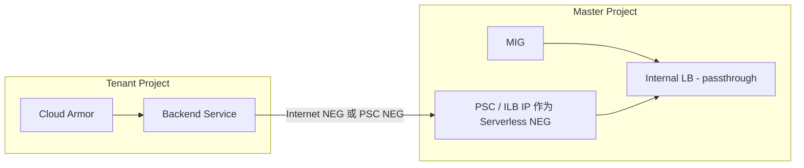
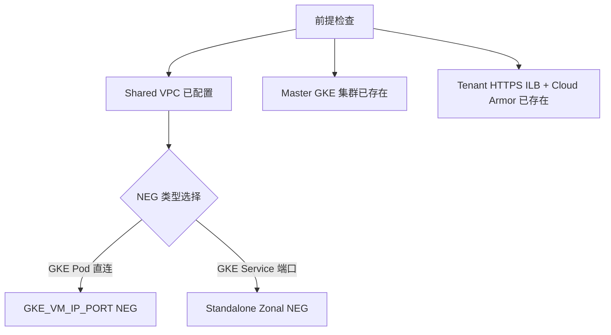
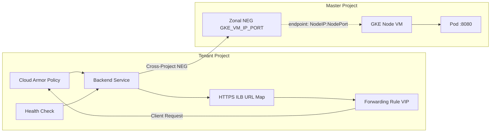
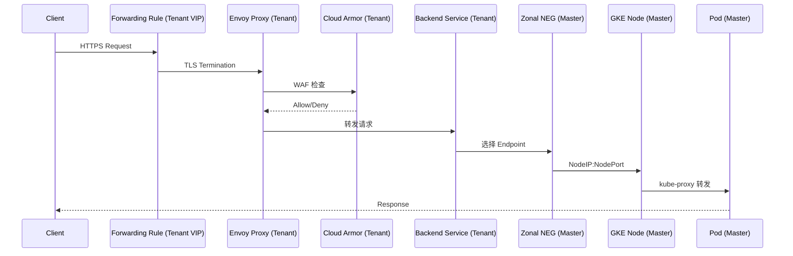

你帮我去探索 主题
在 Shared VPC 环境下 Internal HTTPS Load Balancer 跨项目绑定 Backend 的可行性确认
⸻
背景说明
我们正在 Google Cloud 上设计一个多租户架构，希望确认跨项目 Backend 绑定的官方支持方式。
当前架构
	•	Tenant 项目 主要是想要用户控制自己的入口 绑定自己对应的规则 比如说其对应的cloud armor 规则的改动，不会影响我们其他的用户也可以支持自己的独立机会 安全隐患分摊到tenant
	•	Internal HTTPS Load Balancer（INTERNAL_MANAGED）
	•	URL Map + Routing Rules
	•	Backend Service（归 Tenant 项目所有）
	•	Cloud Armor 绑定在 Backend Service 上
	•	TLS 证书在 Tenant 项目中管理
	•	Master 项目 这个也是我们平台方做一个核心来提供一些对应的GKE
	•	Managed Instance Group（MIG） GKE  neg
	•	运行 Compute Engine VM 工作负载 vm 通过一定的方式来暴露我们的GKE
	•	两个项目已挂载在同一个 Shared VPC（同一 Host Project + 同一 VPC）
⸻

目标架构

我们希望：
	•	保持 Internal HTTPS LB 和 Backend Service 在 Tenant 项目
                       我们已经实现了，通过修改tenant ilb 可以绑定到cross project到master的 backend service .当然虽然这个已经实现了， 我们也可以针对每个talent过来的用户创建自己对应的backend service 但是我可能还要评估一下对应的工程的授权情况要做安全评估，现在只是实现了访问
                        放在tenant好像必须得给tenant project的sa compuer.instanse的adm
	•	将 Tenant 项目的 Backend Service 绑定到 Master 项目中的 MIG 或者neg GKE
	•	Cloud Armor 依然在 Tenant 项目侧生效
	•	通过 Shared VPC 实现跨项目网络共享

希望确认的问题
	1.	在 Shared VPC 条件下，Backend Service（Project A）绑定 MIG（Project B）是否属于官方支持架构？
	2.	是否存在以下方面的限制或最佳实践：
	•	跨项目 IAM 权限要求
	•	Health Check 的归属和可见性
	•	Backend 生命周期管理影响
	•	Region 限制
	3.	在生产环境中是否存在已知风险或边界情况？
	4.	从 Google 推荐架构角度，是否更推荐：
	•	跨项目 MIG 绑定 以及该方案是否可行？
	•	跨项目 NEG 绑定以及该方案是否可行？
	•	或使用 Private Service Connect 实现更强隔离
如果这种方案可行的话，我们还需要考虑一下一些安全的设置，或者是对应工程授权的一些问题以及对应的一些计费原则，我们想对tenant的用户进行独立计费，也要考虑计费的方便性
我们希望在进入生产环境前确认该设计符合 Google Cloud 官方支持的架构模式。
所以我希望你至于上面的这个背景，我去探索一下是否能够实现
目前有两种架构实现方案可供评估：
方案一是将 Backend Server 部署在 Talent 项目中；方案二（即我当前的实现）是将 Backend Server 直接部署在 Master 项目下。方案 B 不是“共用一个 Backend Service”，而是“每个 Tenant 一个 Backend Service，但都在 Master 项目”。
除了安全性之外，我重点关注权限管控（Authorization）与计费架构（Billing）。
若采用全量部署在 Master 项目的方案，所有 Cloud Armor 的计费费用将由 Master 项目承担。且由于我需要在 Master 项目中创建多个不同的 Backend Server，各服务的计费维度也需要做进一步的拆分。


# Shared VPC 跨项目 Internal HTTPS LB 绑定 Backend 可行性分析

## 🔍 问题分析

核心问题是在 Shared VPC 环境下，评估两种架构方案的**可行性、权限模型、计费拆分**：

- **方案 A**：Backend Service 在 Tenant 项目，绑定 Master 项目的 MIG/NEG（跨项目 Backend 绑定）
- **方案 B**：Backend Service 在 Master 项目，每个 Tenant 独立一个 Backend Service（当前已实现）

---

## 🛠 可行性确认

### 方案 A：Backend Service（Tenant）→ MIG/NEG（Master）跨项目绑定

#### ✅ MIG 跨项目绑定

| 维度 | 结论 |
|------|------|
| 官方支持 | **有限支持**，需 Shared VPC 且满足 IAM 条件 |
| 网络层 | Shared VPC 同 VPC 网络下 **可达** |
| GCP API 层 | Backend Service 引用跨项目 MIG 需要显式 IAM 授权 |
| Health Check | **必须与 Backend Service 同项目**，或明确授权 |

**关键 IAM 授权要求（方案 A MIG）**：

```bash
# Tenant 项目的 Cloud Load Balancing Service Agent 需要访问 Master 项目的 MIG
# 在 Master 项目授权
gcloud projects add-iam-policy-binding <MASTER_PROJECT_ID> \
  --member="serviceAccount:service-<TENANT_PROJECT_NUMBER>@compute-system.iam.gserviceaccount.com" \
  --role="roles/compute.networkViewer"

# 同时需要授权访问 MIG
gcloud compute instance-groups managed add-iam-policy-binding <MIG_NAME> \
  --region=<REGION> \
  --member="serviceAccount:service-<TENANT_PROJECT_NUMBER>@compute-system.iam.gserviceaccount.com" \
  --role="roles/compute.viewer" \
  --project=<MASTER_PROJECT_ID>
```

#### ✅ NEG（GKE）跨项目绑定

| NEG 类型 | 跨项目支持 | 说明 |
|----------|-----------|------|
| Zonal NEG | ⚠️ 受限 | 需要 Shared VPC + 特定 IAM |
| Serverless NEG | ❌ 不支持跨项目 | 同项目限制 |
| Internet NEG | ❌ 不适用 | 外部场景 |
| **PSC NEG** | ✅ 推荐 | 通过 Private Service Connect 实现强隔离 |

---

### 方案 B：Backend Service 全在 Master 项目（当前实现）

```
✅ 完全官方支持，无跨项目 API 绑定问题
⚠️ 权限问题：Tenant 需要修改自己 ILB 的 URL Map 指向 Master 的 Backend Service
⚠️ 计费问题：Cloud Armor 费用全归 Master 项目
```

---

## 📊 两种方案架构对比



---

## 💳 计费架构分析

### 方案 A（Tenant 拥有 Backend Service）

| 费用项 | 归属 | 说明 |
|--------|------|------|
| ILB Forwarding Rule | Tenant 项目 | 按规则数计费 |
| Backend Service | Tenant 项目 | 免费资源对象 |
| **Cloud Armor** | **Tenant 项目** | ✅ 天然隔离，Tenant 自行承担 |
| 出站流量 | Shared VPC Host | 取决于流量路径 |
| Health Check | Tenant 项目 | 按探测次数计费 |

### 方案 B（Backend Service 全在 Master）

| 费用项 | 归属 | 问题 |
|--------|------|------|
| ILB Forwarding Rule | Tenant 项目 | ✅ 独立 |
| **Cloud Armor** | **Master 项目** | ❌ 无法直接拆分账单到 Tenant |
| Backend Service | Master 项目 | 混合在一起 |

**方案 B 计费拆分补救方案**：

```bash
# 通过 Labels 打标，再用 Billing Export 到 BigQuery 进行费用归因
gcloud compute backend-services update <BS_NAME_FOR_TENANT_X> \
  --global \
  --update-labels tenant=tenant-x,env=prod,cost-center=tenant-x-billing \
  --project=<MASTER_PROJECT_ID>

# BigQuery 查询示例（billing export 表）
# SELECT labels.value as tenant, SUM(cost) as total_cost
# FROM `billing_dataset.gcp_billing_export`
# WHERE labels.key = 'tenant'
# GROUP BY tenant
```

> ⚠️ Labels 计费拆分是 **软性拆分**，无法在 GCP Console 账单页直接体现到 Tenant 项目，需要通过 BigQuery Billing Export 二次分析。

---

## 🔐 权限管控（Authorization）关键差异

### 方案 A 权限矩阵

| 操作 | 执行方 | 所需权限 | 风险 |
|------|--------|----------|------|
| 修改 Cloud Armor | Tenant SA | `compute.securityPolicies.*`（Tenant 项目） | ✅ 低，租户自治 |
| 绑定跨项目 MIG | Tenant SA | `compute.instanceGroups.use`（Master 项目） | ⚠️ 需要精确授权 |
| 修改 Health Check | Tenant SA | `compute.healthChecks.*`（Tenant 项目） | ✅ 低 |
| 删除 Backend Service | Tenant SA | 需防止误删影响 LB | ⚠️ 需 OrgPolicy 保护 |

```bash
# 方案A：在 Master 项目给 Tenant SA 最小权限（仅允许 use MIG，不允许 delete）
gcloud projects add-iam-policy-binding <MASTER_PROJECT_ID> \
  --member="serviceAccount:<TENANT_SA>@<TENANT_PROJECT>.iam.gserviceaccount.com" \
  --role="roles/compute.viewer"

# 自定义 Role 仅授予 use 权限
gcloud iam roles create tenantMigUser \
  --project=<MASTER_PROJECT_ID> \
  --permissions="compute.instanceGroups.use,compute.instanceGroups.get"
```

### 方案 B 权限矩阵

| 操作 | 执行方 | 风险 |
|------|--------|------|
| 修改 Cloud Armor | Master SA / Platform Team | ❌ Tenant 无法自主修改，需通过平台接口 |
| 修改 URL Map | Tenant SA | ⚠️ 需授予 Tenant 对 Master 项目 URLMap 的写权限 |
| 隔离性 | — | ❌ 一个 SA 误操作可能影响多 Tenant |

---

## 📋 三种方案横向对比（含 PSC）

| 维度 | 方案A：跨项目 Backend | 方案B：Master 统一 Backend | 方案C：PSC 隔离 |
|------|----------------------|--------------------------|----------------|
| 官方支持度 | ⚠️ 有限支持，需 IAM 配置 | ✅ 完全支持 | ✅ 完全支持 |
| Cloud Armor 归属 | ✅ Tenant 独立 | ❌ Master 统一 | ✅ Tenant 独立 |
| 计费天然隔离 | ✅ 按项目自然隔离 | ❌ 需 Label + BigQuery | ✅ 按项目自然隔离 |
| Tenant 自治能力 | ✅ 高 | ⚠️ 低，依赖平台 | ✅ 高 |
| 实现复杂度 | ⚠️ 中（IAM 配置复杂） | ✅ 低（已实现） | ❌ 高（需 PSC 配置） |
| 网络安全隔离 | ⚠️ 中（同 VPC） | ⚠️ 中（同 VPC） | ✅ 强（服务边界隔离） |
| 跨项目 MIG 绑定 | ⚠️ 支持但非主流 | N/A | N/A |
| 跨项目 GKE NEG 绑定 | ⚠️ 受限 | N/A | ✅ via PSC NEG |

---

## ⚠️ 生产环境已知风险

### 方案 A 风险点

1. **Health Check 跨项目可见性**：Health Check 必须与 Backend Service **同项目**，无法直接探测跨项目 MIG 的私有 IP（需确认 Firewall 规则放行 `35.191.0.0/16` 和 `130.211.0.0/22` 到 Master 项目 VM）

```bash
# Master 项目必须放行 GCP Health Check 探针源 IP
gcloud compute firewall-rules create allow-health-check-from-tenant-lb \
  --network=<SHARED_VPC_NETWORK> \
  --action=ALLOW \
  --rules=tcp:<BACKEND_PORT> \
  --source-ranges=35.191.0.0/16,130.211.0.0/22 \
  --project=<MASTER_PROJECT_ID>
```

2. **跨项目 NEG 绑定 GKE**：GKE NEG 通常只能被**同项目**的 Backend Service 直接引用，跨项目引用需要通过 **PSC** 或者将 NEG 创建动作委托给 Master 项目

3. **Tenant SA 需要 `compute.instances.admin`**：你提到已发现这个问题，这个权限过大，应通过**自定义 Role** 缩小权限面

### 方案 B 风险点

1. Master 项目 SA 误操作影响范围扩大
2. Cloud Armor 规则变更需要平台团队介入，Tenant 自治性差
3. 计费无法在项目维度自然拆分

---

## 🏆 推荐结论

```
短期（已实现方案 B）：
  → 通过 Label + Billing Export BigQuery 实现软性计费拆分
  → 为每个 Tenant 的 Backend Service 统一打 tenant=xxx 标签
  → 用自定义 IAM Role 收紧 Tenant 对 Master 项目的操作权限

中期（演进到方案 A）：
  → 使用 Shared VPC + 跨项目 MIG 绑定（配合精确 IAM Custom Role）
  → Health Check 放在 Tenant 项目，Firewall 规则在 Master 项目放行
  → Cloud Armor 计费天然归 Tenant 项目

长期（规模化多租户）：
  → 考虑 Private Service Connect（PSC）
  → Master 项目发布 PSC Service Attachment
  → Tenant 项目通过 PSC NEG 接入，实现服务边界级隔离
  → 完全解耦两个项目的生命周期依赖
```

---

## 🔧 方案 A 落地最小 IAM 配置参考

```bash
# 1. 创建自定义 Role（Master 项目），仅允许 Tenant 引用 MIG/NEG，不允许删除
gcloud iam roles create crossProjectBackendUser \
  --project=<MASTER_PROJECT_ID> \
  --title="Cross Project Backend User" \
  --permissions="compute.instanceGroups.use,compute.instanceGroups.get,compute.networkEndpointGroups.use,compute.networkEndpointGroups.get,compute.instances.get"

# 2. 授权 Tenant 项目的 LB Service Agent
gcloud projects add-iam-policy-binding <MASTER_PROJECT_ID> \
  --member="serviceAccount:service-<TENANT_PROJECT_NUMBER>@compute-system.iam.gserviceaccount.com" \
  --role="projects/<MASTER_PROJECT_ID>/roles/crossProjectBackendUser"

# 3. 同时授权 compute.networkViewer 以便 LB 解析 Shared VPC 网络
gcloud projects add-iam-policy-binding <MASTER_PROJECT_ID> \
  --member="serviceAccount:service-<TENANT_PROJECT_NUMBER>@compute-system.iam.gserviceaccount.com" \
  --role="roles/compute.networkViewer"
```

---

**核心结论**：
- 方案 A（Tenant 拥有 Backend + 跨项目 MIG）**技术可行但 IAM 配置复杂**，Cloud Armor 和计费天然隔离，是长期推荐方向
- 方案 B（当前实现）**工程最简单**，但计费和权限隔离需要额外工程保障
- 如果你的核心诉求是 **Tenant 独立计费 + Cloud Armor 自治**，应优先推进方案 A 或 PSC 方案


# Gemini

This is a classic "Platform vs. Tenant" architectural challenge. In a Shared VPC environment, Google Cloud provides several paths, but the choice between Cross-Project Backend Attachment and Private Service Connect (PSC) hinges on how much "trust" you have between the Master and Tenant projects.
As your Technical Partner, here is the architectural breakdown and feasibility confirmation.
1. Feasibility Confirmation
Is it officially supported?
Yes. In a Shared VPC environment, a Regional Internal HTTP(S) Load Balancer (Project A) can officially reference Backends (NEGs or MIGs) located in Project B, provided both projects are service projects attached to the same Shared VPC Host Project.
Implementation Logic
 * The Network context: Since both projects share the same VPC, the underlying IP reachability is native.
 * The Resource context: The Backend Service (in Tenant Project) points to the self_link of the NEG or MIG (in Master Project).
 * The Region constraint: The ILB, Backend Service, and the NEGs/MIGs must reside in the same GCP Region. Cross-region backend binding is not supported for Internal HTTPS LBs.
2. Architecture Comparison: Option A vs. Option B vs. PSC
Based on your requirements for independent billing and Tenant-level Cloud Armor, here is how the options stack up:
| Feature | Option A: Backend Service in Tenant (Your Current) | Option B: Backend Service in Master | Option C: Private Service Connect (Recommended) |
|---|---|---|---|
| Cloud Armor Policy | Owned by Tenant | Owned by Master (Hard to split) | Owned by Tenant |
| Billing (LB + WAF) | Tenant Project | Master Project | Tenant Project |
| IAM Complexity | High (Cross-project perms) | Low | Medium |
| Security Isolation | Network-level (Shared VPC) | Shared | Consumer-Provider Abstraction |
| Scalability | Good | Hard to manage at scale | Best (Cleanest handoff) |
Why Private Service Connect (PSC) might be your "North Star"
While your current cross-project binding works, PSC is the Google-recommended way for multi-tenant platforms.
 * Producer (Master): You create a "Service Attachment" pointing to your GKE internal load balancer.
 * Consumer (Tenant): The tenant creates a PSC NEG in their project.
 * Result: The Tenant’s ILB points to the PSC NEG. The Tenant pays for their own ILB and Cloud Armor. You (Master) only pay for the GKE resources. No cross-project IAM on MIGs/NEGs is required.
3. Deep Dive: Cross-Project IAM & Permissions
If you stick with Option A (Backend Service in Tenant), you must solve the "Permission Leakage" issue you mentioned.
Required Roles
To allow the Tenant Project to "see" and "use" the Master Project's backends:
 * LB Service Agent: The service-PROJECT_NUMBER@gcp-sa-compute.iam.gserviceaccount.com in the Tenant Project needs:
   * roles/compute.networkUser on the Shared VPC Host subnet.
   * roles/compute.loadBalancerServiceUser on the Master Project (to bind NEGs).
 * Automation/User Identity: The principal creating the Backend Service needs compute.instances.use or compute.networkEndpointGroups.use on the Master resources.
> Risk Warning: Giving a Tenant Project Service Account compute.instanceAdmin on the Master project is a critical security risk. You should use a custom role or strictly scoped compute.loadBalancerServiceUser to ensure the Tenant cannot delete or modify your GKE nodes.
> 
4. Billing & Cost Attribution
In Option A (Tenant-side ILB/Backend Service):
 * Load Balancing Fees: Charged to the Tenant Project.
 * Cloud Armor Fees: Charged to the Tenant Project.
 * Data Processing: Charged to the project where the LB is defined (Tenant).
 * Compute (GKE Nodes): Charged to the Master Project.
This aligns perfectly with your goal of independent billing for security and traffic-heavy features (WAF).
5. Summary & Recommendation
Which Backend type?
 * Use NEGs (Network Endpoint Groups): Since you are on GKE, standalone NEGs are superior to MIGs. They allow container-native load balancing (skipping the NodePort hop), reducing latency and simplifying health checks.
Final Verdict
 * Immediate Fix (Current Path): Continue with Cross-Project NEG binding. Refine IAM: Remove instanceAdmin and replace it with compute.loadBalancerServiceUser at the project level, or better, granted only on specific NEGs via IAM conditions.
 * Structural Improvement (Long-term): Move to Private Service Connect (PSC). It removes the need for the Tenant to have any direct IAM visibility into your Master Project. The interface becomes a "Service Attachment" URL.
Next Step
Would you like me to provide the Terraform/YAML manifest for setting up a PSC Service Attachment in the Master project and a PSC NEG in the Tenant project to see how that simplifies your security boundary?


# Cross-Project Backend Service 绑定 Master MIG 可行性分析

## 澄清你的架构意图



---

## 结论：**不可行（硬限制）**

> GCP Backend Service **只能绑定同 Project 内的 Instance Group（MIG/UIG）**。  
> 这不是权限问题，是 GCP 资源引用模型的硬约束。

验证一下：
```bash
# 尝试跨 Project 添加 MIG 到 Backend Service 会直接报错
gcloud compute backend-services add-backend TENANT_BS \
    --instance-group=projects/MASTER_PROJECT/zones/ZONE/instanceGroups/master-mig \
    --project=TENANT_PROJECT_ID

# 报错：
# ERROR: Invalid value for field 'resource.backends[0].group':
# 'projects/MASTER_PROJECT/...' Backend must be in the same project
```

---

## 但你说的「Cross-Project Backend」是另一回事



**GCP 支持的 Cross-Project 是：**  
ILB 的 **URL Map routing rule** 直接引用另一个 Project 的 **Backend Service**  
→ 但 Cloud Armor Policy 是绑在 **Tenant 自己的 Backend Service** 上的  
→ 流量走到 Master 的 Backend Service 时，**Cloud Armor 不会生效**

---

## 你的核心诉求 vs 实际限制

| 诉求 | 是否可行 |
|------|---------|
| Cloud Armor 在 Tenant Project | ✅ |
| Backend Service 在 Tenant Project | ✅ |
| Tenant BS 直接绑定 Master MIG | ❌ 硬限制 |
| ILB routing 到 Master BS（Cloud Armor 失效） | ✅ 但不满足 WAF 需求 |

---

## 真正可行的方案：Cross-Project NEG（非 MIG）



**关键区别：MIG 不能跨 Project，但 NEG 可以。**

```bash
# Master Project 创建 NEG
gcloud compute network-endpoint-groups create master-workload-neg \
    --network-endpoint-type=GCE_VM_IP_PORT \
    --zone=ZONE \
    --project=MASTER_PROJECT_ID

# 添加 GKE Node/Pod endpoints
gcloud compute network-endpoint-groups update master-workload-neg \
    --add-endpoint='instance=INSTANCE_NAME,ip=POD_IP,port=8080' \
    --zone=ZONE \
    --project=MASTER_PROJECT_ID

# Tenant Project Backend Service 绑定 Master NEG ✅
gcloud compute backend-services add-backend TENANT_BS \
    --network-endpoint-group=projects/MASTER_PROJECT_ID/zones/ZONE/networkEndpointGroups/master-workload-neg \
    --network-endpoint-group-zone=ZONE \
    --project=TENANT_PROJECT_ID \
    --global
```

---

## 如果你的 Master 必须用 MIG，唯一路径



在 Tenant BS 里用 **Private Service Connect NEG** 或 **Hybrid NEG** 指向 Master 的 Internal LB IP，间接打通，Cloud Armor 依然在 Tenant 侧生效。

---

## 总结建议

**如果 Master 是 GKE** → 改用 Cross-Project Zonal NEG，完全满足你的需求  
**如果 Master 必须是 MIG** → PSC NEG 间接绑定，多一跳但 WAF 不受影响


# Cross-Project Zonal NEG 方案细化

## 前提条件确认



---

## 整体架构



---

## 详细实施步骤

### Step 1：Master Project - 准备 GKE Service 暴露方式

GKE 侧需要让流量可以通过 **NodePort** 或 **Pod IP 直连** 进来：

```yaml
# Master Project - K8s Service 使用 NodePort
apiVersion: v1
kind: Service
metadata:
  name: master-workload-svc
  namespace: default
spec:
  type: NodePort
  selector:
    app: master-workload
  ports:
    - port: 80
      targetPort: 8080
      nodePort: 30080   # 固定 NodePort，便于 NEG 配置
```

```bash
kubectl apply -f service.yaml --context=MASTER_GKE_CONTEXT
```

---

### Step 2：Master Project - 创建 Standalone Zonal NEG

```bash
# 创建 NEG，网络指向 Shared VPC
gcloud compute network-endpoint-groups create master-gke-neg \
    --network-endpoint-type=GCE_VM_IP_PORT \
    --zone=asia-east1-b \
    --network=projects/HOST_PROJECT_ID/global/networks/SHARED_VPC_NAME \
    --subnetwork=projects/HOST_PROJECT_ID/regions/asia-east1/subnetworks/SUBNET_NAME \
    --project=MASTER_PROJECT_ID

# 查看 GKE Node 实例名
kubectl get nodes -o wide --context=MASTER_GKE_CONTEXT
# 记录 NODE_NAME 和 INTERNAL_IP

# 将 GKE Node 加入 NEG（NodePort 方式）
gcloud compute network-endpoint-groups update master-gke-neg \
    --add-endpoint='instance=GKE_NODE_INSTANCE_NAME,ip=NODE_INTERNAL_IP,port=30080' \
    --zone=asia-east1-b \
    --project=MASTER_PROJECT_ID

# 多节点全部加入
gcloud compute network-endpoint-groups update master-gke-neg \
    --add-endpoint='instance=GKE_NODE_2,ip=NODE_2_IP,port=30080' \
    --zone=asia-east1-b \
    --project=MASTER_PROJECT_ID
```

> ⚠️ GKE 节点 Auto Scaling 时，需要自动同步 NEG endpoints，见 Step 6。

---

### Step 3：IAM 授权 - Tenant 可以使用 Master NEG

```bash
# 方式一：精细化到具体 NEG 资源（推荐）
gcloud compute network-endpoint-groups add-iam-policy-binding master-gke-neg \
    --member="serviceAccount:TENANT_COMPUTE_SA@TENANT_PROJECT.iam.gserviceaccount.com" \
    --role="roles/compute.networkEndpointGroupAdmin" \
    --zone=asia-east1-b \
    --project=MASTER_PROJECT_ID

# 方式二：Project 级别（权限较大，不推荐生产）
gcloud projects add-iam-policy-binding MASTER_PROJECT_ID \
    --member="serviceAccount:TENANT_COMPUTE_SA@TENANT_PROJECT.iam.gserviceaccount.com" \
    --role="roles/compute.networkViewer"
```

---

### Step 4：Tenant Project - Backend Service 绑定 Master NEG

```bash
# 4.1 创建 Health Check（在 Tenant Project，探测 Master GKE NodePort）
gcloud compute health-checks create http master-neg-hc \
    --port=30080 \
    --request-path=/healthz \
    --check-interval=10s \
    --timeout=5s \
    --healthy-threshold=2 \
    --unhealthy-threshold=3 \
    --project=TENANT_PROJECT_ID \
    --global

# 4.2 创建 Backend Service 并绑定 Cloud Armor
gcloud compute backend-services create tenant-bs-master \
    --protocol=HTTP \
    --health-checks=master-neg-hc \
    --security-policy=YOUR_CLOUD_ARMOR_POLICY \
    --global \
    --project=TENANT_PROJECT_ID

# 4.3 绑定 Master Project 的 NEG ✅
gcloud compute backend-services add-backend tenant-bs-master \
    --network-endpoint-group=projects/MASTER_PROJECT_ID/zones/asia-east1-b/networkEndpointGroups/master-gke-neg \
    --network-endpoint-group-zone=asia-east1-b \
    --balancing-mode=RATE \
    --max-rate-per-endpoint=100 \
    --global \
    --project=TENANT_PROJECT_ID
```

---

### Step 5：防火墙规则 - 允许 Health Check 和流量进入 Master GKE

```bash
# Health Check 源 IP 范围（GCP 固定）
gcloud compute firewall-rules create allow-tenant-hc-to-master-gke \
    --network=SHARED_VPC_NAME \
    --allow=tcp:30080 \
    --source-ranges=130.211.0.0/22,35.191.0.0/16 \
    --target-tags=gke-MASTER_CLUSTER_NAME-node \
    --project=HOST_PROJECT_ID \   # 防火墙规则在 Host Project
    --description="Allow GCP HC to Master GKE NodePort"

# 允许 ILB Proxy 子网流量到 Master GKE
gcloud compute firewall-rules create allow-tenant-ilb-to-master-gke \
    --network=SHARED_VPC_NAME \
    --allow=tcp:30080 \
    --source-ranges=PROXY_SUBNET_CIDR \
    --target-tags=gke-MASTER_CLUSTER_NAME-node \
    --project=HOST_PROJECT_ID
```

---

### Step 6：Node 动态扩缩容时 NEG 自动同步

GKE 节点变化时需要自动更新 NEG，推荐使用 **GKE + Custom Controller** 或脚本：

```bash
# 方案：GKE Node 加 label，配合 DaemonSet 自注册（简化版用脚本）
# 监听 GKE Node 变化，自动 add/remove NEG endpoint

#!/bin/bash
# sync-neg-endpoints.sh

ZONE="asia-east1-b"
NEG_NAME="master-gke-neg"
MASTER_PROJECT="MASTER_PROJECT_ID"
NODE_PORT="30080"

# 获取当前所有 Ready Node
CURRENT_NODES=$(kubectl get nodes --context=MASTER_GKE_CONTEXT \
    -o jsonpath='{range .items[*]}{.metadata.name},{.status.addresses[?(@.type=="InternalIP")].address}{"\n"}{end}')

# 获取当前 NEG 中的 endpoints
CURRENT_NEG=$(gcloud compute network-endpoint-groups list-network-endpoints $NEG_NAME \
    --zone=$ZONE --project=$MASTER_PROJECT \
    --format="value(networkEndpoint.instance,networkEndpoint.ipAddress)")

echo "$CURRENT_NODES" | while IFS=',' read -r name ip; do
    gcloud compute network-endpoint-groups update $NEG_NAME \
        --add-endpoint="instance=$name,ip=$ip,port=$NODE_PORT" \
        --zone=$ZONE \
        --project=$MASTER_PROJECT 2>/dev/null
done
```

> 💡 **更优方案**：使用 GKE Ingress with Container-native Load Balancing，GKE 会自动管理 NEG endpoints，但这需要 GKE 侧也做对应配置。

---

## 完整流量路径验证



---

## 关键注意事项

| 项目 | 注意点 |
|------|--------|
| NEG 与 GKE 同 Zone | NEG 必须在 GKE Node 相同的 Zone，多 Zone 需创建多个 NEG |
| Health Check 端口 | 需要与 NodePort 一致，且防火墙放通 HC 源 IP |
| GKE Node Autoscaler | 节点扩缩容需要同步更新 NEG endpoints |
| Shared VPC 子网 | NEG 创建时必须指定 Shared VPC 的 subnet |
| Cloud Armor 生效位置 | 绑定在 Tenant BS 上，在流量进入 NEG 之前已生效 ✅ |
| 多 Zone 高可用 | 每个 Zone 创建独立 NEG，BS 绑定所有 Zone 的 NEG |