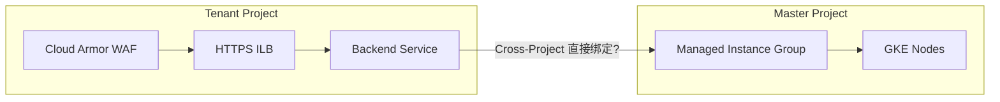
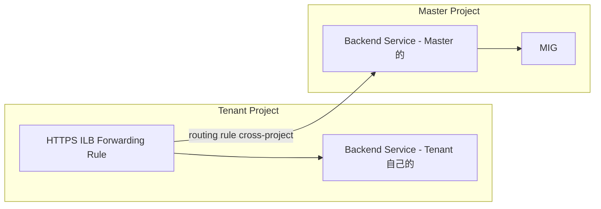
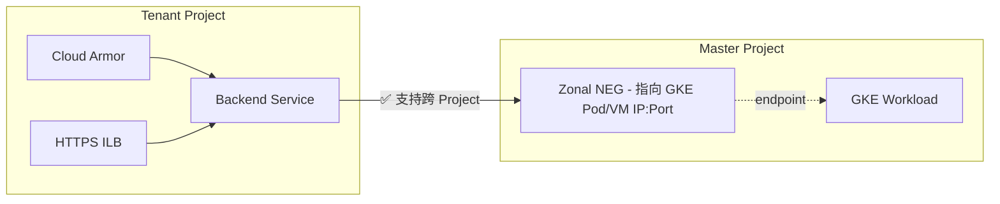
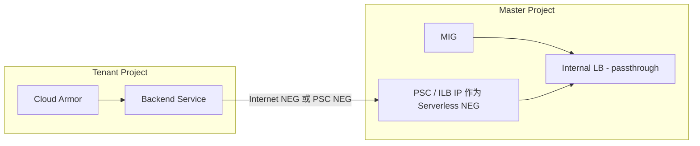
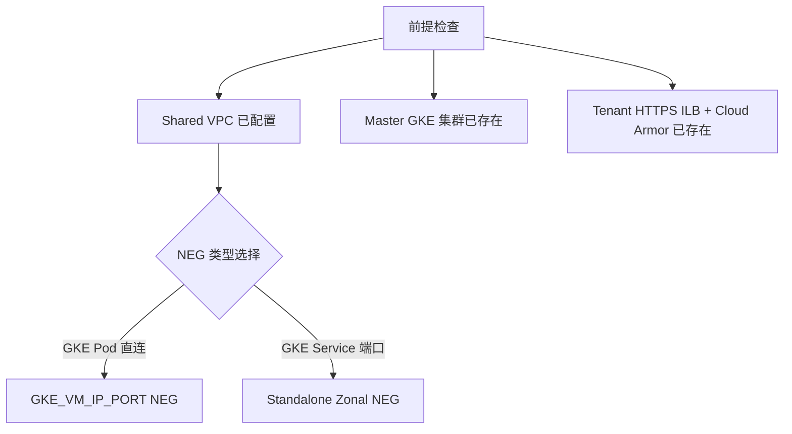
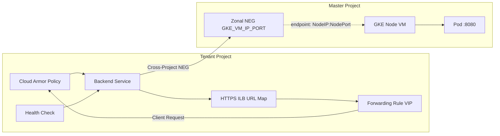
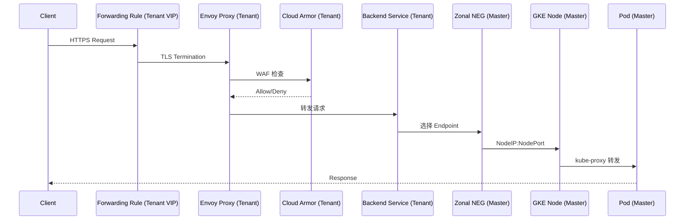

# Cross-Project Backend Service 绑定 Master MIG 可行性分析

## 澄清你的架构意图



---

## 结论：**不可行（硬限制）**

> GCP Backend Service **只能绑定同 Project 内的 Instance Group（MIG/UIG）**。  
> 这不是权限问题，是 GCP 资源引用模型的硬约束。

验证一下：
```bash
# 尝试跨 Project 添加 MIG 到 Backend Service 会直接报错
gcloud compute backend-services add-backend TENANT_BS \
    --instance-group=projects/MASTER_PROJECT/zones/ZONE/instanceGroups/master-mig \
    --project=TENANT_PROJECT_ID

# 报错：
# ERROR: Invalid value for field 'resource.backends[0].group':
# 'projects/MASTER_PROJECT/...' Backend must be in the same project
```

---

## 但你说的「Cross-Project Backend」是另一回事



**GCP 支持的 Cross-Project 是：**  
ILB 的 **URL Map routing rule** 直接引用另一个 Project 的 **Backend Service**  
→ 但 Cloud Armor Policy 是绑在 **Tenant 自己的 Backend Service** 上的  
→ 流量走到 Master 的 Backend Service 时，**Cloud Armor 不会生效**

---

## 你的核心诉求 vs 实际限制

| 诉求 | 是否可行 |
|------|---------|
| Cloud Armor 在 Tenant Project | ✅ |
| Backend Service 在 Tenant Project | ✅ |
| Tenant BS 直接绑定 Master MIG | ❌ 硬限制 |
| ILB routing 到 Master BS（Cloud Armor 失效） | ✅ 但不满足 WAF 需求 |

---

## 真正可行的方案：Cross-Project NEG（非 MIG）



**关键区别：MIG 不能跨 Project，但 NEG 可以。**

```bash
# Master Project 创建 NEG
gcloud compute network-endpoint-groups create master-workload-neg \
    --network-endpoint-type=GCE_VM_IP_PORT \
    --zone=ZONE \
    --project=MASTER_PROJECT_ID

# 添加 GKE Node/Pod endpoints
gcloud compute network-endpoint-groups update master-workload-neg \
    --add-endpoint='instance=INSTANCE_NAME,ip=POD_IP,port=8080' \
    --zone=ZONE \
    --project=MASTER_PROJECT_ID

# Tenant Project Backend Service 绑定 Master NEG ✅
gcloud compute backend-services add-backend TENANT_BS \
    --network-endpoint-group=projects/MASTER_PROJECT_ID/zones/ZONE/networkEndpointGroups/master-workload-neg \
    --network-endpoint-group-zone=ZONE \
    --project=TENANT_PROJECT_ID \
    --global
```

---

## 如果你的 Master 必须用 MIG，唯一路径



在 Tenant BS 里用 **Private Service Connect NEG** 或 **Hybrid NEG** 指向 Master 的 Internal LB IP，间接打通，Cloud Armor 依然在 Tenant 侧生效。

---

## 总结建议

**如果 Master 是 GKE** → 改用 Cross-Project Zonal NEG，完全满足你的需求  
**如果 Master 必须是 MIG** → PSC NEG 间接绑定，多一跳但 WAF 不受影响


# Cross-Project Zonal NEG 方案细化

## 前提条件确认



---

## 整体架构



---

## 详细实施步骤

### Step 1：Master Project - 准备 GKE Service 暴露方式

GKE 侧需要让流量可以通过 **NodePort** 或 **Pod IP 直连** 进来：

```yaml
# Master Project - K8s Service 使用 NodePort
apiVersion: v1
kind: Service
metadata:
  name: master-workload-svc
  namespace: default
spec:
  type: NodePort
  selector:
    app: master-workload
  ports:
    - port: 80
      targetPort: 8080
      nodePort: 30080   # 固定 NodePort，便于 NEG 配置
```

```bash
kubectl apply -f service.yaml --context=MASTER_GKE_CONTEXT
```

---

### Step 2：Master Project - 创建 Standalone Zonal NEG

```bash
# 创建 NEG，网络指向 Shared VPC
gcloud compute network-endpoint-groups create master-gke-neg \
    --network-endpoint-type=GCE_VM_IP_PORT \
    --zone=asia-east1-b \
    --network=projects/HOST_PROJECT_ID/global/networks/SHARED_VPC_NAME \
    --subnetwork=projects/HOST_PROJECT_ID/regions/asia-east1/subnetworks/SUBNET_NAME \
    --project=MASTER_PROJECT_ID

# 查看 GKE Node 实例名
kubectl get nodes -o wide --context=MASTER_GKE_CONTEXT
# 记录 NODE_NAME 和 INTERNAL_IP

# 将 GKE Node 加入 NEG（NodePort 方式）
gcloud compute network-endpoint-groups update master-gke-neg \
    --add-endpoint='instance=GKE_NODE_INSTANCE_NAME,ip=NODE_INTERNAL_IP,port=30080' \
    --zone=asia-east1-b \
    --project=MASTER_PROJECT_ID

# 多节点全部加入
gcloud compute network-endpoint-groups update master-gke-neg \
    --add-endpoint='instance=GKE_NODE_2,ip=NODE_2_IP,port=30080' \
    --zone=asia-east1-b \
    --project=MASTER_PROJECT_ID
```

> ⚠️ GKE 节点 Auto Scaling 时，需要自动同步 NEG endpoints，见 Step 6。

---

### Step 3：IAM 授权 - Tenant 可以使用 Master NEG

```bash
# 方式一：精细化到具体 NEG 资源（推荐）
gcloud compute network-endpoint-groups add-iam-policy-binding master-gke-neg \
    --member="serviceAccount:TENANT_COMPUTE_SA@TENANT_PROJECT.iam.gserviceaccount.com" \
    --role="roles/compute.networkEndpointGroupAdmin" \
    --zone=asia-east1-b \
    --project=MASTER_PROJECT_ID

# 方式二：Project 级别（权限较大，不推荐生产）
gcloud projects add-iam-policy-binding MASTER_PROJECT_ID \
    --member="serviceAccount:TENANT_COMPUTE_SA@TENANT_PROJECT.iam.gserviceaccount.com" \
    --role="roles/compute.networkViewer"
```

---

### Step 4：Tenant Project - Backend Service 绑定 Master NEG

```bash
# 4.1 创建 Health Check（在 Tenant Project，探测 Master GKE NodePort）
gcloud compute health-checks create http master-neg-hc \
    --port=30080 \
    --request-path=/healthz \
    --check-interval=10s \
    --timeout=5s \
    --healthy-threshold=2 \
    --unhealthy-threshold=3 \
    --project=TENANT_PROJECT_ID \
    --global

# 4.2 创建 Backend Service 并绑定 Cloud Armor
gcloud compute backend-services create tenant-bs-master \
    --protocol=HTTP \
    --health-checks=master-neg-hc \
    --security-policy=YOUR_CLOUD_ARMOR_POLICY \
    --global \
    --project=TENANT_PROJECT_ID

# 4.3 绑定 Master Project 的 NEG ✅
gcloud compute backend-services add-backend tenant-bs-master \
    --network-endpoint-group=projects/MASTER_PROJECT_ID/zones/asia-east1-b/networkEndpointGroups/master-gke-neg \
    --network-endpoint-group-zone=asia-east1-b \
    --balancing-mode=RATE \
    --max-rate-per-endpoint=100 \
    --global \
    --project=TENANT_PROJECT_ID
```

---

### Step 5：防火墙规则 - 允许 Health Check 和流量进入 Master GKE

```bash
# Health Check 源 IP 范围（GCP 固定）
gcloud compute firewall-rules create allow-tenant-hc-to-master-gke \
    --network=SHARED_VPC_NAME \
    --allow=tcp:30080 \
    --source-ranges=130.211.0.0/22,35.191.0.0/16 \
    --target-tags=gke-MASTER_CLUSTER_NAME-node \
    --project=HOST_PROJECT_ID \   # 防火墙规则在 Host Project
    --description="Allow GCP HC to Master GKE NodePort"

# 允许 ILB Proxy 子网流量到 Master GKE
gcloud compute firewall-rules create allow-tenant-ilb-to-master-gke \
    --network=SHARED_VPC_NAME \
    --allow=tcp:30080 \
    --source-ranges=PROXY_SUBNET_CIDR \
    --target-tags=gke-MASTER_CLUSTER_NAME-node \
    --project=HOST_PROJECT_ID
```

---

### Step 6：Node 动态扩缩容时 NEG 自动同步

GKE 节点变化时需要自动更新 NEG，推荐使用 **GKE + Custom Controller** 或脚本：

```bash
# 方案：GKE Node 加 label，配合 DaemonSet 自注册（简化版用脚本）
# 监听 GKE Node 变化，自动 add/remove NEG endpoint

#!/bin/bash
# sync-neg-endpoints.sh

ZONE="asia-east1-b"
NEG_NAME="master-gke-neg"
MASTER_PROJECT="MASTER_PROJECT_ID"
NODE_PORT="30080"

# 获取当前所有 Ready Node
CURRENT_NODES=$(kubectl get nodes --context=MASTER_GKE_CONTEXT \
    -o jsonpath='{range .items[*]}{.metadata.name},{.status.addresses[?(@.type=="InternalIP")].address}{"\n"}{end}')

# 获取当前 NEG 中的 endpoints
CURRENT_NEG=$(gcloud compute network-endpoint-groups list-network-endpoints $NEG_NAME \
    --zone=$ZONE --project=$MASTER_PROJECT \
    --format="value(networkEndpoint.instance,networkEndpoint.ipAddress)")

echo "$CURRENT_NODES" | while IFS=',' read -r name ip; do
    gcloud compute network-endpoint-groups update $NEG_NAME \
        --add-endpoint="instance=$name,ip=$ip,port=$NODE_PORT" \
        --zone=$ZONE \
        --project=$MASTER_PROJECT 2>/dev/null
done
```

> 💡 **更优方案**：使用 GKE Ingress with Container-native Load Balancing，GKE 会自动管理 NEG endpoints，但这需要 GKE 侧也做对应配置。

---

## 完整流量路径验证



---

## 关键注意事项

| 项目 | 注意点 |
|------|--------|
| NEG 与 GKE 同 Zone | NEG 必须在 GKE Node 相同的 Zone，多 Zone 需创建多个 NEG |
| Health Check 端口 | 需要与 NodePort 一致，且防火墙放通 HC 源 IP |
| GKE Node Autoscaler | 节点扩缩容需要同步更新 NEG endpoints |
| Shared VPC 子网 | NEG 创建时必须指定 Shared VPC 的 subnet |
| Cloud Armor 生效位置 | 绑定在 Tenant BS 上，在流量进入 NEG 之前已生效 ✅ |
| 多 Zone 高可用 | 每个 Zone 创建独立 NEG，BS 绑定所有 Zone 的 NEG |